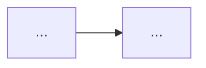
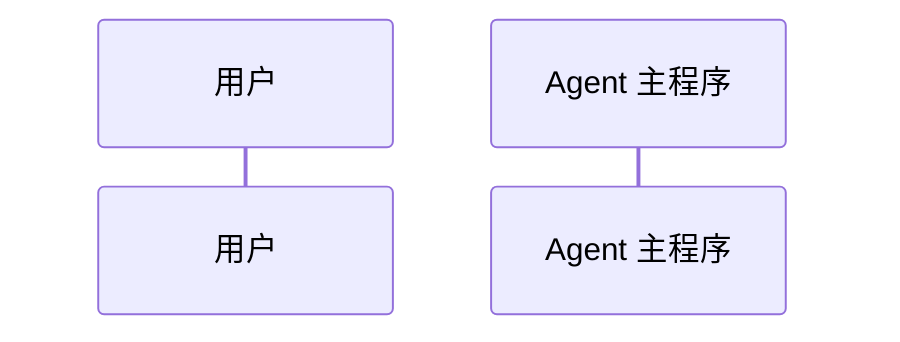

# Video Fieldbook Note Template

Use this structure for generated video notes. Adapt headings to the video, but keep the archive judgment and verification boundary.

```markdown
# <Video Title>

日期：YYYY-MM-DD

来源视频：<title>（<url>）

频道：<channel>

发布时间：YYYY-MM-DD

时长：HH:MM:SS

本地素材：

- 视频：`local-media/youtube/<slug>/<file>.mp4`
- QuickTime 兼容视频：`local-media/youtube/<slug>/<file>.quicktime.mp4`
- 字幕：`local-media/youtube/<slug>/<file>.zh-Hans.srt`
- 字幕说明：<如果是本地 ASR，说明 YouTube 未暴露标准字幕轨道，字幕由 `whisper.cpp` 生成且未逐句人工校对。>
- 元数据：`local-media/youtube/<slug>/<file>.info.json`
- 关键画面抽帧：`local-media/youtube/<slug>/frames/`
- 评论原始数据：`local-media/youtube/<slug>/comments.json`
- 评论摘要素材：`local-media/youtube/<slug>/comments-digest.md`

说明：`local-media/` 是本地沉淀目录，不应提交进 Git。

## 配套资源 / 代码地址

- 视频：...
- 代码仓库：<GitHub/Gitee/GitLab/etc. URL；如果未找到，写“视频简介/元数据中未发现具体代码仓库地址”。>
- 其他资料：<文档、课程页、项目主页；没有就写“未发现”。>

## 评论区补充

<总结置顶评论、作者回复、高赞评论中的代码链接、纠错、实现细节、环境提醒和概念澄清。忽略广告、水评和无关内容。>

## Fieldbook 归档判断

- 内容类型：<资料消化 / 技术研究 / 工具观察 / 案例拆解 / 实验验证>
- 当前归档：`notes/`
- 是否值得升级为 lab：<是 / 否>
- 判断理由：<如果值得升级，说明要验证哪个 API、SDK、工具链、失败模式或工程判断；如果不值得，说明为什么停留在笔记或研究记录即可。>
- 后续应进入：<`research/` / `labs/` / 暂不升级>

## 一句话结论

<把视频最核心的判断压缩成一段。>

## 视频时间轴

| 时间 | 主题 | 要点 |
|---|---|---|
| 00:00 | <chapter> | <why it matters> |

## 1. <核心概念>

<用自己的话解释，不要贴字幕。>



## 2. <运行流程 / 架构 / 代码逻辑>

<结合字幕和关键帧重建流程。>



## 工程提醒

1. <权限、人审、状态、工具边界、失败处理。>

## 工程判断

- 适合什么场景：<这个能力、工具或方法适合解决什么现实问题。>
- 不适合什么场景：<什么时候不该用，或者用它会把问题搞复杂。>
- 风险和边界：<权限、成本、可靠性、状态管理、评估、数据安全等。>

## 后续研究问题

- <哪些点需要查官方文档、源码、论文、案例或真实项目。>

## 实验验证建议

- 要验证什么：<具体判断，不要写泛泛的“学习一下”。>
- 最小实验形式：<CLI、Notebook、小型 Agent、对比脚本、复现实验等。>
- 是否现在就做：<是 / 否；说明原因。>

## 参考资料

- 视频：...
- 官方文档或论文：...

## 未验证事项

- 本笔记基于字幕、元数据和关键画面整理。
- <没有运行的示例代码、没有核对的 API、没有复现的实验。>
```
