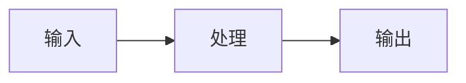

# Video-To-Wiki Note Template

Use this structure for compiled video notes. Adapt headings to the material, but keep the frontmatter, `source_refs`, upgrade checklist, and verification boundary.

````markdown
---
type: note
domain: <ai | software-engineering | product-business | learning-research | life | reading | finance | health | misc>
status: draft
created: YYYY-MM-DD
updated: YYYY-MM-DD
source_refs:
  - <original video URL>
  - raw/sources/<domain>/videos/<YYYY-MM-DD-title-slug>.md
  - raw/assets/local-media/youtube/<slug>/asset-manifest.md
---

# <Video Title>

## 这是什么

用一句话说明这个视频来源、主题、用途，以及为什么值得进入知识库。

## 核心观点

- <把视频中真正有长期价值的判断压缩出来。不要复述标题。>

## 我的理解

用自己的中文解释材料。不要贴字幕，不要堆元数据，不要把评论区说法直接当事实。

## 关键时间线

| 时间 | 主题 | 要点 |
|---|---|---|
| 00:00 | <chapter> | <why it matters> |

## 关键流程

<只有当视频包含流程、架构、交互、状态循环或数据流时才写这一节。没有就删除。>



## 工程判断

- 适合什么场景：<这个方法、工具或观点适合解决什么现实问题。>
- 不适合什么场景：<什么时候不该用，或者会把问题搞复杂。>
- 风险和边界：<权限、成本、可靠性、状态管理、评估、数据安全等。>

## 配套资源 / 代码地址

- 视频：<original video URL>
- 来源文档：raw/sources/<domain>/videos/<YYYY-MM-DD-title-slug>.md
- 本地资产：raw/assets/local-media/youtube/<slug>/asset-manifest.md
- 代码仓库：<GitHub/Gitee/GitLab/Hugging Face/etc. URL；如果未找到，写“视频简介、元数据和评论中未发现具体代码仓库地址”。>
- 其他资料：<官方文档、课程页、项目主页；没有就写“未发现”。>

## 评论区线索

<只总结置顶评论、作者回复、高赞评论中的代码链接、纠错、实现细节、环境提醒和概念澄清。忽略广告、水评和无关内容。没有高价值评论就写“未发现可用线索”。>

## 后续问题

- <哪些点需要查官方文档、源码、论文、案例或真实项目。>

## 是否需要升级

- [ ] 升级到 `wiki/topics/`
- [ ] 升级到 `wiki/research/`
- [ ] 升级到 `wiki/labs/`
- [ ] 暂不升级

升级理由：<如果升级，说明要沉淀哪个稳定判断、研究哪个问题、验证哪个 API/SDK/工具链/失败模式；如果不升级，说明为什么停留在资料笔记即可。>

## 未验证事项

- 本笔记基于字幕、元数据、评论摘要和关键画面整理。
- <如果是本地 ASR：字幕由本地 `whisper.cpp` ASR 生成，未逐句人工校对。>
- <没有运行的示例代码、没有核对的 API、没有复现的实验。>
````
