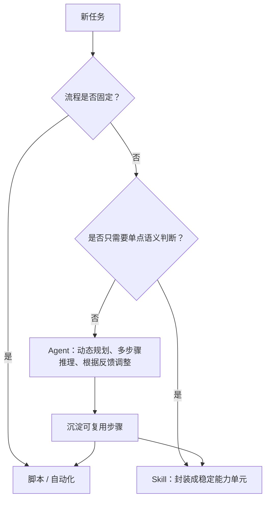
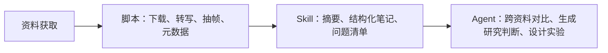

# 能用脚本就别用 Agent：脚本 / Skill / Agent 的能力分层

日期：2026-05-12

来源文章：[能用脚本就别用Agent。](https://mp.weixin.qq.com/s/GAZ45bXuSyk793JbnTg__g)

公众号：数字生命卡兹克

发布时间：2026-03-17 18:44

作者：数字生命卡兹克

## 一句话结论

这篇文章真正有价值的地方不是“贬低 Agent”，而是给 Agent 落地划了一个很实用的优先级：确定性任务先脚本化，半确定但需要模型判断的能力做成 Skill，只有路径不可预知、需要动态规划和复杂判断的任务才交给 Agent。

换句话说，Agent 不应该是默认答案。Agent 应该是自动化能力体系里最后一层，而不是第一层。

## 核心观点

作者把日常工作里的 AI 使用方式分成三层：

1. 脚本：输入、输出、处理逻辑都固定的任务，直接写脚本或自动化流程。
2. Skill：流程相对明确，但中间需要大模型做语义判断、泛化理解或评分的任务。
3. Agent：无法预先固定步骤，需要根据中间结果不断调整策略的任务。

这三个层次不是互相替代，而是一个循环：Agent 可以帮助人创造脚本和 Skill，脚本和 Skill 再把重复能力沉淀下来，减少以后对 Agent 的依赖。



## 我的工程判断

这篇文章的判断是对的，而且和本仓库的研究原则一致：不要上来就做多 Agent，也不要把所有自动化都包装成 Agent。那是慢、贵、不稳定的做法。

真正好的系统应该先问三个问题：

1. 这件事是不是固定流程？
2. 固定部分能不能从模型调用里拿掉？
3. 剩下的非确定性是不是足够复杂，值得让 Agent 介入？

如果答案是“固定流程”，那就写脚本。模型不该为确定性逻辑付推理费。

如果答案是“流程固定，但判断标准无法硬编码”，那就做 Skill。比如资讯打分、文本改写、资料摘要、需求拆解，这类任务需要模型的泛化能力，但不一定需要 Agent 的自主规划。

如果答案是“目标明确，但路径未知”，才用 Agent。比如竞品深度体验、跨资料研究、代码库定位问题、长链路任务执行。这类任务的价值在于动态调整，而不是跑一个固定函数。

## 数据结构视角

这篇文章背后的核心数据结构其实很简单：

| 层级 | 输入 | 处理方式 | 输出 | 不确定性来源 |
|---|---|---|---|---|
| 脚本 | 结构化参数、文件、固定字段 | 确定性逻辑 | 可预测结果 | 很低 |
| Skill | 文本、资料、半结构化上下文 | 固定流程 + 模型判断 | 稳定格式结果 | 内容语义 |
| Agent | 开放目标、环境状态、工具反馈 | 动态规划 + 工具调用 | 任务结果或过程产物 | 路径和中间状态 |

坏设计会把三种输入都塞给 Agent，让 Agent 同时承担确定性执行、语义判断和流程规划。这样做的结果就是边界混乱：每一步都要推理，每一步都可能漂移，每一步都更难验证。

好设计应该把确定性逻辑下沉，把可复用判断封装，只把真正不确定的部分留给 Agent。

## 场景拆解

适合脚本的场景：

- 定时拉取数据、清洗字段、生成报表。
- 批量改文件名、转格式、归档资料。
- 固定 API 调用、固定数据库查询、固定通知流程。
- 已经能用 if/else、正则、SQL、shell 管道清楚表达的任务。

适合 Skill 的场景：

- 对新闻、论文、产品更新做重要性评分。
- 把视频、文章、会议记录沉淀成统一格式的笔记。
- 按模板写 PRD、方案、报价、复盘。
- 让模型完成一个稳定的语义子任务，但不需要它自己决定完整路径。

适合 Agent 的场景：

- 用户只给目标，执行路径需要边做边判断。
- 需要跨多个工具、文件、网页、命令反复收集证据。
- 中间结果会改变下一步策略。
- 需要在失败后自我修正，而不是简单重跑同一段逻辑。

不适合 Agent 的场景：

- 逻辑已经完全确定，只是懒得写脚本。
- 任务结果必须强确定、强审计，而 Agent 每轮输出都有漂移风险。
- 成本、延迟、稳定性比“智能感”更重要。
- 只是为了显得高级，把简单自动化套成 Agent。

## 和本仓库的关系

这篇文章可以直接沉淀成一个研究原则：

> 先做工具和 Skill，再做 Agent；先让 Agent 生产可复用能力，再让可复用能力减少 Agent 调用。

对 `personal-llm-knowledge-base` 后续实验的约束是：

1. 每个 lab 必须说明自己验证的是脚本、Skill 还是 Agent。
2. 能用脚本验证的，不升级成 Agent 实验。
3. Skill 实验要强调输入输出、适用边界和失败模式。
4. Agent 实验必须证明“路径不可预先固定”，否则就是过度设计。

可以补一个后续研究方向：把已有 `20-资料笔记/` 处理流程拆成三层。



## 可复用判断规则

以后遇到“要不要用 Agent”的问题，可以先用这个规则：

```text
固定流程 + 固定判断 = 脚本
固定流程 + 语义判断 = Skill
开放目标 + 动态路径 = Agent
```

如果一个任务说不清为什么必须动态规划，那就先不要上 Agent。先把数据结构和流程边界整理清楚，通常问题会简单一半。

## 还需要继续追问的问题

- Skill 和普通 prompt template 的边界是什么？只是提示词，还是包含工具、脚本、验收标准和示例？
- 一个 Skill 什么时候应该继续下沉成脚本？
- 一个脚本失败率高到什么程度，说明它其实需要模型判断？
- Agent 产出的脚本或 Skill 如何做版本管理、回归验证和人工审查？
- 在企业环境里，脚本、Skill、Agent 三层分别应该怎么做权限隔离？

## 个人结论

这篇文章的核心不是“少用 Agent”，而是“别让 Agent 干低级活”。真正高质量的 Agent 系统，应该不断把经验沉淀成脚本和 Skill。否则 Agent 每次都从零推理，同样的问题反复花钱、反复冒险，这就是糟糕的数据结构。
