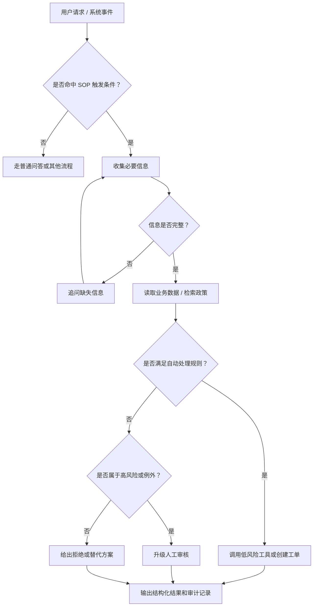

# AI 落地实践中的 SOP：从流程文档到 Agent 执行规程

日期：2026-05-23

主题：Agent Systems / AI 落地 / SOP / Workflow / Skill

## 一句话结论

AI 落地里的 SOP 不是把传统流程文档塞进提示词，而是把业务规则、工具权限、决策分支、异常处理、人工升级、输出格式和评估样例，沉淀成 Agent 能执行、系统能约束、人能审计的操作规程。

更直接地说：没有 SOP 的 Agent，就是让一个聪明但健忘的新员工拿着一堆工具乱试。能 demo，不等于能生产。

## 什么是 SOP

传统 SOP（Standard Operating Procedure）是完成重复任务的一组标准步骤，目标是提高一致性、效率、质量和安全性。

AI 语境里的 SOP 继承了这个目标，但对象变了：

- 传统 SOP 的读者主要是人。
- AI Agent SOP 的读者是 Agent、Workflow 引擎、工具权限系统、评估系统和人工审核者。

所以 AI SOP 不能只是“请专业、耐心、按公司政策处理”。那是口号，不是流程。真正能落地的 AI SOP 必须写清楚：

- 什么时候触发。
- 需要收集什么信息。
- 哪些判断必须走规则。
- 哪些判断可以交给模型。
- 能调用哪些工具。
- 哪些动作必须人工审批。
- 什么情况下停止、追问或升级。
- 输出什么结构。
- 用什么案例验证。

## 为什么现在 AI 落地开始强调 SOP

OpenAI 的 Agent 指南把 Agent 拆成 `model`、`tools`、`instructions`，并强调 agent 适合复杂决策、规则难维护、依赖非结构化数据的 workflow；否则确定性方案可能就够了。它还建议把已有操作流程、支持脚本和政策文档转成更适合 LLM 执行的 routine，并要求每一步对应明确动作或输出。

Anthropic 的工程文章强调，先用最简单可行的模式：workflow 适合预定义路径，agent 适合路径不可预知、需要模型动态决策的任务。复杂性只有在能证明改善结果时才值得加入。

这两条合起来，就是 AI SOP 的位置：

> SOP 用来固定确定流程，约束工具动作，暴露真正需要模型判断的地方。

如果没有 SOP，Agent 的失败通常不是“模型不够聪明”，而是系统把不该自由发挥的东西交给了模型：

- 固定业务规则让模型猜。
- 工具调用顺序让模型猜。
- 异常分支让模型猜。
- 高风险动作让模型自己决定。
- 最终结果没有评估样例，只靠人工试玩。

这不是智能，这是工程边界没画清楚。

## AI SOP 的四种常见形态

### 1. 业务 SOP 数字化

企业已有的客服手册、售后流程、设备维修手册、质检规范、工单处理规范进入知识库、RAG 或 Agent 上下文。

典型场景：

- 客服退款、退货、账号找回。
- 售后工单分诊和升级。
- 制造设备故障排查。
- 合同初审和风险标注。
- 医疗、金融、政务等强流程场景。

这里的关键问题不是“能不能检索到文档”，而是 SOP 文档里的顺序、条件、例外、权限能不能被系统正确执行。

### 2. Agent 执行规程

这是狭义的 AI Agent SOP：给 Agent 执行某个任务的结构化说明。

一个 Agent SOP 通常包含：

- 适用场景。
- 触发条件。
- 必填信息。
- 决策分支。
- 可用工具。
- 工具权限。
- 失败处理。
- 人工升级条件。
- 输出格式。
- 测试样例。

Intercom / Fin 对 AI Agent SOP 的定义基本也是这个方向：它是面向特定客服场景的结构化指令文档，让 AI Agent 按步骤处理问题，并通过确定性规则控制关键决策。

### 3. SOP as Skill

Anthropic 的 Skills 和 Agent Skills 标准，把可复用能力封装成目录：

```text
my-skill/
├── SKILL.md
├── scripts/
├── references/
├── assets/
└── ...
```

这其实就是一种可版本化、可分发、可执行的 SOP。

普通 prompt 只是一段指令；Skill 可以包含：

- 什么时候触发。
- Agent 应该按什么流程做。
- 可复用脚本。
- 参考资料。
- 模板。
- 产物规范。

所以在工程上，可以把 SOP 看成 Skill 的核心内容之一。区别是：SOP 强调业务流程和决策约束，Skill 强调能力封装和复用。

### 4. 多 Agent 协作 SOP

MetaGPT 把软件公司的产品经理、架构师、工程师、QA 等角色流程编码进多 Agent 协作里，论文明确提到通过 SOP 化的 prompt sequence 组织协作。

但这里不能被“多 Agent”带偏。

SOP 的价值不是让系统看起来像一家公司，而是把角色、输入、输出、交接条件和验收标准写清楚。大多数真实项目第一步不该上多 Agent。流程没理清，多 Agent 只是把混乱并行化。

## 和 Prompt、Workflow、RAG、Skill、Agent 的区别

| 概念 | 核心作用 | 和 SOP 的关系 |
|---|---|---|
| Prompt | 指导一次或一段模型行为 | Prompt 可以承载 SOP 片段，但不是 SOP 本身 |
| System Prompt | 规定全局角色、边界和安全要求 | 更像宪法，SOP 是具体任务规程 |
| Workflow | 固定执行路径和编排 | Workflow 是执行机制，SOP 是业务规则和操作语义 |
| RAG | 检索相关知识 | RAG 提供资料，SOP 规定如何用资料做事 |
| Skill | 可复用能力包 | SOP 可以封装进 Skill，变成可复用流程能力 |
| Agent | 根据状态选择动作的执行者 | Agent 执行 SOP 中允许的动作和判断 |
| Evals | 验证系统表现 | SOP 必须配 eval，否则无法知道流程是否真的稳定 |

最常见的坏设计，是把这些概念全混成一个巨大 prompt。结果就是：不可测、不可控、不可复盘。

## 数据结构视角

好的 SOP 首先是数据结构，不是长文档。

可以把 AI SOP 抽象成：

```text
SOP = {
  trigger: 什么时候适用,
  state: 当前已知事实,
  required_inputs: 必须收集的信息,
  steps: 可执行步骤,
  branches: 条件分支,
  tools: 可调用工具和权限,
  outputs: 结构化输出,
  stop_conditions: 停止条件,
  escalation: 人工升级条件,
  eval_cases: 验证样例
}
```

更工程化一点，SOP 可以被建模成决策图：



SOP-Agent 相关研究也在往这个方向走：把自然语言或伪代码风格的 SOP 表示成 decision graph，再让 Agent 在图上按状态、条件和工具约束执行。

## AI SOP 模板

下面是一个可复用的最小模板。

```text
名称：
版本：
负责人：
最后更新：

适用场景：
- 哪类用户意图、事件或任务触发这个 SOP。

不适用场景：
- 哪些情况不能使用这个 SOP。

触发条件：
- intent =
- event =
- data_condition =

必须收集的信息：
- 字段 1：
- 字段 2：
- 字段 3：

可用工具：
- read_xxx：只读工具，允许自动调用。
- create_xxx：写入工具，允许自动调用但必须记录日志。
- execute_xxx：高风险工具，必须人工审批。

执行步骤：
1. 校验用户身份、对象归属或输入合法性。
2. 查询必要业务数据。
3. 根据规则判断是否继续、追问、拒绝或升级。
4. 调用允许的工具。
5. 输出结构化结论和依据。

分支规则：
- 如果 A 为真，执行 X。
- 如果 B 为真，执行 Y。
- 如果信息冲突，停止并升级。

停止条件：
- 身份无法确认。
- 工具返回冲突数据。
- 用户请求超出政策范围。
- 涉及支付、法律、合规、删除数据等高风险动作。

人工升级条件：
- 金额超过阈值。
- 用户强烈投诉。
- 需要政策例外。
- 模型置信度不足。

输出格式：
- result: approved / rejected / escalated / need_more_info
- reason:
- evidence:
- next_action:
- audit_log:

评估样例：
- 正常路径样例。
- 信息缺失样例。
- 边界条件样例。
- 政策例外样例。
- 工具失败样例。
```

## 落地步骤

1. 选一个真实、高频、低到中风险的流程，不要一上来挑战复杂审批链。
2. 收集历史案例，而不是凭空脑补流程。
3. 写出现有人类 SOP，并标出实际执行时的隐含判断。
4. 把确定性逻辑下沉到代码、SQL、规则引擎或 workflow。
5. 只把语义判断、信息抽取、自然语言交互留给 LLM。
6. 给每个工具定义输入、输出、权限、失败模式和日志要求。
7. 把 SOP 写成触发、步骤、分支、停止、升级、输出、评估样例。
8. 用历史案例和合成边界案例做 eval，不要只靠人工试玩。
9. 上线时接入 trace、人工审批、版本号和回滚机制。
10. 根据失败案例迭代 SOP，而不是每次只改一段大 prompt。

## 工程判断

### 先流程，再模型

如果人类专家都说不清流程，模型不会神奇地把流程补全。模型会补，但补出来的是幻觉。

### 能规则化的不要交给模型

退款窗口、金额阈值、权限校验、状态流转，这些东西应该由规则或代码处理。让模型判断这些，是把确定性问题变成概率问题。

### 能单 Agent 解决的不要上多 Agent

OpenAI 的 Agent 指南也建议先最大化单 Agent 能力，只有当复杂逻辑、工具过载、职责分离真的造成问题时，再拆多 Agent。

### SOP 必须有停止条件

Agent 最大的问题不是不会继续，而是不知道什么时候该停。停止条件比“继续努力完成任务”重要得多。

### 高风险动作必须人工审核

发邮件、改数据库、调用支付、执行 shell、删除数据、法律承诺，都不能只靠模型“觉得可以”。这些动作必须有权限、日志、审批和回滚路径。

### SOP 必须版本化

业务政策会变，工具接口会变，模型能力会变。没有版本号的 SOP，出了问题没法定位到底是流程变了、模型变了，还是数据变了。

## 常见坏味道

- 把公司制度原文直接塞给 Agent。
- SOP 里只有原则，没有条件和动作。
- 每个分支都写“根据情况判断”。
- 工具权限没有分级。
- 没有停止条件。
- 没有人工升级。
- 没有历史案例 eval。
- 所有流程都想做成多 Agent。
- 把 SOP 当 prompt 模板，而不是可执行流程资产。
- 只看成功 demo，不看失败路径。

## 一个最小实验方向

后续可以做一个小型 lab 验证这个判断：

> 同一个客服退款任务，对比“普通 prompt”、“SOP prompt”、“SOP decision graph + tool constraints”三种实现，在信息缺失、政策例外、工具失败和高风险动作上的表现差异。

最小实验可以包含：

- 10 个模拟订单。
- 20 条用户请求。
- 3 个工具：`read_order`、`check_policy`、`create_refund_case`。
- 1 个高风险工具：`issue_refund`，默认必须人工审批。
- 指标：正确分支率、错误工具调用率、是否越权、是否能正确升级人工。

这个实验比空谈“Agent 是否可靠”更有价值，因为它能验证 SOP 是否真的减少随机性。

## 参考资料

- [OpenAI: A practical guide to building agents](https://cdn.openai.com/business-guides-and-resources/a-practical-guide-to-building-agents.pdf?file=a-practical-guide-to-building-agents.pdf)
- [Anthropic: Building Effective AI Agents](https://www.anthropic.com/engineering/building-effective-agents)
- [LangChain: How to Build an Agent](https://www.langchain.com/blog/how-to-build-an-agent)
- [Intercom / Fin: AI Agent SOP](https://fin.ai/glossary/ai-agent-sop)
- [Claude Skills overview](https://claude.com/docs/skills/overview)
- [Agent Skills overview](https://agentskills.io/home)
- [MetaGPT: Meta Programming for A Multi-Agent Collaborative Framework](https://arxiv.org/abs/2308.00352)
- [SOP-Agent: Empower General Purpose AI Agent with Domain-Specific SOPs](https://arxiv.org/abs/2501.09316)
- [Agent-S: LLM Agentic workflow to automate Standard Operating Procedures](https://arxiv.org/abs/2503.15520)
- [SOP-Bench: Complex Industrial SOPs for Evaluating LLM Agents](https://arxiv.org/abs/2506.08119)
- [SOPRAG: Multi-view Graph Experts Retrieval for Industrial Standard Operating Procedures](https://arxiv.org/abs/2602.01858)
