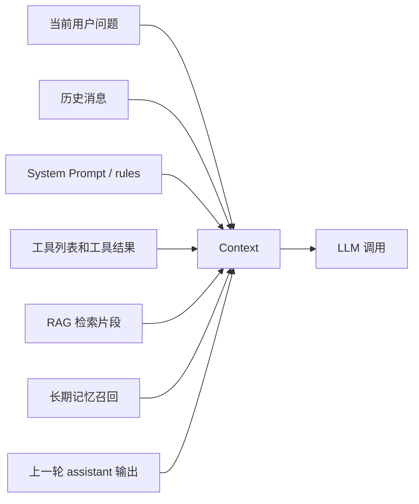
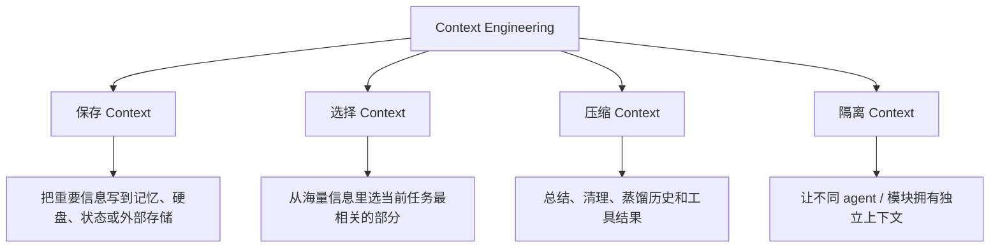
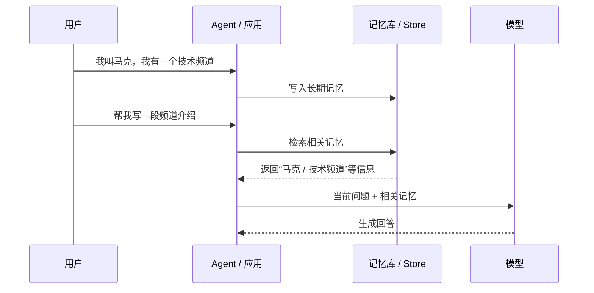
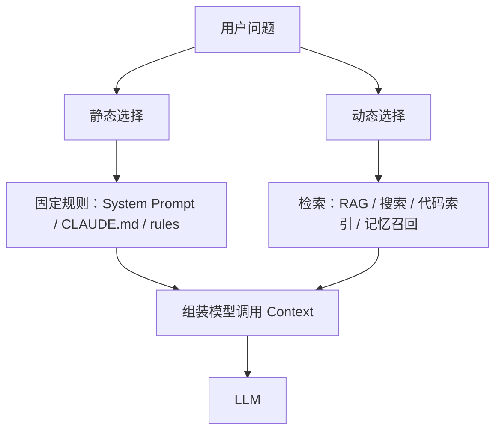
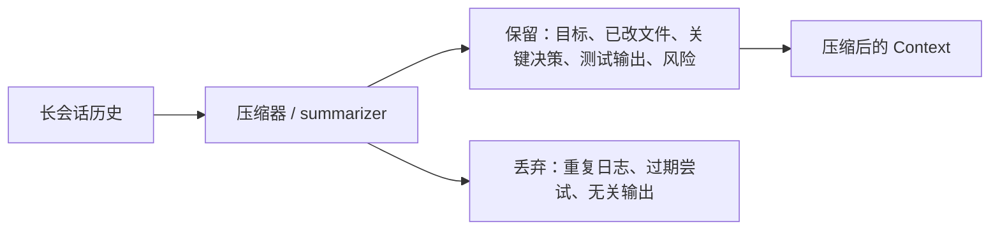
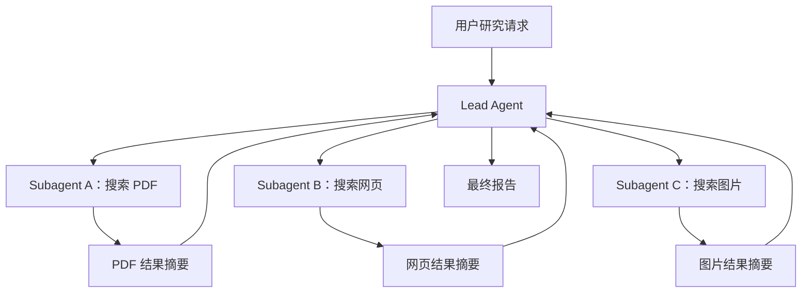
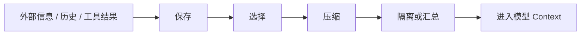
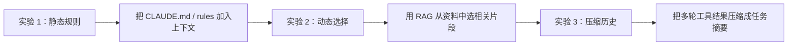

# Context Engineering：概念与技术实现深度解析

日期：2026-05-11

来源视频：[Context Engineering：概念与技术实现深度解析](https://www.youtube.com/watch?v=25DEMZ7wsSM)

频道：马克的技术工作坊

发布时间：2025-08-10

时长：15:16

本地素材：

- 视频：`local-media/youtube/2025-08-10-mark-context-engineering/Context Engineering：概念与技术实现深度解析 [25DEMZ7wsSM].quicktime.mp4`
- 字幕：`local-media/youtube/2025-08-10-mark-context-engineering/Context Engineering：概念与技术实现深度解析 [25DEMZ7wsSM].quicktime.zh-Hans.srt`
- 元数据：`local-media/youtube/2025-08-10-mark-context-engineering/Context Engineering：概念与技术实现深度解析 [25DEMZ7wsSM].quicktime.info.json`
- 关键画面抽帧：`local-media/youtube/2025-08-10-mark-context-engineering/frames/`
- 关键画面总览：`local-media/youtube/2025-08-10-mark-context-engineering/frames/contact-keyframes.jpg`
- 评论原始数据：`local-media/youtube/2025-08-10-mark-context-engineering/comments.json`
- 评论摘要素材：`local-media/youtube/2025-08-10-mark-context-engineering/comments-digest.md`

说明：`local-media/` 是本地沉淀目录，不应提交进 Git。

## 配套资源 / 代码地址

- 视频：<https://www.youtube.com/watch?v=25DEMZ7wsSM>
- 代码仓库：视频简介、元数据和已抓取评论中未发现具体代码仓库地址。
- 视频简介中的 Context Engineering 资料：
  - Anthropic multi-agent research system：<https://www.anthropic.com/engineering/multi-agent-research-system>
  - LangChain Context Engineering：<https://blog.langchain.com/context-engineering-for-agents/>
- 相关视频：视频简介给出 3 个 YouTube 链接，未逐个打开核对标题。
  - <https://www.youtube.com/watch?v=GE0pFiFJTKo&t=11s>
  - <https://www.youtube.com/watch?v=WWdlme1EAGI>
  - <https://www.youtube.com/watch?v=D8mqIMeZ4fQ>

## 评论区补充

- 已抓取 29 条评论，没有发现置顶评论，也没有发现评论中的 URL。
- 高赞评论指出：Context Window 不只包括输入，也包括模型输出。作者回复说这取决于如何定义输入/输出；在 Token 生成过程中，上一轮输出会作为下一轮输入参与计算。
- 这个补充很重要。Claude 官方文档也明确说 context window 是模型生成回答时可引用的全部文本，包含 response itself；多轮对话里，前一轮 assistant response 会成为后续上下文的一部分。
- 有评论问“静态选择是不是提示词，每次对话都会提及”。可以这么理解一部分：项目规则、System Prompt、`CLAUDE.md`、Cursor rules 这类稳定规则，都是静态放入上下文的候选。
- 有评论把 Context Engineering 总结成“当上下文多了，要对内容蒸馏”。这个说法抓住了压缩的一面，但不完整；还包括保存、选择和隔离。

## 一句话结论

Context Engineering 不是训练模型，也不是单纯写 Prompt，而是在每一次模型调用前，决定哪些信息该保存、该选入、该压缩、该隔离，让模型在有限上下文窗口内看见刚好足够、结构清楚、成本可控的信息。

## 视频时间轴

| 时间 | 主题 | 要点 |
|---|---|---|
| 00:00 | 视频内容介绍 | 引出 Context、Context Window、Context Engineering 的概念。 |
| 00:16 | Context 和 Context Window | Context 是模型本次可参考的信息集合，Context Window 是容量上限。 |
| 04:27 | Context Engineering | 核心是不改模型结构，只设计模型看到什么。 |
| 06:48 | 实现方法 | 借鉴 LangChain 框架，分成保存、选择、压缩、隔离四类。 |
| 13:16 | 视频总结 | Context Engineering 是一类技术体系，不是单一技术。 |
| 14:18 | 相关文章推荐 | 推荐 LangChain、Anthropic、Cognition 相关文章。 |

## 1. Context：不要只理解成“用户输入”

视频一开始把大模型抽象成函数：给输入，得输出。这个说法适合入门，但工程上要更精确一点。

Context 是模型当前调用能参考的信息集合，常见来源包括：

- 用户当前问题
- 历史对话
- System Prompt / 项目规则 / 开发者指令
- 可用工具列表和工具 schema
- 工具执行结果
- RAG 检索出来的资料片段
- 记忆系统召回的用户偏好或长期事实
- 模型上一轮输出，在多轮对话中会成为后续上下文的一部分

Context Window 是容量上限，一般按 Token 计。视频里给了一些模型窗口数字，但这些数字会过期，本笔记不把它们当当前事实引用。真正做系统时，查官方模型文档并用实际 tokenizer 估算。

## 2. 大窗口不是免死金牌

视频批评了一个常见坏方案：产品手册很长，就全部丢进模型。

这思路看起来省事，实际很烂，原因有三类：

| 问题 | 说明 |
|---|---|
| 容量限制 | 不是所有模型都有超大 Context Window，小模型或低成本模型尤其有限。 |
| 质量限制 | 上下文越杂，越容易出现重点淹没、信息冲突、模型被无关内容带偏。 |
| 成本限制 | 大多数模型按 Token 计费，塞进去的每一段废话都在花钱。 |

Claude 官方文档也强调：更大的 context 不会自动带来更好效果；随着 token 增长，准确性和召回会退化，文档称这种现象为 `context rot`。这就是 Context Engineering 的现实价值：不是比谁能塞得多，而是比谁塞得准。

## 3. Context Engineering：给模型准备工作台

视频给出的定义很朴素：Context Engineering 是对模型输入做优化，让模型在有限 Context Window 里理解更准、答得更好、花得更少。

LangChain 的定义更工程化：Context Engineering 是把每一步 agent 轨迹中“刚好正确的信息”放入上下文窗口的艺术和科学。它把常见策略分成四类：`write`、`select`、`compress`、`isolate`。视频把它翻译成：保存、选择、压缩、隔离。

这不是 Prompt Engineering 的简单改名。Prompt Engineering 常关注“怎么把指令写清楚”；Context Engineering 关注整个信息环境：状态、记忆、检索、工具、历史、压缩、隔离、成本和权限。

## 4. 保存 Context：先把重要信息放到上下文之外

保存 Context 对应 LangChain 的 `write context`：把重要信息写到上下文窗口之外，未来需要时再取回来。

视频用 ChatGPT 记忆功能举例：用户告诉模型“我叫马克，我有一个频道，讲 Agent/RAG/MCP/A2A”，系统可以把这些长期偏好保存到记忆库。未来对话不是每次都手动重复，而是按需召回。

注意：保存只是第一步。信息存下来不代表每次都塞进模型。否则记忆库越大，系统越蠢。

工程上常见的保存位置：

- 短期状态：当前会话的消息、工具结果、上传文件。
- 长期记忆：用户偏好、项目背景、稳定事实。
- 文件系统：scratchpad、任务日志、中间产物。
- 数据库或向量库：可检索资料、历史案例、知识库片段。

## 5. 选择 Context：真正的核心

视频把选择分成静态选择和动态选择。

静态选择是永远重要的信息，每次都放进上下文，比如：

- System Prompt
- 项目根目录的 `CLAUDE.md`
- Cursor rules
- 安全规则
- 输出格式要求
- 当前任务必须遵守的业务边界

动态选择是按当前问题挑信息，比如：

- 从记忆库挑与问题相关的偏好
- 从知识库检索相关段落，也就是 RAG
- 从几十个工具里只挑当前任务可能用到的几个工具
- 从代码库里找当前 bug 相关文件

这层做不好，模型再强也会乱。LangChain 文档也说，Agent 失败经常不是模型不够强，而是“正确上下文”没有传给模型。

## 6. 压缩 Context：把历史变成可用摘要

Agent 长时间运行后，上下文里会堆很多东西：

- 模型输出
- 工具调用结果
- 代码文件内容
- 搜索结果
- 失败日志
- 中间推理和计划

不压缩，很快把窗口撑爆。视频用 Claude Code 的 auto-compact 举例：当上下文接近上限时，把历史总结成结构化摘要，再丢弃原始冗余内容。

压缩不是随便写个摘要。烂压缩会丢失关键约束，让 Agent 后面犯错。好的压缩应明确保留：

- 当前目标和验收标准
- 已做过的动作
- 失败过的方案
- 文件和代码路径
- 测试输出和错误日志
- 未解决问题
- 用户明确要求

Claude Code 文档也说明：`/compact` 会把会话替换成结构化摘要；项目根 `CLAUDE.md`、自动记忆等会重新加载，但某些路径规则、嵌套规则和已调用 Skill 的行为有各自限制。压缩后的上下文不是原始上下文，别把它当无损。

## 7. 隔离 Context：不要让所有东西挤在一个脑子里

隔离 Context 对应 LangChain 的 `isolate context`。典型场景是 subagent 或 multi-agent。

视频引用 Anthropic 的 multi-agent research system：Lead Agent 负责任务拆解和最终汇总，多个 subagent 分别搜索 PDF、网页、图片等。每个 subagent 有自己的工具、运行历史和上下文窗口，只把压缩后的结论交给 Lead Agent。

隔离的好处：

- 避免一个上下文窗口塞满所有原始材料。
- 不同任务可以使用不同工具和规则。
- Lead Agent 只接收压缩后的结果。
- 并行探索可以提升广度型研究任务的覆盖。

代价也很现实：

- 子任务之间可能重复搜索。
- 信息传递会丢细节。
- 多 Agent 更烧 Token。
- 协调和评估更复杂。

Anthropic 的文章也提到 multi-agent 系统会显著增加 token 使用量，因此只适合任务价值足以覆盖成本的场景。别一上来就多 Agent，这是最常见的过度设计。

## 8. 四类策略的关系

这四类不是互斥选项，而是一条流水线。

更实际的版本是：

| 问题 | 对应策略 | 例子 |
|---|---|---|
| 信息以后还会用 | 保存 | 记忆库、scratchpad、任务日志。 |
| 信息太多，不知道放什么 | 选择 | RAG、工具选择、规则选择、代码搜索。 |
| 历史太长，占满窗口 | 压缩 | 会话摘要、工具结果裁剪、日志清洗。 |
| 任务太复杂，一个上下文装不下 | 隔离 | subagent、分模块上下文、独立工作区。 |

## 工程提醒

1. Context Window 不是垃圾桶。能塞不等于该塞。
2. 先做选择，再谈压缩。把垃圾压缩成短垃圾，还是垃圾。
3. 长期记忆必须可审计、可删除、可纠错。错误记忆比没有记忆更危险。
4. RAG 不是万能。检索不到、检索错、切块烂、排序差，都会直接污染上下文。
5. 工具结果要结构化，别把几千行日志原样塞给模型。
6. 压缩要保留决策依据和失败历史，否则 Agent 会重复犯同样的错。
7. Subagent 不是默认方案。只有当任务天然可拆、上下文隔离有收益、成本能接受时才用。
8. 高风险 Agent 动作必须人审：执行 shell、写文件、改数据库、发邮件、支付、部署、账号操作。
9. 当前模型规格和 context window 数字变化很快。视频里的具体数字只能当当时背景，不能当生产参数。

## 和学习路线的关系

这期视频适合放在第一阶段后半段，也就是已经知道 Token、Context、Tool、RAG 之后再看。它是从“会调用模型”走向“能做稳定 Agent”的关键概念。

建议后续实验不要搞大而全，做三个小实验就够：

验收指标要具体：

- Token 数是否下降。
- 回答是否更准确。
- 是否减少重复工具调用。
- 是否保留关键约束。
- 压缩后是否还能继续完成任务。

## 参考资料

- 视频：<https://www.youtube.com/watch?v=25DEMZ7wsSM>
- LangChain Context Engineering：<https://www.langchain.com/blog/context-engineering-for-agents>
- LangChain Context Engineering Docs：<https://docs.langchain.com/oss/python/langchain/context-engineering>
- Claude Context Windows：<https://docs.claude.com/en/docs/build-with-claude/context-windows>
- Claude Code Context Window：<https://code.claude.com/docs/en/context-window>
- Anthropic Multi-Agent Research System：<https://www.anthropic.com/engineering/multi-agent-research-system>
- Cognition Don't Build Multi-Agents：<https://cognition.ai/blog/dont-build-multi-agents#principles-of-context-engineering>
- 视频简介中的相关资料：<https://blog.langchain.com/context-engineering-for-agents/>、<https://www.anthropic.com/engineering/multi-agent-research-system>

## 未验证事项

- 本笔记基于字幕、元数据、关键画面和已抓取评论整理，没有人工完整重看视频。
- 视频中列举的具体模型 Context Window 数字没有逐项核对当前官方规格；生产决策应查各模型官方文档。
- 视频提到 Claude Code 在 95% 左右触发 auto-compact 的说法没有在本地复现；官方文档确认有 `/compact`、上下文可视化和压缩机制，但具体阈值可能随版本、计划和配置变化。
- 视频提到 Cognition 的相关文章；已核对到对应页面存在，但没有逐段复核文章观点。
- 本仓库没有实现保存、选择、压缩、隔离 Context 的代码实验。
- 视频简介中的 3 个相关视频链接未逐个打开核对标题和内容。
