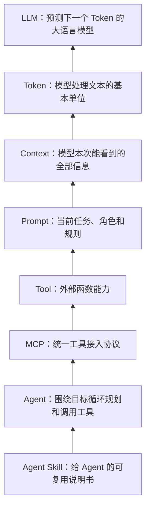
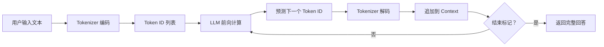
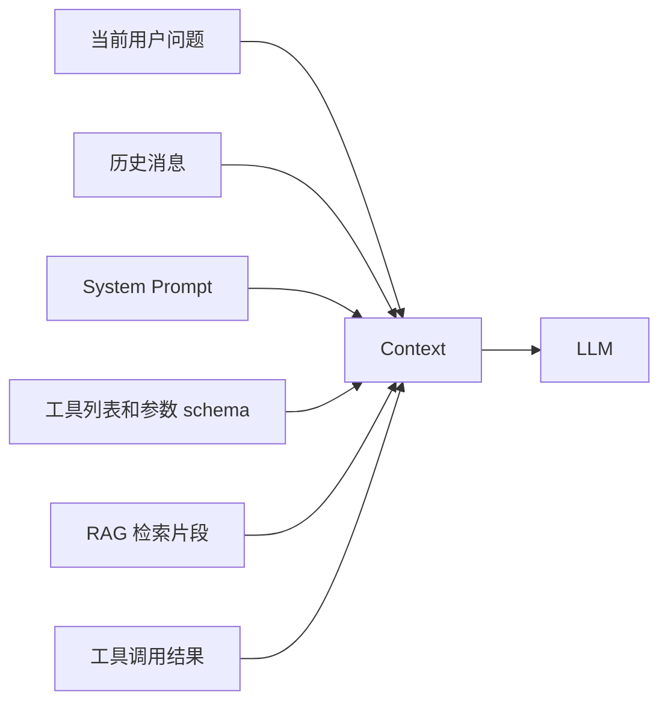
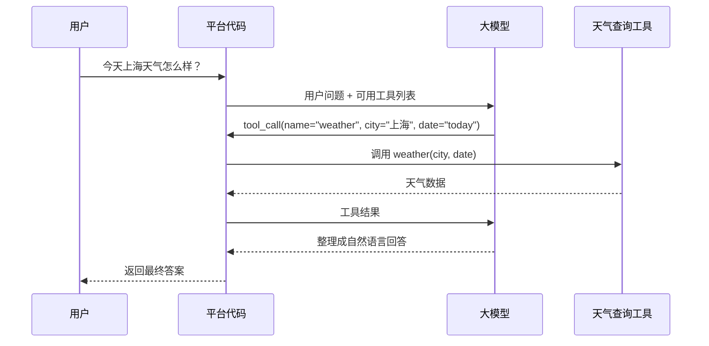
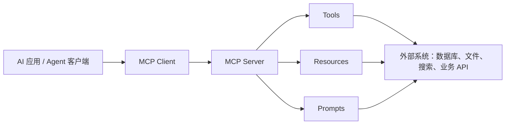
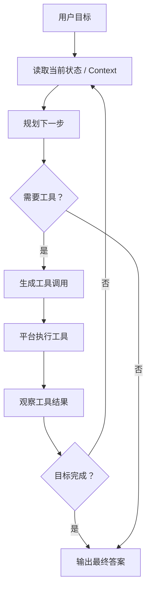
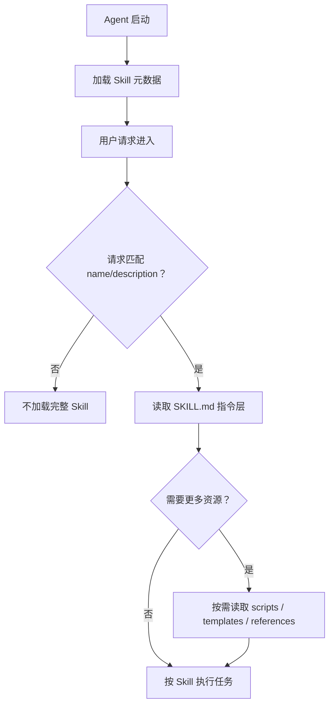
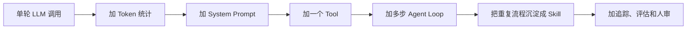

# 从 LLM 到 Agent Skill，一期视频带你打通底层逻辑！

日期：2026-05-10

来源视频：[从 LLM 到 Agent Skill，一期视频带你打通底层逻辑！](https://www.youtube.com/watch?v=7qO8-kx3gW8)

频道：马克的技术工作坊

发布时间：2026-03-14

时长：32:31

本地素材：

- 视频：`local-media/youtube/2026-03-14-mark-llm-agent-skill/从 LLM 到 Agent Skill，一期视频带你打通底层逻辑！ [7qO8-kx3gW8].quicktime.mp4`
- 字幕：`local-media/youtube/2026-03-14-mark-llm-agent-skill/从 LLM 到 Agent Skill，一期视频带你打通底层逻辑！ [7qO8-kx3gW8].quicktime.zh-Hans.srt`
- 元数据：`local-media/youtube/2026-03-14-mark-llm-agent-skill/从 LLM 到 Agent Skill，一期视频带你打通底层逻辑！ [7qO8-kx3gW8].quicktime.info.json`
- 关键画面抽帧：`local-media/youtube/2026-03-14-mark-llm-agent-skill/frames/`
- 关键画面总览：`local-media/youtube/2026-03-14-mark-llm-agent-skill/frames/contact-keyframes.jpg`
- 评论原始数据：`local-media/youtube/2026-03-14-mark-llm-agent-skill/comments.json`
- 评论摘要素材：`local-media/youtube/2026-03-14-mark-llm-agent-skill/comments-digest.md`

说明：`local-media/` 是本地沉淀目录，不应提交进 Git。

## 配套资源 / 代码地址

- 视频：<https://www.youtube.com/watch?v=7qO8-kx3gW8>
- 代码仓库：视频简介、元数据和已抓取评论中未发现具体代码仓库地址。
- 相关视频：视频简介给出了 7 个 YouTube 链接，未逐个打开核对标题。
  - <https://www.youtube.com/watch?v=yjBUnbRgiNs&t=1361s>
  - <https://www.youtube.com/watch?v=zrs_HWkZS5w>
  - <https://www.youtube.com/watch?v=YyVkXrXxvX8>
  - <https://www.youtube.com/watch?v=WWdlme1EAGI&t=8s>
  - <https://www.youtube.com/watch?v=GE0pFiFJTKo>
  - <https://www.youtube.com/watch?v=QNiaoD5RxPA&t=259s>
  - <https://www.youtube.com/watch?v=yDc0_8emz7M>

## 评论区补充

- 已抓取 200 条评论，没有发现置顶评论，也没有发现评论中的 URL。
- 作者回复里确认“真人录制”，并提到自己没有严格评测中英文提示词差异，体感上差别不大。这只能当经验反馈，不能当模型能力结论。
- 有评论指出视频约 20:55 处的 “Protool” 应为 “Protocol”。这是拼写纠错，不影响 MCP 概念本身。
- 高赞评论主要反馈是“通俗、适合 AI 初学者、把常用概念串起来了”。这说明视频定位是入门概念梳理，不是 API 实作教程。
- 有无关推广评论，笔记已忽略。

## 一句话结论

这期视频的核心价值，是把 AI 应用开发里最容易混成一团的名词按工程调用链排好：LLM 负责预测下一个 Token；Context 是每次请求喂给模型的信息总和；Prompt 是其中的指令部分；Tool 是外部函数；MCP 是工具接入标准；Agent 是围绕目标持续规划和调用工具的程序；Agent Skill 是给 Agent 看的可复用工作说明书。

## 视频时间轴

| 时间 | 主题 | 要点 |
|---|---|---|
| 00:00 | 视频内容介绍 | 先把 LLM、Token、Context、Prompt、Tool、MCP、Agent、Agent Skill 串成一条概念链。 |
| 00:31 | LLM | 大模型底层是基于 Transformer 的生成模型，本质行为是基于已有上下文预测下一个 Token。 |
| 03:02 | Token | 模型不直接处理自然语言字符，而是通过 Tokenizer 在文本和 Token ID 之间转换。 |
| 08:10 | Context | 模型没有真正记忆；所谓记住对话，是平台把历史消息、系统规则、工具信息等重新塞进上下文。 |
| 11:41 | Prompt | Prompt 是给模型的指令，User Prompt 负责具体任务，System Prompt 负责角色和规则。 |
| 15:11 | Tool | Tool 本质是函数；模型只生成调用意图和参数，真正执行工具的是平台代码。 |
| 19:20 | MCP | MCP 解决不同平台工具接入规范不统一的问题，可以理解成工具接入的统一协议。 |
| 21:08 | Agent | Agent 在多步任务里循环规划、调用工具、观察结果，直到满足用户目标。 |
| 24:09 | Agent Skill | Skill 是预先写好的说明文档，用来沉淀步骤、规则、输出格式和示例，减少重复 Prompt。 |
| 30:44 | 总结 | 回顾概念栈：从模型的最小处理单元到 Agent 的可复用工作流。 |

## 1. 概念栈：别把名词混成一锅粥

这期视频最有用的地方，是把概念按依赖关系排出来。不是先谈 Agent，也不是一上来搞多 Agent。底层是 LLM 和 Token，中间是 Context 和 Prompt，再往上才是 Tool、MCP、Agent 和 Skill。



工程上要记住一件事：模型只是整个系统的一部分。真正的应用是“模型 + 平台代码 + 工具 + 状态 + 权限控制 + 观测”的组合。只盯着模型能力，会把系统边界想歪。

## 2. LLM：文字接龙是简化说法，但方向没错

视频用“文字接龙”解释 LLM：用户输入一段文本，模型基于已有内容预测下一个片段，然后把新片段追加回输入，继续预测，直到输出结束标记。

更工程化地看，这条链路是：



这里有两个常见误解：

1. 模型不是在“理解文字”后直接吐中文。它内部处理的是数字向量和 Token ID。
2. 模型不是一次性生成整篇回答。流式输出之所以自然，是因为生成过程本来就是逐步预测。

视频提到 Transformer 来自 2017 年论文《Attention Is All You Need》。这个背景有用，但本视频没有深挖 Transformer 结构，所以不要把这篇笔记当模型架构课。

## 3. Token：不是词，也不是字符

Token 是模型处理文本的基本单位。Tokenizer 做两件事：

| 动作 | 输入 | 输出 | 说明 |
|---|---|---|---|
| 编码 | 文本 | Token ID 列表 | 先切分，再把每个 Token 映射成数字。 |
| 解码 | Token ID | 文本片段 | 把模型输出的数字映射回可读文本。 |

视频强调 Token 和“词”不是一一对应关系。中文词可能被拆成多个 Token，英文单词也可能被拆分，甚至某些符号会占多个 Token。

实用判断：

- 不要用“字数”等同于 Token 数。
- 做上下文预算时，必须用对应模型的 tokenizer 估算。
- 价格、上下文窗口、RAG 切块、历史压缩，本质上都绕不开 Token。

## 4. Context：模型的临时工作台

模型没有真正的长期记忆。你在聊天里让它记住“我叫马克”，后面再问“我叫什么”，它能答出来，不是因为模型参数被改了，而是平台把历史对话重新放进了本次请求。

Context 可以包含：

- 用户当前问题
- 历史对话
- System Prompt
- 可用工具列表和工具 schema
- 工具调用结果
- 模型已经生成但还未结束的 Token
- RAG 检索出来的外部资料片段



Context Window 是 Context 能容纳的最大 Token 数。视频里展示了若干模型的上下文窗口数字，但模型规格变化很快，本笔记不把这些数字当作当前事实引用。要写生产代码，查官方模型文档，别抄视频里的截图。

视频还用产品手册问答引出 RAG：如果资料太长，不要把整本手册塞进 Context，而是检索最相关片段，再交给模型回答。这不是高级花活，是成本和质量的基本工程控制。

## 5. Prompt：把话说明白，不是玄学

Prompt 是模型接收的具体指令。视频把它分成两类：

| 类型 | 谁写 | 作用 | 示例 |
|---|---|---|---|
| User Prompt | 用户 | 说明当前任务 | “帮我写一首五言绝句，主题是秋天落叶。” |
| System Prompt | 开发者或平台 | 规定角色、边界和行为规则 | “你是数学老师，不直接给答案，要引导学生思考。” |

Prompt Engineering 的底层原则很朴素：把目标、约束、输入、输出格式说清楚。真正要警惕的是把一堆不稳定规则塞进临时 Prompt，导致每次复制粘贴一大段。重复规则应该沉淀到系统层、工具层、Skill 或代码里。

## 6. Tool：模型不执行工具，平台执行工具

视频用天气查询解释 Tool。关键点很重要：Tool 本质是函数。模型不能直接调用函数，它只能输出“我想调用某个工具，以及参数是什么”。平台代码接收这个工具调用请求，再真正执行函数，最后把结果传回模型。



这条边界不能搞错。搞错了就会出现两个坏设计：

- 把工具权限交给模型幻想它会自控。实际执行者是平台，权限应该由平台守。
- 工具结果没有结构化，模型只能猜。结果应该清晰、稳定、可校验。

## 7. MCP：统一工具接入，不是替代 API

视频对 MCP 的解释很直接：不同平台有不同工具接入规范，同一个工具如果要接 ChatGPT、Claude、Gemini，可能要写多套适配。MCP 的目标是提供统一协议，让工具按一个标准暴露给支持 MCP 的客户端。

更准确地说，MCP 不是“更高级的 API”，也不是“模型自己会联网”的魔法。它是 AI 应用和外部系统之间的连接协议，围绕 tools、resources、prompts 等能力组织接入方式。



评论区有人问 API 和 MCP 的区别。一个实用回答：

- API 是某个系统对外暴露能力的接口。
- MCP 是把这些能力按 Agent 可发现、可调用、可描述的方式接给模型应用的协议。
- MCP Server 内部通常还是会调用 API、读文件、查数据库或执行本地函数。

## 8. Agent：重点是循环，而不是名字

简单工具调用只处理一步：模型决定调用天气工具，平台执行，模型总结。

Agent 的不同点在于多步循环：它会根据目标、当前状态和工具返回结果，决定下一步做什么，直到任务完成。



视频里的例子是：先定位，再查天气，如果下雨，再查附近卖伞的店。它体现了 Agent 的三个核心动作：

1. 根据目标拆步骤。
2. 选择工具并传参。
3. 根据结果继续或停止。

别把 Agent 神化。Agent 就是一个有循环、有状态、有工具、有停止条件的程序。真正难的是边界条件：什么时候停、失败怎么处理、工具权限怎么控、状态怎么记录、用户什么时候介入。

## 9. Agent Skill：把重复工作流写成说明书

视频把 Agent Skill 解释成“给 Agent 看的说明文档”。这个定义够用了。

以出门清单为例，如果每次都让用户手写“下雨带伞、光照强带帽子、空气差带口罩、先总结再列清单”，那就是垃圾交互。把这些稳定规则沉淀成 Skill，Agent 遇到相关任务时读取并执行，就合理得多。

Skill 的典型结构：

```text
skill-name/
  SKILL.md
  scripts/
  templates/
  references/
```

`SKILL.md` 通常包含两层：

| 层次 | 内容 | 用途 |
|---|---|---|
| 元数据层 | `name`、`description` 等 frontmatter | 帮 Agent 判断什么时候加载 Skill。 |
| 指令层 | 目标、步骤、规则、输出格式、示例 | 真正指导 Agent 怎么做。 |



这就是渐进式披露：启动时只读轻量元数据，匹配时再读完整说明，必要时再读脚本和参考资料。它解决的是 Context 成本问题，也解决重复 Prompt 的维护问题。

## 工程提醒

1. 工具调用的执行权在平台，不在模型。权限、人审、审计、错误处理都要放在平台边界上做。
2. 高风险动作必须有人审：执行 shell、写文件、改数据库、发邮件、支付、部署、账号操作。Agent 能生成调用请求，不代表应该自动放行。
3. Tool schema 要稳定、少废话、可校验。参数类型不清楚，模型就会靠猜。
4. 不要把长资料硬塞进 Context。能检索就用 RAG，能压缩历史就压缩，能沉淀成 Skill 就沉淀。
5. Skill 不是魔法插件，本质是指令、脚本和资源的包。第三方 Skill 应按代码审计，先读再用。
6. Agent 的停止条件要明确。没有停止条件的“自主规划”很容易变成烧 Token 的循环。
7. 视频中的具体模型名称、上下文窗口数字、产品行为会过期。概念可以学，生产参数查官方文档。

## 和学习路线的关系

这期视频适合放在本仓库学习路线的第一阶段和第二阶段之间：

- 第一阶段“OpenAI 官方技术栈”：用它建立 LLM、Token、Context、Prompt、Tool、RAG 的基本概念，再去看 Responses API、Tools、Function Calling、Tracing。
- 第二阶段“Anthropic / Claude 技术栈”：用它引出 Claude Code、MCP 和 Agent Skills，但不要急着做多 Agent。
- 第三阶段“真实应用场景和开源项目拆解”：可以拿视频里的天气/出门清单例子，改造成一个最小可运行实验，重点验证工具调用、状态和人审。

一个合理的后续实验不是“做一个万能 Agent”，而是：



## 参考资料

- 视频：<https://www.youtube.com/watch?v=7qO8-kx3gW8>
- Transformer 论文：Vaswani et al., [Attention Is All You Need](https://arxiv.org/abs/1706.03762)
- OpenAI Tokenizer：<https://platform.openai.com/tokenizer>
- OpenAI Tools / Function Calling：<https://platform.openai.com/docs/guides/tools?api-mode=responses>
- OpenAI Responses API：<https://platform.openai.com/docs/api-reference/responses>
- Model Context Protocol 官方文档：<https://modelcontextprotocol.io/docs>
- Claude Code Agent Skills 文档：<https://docs.claude.com/en/docs/claude-code/skills>
- Claude Agent Skills 结构与安全提醒：<https://docs.claude.com/en/docs/agents-and-tools/agent-skills>

## 未验证事项

- 本笔记基于字幕、元数据、关键画面和前 200 条评论整理，没有人工完整重看视频。
- 视频中的 Claude Code / Agent Skill 示例没有在本仓库复现运行。
- 视频截图里的具体模型上下文窗口数字没有逐项核对当前官方模型规格；这些数字变化快，不应直接用于生产决策。
- 视频简介中的 7 个相关视频链接未逐个打开核对标题和内容。
- 没有发现配套代码仓库；如果作者后续在评论或简介补充，需要重新抓取评论和元数据。
