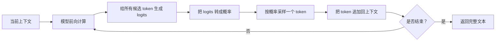
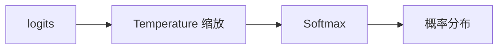
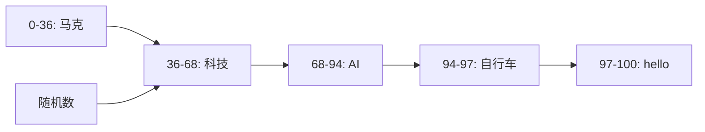
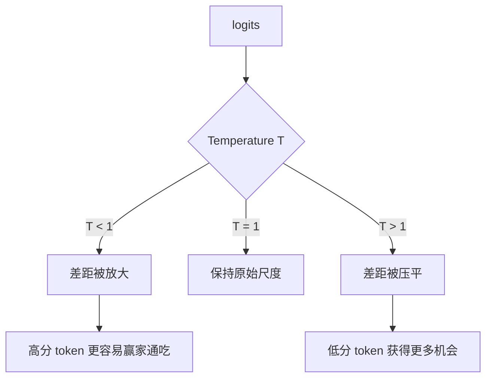
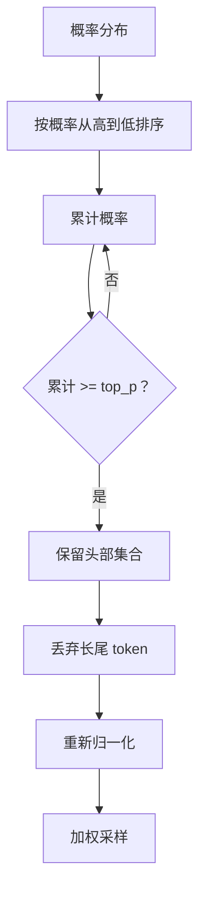
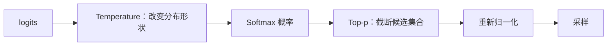
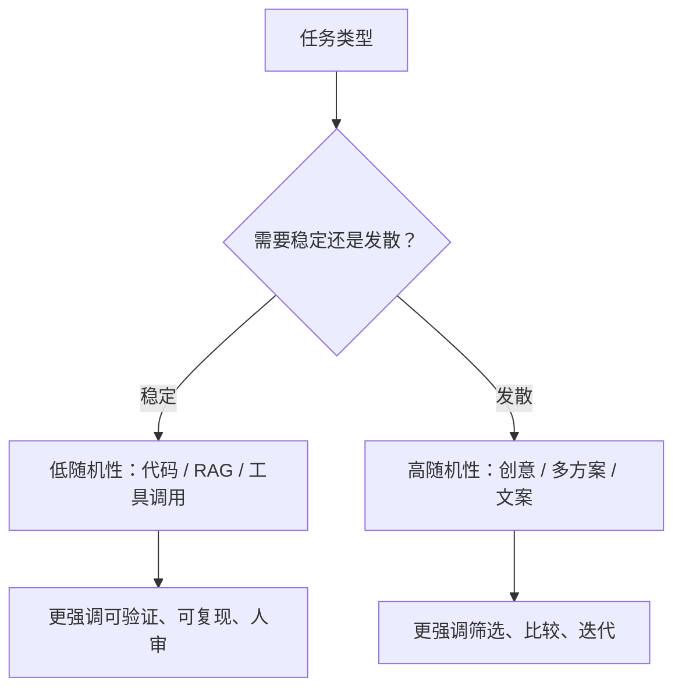

# Temperature & Top-p：掌控大模型的创造力开关

日期：2026-05-12

来源视频：[Temperature & Top-p：掌控大模型的创造力开关](https://www.youtube.com/watch?v=geEDnyFY_dw)

频道：马克的技术工作坊

发布时间：2025-11-29

时长：17:28

本地素材：

- 视频：`local-media/youtube/2025-11-29-mark-temperature-top-p/Temperature & Top-p：掌控大模型的创造力开关 [geEDnyFY_dw].quicktime.mp4`
- 字幕：`local-media/youtube/2025-11-29-mark-temperature-top-p/Temperature & Top-p：掌控大模型的创造力开关 [geEDnyFY_dw].quicktime.zh-Hans.srt`
- 字幕说明：字幕来源为 YouTube 字幕或自动字幕，不是本地 ASR；本笔记未逐句人工校对字幕。
- 元数据：`local-media/youtube/2025-11-29-mark-temperature-top-p/Temperature & Top-p：掌控大模型的创造力开关 [geEDnyFY_dw].quicktime.info.json`
- 缩略图：`local-media/youtube/2025-11-29-mark-temperature-top-p/Temperature & Top-p：掌控大模型的创造力开关 [geEDnyFY_dw].quicktime.webp`
- 关键画面抽帧：`local-media/youtube/2025-11-29-mark-temperature-top-p/frames/`
- 关键画面总览：`local-media/youtube/2025-11-29-mark-temperature-top-p/frames/contact-keyframes.jpg`
- 评论原始数据：`local-media/youtube/2025-11-29-mark-temperature-top-p/comments.json`
- 评论摘要素材：`local-media/youtube/2025-11-29-mark-temperature-top-p/comments-digest.md`

说明：`local-media/` 是本地沉淀目录，不应提交进 Git。

## 配套资源 / 代码地址

- 视频：<https://www.youtube.com/watch?v=geEDnyFY_dw>
- 代码仓库：视频简介、元数据和已抓取评论中未发现具体代码仓库地址。
- 相关视频：
  - <https://www.youtube.com/watch?v=GE0pFiFJTKo&t=11s>
  - <https://www.youtube.com/watch?v=25DEMZ7wsSM>
  - <https://www.youtube.com/watch?v=WWdlme1EAGI>
- 相关本地笔记：
  - [Token 到底是什么？揭秘大模型背后的文字压缩术](Token%20到底是什么？揭秘大模型背后的文字压缩术.md)
  - [RAG 工作机制详解——一个高质量知识库背后的技术全流程](../rag/RAG%20工作机制详解——一个高质量知识库背后的技术全流程.md)

## 评论区补充

- 已抓取 23 条评论，没有发现置顶评论，也没有发现评论中的 URL。
- 有评论反馈终于理解了两个参数叠加时为什么会让输出更乱。这说明视频最有价值的地方不是结论“越高越随机”，而是解释两个参数介入采样链路的不同位置。
- 有评论认为“调整 Top-p 更有意义”。这个说法不能一刀切。Top-p 确实对截断低概率长尾有用，但创意写作、头脑风暴、代码生成、事实问答的调参目标不一样。
- 有评论指出视频 12:03 左右公式文案可能有下标误差。本笔记按标准 Temperature Softmax 公式理解：第 `i` 个 token 的概率分母应对所有候选 token 的指数项求和。
- 其余评论主要是学习反馈，未发现额外代码、文档或勘误链接。

## Fieldbook 归档判断

- 内容类型：资料消化
- 当前归档：`20-资料笔记/`
- 是否值得升级为 lab：是，适合做一个很小的采样实验。
- 判断理由：视频讲的是抽样参数的底层机制，最小实验可以用一组固定 logits，分别改变 `temperature` 和 `top_p`，观察概率分布、候选集合和采样结果。这个实验不需要真实模型，纯 Python 就够。
- 后续应进入：`50-实验验证/` 可以做 `sampling-temperature-top-p`；当前先留在 `20-资料笔记/`。

## 一句话结论

Temperature 改的是概率分布的形状：低温放大高分 token 优势，高温压平差距；Top-p 改的是候选集合的边界：只保留累计概率达到阈值的头部 token，截断长尾垃圾词。两者都能影响随机性，但不是同一个旋钮。

## 视频时间轴

| 时间 | 主题 | 要点 |
|---|---|---|
| 00:00 | 视频内容介绍 | Temperature 和 Top-p 都控制随机性，但原理不同，需要先理解模型如何选下一个词。 |
| 02:00 | 生成分数 | 模型给词表中每个候选 token 打分，这些分数通常叫 logits。 |
| 04:47 | 转换概率 | 用 Softmax 把 logits 转成概率分布。 |
| 06:43 | 加权采样 | 按概率给候选 token 分配机会，然后随机抽样。 |
| 08:38 | Temperature | 在 Softmax 前缩放 logits，改变概率差距。 |
| 13:34 | Top-p | 按累计概率截断候选集合，再归一化并采样。 |

## 1. 模型不是直接“想答案”，而是在选下一个 token

视频从一个简化例子开始：用户问“可以推荐一个讲 AI 的技术频道吗”，模型要预测下一个 token。

它不是直接吐出完整答案，而是循环做三件事：



视频为了入门把候选称为“词”，但工程上更准确地说是 token。一个中文词、英文词、符号片段都可能被 tokenizer 切成不同 token。这里别混。

## 2. 生成分数：logits 只是排序原料

模型会给词表里的每个 token 打一个分数。视频里用五个候选简化展示：

| 候选 | 分数直觉 |
|---|---|
| 马克 | 很适合问题，分数高。 |
| 科技 | 也合理，分数略低。 |
| AI | 也合理。 |
| 自行车 | 基本跑题。 |
| hello | 更跑题。 |

这些分数就是 logits。它们不是概率，不能直接说“马克有 36% 概率”。要先经过 Softmax。

如果每次都取最高分 token，输出会稳定，但也会死板。对很多任务，第二名、第三名也可能合理，所以需要采样。

## 3. Softmax：把分数变成概率

标准 Softmax 做的事情是把一组 logits 变成概率分布：

```text
p_i = exp(z_i) / sum_j exp(z_j)
```

带 Temperature 的版本可以写成：

```text
p_i = exp(z_i / T) / sum_j exp(z_j / T)
```

其中：

- `z_i` 是第 `i` 个候选 token 的 logit。
- `T` 是 Temperature。
- 分母是所有候选 token 的指数项求和。
- 所有 `p_i` 加起来等于 1。



视频里的例子在 `T=1` 时大致得到：马克 36%、科技 32%、AI 26%、自行车 3%、hello 2%。数字不是重点，重点是概率分布保留了“强弱关系”，但允许不止一个候选有机会被选中。

## 4. 加权采样：按概率给机会

视频用 0 到 100 的数轴解释加权采样：



如果随机数落在“马克”区间，就输出马克；落在“科技”区间，就输出科技。概率越大，区间越长，被抽中的机会越高。

这一步解释了为什么同一个问题可能多次生成不同答案。不是模型“心情变了”，而是采样本来就带随机性。

## 5. Temperature：改变概率差距

Temperature 作用在 Softmax 前。它不改变原始 logits 排名，但会改变分数差距进入指数函数后的效果。



视频用三个温度解释：

| Temperature | 效果 | 输出倾向 |
|---|---|---|
| `T=0.1` | logits 差距被放大，最高分 token 概率显著上升。 | 稳定、保守、重复概率更高。 |
| `T=1` | 默认尺度。 | 平衡。 |
| `T=2` | logits 差距被压平，低分 token 概率上升。 | 多样、发散、跑题风险更高。 |

这就是“低温稳定、高温活跃”的来历。它不是玄学，是对 logits 的缩放。

工程上要注意两点：

- Temperature 高不等于更聪明，只是更愿意探索低概率候选。
- Temperature 低也不保证绝对确定，不同模型和服务实现仍可能有其他非确定因素。

## 6. Top-p：截断长尾候选

Top-p 也叫 nucleus sampling。它不负责压平或拉大概率差距，而是决定哪些候选 token 可以进入抽样池。

逻辑是：

1. 先按概率从高到低排序。
2. 从最高概率开始累加。
3. 当累计概率达到 `p`，停止。
4. 丢弃剩下的长尾 token。
5. 对保留集合重新归一化，再采样。



视频里的例子：

| Top-p | 保留候选 | 效果 |
|---|---|---|
| `0.9` | 马克、科技、AI | 截掉自行车和 hello 这类长尾。 |
| `0.6` | 马克、科技 | 候选池更窄，输出更稳定。 |

Top-p 是动态门槛，不是固定取前几个。候选数会随概率分布变化：如果第一名概率已经很高，可能只保留很少 token；如果概率很分散，保留的 token 会更多。

## 7. Temperature 和 Top-p 不要混成一个概念

这两个参数都能影响“随机性”，但手段不同。



| 参数 | 控制对象 | 调低 | 调高 |
|---|---|---|---|
| Temperature | 概率差距 | 放大高低差距，更稳定。 | 压平差距，更多样。 |
| Top-p | 候选集合 | 截断更多长尾，更稳定。 | 放宽候选池，更多样。 |

所以“一个调高、一个调低会不会中和”这个问题没有简单答案。它们不是同一维度的加减法。一个改变分布形状，一个切候选集合，叠在一起会产生具体模型、具体 prompt、具体概率分布下的结果。

## 8. 工程调参建议

不要把采样参数当玄学旋钮。先定任务类型，再定策略。

| 场景 | 建议倾向 |
|---|---|
| 代码、数学、结构化抽取、事实问答 | 较低 Temperature，较保守的候选池，优先稳定。 |
| 小说、头脑风暴、广告文案、多方案生成 | 较高 Temperature 或更宽 Top-p，允许探索。 |
| 企业客服、合规问答、RAG 基于证据回答 | 低随机性，Prompt 明确要求基于材料，不知道就说不知道。 |
| 多样候选生成 | 可以提高随机性，但要用评估或人工筛选兜底。 |

一个朴素但实用的规则：一次只改一个参数。OpenAI 官方文档也建议通常改 `temperature` 或 `top_p` 其中一个，而不是两个一起乱调。两个一起改，问题定位会变脏。

## 9. 和 Agent / RAG 的关系

Temperature 和 Top-p 看起来是模型底层参数，但在 Agent 和 RAG 里很实际：

- Agent 做工具选择时，过高随机性可能导致乱选工具或重复规划。
- RAG 生成阶段如果随机性太高，模型更容易脱离检索证据发挥。
- 代码生成、命令生成、数据库查询生成，都应偏稳定。
- 头脑风暴、方案探索、初稿生成，可以接受更高随机性，但要有人审。



别用高随机性掩盖数据结构烂、Prompt 不清、评估缺失。那是在把系统问题推给骰子。

## 工程提醒

1. 视频里的“词”是入门说法，实际采样对象是 token。
2. Temperature 和 Top-p 的范围、默认值、推荐值会随模型和 API 平台变化，写代码时查官方文档，不要照抄视频截图。
3. 对严肃任务，优先做评估集，而不是凭感觉调参数。
4. 如果模型输出跑题，先看上下文、检索证据、系统指令和工具边界，再看采样参数。
5. 高风险 Agent 动作必须有人审：执行 shell、写文件、改数据库、发邮件、支付、部署、账号操作，都不能靠调低 Temperature 来保证安全。

## 工程判断

- 适合什么场景：这期视频适合补齐“模型为什么会随机”的基础理解，也适合给 RAG/Agent 参数调优做底层铺垫。
- 不适合什么场景：不适合当某个具体 API 的当前参数手册；不同平台的可用参数、范围和默认值会变。
- 风险和边界：最危险的误解是把 Temperature / Top-p 当成质量开关。它们只改变采样行为，不修复知识缺失、检索失败、Prompt 含糊或权限设计错误。

## 后续研究问题

- 不同模型在相同 `temperature` / `top_p` 下，输出分布差异有多大？
- 在 RAG 问答里，低随机性是否稳定降低幻觉，还是主要取决于检索质量？
- 工具调用任务是否应该固定更低随机性，还是让模型在规划阶段保留一定探索？
- OpenAI、Gemini、Claude、开源推理服务对 `temperature=0` 的确定性保证是否一致？
- Top-k、Top-p、min-p、typical sampling 等采样策略的工程差异是什么？

## 实验验证建议

- 要验证什么：固定一组 logits，分别改变 `temperature` 和 `top_p`，观察概率分布、候选池和采样结果如何变化。
- 最小实验形式：纯 Python 脚本，不调用外部模型；实现 Softmax、Temperature 缩放、Top-p 截断、重新归一化、随机采样。
- 是否现在就做：否。本次任务是视频沉淀，没有创建 lab。
- 可放置位置：`50-实验验证/sampling-temperature-top-p/`，或者放进后续“LLM 基础参数实验”目录。

## 参考资料

- 视频：<https://www.youtube.com/watch?v=geEDnyFY_dw>
- OpenAI API 参数文档：<https://platform.openai.com/docs/api-reference/responses/create>
- Google Gemini 生成配置文档：<https://ai.google.dev/gemini-api/docs/text-generation>
- 本地相关笔记：[Token 到底是什么？揭秘大模型背后的文字压缩术](Token%20到底是什么？揭秘大模型背后的文字压缩术.md)
- 本地相关笔记：[RAG 工作机制详解——一个高质量知识库背后的技术全流程](../rag/RAG%20工作机制详解——一个高质量知识库背后的技术全流程.md)

## 未验证事项

- 本笔记基于 YouTube 字幕/自动字幕、元数据、关键画面、评论区和官方文档入口快速核对整理，未逐句人工校对字幕。
- 没有复现视频里的数值计算，也没有逐项核对画面中每个概率数字。
- 没有运行采样实验脚本，没有调用 OpenAI、Gemini、Claude 或开源模型 API。
- 没有验证不同平台对 `temperature`、`top_p`、`top_k` 的默认值、范围和执行顺序是否完全一致。
- 没有验证 `temperature=0` 在具体 API 服务中的确定性表现。
