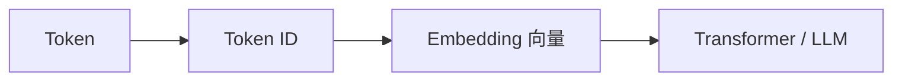
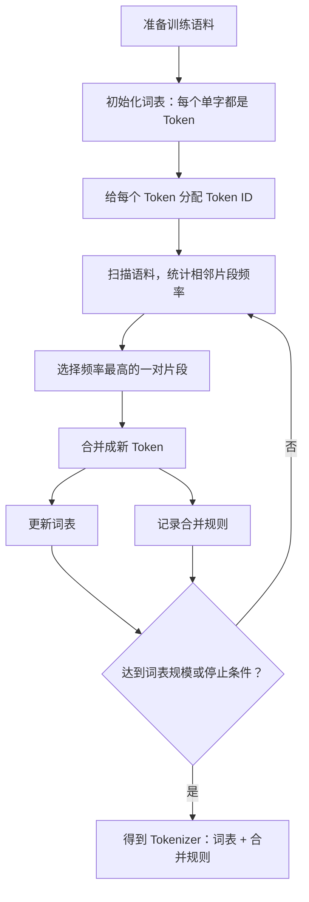
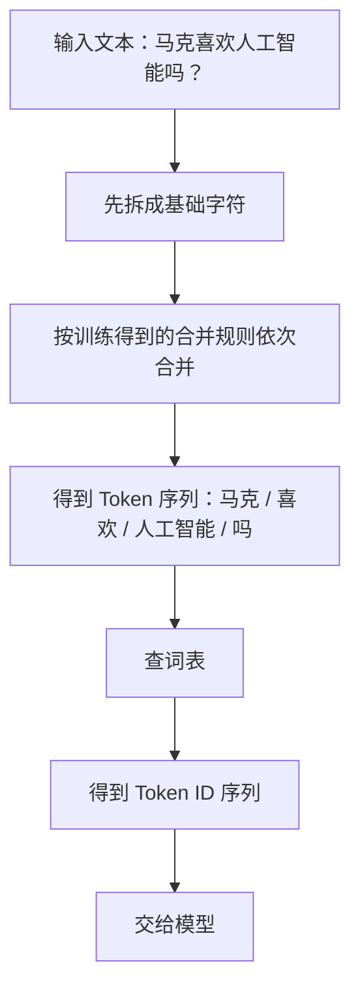
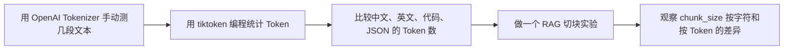

# Token 到底是什么？揭秘大模型背后的文字压缩术

日期：2026-05-11

来源视频：[Token 到底是什么？—— 揭秘大模型背后的“文字压缩术”](https://www.youtube.com/watch?v=QNiaoD5RxPA)

频道：马克的技术工作坊

发布时间：2025-12-14

时长：10:31

本地素材：

- 视频：`local-media/youtube/2025-12-14-mark-token-text-compression/Token 到底是什么？—— 揭秘大模型背后的“文字压缩术” [QNiaoD5RxPA].quicktime.mp4`
- 字幕：`local-media/youtube/2025-12-14-mark-token-text-compression/Token 到底是什么？—— 揭秘大模型背后的“文字压缩术” [QNiaoD5RxPA].quicktime.zh-Hans.srt`
- 元数据：`local-media/youtube/2025-12-14-mark-token-text-compression/Token 到底是什么？—— 揭秘大模型背后的“文字压缩术” [QNiaoD5RxPA].quicktime.info.json`
- 关键画面抽帧：`local-media/youtube/2025-12-14-mark-token-text-compression/frames/`
- 关键画面总览：`local-media/youtube/2025-12-14-mark-token-text-compression/frames/contact-keyframes.jpg`
- 评论原始数据：`local-media/youtube/2025-12-14-mark-token-text-compression/comments.json`
- 评论摘要素材：`local-media/youtube/2025-12-14-mark-token-text-compression/comments-digest.md`

说明：`local-media/` 是本地沉淀目录，不应提交进 Git。

## 配套资源 / 代码地址

- 视频：<https://www.youtube.com/watch?v=QNiaoD5RxPA>
- 代码仓库：视频简介、元数据和已抓取评论中未发现具体代码仓库地址。
- 相关视频：视频简介给出 3 个 YouTube 链接，未逐个打开核对标题。
  - <https://www.youtube.com/watch?v=geEDnyFY_dw>
  - <https://www.youtube.com/watch?v=GE0pFiFJTKo&t=11s>
  - <https://www.youtube.com/watch?v=25DEMZ7wsSM>

## 评论区补充

- 已抓取 62 条评论，没有发现置顶评论，也没有发现评论中的 URL。
- 有评论把 Token 理解为“LLM 理解语义的最小单位”。这个说法适合入门，但要加限定：Token 是模型输入输出序列的基本离散单位，不等于人类语义单位，也不保证一个 Token 自带完整语义。
- 有评论问 tokenizer 和 embedding 的区别。简化回答：tokenizer 把文本变成 Token ID；embedding 层把 Token ID 映射成向量。前者是离散符号化，后者才进入连续向量空间。
- 有评论提到 Token 可以译作“词元”。这个翻译比“令牌”更贴近 NLP 语境，但实际项目里最好保留 `Token`，避免和中文“词”混淆。
- 有评论讨论中文和英文的 Token 效率差异。结论不能一刀切，必须用对应模型的 tokenizer 实测。

## 一句话结论

Token 不是字，也不是词，而是 Tokenizer 根据词表和合并规则切出来的模型处理单位；Tokenizer 既是翻译器，把文本和数字互转，也是压缩器，把高频相邻片段合成更长 Token，从而减少模型需要处理的序列长度。

## 视频时间轴

| 时间 | 主题 | 要点 |
|---|---|---|
| 00:00 | 视频内容简介 | Context Window 说的是 Token 数，不是字数或词数。 |
| 00:37 | 大模型的基本工作原理 | 模型内部处理数字，Tokenizer 负责文本与 Token ID 的双向转换。 |
| 03:06 | Tokenizer 的训练过程 | 以 BPE 为例，从单字词表开始，反复合并高频相邻片段，生成词表和合并规则。 |
| 07:42 | Tokenizer 的使用过程 | 编码时先按合并规则切分，再按词表映射 Token ID；解码时按词表反向映射。 |
| 09:27 | Token 与字数换算关系 | Tokenizer 有压缩效果，所以 40 万 Token 不等于 40 万字。 |

## 1. Token 的位置：模型只吃数字

视频从一个硬边界讲起：大模型本质上是数学函数，输入和输出都是数字。人类写的文字不能直接进入模型，中间必须经过 Tokenizer。

这条链路里，Token 有两种表现形式：

| 表现 | 例子 | 用途 |
|---|---|---|
| Token | `马克`、`喜欢`、`人工智能` | 人类可读的文本片段。 |
| Token ID | `35`、`36`、`34` | 模型可处理的数字编号。 |

重点：Token ID 只是编号，不是 embedding。编号相近不代表语义相近，`35` 和 `36` 的关系不等于“马克”和“喜欢”的语义关系。真正的语义向量是在 embedding 层学出来的。

## 2. 编码和解码：一个有切分，一个没切分

Tokenizer 负责两个方向：

| 方向 | 输入 | 输出 | 过程 |
|---|---|---|---|
| 编码 | 文本 | Token ID 序列 | 先切分成 Token，再映射成 Token ID。 |
| 解码 | Token ID | 文本片段 | 直接查词表，把 ID 映射回 Token。 |

视频里用“马克喜欢人工智能吗？”举例。编码时会把这句话切成若干 Token，再变成类似 `[35, 36, 34, 10]` 的数字序列。模型生成时每次吐出一个 Token ID，比如 `36`，Tokenizer 再查词表把它还原成“喜欢”。

解码不用“切分”，因为模型已经输出了一个确定的 Token ID。这里不要加没必要的复杂性。

## 3. Tokenizer 是训练出来的，但不是训练大模型那套东西

视频强调 Tokenizer 也是训练出来的，不过它的训练不是大模型训练那种复杂反向传播。它更像是在语料里统计片段共现，然后形成：

- 词表：Token 和 Token ID 的映射表。
- 合并规则：哪些相邻片段可以合成更大的 Token，以及按什么顺序合并。

视频提到两类常见算法：

| 算法 | 视频里的描述 | 典型使用印象 |
|---|---|---|
| Unigram | 一种 tokenizer 实现算法 | Google 系模型较常见。 |
| BPE | 反复合并高频相邻片段 | OpenAI、Anthropic 系模型较常见。 |

这不是说所有模型永远固定如此。具体模型用什么 tokenizer，必须查对应模型文档或直接用官方 tokenizer 工具验证。

## 4. BPE 训练：从单字到高频组合

视频用 BPE 演示 Tokenizer 的训练过程。它的核心思路很朴素：先让每个基础字符都成为 Token，再反复找训练语料里最常一起出现的相邻片段，把它们合并成新 Token。

视频例子里的合并过程大致是：

| 轮次 | 高频相邻片段 | 新 Token | 结果 |
|---|---|---|---|
| 1 | `智` + `能` | `智能` | 词表加入 `智能`，合并规则记录 `智 + 能 -> 智能`。 |
| 2 | `人` + `工` | `人工` | 词表加入 `人工`。 |
| 3 | `人工` + `智能` | `人工智能` | 合并后的 Token 还能继续参与下一轮合并。 |
| 后续 | `马` + `克`、`喜` + `欢` | `马克`、`喜欢` | 高频词逐步进入词表。 |

这就是“文字压缩术”的来源。原本 9 个字都按单字输入，需要 9 个 Token；如果 `马克`、`喜欢`、`人工智能` 都进入词表，就可能变成 4 个 Token。

## 5. BPE 使用：训练时学规则，推理时套规则

训练完成后，Tokenizer 的核心资产就是词表和合并规则。实际使用时分两步：

这里有个细节很关键：合并规则有顺序。不是看到所有可能组合就随便合并，而是按训练得到的规则顺序执行。顺序变了，切分结果就可能变。

这也是为什么不同模型、不同 tokenizer 对同一句话的 Token 数可能不同。上下文预算不能靠肉眼估。

## 6. Token 不是字，也不是词

视频最后回到 Context Window：40 万 Token 不等于 40 万字，因为 Tokenizer 会把常见片段压缩成更少 Token。

视频给出的经验换算：

| 语言/单位 | 粗略换算 |
|---|---|
| 中文 | 1 个 Token 约 1.5 到 2 个汉字 |
| 英文字符 | 1 个 Token 约 4 个英文字符 |
| 英文单词 | 1 个 Token 约 0.75 个英文单词 |

这只是经验值，不是合同。工程上要这样处理：

1. 做成本估算时，用 tokenizer 实测。
2. 做 RAG 切块时，用 Token 数切，不要用字符数凑。
3. 做上下文裁剪时，保留系统规则、工具结果和关键历史，不要机械截断最后 N 个字符。
4. 同一段内容换语言后，Token 数可能变化很大，别用“字数差不多”判断成本。

## 7. tokenizer 和 embedding：别混

评论区有人问 tokenizer 和 embedding 的区别，这个问题很实用。

区别很直接：

| 概念 | 做什么 | 输出是什么 | 是否表达语义相似 |
|---|---|---|---|
| Tokenizer | 文本切分与编号 | Token ID | 不负责语义相似。 |
| Embedding | 把 ID 转成向量 | 连续向量 | 向量空间里可以表达统计关系。 |

把 Token ID 当语义编号是错误理解。Token ID 是门牌号，不是居住者性格分析。

## 工程提醒

1. Token 预算必须用真实 tokenizer 算，别用字数猜。字数猜出来的预算，到了生产就是账单和截断问题。
2. 不同模型的 tokenizer 可能不同，同一句话的 Token 数也可能不同。换模型时要重新评估上下文、价格和切块策略。
3. `Token ID` 不等于 embedding，不要拿编号大小解释语义远近。
4. BPE 是一种常见 tokenizer 方法，不是所有模型唯一方案。视频用 BPE 是为了讲清楚机制。
5. Context Window 是容量上限，不是质量保证。能塞进去不代表模型会等权重理解所有内容。
6. 对中文、英文、多语言混合文本做产品设计时，要分别测 Token 分布。别用英文经验值套中文场景。

## 和学习路线的关系

这期视频适合放在第一阶段“OpenAI 官方技术栈”的最前面。原因很简单：API 调用、上下文窗口、价格、RAG、工具调用、历史压缩，全都绕不开 Token。

建议后续实验：

最小实验不要做复杂：拿 5 段不同类型文本，统计字符数、Token 数、估算价格，再看同一段文本换模型编码时差异。这个比空谈“上下文工程”实在。

## 参考资料

- 视频：<https://www.youtube.com/watch?v=QNiaoD5RxPA>
- OpenAI Tokenizer：<https://platform.openai.com/tokenizer>
- OpenAI `tiktoken`：<https://github.com/openai/tiktoken>
- BPE 子词论文：Sennrich, Haddow, Birch, [Neural Machine Translation of Rare Words with Subword Units](https://aclanthology.org/P16-1162/)

## 未验证事项

- 本笔记基于字幕、元数据、关键画面和已抓取评论整理，没有人工完整重看视频。
- 视频里的 BPE 示例是教学用简化演示，没有在本仓库复现训练一个 tokenizer。
- 视频开头提到的具体模型 Context Window 数字没有逐项核对当前官方规格；这类数字变化快，生产决策应查官方文档。
- 视频简介中的 3 个相关视频链接未逐个打开核对标题和内容。
- 没有发现配套代码仓库；如果作者后续在评论或简介补充，需要重新抓取评论和元数据。
