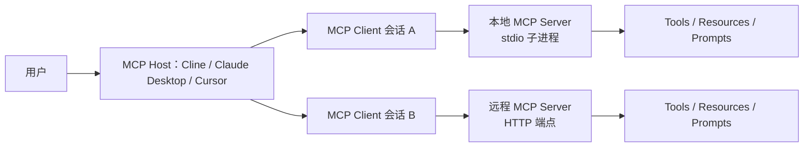
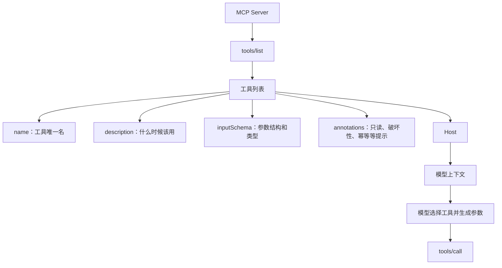
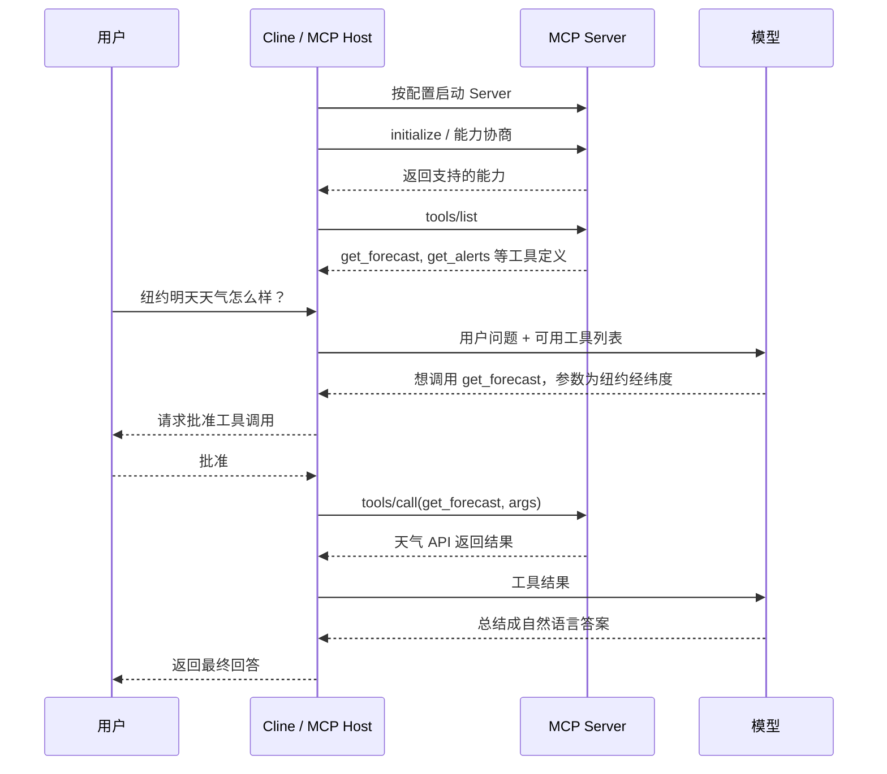
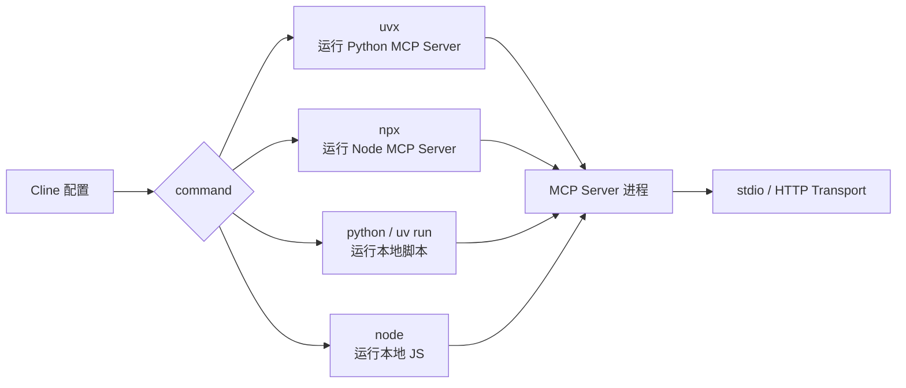

# MCP 终极指南：从原理到实战，带你深入掌握 MCP（基础篇）

日期：2026-05-12

来源视频：[MCP终极指南 - 从原理到实战，带你深入掌握MCP（基础篇）](https://www.youtube.com/watch?v=yjBUnbRgiNs)

频道：马克的技术工作坊

发布时间：2025-04-15

时长：27:05

本地素材：

- 视频：`local-media/youtube/2025-04-15-mark-mcp-guide-basic/MCP终极指南 - 从原理到实战，带你深入掌握MCP（基础篇） [yjBUnbRgiNs].quicktime.mp4`
- 字幕：`local-media/youtube/2025-04-15-mark-mcp-guide-basic/MCP终极指南 - 从原理到实战，带你深入掌握MCP（基础篇） [yjBUnbRgiNs].zh-Hans.srt`
- 字幕说明：YouTube 未暴露标准字幕轨道，字幕由本地 `whisper.cpp` ASR 生成，未逐句人工校对。ASR 把部分词识别成了近音词，例如 `Cline`、`MCP`、`server`、`tool`、`uvx`、`npx` 等，本文已按视频上下文做了术语校正。
- 元数据：`local-media/youtube/2025-04-15-mark-mcp-guide-basic/MCP终极指南 - 从原理到实战，带你深入掌握MCP（基础篇） [yjBUnbRgiNs].quicktime.info.json`
- 关键画面抽帧：`local-media/youtube/2025-04-15-mark-mcp-guide-basic/frames/`
- 关键画面总览：`local-media/youtube/2025-04-15-mark-mcp-guide-basic/frames/contact-keyframes.jpg`
- 补充流程抽帧：`local-media/youtube/2025-04-15-mark-mcp-guide-basic/frames/frame-00-16-00.jpg`、`frame-00-16-30.jpg`、`frame-00-17-10.jpg`
- 评论原始数据：`local-media/youtube/2025-04-15-mark-mcp-guide-basic/comments.json`
- 评论摘要素材：`local-media/youtube/2025-04-15-mark-mcp-guide-basic/comments-digest.md`

说明：`local-media/` 是本地沉淀目录，不应提交进 Git。

## 配套资源 / 代码地址

- 视频：<https://www.youtube.com/watch?v=yjBUnbRgiNs>
- 代码仓库：<https://github.com/MarkTechStation/VideoCode>
- MCP 官方架构文档：<https://modelcontextprotocol.io/docs/learn/architecture>
- MCP 工具规范：<https://modelcontextprotocol.io/specification/2025-11-25/server/tools>
- MCP Transport 规范：<https://modelcontextprotocol.io/specification/2025-11-25/basic/transports>
- MCP 安全最佳实践：<https://modelcontextprotocol.io/docs/tutorials/security/security_best_practices>
- Cline MCP 配置文档：<https://docs.cline.bot/mcp/adding-and-configuring-servers>

## 评论区补充

- 已抓取 179 条评论，没有发现置顶评论。
- 作者在评论区补了代码链接：<https://github.com/MarkTechStation/VideoCode>。本笔记只记录链接，没有审查仓库内容。
- 作者说明 Cline 的 Tool 描述信息旁边有 `Auto-approve`，可在后续同类调用中自动批准。这个功能要谨慎用，只适合低风险、读操作明确、参数边界清楚的工具。
- 作者回应 Docker 问题时强调：Docker 本质上也是一个程序；如果 MCP Server 用 Docker 启动，先学会 Docker 启动方式，再把启动命令写进 MCP 配置。
- 高赞评论主要反馈“用户、MCP Server、Cline、模型之间的通讯过程讲清楚了”。这说明本视频最有价值的不是安装步骤，而是交互流程图。
- 有评论希望后续讲 SSE。这里要注意时效：视频里按当时界面提到 `stdio` 和 `SSE`；截至 2026-05-12 抽查 MCP 官方文档，官方重点描述的是 `stdio` 和 `Streamable HTTP`。旧客户端和旧文档里仍可能出现 SSE 表述，不能把视频里的 transport 名称当成当前完整事实。

## Fieldbook 归档判断

- 内容类型：技术研究
- 当前归档：`20-资料笔记/`
- 是否值得升级为 lab：是，但不是现在这一步
- 判断理由：视频包含一个明确可验证的工程链路：Cline 作为 MCP Host，按 JSON 配置启动本地 MCP Server，通过工具发现和工具调用完成天气、网页抓取、新闻获取等任务。这里值得后续做一个最小 lab，把 `initialize`、`tools/list`、`tools/call`、超时、用户拒绝调用这些路径跑出来。
- 后续应进入：`50-实验验证/`，建议主题为“最小 stdio MCP Server 与工具调用链路追踪”

## 一句话结论

MCP 不是魔法，也不是“装个插件就智能了”。它的核心是：Host 启动或连接 Server，Server 暴露结构化工具，Host 把工具说明交给模型，模型决定调用哪个工具，Host 再把调用结果送回模型生成答案。真正要掌握的是这条数据流，而不是背一堆市场、插件和安装命令。

## 视频时间轴

| 时间 | 主题 | 要点 |
|---|---|---|
| 00:00 | 前言 | 视频目标不是只会安装 MCP，而是理解 MCP 的核心概念、数据流和基本用法。 |
| 01:05 | MCP 简要介绍 | MCP 让大模型通过协议使用外部工具；Cline、Claude Desktop、Cursor 等可作为 MCP Host。 |
| 02:47 | 安装 MCP Host | 用 VS Code 插件 Cline 作为演示环境。 |
| 03:15 | 配置模型 API Key | 配置模型供应商、API Key 和模型；视频中的模型推荐属于 2025 年状态，不应当作当前结论。 |
| 06:01 | 第一个 MCP 问题 | 询问天气时，Cline 建议创建或安装天气 MCP Server。 |
| 06:31 | MCP Server 和 Tool | MCP Server 本质上是一个符合 MCP 协议的程序；Tool 更接近“可调用函数”。 |
| 09:13 | 配置 MCP Server | 手动编辑 Cline 的 MCP 配置，通过 `command` 和 `args` 指定启动程序。 |
| 14:19 | 使用 MCP Server | Cline 发现天气工具，向用户请求批准，然后调用工具并让模型总结天气结果。 |
| 15:24 | MCP 交互流程 | 解释启动、工具注册、模型选择工具、Host 调用 Server、结果回传给模型的完整链路。 |
| 17:46 | uvx 启动方式 | `uvx` 用于拉取并运行 Python 程序；首次下载依赖可能导致 Cline 超时。 |
| 23:54 | npx 启动方式 | `npx` 用于拉取并运行 Node 程序；配置方式类似，但依赖 Node.js 生态。 |

## 1. 先把名词掰直：MCP Server 不一定是远程服务器

视频里最有用的纠偏是：`server` 这个词在 MCP 里容易误导。很多人一听 Server 就以为它必须是远程服务、必须联网、必须部署。不是。

MCP 官方文档把 MCP Server 定义成给 MCP Client 提供上下文的程序；它可以跑在本机，也可以跑在远端。用 `stdio` 的本地 MCP Server 通常就是 Host 启动的一个子进程，通过标准输入输出交换 JSON-RPC 消息。视频中的天气 Server、`uvx` 启动的 Fetch Server、`npx` 启动的新闻 Server，都应该先按“程序”理解，而不是按“服务器机房里的服务”理解。



好品味在这里很简单：别被名字带偏。数据结构上只有几类角色：

- `Host`：AI 应用，负责管理会话、把工具暴露给模型、处理用户批准。
- `Client`：Host 内部维护的 MCP 连接对象，一个 Server 通常对应一个 Client。
- `Server`：暴露上下文和能力的程序。
- `Tool`：Server 暴露出来的可执行函数。
- `Resource`：Server 暴露出来的可读上下文。
- `Prompt`：Server 暴露出来的提示模板。

## 2. Tool 的数据结构才是重点

视频把 Tool 类比成函数，这个类比够用。一个天气 MCP Server 可以有 `get_forecast` 和 `get_alerts` 两个工具：前者传经纬度返回天气预报，后者传州代码返回气象预警。

真正决定模型能不能正确调用工具的，不是“这个工具很智能”，而是工具定义是否清楚：



这就是为什么“Tool 描述”不能随便写。描述烂，模型就乱选；参数 schema 烂，Host 就很难校验；权限标注烂，用户也不知道自己批准了什么。

视频里有一个隐含的工程判断：让模型自动安装 MCP Server 很方便，但你会失去过程透明度。对开发者来说，手动看配置文件、知道 `command` 和 `args` 到底执行了什么，反而更可靠。

## 3. Cline 配置的本质：把一个程序交给 Host 启动

视频演示的 Cline 配置核心是 `mcpServers`。不要把这个 JSON 想复杂，它只是告诉 Cline：

- 这个 Server 叫什么。
- 用哪个命令启动它。
- 传什么参数。
- 是否启用。
- 超时时间是多少。
- 通过什么 transport 沟通。

视频里的 weather 示例大体是这个形态：

```json
{
  "mcpServers": {
    "weather": {
      "timeout": 60,
      "command": "uv",
      "args": [
        "--directory",
        "/path/to/weather",
        "run",
        "weather.py"
      ],
      "transportType": "stdio"
    }
  }
}
```

当前 Cline 文档仍然说明可以通过 `cline_mcp_settings.json` 配置本地 `STDIO` Server，典型字段是 `command`、`args`、`env`、`disabled`、`alwaysAllow`。字段细节会随客户端版本变化，不要把视频里的 JSON 当成唯一标准。原则不变：Host 根据配置启动或连接 Server。

## 4. MCP 调用流程：先注册能力，再让模型选择，再执行工具

视频 15:24 之后的流程图是整期的核心。抽象掉界面细节后，它其实是一个很朴素的调用链。



这里有两个关键边界：

- 模型不直接调用 Server。Host 才是中间的执行者和权限守门人。
- Server 不直接回答用户。Server 返回工具结果，最终回答由模型组织。

这也是为什么 MCP 的安全边界不能只靠模型“懂事”。模型只是建议调用，Host 必须负责批准、审计、权限和失败处理。

## 5. `uvx` 和 `npx` 只是启动器，不是 MCP 本身

视频后半段演示 `uvx` 和 `npx`，容易让初学者误以为 MCP 和这些工具绑定。不是。

`uvx` 的作用是下载并运行 Python 生态里的命令行程序。`npx` 的作用是下载并运行 Node 生态里的命令行程序。它们解决的是“怎么把某个 MCP Server 程序启动起来”，不是 MCP 协议本身。



视频中 `uvx` 的超时问题很实际：第一次启动 Server 时，`uvx` 需要下载依赖。如果 Cline 默认只等 60 秒，下载没完成就会报 timeout。正确处理方式不是怀疑 MCP 协议坏了，而是先把启动命令放到终端里跑一遍，让依赖缓存好，再回 Cline 重新连接；或者显式调大 timeout。

这就是工程上的笨办法，但笨得正确：先确认程序能独立启动，再接到 Host 里。别把启动失败、依赖下载慢、网络问题、协议问题混成一锅。

## 6. 这期视频讲对了什么，也漏了什么

讲对的地方：

- 把 MCP Server 从“神秘服务器”拉回“可执行程序”。
- 把 Tool 从“智能能力”拉回“带 schema 的函数”。
- 演示了 Cline 手动配置，比让模型自动安装更透明。
- 讲清了 Host、Server、模型之间的调用顺序。
- 展示了 `uvx` 首次安装依赖导致 timeout 这种真实坑。

漏掉或需要补充的地方：

- `Resources`、`Prompts` 没展开，视频主要讲 Tools。
- 远程 transport 讲得很少。视频提到 SSE，但截至 2026-05-12，MCP 官方文档重点描述的是 `stdio` 和 `Streamable HTTP`。
- 安全边界讲得不够。MCP Server 可能读文件、发请求、写数据库、调用支付、执行 shell。批准按钮不是摆设。
- 版本和供应商推荐已过期。视频里提到的模型支持、价格、免费模型稳定性，都只能看作 2025-04-15 的经验，不能当当前选型依据。
- 没有抓包或打印 JSON-RPC 消息。真正要理解协议，下一步应该把 `initialize`、`tools/list`、`tools/call` 的原始消息打出来。

## 工程提醒

1. 不要把陌生 MCP Server 当可信插件。先看源码、依赖、启动命令和权限，再接进 Host。
2. `Auto-approve` 只适合低风险、参数清晰、只读或影响范围很小的工具。文件写入、shell、数据库、邮件、支付、部署、账号操作必须保留人审。
3. API Key 不要硬编码进仓库。优先走环境变量或本机配置，并设置额度上限。
4. `uvx`、`npx` 首次启动慢，不代表 MCP 不可用。先在终端独立跑通启动命令。
5. 给 Tool 写 schema 时少玩花活。名字清楚、参数少、描述具体，比一堆泛化工具强。
6. 本地 stdio Server 适合个人开发机和 IDE Agent；企业、多用户、权限审计场景更应该认真评估远程 transport、鉴权、日志和治理。

## 工程判断

- 适合什么场景：MCP 适合把已有工具、数据源、内部系统、开发者工具接进 Agent，尤其适合需要“模型决定何时调用，但 Host 控制如何执行”的场景。
- 不适合什么场景：一次性脚本、简单 shell 能解决的问题、权限边界不清楚的高风险操作、没有维护者的第三方 Server，不该为了赶热潮硬套 MCP。
- 风险和边界：最大风险不是协议复杂，而是把执行权交给一堆来路不明的 Server。Server 的依赖链、配置文件、环境变量、网络访问和文件访问，都是攻击面。

【核心判断】
✅ 值得做：这期值得沉淀，因为它解释了 MCP 的运行链路，而不是只罗列安装步骤。

【关键洞察】
- 数据结构：`Host -> Client session -> Server -> Tool schema -> Tool call result -> Model answer` 是主链路。
- 复杂度：把 MCP Server 理解成普通程序，能消掉大部分“server 是不是要部署”的伪问题。
- 风险点：第三方 Server 的执行权限、依赖下载和自动批准，比协议本身更危险。

【Linus式方案】
1. 第一步先看配置数据结构：`mcpServers` 里到底执行什么命令。
2. 再看 Tool schema：名字、描述、参数、返回值是否清楚。
3. 用最笨的办法验证：终端先独立启动 Server，再接 Cline。
4. 高风险工具默认要求人工批准，不要用“智能”掩盖权限问题。

## 后续研究问题

- MCP 最新规范中 `Streamable HTTP` 与旧 SSE 客户端实现的迁移关系是什么？
- Cline 当前版本如何把 MCP tools 注入模型上下文？是否有动态加载或 token 优化策略？
- Tool `annotations` 在主流 Host 中是否真实影响 UI 审批和模型行为？
- MCP Registry / 市场中的 Server 如何做可信分发、版本锁定和安全审计？
- 如何把本地 stdio MCP Server 的 JSON-RPC 消息完整打印出来，形成可教学的最小 trace？
- `uvx` / `npx` 运行第三方 MCP Server 时，如何固定版本并隔离依赖、文件系统和网络权限？

## 实验验证建议

- 要验证什么：MCP 的真实链路是不是如视频所说：启动 Server、能力协商、工具发现、模型请求工具、Host 调用、结果回传。
- 最小实验形式：写一个只包含 `get_time` 和 `echo_json` 两个工具的本地 stdio MCP Server，用 MCP Inspector 或 Cline 连接，并记录 `initialize`、`tools/list`、`tools/call` 的原始消息。
- 失败路径：Server 命令不存在、首次依赖下载超时、Tool schema 缺 required 参数、用户拒绝工具调用、Tool 返回错误。
- 是否现在就做：否。当前任务是视频笔记沉淀；实验应该单独建 `50-实验验证/`，否则会把笔记任务变成半吊子工程任务。

## 参考资料

- 视频：<https://www.youtube.com/watch?v=yjBUnbRgiNs>
- 代码仓库：<https://github.com/MarkTechStation/VideoCode>
- MCP 架构：<https://modelcontextprotocol.io/docs/learn/architecture>
- MCP Tools：<https://modelcontextprotocol.io/specification/2025-11-25/server/tools>
- MCP Transports：<https://modelcontextprotocol.io/specification/2025-11-25/basic/transports>
- MCP Security Best Practices：<https://modelcontextprotocol.io/docs/tutorials/security/security_best_practices>
- Cline Adding & Configuring Servers：<https://docs.cline.bot/mcp/adding-and-configuring-servers>

## 未验证事项

- 本笔记基于视频元数据、本地 ASR 字幕、关键画面和评论区整理。ASR 字幕由 `whisper.cpp` 生成，未逐句人工校对。
- 没有运行视频中的 Cline、OpenRouter、DeepSeek、Weather MCP Server、Fetch MCP Server 或新闻 MCP Server 示例。
- 没有审查 `MarkTechStation/VideoCode` 仓库内容，只记录了作者在评论区提供的链接。
- 没有验证视频中模型推荐、价格、免费模型稳定性在 2026-05-12 是否仍然成立。
- 没有复现 `uvx` / `npx` 首次下载依赖导致 Cline timeout 的问题。
- 没有验证当前 Cline 版本的具体配置字段是否与视频完全一致；已用 Cline 官方文档做了基本交叉核对。
