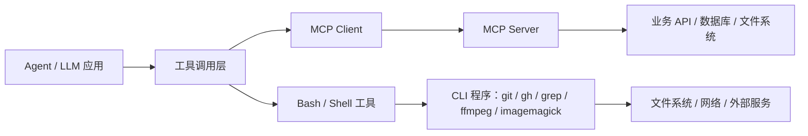
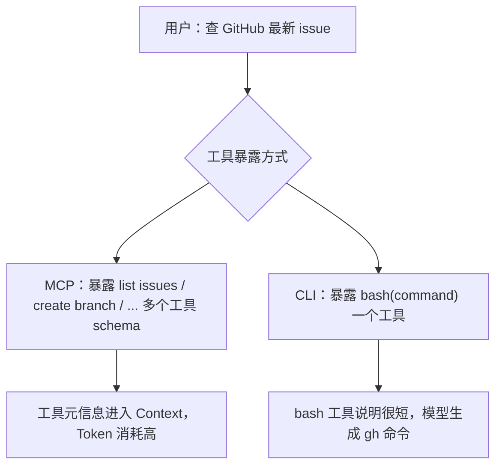
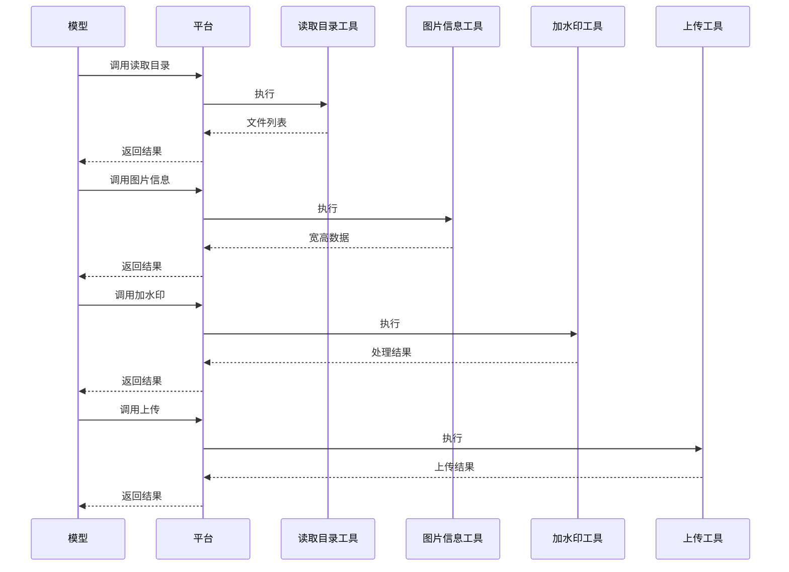
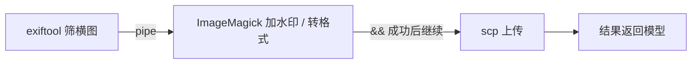
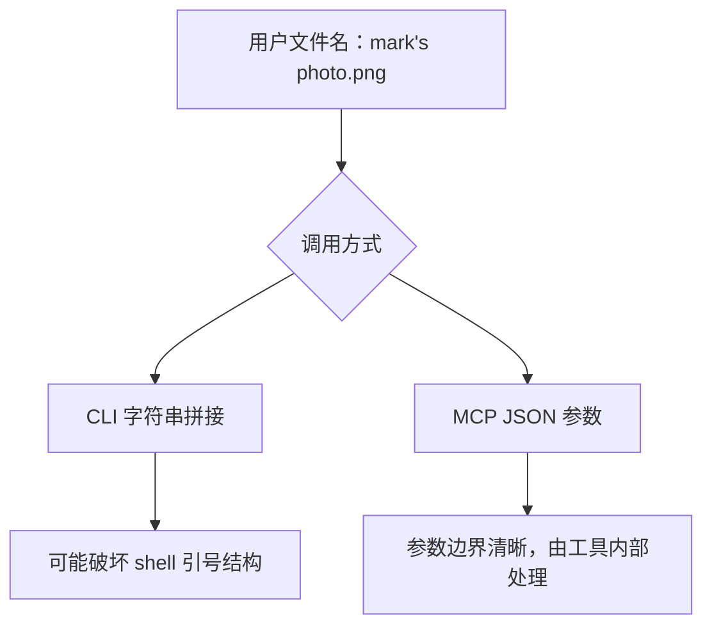
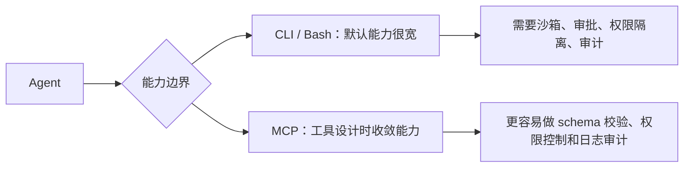
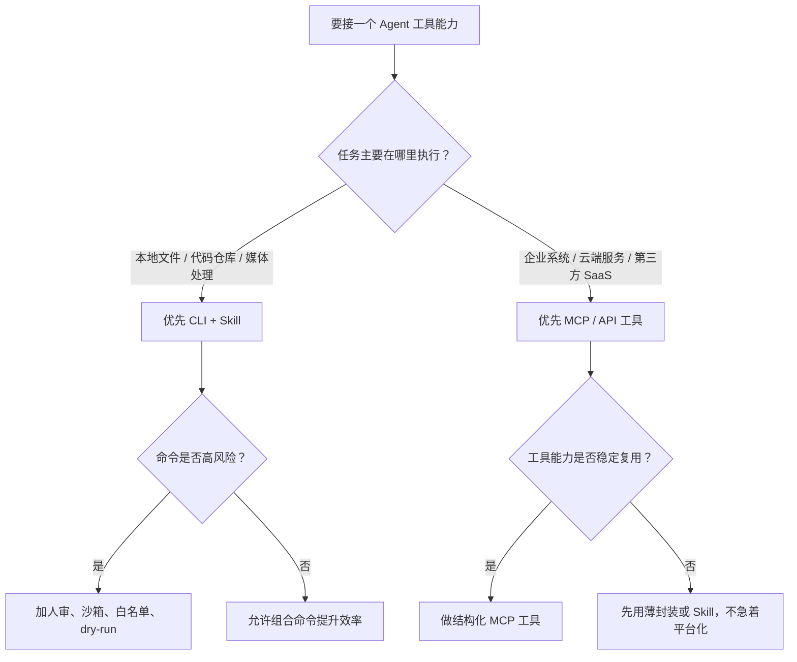
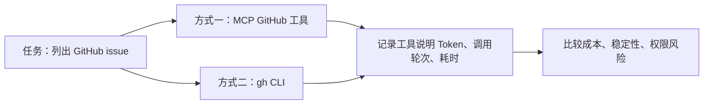

# 为什么越来越多的人抛弃 MCP，转向 CLI？

日期：2026-05-11

来源视频：[为什么越来越多的人抛弃 MCP，转向 CLI？](https://www.youtube.com/watch?v=NApOvFHCb8s)

频道：马克的技术工作坊

发布时间：2026-04-10

时长：15:38

本地素材：

- 视频：`local-media/youtube/2026-04-10-mark-mcp-cli/为什么越来越多的人抛弃 MCP，转向 CLI？ [NApOvFHCb8s].quicktime.mp4`
- 字幕：`local-media/youtube/2026-04-10-mark-mcp-cli/为什么越来越多的人抛弃 MCP，转向 CLI？ [NApOvFHCb8s].quicktime.zh-Hans.srt`
- 元数据：`local-media/youtube/2026-04-10-mark-mcp-cli/为什么越来越多的人抛弃 MCP，转向 CLI？ [NApOvFHCb8s].quicktime.info.json`
- 关键画面抽帧：`local-media/youtube/2026-04-10-mark-mcp-cli/frames/`
- 关键画面总览：`local-media/youtube/2026-04-10-mark-mcp-cli/frames/contact-keyframes.jpg`
- 评论原始数据：`local-media/youtube/2026-04-10-mark-mcp-cli/comments.json`
- 评论摘要素材：`local-media/youtube/2026-04-10-mark-mcp-cli/comments-digest.md`

说明：`local-media/` 是本地沉淀目录，不应提交进 Git。

## 配套资源 / 代码地址

- 视频：<https://www.youtube.com/watch?v=NApOvFHCb8s>
- 代码仓库：字幕中提到 OpenClaw 和 GitHub 仓库示例，但视频简介、元数据和已抓取评论中未发现具体代码仓库地址。
- 相关视频：视频简介给出 4 个 YouTube 链接，未逐个打开核对标题。
  - <https://www.youtube.com/watch?v=7qO8-kx3gW8&t=1705s>
  - <https://www.youtube.com/watch?v=GE0pFiFJTKo>
  - <https://www.youtube.com/watch?v=yDc0_8emz7M>
  - <https://www.youtube.com/watch?v=yjBUnbRgiNs&t=1361s>

## 评论区补充

- 已抓取 193 条评论，没有发现置顶评论，也没有发现评论中的 URL。
- 作者在评论中承认这期门槛更高、话题有争议，想听反馈。这点很关键：本视频不是入门概念课，而是在讨论工程取舍。
- 高赞评论里最强的反驳是：“MCP 和 CLI 互补大于替代”。这个观点比“谁抛弃谁”更稳。
- 有评论指出云端部署、分发、版本管理、多租户隔离是 CLI 的麻烦点，MCP over HTTP / stream 在云端可横向扩展、可接流量治理。这是视频里讲得不够深的部分。
- 有评论认为正确说法应是 `Skill + CLI`。这和视频的观点能接上：冷门 CLI 仍需要文档或 Skill 告诉模型怎么用。
- 有评论提醒：CLI 也可以逐条请求用户批准，经验丰富的开发者能审命令风险；反过来 MCP Server 如果没审代码，也可能有恶意工具、提示词注入或代码注入风险。也就是说 MCP 不是天然安全，只是边界更容易设计。

## 一句话结论

视频的核心判断是：CLI 在个人、本地、开发者场景里更省 Token、更快、更灵活；MCP 在企业、云端、需要结构化参数和权限边界的场景里更可控、更安全。更准确的说法不是“抛弃 MCP”，而是别拿 MCP 做 shell 本来就擅长的事情。

## 视频时间轴

| 时间 | 主题 | 要点 |
|---|---|---|
| 00:00 | 视频内容介绍 | 视频提出争议：为什么部分 Agent 使用方式从 MCP 转向 CLI。 |
| 01:23 | CLI 优势：Token 消耗小 | MCP 工具元信息会进入上下文；CLI 常只需暴露一个 bash 工具。 |
| 06:40 | CLI 优势：执行效率高 | CLI 能用管道和 `&&` 把多个程序串成一个本地流程，减少模型往返。 |
| 11:08 | MCP 优势：更可控 | MCP 用结构化参数，避免复杂 shell 引号、转义和文件名边界问题。 |
| 12:43 | MCP 优势：更安全 | MCP 工具可做能力收敛；CLI 权限过大，需要沙箱、审批和隔离。 |
| 14:29 | 未来属于谁 | 视频判断 CLI 会更多走向个人场景，MCP 会留在企业和云端场景。 |

## 1. 先划边界：MCP 和 CLI 不是同一层东西

视频标题说“抛弃 MCP，转向 CLI”，这容易误导。MCP 是模型应用接外部能力的协议；CLI 是本地或远程系统里的命令行程序接口。它们不是严格同层竞争品。



官方 MCP 文档把 MCP 描述为 client-server 架构和 JSON-RPC 协议，服务器可暴露 tools、resources、prompts 等能力。CLI 则是操作系统和程序生态里早就存在的接口。Agent 可以通过一个 `bash` 工具生成命令调用 CLI，也可以通过 MCP 结构化调用工具。

所以真正的问题不是“谁取代谁”，而是：这项任务更适合结构化远程能力，还是更适合本地命令组合？

## 2. CLI 优势一：少传工具说明，Token 成本低

视频的第一条论证是 Token 成本。

MCP 模式下，平台通常需要把可用工具的名称、描述、参数 schema 等元信息放进模型上下文，让模型知道有哪些工具可用、每个工具怎么调。工具多了，元信息会变重。

视频用 GitHub MCP Server 举例：如果一次性暴露几十个工具，工具说明可能有上千行、上万 Token。相比之下，CLI 模式可以只暴露一个 `bash` 工具，参数只有 `command`，让模型生成具体命令。



这条观点有道理，但不能绝对化：

- 如果 MCP 客户端支持按需发现、动态加载或渐进式披露，工具说明不一定每次全量塞进上下文。
- 如果 CLI 很冷门，仍要给模型说明文档；这些说明也会消耗 Token。
- 如果 CLI 命令复杂到需要长提示词和多轮纠错，省下的工具 schema 可能又被调试成本吃回去。

工程判断：常见 CLI 如 `git`、`gh`、`grep`、`ffmpeg`、`imagemagick`，模型训练中见得多，确实容易低成本调用。冷门内部 CLI 要配 Skill 或文档，不然模型只能乱猜。

## 3. CLI 优势二：命令组合减少模型往返

视频的第二条论证是执行效率。

MCP 风格的多工具流程经常是：



模型成了每一步的调度中心。每次工具返回后都要重新进模型判断下一步，延迟和 Token 都上去了。

CLI 可以把多个工具拼成一条命令，让本地 shell 一次跑完：



这个优势来自 UNIX 哲学：每个工具只做一件事，但用管道、重定向、`xargs`、`&&` 等组合起来，能拼出复杂工作流。它快、便宜、直接，尤其适合本地文件、代码仓库、批处理、媒体处理。

## 4. MCP 优势一：结构化参数更可控

视频没有把 MCP 一棍子打死。它承认 MCP 的第一大优势是可控。

CLI 最大的问题是命令字符串把“程序语法”和“业务参数”混在一起。文件名里有空格、单引号、换行符、通配符，都可能把命令搞坏。视频举例：如果文件名是 `mark's photo.png`，某些拼接命令可能因为单引号破坏 shell 结构而报错。

MCP 工具通常用结构化 JSON 参数：

```json
{
  "image_path": "mark's photo.png",
  "watermark_path": "watermark.png",
  "output_format": "png"
}
```

参数边界清楚，转义规则明确，不会和 shell 语法混成一团。



这就是好数据结构的价值。字符串拼接是烂边界，结构化参数是清晰边界。不是理论洁癖，是真能少出事故。

## 5. MCP 优势二：能力收敛，更适合云端和企业

CLI 的灵活性也是风险来源。一个 `bash` 工具理论上可以删文件、扫环境变量、发网络请求、改权限、跑挖矿程序。把它交给模型，等于把一把很锋利的刀递给一个会犯错的自动化系统。

MCP 工具可以只暴露设计者允许的能力。例如只允许：

- 查询某个系统的数据
- 创建某类 issue
- 上传到指定目录
- 读取白名单资源
- 调用有限的业务动作



但这里要小心：MCP 不是天然安全。一个恶意或粗糙的 MCP Server 也可能做坏事。MCP 的优势是更容易设计边界，不是免疫风险。

安全结论：

- 本地开发者场景：CLI 可用，但要逐条审批高风险命令。
- 云端多租户场景：裸 bash 基本不该放开，除非有强沙箱和权限隔离。
- 企业系统场景：优先结构化工具、权限模型、审计日志和最小能力暴露。

## 6. 选型矩阵：别用口号选技术



| 场景 | 更适合 | 原因 |
|---|---|---|
| 本地代码仓库检索、批量改文件、跑测试 | CLI | 现成工具多，组合强，模型熟悉。 |
| 图片、视频、PDF 批处理 | CLI | `ffmpeg`、ImageMagick、ExifTool 这类工具成熟且可组合。 |
| 企业 CRM、支付、审批、数据库写入 | MCP / API 工具 | 权限、审计、结构化参数更重要。 |
| 云端多租户自动化 | MCP / 受限工具 | 裸 CLI 风险太大，隔离成本高。 |
| 冷门内部工具 | Skill + CLI 或 MCP | 如果只是个人用，写 Skill；如果多人稳定调用，做 MCP。 |
| 高频固定流程 | MCP 或脚本化 CLI | 固定流程值得封装，别让模型每次重新拼。 |

## 7. `Skill + CLI` 是中间路线

视频提到，常见 CLI 模型已经“见过很多”，可以直接用；冷门 CLI 可以给说明文档。这个说明文档在 Agent 系统里通常就是 Skill。

`Skill + CLI` 的模式是：


这条路线很实用：

- 比裸 CLI 更稳，因为 Skill 写清楚工具用法、参数和风险。
- 比全量 MCP 更轻，因为不需要为每个动作写一个结构化 server。
- 适合个人、本地、实验性流程。

但别把 Skill 当安全边界。Skill 是说明书，不是权限系统。真正执行 shell、写文件、上传、改数据库时，仍然需要审批和沙箱。

## 工程提醒

1. CLI 不是“更低级所以更差”。UNIX 工具体系几十年活下来，不是靠情怀，是靠组合性。
2. MCP 也不是“更现代所以更好”。如果只是包装 `grep`、`ls`、`ffmpeg`，很可能是在制造上下文垃圾。
3. 字符串命令是脆弱边界。只要涉及用户输入、文件名、路径、网络参数，就要警惕引号、空格、通配符和注入。
4. 高风险命令必须人审：`rm`、`chmod`、`chown`、数据库写入、部署、支付、发邮件、批量上传、账号操作。
5. 云端不要裸奔 bash。多租户环境里，CLI 必须有沙箱、资源限制、网络限制、文件系统隔离和日志。
6. MCP Server 也要审。工具描述、参数 schema、实现代码、返回数据，都可能成为提示词注入或越权入口。
7. 工具数量别失控。几十个工具全塞给模型，是懒，不是架构。能按需加载就按需加载，能分层就分层。
8. 固定高频流程应封装。让模型每次重新发明一条复杂命令，是把确定性问题变成概率问题。

## 和学习路线的关系

这期视频适合放在第一阶段末尾和第二阶段开头：

- 已经理解 Tool 和 MCP 后，再看这个视频，能建立“工具接入不是只有 MCP 一条路”的判断。
- 学 Claude Code、Codex、Gemini CLI 时，要重点观察它们怎么处理 shell 权限、审批、工作目录和沙箱。
- 做自己的小型 Agent 产品时，先支持少量 CLI 工具和明确审批，不要一上来堆一堆 MCP Server。

最小实验建议：



再做第二个实验：图片批处理。用 MCP 多工具链和一条 `exiftool | xargs magick && scp` 风格命令分别实现，比较模型调用轮次和失败点。别靠感觉，跑数据。

## 参考资料

- 视频：<https://www.youtube.com/watch?v=NApOvFHCb8s>
- Model Context Protocol 官方文档：<https://modelcontextprotocol.io/docs>
- MCP 基础架构文档：<https://modelcontextprotocol.io/docs/learn/architecture>
- MCP 规范：<https://modelcontextprotocol.io/specification/>
- OpenAI Codex CLI 文档：<https://developers.openai.com/codex/cli/>
- GitHub CLI manual：<https://cli.github.com/manual/>
- ImageMagick command-line tools：<https://imagemagick.org/script/command-line-tools.php>
- FFmpeg 文档：<https://ffmpeg.org/documentation.html>

## 未验证事项

- 本笔记基于字幕、元数据、关键画面和已抓取评论整理，没有人工完整重看视频。
- 视频中关于 Perplexity CTO、Y Combinator CEO、OpenClaw 的具体说法没有独立核验；笔记只把它们当作视频观点背景，不当作事实结论。
- 视频里的 GitHub MCP Server 工具数量、工具说明行数、Token 数和价格估算没有在本仓库复现。
- 视频里的复杂 CLI 图片处理命令没有实际运行，尤其没有验证文件名含单引号、空格、换行时的行为。
- 视频简介中的 4 个相关视频链接未逐个打开核对标题和内容。
- 字幕提到代码仓库或项目示例，但视频简介、元数据和评论里没有发现具体代码仓库 URL。
