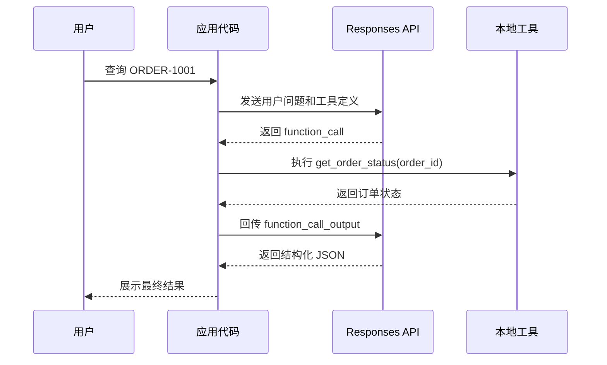

# OpenAI Responses API Lab 01

日期：2026-05-08

## 今天读了什么

- OpenAI Responses API reference: `POST /v1/responses`
- OpenAI Function calling guide
- OpenAI Structured Outputs guide
- OpenAI conversation state guide: `previous_response_id`

官方资料：

- https://developers.openai.com/api/docs/guides/function-calling
- https://developers.openai.com/api/docs/guides/structured-outputs
- https://developers.openai.com/api/docs/guides/conversation-state#passing-context-from-the-previous-response
- https://developers.openai.com/api/docs/guides/latest-model

## 跑了什么实验

新增实验文件：

- `50-实验验证/openai/01-responses-api/order_status_cli.py`

实验目标：

```text
用户输入订单号
  -> Responses API 返回 function_call
  -> 本地 get_order_status(order_id) 执行
  -> function_call_output 回传 Responses API
  -> 模型输出结构化 JSON
```

流程图：



本地工具验证命令：

```bash
uv run python 50-实验验证/openai/01-responses-api/order_status_cli.py ORDER-1001 --local-tool-only
```

完整 API 验证命令：

```bash
uv run python 50-实验验证/openai/01-responses-api/order_status_cli.py ORDER-1001 --show-raw
```

## 关键理解

一句话：**模型负责判断要不要查，应用代码负责真的去查。**

Responses API 里的 function calling 不是模型执行函数。模型只产生一个 `function_call` 输出项，里面有：

- `type`: 输出项类型，工具调用时是 `function_call`
- `name`: 工具名，例如 `get_order_status`
- `arguments`: 模型生成的 JSON 参数
- `call_id`: 回传工具结果时必须引用的调用 ID

应用代码必须自己执行本地函数，再用 `function_call_output` 把结果交回模型。

可以把它理解成一张工单：

| 字段 | 像什么 | 作用 |
| --- | --- | --- |
| `name` | 工单类型 | 告诉应用代码该执行哪个工具 |
| `arguments` | 工单内容 | 告诉应用代码工具参数是什么 |
| `call_id` | 工单编号 | 回传结果时用它对上这次调用 |
| `function_call_output` | 工单处理结果 | 应用代码把真实执行结果交回模型 |

`previous_response_id` 是状态链路。用它可以让第二次请求接上第一次响应，模型能理解刚才那个 `function_call_output` 是在回答哪个工具调用。

Structured Outputs 解决最终输出形状问题。工具参数 schema 约束的是“模型怎么调用工具”；`text.format` 约束的是“模型最终怎么回答用户”。这两个别混。

## 工程判断

这个能力适合：

- 查询订单、库存、用户账户、工单状态这类“模型需要业务系统数据才能回答”的场景。
- 低风险读取型工具。
- 需要结构化结果进入后续程序处理的流程。

这个能力不适合：

- 直接执行高风险动作，比如退款、发邮件、改数据库。那些动作必须有人审。
- 把大量业务规则塞进 prompt。规则应该尽量沉到工具和代码里。
- 暴露一大堆工具让模型乱选。Lab 01 只暴露一个工具，先把闭环跑清楚。

## 不清楚的问题

- 完整 API 实验还需要 `OPENAI_API_KEY` 才能验证真实 `function_call` 输出。
- 需要观察一次真实响应后，再确认当前 SDK 对 `text.format` 和 `text.verbosity` 的返回细节。
- 后续要比较：手写 Responses API 工具循环 vs Agents SDK 自动 run loop，到底省了哪些代码，隐藏了哪些行为。
