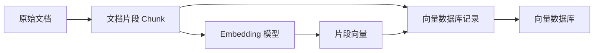
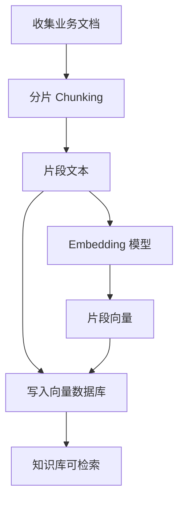
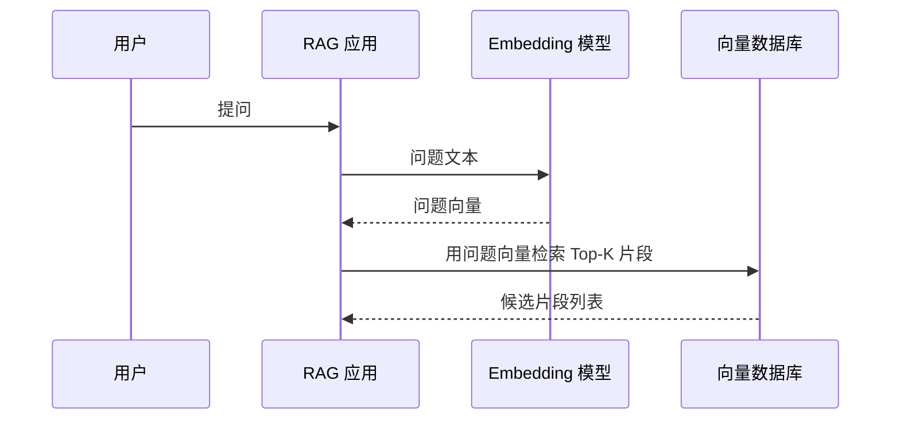
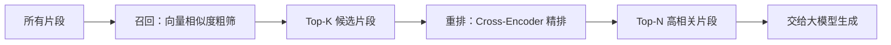
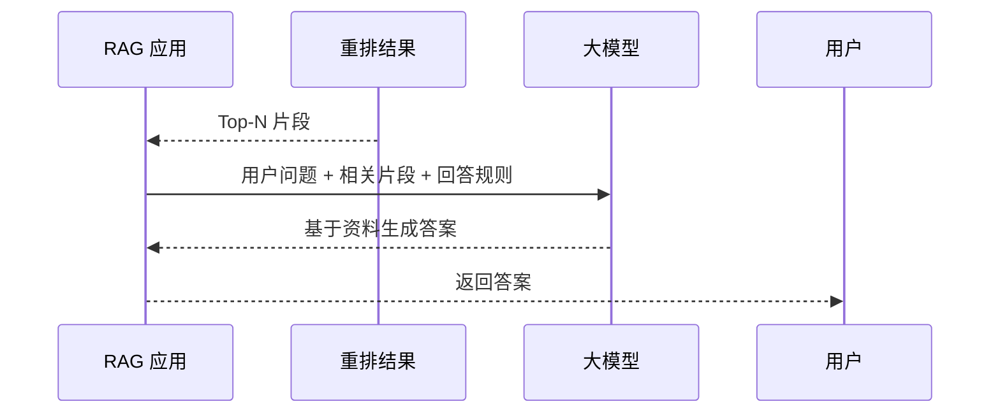
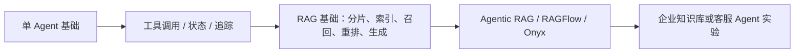

# RAG 工作机制详解——一个高质量知识库背后的技术全流程

日期：2026-05-11

来源视频：[RAG 工作机制详解——一个高质量知识库背后的技术全流程](https://www.youtube.com/watch?v=WWdlme1EAGI)

频道：马克的技术工作坊

发布时间：2025-06-21

时长：17:01

本地素材：

- 视频：`local-media/youtube/2025-06-21-mark-rag-workflow/RAG 工作机制详解——一个高质量知识库背后的技术全流程 [WWdlme1EAGI].quicktime.mp4`
- 字幕：`local-media/youtube/2025-06-21-mark-rag-workflow/RAG 工作机制详解——一个高质量知识库背后的技术全流程 [WWdlme1EAGI].zh-Hans.srt`
- 字幕说明：YouTube 对 `yt-dlp` 未暴露标准字幕轨道；此字幕由本地 `whisper.cpp` ASR 生成，有少量术语识别错误，已在本笔记中按视频语义纠正。
- 元数据：`local-media/youtube/2025-06-21-mark-rag-workflow/RAG 工作机制详解——一个高质量知识库背后的技术全流程 [WWdlme1EAGI].quicktime.info.json`
- 关键画面抽帧：`local-media/youtube/2025-06-21-mark-rag-workflow/frames/`
- 关键画面总览：`local-media/youtube/2025-06-21-mark-rag-workflow/frames/contact-keyframes.jpg`
- 评论原始数据：`local-media/youtube/2025-06-21-mark-rag-workflow/comments.json`
- 评论摘要素材：`local-media/youtube/2025-06-21-mark-rag-workflow/comments-digest.md`

说明：`local-media/` 是本地沉淀目录，不应提交进 Git。

## 配套资源 / 代码地址

- 视频：<https://www.youtube.com/watch?v=WWdlme1EAGI>
- 代码仓库：视频简介、元数据和已抓取评论中未发现具体代码仓库地址。
- 视频画面提到的 Embedding 排行榜：<https://huggingface.co/spaces/mteb/>
- 评论区作者补充的相关视频：<https://www.youtube.com/watch?v=YyVkXrXxvX8>

## 评论区补充

- 已抓取 95 条评论，没有发现置顶评论。
- 作者在评论中给出术语中英对照：向量 `Vector`、向量相似度 `Vector similarity`、向量数据库 `Vector database`、分片 `Chunking`、索引 `Indexing`、召回 `Recall`、重排 `Re-ranking`、生成 `Generation`。
- 有评论问向量相似度使用什么算法；视频里列举了余弦相似度、欧式距离和点积，但没有指定某个系统必须用哪一种。工程上要看 Embedding 模型、向量是否归一化、向量数据库索引方式和评估结果。
- 高赞评论集中在“RAG 讲清楚了”“召回和重排解释清楚”。这说明这个视频适合做 RAG 入门底座，不适合当完整生产系统指南。
- 作者还补充了一个和 Agent 实现相关的视频链接，但本笔记未展开处理。

## 一句话结论

RAG 的本质不是“把文档塞给模型”，而是先把文档切成可检索的片段并建索引；用户提问时先检索相关片段，再用重排缩小范围，最后把问题和少量高相关片段交给大模型生成答案。

## 视频时间轴

| 时间 | 主题 | 要点 |
|---|---|---|
| 00:00 | 视频内容简介 | RAG = Retrieval-Augmented Generation，先检索，再基于检索内容生成。 |
| 01:21 | RAG 的使用场景 | 企业知识库、智能客服、产品手册问答；直接把长文档丢给模型会遇到上下文、成本和延迟问题。 |
| 02:54 | RAG 的基本运行流程 | 提问前做数据准备：分片、索引；提问后做回答：召回、重排、生成。 |
| 04:18 | 分片 | 把文档切成多个片段，可以按字数、段落、章节、页码等方式切。 |
| 04:52 | 索引 | 用 Embedding 把片段转成向量，再把片段文本和向量存入向量数据库。 |
| 09:39 | 召回 | 用户问题也转成向量，在向量数据库里找最相似的一批片段。 |
| 13:08 | 重排 | 用更精细但更慢的模型在召回结果里重新排序，挑出更相关的少数片段。 |
| 15:08 | 生成 | 把用户问题和高相关片段交给大模型，让模型基于资料回答。 |
| 15:26 | 整体流程 | 回顾提问前和提问后的两条链路。 |

## 1. 为什么不能直接把文档丢给模型

视频用“公司产品智能客服”解释问题：模型本身不知道公司的产品手册，所以最直觉的方案是把手册和问题一起发给模型。

这个方案能跑 demo，但不是工程方案。原因有三个：

| 问题 | 说明 |
|---|---|
| 上下文窗口 | 文档太长时，模型无法稳定读完所有内容，容易读了后面忘了前面。 |
| 成本 | 每次提问都带上整本文档，输入 token 浪费严重。 |
| 延迟 | 输入越长，模型处理越慢，用户体验会被拖垮。 |

这里的关键不是“模型不够聪明”，而是数据结构错了。问题只需要文档中的少量相关片段，却把整本手册当成请求上下文传进去，这是把存储问题、检索问题和生成问题混在一起。

## 2. RAG 的数据结构

RAG 真正有用的地方，是把“长文档”变成可检索的数据结构：

向量数据库里至少要存两类东西：

| 字段 | 作用 |
|---|---|
| 原始片段文本 | 最终要发给大模型，让模型基于这些文本回答。 |
| 片段向量 | 用来和用户问题向量计算相似度，完成检索。 |

向量只是中间索引，不是最终答案。只存向量不存原文，最后没法把有用证据交给模型；只存原文不存向量，就无法高效做语义检索。

生产系统通常还会补充元数据，例如文档 ID、标题、页码、章节、权限标签、更新时间、来源 URL。视频没有展开这些，但做企业知识库时这些字段会直接影响可追溯性和权限控制。

## 3. 提问前：分片和索引

提问前的准备流程只有两步，但每一步都容易做烂。

分片的目的，是把长文档切成适合检索和生成的小块。视频列举了几种方式：按字数、段落、章节、页码切。工程上不要机械迷信某一种切法，真正要看文档结构和查询方式。

几个朴素原则：

- FAQ、制度条款、产品参数这种结构化内容，片段要尽量保留完整语义。
- 长篇说明文不能切得太碎，否则答案需要的信息散落在多个片段里。
- 片段也不能太大，否则召回出来仍然浪费 token，重排和生成都会变慢。
- 切片最好带上标题、章节、页码等上下文，否则片段脱离原文后容易歧义。

索引阶段做两件事：用 Embedding 模型把每个片段转成向量，并把片段文本与向量一起存进向量数据库。

Embedding 的关键性质是：语义相近的文本，向量距离也应该接近。视频用“马克喜欢吃水果”和“马克爱吃水果”距离近、“天气真好”距离远来解释这个直觉。

## 4. 提问后：召回

用户提问后，系统先把问题也送进 Embedding 模型，得到一个问题向量。然后向量数据库拿这个问题向量和片段向量计算相似度，返回最相关的一批片段。

视频示例里召回 10 个片段，但 `Top-K=10` 不是铁律。K 的大小取决于文档质量、切片粒度、问题复杂度、重排成本和最终上下文预算。K 太小容易漏掉答案，K 太大又会把噪声带进后续流程。

视频列举了三类向量相似度算法：

| 方法 | 直觉解释 | 注意点 |
|---|---|---|
| 余弦相似度 | 看两个向量方向是否接近。 | 常用于语义相似度，尤其向量归一化后。 |
| 欧式距离 | 看两个向量在空间里的距离。 | 距离越小越相似，但尺度会影响结果。 |
| 点积 | 同时受方向和长度影响。 | 如果向量没归一化，长度会参与排序。 |

别把相似度函数当装饰参数。Embedding 模型训练方式、是否归一化、向量库索引配置要配套，否则检索质量会莫名其妙地差。

## 5. 重排：为什么不直接召回 3 个

视频讲得最值得保留的一点，是召回和重排的分工。

召回负责“快”：从大量片段中粗筛出一批候选。它成本低、耗时短，但准确率不够高。

重排负责“准”：在召回出来的小集合里，用更精细的模型重新计算用户问题和候选片段的相关性，再挑出最相关的少数片段。

视频用了简历筛选和面试的类比：召回像从大量简历里先筛 10 个候选人，重排像对这 10 个人面试后挑 3 个。这个类比够直观，也能解释为什么“直接召回 3 个”通常不如“召回 10 个再重排 3 个”。

工程上要注意：重排模型不是免费午餐。它更慢、更贵，所以必须先召回缩小候选范围。否则你拿重排模型扫全库，成本会直接爆炸。

## 6. 生成：模型只该看到必要证据

生成阶段的输入很简单：

- 用户问题
- 重排后最相关的几个片段
- 必要的回答规则，例如“只基于资料回答”“不知道就说不知道”“给出引用来源”

RAG 不是保证模型永不幻觉的银弹。它只是把答案所需证据更可靠地放到模型眼前。生成质量仍然取决于检索是否命中、片段是否完整、提示词是否约束、模型是否遵守证据边界。

## 工程提醒

1. RAG 系统优先设计数据结构，不要先堆框架。文档、片段、向量、元数据、权限和引用关系没设计好，上层 Agent 再漂亮也没用。
2. 分片不是简单按固定字数切一刀。切片策略要跟文档类型、查询模式和答案长度一起调。
3. 召回和重排要分层。召回负责便宜快速地扩大候选，重排负责在小集合里提高精度。
4. 必须做评估集。至少准备一批真实问题、期望命中文档、期望答案，定期比较召回率、重排质量、答案可引用性。
5. 企业知识库必须处理权限。用户无权看的片段不能被召回，更不能被塞进模型上下文。
6. 对高风险 Agent 动作要有人审：发邮件、改数据库、调用支付、执行 shell、部署、账号操作，都不能只靠 RAG 答案自动执行。
7. 不要把 RAG 当万能补丁。结构化数据查询、精确计算、实时状态读取，很多时候应该走数据库/API/工具调用，而不是走语义检索。

## 和学习路线的关系

这个视频适合放在“真实应用场景和开源项目拆解”之前，作为企业知识库和客服 Agent 的基础课。

合理顺序是：

别一上来就做多 Agent。知识库问答这种场景，先把单 Agent、RAG、引用、权限、评估做好，比堆多个角色靠谱。

## 参考资料

- 视频：<https://www.youtube.com/watch?v=WWdlme1EAGI>
- 视频画面提到的 MTEB 排行榜：<https://huggingface.co/spaces/mteb/>
- 原始本地素材清单：`local-media/youtube/2025-06-21-mark-rag-workflow/asset-manifest.md`

## 未验证事项

- YouTube 对 `yt-dlp` 和未登录页面没有暴露标准字幕轨道；本次字幕由 `whisper.cpp` 本地 ASR 生成，未逐句人工校对。
- 本笔记没有运行任何 RAG 示例代码，也没有搭建向量数据库实验。
- 视频中提到的 MTEB 排行榜链接来自关键帧，未在本次沉淀中打开核对当前榜单状态。
- 评论区补充视频只记录链接，未继续沉淀。
