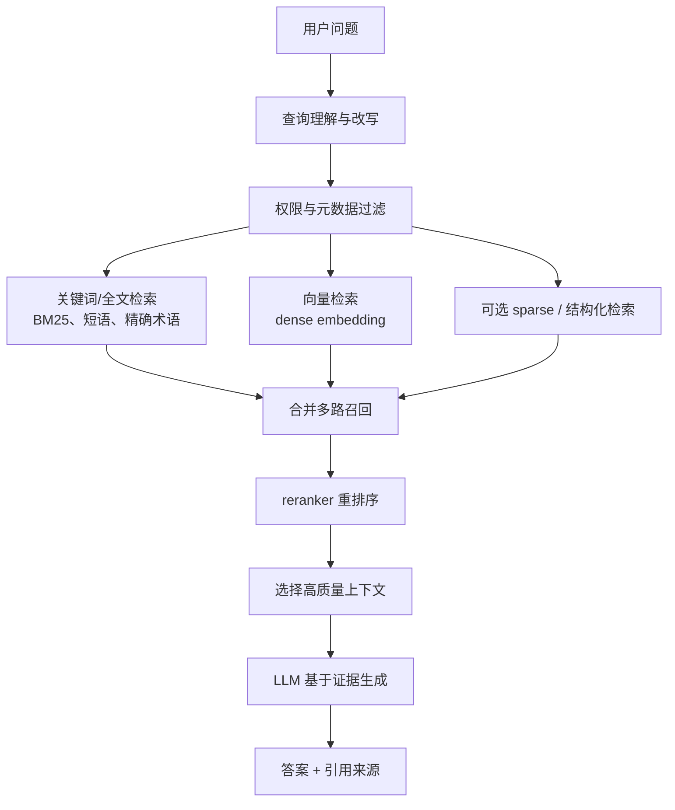

# 企业级 Hybrid RAG 与 RAGFlow 的设计取向

日期：2026-05-13

## 一句话结论

企业级 hybrid RAG 不是“向量数据库 + 大模型”的聊天 demo，而是：

```text
高质量文档解析 + 关键词检索 + 向量检索 + 元数据过滤 + rerank + 引用溯源 + 评测与运维
```

RAGFlow 的价值也不在于“能不能上传 PDF 聊天”，而在于它围绕企业文档检索做了成体系的工程设计：DeepDoc 解析、chunk 可视化、混合召回、可调权重、rerank、引用溯源、Elasticsearch/Infinity 文档引擎，以及可编排的 ingestion pipeline。

当前实践阶段的判断：先用官方默认 Elasticsearch 跑通真实知识库和评测集；后续再单独评估 Infinity。不要在没有数据前为了“看起来更先进”切换检索底座。

## 什么是 Hybrid RAG

普通 RAG 常见流程：

```text
用户问题 -> embedding -> 向量相似度搜索 -> 召回 chunks -> LLM 回答
```

这条链路能做 demo，但企业里不够。企业文档里有大量精确信息：

- 产品型号
- 合同编号
- 工单号
- 法规条款
- 部门名称
- 地区名称
- 时间版本
- 表格字段
- 故障码
- API 名称

纯向量检索擅长语义相似，但不擅长严格命中这些硬条件。它经常找回“语义上差不多、事实上不正确”的内容。

Hybrid RAG 的检索链路更像这样：



它的核心分工：

| 能力 | 解决什么问题 |
| --- | --- |
| 关键词/全文检索 | 精确命中术语、编号、条款、版本、字段 |
| 向量检索 | 找到同义表达、语义相关内容 |
| 元数据过滤 | 限定部门、时间、文档类型、权限范围 |
| rerank | 对初步召回结果重新排序，减少垃圾 chunk |
| 引用溯源 | 让答案能回到原文证据，不是黑盒生成 |
| 评测 | 量化命中率、引用准确率、幻觉率和延迟 |

一句话：关键词负责“准”，向量负责“宽”，rerank 负责“排得更像人要的结果”，引用负责“能追责”。

## 为什么企业场景必须 Hybrid

企业问题通常不是开放式闲聊，而是带约束的事实查询。

例子：

```text
华东销售经理 2025 年去北京出差，高铁一等座能不能报？
```

这里的关键约束是：

```text
华东
销售
经理
2025
北京出差
高铁一等座
报销
```

弱 RAG 可能只看到“差旅报销”，然后召回一堆相似内容：

- 2024 年差旅制度
- 全国销售报销标准
- 华东售后出差流程
- 研发中心交通补贴

这些内容语义相近，但都可能错。企业知识问答最危险的不是答不上来，而是引用了过期制度或错误部门，还说得很流畅。

企业级 hybrid RAG 应该做的是：

1. 把部门、地区、职级、年份、费用类型识别出来。
2. 用元数据或知识库范围过滤不相关文档。
3. 用关键词检索抓住“华东”“销售”“经理”“一等座”“2025”。
4. 用向量检索补上“高铁能不能报”这类自然语言表达。
5. 用 rerank 把同时满足多个约束的 chunk 排到前面。
6. 让 LLM 只基于证据回答，并给出引用。

这才是企业 RAG。只接一个向量库，然后把 top-k 塞给模型，是玩具系统。

## “企业级”多了什么

企业级不是口号，而是要处理真实组织里的麻烦：

| 能力 | 为什么重要 |
| --- | --- |
| 权限控制 | 用户不能越权看到财务、人事、合同等敏感内容 |
| 多知识库隔离 | 部门、项目、客户资料不能混在一起 |
| 文档版本管理 | 不能拿旧制度回答新问题 |
| 元数据过滤 | 按地区、部门、时间、产品线、文档类型过滤 |
| 高质量解析 | PDF、扫描件、表格、图片、页眉页脚都影响召回 |
| 混合检索 | 同时覆盖精确匹配和语义召回 |
| rerank | 初步召回经常很粗，需要重排 |
| 引用溯源 | 企业用户要看证据，不是听模型“自信表达” |
| 评测体系 | 要知道到底准不准，而不是靠手感 |
| 运维能力 | 备份、迁移、升级、资源监控、故障排查要有路径 |

企业级 hybrid RAG 的本质是：

```text
企业搜索引擎 + 语义检索 + 权限/元数据系统 + 证据链 + LLM 总结器
```

不是：

```text
向量数据库 + ChatGPT
```

## RAGFlow 在这方面做了什么努力

### 1. 把“文档解析”放在核心位置

RAGFlow 没有把 RAG 简化成“切文本 + embedding”。它强调 DeepDoc，这是很务实的方向。

企业文档的难点往往不在 LLM，而在文档本身：

- PDF 版式复杂。
- 扫描件需要 OCR。
- 表格结构需要识别。
- 标题、章节、页码会影响引用。
- 图片和表格周围的上下文会影响召回。

官方文档里，DeepDoc 是默认视觉解析模型，负责 OCR、表格结构识别、文档布局识别等任务。RAGFlow 还支持 MinerU、Docling 等替代解析方案，说明它承认“解析器选择”本身就是 RAG 质量的一部分。

这点很关键：垃圾解析进来，后面 embedding、rerank、LLM 再强也只是把垃圾包装得更漂亮。

### 2. 用 document engine 承载全文与向量

RAGFlow 默认用 Elasticsearch 存储 full text 和 vectors，也支持切换到 Infinity。

这不是随便选个数据库。RAGFlow 官方 FAQ 明确说，很多开源向量库全文检索能力有限，sparse embedding 也不能直接替代 full-text search；RAGFlow 需要 phrase search、advanced ranking 等能力，所以目前只有 Elasticsearch 和 Infinity 满足它的 hybrid search 要求。

这说明 RAGFlow 的设计前提很清楚：

```text
RAG 检索层不是纯向量库问题，而是全文检索 + 向量检索 + 排序能力的组合问题。
```

### 3. 提供可调的 hybrid search

RAGFlow 的检索不是黑盒。官方文档说明，它默认使用：

```text
weighted keyword similarity + weighted vector cosine similarity
```

默认向量相似度权重是 `0.3`，意味着关键词相似度权重是 `0.7`。这非常符合企业文档现实：精确术语和关键词通常不能被向量相似度盖过去。

如果启用 rerank 模型，检索组合会变成：

```text
weighted keyword similarity + weighted reranking score
```

这给了我们实验空间：

- 偏制度、合同、政策：可以提高关键词权重。
- 偏自然语言问答、同义表达：可以提高向量或 rerank 影响。
- 对高价值问答：可以启用 rerank，牺牲一些延迟换准确率。
- 对高并发低价值查询：可以不启用 rerank，优先响应速度。

这是工程系统该有的样子：把关键旋钮暴露出来，而不是假装一个默认值适合所有企业。

### 4. 把 ingestion pipeline 组件化

RAGFlow 的 ingestion pipeline 把入库流程拆成：

```text
Parser -> Transformer -> Chunker -> Indexer
```

各组件职责清楚：

| 组件 | 作用 |
| --- | --- |
| Parser | 读取文件，提取文本、结构、表格、版面信息 |
| Transformer | 增强文本，比如摘要、关键词、问题生成 |
| Chunker | 把长文本切成适合检索和上下文窗口的 chunks |
| Indexer | 写入 document engine，支持全文、向量或 hybrid |

这比“一键上传然后内部随便处理”更适合企业场景。因为企业 RAG 后期一定会调解析、调 chunk、调 metadata、调召回策略。流程不可见，就没法维护。

### 5. 强调引用溯源，降低幻觉

RAGFlow README 和 FAQ 都把 citations / references 放在核心特性里。Chat 配置里也有 `Show quote`，默认启用。

这不是 UI 细节，而是企业可用性的底线：

```text
没有引用的企业 RAG 答案，很难进入真实业务流程。
```

引用的价值：

- 用户能判断答案是否来自权威文档。
- 发现错误时可以定位到具体 chunk、文档和解析问题。
- 可以区分“模型推理”与“文档证据”。
- 后续评测可以检查引用是否真正支持答案。

### 6. 正视 rerank 的成本

RAGFlow 文档没有把 rerank 说成免费午餐。官方明确提醒：rerank 会显著增加响应时间，没有 GPU 时可能非常慢。

这点反而是优点。好的工程系统应该让用户知道代价：

```text
更准通常意味着更慢。
更便宜通常意味着效果有限。
没有评测就无法判断是否值得。
```

### 7. 自研 Infinity 补齐检索底座

RAGFlow 官方解释过 Infinity 的由来：常见向量数据库不能满足它对 hybrid search、phrase search、advanced ranking 的要求，所以 InfiniFlow 自研了 Infinity。

这说明 RAGFlow 团队的判断不是“向量数据库越火越好”，而是从 RAGFlow 的检索需求倒推存储与检索引擎。

但这不等于我们当前应该立刻切换到 Infinity。Infinity 的方向值得关注，当前实践仍应遵守一个原则：

```text
先用 Elasticsearch 建立基线，再用同一批知识库和问题评估 Infinity。
```

没有 A/B 数据，谈“更好用”就是拍脑袋。

## RAGFlow 的优势

### 优势一：更接近企业文档真实问题

很多 RAG 工具只强调向量检索，RAGFlow 明显更重视文档解析、版式、表格、OCR、chunk、引用。这更接近企业知识库落地的主要矛盾。

企业 RAG 的失败往往不是模型不会写，而是：

- PDF 解析错了。
- 表格被切碎了。
- 章节层级丢了。
- 引用找不到原文。
- 关键词精确命中被语义相似度淹没了。

RAGFlow 在这些地方投入了较多设计。

### 优势二：混合检索是默认思路

RAGFlow 默认使用关键词相似度和向量相似度的组合，而不是把 hybrid 当高级插件。这符合企业 RAG 的正确方向。

尤其是默认关键词权重高于向量权重，这个取向很实用。企业文档里的“编号、条款、制度名称、产品型号”往往比语义相似更重要。

### 优势三：检索链路可解释、可调

RAGFlow 提供 chunk 可视化、retrieval test、similarity threshold、vector similarity weight、rerank model 等配置点。

这些东西看起来繁琐，但这是企业系统必须有的调试入口。没有这些入口，效果差的时候只能玄学调 prompt。

### 优势四：默认稳定，保留演进路线

RAGFlow 默认用 Elasticsearch，这是成熟路线；同时支持 Infinity，这是面向 AI-native 检索的演进路线。

这比强迫用户直接押注一个新数据库更务实：

```text
默认 ES：稳定、资料多、排障路径成熟。
可选 Infinity：贴合 RAGFlow 未来检索需求，适合专项评测。
```

### 优势五：模型与流程解耦

当前 `v0.25.2` 官方镜像不再内置 embedding 模型，而是让用户配置外部或本地 embedding/rerank/LLM 服务。

这对企业反而是正常方向。企业会根据成本、数据安全、中文效果、部署位置选择模型，不能被工具内置模型绑死。

## 不能忽略的限制

RAGFlow 不是银弹。

| 限制 | 影响 |
| --- | --- |
| 资源占用较高 | DeepDoc、ES、rerank 都不是轻量组件 |
| rerank 会增加延迟 | 没 GPU 时尤其明显 |
| embedding 模型选错会影响整个知识库 | 已产生 chunks 后切换 embedding 通常要删 chunks 重建 |
| Elasticsearch 运维复杂 | 内存、磁盘、水位、索引、备份都要管 |
| Infinity 需要实测 | 方向好，但不能替代基准测试 |
| 本地开源版与企业云版能力不完全一致 | 官方 FAQ 提到云版展示企业版能力，权限控制更复杂 |

好的技术判断不是“RAGFlow 很强所以不用评测”，而是：

```text
RAGFlow 给了足够多的正确组件，但效果必须用自己的文档和问题验证。
```

## 后续实践怎么验证

下一步不该继续讨论概念，而是建立评测集。

建议先准备 30-50 个企业 RAG 问题，覆盖：

- 精确编号类：合同号、制度编号、产品型号。
- 版本类：同一制度不同年份。
- 表格类：报销标准、价格表、参数表。
- 跨章节类：答案需要组合多个段落。
- 否定类：文档没有明确答案时是否会胡说。
- 权限/范围类：不同知识库是否会混。

每个问题记录：

| 字段 | 说明 |
| --- | --- |
| 问题 | 用户自然语言问题 |
| 标准答案 | 人工确认的正确答案 |
| 证据文档 | 正确来源文件 |
| 证据位置 | 页码、章节、表格或 chunk |
| 必须命中的关键词 | 产品名、编号、年份、部门等 |
| 可接受答案 | 允许的表达差异 |
| 不可接受答案 | 常见误答 |

然后在 RAGFlow 里比较：

| 实验项 | 要看什么 |
| --- | --- |
| 无 rerank vs 有 rerank | 准确率提升是否值得延迟成本 |
| 向量权重 0.3/0.5/0.7 | 企业文档更依赖关键词还是语义 |
| 不同 embedding 模型 | 中文、表格、术语召回差异 |
| Elasticsearch vs Infinity | 同一数据、同一问题下的召回和延迟 |
| 不同 chunk 策略 | 表格、章节、长文档是否被切坏 |

## 当前工程判断

对我们已经部署的这台内网服务器：

1. 继续使用官方默认 Elasticsearch。
2. 先配置 LLM、embedding，导入一批真实文档。
3. 用 retrieval test 观察 chunks 和 hybrid score。
4. 再决定是否启用 rerank。
5. 等有评测集后，另起一套 Infinity 环境做 A/B。

不要反过来。先换数据库、再找问题，这是坏工程习惯。

## 参考资料

本笔记依据本机官方仓库 `/home/fjhc/dev/ragflow`，版本 `v0.25.2`：

- RAGFlow README：`/home/fjhc/dev/ragflow/README.md`
- RAGFlow FAQ：`/home/fjhc/dev/ragflow/docs/faq.mdx`
- 知识库配置：`/home/fjhc/dev/ragflow/docs/guides/dataset/configure_knowledge_base.md`
- 检索测试：`/home/fjhc/dev/ragflow/docs/guides/dataset/run_retrieval_test.md`
- Chat 配置：`/home/fjhc/dev/ragflow/docs/guides/chat/start_chat.md`
- Agent Retrieval 组件：`/home/fjhc/dev/ragflow/docs/guides/agent/agent_component_reference/retrieval.mdx`
- Ingestion pipeline：`/home/fjhc/dev/ragflow/docs/guides/agent/agent_quickstarts/ingestion_pipeline_quickstart.md`
- PDF parser 选择：`/home/fjhc/dev/ragflow/docs/guides/dataset/select_pdf_parser.md`
