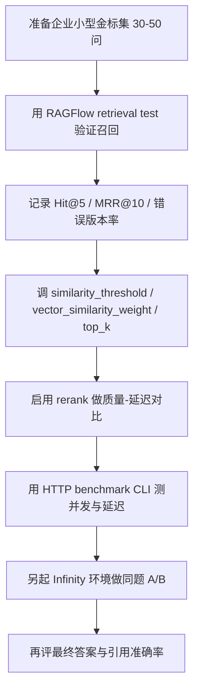

# RAGFlow 官方评测体系与测试数据集调研

日期：2026-05-13

## 结论

RAGFlow 官方目前没有给出一套完整的“企业级 RAG 问答质量金标数据集 + 自动评分体系”。它提供的是三类材料：

1. **检索质量 benchmark**：仓库里的 `rag/benchmark.py` 支持公开检索数据集 `ms_marco_v1.1`、`trivia_qa`、`miracl`，指标包括 `ndcg@10`、`map@5`、`mrr@10`。
2. **产品内 retrieval test**：RAGFlow UI/API 支持对已解析知识库做检索测试，观察是否召回预期 chunks，并调 `similarity_threshold`、`vector_similarity_weight`、`rerank`、`top_k`、跨语言、知识图谱等参数。
3. **HTTP benchmark CLI**：`test/benchmark` 提供 chat/retrieval 接口压测工具，关注延迟、并发、QPS、成功率，而不是答案质量。

工程判断：

```text
官方 benchmark 适合评检索底座和公开数据集表现；
retrieval test 适合调知识库召回；
HTTP benchmark 适合评性能；
企业问答质量评测仍然要我们自己做金标集。
```

不要把这三者混成一个东西。检索评测、接口压测、答案质量评测是三件事。

## 官方公开检索 Benchmark

RAGFlow release notes 中明确提到支持对以下数据集运行 retrieval benchmarking：

- `ms_marco_v1.1`
- `trivia_qa`
- `miracl`

仓库代码位置：

```text
/home/fjhc/dev/ragflow/rag/benchmark.py
```

命令入口：

```bash
python rag/benchmark.py <max_docs> <kb_id> <dataset> <dataset_path> [<miracl_corpus_path>]
```

代码里支持的数据集参数：

```text
ms_marco_v1.1
trivia_qa
miracl
```

代码里使用的指标：

```python
["ndcg@10", "map@5", "mrr@10"]
```

依赖：

```python
from ranx import evaluate
from ranx import Qrels, Run
```

### 数据集用途

| 数据集 | 适合评什么 | 注意点 |
| --- | --- | --- |
| MS MARCO | 英文 passage 检索、问答检索 | 更偏搜索/问答公开 benchmark，不代表企业中文制度文档 |
| TriviaQA | 问答检索 | 更偏百科/开放域问题，不代表合同、制度、表格类企业知识 |
| MIRACL | 多语言检索 | 可用于中文和跨语言检索基线，但仍不是企业私有文档 |

MIRACL 代码里遍历的语言包括：

```text
ar, bn, de, en, es, fa, fi, fr, hi, id, ja, ko, ru, sw, te, th, yo, zh
```

### 指标含义

| 指标 | 说明 | 适合回答的问题 |
| --- | --- | --- |
| `ndcg@10` | 前 10 个结果的排序质量，相关文档越靠前越好 | 召回结果排序是否靠谱 |
| `map@5` | 前 5 个结果的平均精确率 | 前排结果是否干净 |
| `mrr@10` | 前 10 个结果中第一个相关结果的位置 | 正确证据能否尽快出现 |

这些指标评的是 retrieval，不是最终答案质量。它们不能直接回答“LLM 生成得好不好”。

## RAGFlow 内置 Retrieval Test

官方文档建议：上传并解析文件后，在配置 chat assistant 前先运行 retrieval test。这个建议是对的。因为如果正确 chunks 都召不回来，后面调 prompt 是浪费时间。

文档位置：

```text
/home/fjhc/dev/ragflow/docs/guides/dataset/run_retrieval_test.md
```

功能目标：

```text
检查指定 query 是否能从 dataset 中召回预期 chunks。
```

检索逻辑：

- 未选择 rerank model 时：`weighted keyword similarity + weighted vector cosine similarity`
- 选择 rerank model 时：`weighted keyword similarity + weighted reranking score`
- 知识图谱生成的 chunks：仅使用 vector cosine similarity

关键参数：

| 参数 | 默认/含义 | 用途 |
| --- | --- | --- |
| `similarity_threshold` | 默认 `0.2` | 过滤低相关 chunks |
| `vector_similarity_weight` | 默认 `0.3` | 向量相似度权重，关键词权重为 `1 - x` |
| `rerank model` | 默认空 | 启用后用 rerank score 替代 vector cosine 参与加权 |
| `use_kg` | 默认关闭 | 检索知识图谱实体/关系/社区报告 |
| `cross_languages` | 默认空 | 跨语言检索 |

RAGFlow API 也提供 chunks retrieval：

```http
POST /api/v1/retrieval
```

请求体支持：

```json
{
  "question": "What is advantage of ragflow?",
  "dataset_ids": ["..."],
  "document_ids": ["..."],
  "similarity_threshold": 0.2,
  "vector_similarity_weight": 0.3,
  "top_k": 1024,
  "rerank_id": "...",
  "keyword": true,
  "highlight": true,
  "cross_languages": ["Chinese"],
  "metadata_condition": {},
  "use_kg": false,
  "toc_enhance": false
}
```

这对我们最有用。企业 RAG 的第一阶段评测，不要先评“答案写得像不像”，先评：

```text
正确证据有没有被召回？
正确证据排第几？
错误版本/错误部门/错误文档有没有混进来？
```

## HTTP Benchmark CLI

仓库还有一套 HTTP API benchmark：

```text
/home/fjhc/dev/ragflow/test/benchmark
```

README 说明它支持两类命令：

```bash
PYTHONPATH=./test uv run -m benchmark retrieval ...
PYTHONPATH=./test uv run -m benchmark chat ...
```

它能做：

- 创建 dataset
- 上传 documents
- 触发解析
- 创建 chat
- 调 `/api/v1/retrieval`
- 调 OpenAI-compatible chat completion
- 设置并发和迭代次数
- 输出延迟、成功率、QPS

它不能做：

- 自动判断答案是否正确
- 自动判断引用是否支持答案
- 替代 retrieval quality benchmark
- 替代企业金标问答集

报告指标来自 `test/benchmark/metrics.py` 和 `report.py`：

| 类型 | 指标 |
| --- | --- |
| retrieval | latency avg/min/p50/p90/p95、success、failure、QPS |
| chat | total latency、first token latency、success、failure、QPS |

这套 CLI 对后续性能实验很有用，比如：

- ES vs Infinity 的检索延迟
- 有 rerank vs 无 rerank 的延迟差异
- 不同 `top_k` 的延迟差异
- 并发 1/4/8/16 下的响应稳定性

但它不是质量评测。

## EvaluationService：看起来在建设中

仓库里有一套 `EvaluationService` 和数据库模型：

```text
/home/fjhc/dev/ragflow/api/db/services/evaluation_service.py
/home/fjhc/dev/ragflow/api/db/db_models.py
/home/fjhc/dev/ragflow/internal/entity/evaluation.go
```

模型包括：

- `EvaluationDataset`
- `EvaluationCase`
- `EvaluationRun`
- `EvaluationResult`

设计意图很清楚：

```text
评测数据集 -> 测试用例 -> 执行一次评测 -> 保存每个 case 的结果和指标
```

`EvaluationCase` 支持字段：

- `question`
- `reference_answer`
- `relevant_doc_ids`
- `relevant_chunk_ids`
- `metadata`

`EvaluationService` 当前计算的 retrieval 指标：

- `precision`
- `recall`
- `f1_score`
- `hit_rate`
- `mrr`

生成侧目前只有基础指标：

- `answer_length`
- `has_answer`

代码里留了 TODO：

```text
Faithfulness
Answer relevance
Context relevance
Semantic similarity
```

关键判断：我在当前 `v0.25.2` 仓库里没有找到这套 `EvaluationService` 对外暴露的 API 路由或 UI 入口。也就是说，它像是一个正在建设或内部准备的评测服务骨架，不能当成当前可直接使用的官方评测产品能力。

## 官方材料能怎么用于我们的实验

### 第一阶段：UI/API retrieval test

目标：验证企业文档是否能召回正确证据。

建议先准备 30-50 个问题，每个问题人工标注：

| 字段 | 说明 |
| --- | --- |
| `question` | 用户问题 |
| `expected_doc` | 应命中文档 |
| `expected_page_or_section` | 应命中页码/章节 |
| `expected_chunk_text` | 应命中的原文片段 |
| `must_keywords` | 必须出现的关键词，如年份、部门、型号 |
| `negative_docs` | 不应命中的旧版本/错误部门文档 |
| `case_type` | 编号、版本、表格、跨章节、否定、权限等 |

评测指标：

| 指标 | 计算方式 |
| --- | --- |
| `Hit@k` | Top-k 中是否出现正确证据 |
| `MRR@k` | 第一个正确证据的倒数排名 |
| `Precision@k` | Top-k 中正确证据占比 |
| `WrongVersionRate` | 是否召回错误年份/版本并排在前面 |
| `Latency` | `/api/v1/retrieval` 响应时间 |

### 第二阶段：HTTP benchmark CLI

目标：评延迟和吞吐。

可复用官方 CLI：

```bash
cd /home/fjhc/dev/ragflow
PYTHONPATH=./test uv run -m benchmark retrieval \
  --base-url http://127.0.0.1:18080 \
  --api-key <YOUR_API_KEY> \
  --dataset-id <DATASET_ID> \
  --question "你的测试问题" \
  --iterations 10 \
  --concurrency 4
```

注意：我们部署的 Web 入口是 `18080`，不是官方示例里的 `9380`。官方 `test/benchmark` 走的是 HTTP API，实际使用时要以部署入口为准。

### 第三阶段：公开 benchmark

目标：评检索底座能力，不评企业业务效果。

可试：

```bash
cd /home/fjhc/dev/ragflow
python rag/benchmark.py 1000 <kb_id> ms_marco_v1.1 /path/to/ms_marco
python rag/benchmark.py 1000 <kb_id> trivia_qa /path/to/trivia_qa
python rag/benchmark.py 1000 <kb_id> miracl /path/to/miracl /path/to/miracl_corpus
```

这部分更适合做：

- ES vs Infinity 检索质量对比
- 不同 embedding 模型对公开检索数据集的影响
- `vector_similarity_weight` 对排序指标的影响

但它有一个硬限制：公开数据集不是我们的企业文档，结论只能做技术基线，不能直接代表业务效果。

## 推荐的后续实验路线

不要一上来做复杂自动评测。先把问题拆开。



当前最应该做的是：

1. 配好 embedding 和 chat model。
2. 导入一批真实文档。
3. 建一个小型人工金标集。
4. 先评 retrieval，不要先评生成。
5. 等召回稳定后，再评答案正确性、引用准确性和幻觉率。

## 官方参考

- RAGFlow release notes：`/home/fjhc/dev/ragflow/docs/release_notes.md`
- RAGFlow retrieval test 文档：`/home/fjhc/dev/ragflow/docs/guides/dataset/run_retrieval_test.md`
- RAGFlow HTTP API reference：`/home/fjhc/dev/ragflow/docs/references/http_api_reference.md`
- RAGFlow retrieval benchmark 脚本：`/home/fjhc/dev/ragflow/rag/benchmark.py`
- RAGFlow HTTP benchmark CLI：`/home/fjhc/dev/ragflow/test/benchmark/README.md`
- MS MARCO：<https://huggingface.co/datasets/microsoft/ms_marco>
- TriviaQA：<https://huggingface.co/datasets/mandarjoshi/trivia_qa>
- MIRACL：<https://huggingface.co/datasets/miracl/miracl>
