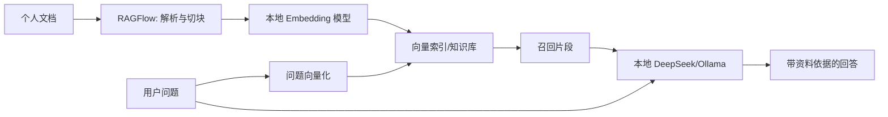

# DeepSeek + RAGFlow 构建个人知识库，2026 本地化部署

日期：2026-05-12

来源视频：[【喂饭教程】30分钟教会你用DeepSeek+RAGFlow构建个人知识库，2026最新最详细本地化部署！超详细喂饭教程，小白也能轻松拿捏！！AI大模型|LLM](https://www.youtube.com/watch?v=f_vA0C1gBII)

频道：AI大模型小冉Agent

发布时间：2026-03-12

时长：32:26

本地素材：

- 视频：`local-media/youtube/2026-05-12-ragflow-f-va0c1gbii/【喂饭教程】30分钟教会你用DeepSeek+RAGFlow构建个人知识库，2026最新最详细本地化部署！超详细喂饭教程，小白也能轻松拿捏！！AI大模型｜LLM [f_vA0C1gBII].quicktime.mp4`
- 音频：`local-media/youtube/2026-05-12-ragflow-f-va0c1gbii/audio-16k.wav`
- 字幕：缺失
- 字幕说明：YouTube 未暴露可用标准字幕轨道；本次尝试过 `whisper.cpp` base 与 tiny ASR，但均未在合理时间内产出字幕文件，未生成 `transcript-clean.txt` / `chapter-transcript.md`。因此本文主要基于元数据、关键帧、评论摘要和官方校准事实整理；视频细节没有逐句人工校对。
- 元数据：`local-media/youtube/2026-05-12-ragflow-f-va0c1gbii/【喂饭教程】30分钟教会你用DeepSeek+RAGFlow构建个人知识库，2026最新最详细本地化部署！超详细喂饭教程，小白也能轻松拿捏！！AI大模型｜LLM [f_vA0C1gBII].quicktime.info.json`
- 关键画面抽帧：`local-media/youtube/2026-05-12-ragflow-f-va0c1gbii/frames/`
- 资产清单：`local-media/youtube/2026-05-12-ragflow-f-va0c1gbii/asset-manifest.md`
- 评论原始数据：`local-media/youtube/2026-05-12-ragflow-f-va0c1gbii/comments.json`
- 评论摘要素材：`local-media/youtube/2026-05-12-ragflow-f-va0c1gbii/comments-digest.md`

说明：`local-media/` 是本地沉淀目录，不应提交进 Git。

## 配套资源 / 代码地址

- 视频：https://www.youtube.com/watch?v=f_vA0C1gBII
- 评论区资源：频道作者在评论中给出微信公众号资料链接 `https://mp.weixin.qq.com/s/uMs6oHX4qfcWfWUWhg9riA`
- 代码仓库：视频简介、元数据、评论摘要中未发现专门配套代码仓库；关键帧显示使用的是 RAGFlow 官方仓库。
- RAGFlow 官方仓库：https://github.com/infiniflow/ragflow
- RAGFlow v0.25.2 release：https://github.com/infiniflow/ragflow/releases/tag/v0.25.2

## 评论区补充

- 评论区总量很小，只有 9 条，没有置顶评论。
- 高信号问题集中在两类：一是“RAGFlow 还是要 API 怎么办”，说明视频里的“本地化”容易被误解为完全不需要任何 API；二是“断网能不能跑”，说明本地 LLM、本地 embedding、RAGFlow 服务、外部 API provider 之间的边界需要说清楚。
- 有观众质疑“既然是根据自己上传内容回答，为什么不直接看资料”。这个问题其实击中 RAG 的真实价值：资料量小、结构清晰时，不值得上 RAG；资料多、检索成本高、需要反复问答时，RAG 才有实际收益。

## Fieldbook 归档判断

- 内容类型：工具观察 / 资料消化
- 当前归档：`20-资料笔记/`
- 是否值得升级为 lab：是，但不是直接复刻视频，而是做一个最小验证实验。
- 判断理由：视频覆盖了本地 Ollama、DeepSeek、Embedding、Docker Compose、RAGFlow 配置和知识库问答。这里最值得验证的不是“能不能点起来”，而是本地 LLM + 本地 embedding + RAGFlow 在无外部 API 情况下是否真的能完成上传、切分、索引、检索、引用和回答。
- 后续应进入：`50-实验验证/`，建议实验名类似 `50-实验验证/ragflow-local-deepseek-minimal/`。

## 一句话结论

这个视频的核心路线是：用 Ollama 在本机跑 DeepSeek 和 embedding 模型，用 Docker Compose 启动 RAGFlow，再在 RAGFlow 里配置 Ollama provider，把个人资料导入知识库做检索增强问答。思路是对的，但“2026 最新”和“纯本地化”都必须校准：截至 2026-05-12，RAGFlow 当前最新 release 是 v0.25.2，部署要求、镜像策略、API 兼容策略已经和视频画面里的部分旧说法不完全一致；所谓本地化也只有在 LLM、embedding、rerank、文档解析和数据源都不调用外部服务时才成立。

## 视频时间轴

| 时间 | 主题 | 要点 |
|---|---|---|
| 00:00-03:48 | 为什么不用网页 DeepSeek | 网页端上传资料有隐私、成本、断网和可控性问题；个人知识库更适合本地 RAG。 |
| 03:48-07:37 | 为什么用 RAG | 大模型参数知识和个人资料不在同一个空间；RAG 用检索把外部资料变成上下文。 |
| 07:37-11:26 | Embedding 是什么 | 文档先切块，再转向量，查询也转向量，通过相似度召回相关片段。 |
| 11:26-15:15 | 本地部署全流程 | 关键帧列出三步：下载 Ollama 并拉取 DeepSeek/embedding，下载 RAGFlow 并 Docker 启动，把 RAGFlow 接入 Ollama。 |
| 15:15-19:04 | Ollama 与 Docker | 画面显示下载 DeepSeek `1.5b` 模型、安装 Docker Desktop、进入 RAGFlow 仓库。 |
| 19:04-22:53 | RAGFlow Docker Compose | 画面显示 `docker compose -f docker/docker-compose.yml up -d` 一类命令和多个容器启动成功。 |
| 22:53-28:37 | RAGFlow 配置 LLM | 画面显示在 RAGFlow 后台添加 Ollama，配置 base URL/API Key/模型，并保存参数。 |
| 28:37-32:26 | 知识库与本地断网讨论 | 画面显示已添加的 Ollama embedding 与 DeepSeek；结尾强调只想搭个人知识库可以停在本地部署，不必继续深入。 |

## 1. 视频里的部署数据流

视频里的数据结构其实很简单：个人文档进入 RAGFlow，RAGFlow 负责解析、切块和索引；Ollama 提供本地 LLM 和 embedding；用户问题先走检索，再把命中的片段交给 DeepSeek 生成回答。

这里的关键不是 UI，而是所有权边界：文档归 RAGFlow 管，模型归 Ollama 管，问答编排由 RAGFlow 管。把这三件事混在一起讲，就会让用户误以为“装了 RAGFlow 就不需要模型 API”，这就是评论区问题的根源。

## 2. DeepSeek 接入要点

从关键帧看，视频不是把资料直接上传到网页 DeepSeek，而是通过 Ollama 拉取 DeepSeek 模型，再在 RAGFlow 的模型配置里添加 Ollama provider。视频画面出现了 `deepseek-r1:1.5b`，并在 RAGFlow 后台填写类似本地 Ollama 服务地址、模型名、API Key 占位字段等配置。

实际落地时要分清四类模型：

1. Chat LLM：负责最后生成回答，可以是本地 DeepSeek，也可以是云端 DeepSeek/OpenAI/其他 provider。
2. Embedding：负责把文档块和问题转成向量。没有 embedding，RAGFlow 无法做像样的召回。
3. Rerank：负责对多路召回结果重新排序。没有 rerank 也能跑，但答案质量会明显受影响。
4. Vision/Image2Text：处理图片、扫描件、PDF 视觉内容。完全本地化时这部分也不能偷偷调云端。

最简本地配置应该是：Ollama 跑 chat LLM，同时再准备一个可用 embedding 模型；RAGFlow 中 chat 与 embedding 都指向本地 provider。只配置 DeepSeek chat，不配置 embedding，本地知识库基本是不完整的。

## 3. 本地化部署的真正边界

视频标题强调“本地化部署”，这方向没错，但本地化不是一句口号。它至少有三层：

| 层级 | 真本地 | 半本地 | 风险 |
|---|---|---|---|
| 服务运行 | RAGFlow/Docker/数据库/对象存储在本机或内网 | RAGFlow 本地，部分组件云端 | 数据仍可能出网 |
| 模型调用 | LLM、embedding、rerank 都走 Ollama/内网模型 | LLM 本地，embedding 或 rerank 用云 API | 文档块可能被发给外部 API |
| 数据源 | 文档手工上传或内网数据源 | 接外部 SaaS 数据源 | 同步权限和删除一致性复杂 |

评论区有人问“断网能不能跑”，答案应该是：服务可以断网跑，前提是镜像、模型、依赖已经下载完，而且所有模型 provider 都指向本地；如果 RAGFlow 配置里还有 OpenAI、DeepSeek 云 API、Moonshot、ZhipuAI、Xinference 远端服务，那就不是纯断网可用。

## 4. 2026 版本说法与当前 v0.25.2 校准

视频发布于 2026-03-12，标题说“2026 最新”。截至本项目日期 2026-05-12，必须以当前官方事实重新校准：

| 项目 | 视频/画面说法 | 2026-05-12 当前事实 | 判断 |
|---|---|---|---|
| RAGFlow 定位 | 个人知识库/RAG 工具，本地化部署 | README 当前称 RAGFlow 是融合 RAG 与 Agent 能力的开源 RAG engine/context layer | 一致，但当前定位更偏“RAG + Agent 的上下文层”，不只是个人知识库 UI。 |
| 当前版本 | 标题泛称 2026 最新；关键帧出现旧 README/镜像说明画面 | 最新 release 是 `v0.25.2`；GitHub 页面显示 latest，GitHub API 发布时间为 `2026-05-09T11:07:44Z`，release notes 写 Released on May 11, 2026 | 视频已不是当前最新版本说明。复现时不要照抄旧 tag/旧镜像表。 |
| 部署资源 | 视频强调 Docker 本地跑 | 当前 README 自托管最低要求：CPU 4 cores、RAM 16GB、Disk 50GB、Docker 24、Compose 2.26.1 | 一致，但低配机器会痛苦。RAGFlow 不是“随便一台笔记本无脑跑”。 |
| 镜像架构 | 视频画面走 Docker Desktop / RAGFlow compose | 当前 README 说明预构建 Docker 镜像面向 x86；ARM64 需要按官方 guide 自行构建 | Mac Apple Silicon 用户不能忽略这个坑。 |
| 镜像策略 | 视频画面里能看到旧版本 slim/非 slim 说明 | 当前 README 说明从 `v0.22.0` 起只发布 slim edition，不再追加 `-slim` 后缀 | 旧教程里的镜像选择逻辑已经过时。 |
| API 行为 | 视频主要是 UI 配置流程 | v0.25.2 release 强调 RESTful API 迁移，同时保持 legacy endpoint 兼容 | 对只点 UI 的用户影响小；对二次开发和脚本集成影响大。 |
| 数据源同步 | 视频重点是个人资料上传 | v0.25.2 增加 8 类数据源删除文件同步快照，包括 Moodle、DingTalk AI Table、RSS 等 | 企业/多数据源场景比视频覆盖面更复杂。 |
| 修复点 | 视频未覆盖 | v0.25.2 修复升级后 metadata 可见性、重复输出、ES metadata filtering 性能瓶颈等问题 | 真实部署应优先用当前稳定版本，而不是视频发布时的状态。 |

当前 README 的关键特性也比视频里“个人知识库”更完整：DeepDoc 深度文档理解、模板化 chunking、grounded citations、异构数据源、自动化 RAG workflow、可配置 LLM/embedding、多路召回加融合重排、API 集成。这些才是判断 RAGFlow 是否值得用的核心，而不是“能不能把网页点起来”。

## 5. 好品味视角：别把 RAG 当神药

【核心判断】
✅ 值得做：作为个人知识库和 RAGFlow 本地部署入门，这条视频有实践价值；但不能把它当作 2026-05-12 的精确安装手册。

【关键洞察】
- 数据结构：文档块、向量、召回片段、模型回答是四个不同对象，别混成“AI 读我的资料”一句话。
- 复杂度：最小闭环只需要 RAGFlow + 本地 chat model + 本地 embedding + 一个小文档集；rerank、多数据源、Agent workflow 都可以后置。
- 风险点：最容易破坏“本地化”承诺的是 embedding/rerank/provider 配置偷偷走云端 API。

【Linus式方案】
1. 先把数据结构简化：一个知识库、一个文档、一个 embedding、一个 chat LLM。
2. 消除特殊情况：不要一开始接微信、Notion、Google Drive、企业 SSO、多模型路由。
3. 用最笨但清晰的方式实现：本地 Docker 起 RAGFlow，本地 Ollama 起模型，上传一份 PDF，问三个可验证问题。
4. 确保零破坏性：所有外部 API Key 留空或禁用，确认请求没有出网，再谈“本地化”。

## 工程提醒

1. Docker 启动成功不等于 RAGFlow 可用。README 明确提示要看日志确认服务初始化完成，否则浏览器可能报网络异常。
2. `RAGFLOW_IMAGE`、`entrypoint.sh`、compose 文件最好保持同一版本。代码和镜像版本不一致，是很低级但很常见的坑。
3. Apple Silicon/ARM64 用户不要无脑套 x86 镜像。当前官方 README 说明预构建镜像是 x86。
4. 想断网使用，必须提前下载 Docker 镜像、Ollama 模型、embedding 模型，并确认 RAGFlow 中所有 provider 都指向本地。
5. 个人资料、企业文档、数据库、邮件、支付、部署命令都属于高风险动作。RAGFlow/Agent 处理这些数据源时，写入、删除、发信、改库、执行 shell 必须有人审。

## 工程判断

- 适合什么场景：个人资料很多、格式混杂、需要反复查询和引用来源；小团队想先验证 RAG 知识库，不想一开始接复杂 Agent 系统。
- 不适合什么场景：资料很少、用户自己打开文档就能找到答案；机器低配；对答案正确性要求高但没有评估集；以为“本地部署”天然等于安全。
- 风险和边界：RAG 召回错了，LLM 会一本正经地答错；文档切块策略差，embedding 再好也救不回来；多数据源同步会引入删除一致性、权限继承和审计问题。

## 后续研究问题

- RAGFlow v0.25.2 对 Ollama 的 chat、embedding、rerank 支持边界分别是什么？哪些模型可以在 UI 中直接校验？
- DeepSeek 本地小模型用于 RAG 回答的质量上限在哪里？`1.5b` 更适合演示，不应默认当生产模型。
- RAGFlow 的 DeepDoc、MinerU、Docling 在扫描 PDF、表格、图片文档上的解析差异有多大？
- RESTful API 迁移后，旧脚本调用哪些 legacy endpoint 仍兼容，哪些应该尽快迁移？
- 数据源删除同步快照在个人知识库和企业知识库中的行为是否一致？

## 实验验证建议

- 要验证什么：RAGFlow v0.25.2 + Ollama + 本地 DeepSeek + 本地 embedding 是否能在无外部 API Key 的情况下完成端到端知识库问答，并给出可追踪引用。
- 最小实验形式：一个 Docker Compose 启动记录，一个本地 Ollama 模型清单，一个 3 页 PDF/Markdown 文档，一个包含 5 个标准答案的问题集。
- 验收标准：上传成功、切块可视、索引完成、检索命中文档片段、回答带引用、断网后仍可回答、网络抓包或日志确认不调用外部模型 API。
- 是否现在就做：否。本次任务是视频沉淀归档；实验应单独进入 `50-实验验证/`，避免把笔记写成不可维护的半成品部署记录。

## 参考资料

- 视频：https://www.youtube.com/watch?v=f_vA0C1gBII
- 本地资产清单：`local-media/youtube/2026-05-12-ragflow-f-va0c1gbii/asset-manifest.md`
- 评论摘要：`local-media/youtube/2026-05-12-ragflow-f-va0c1gbii/comments-digest.md`
- RAGFlow GitHub README：https://github.com/infiniflow/ragflow
- RAGFlow v0.25.2 release：https://github.com/infiniflow/ragflow/releases/tag/v0.25.2

## 未验证事项

- 本笔记没有可用标准字幕；`whisper.cpp` base 与 tiny ASR 均尝试过，但未产出可用字幕文件，因此没有逐句人工校对。
- 没有运行视频中的 Docker/Ollama/RAGFlow 命令。
- 没有验证 `deepseek-r1:1.5b` 在 RAGFlow v0.25.2 中的实际回答质量。
- 没有验证 RAGFlow UI 中 Ollama base URL/API Key/模型名字段在不同宿主系统下的精确写法。
- 没有验证断网运行；“断网可用”只在所有镜像、模型、依赖和 provider 都已本地化时成立。
