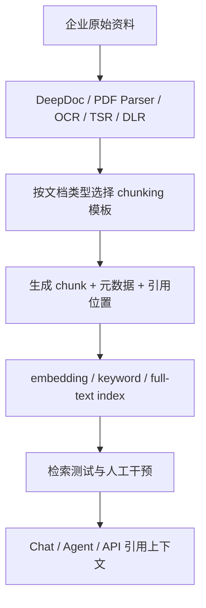
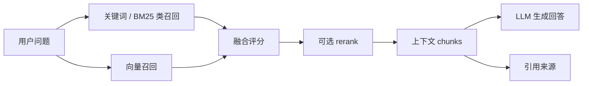
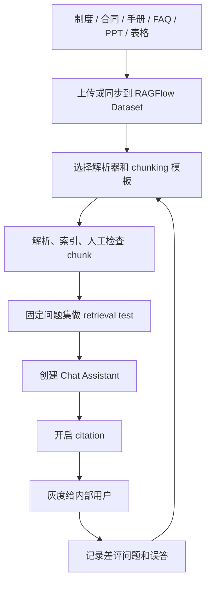
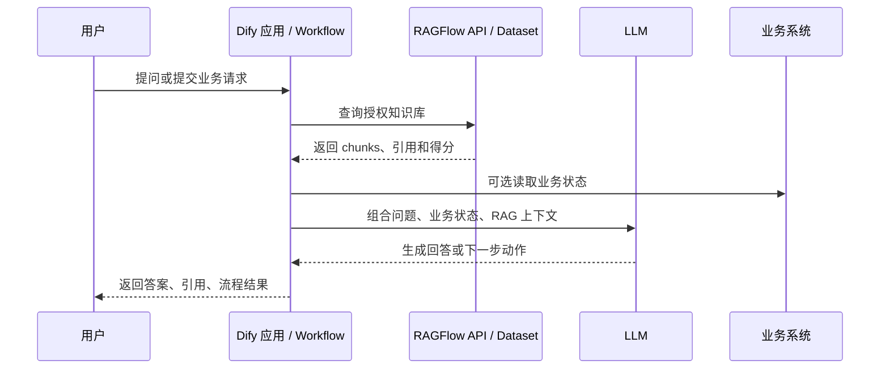
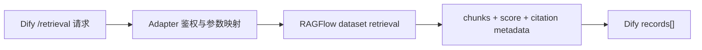

# RAGFlow 与企业 RAG 专项学习笔记

日期：2026-05-12

来源清单：[中文 AI Agent 实践落地 YouTube 学习清单](../watchlists/2026-05-08-agent-practice-youtube-cn-watchlist.md)

官方校准：

- RAGFlow GitHub：<https://github.com/infiniflow/ragflow>
- RAGFlow v0.25.2 release：<https://github.com/infiniflow/ragflow/releases/tag/v0.25.2>
- RAGFlow 官方文档：<https://ragflow.io/docs/dev/>

## Fieldbook 归档判断

- 内容类型：技术研究 / 工具观察 / 案例拆解
- 当前归档：`20-资料笔记/`
- 是否值得升级为 lab：值得，但不是直接复现所有视频。
- 判断理由：RAGFlow 的价值不在“能本地部署一个知识库 UI”，而在文档解析、模板化切分、混合检索、引用溯源、元数据过滤、数据源同步和 Agent context layer 这些企业 RAG 关键链路。后续应该用一个最小中文企业文档集验证检索质量，而不是照视频点一遍界面。
- 后续应进入：`50-实验验证/ragflow-v0252-enterprise-rag-smoke/` 或 `40-问题研究/use-cases/enterprise-rag-ragflow.md`

## 一句话结论

RAGFlow 不是 Dify/n8n/Coze 这种通用应用编排工具的同类替代品，它更像企业 RAG 的“上下文引擎”：负责把复杂文档解析成可检索、可调参、可引用、可评估的知识上下文。它的核心优势在 RAG 质量链路，不在炫酷工作流；企业实践也不能停在“上传文件能回答”，必须补权限、数据治理、评估集、审计和人审。

## 这次沉淀的视频

| 视频 | 单篇笔记 | 归档状态 | 版本/素材边界 |
|---|---|---|---|
| RAGFlow：知识库终极引擎 | [RAGFlow：知识库终极引擎](RAGFlow：知识库终极引擎.md) | 已沉淀 | 无可用字幕；ASR 未产出可用文本，按关键帧、简介、评论和官方事实低置信度归档。 |
| RAGFlow：采用 OCR 和深度文档理解的新一代 RAG 引擎 | [RAGFlow：采用 OCR 和深度文档理解的新一代 RAG 引擎](RAGFlow：采用%20OCR%20和深度文档理解的新一代%20RAG%20引擎.md) | 已沉淀 | 无可用字幕；按关键帧/简介/评论/官方事实归档，旧 UI/部署步骤不当当前事实。 |
| RAGFlow 命中率最高的 RAG 知识库引擎 本地部署 小白教程 | [RAGFlow 命中率最高的 RAG 知识库引擎 本地部署 小白教程](RAGFlow%20命中率最高的%20RAG%20知识库引擎%20本地部署%20小白教程.md) | 已沉淀 | 无可用字幕；“命中率最高”没有评测支撑，只作为部署入门演示。 |
| Ragflow 小白教程（详细重制版） | [Ragflow 小白教程（详细重制版）](Ragflow%20小白教程（详细重制版）.md) | 已沉淀 | 基于 `v0.20.5`，完整视频未下载成功，无关键帧。 |
| 零基础教程：RAGFlow 快速创建知识库和智能问答系统 | [零基础教程：RAGFlow 快速创建知识库和智能问答系统](零基础教程：RAGFlow%20快速创建知识库和智能问答系统.md) | 已沉淀 | YouTube 字幕/自动字幕，非本地 ASR。 |
| Dify + RAGFlow：1 + 1＞2 的混合架构，详细教程 + 实施案例 | [Dify + RAGFlow：1 + 1＞2 的混合架构，详细教程 + 实施案例](Dify%20+%20RAGFlow：1%20+%201＞2%20的混合架构，详细教程%20+%20实施案例.md) | 已沉淀 | 本地 `whisper.cpp` ASR，重点是 Dify 编排层与 RAGFlow 知识库层职责分离。 |
| RAGFlow 作为外部知识库接入 Dify | [RAGFlow 作为外部知识库接入 Dify](RAGFlow%20作为外部知识库接入%20Dify.md) | 已沉淀 | 本地 `whisper.cpp` ASR，已用 Dify 官方外部知识库 API 文档校准接口边界。 |
| Qwen3 + RAGFlow 构建个人知识库 | [Qwen3 + RAGFlow 构建个人知识库](Qwen3%20+%20RAGFlow%20构建个人知识库.md) | 已沉淀 | 无可用字幕；个人演示只能证明链路能通，不能直接推导企业落地。 |
| DeepSeek + RAGFlow 构建个人知识库，2026 本地化部署 | [DeepSeek + RAGFlow 构建个人知识库，2026 本地化部署](DeepSeek%20+%20RAGFlow%20构建个人知识库，2026%20本地化部署.md) | 已沉淀 | 无可用字幕；重点区分服务本地、模型本地、数据源本地。 |
| RAGflow 知识库 + 参数可调架构 + 本地大模型，让 AI 化身佛学顾问 | [RAGflow 知识库 + 参数可调架构 + 本地大模型，让 AI 化身佛学顾问](RAGflow%20知识库%20+%20参数可调架构%20+%20本地大模型，让%20AI%20化身佛学顾问.md) | 已沉淀 | 无可用完整 ASR；垂直知识库窄场景，不能包装成通用企业方案。 |
| 用 RAGFlow 打造 AI 医疗问诊助手 | [用 RAGFlow 打造 AI 医疗问诊助手](用%20RAGFlow%20打造%20AI%20医疗问诊助手.md) | 已沉淀 | 无可用字幕；高风险案例，只做资料检索辅助和风险边界观察。 |

## 当前官方事实校准

视频里的 RAGFlow 版本不一致，有些还基于旧版镜像和旧 UI。后续学习必须以当前官方仓库为准。

截至 2026-05-12：

- GitHub 最新 release tag 是 `v0.25.2`。
- GitHub API 显示 `v0.25.2` 发布于 `2026-05-09T11:07:44Z`；官方 release notes 页面写 Released on May 11, 2026。两个日期来自不同发布口径，笔记里应保留这个差异。
- 当前 README 将 RAGFlow 定位为融合 RAG 与 Agent 能力的开源 RAG engine / context layer。
- 当前关键特性包括 DeepDoc 深度文档理解、模板化 chunking、grounded citations、异构数据源、自动化 RAG workflow、可配置 LLM/embedding、多路召回与融合重排、API 集成。
- 自托管最低要求：CPU >= 4 cores、RAM >= 16GB、Disk >= 50GB、Docker >= 24.0.0、Docker Compose >= v2.26.1。
- 官方预构建 Docker 镜像面向 x86；ARM64 需要按官方文档自行构建。
- 从 `v0.22.0` 起只发布 slim edition，不再给镜像 tag 追加 `-slim` 后缀。旧视频里“完整镜像 vs slim 镜像”的操作不能照抄到 `v0.25.2`。
- `v0.25.2` release 重点：RESTful API 迁移并保持 legacy endpoint 兼容；8 类数据源删除文件同步快照；修复元数据可见性、重复输出、Elasticsearch metadata filtering 内存过滤导致的性能瓶颈。

## RAGFlow 的核心优势

### 1. 它把 RAG 的质量问题前移到文档解析和切分

很多 RAG demo 的坏味道是：把文档随便切块，丢进向量库，然后靠 prompt 和大模型“修”。这是用昂贵的生成模型掩盖糟糕的数据结构。

RAGFlow 的更好品味在于：它承认企业文档本来就复杂。PDF、扫描件、表格、PPT、合同、法规、图片和网页不是一种数据。不同结构应该有不同解析器、不同 chunking 模板和不同检索策略。

这条链路比“上传文件然后问答”麻烦，但企业 RAG 就麻烦在这里。文档结构不处理，后面全是补丁。

### 2. 模板化 chunking 比通用切块更适合企业资料

RAGFlow 的数据集配置里提供 `General`、`Q&A`、`Table`、`Manual`、`Paper`、`Book`、`Laws`、`Presentation`、`One`、`Tag` 等模板。它不是魔法，但方向是对的：合同、论文、表格、PPT、法规和普通说明书不该被同一种规则切。

真正的企业价值不在模板数量，而在可解释性：

- 可以看到 chunk 结果；
- 可以调整分块策略；
- 可以添加关键词、问题、标签或手工修正；
- 可以在进入聊天助手前跑 retrieval test；
- 可以把检索问题定位到“解析错了、切错了、embedding 错了、召回错了、rerank 错了还是 LLM 总结错了”。

这比黑盒知识库强得多。

### 3. 混合检索和重排解决“只靠向量”的硬伤

企业资料里大量问题不是纯语义相似：

- 合同编号；
- 财务科目；
- 设备型号；
- 法规条款；
- 人名、部门、项目代号；
- 年份、版本、日期；
- 表格字段。

纯向量检索可能把“意思相近”的段落召回来，却漏掉精确编号。RAGFlow 的 retrieval test 文档明确说明：普通 chunk 检索会结合关键词相似度与向量相似度，若选择 rerank 模型，则结合关键词相似度与向量 reranking score。这个设计实际。

企业 RAG 的本质不是“向量数据库 + LLM”。向量只是一个组件。检索层必须能处理关键词、语义、元数据、重排、权限过滤和引用。

### 4. Grounded citations 是生产底线

RAGFlow 强调 grounded citations 和引用可追溯。这个功能不是装饰。没有引用，用户无法判断答案来自哪里；无法判断是文档没有、召回错了、模型编了，还是资料过期。

企业问答的验收逻辑应该是：

1. 回答必须能指向原文 chunk。
2. 引用必须区分内部知识库和外部搜索。
3. 引用必须保留文档名、页码或位置、版本、更新时间。
4. 没有依据时必须拒答或提示证据不足。
5. 引用错误应当视为严重缺陷，不是小瑕疵。

### 5. 元数据过滤和数据源同步接近企业真实约束

`v0.23.0` 以后 RAGFlow 支持 dataset/file 级元数据管理；`v0.25.2` 修复了 metadata filtering 在内存里处理而不是下推 Elasticsearch 的性能问题。这说明它正在面对真实企业问题：知识库不是一个扁平文件夹。

企业资料必须能按这些维度过滤：

- 部门；
- 密级；
- 地区；
- 产品线；
- 文档类型；
- 生效时间；
- 版本；
- 责任人；
- 用户权限。

如果元数据过滤只是前端筛选，或者检索后再内存过滤，大数据量下必然出问题。过滤应该尽量进入检索引擎和权限模型。

### 6. 它正在从 RAG 工具走向 Agent context engine

官方文档把 Agent context engine 描述为把 knowledge、memory、tool/skill retrieval 合到统一上下文层。这个方向是对的，但也更容易过度设计。

务实判断：

- 当前最值得学的是 RAGFlow 的 context layer 思路；
- 不要因为有 Agent 模板就默认上多 Agent；
- 先把单知识库、单检索、单聊天助手稳定做好；
- 再考虑 Dify 集成、Agent workflow、Memory、MCP、工具调用。

## 企业级实践案例地图

这些案例来自专项视频主题和当前官方能力校准。它们不是全部都可直接上线；每个案例都要看边界。

### 案例 1：企业内部知识库 / 文档问答

典型流程：

适合场景：

- 公司制度问答；
- 产品手册问答；
- 财务/人事/法务资料检索；
- 运维知识库；
- 培训资料助手。

硬边界：

- 不要只靠 API Key 控制访问；
- 文档必须有版本和责任人；
- 建一组回归问题，不要凭感觉调参；
- 启用引用，且引用要能回到原文；
- 过期文档要能下架并同步删除索引。

### 案例 2：Dify + RAGFlow 混合架构

这个方向是专项里最值得看的企业实践。职责分离清楚：

- RAGFlow：负责知识库质量、文档解析、切分、召回、引用、检索测试。
- Dify：负责应用编排、对话流程、表单、工具调用、业务节点、渠道接入。

好处：

- 不让 Dify 承担复杂 RAG 数据工程；
- 不让 RAGFlow 变成所有业务流程的编排中心；
- 业务流程和知识检索边界清楚；
- 以后替换应用层或知识层更容易。

风险：

- 两边权限模型要打通；
- 引用从 RAGFlow 返回后不能在 Dify 里丢失；
- API Key 不能放在浏览器；
- 召回参数、Top N、阈值和 rerank 要统一管理；
- 外部知识库接口失败时，Dify 需要有降级策略。

从已沉淀的两条 Dify 相关视频看，正确接法不是把 RAGFlow 的数据复制进 Dify，而是把 RAGFlow 保持为外部检索服务。Dify 的外部知识库 API 会向外部服务发 `POST /retrieval`，传入 `knowledge_id`、`query`、`top_k`、`score_threshold` 等字段；外部服务需要返回 `records`，每条记录至少包含 `content`、`score`、`title` 和对象类型的 `metadata`。如果 RAGFlow 当前检索 API 与 Dify 契约不完全一致，中间应该加一个很薄的 adapter，而不是让 Dify 或 RAGFlow 互相污染内部模型。

这个 adapter 的数据结构应该非常朴素：

关键别丢三样东西：`score` 的量纲、引用 metadata、知识库权限。丢了这三样，表面也许能回答，工程上已经坏了。

### 案例 3：本地化部署与个人知识库

Qwen3、DeepSeek、本地大模型、Ollama、LM Studio 这些视频适合建立手感，但它们多半是个人知识库场景。

价值：

- 验证本地模型接入；
- 验证 RAGFlow UI、文档解析、知识库创建；
- 验证最低可运行链路；
- 适合学习模型配置和 Docker 部署。

不要误判：

- 个人知识库没有企业权限复杂度；
- 本地跑通不代表多用户并发可用；
- 一个样本文档答对不代表召回质量好；
- 模型切换后 embedding 维度、语言能力、rerank 效果都要重新评估。

### 案例 4：垂直领域顾问

佛学顾问这类案例说明 RAGFlow 可以把垂直语料做成问答助手。它适合观察：

- 领域语料怎么整理；
- 参数怎么调；
- 本地模型如何接入；
- 引用是否能帮助用户回到原文。

但它不是通用企业方案。垂直语料的难点不在 UI，而在语料质量、术语解释、版本来源、知识冲突和答案边界。

### 案例 5：医疗问诊助手

医疗问诊只能作为高风险技术流程观察，不能当真实落地范式。

最低边界：

- 必须有医生审核；
- 必须有医学资料来源和版本；
- 必须有明确免责声明和责任边界；
- 必须记录引用、问答日志和人工复核；
- 不能输出诊断、处方或治疗决策作为自动结论；
- 涉及个人健康信息时必须处理隐私、合规和访问控制。

如果一个医疗 RAG demo 只讲“上传资料然后问诊”，不讲临床验证、合规和人审，那就是坏案例。

## 企业落地检查清单

### 数据结构

- 文档是否有来源、版本、更新时间、责任人和密级？
- chunk 是否保留页码、标题、章节、表格位置和原文引用？
- embedding 模型是否固定？更换后是否重建索引？
- 是否区分全文索引、向量索引、元数据索引和知识图谱？

### 检索质量

- 是否有固定评估集？
- 是否覆盖“应答题、拒答题、交叉文档题、精确条款题、过期文档干扰题”？
- 是否记录召回 chunk、得分、rerank 后顺序和最终引用？
- 调参是否有版本记录？

### 权限和安全

- 用户身份是否进入检索层？
- API Key 是否只在服务端保存？
- iframe 嵌入是否限制域名和用户？
- 外部搜索是否区分来源？
- 删除文档是否同步删除索引、缓存和快照？

### 运维

- 是否有容器健康检查、日志、备份和升级策略？
- Elasticsearch/Infinity/MySQL/MinIO/Redis 数据卷是否备份？
- 解析失败是否可重试和定位？
- Rerank、GraphRAG、OCR、VLM 是否有成本和延迟监控？

### 人审

- 写数据库、发邮件、执行 shell、调用支付、部署变更、开放公网端口都必须有人审。
- 医疗、法律、财务、合规、HR 等高风险答案必须有人审或明确限制为资料检索辅助。

## 推荐实验

### Lab 1：RAGFlow v0.25.2 本地 smoke test

- 目标：验证当前官方 quickstart 能否在本机跑通。
- 输入：3 份中文 PDF、1 份表格、1 份制度文档。
- 验收：文档上传、解析、检索测试、聊天引用、API 调用全部可复现。
- 不做：公网部署、多租户、复杂 Agent。

### Lab 2：chunking 模板对比

- 目标：比较 `General`、`Laws`、`Table`、`Presentation` 对中文企业资料的召回差异。
- 方法：固定 30 个问题，记录召回 chunk、引用准确率、回答正确率和延迟。
- 判断：不要看单次 demo，跑同一批问题。

### Lab 3：Dify + RAGFlow 职责分离

- 目标：验证 Dify 调用 RAGFlow 外部知识库是否能保留引用和权限边界。
- 方法：Dify 负责流程，RAGFlow 负责检索；服务端代理保存 RAGFlow API Key。
- 验收：Dify 回答里保留 RAGFlow 引用，检索失败有降级，用户不能越权访问知识库。

### Lab 4：医疗/高风险场景拒答边界

- 目标：验证 RAGFlow 作为“资料检索助手”时能否控制高风险输出。
- 方法：构造医疗问答、无依据问题、诱导诊断问题。
- 验收：必须引用资料；无依据拒答；诊断/处方建议必须转人工。

## 核心判断

【核心判断】

✅ 值得做：RAGFlow 值得作为企业 RAG 引擎候选继续研究。它把企业 RAG 最麻烦的部分放到台面上：文档解析、切分、召回、重排、引用、元数据、数据源同步和 API 集成。这比只展示“问答效果”的工具更接近真实问题。

【关键洞察】

- 数据结构：RAGFlow 的核心数据不是“文件”，而是带文档结构、引用位置、元数据、向量、关键词、权限和解析状态的 chunk。
- 复杂度：好的复杂度在 ingestion/retrieval 层，坏的复杂度是把所有失败都交给 prompt 和 Agent workflow。
- 风险点：最大风险是版本漂移和误用。旧视频的镜像、端口、模型配置、API 和 UI 入口可能已经过时；企业上线还会遇到权限、数据治理、评估和高风险动作人审。

【Linus 式方案】

1. 第一步永远是简化数据结构：先定义文档、chunk、metadata、citation、permission 的关系。
2. 消除特殊情况：不要为每类业务写一套临时 prompt，先用统一的 ingestion 和 retrieval test 管住质量。
3. 用最笨但最清晰的方式实现：固定数据集、固定问题集、固定指标，逐项比较 chunking、rerank、GraphRAG 和模型变化。
4. 确保零破坏性：升级 RAGFlow、切换 embedding、切换 doc engine、删除数据卷、改 API endpoint 前都要备份和回归。

## 参考资料

- RAGFlow GitHub README：<https://github.com/infiniflow/ragflow>
- RAGFlow v0.25.2 release：<https://github.com/infiniflow/ragflow/releases/tag/v0.25.2>
- RAGFlow release notes：<https://ragflow.io/docs/dev/release_notes>
- RAGFlow dataset guide：<https://ragflow.io/docs/dev/configure_knowledge_base>
- RAGFlow retrieval test：<https://ragflow.io/docs/dev/run_retrieval_test>
- RAGFlow PDF parser：<https://ragflow.io/docs/dev/select_pdf_parser>
- RAGFlow metadata：<https://ragflow.io/docs/dev/manage_metadata>
- RAGFlow API reference：<https://ragflow.io/docs/dev/http_api_reference>

## 未验证事项

- 本总笔记基于已完成的视频沉淀、正在进行的本地素材抓取、RAGFlow GitHub/官方文档校准整理。
- 尚未本地启动 RAGFlow `v0.25.2`。
- 尚未运行 RAGFlow API、Dify 集成、Qwen3/DeepSeek/Ollama/LM Studio 模型接入。
- 尚未用固定企业文档集验证 DeepDoc、MinerU、Docling、chunking 模板、rerank、GraphRAG 的实际效果。
- 部分视频使用本地 `whisper.cpp` ASR，字幕未逐句人工校对；单篇笔记会分别标注。
