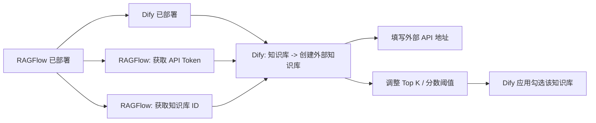
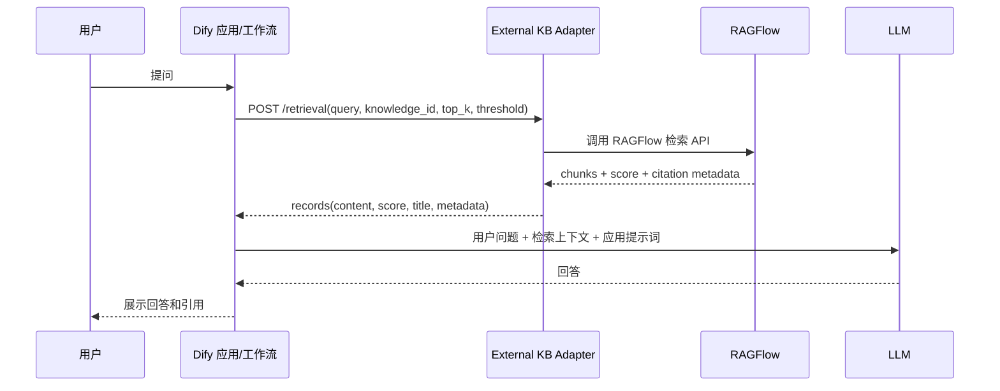

# RAGFlow 作为外部知识库接入 Dify

日期：2026-05-12

来源视频：[RAGFlow作为外部知识库接入dify](https://www.youtube.com/watch?v=gaDuU9Oq1H4)

频道：点击投喂卓师傅

发布时间：2025-03-14

时长：00:03:21

本地素材：

- 视频：`local-media/youtube/2026-05-12-ragflow-gaduu9oq1h4/RAGFlow作为外部知识库接入dify [gaDuU9Oq1H4].quicktime.mp4`
- 字幕：`local-media/youtube/2026-05-12-ragflow-gaduu9oq1h4/RAGFlow作为外部知识库接入dify [gaDuU9Oq1H4].zh-Hans.srt`
- 字幕说明：YouTube 未暴露标准字幕轨道，本次字幕由本地 `whisper.cpp` ASR 生成，未逐句人工校对；ASR 对 Dify、Docker、API Token、Ollama、pip 等词有多处误识别。
- 元数据：`local-media/youtube/2026-05-12-ragflow-gaduu9oq1h4/RAGFlow作为外部知识库接入dify [gaDuU9Oq1H4].quicktime.info.json`
- 关键画面抽帧：`local-media/youtube/2026-05-12-ragflow-gaduu9oq1h4/frames/`
- 评论原始数据：`local-media/youtube/2026-05-12-ragflow-gaduu9oq1h4/comments.json`
- 评论摘要素材：`local-media/youtube/2026-05-12-ragflow-gaduu9oq1h4/comments-digest.md`

说明：`local-media/` 是本地沉淀目录，不应提交进 Git。

## 配套资源 / 代码地址

- 视频：https://www.youtube.com/watch?v=gaDuU9Oq1H4
- 视频简介：只说明 Dify 平台可接入聊天工具，所以先接入 Dify，后续再接聊天工具。
- 代码仓库：视频简介、元数据和评论中未发现具体代码仓库地址。
- Dify 外部知识库文档：https://docs.dify.ai/zh/use-dify/knowledge/external-knowledge-api
- Dify 连接外部知识库文档：https://docs.dify.ai/en/use-dify/knowledge/connect-external-knowledge-base
- RAGFlow GitHub：https://github.com/infiniflow/ragflow
- RAGFlow v0.25.2 release：https://github.com/infiniflow/ragflow/releases/tag/v0.25.2

## 评论区补充

本次抓取到 `total_comments: 0`，没有置顶评论、作者回复、代码链接或纠错信息。

## Fieldbook 归档判断

- 内容类型：技术研究
- 当前归档：`20-资料笔记/`
- 是否值得升级为 lab：是
- 判断理由：视频给的是 UI 操作演示，但真正有价值的问题是 Dify 外部知识库接口契约是否能稳定包住 RAGFlow 的检索能力。这个边界值得做一个最小实验：用一个 adapter 服务把 Dify 的 `POST /retrieval` 请求转换为 RAGFlow dataset retrieval，再检查认证、引用、分数、metadata 和失败响应。
- 后续应进入：`50-实验验证/`

## 一句话结论

把 RAGFlow 接进 Dify，不应该理解成“把 RAGFlow 数据导入 Dify”。正确边界是：RAGFlow 继续负责文档解析、分片、索引、召回、重排和引用来源；Dify 只通过外部知识库 API 发起检索请求，把返回的 chunks 当作应用上下文，再负责工作流、模型调用、对话和最终回答。

## 视频时间轴

| 时间 | 主题 | 要点 |
|---|---|---|
| 00:00 | 前置环境 | 作者先准备好 RAGFlow 与 Dify，并提到本地端口冲突：RAGFlow 占用 80，因此修改 Dify 端口。 |
| 00:20 | 进入 Dify 知识库 | 在 Dify 注册登录后进入知识库页面，选择创建外部知识库。 |
| 00:35 | 配置外部 API | 在 Dify 填写 RAGFlow API 地址，并到 RAGFlow 的 API 页面获取 token。 |
| 00:55 | 配置知识库 ID | 在 RAGFlow 打开目标知识库，从 URL 或详情中获取知识库 ID，填回 Dify 外部知识库。 |
| 01:15 | 设置召回参数 | 作者提醒外部知识库返回分段数量会受配置影响，数量过少会影响回答质量。 |
| 01:30 | 本地模型插曲 | 演示安装 Ollama 相关本地模型，后续因 Dify 插件安装失败进入排障。 |
| 01:50 | 排查超时 | 添加本地模型时报请求超时；作者查看 Docker Desktop、Nginx/API/插件容器日志。 |
| 02:20 | 修复插件安装 | 修改 Dify 环境变量中的 pip 超时与 pip 镜像源，重启 Docker 容器。 |
| 03:06 | 回到主流程 | 插件安装成功后回到 Dify，创建应用并勾选已经创建的外部知识库，验证可用。 |

## 1. 视频说法：UI 层接入流程

视频的主线很短：在 Dify 里创建一个“外部知识库”，外部 API 指向 RAGFlow，认证 token 从 RAGFlow API 页面拿，知识库 ID 从 RAGFlow 的知识库页面拿。作者没有展开代码层 adapter，只演示了 UI 配置和一个本地模型插件排障。



这里容易犯的错是把 UI 字段当成完整集成。它不是。UI 只把 Dify 的 retrieval 请求接到某个 HTTP 服务；这个 HTTP 服务必须返回 Dify 规定的 JSON 结构。RAGFlow 如果没有原生暴露完全一致的 endpoint，就需要一个很薄的 adapter。

## 2. 当前事实：Dify 外部知识库接口边界

根据 Dify 当前官方文档，Dify 会把外部知识库当成只读检索服务。Dify 注册的是外部知识服务的 base URL，实际请求时会自动追加 `/retrieval`，请求形式是：

```http
POST {your-endpoint}/retrieval
Content-Type: application/json
Authorization: Bearer {API_KEY}
```

请求体核心字段：

| 字段 | 责任边界 |
|---|---|
| `knowledge_id` | Dify 传给外部系统的知识源标识。接 RAGFlow 时应映射到 RAGFlow dataset/knowledge base ID。 |
| `query` | 用户查询。Dify 只传查询，不替 RAGFlow 决定怎么解析、扩写或重排。 |
| `retrieval_setting.top_k` | Dify 希望最多返回多少个分段。RAGFlow/adapter 必须尊重或合理裁剪。 |
| `retrieval_setting.score_threshold` | Dify 希望的最低相似度分数；关闭阈值时文档说会传 `0.0`。 |
| `metadata_condition` | Dify 可程序化传元数据过滤条件，但当前用户界面不提供配置入口。 |

响应必须是 HTTP 200 加 `records` 数组；没有命中就返回空数组。每条记录至少要有：

| 字段 | 用途 |
|---|---|
| `content` | 传给 LLM 的上下文分段。缺这个字段，接入就是坏的。 |
| `score` | Dify 用它做排序、阈值过滤和可解释性展示。 |
| `title` | 来源文档标题。 |
| `metadata` | 任意对象，必须是 `{}` 或对象，不能是 `null`；引用路径、页码、chunk ID 应放这里。 |

坏接口的典型症状不是“请求不通”，而是返回了看似合法但不可用的数据：`metadata: null`、没有 `score`、score 量纲不是 0-1、`content` 为空、引用信息丢失。这些东西会把后面的回答质量搞坏，而且排查时很浪费时间。

## 3. RAGFlow 该做什么，Dify 该做什么

这个集成的好品味在于保持边界干净。RAGFlow 是检索与上下文层，Dify 是应用编排层。别把两个系统的职责揉成一团。



RAGFlow 负责：

1. 文档解析，尤其是复杂 PDF、扫描件、表格、图片等 DeepDoc 处理。
2. 模板化 chunking、索引构建、embedding、召回、融合重排。
3. 保留引用来源：文件名、页码、片段位置、chunk ID、数据源路径。
4. 异构数据源同步与删除文件同步。
5. 检索质量调参：召回路数、重排、metadata filter、RAG workflow。

Dify 负责：

1. 应用入口、对话体验、工作流节点、模型供应商选择。
2. 向外部知识库发起只读 retrieval 请求。
3. 把返回 chunks 作为上下文交给 LLM。
4. 控制应用层的 Top K、Score Threshold、提示词、回答格式和发布渠道。
5. 记录应用日志、调试回答链路和接入聊天工具。

Adapter 负责：

1. 把 Dify 的 `knowledge_id` 映射到 RAGFlow dataset ID。
2. 把 Dify 的 Bearer token 验证成允许访问哪个 RAGFlow 知识库。
3. 把 Dify 的 `top_k`、`score_threshold`、`metadata_condition` 转换成 RAGFlow 可执行的检索参数。
4. 把 RAGFlow 的检索结果规整成 Dify `records`，尤其要保住引用 metadata。
5. 把 RAGFlow 错误转换为 Dify 能理解的 HTTP 状态码和结构化错误。

## 4. 认证、引用与召回参数

认证边界要简单：Dify 文档说它只把配置的 API Key 作为 `Authorization: Bearer {API_KEY}` 传出去，认证逻辑由外部服务自己定义。接 RAGFlow 时，不要把 RAGFlow 的管理员 token 直接散落在 Dify 应用配置里；更稳的做法是由 adapter 持有 RAGFlow 凭证，Dify 只拿 adapter 颁发或配置的只读 key。

引用边界也要明确：Dify 外部知识库响应的 `metadata` 是保留任意键值的地方。RAGFlow 的 grounded citations 应尽量映射进去，例如：

```json
{
  "records": [
    {
      "content": "检索到的分段文本",
      "score": 0.82,
      "title": "example.pdf",
      "metadata": {
        "source": "ragflow",
        "dataset_id": "ragflow-dataset-id",
        "document_id": "doc-id",
        "chunk_id": "chunk-id",
        "page": 3,
        "path": "s3://bucket/example.pdf"
      }
    }
  ]
}
```

召回参数不要乱解释：

- `top_k` 是 Dify 要求的最大返回数量，不等于 RAGFlow 内部初始召回数量。RAGFlow 可以内部多召回再重排，但最终返回给 Dify 的记录数应受 `top_k` 控制。
- `score_threshold` 是 Dify 外部接口里的 0-1 相似度阈值。RAGFlow 如果内部 score 量纲不同，adapter 必须归一化或至少文档化映射规则。
- `metadata_condition` 当前不是 Dify UI 用户配置项，但程序化调用会传。adapter 要么支持，要么明确返回不支持；默默忽略会制造错觉。
- “返回分段数量太少会影响回答质量”这个视频提醒是对的，但不是越多越好。Top K 过大也会增加噪声、上下文成本和引用混乱。

## 5. 当前 RAGFlow 官方校准事实

以下是 2026-05-12 对当前 RAGFlow 的校准，不是视频发布时的全部状态。视频是 2025-03-14 的短演示，不能拿它判断今天的 RAGFlow 能力边界。

- GitHub 最新 release：`v0.25.2`。
- GitHub 页面显示该 release 于 2026-05-09 11:07 发布；任务提供的 GitHub API `published_at` 为 `2026-05-09T11:07:44Z`。
- 官方 release notes 写 `Released on May 11, 2026`。
- README 当前称 RAGFlow 是融合 RAG 与 Agent 能力的开源 RAG engine/context layer。
- 关键能力包括 DeepDoc 深度文档理解、模板化 chunking、grounded citations、异构数据源、自动化 RAG workflow、可配置 LLM/embedding、多路召回加融合重排、API 集成。
- 自托管最低要求：CPU 4 cores、RAM 16GB、Disk 50GB、Docker 24、Docker Compose 2.26.1。
- 官方预构建 Docker 镜像面向 x86；从 `v0.22.0` 起只发布 slim 镜像，不再带内置 embedding models。
- `v0.25.2` 强调 RESTful API 迁移并保持 legacy endpoint 兼容、8 类数据源删除文件同步快照、修复元数据可见性、重复输出、Elasticsearch metadata filtering 性能问题。

## 工程提醒

1. 不要让 Dify 直接承担 RAGFlow 的内部检索策略。Dify 只需要拿到干净的 chunks、score 和 metadata。
2. 不要丢 citation metadata。RAG 的可信度不是靠嘴说，引用链断了就很难 debug。
3. 不要把 RAGFlow 管理员 token 暴露给多个 Dify 应用。中间 adapter 应该做只读、按知识库授权、可轮换 key。
4. Dify 自托管调用本机或内网外部服务时，要注意 SSRF proxy/allowlist。官方文档明确提到同主机或未放行域名可能导致 connection refused 或 timeout。
5. Docker 排障别只看 UI。视频里真正解决的是 Dify 插件安装依赖失败：查看 Nginx/API/插件容器日志、调整 pip timeout 和镜像源、重启容器。
6. 高风险动作需要人审：修改 Docker 环境变量、重启容器、写配置文件、暴露内网知识库 API、配置可访问生产数据的 token，都不能让 Agent 自动越权执行。

## 工程判断

- 适合什么场景：团队已经有 RAGFlow 负责复杂文档解析、分片和检索质量，希望用 Dify 快速搭应用、工作流和聊天入口；或者多个应用要共用同一套外部知识库。
- 不适合什么场景：只是几份简单文档问答，没有复杂解析、引用、数据源同步或检索调参需求。此时直接用 Dify 内置知识库更简单。
- 风险和边界：最大的风险是接口契约不严。`score` 量纲错、metadata 丢失、authorization 过宽、Top K/threshold 被忽略，都会让系统表面可用、实际不可控。
- 品味判断：这个方案本身是好品味，前提是用 adapter 固定边界。把 RAGFlow 和 Dify 的内部状态互相渗透，就是坏设计。

## 后续研究问题

- RAGFlow 当前是否已有与 Dify 外部知识库 API 完全兼容的官方 endpoint；如果没有，最小 adapter 需要调用哪个 RAGFlow API。
- RAGFlow 检索结果中的 citation、document metadata、chunk ID、page 信息如何稳定映射到 Dify `metadata`。
- RAGFlow 内部分数与 Dify `score_threshold` 的 0-1 约定是否同量纲。
- Dify 对外部知识库返回 records 的排序、去重、阈值过滤由谁最终执行。
- Dify SSRF proxy 在本机 Docker、局域网域名、反向代理域名下的放行方式。

## 实验验证建议

- 要验证什么：Dify 外部知识库 API 能否通过 adapter 稳定调用 RAGFlow，并保留 score、title、metadata/citations。
- 最小实验形式：一个 FastAPI adapter，暴露 `POST /retrieval`；内部先 mock RAGFlow 返回，再替换为真实 RAGFlow dataset retrieval；用 Dify 外部知识库 UI 注册该 endpoint。
- 验收标准：Dify 能创建外部知识库；应用问答能触发 adapter；adapter 日志能看到 `knowledge_id/query/top_k/score_threshold`；Dify 侧回答引用能追溯到 RAGFlow 文档或 chunk。
- 是否现在就做：否。本次任务是视频沉淀归档；实验需要真实 RAGFlow/Dify 实例和 API 契约确认，另开 lab 更干净。

## 参考资料

- 视频：[RAGFlow作为外部知识库接入dify](https://www.youtube.com/watch?v=gaDuU9Oq1H4)
- Dify 外部知识库 API：https://docs.dify.ai/zh/use-dify/knowledge/external-knowledge-api
- Dify 连接外部知识库：https://docs.dify.ai/en/use-dify/knowledge/connect-external-knowledge-base
- RAGFlow GitHub README：https://github.com/infiniflow/ragflow
- RAGFlow v0.25.2 release：https://github.com/infiniflow/ragflow/releases/tag/v0.25.2

## 未验证事项

- 本笔记基于本地 ASR 字幕、元数据、关键画面和评论摘要整理；ASR 未逐句人工校对。
- 未本地运行 RAGFlow、Dify 或视频中的 Docker 配置。
- 未验证 RAGFlow 当前实际检索 API 是否与 Dify 外部知识库 API 完全兼容。
- 未验证 RAGFlow score 与 Dify `score_threshold` 的量纲映射。
- 未验证 Dify 中外部知识库返回 metadata 后的引用展示效果。
- 未复现视频中的 Ollama / Dify 插件安装报错和 pip 镜像源修复过程。
