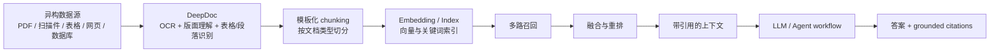

# RAGFlow：采用 OCR 和深度文档理解的新一代 RAG 引擎

日期：2026-05-12

来源视频：[RAGFlow：采用OCR和深度文档理解的新一代 RAG 引擎，具备深度文档理解、引用来源、降低幻觉、兼容异构数据源、自动化rag工作流等能力，大大提升知识库RAG的召回率降低幻觉](https://www.youtube.com/watch?v=Z5AV6d1He4k)

频道：AIGCLINK

发布时间：2024-04-15

时长：24:40

本地素材：

- 视频：`local-media/youtube/2026-05-12-ragflow-z5av6d1he4k/RAGFlow：采用OCR和深度文档理解的新一代 RAG 引擎，具备深度文档理解、引用来源、降低幻觉、兼容异构数据源、自动化rag工作流等能力，大大提升知识库RAG的召回率降低幻觉 [Z5AV6d1He4k].quicktime.mp4`
- 元数据：`local-media/youtube/2026-05-12-ragflow-z5av6d1he4k/RAGFlow：采用OCR和深度文档理解的新一代 RAG 引擎，具备深度文档理解、引用来源、降低幻觉、兼容异构数据源、自动化rag工作流等能力，大大提升知识库RAG的召回率降低幻觉 [Z5AV6d1He4k].quicktime.info.json`
- 素材清单：`local-media/youtube/2026-05-12-ragflow-z5av6d1he4k/asset-manifest.md`
- 关键画面：`local-media/youtube/2026-05-12-ragflow-z5av6d1he4k/frames/contact-keyframes.jpg`
- 评论摘要：`local-media/youtube/2026-05-12-ragflow-z5av6d1he4k/comments-digest.md`
- 字幕说明：YouTube 未暴露可用字幕轨道；base ASR 和 tiny ASR 均未在截止时间内产出可用 `transcript-clean.txt` / `chapter-transcript.md`。本笔记不粘贴字幕，不做逐句复述；低置信度内容只作为“视频素材显示”处理。

说明：`local-media/` 是本地沉淀目录，不应提交进 Git。

## 配套资源 / 代码地址

- 视频：https://www.youtube.com/watch?v=Z5AV6d1He4k
- RAGFlow GitHub release v0.25.2：https://github.com/infiniflow/ragflow/releases/tag/v0.25.2
- 代码仓库：视频简介和评论中未发现具体代码仓库地址；当前校准以 RAGFlow 官方 GitHub/README 事实为准。

## 评论区补充

评论区没有置顶评论，也没有额外 URL。高信号信息主要有三类：

- 有观众质疑“召回率”这个中文表述是否准确，建议更接近“保真度”。这个争论有价值，但不能替代工程指标。RAG 场景至少要拆开看检索召回、答案忠实度、引用命中、上下文覆盖率，混成一个词会误导。
- 有观众询问是否能只下载基础文件、不下载本地模型，改为对接 OpenAI 或其他 API。这正好对应 RAGFlow 的现实边界：RAG 引擎可以接外部 LLM/embedding，但部署包、解析组件、检索组件、数据库和后台服务仍有资源成本。
- 有 Mac M1 Pro 用户反馈安装失败，后续评论说换 OrbStack 后安装成功。这个属于历史环境经验，不能当成当前官方部署要求。

## Fieldbook 归档判断

- 内容类型：工具观察 / 技术研究
- 当前归档：`20-资料笔记/`
- 是否值得升级为 lab：暂不升级
- 判断理由：这个视频更像 RAGFlow 能力地图和旧版 UI 演示，不包含需要立即复现的最小 API 或评测脚本。真正值得升级为 lab 的不是“跑一遍 UI”，而是验证 DeepDoc 对复杂 PDF、表格、扫描件、引用溯源和幻觉控制的边界。
- 后续应进入：`40-问题研究/open-source-projects/` 可做 RAGFlow 源码/架构拆解；`50-实验验证/` 可另开最小实验验证复杂文档解析和 grounded citations。

## 一句话结论

RAGFlow 的核心价值不是“又一个知识库聊天 UI”，而是把 OCR、DeepDoc 文档理解、模板化 chunking、引用溯源、异构数据源和检索工作流放到同一个 RAG engine/context layer 里；但它只能降低幻觉，不能消灭幻觉。没有引用、没有评测、没有人工边界检查的 RAG，换个 UI 也还是垃圾。

## 视频素材能确认什么

由于没有可用完整字幕，本节只基于标题、简介、manifest、评论摘要和关键帧做低风险归纳：

| 时间点 | 画面线索 | 可确认要点 |
|---|---|---|
| 01:45 | RAGFlow 配置界面，解析方式下拉包含 General、Q&A、Resume、Manual、Table、Paper、Book、Laws 等 | 视频展示了按文档类型选择解析/切分模板，而不是只有统一的固定 chunk 策略。 |
| 03:31 | 数据集列表，上传 PDF，显示分块数、上传日期、解析方法、启用状态 | 视频演示了知识库/数据集管理和文档解析状态。 |
| 05:17 | 配置页包含语言、权限、embedding、解析方法、块 token 数等字段 | 视频中的 RAGFlow 不是纯检索前端，它暴露了解析、嵌入和分块配置。 |
| 07:02-12:20 | 文档页展示 RAG 核心问题、Infinity/DeepDoc 图示、RAGFlow 架构/流程图 | 视频重点在解释“深度文档理解”和传统 RAG 的不足。 |
| 15:51-19:22 | 复杂 PDF、表格、论文截图和对比图 | 视频强调 OCR/布局理解/表格处理对真实文档 RAG 的重要性。 |
| 21:08 | 数据集列表中文档解析完成 | 视频演示流程闭环：上传、解析、进入知识库。 |

这些画面足够支持“能力地图”总结，不足以支持逐句复述、性能结论或当前部署教程。

## 当前官方事实校准

下面是 2026-05-12 归档时必须优先采用的当前事实，和 2024-04-15 视频画面分开看：

- 最新 GitHub release：v0.25.2，发布时间为 2026-05-09T11:07:44Z。
- README 当前定位：RAGFlow 是融合 RAG 与 Agent 能力的开源 RAG engine/context layer。
- 关键特性：DeepDoc 深度文档理解、模板化 chunking、grounded citations、异构数据源、自动化 RAG workflow、可配置 LLM/embedding、多路召回加融合重排、API 集成。
- 自托管最低要求：CPU 4 cores、RAM 16GB、Disk 50GB、Docker 24、Docker Compose 2.26.1。
- 镜像事实：官方预构建镜像面向 x86；从 v0.22 起只发布 slim 镜像。
- v0.25.2 release 重点：RESTful API 迁移并保持 legacy endpoint 兼容；8 类数据源删除文件同步快照；修复元数据可见性、重复输出、Elasticsearch metadata filtering 性能问题。

视频中的旧 UI、旧安装路径、旧部署经验不能当成当前事实。尤其评论区关于 ARM/Mac/OrbStack 的经验，只能作为历史排障线索。

## 能力地图：从文档到可追溯回答

传统 RAG 经常死在第一步：文档还没被正确理解，就急着 embedding。扫描 PDF、复杂表格、页眉页脚、双栏论文、合同条款、图文混排，这些东西如果被切成一堆乱片段，后面的向量检索再漂亮也没用。RAGFlow 把 DeepDoc 和模板化 chunking 放在前面，方向是对的。

“好品味”的点在这里：它没有假装所有文档都能用一种 chunk 规则解决，而是承认数据结构不同。简历、表格、论文、书籍、法律文本，本来就不是同一种东西。统一切分看起来简单，实际是把复杂性推给检索和生成阶段。

## OCR / DeepDoc 的真实价值

OCR 不是把图片变成文字这么简单。对 RAG 来说，真正有价值的是保留文档结构：

- 段落和标题的层级关系；
- 表格的行列关系；
- 图注、页码、脚注、章节之间的引用关系；
- 扫描件里的文字位置；
- 不同文档类型对应的解析策略。

如果这些结构丢了，LLM 拿到的上下文就是一锅粥。它可能答得流畅，但引用不稳，数字串行，表格字段错位，最后用户以为是模型幻觉，其实根子在文档解析。

## 引用溯源不是装饰

RAGFlow 当前 README 强调 grounded citations，这一点比“回答很像人”重要。引用溯源解决的是责任边界：

- 用户可以回到原文核对；
- 系统可以暴露答案依据；
- 评估可以检查引用是否真的支持答案；
- 出错时能判断是召回错、解析错、重排错，还是生成错。

没有引用的 RAG 系统，本质上是一个会读私有材料的聊天机器人。它可能有用，但不适合严肃知识库、合规材料、财务、医疗、法律、工程文档等需要审计的场景。

## 异构数据源的边界

异构数据源听起来很大，但工程上要拆开看：

- 接入层：能不能从文件、网页、数据库、企业应用里稳定同步数据；
- 解析层：不同格式能不能转成可检索、可引用的统一内部结构；
- 增量层：删除、更新、权限变化能不能同步；
- 检索层：不同来源的数据能不能被统一召回和重排；
- 权限层：用户不该看的内容不能因为 embedding 进了索引就泄露。

v0.25.2 提到“8 类数据源删除文件同步快照”，这说明异构数据源的难点不在 demo，而在同步语义。文件被删了，索引、快照、引用、权限都要跟着变。不处理这个，知识库会变成陈旧垃圾场。

## 降低幻觉的真实边界

RAGFlow 这类系统能降低幻觉，不能保证没有幻觉。边界很清楚：

- 文档解析错了，后面全错；
- chunk 切错了，相关证据可能被拆散；
- 检索召回不到，LLM 会硬答；
- 重排错了，模型会拿弱证据当强证据；
- 引用存在，不代表引用支持答案；
- 数据源过期，答案也会过期；
- 权限和元数据过滤慢或错，会直接变成安全问题。

所以“召回率”也好，“保真度”也好，不要吵词。要做评测。至少要分别测：答案正确性、引用支持率、无答案拒答率、复杂表格字段准确率、扫描件 OCR 错误率、删除/更新同步延迟、权限过滤正确性。

## 工程判断

- 适合场景：复杂企业文档、扫描 PDF、表格密集资料、制度/合同/论文/手册类知识库，需要引用溯源和可审计回答。
- 不适合场景：只想给少量 Markdown 做简单问答；没有资源部署 Docker/ES/对象存储/模型服务；不准备做评测却想“自动消灭幻觉”。
- 最大风险：把旧视频教程当当前部署文档。RAGFlow 迭代很快，API、镜像、UI 和部署要求都可能变。当前应看 v0.25.2 和官方 README。
- 最小可行验证：不要上来做多 Agent。先拿 5 份复杂 PDF，覆盖扫描件、表格、双栏论文、合同、图文混排，验证解析、切分、召回、引用和拒答。

## 后续研究问题

- DeepDoc 的版面分析、OCR、表格识别在复杂中文 PDF 上的错误类型是什么？
- 模板化 chunking 如何配置，哪些文档类型收益最大？
- grounded citations 是否真的逐条支持答案，还是只给出“看起来相关”的出处？
- RESTful API 迁移后 legacy endpoint 兼容到什么程度？
- Elasticsearch metadata filtering 性能修复对大规模权限过滤是否足够？
- v0.25.2 的多路召回和融合重排默认策略适合哪些数据集，不适合哪些？

## 实验验证建议

- 要验证什么：RAGFlow 对复杂 PDF 的 DeepDoc 解析是否比普通文本抽取加固定 chunk 更稳。
- 最小实验形式：同一批文档分别走 RAGFlow DeepDoc 和基线解析方案，设计 30 个带标准答案和引用位置的问题，比较答案正确率、引用支持率、拒答率和表格字段准确率。
- 是否现在就做：否。本笔记先完成视频归档；实验应单独进入 `50-实验验证/`，并用官方 v0.25.2 文档和镜像重新搭建。

## 参考资料

- 视频：https://www.youtube.com/watch?v=Z5AV6d1He4k
- 本地素材目录：`local-media/youtube/2026-05-12-ragflow-z5av6d1he4k/`
- RAGFlow v0.25.2 release：https://github.com/infiniflow/ragflow/releases/tag/v0.25.2

## 未验证事项

- 没有可用完整字幕：`asset-manifest.md` 显示 `subtitle_source: missing`。
- base ASR 和 tiny ASR 均未在截止时间内产出可用 `transcript-clean.txt` / `chapter-transcript.md`，因此本笔记没有逐句复述视频。
- 关键帧只用于确认演示主题和 UI 画面，不用于推断完整口播细节。
- 未本地运行 RAGFlow v0.25.2，未验证安装、API、数据源同步、DeepDoc 精度或检索效果。
- 视频发布于 2024-04-15，UI/部署步骤可能已过时；当前事实以 2026-05-12 的官方 v0.25.2 校准信息为准。
