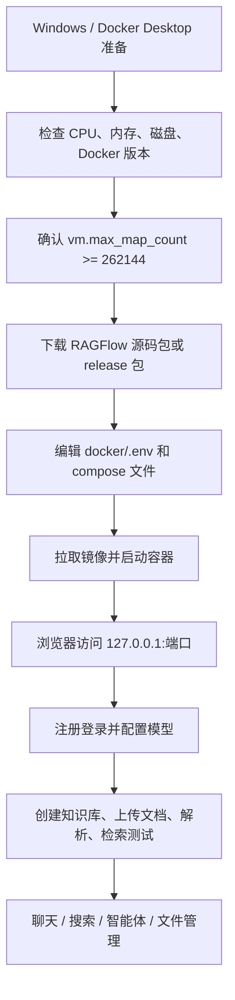
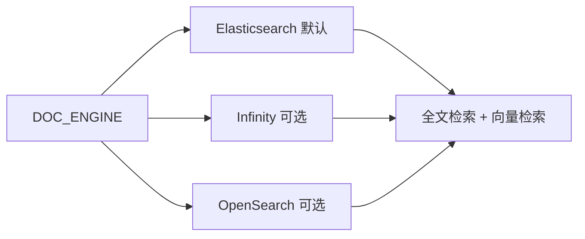
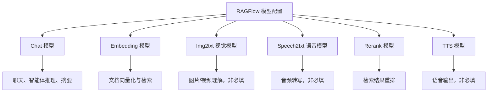
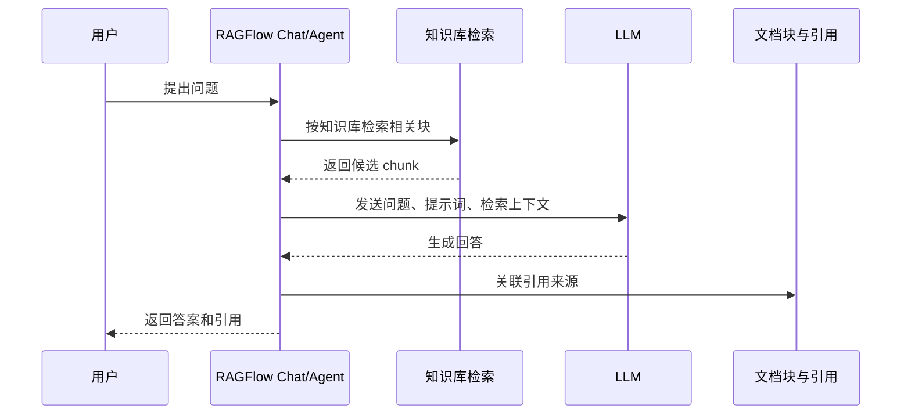

# Ragflow 小白教程（详细重制版）

日期：2026-05-12

来源视频：[Ragflow 小白教程（详细重制版）](https://www.youtube.com/watch?v=zpZKOSv4nIQ)

频道：augustdoit

发布时间：2025-09-19

时长：34:25

本地素材：

- 视频：未完整下载。首次抓取在视频分片下载阶段失败，目录中只保留 `.part` 临时文件和音频文件。
- 音频：`local-media/youtube/2026-05-12-ragflow-zpzkosv4niq/Ragflow 小白教程（详细重制版） [zpZKOSv4nIQ].quicktime.f140.m4a`
- 字幕：`local-media/youtube/2026-05-12-ragflow-zpzkosv4niq/Ragflow 小白教程（详细重制版） [zpZKOSv4nIQ].quicktime.zh-Hans.srt`
- 字幕说明：`asset-manifest.md` 标记为 `YouTube subtitle or automatic caption`，不是本地 ASR。
- 元数据：`local-media/youtube/2026-05-12-ragflow-zpzkosv4niq/Ragflow 小白教程（详细重制版） [zpZKOSv4nIQ].quicktime.info.json`
- 缩略图：`local-media/youtube/2026-05-12-ragflow-zpzkosv4niq/Ragflow 小白教程（详细重制版） [zpZKOSv4nIQ].quicktime.webp`
- 素材清单：`local-media/youtube/2026-05-12-ragflow-zpzkosv4niq/asset-manifest.md`
- 清洗字幕：`local-media/youtube/2026-05-12-ragflow-zpzkosv4niq/transcript-clean.txt`
- 分章字幕：`local-media/youtube/2026-05-12-ragflow-zpzkosv4niq/chapter-transcript.md`
- 评论原始数据：`local-media/youtube/2026-05-12-ragflow-zpzkosv4niq/comments.json`
- 评论摘要素材：`local-media/youtube/2026-05-12-ragflow-zpzkosv4niq/comments-digest.md`
- 关键画面抽帧：未生成，原因是完整视频文件缺失。

说明：`local-media/` 是本地沉淀目录，不应提交进 Git。

## 配套资源 / 代码地址

- 视频：https://www.youtube.com/watch?v=zpZKOSv4nIQ
- 频道：https://www.youtube.com/@augustdoit
- 视频文字教程：https://blog.augustdoit.men/ragflow-new/
- 视频资源包：https://pan.baidu.com/s/1s42IuYonJjHl9YwwTkf3TQ?pwd=92ty
- RAGFlow GitHub：https://github.com/infiniflow/ragflow
- RAGFlow v0.25.2 release：https://github.com/infiniflow/ragflow/releases/tag/v0.25.2
- RAGFlow 文档：https://ragflow.io/docs
- 代码仓库：视频简介、元数据和评论中未发现额外的示例代码仓库地址。

## 评论区补充

评论抓取结果只有 1 条，没有置顶评论、作者回复或 URL。唯一评论反馈是：文档解析阶段一直报错，embedding 正常，但后续流程 error。这个反馈很有价值，因为它正好说明 RAGFlow 入门失败点不只在镜像拉取和模型配置，还在解析链路：DeepDoc/OCR、文档引擎、任务执行器日志、embedding 维度或模型连通性都可能把“上传成功”变成“解析失败”。

## Fieldbook 归档判断

- 内容类型：资料消化 / 工具观察
- 当前归档：`20-资料笔记/`
- 是否值得升级为 lab：暂不升级。
- 判断理由：视频价值在于给小白补齐 Windows + Docker Desktop 部署路径和 RAGFlow UI 入门，不是提出了一个必须立刻复现实验的 API 或算法判断。真正值得实验的是“当前 v0.25.2 下最小可运行 RAGFlow 自托管部署 + 文档解析失败定位”，但这需要下载镜像、启动多容器服务和准备模型 API，成本高于本次笔记沉淀范围。
- 后续应进入：如果继续研究，建议进入 `50-实验验证/` 做一个最小部署验证；如果只是跟踪 RAG 产品能力，保留在 `20-资料笔记/` 即可。

## 一句话结论

这个视频是一个偏实操的 RAGFlow Windows 本地部署和入门教程：它把 Docker Desktop、`.env`、端口、镜像、模型供应商、知识库解析、聊天、搜索和智能体都走了一遍；但视频基于 `v0.20.5`，当前 RAGFlow 已到 `v0.25.2`，镜像策略和官方定位已经变化，照抄旧版本部署步骤会踩坑。

## 视频时间轴

| 时间 | 主题 | 要点 |
|---|---|---|
| 00:00 | 前言及前期准备 | 说明这是旧教程的重制版，重点补齐小白部署细节；检查 Docker、Docker Compose、磁盘、内存和 `vm.max_map_count`。 |
| 02:48 | 下载 RAGFlow | 视频选择 `v0.20.5` 稳定版，讲解完整镜像与 slim 镜像差异。 |
| 05:40 | 配置文件编辑 | 修改 `.env` 的 `DOC_ENGINE`、`RAGFLOW_IMAGE`、`HF_ENDPOINT`，必要时调整 `docker-compose.yml` 端口与 restart 策略。 |
| 12:02 | 拉取镜像并启动 | 在 `docker` 目录执行 `docker compose`，等待镜像下载和容器健康检查，通过浏览器访问本地服务。 |
| 14:13 | 对接模型 | 添加 DeepSeek、Gemini、Ollama 等模型，配置默认聊天模型、embedding、视觉、语音、rerank、TTS 等模型位。 |
| 19:51 | RAGFlow 使用教程 | 演示知识库创建、文档上传解析、检索测试、聊天、搜索、智能体模板和文件管理。 |

## 1. 这次“重制版”解决的真实问题

视频开头说得很清楚：上一期更偏功能讲解，部署过程对小白不友好。所以这次不是“RAG 原理课”，而是把最容易断的部署链路摊开。

核心链路是：

好品味在哪里？不是多讲概念，而是先把部署前置条件说清楚。RAGFlow 这种系统不是一个单进程小工具，它背后有文档解析、全文检索、向量存储、对象存储、数据库、任务执行和模型调用。小白最常见的失败不是“不会 RAG”，而是 Docker 资源不够、镜像拉不下来、端口冲突、模型没配、文档没解析完。

## 2. 视频里的部署版本与当前官方事实

这里必须把“视频说法”和“当前事实”分开。混在一起就是坏笔记，会误导以后的人。

### 视频说法

- 视频使用的是 `v0.20.5` 稳定版。
- 视频介绍当时有完整镜像和 slim 镜像：完整镜像约 9GB，包含内置 embedding；slim 镜像约 2GB，不包含内置 embedding。
- 视频演示通过修改 `RAGFLOW_IMAGE` 在完整镜像和 slim 镜像之间切换。
- 视频建议国内环境启用 `HF_ENDPOINT=hf-mirror.com`，用来缓解 Hugging Face 访问问题。
- 视频以 Windows + Docker Desktop 为主线，源码包放在本地目录，进入 `ragflow/docker` 后启动。

### 当前事实（2026-05-12 校准）

- GitHub 当前最新 release 是 `v0.25.2`，发布时间为 `2026-05-09T11:07:44Z`。release 摘要强调 RESTful API 迁移，同时保持 legacy endpoint 兼容；新增 8 类数据源删除文件同步快照；修复元数据可见性、重复输出、Elasticsearch metadata filtering 性能问题。
- 当前 README 将 RAGFlow 描述为融合 RAG 与 Agent 能力的开源 RAG engine/context layer，不再只是“知识库程序”。
- 当前关键特性包括 DeepDoc 深度文档理解、模板化 chunking、grounded citations、异构数据源、自动化 RAG workflow、可配置 LLM/embedding、多路召回与融合重排、API 集成。
- 当前自托管最低要求仍是 CPU 4 cores、RAM 16GB、Disk 50GB、Docker 24.0.0、Docker Compose 2.26.1。
- 预构建 Docker 镜像面向 x86 平台；ARM64 需要按官方说明自行构建。
- 从 `v0.22.0` 起，官方只发布 slim edition，并且不再在 tag 后追加 `-slim` 后缀。所以视频里“完整镜像 vs slim 镜像”的选择逻辑对当前版本已经过期。

结论很简单：视频部署路径仍有参考价值，但版本选择和镜像认知必须按当前 README 修正。照着视频找 `v0.25.2` 的“完整版 9GB 镜像”，大概率是在找一个已经不存在的东西。

## 3. 部署前置条件

视频强调了三个硬条件和一个内核参数：

| 项目 | 视频要求 | 当前官方要求 | 备注 |
|---|---:|---:|---|
| CPU | 4 核以上 | CPU >= 4 cores | 一致。 |
| 内存 | 16GB 以上 | RAM >= 16GB | 一致。 |
| 磁盘 | 预留 50GB | Disk >= 50GB | 一致。完整镜像时代更容易吃磁盘；当前 slim 仍不能小看。 |
| Docker | 大于 24 | Docker >= 24.0.0 | 一致。 |
| Docker Compose | 大于 2.26.1 | Docker Compose >= v2.26.1 | 一致。 |
| `vm.max_map_count` | 不小于 262144 | >= 262144 | Elasticsearch 场景下尤其关键。 |

这里不要耍聪明。资源不足时，RAGFlow 可能不是立刻报一个漂亮错误，而是在解析、索引、容器健康检查或模型调用时失败。把资源配够，比在错误日志里猜半天强。

## 4. 配置文件改动逻辑

视频主要改三类配置。

### 4.1 文档引擎

`.env` 中的 `DOC_ENGINE` 决定全文和向量存储后端。视频列出：

- `elasticsearch`：默认选择。
- `infinity`：视频提醒不支持 Linux ARM 架构。
- `opensearch`：另一个可选项。

当前 README 仍说明 RAGFlow 默认使用 Elasticsearch，并提醒切换到 Infinity 时要停止容器、改 `.env`、重新启动；带 `-v` 删除卷会清空已有数据。这个点很危险，小白教程里容易一句带过，但真实使用中它是数据破坏操作。

### 4.2 镜像选择

视频基于 `v0.20.5`，通过 `RAGFLOW_IMAGE` 选择完整镜像或 slim 镜像。当前版本要改判断：

- `v0.22.0` 之前：完整镜像和 slim 镜像并存。
- `v0.22.0` 起：只发 slim edition，不再追加 `-slim` 后缀。
- 当前 `v0.25.2`：应按官方 README 的 `RAGFLOW_IMAGE` 逻辑使用当前 tag，不要沿用旧的完整镜像切换方式。

这就是版本漂移。教程没错，错的是把旧教程当永恒真理。

### 4.3 端口与自启动

视频建议：

- 只有端口冲突时才改 `docker-compose.yml` 中的 `80:80`、`443:443`。
- 如果本机还跑 Dify、FastGPT 等 Web 服务，默认 80/443 很容易冲突。
- Windows 本地环境如果希望开机后自动恢复服务，可把 `restart: on-failure` 改为 `always`，并在多个 compose 文件中对应修改。

这个改法实用，但要记住：自启动只是让容器起来，不代表模型供应商、代理、网络、API key、数据卷都正常。开机自动启动失败时，先看容器日志，而不是反复刷新浏览器。

## 5. 启动与失败定位

视频启动路径是进入 `ragflow/docker` 目录执行 compose 命令，等待镜像拉取和容器进入 `started` 或 `healthy`，再打开 `127.0.0.1:端口`。

失败点主要有三类：

1. 镜像拉不下来：优先检查 Docker 镜像源、网络代理、磁盘空间。
2. 容器起来但页面异常：先等服务初始化，再看 server 容器日志。
3. 页面能进但解析失败：看任务日志、embedding 模型、文档引擎、OCR/DeepDoc 相关服务，而不是只盯着前端。

视频后半段演示智能体回答时，也顺手展示了 Docker Desktop 里查看 `server` 日志的办法。这个细节比很多 UI 操作更重要。日志是事实，页面弹窗只是结果。

## 6. 模型配置

视频把模型配置分成两种：

- 第三方模型供应商 API：如 DeepSeek、Gemini，填 API key 即可。
- 本地模型管理工具：以 Ollama 为例，配置模型名称、URL、模型类型，API key 可留空。

RAGFlow 里模型不是一个单一配置，而是一组角色：

最低可用路径是：至少配好 chat 模型和 embedding 模型。视觉、语音、rerank、TTS 可以先留空。不要一上来把所有模型位都配满，出了错你连哪个环节坏了都不知道。

## 7. RAGFlow 基本使用路径

视频演示了 5 个顶部功能：知识库、聊天、搜索、智能体、文件管理。

### 7.1 知识库

关键步骤：

1. 创建知识库。
2. 配置权限、切片方法、PDF 解析器、embedding 模型、分块大小、分段标识等。
3. 上传文档。
4. 等待解析完成。
5. 查看切片结果。
6. 用检索测试确认能命中文档内容。

视频强调切片方法要跟文件类型匹配，例如 General、QA、Resume、Manual、Table 等。这个判断是 RAG 质量的前置条件。烂 chunking 之后再换大模型，本质上是在给垃圾检索结果买更贵的解释器。

### 7.2 聊天

聊天助手必须选择知识库，否则它无法基于你的本地文档回答。视频用一个折旧年限问题演示：回答不仅给出结果，还能引用原文档块。

这正是 RAGFlow 的核心价值：不是“模型知道”，而是“答案能回到文档依据”。没有 citation 的 RAG，在生产里就是没上保险。

### 7.3 搜索

搜索功能可以直接返回命中的文档内容，也可以勾选 AI 总结，让模型基于搜索结果整理成更可读的答案。视频中表格内容能被定位并展示，说明文档解析和表格处理链路至少在演示样例里工作正常。

### 7.4 智能体

视频展示了系统模板“知识库检索智能体”。它可以组合模型、提示词和工具，例如 Retrieval 工具、搜索引擎工具等。

这里要克制。小白刚入门不要急着堆多工具、多智能体。先确认单知识库、单检索、单聊天链路稳定，再谈 workflow 和 agent。复杂性不是能力，复杂性通常只是错误表面积。

### 7.5 文件管理

文件管理能查看知识库对应的文件夹和上传文档，并进行下载、查看等操作。它更像是知识库资产的管理入口，不是主要的 RAG 质量调参入口。

## 8. 与旧部署教程的差异

视频自己说这是旧视频的“详细重制版”。差异可以概括成三点：

1. 更强调前置环境：Docker Desktop、WSL 磁盘、Docker/Compose 版本、`vm.max_map_count`。
2. 更细地讲配置文件：`.env`、`docker-compose.yml`、`docker-compose-base.yml`、端口、restart 策略。
3. 更完整地走通入门闭环：部署后不仅能登录，还配置模型、创建知识库、解析文档、测试检索、创建聊天和智能体。

这才是对小白有用的重制。只讲“docker compose up -d”没有意义，因为失败通常发生在命令之外。

## 工程提醒

1. 不要在已有数据上随便执行 `docker compose down -v`。`-v` 会删卷，文档、索引、数据库数据都可能没了。
2. 不要把端口冲突当成 RAGFlow 问题。先查本机 80/443/自定义端口是否被占用。
3. 不要把 embedding 正常等同于文档解析正常。评论区唯一反馈就是 embedding 正常但后续解析 error。
4. API key、代理、模型服务 URL 都是环境依赖。能保存配置不代表模型能连通。
5. 高风险动作必须有人审：写配置文件、删 Docker volume、开放公网端口、使用付费模型 API、执行 shell 命令都应该先确认影响范围。
6. 当前官方镜像是 x86 预构建。ARM64 机器不要硬套视频部署路径。

## 工程判断

- 适合什么场景：适合个人或小团队快速搭一个可视化 RAG 系统，用来验证文档解析、chunking、检索、引用、聊天和简单 agent workflow。
- 不适合什么场景：不适合把“看完视频能跑起来”直接当生产上线方案。生产还要处理账号权限、备份、升级、监控、模型成本、数据隔离、解析失败重试、日志留存和安全边界。
- 风险和边界：版本漂移是最大风险。视频基于 `v0.20.5`，当前 `v0.25.2` 的镜像策略、API 迁移和功能定位都已经变化。部署教程必须跟 release/README 校准，否则就是过期操作手册。

## 后续研究问题

- 当前 `v0.25.2` 的官方 quickstart 在 Windows + Docker Desktop 下是否仍与视频路径完全一致？
- `v0.25.2` 默认 slim 镜像缺少内置 embedding 后，小白最推荐的 embedding 配置是什么？
- DeepDoc、Naive、MinerU、Docling 在中文 PDF、表格、扫描件上的实际解析差异有多大？
- RAGFlow 的 agent workflow 和 Dify/FastGPT 的工作流相比，数据结构和工具边界有什么本质差异？
- release 中提到的 RESTful API 迁移，对旧集成脚本有哪些兼容边界？

## 实验验证建议

- 要验证什么：当前 `v0.25.2` 在本机 Docker Desktop 下，从 clean clone 到上传一个中文 PDF 并完成检索问答的最短闭环。
- 最小实验形式：一个 `50-实验验证/ragflow-v0252-local-smoke/`，只保留 README、环境清单、启动命令、一个小样本文档、验证问题、日志定位记录。
- 是否现在就做：否。本次任务是视频沉淀归档；完整部署会拉取镜像、启动多容器、消耗模型 API 或本地模型资源，已经超出笔记写入范围。

## 参考资料

- 视频：[Ragflow 小白教程（详细重制版）](https://www.youtube.com/watch?v=zpZKOSv4nIQ)
- 视频文字教程：https://blog.augustdoit.men/ragflow-new/
- RAGFlow GitHub README：https://github.com/infiniflow/ragflow
- RAGFlow v0.25.2 release：https://github.com/infiniflow/ragflow/releases/tag/v0.25.2
- RAGFlow 官方文档：https://ragflow.io/docs

## 未验证事项

- 本笔记基于 YouTube 字幕/自动字幕、元数据、评论摘要和 RAGFlow 官方 README/release 校准整理；没有逐句人工校对完整字幕。
- 没有完整下载视频文件，因此没有生成关键画面抽帧。
- 没有本地启动 RAGFlow，也没有验证视频中的 `v0.20.5` 部署命令。
- 没有验证当前 `v0.25.2` 在 Windows + Docker Desktop 下的实际启动结果。
- 没有验证视频文字教程和百度网盘资源包内容是否仍可访问、是否与视频版本一致。
- 没有运行 DeepSeek、Gemini、Ollama 或任何 embedding 模型配置。
