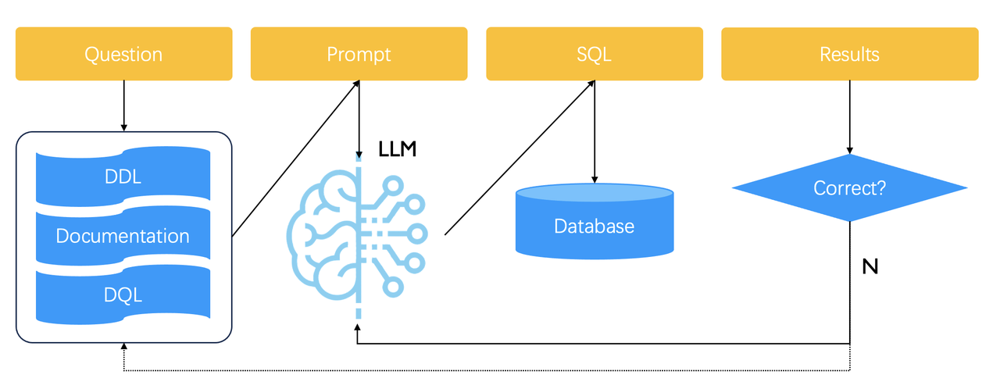
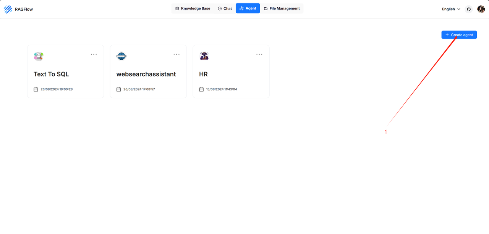
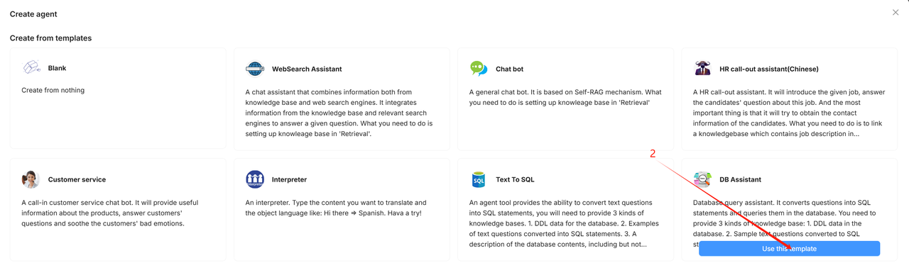
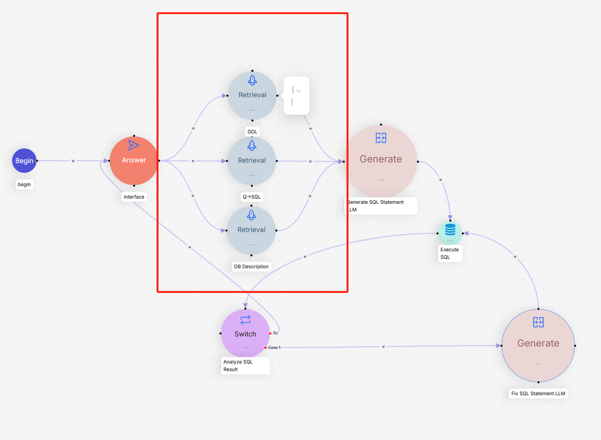
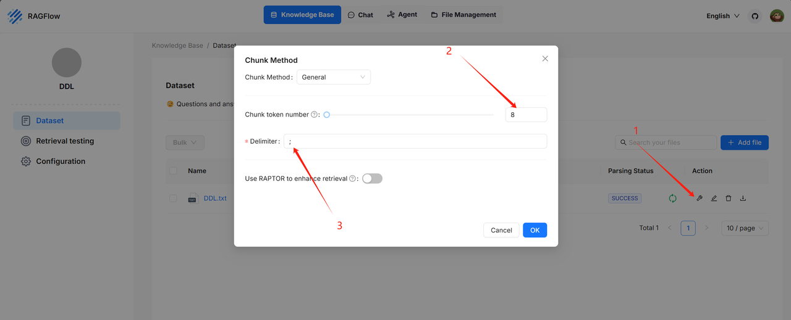
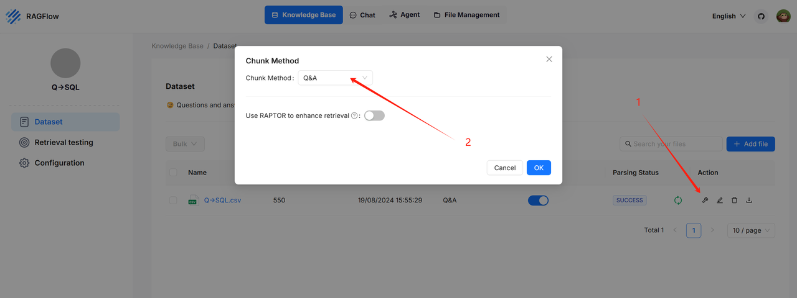
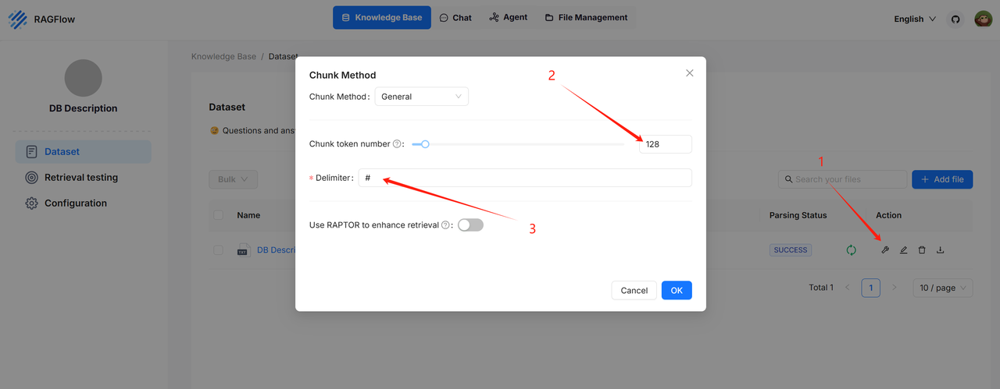
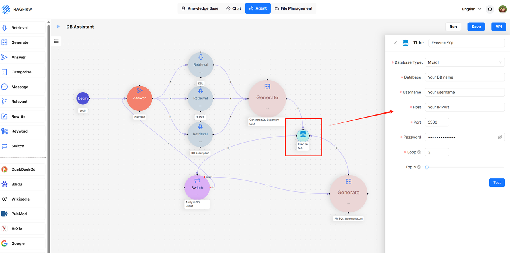

> 原文：RAGFlow 官方博客《Implementing Text2SQL with RAGFlow》  
> 本文件是面向本仓库实践学习的中文译读版。英文原文归档见 [article.md](article.md)，原始 HTML 见 [original.html](original.html)。  
> 配图均已本地化，路径沿用 `images/`。

# 用 RAGFlow 实现 Text2SQL

发布时间：2024-09-24  
阅读时长：约 5 分钟

## 这篇文章到底在做什么

RAGFlow 这篇官方文章介绍的是一个社区呼声很高的能力：`Text2SQL`。传统 Text2SQL 往往需要专门微调模型。放到企业环境里，如果它还要和 RAG、Agent 组件一起部署，微调模型会带来额外的部署、维护和更新成本。

RAGFlow 的做法更实用：不额外引入一个专门微调模型，而是基于已经接入的 LLM，用 RAG 把生成 SQL 所需的上下文补齐，再把 Text2SQL 封装成 Agent 里的内置组件。这样它能和现有 RAG/Agent 工作流直接编排，而不是另起一套孤立系统。

# Text2SQL 的 RAG 流程

文章给出的核心流水线如下：

这个流程的本质是：先检索示例和数据库结构，再让 LLM 生成 SQL，最后用数据库执行结果反过来验证 SQL 是否可用。

1. 准备一个用于 Text2SQL Prompt 的知识库。
2. 知识库里存放自然语言问题和 SQL 语句之间的转换示例。
3. 用户问题进入系统后，先从知识库检索相似示例。
4. 把检索到的示例拼进 Prompt，让 LLM 生成 SQL。
5. 用生成的 SQL 查询数据库。
6. 如果查询失败，或者查不到结果，就认为 SQL 可能有问题。
7. 系统再次调用 LLM 修正 SQL，直到达到预设的循环上限。

这里的关键不是“让模型一次猜对 SQL”。更稳的设计是把 Text2SQL 变成一个可迭代的闭环：检索、生成、执行、反思、重试。

文章还提到，后续版本计划调整这个工作流，让用户可以手动向知识库添加或更新 Text2SQL 示例。图中的虚线箭头表达的就是这个方向。

## A Text2SQL demonstration

官方演示如下：

这张动图展示的是用户用自然语言提问，系统自动生成并执行 SQL，然后返回查询结果。真正值得注意的不是界面，而是背后的边界划分：自然语言理解交给 LLM，结构和样例交给知识库，最终正确性由数据库执行结果来约束。

# Using Text2SQL in RAGFlow

下面是文章给出的 RAGFlow 使用步骤。

## 1. Create an agent from template

先从模板创建 Agent。

选择内置的 DB Assistant 模板。

这里的好处是省掉大量节点拼装。Text2SQL 不是单个 Prompt，而是一条多节点链路：知识库检索、SQL 生成、SQL 执行、失败修正和结果输出。用模板起步更符合这个功能的复杂度。

## 2. Configure knowledge bases

DB Assistant 模板里，RAGFlow 使用三类知识库来提高 Text2SQL 的稳定性：

* `DDL` knowledge base
* `Q->SQL` knowledge base
* `Database description` knowledge base

### DDL knowledge base

`DDL` 知识库存放数据库结构信息，例如表结构、字段名称、字段类型等。LLM 生成 SQL 时必须知道真实 schema，否则它很容易编出不存在的表名或字段名。

推荐解析配置如下：

示例数据集：<https://huggingface.co/datasets/InfiniFlow/text2sql/tree/main>

### Q->SQL knowledge base

`Q->SQL` 知识库存放“自然语言问题 -> SQL 语句”的样例对。这类样例相当于 few-shot Prompt 的来源。用户问题进来后，系统检索相似样例，再把它们拼进 Prompt，帮助 LLM 按同一套数据库和业务习惯生成 SQL。

推荐解析配置如下：

示例数据集：<https://huggingface.co/datasets/InfiniFlow/text2sql/tree/main>

### Database description knowledge base

`Database description` 知识库存放数据库的业务说明，包括表的含义、字段的业务语义、字段之间可能存在的关系等。

DDL 告诉模型“有什么字段”，数据库描述告诉模型“这些字段在业务上是什么意思”。这两类信息不能混为一谈。只给 DDL，模型可能能写出语法正确的 SQL，但不一定能理解用户问题里的业务词和字段之间的对应关系。

推荐解析配置如下：

示例数据集：<https://huggingface.co/datasets/InfiniFlow/text2sql/tree/main>

## 3. Configure the database

接下来配置 `Execute SQL` 组件里的数据库连接参数：

* 数据库类型：当前支持 MySQL、PostgresDB、MariaDB。
* 数据库名。
* 数据库用户名。
* 数据库 IP 地址。
* 数据库端口。
* 数据库密码。

配置完成后，点击 `Test` 检查连接是否成功。

### Loop 参数

RAGFlow 的 Text2SQL 带自动反思能力。如果生成的 SQL 能正确查询，系统直接返回结果。如果查询失败，系统会根据数据库返回的错误信息修正 SQL，然后重试。

这个过程会不断循环：

1. 生成 SQL。
2. 执行 SQL。
3. 判断执行结果。
4. 如果失败，根据错误修正 SQL。
5. 再次执行。

循环次数由 `Loop` 参数控制。达到上限后，流程会终止，并提示用户优化问题或补充知识库数据。

### TopN 参数

`TopN` 用来限制查询返回记录数量。Text2SQL 很容易生成返回大量行的查询，尤其是用户问题不够具体时。TopN 是一个必要的刹车，不要把数据库查询完全交给模型自由发挥。

## 4. Try out Text2SQL

配置完成后，点击 `Run` 执行。用户输入自然语言问题，RAGFlow 会走完整的检索、生成 SQL、执行 SQL、必要时修正 SQL 的流程。

# Troubleshooting

## `Database Connection Failed`

含义：数据库连接失败。

排查顺序：

1. 检查 `Execute SQL` 组件里的所有连接参数是否正确。
2. 确认部署 RAGFlow 的机器是否真的能访问这台数据库。
3. 点击 `Test` 验证连接是否建立成功。

## `SQL statement not found!`

含义：用户问题无法转换成 SQL。主要原因通常是知识库不够完整。

处理方式：扩充前面提到的三类知识库，尤其是 `Q->SQL` 示例和数据库业务描述。不要指望模型凭空知道你的业务库怎么查。

## `No record in the database!`

含义：SQL 查询没有返回记录。

可能原因有两个：查询条件过于严格，或者表中本来就没有相关数据。这个错误不一定说明 SQL 语法错，也可能说明用户问题和实际数据不匹配。

## `Maximum loop time exceeds. Can’t query the correct data via SQL statement.`

含义：循环修正达到上限，系统仍然没能得到正确查询结果。

检查重点：

* 数据库里是否存在相关数据。
* 用户问题是否足够明确、是否适合用 SQL 回答。
* `Generate SQL Statement LLM` 和 `Fix SQL Statement LLM` 组件生成的 SQL 是否正确。

# 工程学习笔记

## 1. Text2SQL 不是一个 Prompt 就能解决的问题

这篇文章最有价值的地方，是把 Text2SQL 拆成了几个稳定边界：schema、样例、业务解释、SQL 执行、失败修正。坏设计会把这些东西全塞进一个大 Prompt，然后希望模型自己理解数据库。那是碰运气，不是工程。

## 2. 三类知识库各有职责

`DDL` 解决结构正确性，`Q->SQL` 解决生成风格和范例对齐，`Database description` 解决业务语义映射。三者缺一类，Text2SQL 的失败模式都会变多。

## 3. 数据库执行结果是最硬的反馈信号

RAGFlow 这里没有只相信模型的回答，而是用真实数据库执行结果来判断 SQL 是否可用。这个反馈比“让另一个模型评判 SQL 对不对”更直接，也更便宜。

## 4. Loop 和 TopN 是工程护栏

`Loop` 防止系统无限修正，`TopN` 防止查询返回过多记录。这两个参数看起来不起眼，但它们决定了 Text2SQL 能不能放进真实系统里跑。

## 5. 知识库质量比模型花活更重要

如果 DDL 错、样例少、字段描述不清楚，换更大的模型也只是推迟失败。Text2SQL 的第一性问题是数据结构和业务语义，不是模型会不会写 SQL。
