> 原文：RAGFlow 官方博客《Agentic Workflow - What's inside RAGFlow 0.20.0》  
> 本文件是面向本仓库实践学习的中文译读版。英文原文归档见 [article.md](article.md)，原始 HTML 见 [original.html](original.html)。  
> 配图均已本地化，路径沿用 `images/`。

# Agentic Workflow：RAGFlow 0.20.0 里面有什么

发布时间：2025-08-05  
阅读时长：约 8 分钟

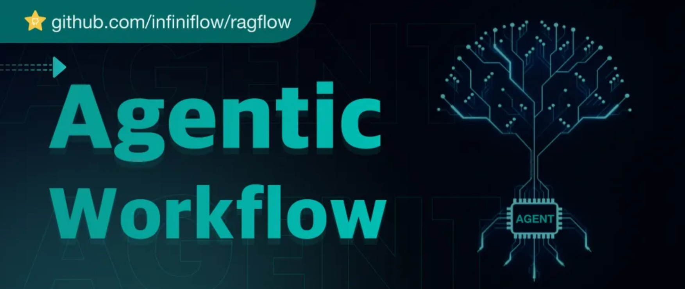

## 1. 从 Workflow 到 Agentic Workflow

RAGFlow 0.20.0 是一次重要版本更新。官方给它的定位不是普通功能补丁，而是把 RAG 和 Agent 的整体拼图补完整。

一年前，RAGFlow 已经引入了 Agent 功能，但当时主要支持人工编排的 Workflow，还没有真正的 Agentic Workflow。按照 RAGFlow 的定义，一个完整 Agent 需要同时具备两类能力：

- `Workflow`：人定义流程，适合确定性的业务步骤。
- `Agentic Workflow`：由 LLM 自动规划、选择动作和调用工具，适合不确定、开放式任务。

Anthropic 在 2024 年的《Building Effective Agents》中也强调过类似区分：Workflow 仍然是 Agent 在生产环境里最常见的使用方式。到了 2025 年，模型能力增强后，Agentic Workflow 才开始支撑更复杂、更有弹性的应用。

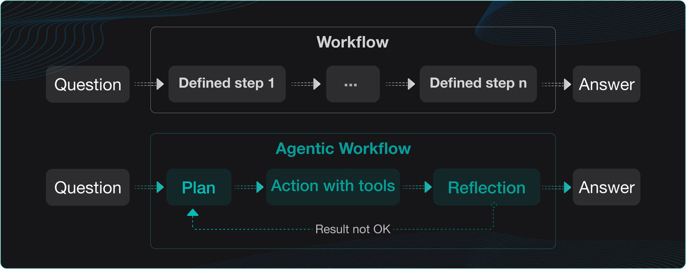

理想状态下，很多 Agent 应用最终都会走向更强的 LLM 驱动流程。但现实没那么浪漫：当前 LLM 仍然有不可预测、难控制的问题，在企业场景里尤其麻烦。另一端是传统 Workflow，所有变量、条件、循环都由人显式定义，业务人员可以像低代码编程一样把规则拼出来。它的优点是可控，缺点也明显：流程容易变成复杂的节点网，维护困难，任务拆分也容易失控。

所以官方的结论很务实：企业级 Agent 不能只押注一种模式。确定性的部分用 Workflow，不确定的部分交给 Agentic Workflow，两者必须能在同一套编排系统里协同。

RAGFlow 完成 Agent 能力后，就更像一个企业级、平台型的 LLM 引擎。在企业系统里，RAG 扮演的角色有点像传统数据库，Agent 则像上层应用。但这个类比不能照搬，因为 RAG 处理的是非结构化数据，Agent 又需要频繁、实时、精确地向 RAG 要上下文，才能让行动贴近用户意图。RAG 提供上下文，Agent 执行动作，两者耦合会比传统应用和数据库更紧。

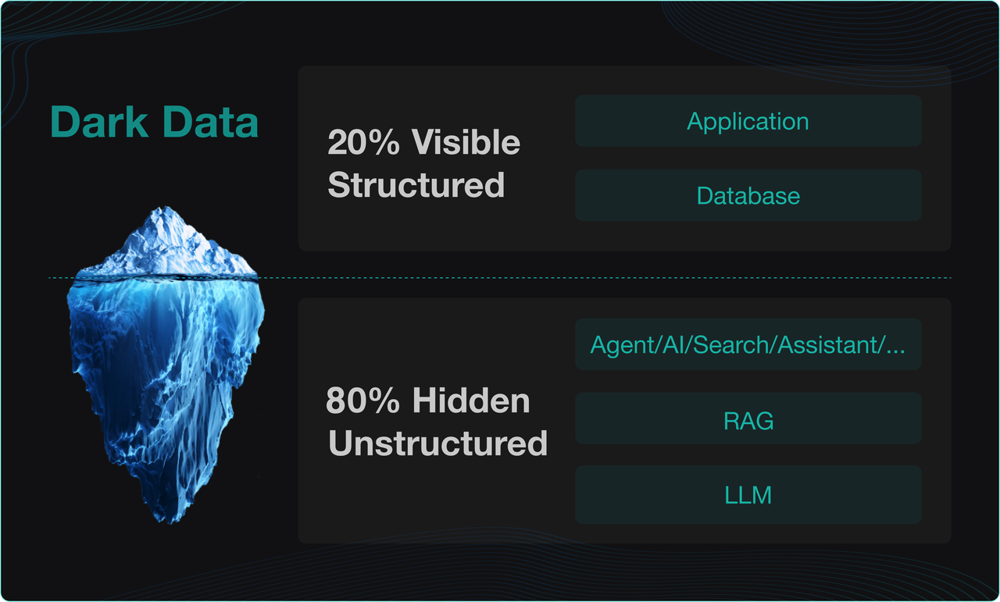

工程学习笔记：这篇文章真正想讲的不是“Agent 更高级”，而是“把确定性和不确定性分层”。把所有逻辑都丢给 LLM，是懒；把所有分支都画成节点，是笨。好的系统应该让两种执行模型各干各的活。

## 2. RAGFlow 0.20.0 的关键更新

这个版本的核心更新包括：

- Agent 和 Workflow 可以统一编排。
- Agent 组件被完整重构，能力和易用性都增强，支持 Multi-Agent、规划与反思、可视化能力。
- MCP 功能补齐：可以导入 MCP Server，Agent 可以作为 MCP Client，RAGFlow 自身也可以作为 MCP Server。
- Agent 运行时日志可查看。
- 管理面板可以查看与 Agent 的聊天历史。

开发者体验的变化，可以从客服模板的例子看出来。

在 0.19.1 版本里，要搭一个客服 Workflow，需要 7 类组件：`Begin`、`Interact`、`Refine Question`、`Categorize`、`Knowledge Retrieval`、`Generate`、`Message`。对于第 4 类问题，最长链路有 7 步。

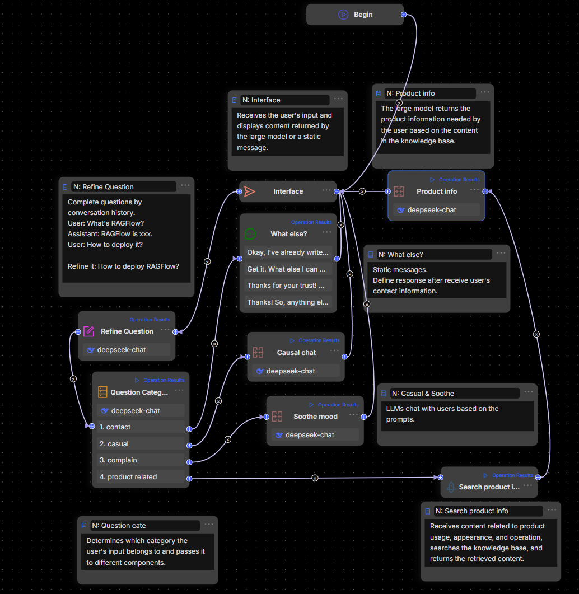

在新版本里，如果继续用纯 Workflow 模式，只需要 5 类组件：`Begin`、`Categorize`、`Knowledge Retrieval`、`Agent`、`Message`。第 4 类产品相关问题的链路缩短为 5 步。

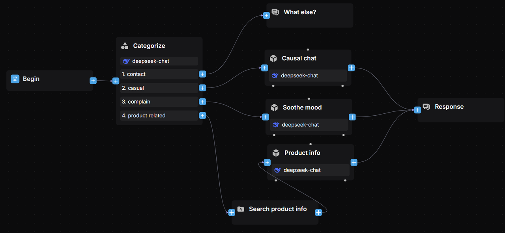

如果使用 Agentic 模式，只需要 3 类组件。原本画在流程图里的部分逻辑，可以通过 Prompt 和 Agent 工具配置处理。

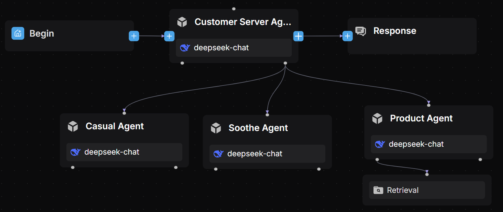

开发者可以查看 Agent 的执行路径，并检查每一步输入和输出。

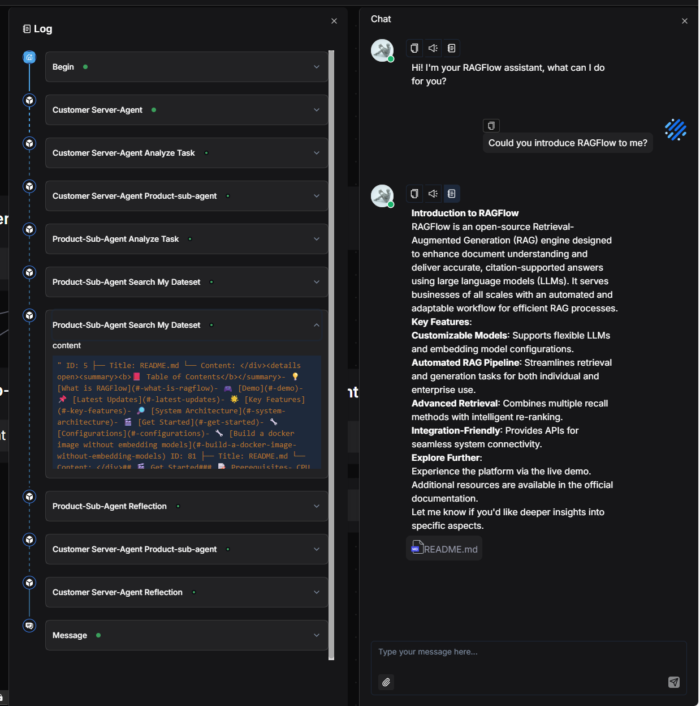

业务用户也可以通过嵌入页面或聊天界面查看 Agent 的推理过程。

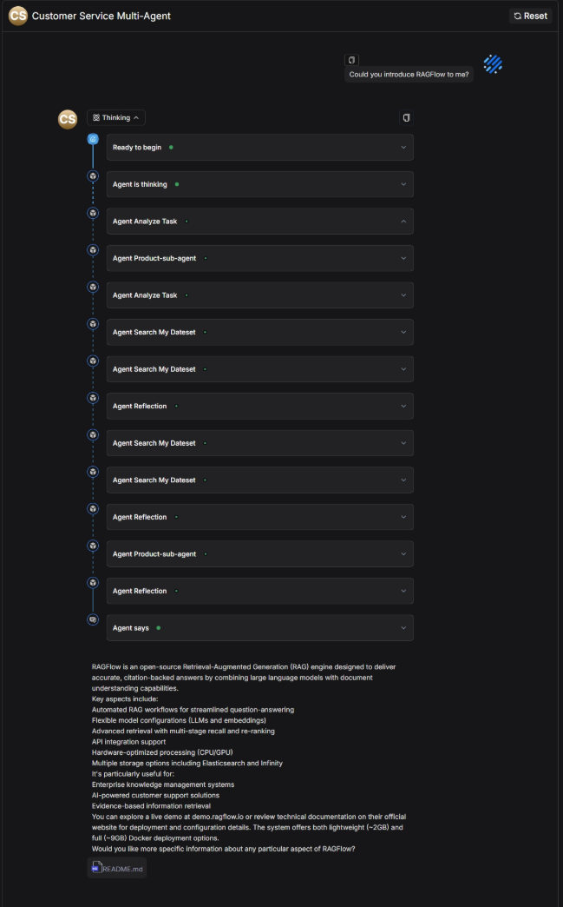

这里的关键不是“节点数量少了”这么浅。节点减少只是一种结果。真正的收益是：流程状态传递更少，分支更少，调试入口更清楚，业务人员不用维护一张越来越乱的流程图。

## 3. 面向 Agent 的统一编排引擎

RAGFlow 0.20.0 引入了 Workflow 和 Agentic Workflow 的统一编排。前面说过，这两种方式代表两个极端，但企业场景需要它们协作。新版本在一个天然支持 Multi-Agent 的画布上同时支持两者：不确定输入可以交给 Agentic Workflow，确定输入仍然走 Workflow。为了符合常见使用习惯，Agentic Workflow 在画布上表现为独立的 Agent 组件。

围绕这个目标，RAGFlow 重新设计了编排界面和组件能力，同时也修正了旧 Workflow 版本中的一些易用性问题。核心组件从 12 个减少到 10 个，主要变化如下：

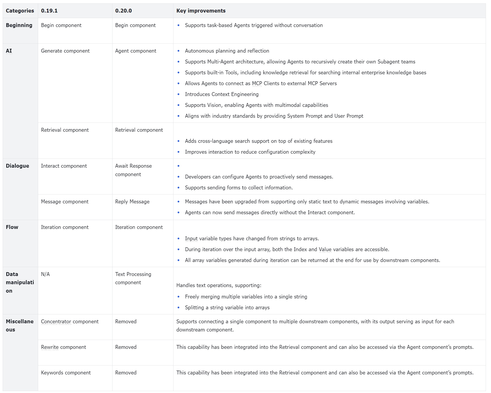

### Begin component

`Begin` 组件现在支持基于任务的 Agent 模式，不再必须由一次对话触发。开发者可以在同一个画布上构建两类 Agent：

- 对话型 Agent：由用户聊天输入触发。
- 任务型 Agent：不依赖对话入口，可以作为任务流程启动。

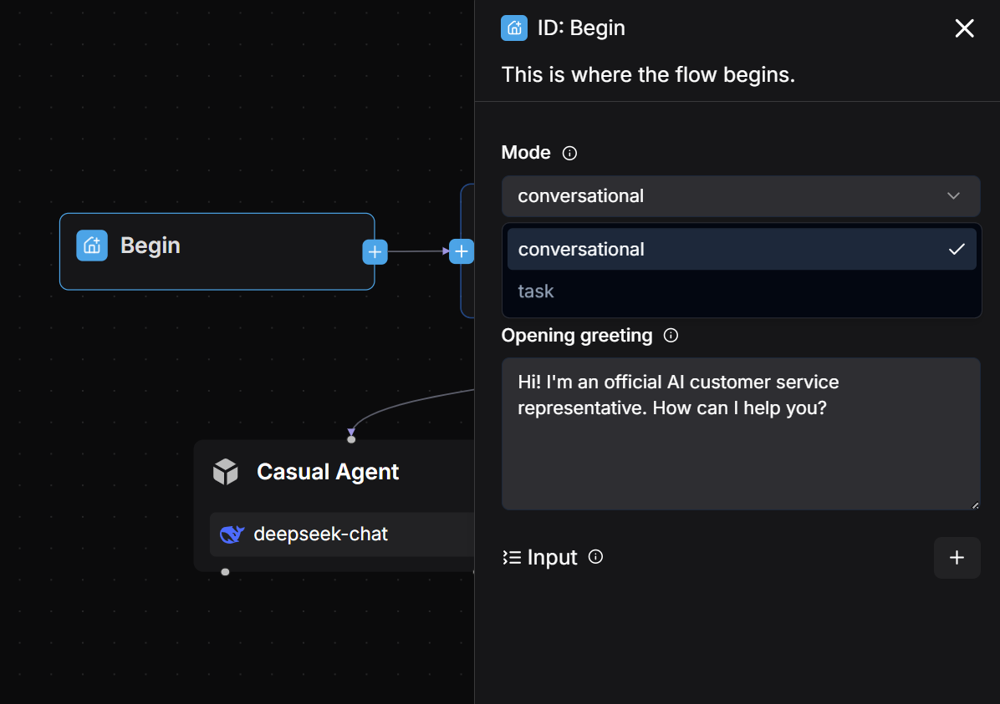

关键配置点：入口节点不再只等用户说话。对于批处理、定时任务、后台分析这类场景，任务型 Agent 更合理。强行把所有 Agent 都包装成聊天入口，是错误的数据结构。

### Retrieval component

`Retrieval` 既可以作为 Workflow 中的普通组件，也可以作为 Agent 组件可调用的 Tool。这样 Agent 就能根据任务状态自己决定什么时候检索、用什么查询词检索。

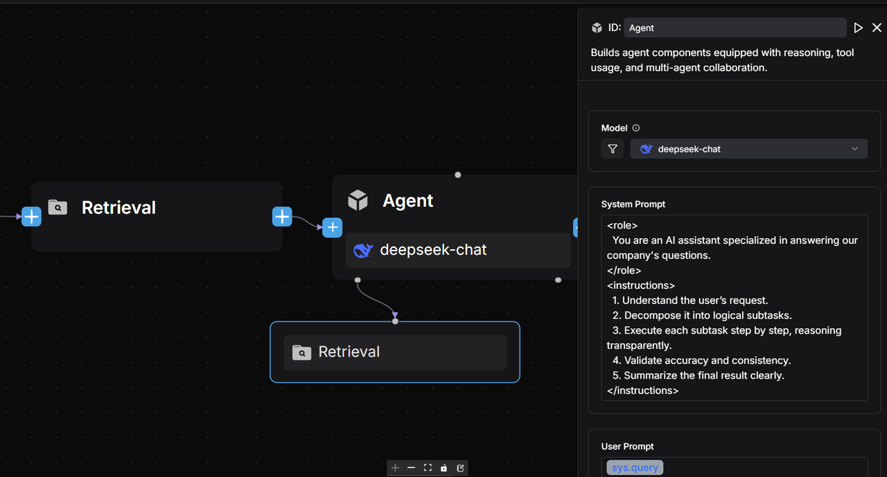

关键配置点：同一个检索能力有两种调用方式。

- 在确定流程里，Workflow 节点直接调用检索。
- 在开放任务里，Agent 把检索当工具，按上下文自行调用。

这比复制两套“检索节点”和“检索工具”更干净。能力是同一个，执行权交给不同上游。

### Agent component

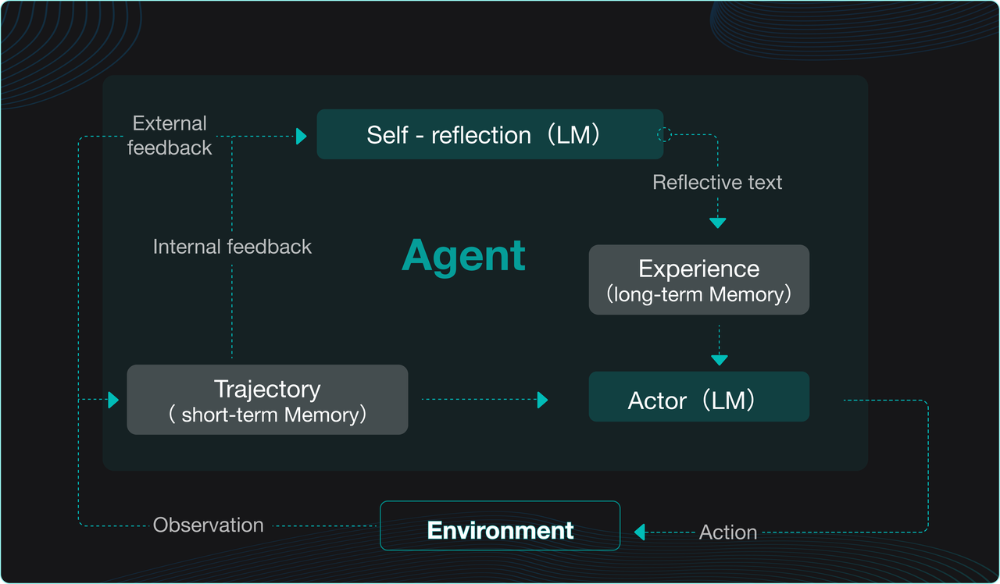

官方认为，一个能独立替代部分工作的 Agent 至少需要两类能力：

- 自主推理：能根据环境反馈反思、调整。
- 工具使用：能调用工具完成任务。

新版 Agent 组件把底层实现封装起来，开发者只需要配置 `Prompt` 和 `Tools`，就可以快速构建 Agent。

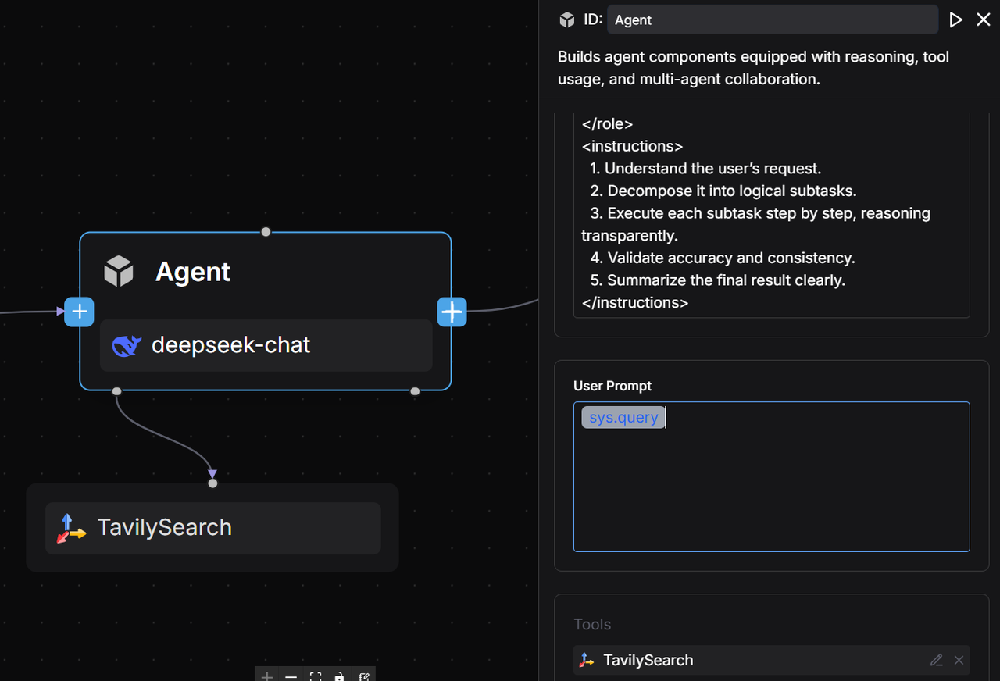

除了单 Agent 模式，新 Agent 组件还支持添加运行时可调用的子 Agent。

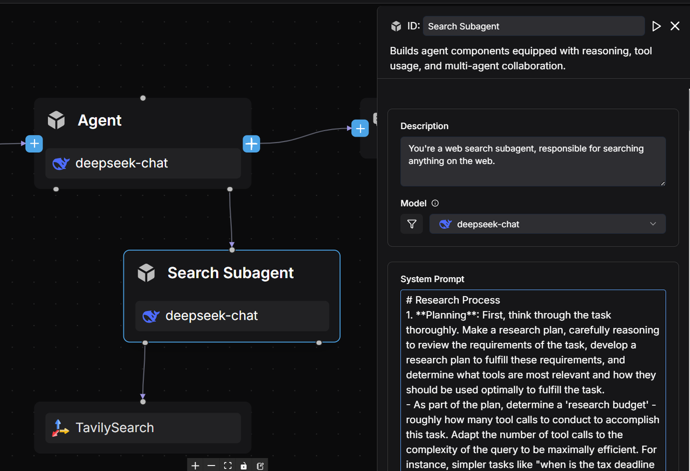

开发者可以继续添加 Agent，构建自己的 Agent 团队。官方这里强调的是“无限 Agent team”，但工程上别被这个词带偏。多 Agent 不是目的，任务边界清楚才是目的。

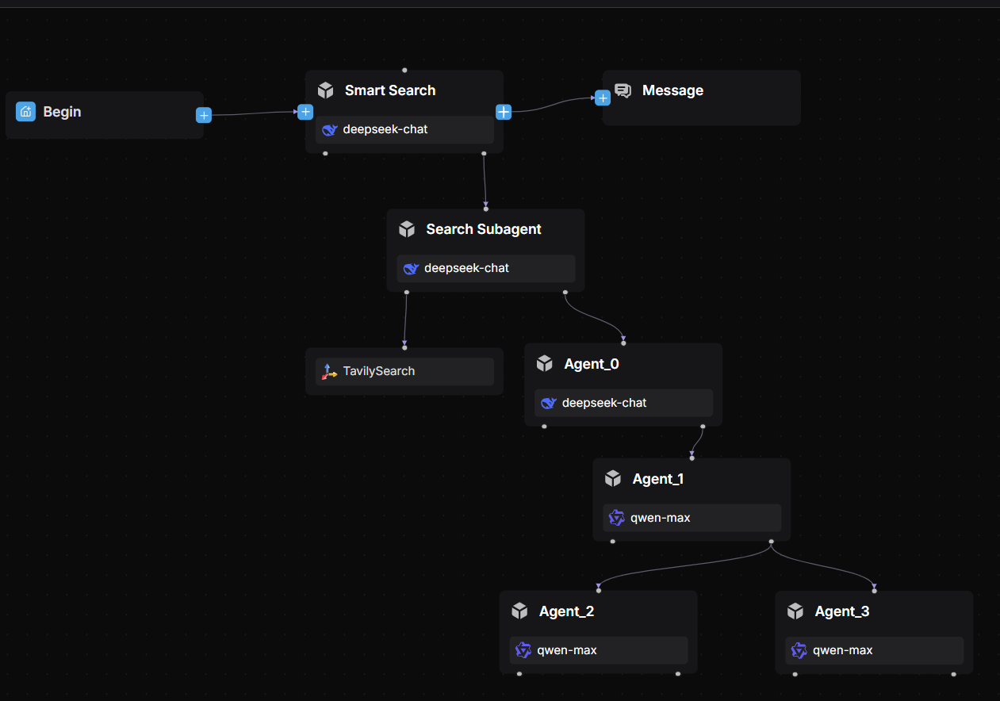

Agent 组件还可以添加和批量导入已经部署好的 MCP Servers。

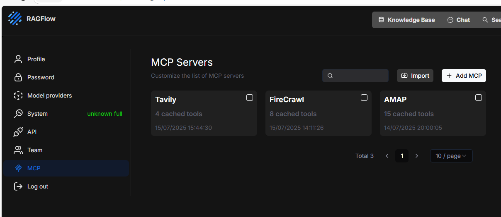

导入后的 MCP Server 工具可以在 Agent 内使用。

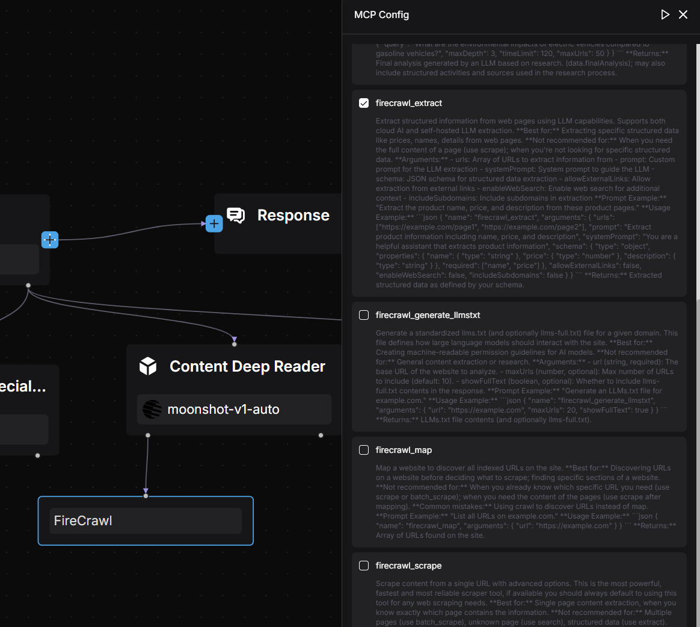

关键配置点：

- 必填能力面：`Prompt` 和 `Tools`。
- 可选扩展面：子 Agent。
- 外部工具面：导入 MCP Servers 后，把其中的工具挂给 Agent。
- 调试面：通过执行路径、输入输出和运行日志检查 Agent 行为。

工程学习笔记：Agent 组件的好坏，不取决于它能不能“看起来会思考”，而取决于它的输入输出、工具边界、失败路径是否可检查。不可检查的 Agent，在企业系统里就是事故入口。

### Await Response component

旧版 `Interact` 组件被重构为 `Await Response` 组件。它允许开发者主动暂停流程，发起预设对话，并通过表单收集关键信息。

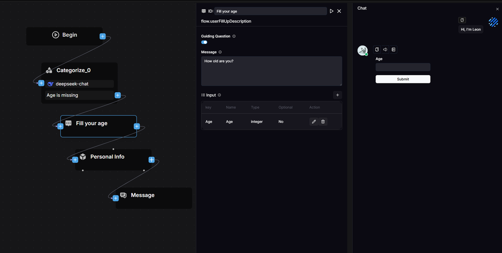

关键配置点：当流程需要用户补充结构化信息时，不要让 Agent 猜。暂停流程、发一个明确表单、拿到字段再继续。这是工程系统该有的克制。

### Switch component

`Switch` 组件的易用性被改进。

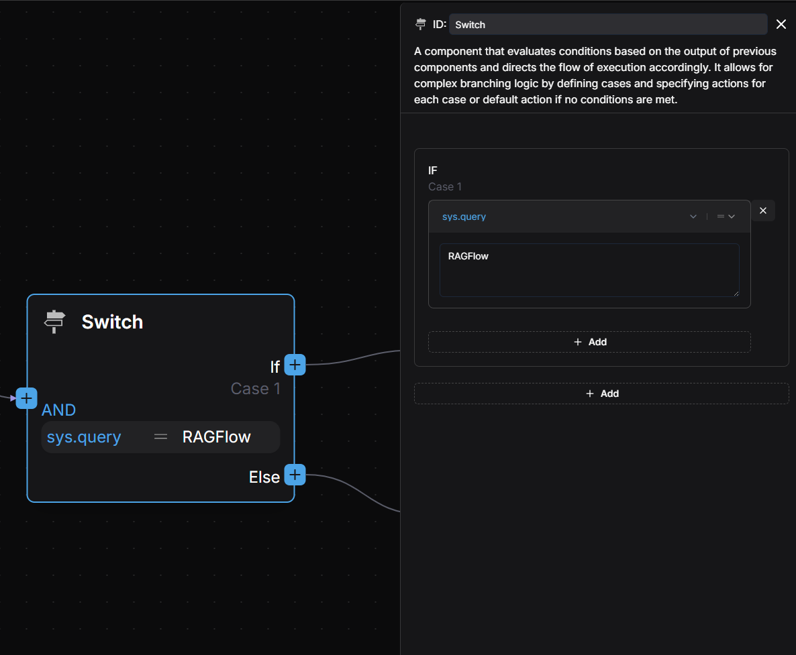

这里保留原文结论即可。Switch 的本质是确定性分支，适合明确规则，不适合让模型自由解释。

### Iteration component

`Iteration` 组件的输入参数类型改为数组。迭代过程中，内部组件可以访问当前 `index` 和 `value`，并把每次输出重新组成数组传给下游。

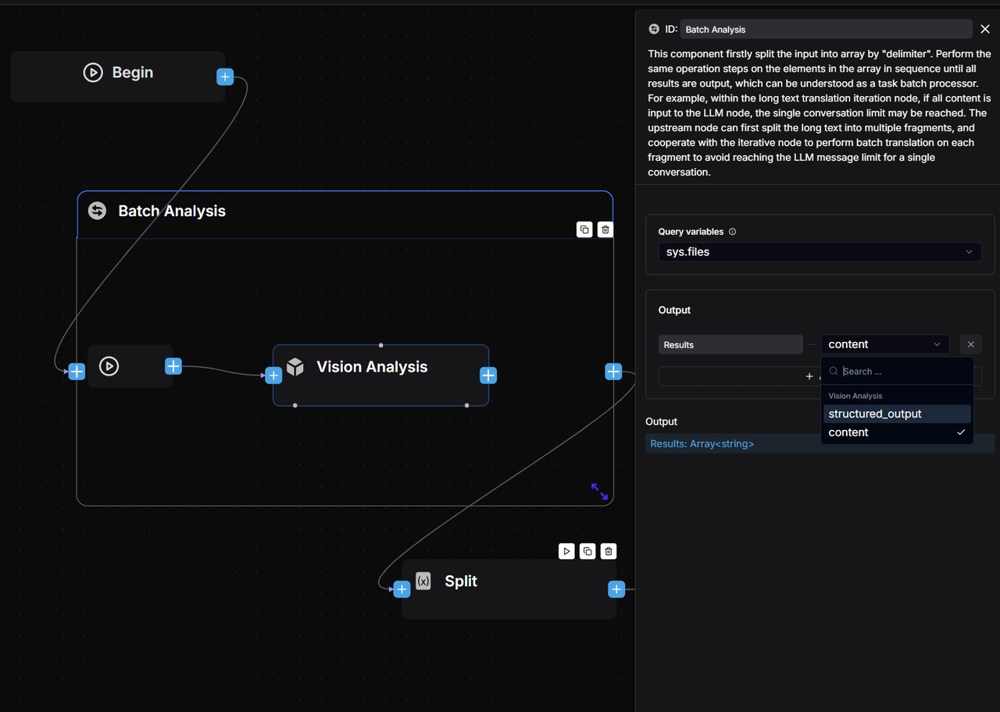

关键配置点：

- 输入必须是数组。
- 每轮循环暴露 `index` 和 `value`。
- 内部组件的输出可以收集为数组。
- 数组结果可以继续传给下游节点。

这是一种正常的数据结构设计。循环不应该靠复制节点实现，也不应该靠 Prompt 让模型“依次处理这些项目”。

### Reply Message component

现在可以通过 `Reply Message` 直接回复消息，不再必须使用 `Interact` 组件。

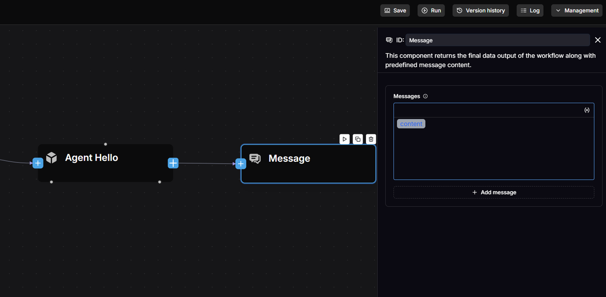

工程学习笔记：回复消息和等待用户输入是两件事。把它们拆开后，流程语义更清楚，特殊情况也更少。

### Text Processing component

开发者可以通过 `Text Processing` 方便地拼接字符串。

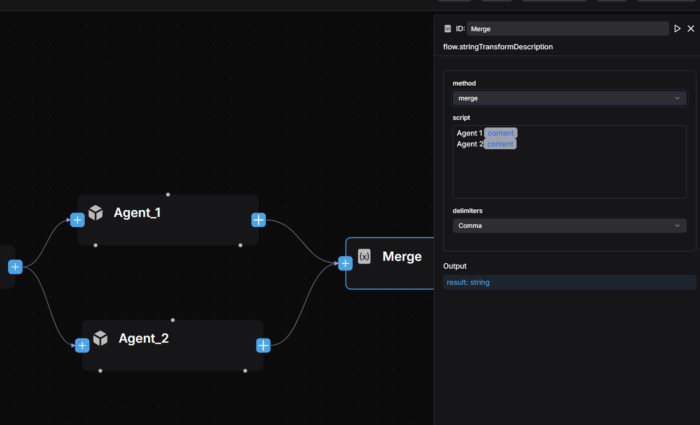

也可以把字符串拆分成数组。

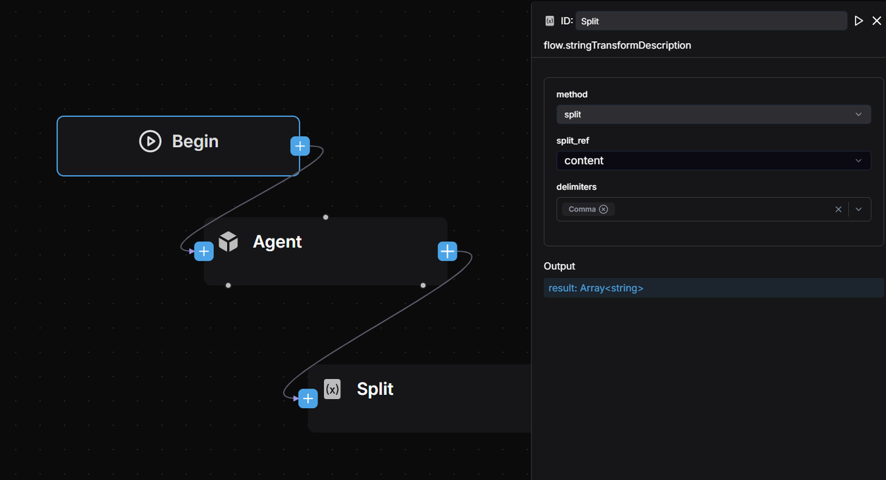

关键配置点：

- 字符串拼接适合组装上下文、提示语、结构化输出片段。
- 字符串拆分适合把列表输入转成可迭代数组。
- 这种确定性文本处理不应该交给 LLM，能用组件做就用组件做。

### Summary

RAGFlow 0.20 支持在同一个画布上同时编排 Agentic 和 Workflow 模式，并内置 Multi-Agent 支持，允许多个 Agent 共存。

开放式问题适合 Agentic 模式，例如：

```text
Why has company performance declined?
```

这类问题的分析路径无法预先完全确定，让 Agent 自主规划更合适。

固定步骤的场景适合 Workflow 模式。例如审批流、字段校验、固定检索、确定性通知，这些不需要模型“发挥”。用 Workflow 明确写出来更稳。

官方给出的最佳实践很明确：企业级智能 Agent 应该把 Agentic 和 Workflow 两种方式无缝结合。能确定的流程不要交给模型，不能提前确定的部分才交给 Agent。

## 4. 应用生态与未来发展

有了完整统一的无代码 Agent 框架后，RAGFlow 可以自然支持大量特定场景的 Agent 应用。这也是官方长期发展的重点：在 RAGFlow 上构建大量 Agent 模板，并通过生态共创持续扩展。

RAGFlow 0.20.0 内置了 `Deep Research` 模板。官方把它称为一个重要 Agent：它既可以作为独立应用，也可以作为其他智能 Agent 的基础。后续文章会详细介绍如何构建 Deep Research 模板。

下面的例子展示了在 RAGFlow 平台上，Deep Research 既可以用传统 Workflow 搭建，也可以用 Agentic Workflow 搭建。Agentic 版本明显更灵活、更简单。

传统 Workflow 搭建的 Deep Research：


Agentic Workflow 搭建的 Deep Research，复杂度明显低于上面的 Workflow 实现：

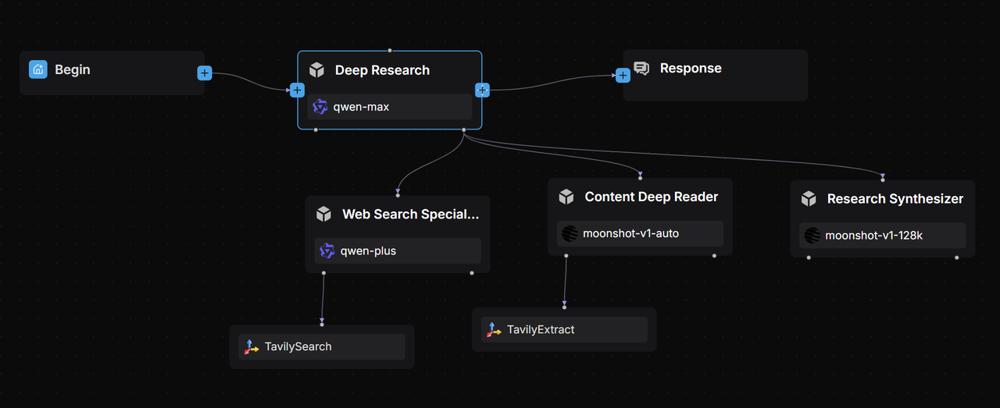

RAGFlow 的生态计划，是提供带行业 know-how 的企业级 Agent 模板。开发者可以在这些模板基础上按业务需求定制。Deep Research 是其中最重要的模板之一，因为它代表了 Agentic RAG 最常见的形态，也是 Agent 从企业数据中挖出更深价值的关键路径。

基于内置 Deep Research 模板，开发者可以快速改造成专业助手，例如法律顾问、医疗顾问等，从而缩短业务系统和底层基础设施之间的距离。这套生态成立的前提，是 RAG 和 Agent 的紧密协作。

0.20.0 版本是 RAGFlow 融合 RAG 与 Agent 能力的重要一步。后续计划中的更新包括：

- 记忆管理。
- Agent Plan 的人工调整。

统一 Workflow 和 Agentic Workflow 可以降低企业 Agent 的构建门槛，生态模板可以扩大应用范围。但真正的基础仍然是数据：围绕 RAG 融合结构化与非结构化数据。官方把这个方向称为 `context engineering`，传统 RAG 则相当于它的 1.0 版本。后续文章会继续展开这个方向。

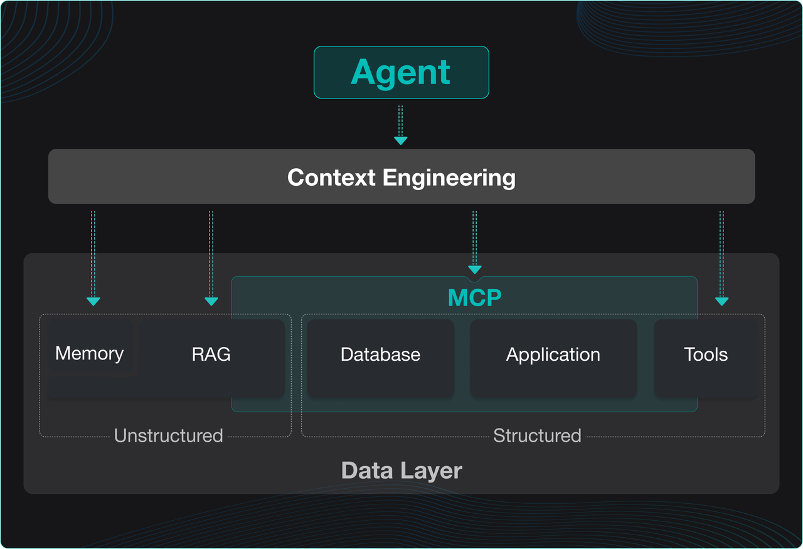

官方最后邀请读者继续支持 RAGFlow，并在 GitHub 上 star 项目：<https://github.com/infiniflow/ragflow>

## Bibliography

1. ReAct: Synergizing Reasoning and Acting in Language Models <https://arxiv.org/abs/2210.03629>
2. Reflexion: Language Agents with Verbal Reinforcement Learning <https://arxiv.org/abs/2303.11366>
3. A Practical Guide to Building Agents <https://cdn.openai.com/business-guides-and-resources/a-practical-guide-to-building-agents.pdf>

## 工程学习笔记

【核心判断】  
值得学习。RAGFlow 0.20.0 的重点不是把 Agent 神化，而是把两种执行模型放进同一个编排系统：确定性任务继续用 Workflow，不确定任务才交给 Agentic Workflow。

【关键洞察】

- 数据结构：画布上同时容纳 Workflow 节点、Agent 节点、工具、子 Agent 和 MCP Server。核心数据关系是“节点产生状态，Agent 消费上下文并调用工具，结果继续回到流程”。
- 复杂度：旧流程把太多语义塞进显式节点，新版本把开放式决策收敛到 Agent 组件，把确定性处理留给检索、迭代、文本处理、回复等组件。
- 风险点：Agentic Workflow 的最大风险是不可预测。执行路径、运行日志、输入输出检查不是可选装饰，而是生产可用的最低门槛。

【实践结论】

1. 先把业务流程拆成确定性步骤和不确定性步骤。
2. 确定性步骤用 Workflow、Switch、Iteration、Text Processing 等组件明确表达。
3. 不确定步骤用 Agent，并且只开放必要工具。
4. 检索既可以是固定流程节点，也可以是 Agent 工具，取决于调用权应该属于流程还是模型。
5. 多 Agent 只有在任务边界清楚时才有意义，否则只是把一个混乱系统拆成多个混乱组件。
