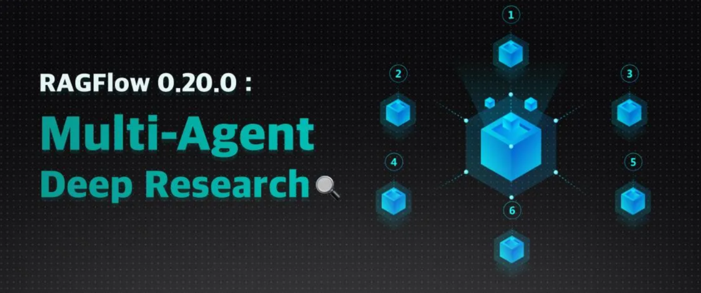
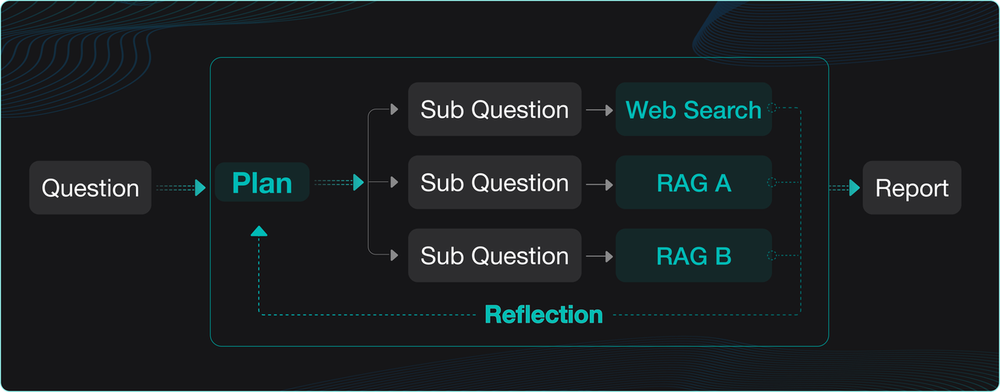
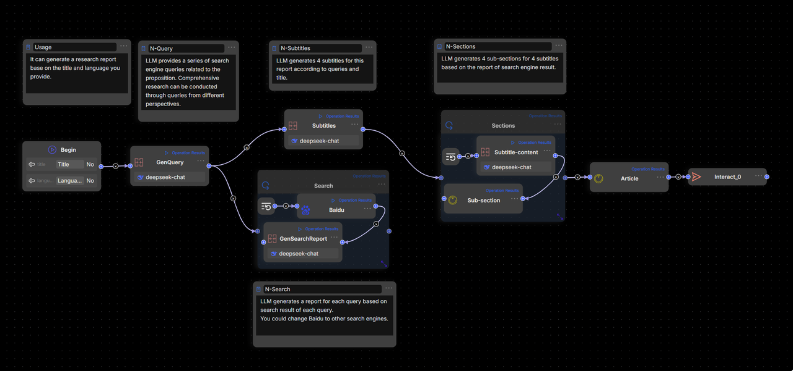
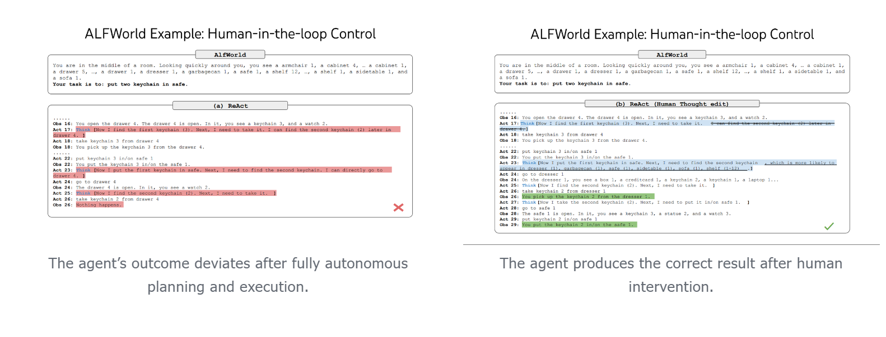

> 原文：RAGFlow 官方博客《RAGFlow 0.20.0 - Multi-Agent Deep Research》
> 本文件是面向本仓库实践学习的中文译读版。英文原文归档见 [article.md](article.md)，原始 HTML 见 [original.html](original.html)。
> 配图均已本地化，路径沿用 `images/`。

# RAGFlow 0.20.0：Multi-Agent Deep Research

发布时间：2025-08-07
阅读时长：约 13 分钟
类型：Product News



## Deep Research：Agent 时代的关键能力

文章开头给出的判断很明确：2025 年会是 Agent 落地的开端，而 Deep Research 是其中最值得关注的能力之一。原因不是“它看起来高级”，而是它把 Agentic RAG、反思机制和用户私有数据结合起来，让大模型能围绕专有资料做更深层的推理。

普通 RAG 更像“问一句、检索一批、生成一次”。Deep Research 往前走了一步：它会拆解问题、跨多个来源检索、反思已有资料、调整计划，最后再生成答案或报告。因此它既可以作为独立应用，也可以作为行业 Agent 的底座。

典型 Deep Research 流程是四步：

1. **分解与规划**：大模型拆解用户问题，制定研究计划。
2. **多源检索**：把子问题发送到多个数据源，包括内部 RAG 和外部 Web 搜索。
3. **反思与细化**：模型检查检索结果，提炼重点，并根据结果调整计划。
4. **迭代与输出**：经过多轮迭代，形成面向具体数据的推理链路，生成最终答案或报告。



RAGFlow 在 v0.18.0 已经内置过 Deep Research，但当时更偏 Demo，用来验证企业场景里的深度推理潜力。文章把业界 Deep Research 实现大致分成两类：

- **No-Code Workflow Orchestration**：用可视化工作流和预定义节点实现 Deep Research。
- **Dedicated Agent Libraries or Frameworks**：用专门的 Agent 库或框架实现，文章在参考资料里列了相关方向。

RAGFlow 0.20.0 的定位是统一的 RAG + Agent 引擎，同一张画布上同时支持 Workflow 和 Agentic 两种模式。因此理论上两种方式都能做 Deep Research。但文章也直说了：如果硬用 Workflow 拖拽方式实现 Deep Research，能跑，不代表好维护。



这里有两个核心问题：

1. **编排复杂且不直观**：基础 Deep Research 模板已经很复杂，真实业务再叠加更多节点，会变成难维护、难扩展的流程网。
2. **Deep Research 更适合 Agentic 方法**：它天然依赖动态问题拆解和决策，控制逻辑往往由算法驱动。普通拖拽式 Workflow 可以处理简单循环，但表达 BFS/DFS、动态反思和任务重规划会很别扭。

RAGFlow 0.20.0 的方案是把 Deep Research 做成关键 Agent 模板：底层是 Agentic 执行，上层仍然通过 no-code 方式配置。文章强调的优势有三点：

- **Agentic Execution, No-Code Driven**：不是只给 SDK 或运行时，而是给一个可定制的应用模板。
- **Human Intervention（Coming Soon）**：Deep Research 依赖模型生成计划，企业场景不能完全黑箱，后续会加入人工干预。
- **Business-Focused and Outcome-Oriented**：开发者可以定制 Agent 结构和工具，比如接入企业内部知识库；同时能看到计划和执行结果，便于持续优化。

## Practical Guide to Setting Up Deep Research


官方实践采用 Multi-Agent 架构，通过 Prompt Engineering 和任务拆解，把职责拆给四类 Agent：

- **Lead Agent**：协调整个 Deep Research Agent，负责任务规划、反思、分派子任务，并跟踪流程进度。
- **Web Search Specialist Subagent**：信息检索专家，调用搜索引擎，评估搜索结果，返回质量最高的 URL。
- **Deep Content Reader Subagent**：深度内容阅读器，从 Search Specialist 提供的 URL 中抽取和组织网页内容，为报告写作准备材料。
- **Research Synthesizer Subagent**：研究综合器，根据 Lead Agent 的指令，生成咨询报告风格的深度研究报告。

### 模型选择

官方给出的模型选择原则不是“所有节点用同一个最强模型”，而是按职责匹配：

- **Lead Agent**：优先选择推理能力强的模型，例如 DeepSeek-R1、Qwen-3、Kimi-2、ChatGPT-o3、Claude-4 或 Gemini-2.5 Pro。
- **Subagents**：在执行效率和质量之间权衡。不同角色还要考虑上下文窗口长度，例如内容读取和报告生成对长上下文更敏感。

### Temperature 设置

由于 Deep Research 是事实驱动型任务，文章把所有模型的 `temperature` 都设置为 `0.1`。这个选择是对的：这种任务要稳定、可复现、少发散，不需要模型写花活。

## Deep Research Lead Agent

**模型选择：Qwen-Max**

Lead Agent 的核心价值是调度，不是亲自做所有事情。它要决定阶段、分派任务、判断 DFS/BFS 研究策略，并把最终报告要求传给下游。

### 核心系统 Prompt 片段：执行框架

```text
<execution_framework>
**Stage 1: URL Discovery**
- Deploy Web Search Specialist to identify 5 premium sources
- Ensure comprehensive coverage across authoritative domains
- Validate search strategy matches research scope

**Stage 2: Content Extraction**
- Deploy Content Deep Reader to process 5 premium URLs
- Focus on structured extraction with quality assessment
- Ensure 80%+ extraction success rate

**Stage 3: Strategic Report Generation**
- Deploy Research Synthesizer with detailed strategic analysis instructions
- Provide specific analysis framework and business focus requirements
- Generate comprehensive McKinsey-style strategic report (~2000 words)
- Ensure multi-source validation and C-suite ready insights
</execution_framework>
```

这个 Prompt 把 Deep Research 压成三段式流水线：先找 5 个高质量来源，再抽取内容，最后生成约 2000 字的战略报告。关键点是每一段都有可检查的输出约束，而不是一句“请深入研究”。

### 核心系统 Prompt 片段：BFS / DFS 研究计划

```text
<research_process>
...
**Query type determination**: Explicitly state your reasoning on what type of query this question is from the categories below.
...
**Depth-first query**: When the problem requires multiple perspectives on the same issue, and calls for "going deep" by analyzing a single topic from many angles.
...
**Breadth-first query**: When the problem can be broken into distinct, independent sub-questions, and calls for "going wide" by gathering information about each sub-question.
...
**Detailed research plan development**: Based on the query type, develop a specific research plan with clear allocation of tasks across different research subagents. Ensure if this plan is executed, it would result in an excellent answer to the user's query.
</research_process>
```

这里的工程点很重要：BFS/DFS 这种控制逻辑，如果用普通工作流节点拖出来，会产生大量分支和循环；放进 Lead Agent 的计划 Prompt 里，表达反而更直接。但这也带来另一个要求：Lead Agent 的计划和中间输出必须可见，否则出了错只能猜。

## Web Search Specialist Subagent

**模型选择：Qwen-Plus**

这个子 Agent 只做一件事：用搜索工具找高质量来源，并且最终只交付 5 个 URL。它不应该写报告，也不应该把几十个链接丢给下游。

### 核心系统 Prompt 片段：角色定义

```text
You are a Web Search Specialist working as part of a research team. Your expertise is in using web search tools and Model Context Protocol (MCP) to discover high-quality sources.

**CRITICAL: YOU MUST USE WEB SEARCH TOOLS TO EXECUTE YOUR MISSION**

<core_mission>
Use web search tools (including MCP connections) to discover and evaluate premium sources for research. Your success depends entirely on your ability to execute web searches effectively using available search tools.

**CRITICAL OUTPUT CONSTRAINT**: You MUST provide exactly 5 premium URLs - no more, no less. This prevents attention fragmentation in downstream analysis.
</core_mission>
```

“exactly 5 premium URLs” 是一个好约束。下游的注意力和上下文窗口都是有限资源，链接越多不一定越好。没有数量上限，最后通常会把问题转嫁给内容读取和报告生成节点。

### 核心系统 Prompt 片段：搜索流程

```text
<process>
1. **Plan**: Analyze the research task and design search strategy
2. **Search**: Execute web searches using search tools and MCP connections
3. **Evaluate**: Assess source quality, credibility, and relevance
4. **Prioritize**: Rank URLs by research value (High/Medium/Low) - **SELECT TOP 5 ONLY**
5. **Deliver**: Provide structured URL list with exactly 5 premium URLs for Content Deep Reader

**MANDATORY**: Use web search tools for every search operation. Do NOT attempt to search without using the available search tools.
**MANDATORY**: Output exactly 5 URLs to prevent attention dilution in Lead Agent processing.
</process>
```

这段流程的重点不是“会搜索”，而是明确了搜索后的筛选责任。Search Specialist 必须评估可信度、相关性和研究价值，再把最好的 5 个交给下游。

### 核心系统 Prompt 片段：搜索策略和 Tavily 等工具使用

```text
<search_strategy>
**MANDATORY TOOL USAGE**: All searches must be executed using web search tools and MCP connections. Never attempt to search without tools.
**MANDATORY URL LIMIT**: Your final output must contain exactly 5 premium URLs to prevent Lead Agent attention fragmentation.

- Use web search tools with 3-5 word queries for optimal results
- Execute multiple search tool calls with different keyword combinations
- Leverage MCP connections for specialized search capabilities
- Balance broad vs specific searches based on search tool results
- Diversify sources: academic (30%), official (25%), industry (25%), news (20%)
- Execute parallel searches when possible using available search tools
- Stop when diminishing returns occur (typically 8-12 tool calls)
- **CRITICAL**: After searching, ruthlessly prioritize to select only the TOP 5 most valuable URLs

**Search Tool Strategy Examples:**
* **Broad exploration**: Use search tools → "AI finance regulation" → "financial AI compliance" → "automated trading rules"
* **Specific targeting**: Use search tools → "SEC AI guidelines 2024" → "Basel III algorithmic trading" → "CFTC machine learning"
* **Geographic variation**: Use search tools → "EU AI Act finance" → "UK AI financial services" → "Singapore fintech AI"
* **Temporal focus**: Use search tools → "recent AI banking regulations" → "2024 financial AI updates" → "emerging AI compliance"
</search_strategy>
```

这里值得学的是搜索任务也需要 Prompt 设计。查询词长度、关键词组合、来源结构、工具调用预算、停止条件，都被写进了契约。否则搜索 Agent 很容易变成“随便搜几下”。

## Deep Content Reader Subagent

**模型选择：Moonshot-v1-128k**

Content Reader 的职责是从 5 个优质 URL 中抽取完整网页内容和结构化信息。它不是总结器，更不是报告作者。它的输出应该服务于 Research Synthesizer。

### 核心系统 Prompt 片段：角色定义

```text
You are a Content Deep Reader working as part of a research team. Your expertise is in using web extracting tools and Model Context Protocol (MCP) to extract structured information from web content.

**CRITICAL: YOU MUST USE WEB EXTRACTING TOOLS TO EXECUTE YOUR MISSION**

<core_mission>
Use web extracting tools (including MCP connections) to extract comprehensive, structured content from URLs for research synthesis. Your success depends entirely on your ability to execute web extractions effectively using available tools.
</core_mission>
```

### 核心系统 Prompt 片段：抽取流程与超时设置

```text
<process>
1. **Receive**: Process `RESEARCH_URLS` (5 premium URLs with extraction guidance)
2. **Extract**: Use web extracting tools and MCP connections to get complete webpage content and full text
3. **Structure**: Parse key information using defined schema while preserving full context
4. **Validate**: Cross-check facts and assess credibility across sources
5. **Organize**: Compile comprehensive `EXTRACTED_CONTENT` with full text for Research Synthesizer

**MANDATORY**: Use web extracting tools for every extraction operation. Do NOT attempt to extract content without using the available extraction tools.

**TIMEOUT OPTIMIZATION**: Always check extraction tools for timeout parameters and set generous values:
- **Single URL**: Set timeout=45-60 seconds
- **Multiple URLs (batch)**: Set timeout=90-180 seconds
- **Example**: `extract_tool(url="https://example.com", timeout=60)` for single URL
- **Example**: `extract_tool(urls=["url1", "url2", "url3"], timeout=180)` for multiple URLs
</process>

<processing_strategy>
**MANDATORY TOOL USAGE**: All content extraction must be executed using web extracting tools and MCP connections. Never attempt to extract content without tools.

- **Priority Order**: Process all 5 URLs based on extraction focus provided
- **Target Volume**: 5 premium URLs (quality over quantity)
- **Processing Method**: Extract complete webpage content using web extracting tools and MCP
- **Content Priority**: Full text extraction first using extraction tools, then structured parsing
- **Tool Budget**: 5-8 tool calls maximum for efficient processing using web extracting tools
- **Quality Gates**: 80% extraction success rate for all sources using available tools
</processing_strategy>
```

这段比很多“智能体教程”更有用，因为它提到了真实工程问题：网页抽取会超时。Prompt 里明确要求单 URL 和批量 URL 设置更宽松的 timeout，并设置 80% 抽取成功率作为质量门槛。这不是玄学，是实际系统会踩的坑。

## Research Synthesizer Subagent

**模型选择：Moonshot-v1-128k**

最终报告生成节点必须使用长上下文模型。原因很简单：它要吃掉 5 个来源的全文、Lead Agent 的分析框架和中间结构化材料。如果上下文窗口太小，信息会被截断，最终报告就会变短、变浅、漏事实。

文章列出的可选长上下文模型包括：

- Qwen-Long（10M tokens）
- Claude 4 Sonnet（200K tokens）
- Gemini 2.5 Flash（1M tokens）

### 核心系统 Prompt 片段：角色定义

```text
You are a Research Synthesizer working as part of a research team. Your expertise is in creating McKinsey-style strategic reports based on detailed instructions from the Lead Agent.

**YOUR ROLE IS THE FINAL STAGE**: You receive extracted content from websites AND detailed analysis instructions from Lead Agent to create executive-grade strategic reports.

**CRITICAL: FOLLOW LEAD AGENT'S ANALYSIS FRAMEWORK**: Your report must strictly adhere to the `ANALYSIS_INSTRUCTIONS` provided by the Lead Agent, including analysis type, target audience, business focus, and deliverable style.

**ABSOLUTELY FORBIDDEN**:
- Never output raw URL lists or extraction summaries
- Never output intermediate processing steps or data collection methods
- Always output a complete strategic report in the specified format

<core_mission>
**FINAL STAGE**: Transform structured research outputs into strategic reports following Lead Agent's detailed instructions.

**IMPORTANT**: You receive raw extraction data and intermediate content - your job is to TRANSFORM this into executive-grade strategic reports. Never output intermediate data formats, processing logs, or raw content summaries in any language.
</core_mission>
```

这里的关键约束是“只输出最终报告”。报告生成 Agent 很容易把前面的 URL 列表、抽取日志、中间摘要一起吐出来，所以 Prompt 里直接禁止输出原始 URL 列表和处理步骤。

### 核心系统 Prompt 片段：自主执行流程

```text
<process>
1. **Receive Instructions**: Process `ANALYSIS_INSTRUCTIONS` from Lead Agent for strategic framework
2. **Integrate Content**: Access `EXTRACTED_CONTENT` with FULL_TEXT from 5 premium sources
   - **TRANSFORM**: Convert raw extraction data into strategic insights (never output processing details)
   - **SYNTHESIZE**: Create executive-grade analysis from intermediate data
3. **Strategic Analysis**: Apply Lead Agent's analysis framework to extracted content
4. **Business Synthesis**: Generate strategic insights aligned with target audience and business focus
5. **Report Generation**: Create executive-grade report following specified deliverable style

**IMPORTANT**: Follow Lead Agent's detailed analysis instructions. The report style, depth, and focus should match the provided framework.
</process>
```

### 核心系统 Prompt 片段：报告结构

```text
<report_structure>
**Executive Summary** (400 words)
- 5-6 core findings with strategic implications
- Key data highlights and their meaning
- Primary conclusions and recommended actions

**Analysis** (1200 words)
- Context & Drivers (300w): Market scale, growth factors, trends
- Key Findings (300w): Primary discoveries and insights
- Stakeholder Landscape (300w): Players, dynamics, relationships
- Opportunities & Challenges (300w): Prospects, barriers, risks

**Recommendations** (400 words)
- 3-4 concrete, actionable recommendations
- Implementation roadmap with priorities
- Success factors and risk mitigation
- Resource allocation guidance

**Examples:**

**Executive Summary Format:**
```

报告结构被限制为三段：400 字 Executive Summary、1200 字 Analysis、400 字 Recommendations，总体约 2000 字。这个约束比“写一份专业报告”更可执行。

## Upcoming versions

RAGFlow 0.20.0 当前还不支持 Deep Research 执行过程中的人工干预，但官方计划后续加入。企业级 Deep Research 必须能引入人工确认，因为模型自动生成的计划存在不确定性，人工监督能提升确定性和准确性。



官方最后邀请读者关注并 star RAGFlow：<https://github.com/infiniflow/ragflow>

## Bibliography

1. Awesome Deep Research <https://github.com/DavidZWZ/Awesome-Deep-Research>
2. How we built our multi-agent research system <https://www.anthropic.com/engineering/built-multi-agent-research-system>
3. Anthropic Cookbook <https://github.com/anthropics/anthropic-cookbook>
4. State-Of-The-Art Prompting For AI Agents <https://youtu.be/DL82mGde6wo?si=KQtOEiOkmKTpC_1E>
5. From Language Models to Language Agents <https://ysymyth.github.io/papers/from_language_models_to_language_agents.pdf>
6. Agentic Design Patterns Part 5, Multi-Agent Collaboration <https://www.deeplearning.ai/the-batch/agentic-design-patterns-part-5-multi-agent-collaboration/>

## 工程学习笔记

- **数据结构先行**：这个案例的核心数据不是“聊天记录”，而是 `research task -> 5 URLs -> extracted content -> analysis instructions -> final report`。把这条数据链定义清楚，Agent 编排就不会乱。
- **边界要硬**：Search Specialist 只输出 5 个 URL，Content Reader 只抽取内容，Synthesizer 只输出最终报告。职责不清，后面就会靠 Prompt 补丁救火。
- **Workflow 不是万能锤子**：固定流程适合确定性节点；Deep Research 这种动态规划、反思、BFS/DFS 切换的任务，用 Agentic 控制更自然。
- **长上下文不是装饰**：报告生成节点必须能承载全文材料，否则最后只能生成“看起来完整、其实漏料”的报告。
- **人工干预是生产化关键**：Deep Research 的计划来自模型，企业场景需要可见、可审、可打断、可调整。没有这一层，系统很难放心交给业务使用。
