> 原文：RAGFlow 官方博客《Tutorial - Building a SQL Assistant Workflow》  
> 本文件是面向本仓库实践学习的中文译读版。英文原文归档见 [article.md](article.md)，原始 HTML 见 [original.html](original.html)。  
> 配图均已本地化，路径沿用 `images/`。

# 教程：构建 SQL Assistant Workflow

发布时间：2025-08-12  
阅读时长：约 7 分钟

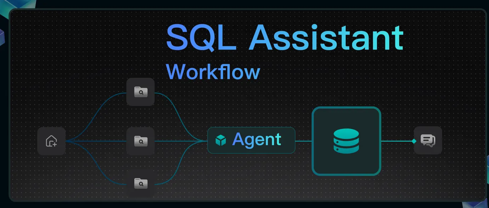

## Workflow overview

这篇文章演示如何在 RAGFlow 中搭建一个 SQL Assistant 工作流，让用户用自然语言查询 SQL 数据库。

目标用户不是只会写 SQL 的工程师，而是市场、产品、运营、教学场景里的非技术用户。他们提出业务问题后，系统负责检索数据库结构、字段含义和历史 SQL 示例，再让 Agent 生成 SQL，最后由 SQL Executor 执行查询并返回结果。

完成后的工作流大致如下：

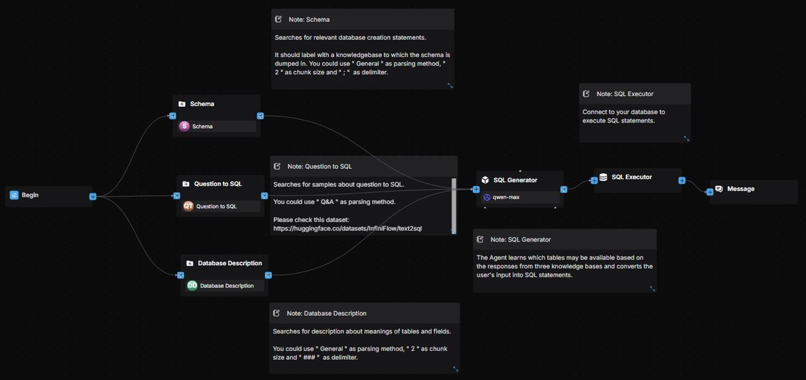

官方方案的核心数据流很简单：

1. 数据库 Schema、字段说明、问题到 SQL 的示例，分别放进三个知识库。
2. 用户输入自然语言问题。
3. 三个 Retrieval 组件并行检索相关上下文。
4. Agent 读取检索结果并生成 MySQL 查询语句。
5. ExeSQL 组件执行查询。
6. Message 组件把执行结果返回给用户。

这个设计的关键不是“多加几个 Agent”，而是把 Text-to-SQL 需要的上下文拆清楚：结构、语义、样例。数据结构对了，后面的 Prompt 才有东西可用。

## Procedure

### 1. Create three knowledge bases

#### 1.1 Prepare dataset files

示例数据集可以从 Hugging Face 下载：`InfiniFlow/text2sql`。

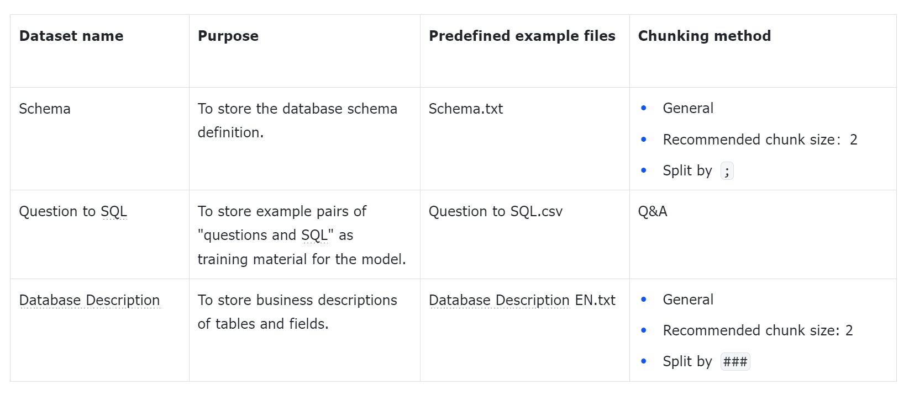

官方预置了三个文件，对应三个不同知识来源。

1. `Schema.txt`

这个文件保存数据库建表语句。示例片段如下：

```sql
CREATE TABLE `users` (
  `id` INT NOT NULL AUTO_INCREMENT,
  `username` VARCHAR(50) NOT NULL,
  `password` VARCHAR(50) NOT NULL,
  `email` VARCHAR(100),
  `mobile` VARCHAR(20),
  `create_time` TIMESTAMP NOT NULL DEFAULT CURRENT_TIMESTAMP,
  `update_time` TIMESTAMP NOT NULL DEFAULT CURRENT_TIMESTAMP ON UPDATE CURRENT_TIMESTAMP,
  PRIMARY KEY (`id`),
  UNIQUE KEY `uk_username` (`username`),
  UNIQUE KEY `uk_email` (`email`),
  UNIQUE KEY `uk_mobile` (`mobile`)
);
```

官方提醒：定义 schema 字段时要避免下划线等特殊字符，因为它们可能导致 LLM 生成 SQL 时出错。工程上这句话不能机械照搬到已有数据库。已有 schema 不能为了迎合模型随便改字段名，否则就是破坏用户空间。更实用的做法是补充字段说明、别名映射或 API 层封装。

2. `Question to SQL.csv`

这个文件保存自然语言问题和对应 SQL 的示例，用来给 Agent 提供 few-shot 参考。

```text
What are the names of all the Cities in Canada
SELECT geo_name, id FROM data_commons_public_data.cybersyn.geo_index WHERE iso_name ilike '%can%

What is average Fertility Rate measure of Canada in 2002 ?
SELECT variable_name, avg(value) as average_fertility_rate FROM data_commons_public_data.cybersyn.timeseries WHERE variable_name = 'Fertility Rate' and geo_id = 'country/CAN' and date >= '2002-01-01' and date < '2003-01-01' GROUP BY 1;

What 5 countries have the highest life expectancy ?
SELECT geo_name, value FROM data_commons_public_data.cybersyn.timeseries join data_commons_public_data.cybersyn.geo_index ON timeseries.geo_id = geo_index.id WHERE variable_name = 'Life Expectancy' and date = '2020-01-01' ORDER BY value desc limit 5;
```

3. `Database Description EN.txt`

这个文件保存表和字段的业务含义。示例片段如下：

```text
### Users Table (users)
The users table stores user information for the website or application. Below are the definitions of each column in this table:
- `id`: INTEGER, an auto-incrementing field that uniquely identifies each user (primary key).
- `username`: VARCHAR, stores the user’s login name.
- `password`: VARCHAR, holds the user’s password; for security, the value must be encrypted before persistence.
- `email`: VARCHAR, stores the user’s e-mail address.
- `mobile`: VARCHAR, stores the user’s mobile phone number.
- `create_time`: TIMESTAMP, records when the user account was created.
- `update_time`: TIMESTAMP, records the last update timestamp.
```

这三个文件不要混成一个大知识库。Schema 是结构，Question-to-SQL 是示例，Description 是语义说明。混在一起会让检索边界变差，也让后续排错变困难。

#### 1.2 Create knowledge bases in RAGFlow

**Schema knowledge base**

创建名为 `Schema` 的知识库，上传 `Schema.txt`。

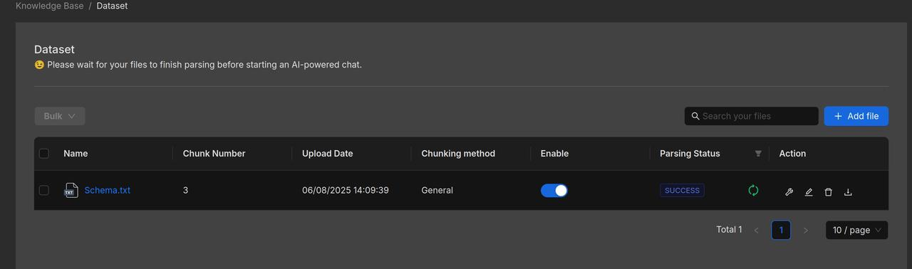

数据库表长短不同，每张表用分号 `;` 结束。示例结构如下：

```sql
CREATE TABLE `users` (
  `id` INT NOT NULL AUTO_INCREMENT,
  `username` VARCHAR(50) NOT NULL,
  `password` VARCHAR(50) NOT NULL,
  ...
  UNIQUE KEY `uk_mobile` (`mobile`)
);

CREATE TABLE `products` (
  `id` INT NOT NULL AUTO_INCREMENT,
  `name` VARCHAR(100) NOT NULL,
  `description` TEXT,
  `price` DECIMAL(10, 2) NOT NULL,
  `stock` INT NOT NULL,
  ...
  FOREIGN KEY (`merchant_id`) REFERENCES `merchants` (`id`)
);

CREATE TABLE `merchants` (
  `id` INT NOT NULL AUTO_INCREMENT,
  `name` VARCHAR(100) NOT NULL,
  `description` TEXT,
  `email` VARCHAR(100),
  ...
  UNIQUE KEY `uk_mobile` (`mobile`)
);
```

为了让每张表独立成块，并避免重叠内容，官方配置如下：

- Chunking Method: `General`
- Chunk Size: `2 tokens`，用最小粒度配合分隔符做隔离
- Delimiter: `;`

RAGFlow 会按这个策略解析并生成 chunks。

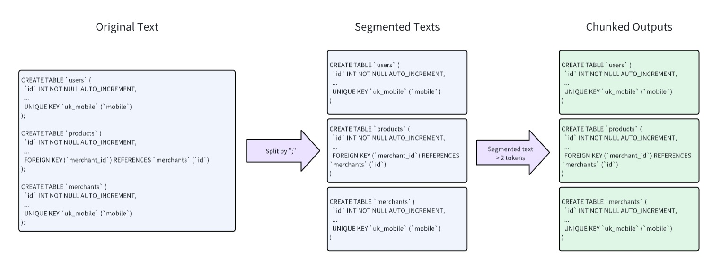

`Schema.txt` 解析预览如下：

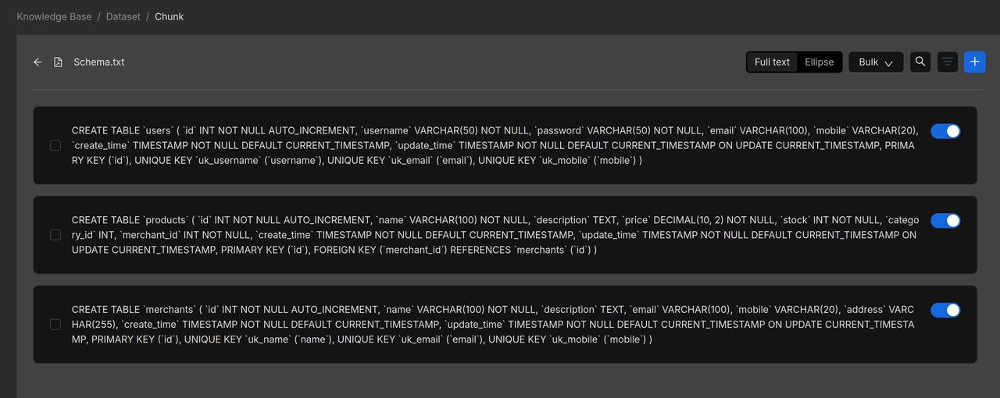

然后通过 retrieval testing 验证检索效果：

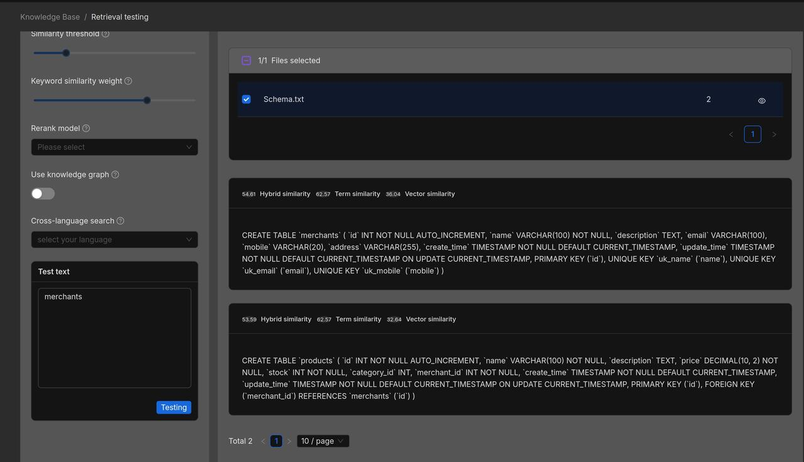

**Question to SQL knowledge base**

创建名为 `Question to SQL` 的知识库，上传 `Question to SQL.csv`。

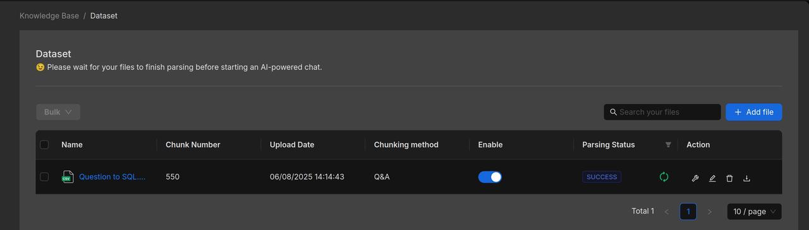

切分方法选择 `Q&A`，然后解析 CSV 并预览结果。

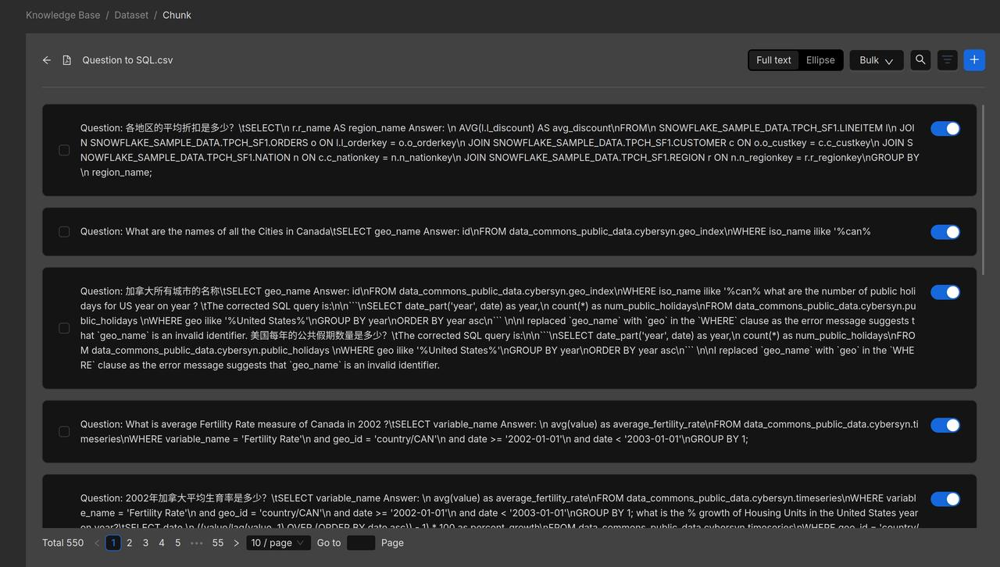

继续用 retrieval testing 验证检索效果：

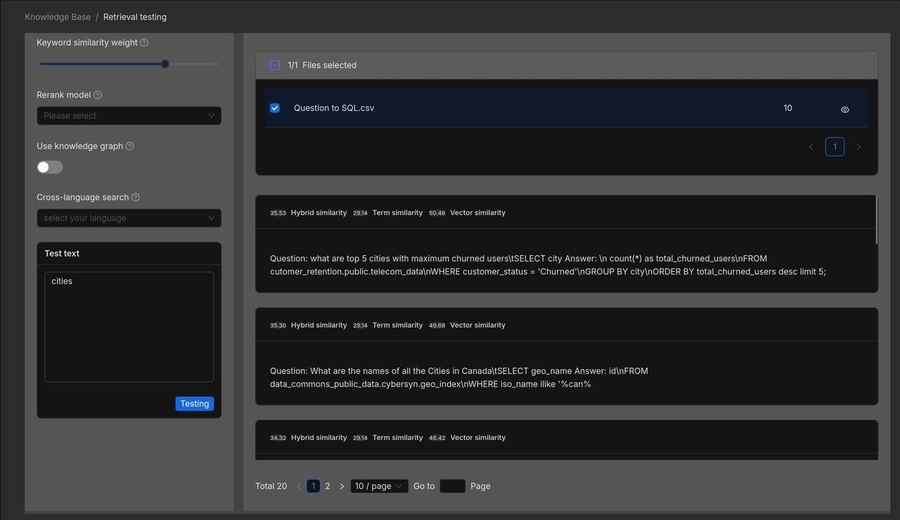

**Database Description knowledge base**

创建名为 `Database Description` 的知识库，上传 `Database_Description_EN.txt`。

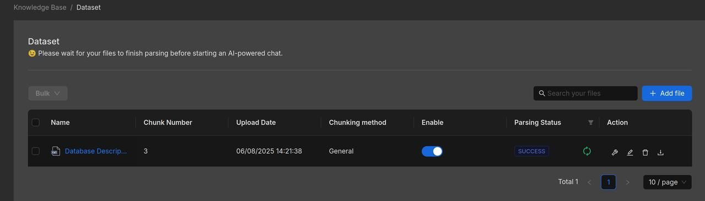

配置基本沿用 Schema 知识库：

- Chunking Method: `General`
- Chunk Size: `2 tokens`
- Delimiter: `###`

注意：原文这里写成 `Delimiter: Semicolon ###`，从上下文看真正起分隔作用的是 `###`，因为描述文件按 `### Users Table` 这种标题分段。

解析预览如下：

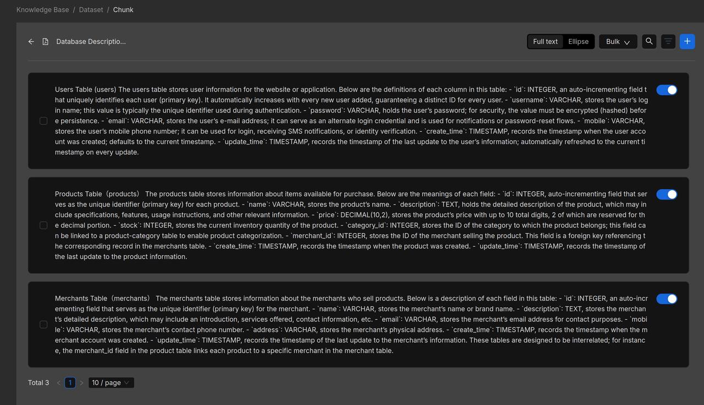

检索测试如下：

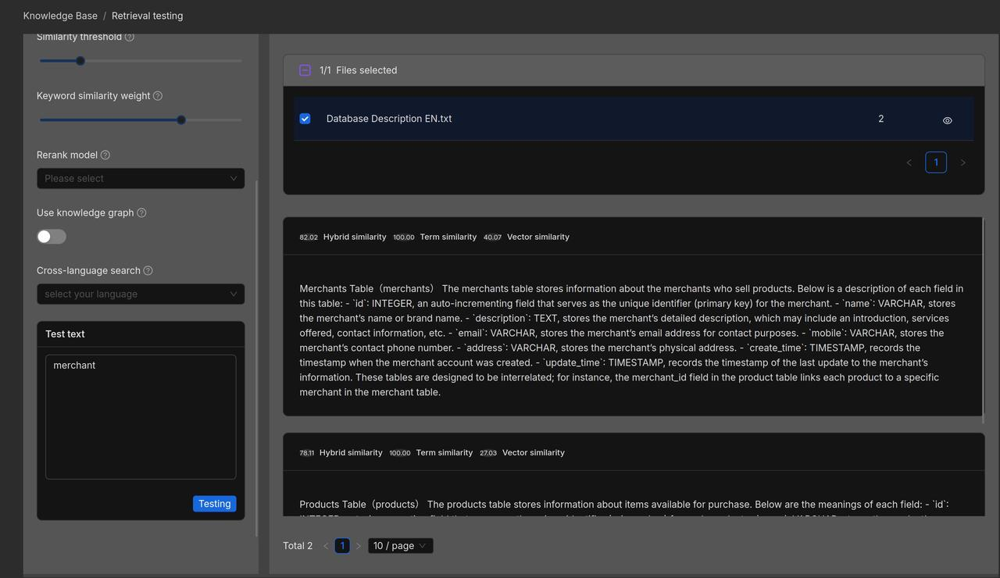

官方特别强调：三个知识库分开维护、分开查询，最后由 Agent 汇总所有来源后再输出。

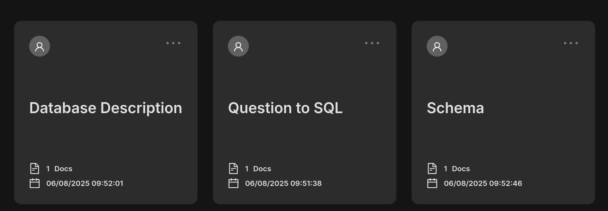

这个拆法是对的。Text-to-SQL 的坏味道通常来自“一个大 Prompt 包打天下”：schema、字段解释、样例、业务规则全塞一起，检索出来一坨上下文，模型只能猜。分库之后，每类上下文都有明确职责。

## 2. Orchestrate the workflow

### 2.1 Create a workflow application

创建 workflow 应用后，画布上会自动出现 `Begin` 组件。


可以在 Begin 组件里配置欢迎语，例如：

```text
Hi! I'm your SQL assistant, what can I do for you?
```

### 2.2 Configure three Retrieval components

在 Begin 组件之后添加三个并行 Retrieval 组件，名称分别对应前面创建的三个知识库：

- `Schema`
- `Question to SQL`
- `Database Description`

每个 Retrieval 组件的配置规则：

1. Query variable: `sys.query`
2. Knowledge base selection: 选择与当前组件同名的知识库

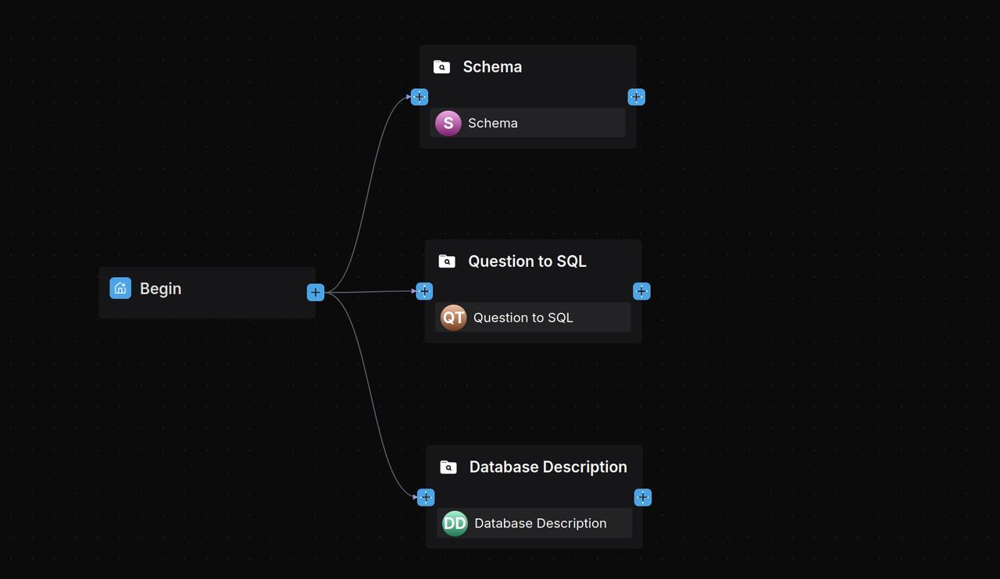

这里并行检索是合理的。用户问题只有一个，但需要从三类上下文里各自找证据。不要把这个逻辑塞进一个 Agent 里让模型自己决定查什么。模型不是调度器，workflow 才是调度器。

### 2.3 Configure the Agent component

在三个 Retrieval 组件之后添加名为 `SQL Generator` 的 Agent，并把三个 Retrieval 都连接到它。

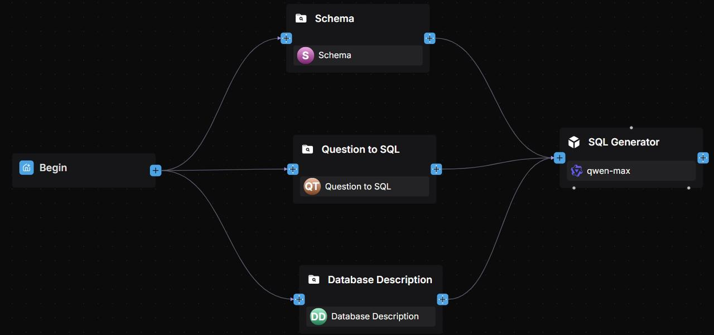

System Prompt 如下。这里保留英文原文，因为这是可直接复用的执行契约：

```text
### ROLE
You are a Text-to-SQL assistant.
Given a relational database schema and a natural-language request, you must produce a **single, syntactically-correct MySQL query** that answers the request.
Return **nothing except the SQL statement itself**—no code fences, no commentary, no explanations, no comments, no trailing semicolon if not required.

### EXAMPLES
-- Example 1
User: List every product name and its unit price.
SQL:
SELECT name, unit_price FROM Products;

-- Example 2
User: Show the names and emails of customers who placed orders in January 2025.
SQL:
SELECT DISTINCT c.name, c.email
FROM Customers c
JOIN Orders o ON o.customer_id = c.id
WHERE o.order_date BETWEEN '2025-01-01' AND '2025-01-31';

-- Example 3
User: How many orders have a status of "Completed" for each month in 2024?
SQL:
SELECT DATE_FORMAT(order_date, '%Y-%m') AS month,
       COUNT(*) AS completed_orders
FROM Orders
WHERE status = 'Completed'
  AND YEAR(order_date) = 2024
GROUP BY month
ORDER BY month;

-- Example 4
User: Which products generated at least $10 000 in total revenue?
SQL:
SELECT p.id, p.name, SUM(oi.quantity * oi.unit_price) AS revenue
FROM Products p
JOIN OrderItems oi ON oi.product_id = p.id
GROUP BY p.id, p.name
HAVING revenue >= 10000
ORDER BY revenue DESC;

### OUTPUT GUIDELINES
1. Think through the schema and the request.
2. Write **only** the final MySQL query.
3. Do **not** wrap the query in back-ticks or markdown fences.
4. Do **not** add explanations, comments, or additional text—just the SQL.
```

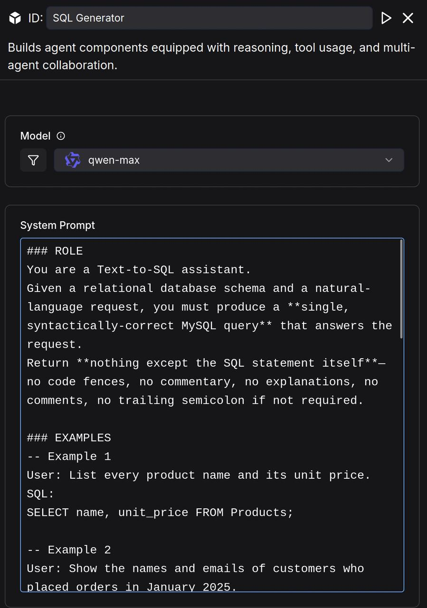

User Prompt 如下：

```text
User's query: /(Begin Input) sys.query
Schema: /(Schema) formalized_content
Samples about question to SQL: /(Question to SQL) formalized_content
Description about meanings of tables and files: /(Database Description) formalized_content
```

插入变量后，配置效果如下：

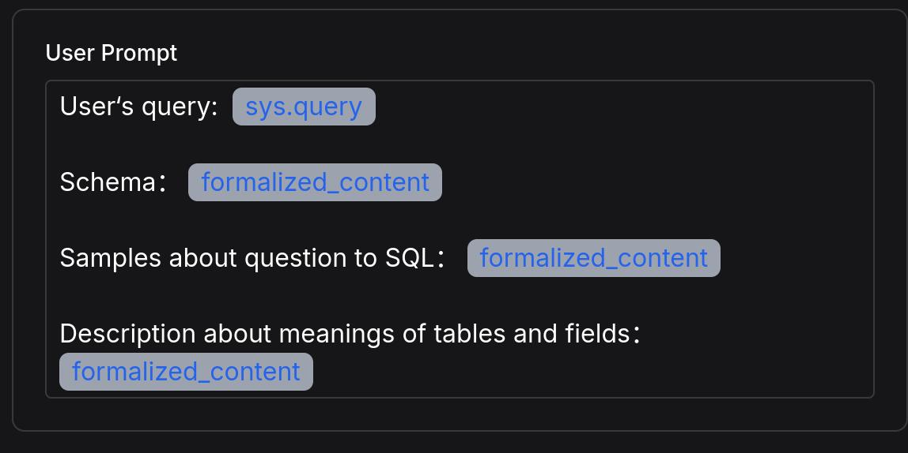

这个 Prompt 的核心是限制输出面：只返回 SQL，不要解释、不要 Markdown、不要注释。后面要把结果交给 ExeSQL 执行，任何多余文本都会变成运行时垃圾。

### 2.4 Configure the ExeSQL component

在 SQL Generator 后追加一个名为 `SQL Executor` 的 ExeSQL 组件。

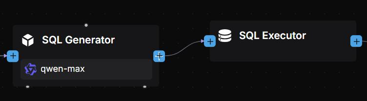

配置数据库连接，并指定 Query 输入来自 SQL Generator 的输出。

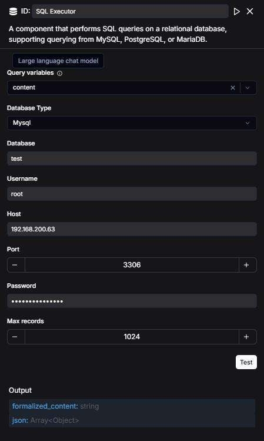

这一步是整条链路风险最高的地方。让模型生成 SQL，再直接执行，本质上是在把非确定性输出接到数据库执行器上。学习可以这么做，生产不能裸奔。

最低限度要考虑：

- 只读数据库账号；
- 禁止 `INSERT`、`UPDATE`、`DELETE`、`DROP` 等写操作；
- 查询超时和结果行数限制；
- SQL 语法校验和 allowlist；
- 对敏感表、敏感字段做权限控制；
- 记录用户问题、生成 SQL、执行结果和错误日志，便于审计。

### 2.5 Configure the Message component

在 SQL Executor 后追加 Message 组件。

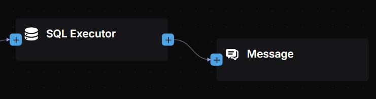

在 Messages 字段里插入 SQL Executor 的输出变量 `formalized_content`，让最终回复展示查询结果。

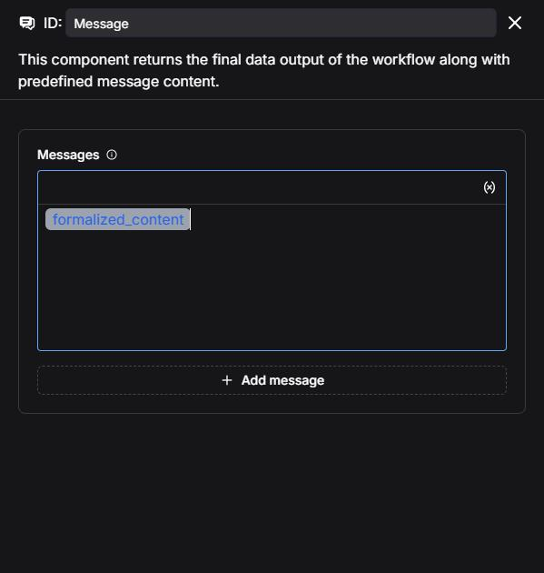

这一步不要让 Agent 再“润色”结果。SQL 已经执行完了，Message 只应该把结构化结果交出去。多一层 LLM 改写，只会增加误读和幻觉。

### 2.6 Save and test

测试流程：

1. 点击 `Save`。
2. 点击 `Run`。
3. 输入一个自然语言问题。
4. 查看执行结果。

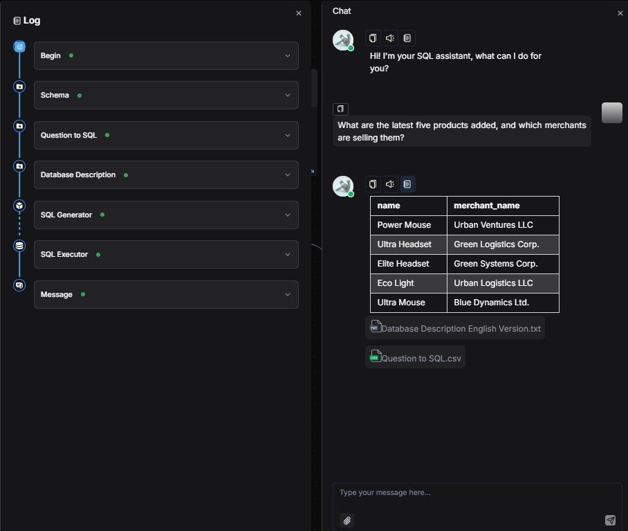

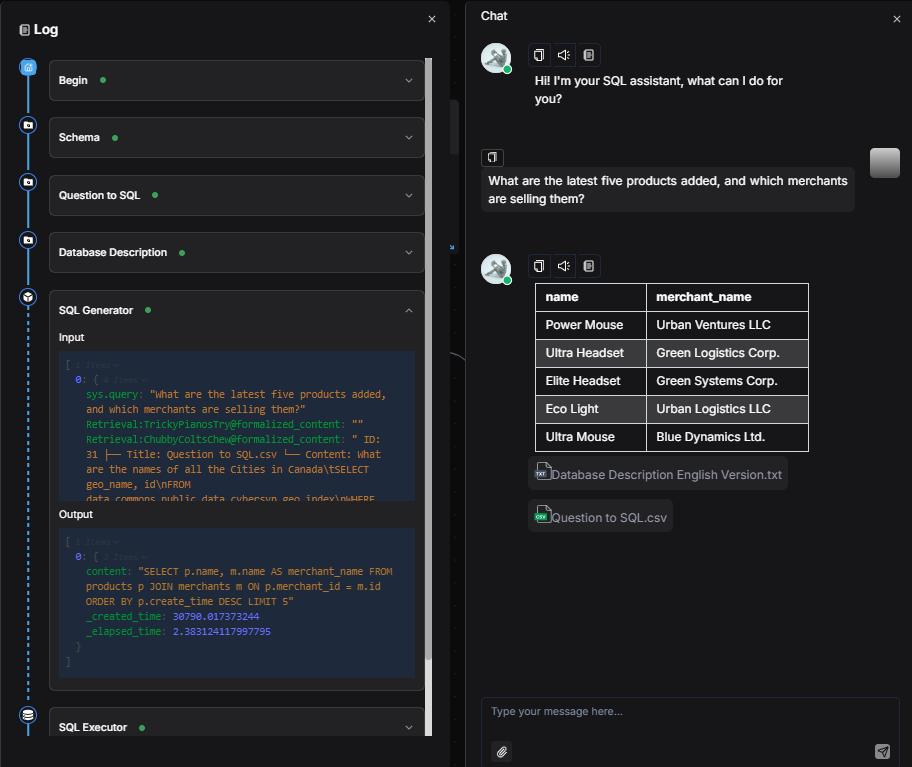

## Finale

官方最后给了一个很现实的判断：像 Copilot 一类 NL2SQL 技术一样，这种方案无法做到完全准确。

对于结构化数据的标准化处理，官方建议把操作收敛到特定 API，再把 API 封装成 RAGFlow 可用的 MCP。后续博客会继续演示这种做法。

这句话比教程本身更重要。NL2SQL 能当探索工具，但不能直接当生产数据接口。真正稳定的系统，应该让模型选择受控能力，而不是让模型自由拼 SQL。

# 工程学习笔记

## 值得学的地方

1. **把上下文拆成三类知识库**
   - Schema 解决表结构问题。
   - Question-to-SQL 解决样例迁移问题。
   - Database Description 解决业务语义问题。
   - 三者分开检索，职责清楚，排错也清楚。

2. **Retrieval 并行，Agent 汇总**
   - 检索是确定性的流程编排，应该由 workflow 完成。
   - Agent 负责基于上下文生成 SQL，不负责决定知识库调度。

3. **SQL Generator 输出被强约束**
   - 只输出 SQL。
   - 不要 Markdown。
   - 不要解释。
   - 这是因为下游 ExeSQL 只需要机器可执行文本。

4. **最后承认 NL2SQL 不可能完全准确**
   - 官方没有把这个能力吹成“自动数据分析师”。
   - 它更适合辅助查询、教学、探索和受控场景。

## 明显风险

1. **直接执行模型生成 SQL 风险很大**
   - 必须用只读账号和权限隔离。
   - 必须拦截写操作和危险函数。
   - 必须限制执行时间和返回行数。

2. **Prompt 不能替代安全边界**
   - “只生成 SELECT”这种要求写在 Prompt 里不够。
   - 真正的约束必须在 SQL 解析、执行权限和数据库账号上实现。

3. **字段命名建议不能破坏已有系统**
   - 为了模型少犯错去改真实数据库字段，是错误方向。
   - 兼容已有 schema，补语义层和映射层，才是实用方案。

4. **没有评测就别谈可靠**
   - 至少要评估 SQL 语法正确率、执行成功率、结果正确率、敏感字段访问率和危险 SQL 拦截率。

## 后续复现实验的最小验收标准

1. 三个知识库能分别检索出正确上下文。
2. SQL Generator 对简单问题只输出 SQL，不输出解释。
3. ExeSQL 能执行只读查询并返回结果。
4. 对无关问题、越权字段、写操作请求有明确拒绝或拦截。
5. 生成 SQL、执行状态、错误信息可追踪。
6. 至少准备一组标准问题，记录预期 SQL 和实际 SQL 的差异。

真正的问题不是“能不能把自然语言变成 SQL”。那只是 demo。真正的问题是：生成的 SQL 是否可控、可审计、不会破坏数据。这个案例给了一个清晰起点，但生产化必须把权限、校验和评测补上。
