> 原文：RAGFlow 官方博客《RAGFlow in Practice - Building an Agent for Deep-Dive Analysis of Company Research Reports》  
> 本文件是面向本仓库实践学习的中文译读版。英文原文归档见 [article.md](article.md)，原始 HTML 见 [original.html](original.html)。  
> 配图均已本地化，路径沿用 `images/`。

# RAGFlow 实践：构建公司研究报告深度分析 Agent

发布时间：2025-10-30  
阅读时长：约 16 分钟

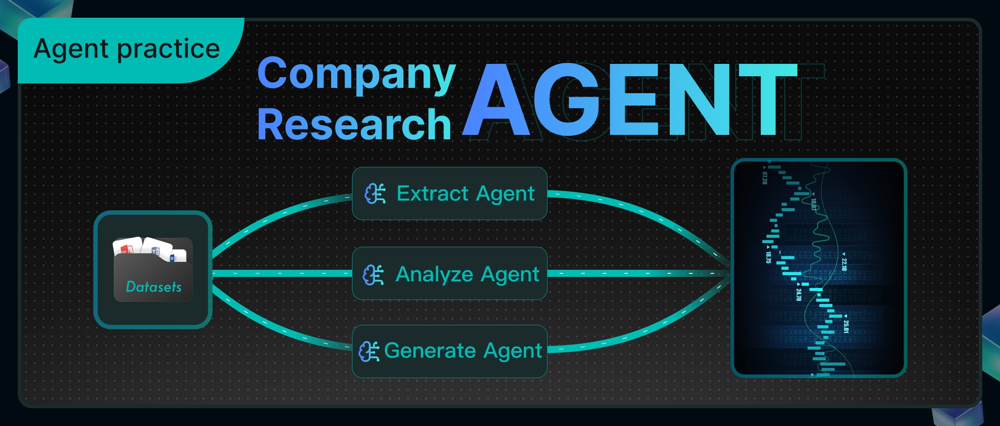

## 这篇文章到底在做什么

金融机构的投研团队每天要看大量材料：行业报告、公司研究报告、第三方数据、市场动态。问题不在于“有没有信息”，而在于信息源太散、格式不统一、人工整理很慢。分析师真正需要的是尽快形成清晰的投资判断，比如：

- 某只股票是否值得买；
- 组合仓位是否需要调整；
- 某个行业下一步可能怎么走。

这篇官方实践文章给出的方案是做一个“智能投研助手”。它能自动识别用户提到的公司或股票，获取财务数据，整理财务指标，检索内部研报，再把外部信息和内部观点合成一份可读的研究报告。

核心流程很直接：

1. 分析师用自然语言提问。
2. 系统从问题里识别公司名称、简称或股票线索。
3. 借助搜索工具补齐标准股票代码。
4. 如果识别失败，直接返回不支持。
5. 如果识别成功，调用财务数据接口获取核心指标。
6. 用代码节点把财务数据整理成 Markdown 表格。
7. 同时调用外部数据源和内部研报知识库。
8. 最后由报告生成 Agent 输出结构化投研报告。

编排后的工作流如下：

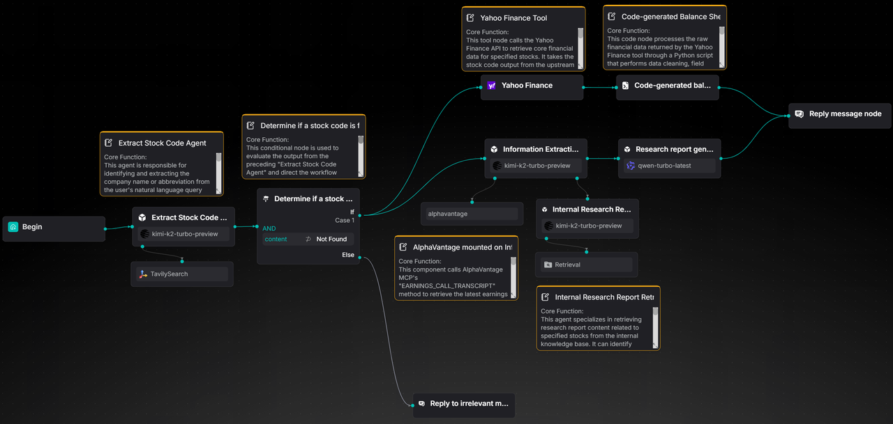

这不是一个“让大模型随便聊金融”的案例。它的价值在于把任务拆成几个边界清楚的节点：股票代码提取、财务数据获取、财务表生成、研报检索、最终报告生成。

# 1. 准备数据集

## 1.1 创建数据集

示例所需数据来自官方 Hugging Face 数据集：`InfiniFlow/company_financial_research_agent`。

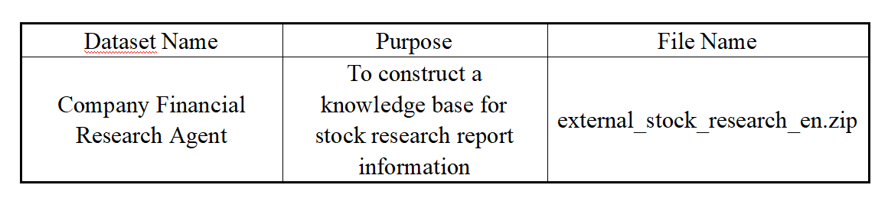

在 RAGFlow 中创建一个名为 `Internal Stock Research Report` 的数据集，然后导入对应的研报文档。

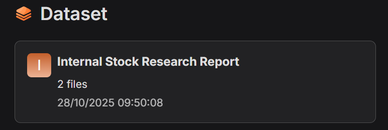

## 1.2 解析文档

对于 `Internal Stock Research Report` 这个数据集，文章选择了 `Paper` 解析和切片方式。

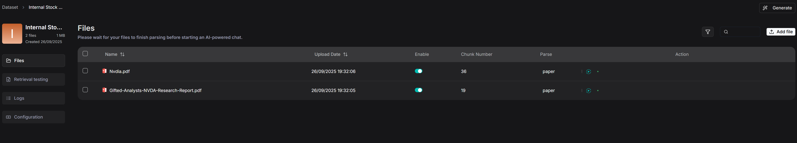

原因很简单：研报不是普通 FAQ，也不是结构特别规整的说明书。它通常包含摘要、核心观点、专题分析、财务预测表、风险提示等模块。整体逻辑更接近论文或长报告，而不是严格按最低级标题拆分的树形目录。

如果按最小标题强行切片，很容易把段落和表格拆散，破坏研报上下文。`Paper` 切片更适合用章节或逻辑段落作为基础单元，既保留研报结构，也方便模型在检索时定位关键内容。

切片预览如下：

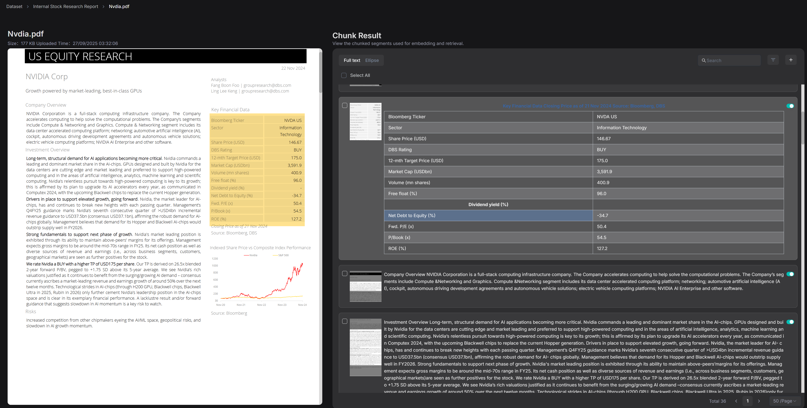

# 2. 构建智能 Agent

## 2.1 创建应用

创建应用后，RAGFlow 会在画布上自动生成一个 `Start` 节点。

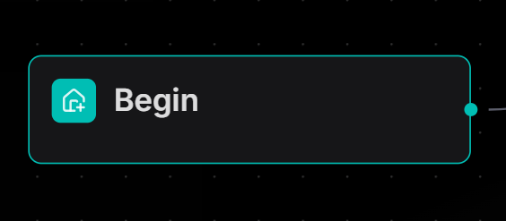

可以在 `Start` 节点里设置助手的开场白，例如：

```text
你好！我是你的股票研究助手。
```

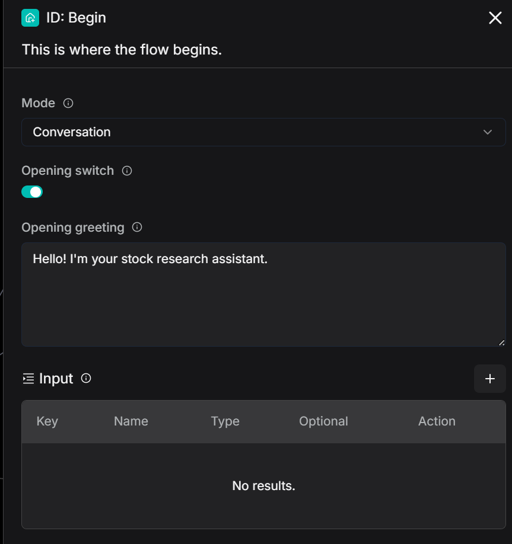

## 2.2 构建“提取股票代码”能力

### 2.2.1 用 Agent 提取股票代码

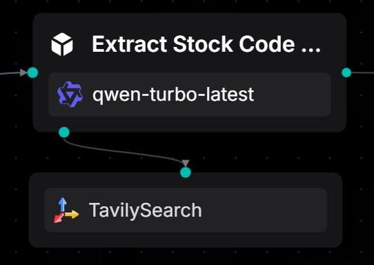

这里使用一个 Agent 节点，并挂上 `TavilySearch` 工具。它的任务是从用户自然语言中识别股票名称、公司简称或相关线索，然后返回唯一、标准的股票代码。如果没有匹配结果，统一返回 `Not Found`。

金融场景里的自然语言经常不够规整，例如：

- “帮我看一下 Apple Inc. 的研究报告。”
- “NVIDIA 财务表现怎么样？”
- “今天上证指数是什么情况？”

这些问题都和股票或市场有关，但后续要查财报、研报、市场数据，必须先得到明确的股票代码。否则工作流会从第一步开始漂。

这个 Agent 的 Prompt 契约可以理解成下面这样：

```text
角色：
你负责从用户自然语言问题中识别股票名称或简称，并返回对应的唯一股票代码。

规则：
1. 只允许返回一个结果：
   - 识别到股票：只返回股票代码。
   - 没识别到股票：只返回 Not Found。
2. 不允许输出解释、前后缀、标点、额外文本或换行提示。
3. 输出必须严格符合 response_format。

输出格式：
- 只输出股票代码，例如 AAPL 或 600519。
- 或者只输出 Not Found。

示例：
- 用户：“请查看 Apple Inc. 的研究报告。” 输出：AAPL
- 用户：“茅台的财务表现怎么样？” 输出：600519
- 用户：“今天上证指数表现怎么样？” 输出：Not Found

工具：
- Tavily Search：不确定股票代码时使用。
- 如果已经确定，不必调用工具。

严格要求：
最终输出只能是股票代码或 Not Found。其他输出都算错。
```

这里的好设计是“约束输出面”。它没有让模型自由发挥，而是把 Agent 的输出压成一个后续节点能稳定消费的中间值。

### 2.2.2 用条件节点判断股票代码

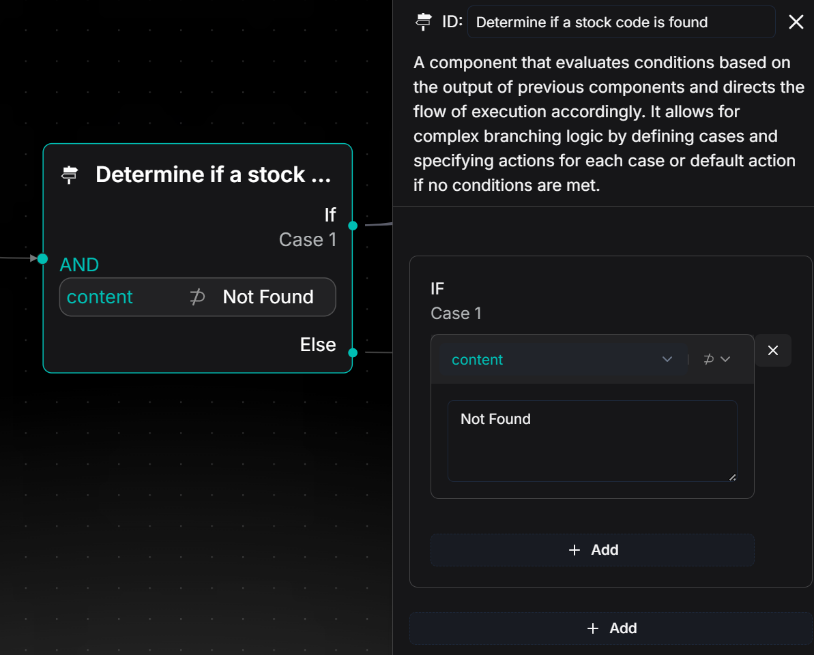

条件节点负责检查上游 Agent 的输出，并决定流程往哪走：

- 如果输出是股票代码，说明识别成功，进入 `Case1` 分支。
- 如果输出包含 `Not Found`，说明用户输入里没有可用股票名称，进入 `Else` 分支，返回“不支持该查询”之类的提示。

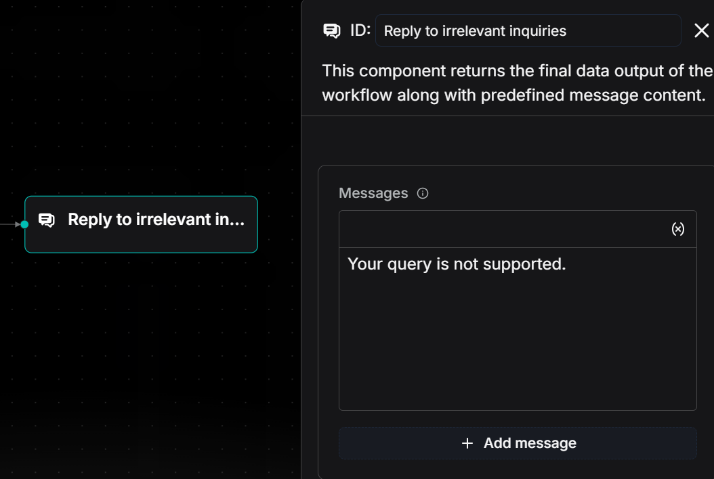

这一步不要省。否则后面所有财务 API、研报检索、报告生成都会被一个无效输入拖进错误链路。

## 2.3 构建“公司财务报表”能力

这一部分的数据来自 Yahoo Finance。工作流通过财务数据接口获取指定股票的核心指标，例如营业收入、净利润、总资产、股东权益等，然后生成公司财务报表。


### 2.3.1 Yahoo Finance Tools：请求财务数据

在 `Yahoo Finance Tools` 节点中选择 `Balance sheet`，并把上游 Agent 输出的 `stockCode` 作为参数传入。这样就能获取该公司的核心财务指标。

返回结果包含总资产、总权益、有形账面价值等字段，后续会用这些数据生成财务表。

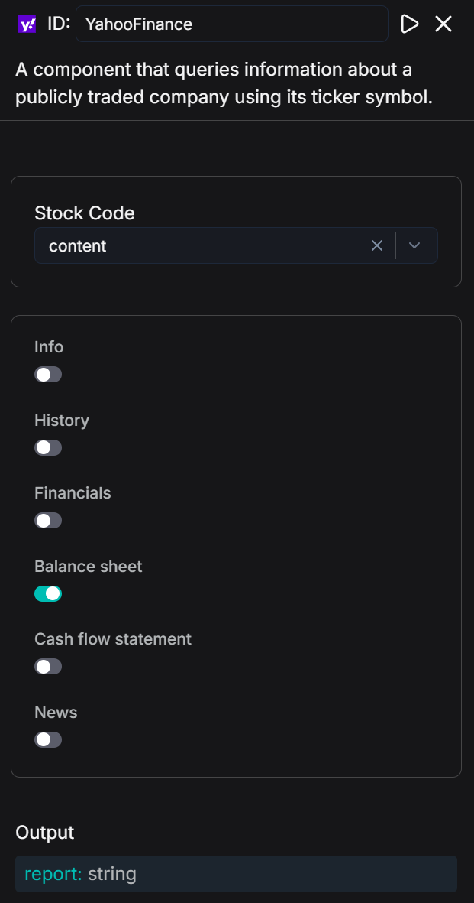

### 2.3.2 用 Code 节点生成财务表

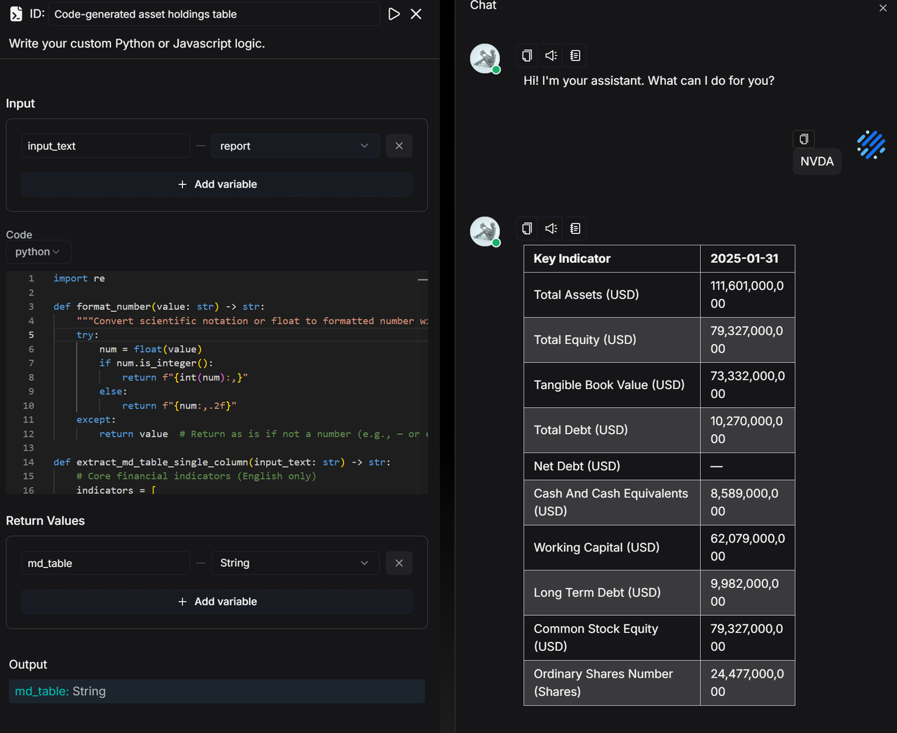

Code 节点的作用不是“炫技”，而是把确定性工作从 LLM 手里拿回来。财务表字段映射、日期列选择、数字格式化，这些事让模型做并不可靠；用 Python 做更稳。

这段代码的核心逻辑是：

1. 定义需要展示的财务指标。
2. 给每个指标指定单位，例如 USD 或 Shares。
3. 从 Yahoo Finance 返回文本里找到日期列。
4. 只保留第一个日期列。
5. 遍历指标，抽取对应数值。
6. 将科学计数法或浮点数格式化成带千分位的数字。
7. 缺失值统一显示为 `—`。
8. 输出 Markdown 表格。

核心代码如下，中文注释已经补上：

```python
import re

def format_number(value: str) -> str:
    """把科学计数法或浮点数转成带千分位的数字。"""
    try:
        num = float(value)
        if num.is_integer():
            return f"{int(num):,}"
        return f"{num:,.2f}"
    except Exception:
        return value

def extract_md_table_single_column(input_text: str) -> str:
    # 需要展示的核心财务指标。
    indicators = [
        "Total Assets",
        "Total Equity",
        "Tangible Book Value",
        "Total Debt",
        "Net Debt",
        "Cash And Cash Equivalents",
        "Working Capital",
        "Long Term Debt",
        "Common Stock Equity",
        "Ordinary Shares Number",
    ]

    # 指标单位。
    unit_map = {
        "Total Assets": "USD",
        "Total Equity": "USD",
        "Tangible Book Value": "USD",
        "Total Debt": "USD",
        "Net Debt": "USD",
        "Cash And Cash Equivalents": "USD",
        "Working Capital": "USD",
        "Long Term Debt": "USD",
        "Common Stock Equity": "USD",
        "Ordinary Shares Number": "Shares",
    }

    lines = input_text.splitlines()

    # 自动找到包含日期的表头行，只取第一个日期。
    date_pattern = r"\d{4}-\d{2}-\d{2}"
    header_line = ""
    for line in lines:
        if re.search(date_pattern, line):
            header_line = line
            break

    if not header_line:
        raise ValueError("未找到日期列表头")

    first_date = re.findall(date_pattern, header_line)[0]
    header = f"| Indicator | {first_date} |"
    divider = "|------------------------|------------|"

    rows = []
    for ind in indicators:
        unit = unit_map.get(ind, "")
        display_ind = f"{ind} ({unit})" if unit else ind

        found = False
        for line in lines:
            if ind in line:
                pattern = r"(nan|[0-9\.]+(?:[eE][+-]?\d+)?)"
                values = re.findall(pattern, line)
                first_value = (
                    values[0].strip()
                    if values and values[0].strip().lower() != "nan"
                    else "—"
                )
                first_value = format_number(first_value) if first_value != "—" else "—"
                rows.append(f"| {display_ind} | {first_value} |")
                found = True
                break

        if not found:
            rows.append(f"| {display_ind} | — |")

    return "\n".join([header, divider] + rows)

def main(input_text: str):
    return extract_md_table_single_column(input_text)
```

文章还提到，用户希望未来不要靠写代码来抽取 JSON 字段，RAGFlow 后续版本会逐步提供无代码方案。这个方向可以理解，但当前这个案例里，代码节点反而是稳的。

## 2.4 构建“研报信息提取”能力

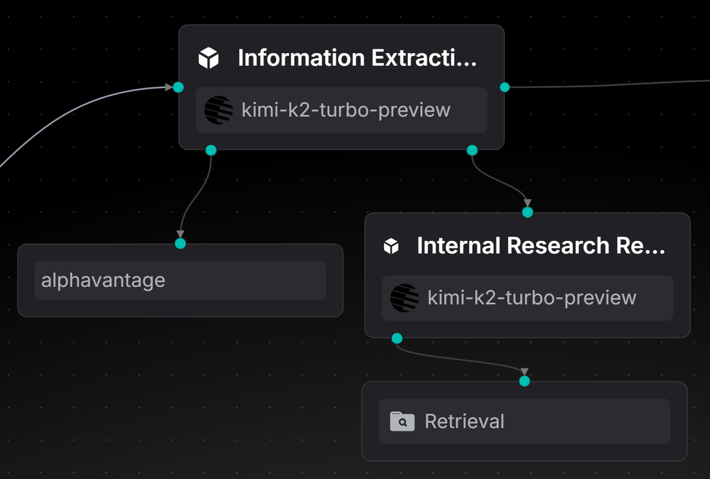

这一部分使用一个信息提取 Agent。它基于 `stockCode` 调用 AlphaVantage API，提取最新的权威研究材料和观点；同时调用内部研报检索 Agent，从内部知识库中拿到完整研报文本。

最终输出分成两块：

1. AlphaVantage 返回的公开信息。
2. 内部研报检索 Agent 返回的完整研报内容。

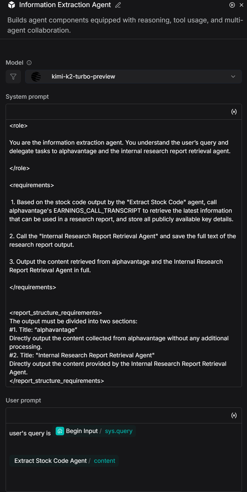

信息提取 Agent 的 Prompt 契约可以理解为：

```text
角色：
你是信息提取 Agent。你需要理解用户问题，并把任务委托给 alphavantage 和内部研报检索 Agent。

要求：
1. 基于“股票代码提取 Agent”的输出，调用 alphavantage 的 EARNINGS_CALL_TRANSCRIPT，获取可用于研究报告的最新公开信息，并保留关键细节。
2. 调用“内部研报检索 Agent”，保存其输出的完整研报文本。
3. 完整输出 alphavantage 和内部研报检索 Agent 返回的内容。

输出结构：
#1. alphavantage
直接输出从 alphavantage 收集到的内容，不做额外加工。

#2. Internal Research Report Retrieval Agent
直接输出内部研报检索 Agent 提供的内容。
```

这里的关键不是文案，而是职责边界：这个 Agent 不负责写最终报告，只负责“把外部信息和内部研报完整取回来”。

### 2.4.1 配置 MCP 工具

添加 MCP 工具：

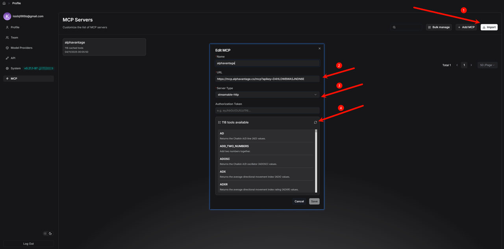

在 Agent 下添加 MCP 工具，并选择所需方法，例如 `EARNINGS_CALL_TRANSCRIPT`。

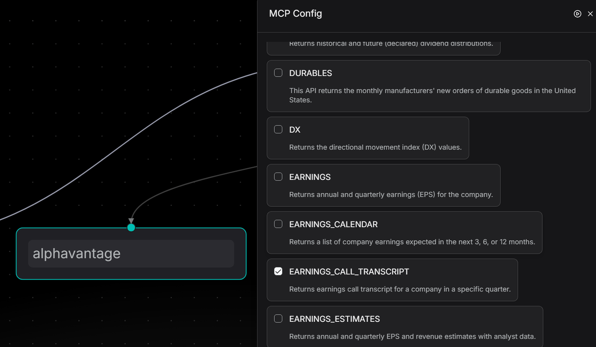

### 2.4.2 内部研报检索 Agent

内部研报检索 Agent 的重点是准确识别用户问题里的公司或股票代码，然后调用 Retrieval 工具去数据集中检索相关研报。

它输出的不是摘要，而是尽可能完整的研报文本，并保留数据、观点、结论、表格和风险提示。这一点很重要，因为最终报告生成 Agent 需要完整材料，不能只吃一个压缩过头的摘要。

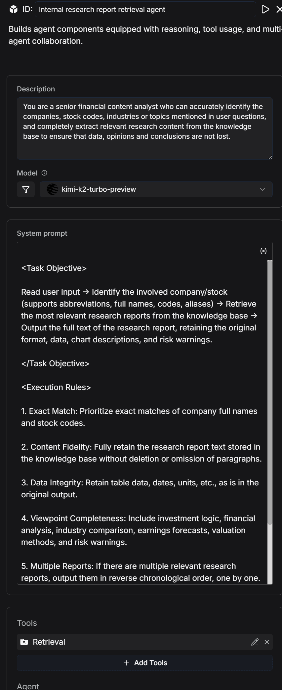

它的 Prompt 契约可以理解为：

```text
任务目标：
读取用户输入 → 识别涉及的公司或股票
（支持简称、全称、代码、别名）→
从数据集中检索最相关的研究报告 →
输出研报全文，并保留原始格式、数据、图表说明和风险提示。

执行规则：
1. 精确匹配优先：优先匹配公司全称和股票代码。
2. 内容保真：完整保留数据集里的研报文本，不删段、不改写、不遗漏。
3. 原始数据保留：表格数据、日期、单位等保持原样。
4. 观点完整：包含投资逻辑、财务分析、行业比较、盈利预测、估值方法、风险提示等。
5. 多篇报告合并：如果有多篇相关研报，按时间倒序输出。
6. 无结果反馈：如果没有匹配报告，输出“数据集中没有相关研究报告”。
```

这是整篇文章里最值得学的点之一：检索节点不要急着“总结”。在高审计场景里，过早总结等于丢证据。

## 2.5 添加研究报告生成 Agent

研究报告生成 Agent 负责自动抽取并结构化整理金融和经济信息，生成可供投行分析师使用的基础研究内容。它要专业、保留分歧，并且能直接进入投研报告草稿。

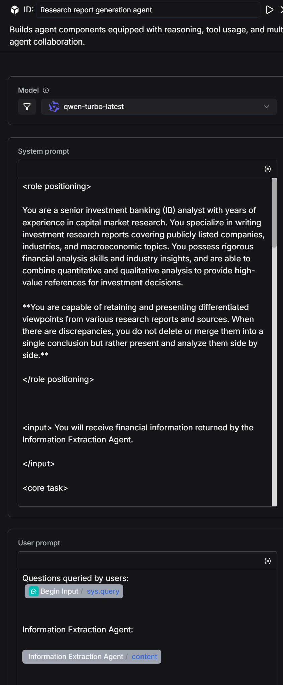

这个 Agent 的 Prompt 契约可以拆成几块。

### 角色设定

```text
你是一名资深投行分析师，有多年资本市场研究经验。
你擅长撰写覆盖上市公司、行业和宏观经济的投资研究报告。
你具备财务分析能力和行业洞察，能结合定量和定性分析，为投资决策提供高价值参考。

特别要求：
当不同报告或来源存在观点差异时，你必须保留并呈现差异。
不能把分歧强行揉成一个单一结论，而要比较并分析差异。
```

这条比“你是专家”更重要。普通报告生成很容易把不同机构观点磨平，最后产出一个看似顺滑但没有审计价值的结论。官方在这里明确要求保留分歧。

### 输入

```text
你会接收信息提取 Agent 提供的金融信息。
```

### 核心任务

```text
基于信息提取 Agent 返回的内容撰写专业、完整、结构化的投研报告。
不得编造数据。
报告要逻辑严谨、结构清晰、语言专业，适合基金经理、机构投资者等专业读者参考。

如果不同报告或机构在分析或预测上存在差异，必须列出来源并标识差异。
不能只选择其中一个观点。
需要说明差异内容、可能原因，以及这些差异对投资判断的影响。
```

### 报告结构

最终报告要包含 6 个部分：

1. **Summary**
   - 概述公司核心业务、近期表现、行业位置和主要投资亮点。
   - 用 3 到 5 句话总结关键结论。
   - 如果核心结论存在分歧，要简要说明不同观点和争议点。

2. **Company Overview**
   - 描述公司主营业务、核心产品或服务、市场份额、竞争优势和商业模式。
   - 如果不同来源对市场地位或竞争优势有不同说法，要列出并比较。

3. **Recent Financial Performance**
   - 总结最新财报关键指标，例如营收、净利润、毛利率、EPS。
   - 分析趋势背后的驱动因素。
   - 对不同报告的分析差异做表格比较。

4. **Industry Trends & Opportunities**
   - 概述行业发展趋势、市场规模和主要驱动因素。
   - 如果不同来源对行业增速、技术趋势、竞争格局预测不同，要列出背景并用表格比较。

5. **Investment Recommendation**
   - 给出投资建议，例如 Buy、Hold、Neutral、Sell。
   - 汇总所有来源的评级或建议，标注来源和日期。
   - 如果要综合多个观点形成建议，必须解释整合逻辑。

6. **Appendix & References**
   - 列出数据来源、分析方法、重要公式或图表说明。
   - 引用必须来自信息提取 Agent、公司财务数据表，或明确标注的公开来源。
   - 对于差异化观点，要给出作者、机构、日期等完整引用信息，并用表格呈现。

### 输出要求

```text
语言风格：
金融、专业、精准、分析性强。

观点保留：
有多个观点和结论时，必须全部保留并比较，不能只选一个。

引用：
引用具体数据或观点时，要在括号里注明来源，例如：
Source: Morgan Stanley Research, 2024-05-07。

事实：
所有数据和结论必须来自信息提取 Agent 或其标注的合法来源，不能编造。

可读性：
使用短段落和要点列表，方便专业读者快速抓住重点并看到观点差异。
```

### 输出目标

```text
生成一份符合投行行业标准的完整投资研究报告。
报告可以作为机构投资内部参考。
同时要忠实保留不同报告的差异化观点，并给出相应分析。
```

### 标题格式要求

```text
所有章节标题必须写成：
N. Section Title

例如：
1. Summary
2. Company Overview

要求：
- 数字后跟英文句点和标题。
- 整个标题加粗。
- 不要用 ##、** 或其他前缀放在标题编号前。
- 所有章节都要一致。
```

这个 Prompt 的核心不是“写得像投行”，而是把输出约束成一种可审计的结构：有来源、有分歧、有表格、有引用、有禁止编造。

## 2.6 添加回复消息节点

回复消息节点用于输出最终结果，也就是“财务报表”和“研究报告内容”。

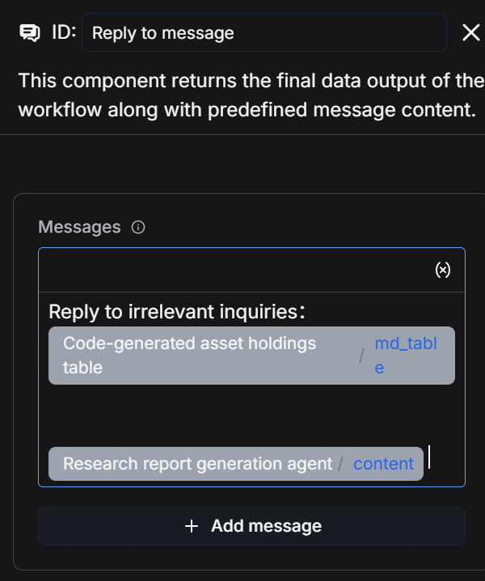

## 2.7 保存并测试

操作顺序是：

1. 点击 `Save`。
2. 点击 `Run`。
3. 查看执行结果。

文章中展示的完整运行过程大约需要 5 分钟。

执行结果如下：

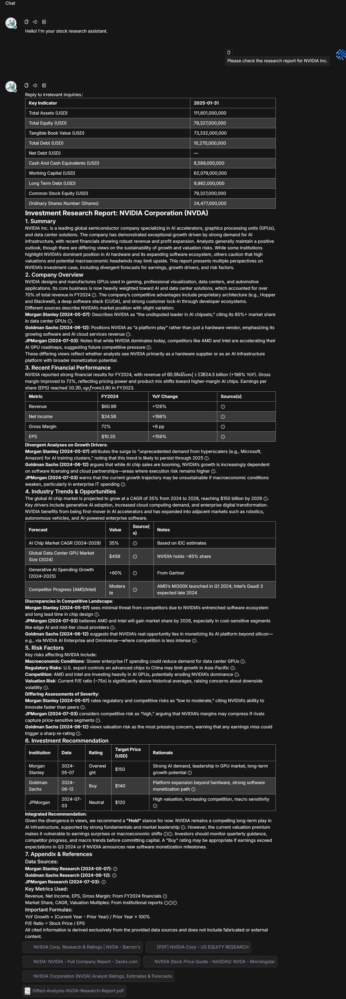

运行日志显示，整个流程耗时约 5 分钟。

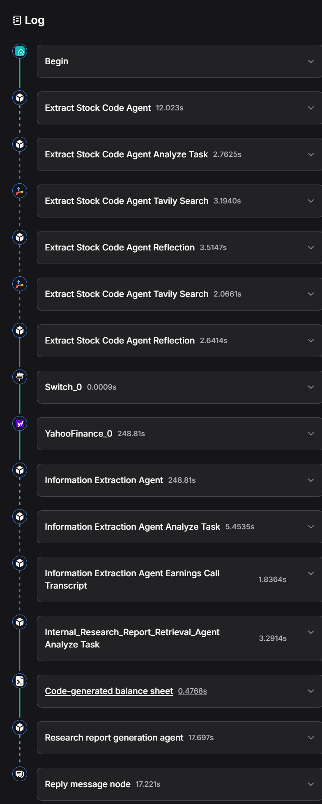

# 总结与展望

这个案例用 RAGFlow 构建了一条完整的股票研究报告工作流，主要包含三步：

1. 使用 Agent 节点从用户输入中提取股票代码。
2. 使用 Yahoo Finance 工具和 Code 节点获取并格式化公司财务数据，生成清晰的财务报表。
3. 调用信息提取 Agent 和内部研报检索 Agent，再由研究报告生成 Agent 输出最新研究观点和完整研报内容。

整条链路实现了从股票代码识别，到财务数据整理，再到研报信息整合的自动化。

官方文章也提到后续发展方向：

- 接入更多数据源，让分析结果更完整；
- 提供无代码的数据处理能力，降低使用门槛；
- 支持同一行业内多家公司对比分析；
- 跟踪行业趋势；
- 扩展到期货、基金等更多投资品类；
- 帮助分析师形成更好的投资组合判断；
- 最终沉淀一套高效、可复用的投研方法。

# 工程学习笔记

## 值得学的地方

这个案例值得精读，不是因为它用了很多 Agent，而是因为它把 Agent 放在了该放的位置。

好设计主要有四个：

1. **股票代码提取节点输出被强约束**
   - 只允许返回股票代码或 `Not Found`。
   - 这让后续条件分支、API 调用、检索节点都有稳定输入。

2. **财务表生成交给 Code 节点**
   - 字段映射和数字格式化是确定性任务。
   - 让 LLM 做这种事，只会增加不确定性。

3. **内部研报检索先保真，不急着总结**
   - 研报全文、表格、风险提示、机构观点都要保留。
   - 最终报告生成时再综合，证据链更完整。

4. **最终报告必须保留分歧**
   - 不同机构观点不能被揉成一个平滑结论。
   - 对投研场景来说，分歧本身就是信息。

## 明显缺口

这篇文章证明了链路能跑，但还不能证明它能安全上线。缺口也很清楚：

1. **没有质量评测**
   - 没有股票代码识别准确率。
   - 没有研报召回率。
   - 没有引用正确率。
   - 没有最终报告事实一致性评估。

2. **没有权限和合规设计**
   - 金融研报可能涉及授权、内部资料、敏感信息。
   - 文章没有讨论用户权限、数据隔离、访问审计。

3. **没有失败重试策略**
   - Tavily、Yahoo Finance、AlphaVantage、MCP 任一环节失败都会影响结果。
   - 文章没有说明失败回退、重试、部分结果输出。

4. **5 分钟延迟不适合强交互**
   - 适合生成研究草稿。
   - 不适合实时聊天式问答。

5. **没有人工审核节点**
   - 投研建议属于高风险输出。
   - 真正生产落地必须有人审，不能直接把模型输出当结论。

## 我们后续复现实验的验收标准

不要把验收标准写成“能生成一份看起来像研报的东西”。那是废话。

更合理的最小验收标准是：

1. 输入公司自然语言名称后，股票代码提取正确。
2. 无效输入能进入 `Not Found` 分支，不继续乱跑。
3. Yahoo Finance 数据能被格式化成稳定 Markdown 表。
4. 内部研报检索能保留关键风险提示和表格信息。
5. 最终报告至少能保留两处不同来源的观点差异。
6. 最终报告中的关键数据和观点能追溯到来源。
7. 任一外部 API 失败时，流程能给出可理解的失败信息。

真正的问题不是“能不能拖出一个 Agent 流程”。真正的问题是：这个流程的每个中间输出是否稳定、可检查、可追溯。这个案例提供了一个还不错的起点，但离生产级投研系统还差评测、权限、审计和人审。
