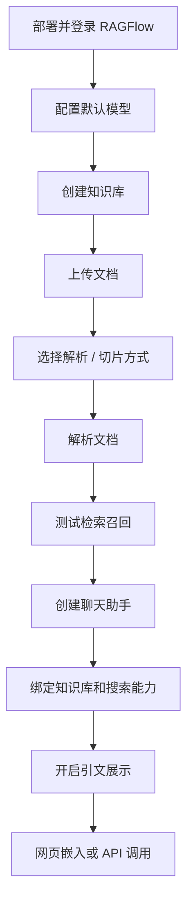
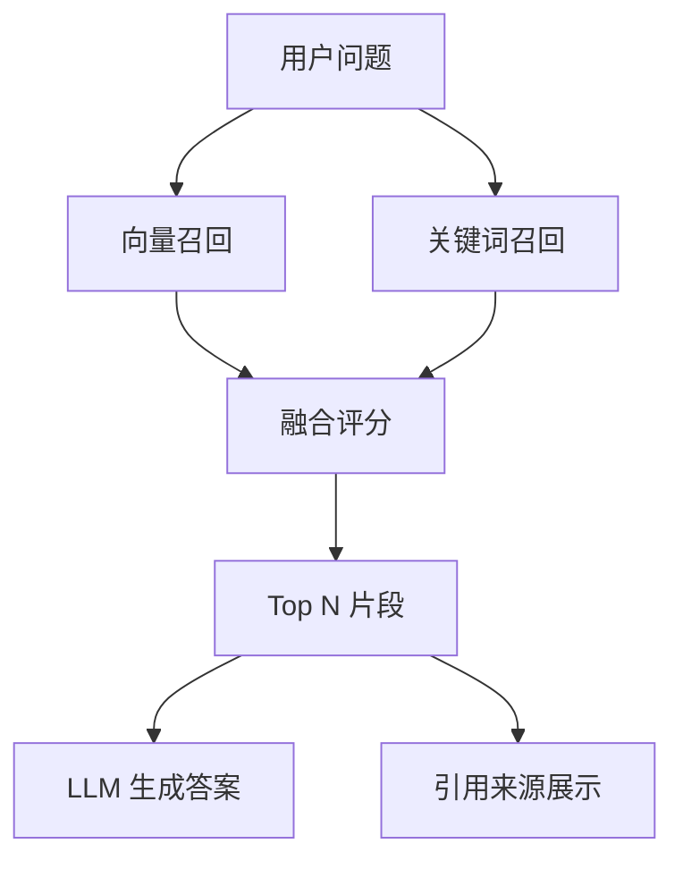
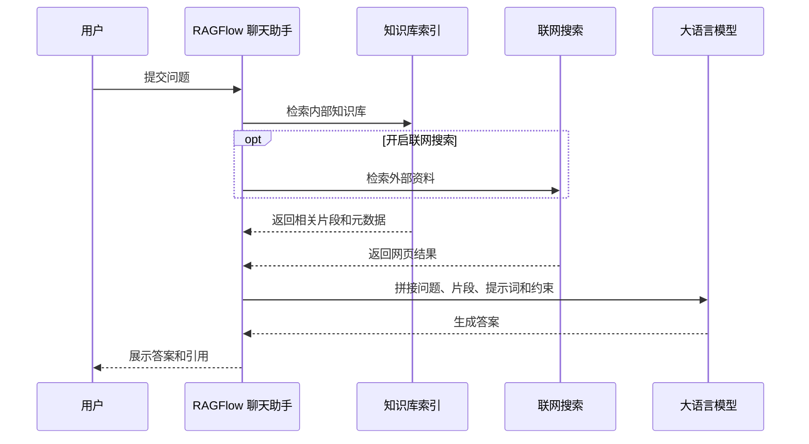

# 零基础教程：RAGFlow 快速创建知识库和智能问答系统

日期：2026-05-12

来源视频：[零基础教程：RAGFlow快速创建知识库和智能问答系统 #dify #aigc #ragflow #graphrag](https://www.youtube.com/watch?v=bBaRtI9yUKE)

频道：科技标签 Appmark

发布时间：2025-04-25

时长：00:11:35

本地素材：

- 视频：`local-media/youtube/2026-05-12-ragflow-bbarti9yuke/零基础教程：RAGFlow快速创建知识库和智能问答系统 #dify #aigc #ragflow #graphrag [bBaRtI9yUKE].quicktime.mp4`
- 字幕：`local-media/youtube/2026-05-12-ragflow-bbarti9yuke/零基础教程：RAGFlow快速创建知识库和智能问答系统 #dify #aigc #ragflow #graphrag [bBaRtI9yUKE].quicktime.zh.srt`
- 字幕说明：资产清单标记为 `YouTube subtitle or automatic caption`，不是本地 ASR。
- 元数据：`local-media/youtube/2026-05-12-ragflow-bbarti9yuke/零基础教程：RAGFlow快速创建知识库和智能问答系统 #dify #aigc #ragflow #graphrag [bBaRtI9yUKE].quicktime.info.json`
- 关键画面抽帧：`local-media/youtube/2026-05-12-ragflow-bbarti9yuke/frames/`
- 关键画面拼图：`local-media/youtube/2026-05-12-ragflow-bbarti9yuke/frames/contact-keyframes.jpg`
- 评论原始数据：`local-media/youtube/2026-05-12-ragflow-bbarti9yuke/comments.json`
- 评论摘要素材：`local-media/youtube/2026-05-12-ragflow-bbarti9yuke/comments-digest.md`

说明：`local-media/` 是本地沉淀目录，不应提交进 Git。

## 配套资源 / 代码地址

- 视频：<https://www.youtube.com/watch?v=bBaRtI9yUKE>
- 配套文章：<https://appscross.com/blog/ragflow-quickly-builds-a-knowledge-base-and-qa-assistant.html>
- 部署参考：<https://appscross.com/blog/deploy-ragflow-from-source-code-on-wsl.html>
- RAGFlow GitHub：<https://github.com/infiniflow/ragflow>
- RAGFlow v0.25.2 release：<https://github.com/infiniflow/ragflow/releases/tag/v0.25.2>
- 具体代码仓库：视频简介/元数据中未发现该教程专用代码仓库地址。

## 评论区补充

评论区只有 1 条有效信息：有观众反馈从 `0.17` 版本开始，模型设置里设置 token 最大值的功能被移除。这个评论不是官方说明，只能作为版本差异提醒。真正要落地配置时，还是要按当前 RAGFlow 文档和实际部署版本核对。

## Fieldbook 归档判断

- 内容类型：工具观察
- 当前归档：`20-资料笔记/`
- 是否值得升级为 lab：暂不升级
- 判断理由：视频本身是产品上手演示，重点是“怎样在 RAGFlow 里创建知识库和问答助手”，不是一个可验证的 API、SDK 或失败模式。它适合做入口笔记。真正值得升级为 lab 的，是后续验证不同 chunking 策略、DeepDoc 解析效果、hybrid retrieval、rerank 成本、引用准确性和权限隔离。
- 后续应进入：后续如果做企业知识库方案评估，应沉淀到 `40-问题研究/use-cases/`；如果做最小复现实验，再进入 `50-实验验证/`。

## 一句话结论

这个视频说明了 RAGFlow 的最短上手路径：先配模型，再建知识库、上传文档、解析切片、测试召回，最后把知识库绑定到聊天助手并开启引用。它对新手有用，但企业落地不能停在“能问答”：权限、数据治理、评估集、引用可追溯、版本差异和 API 兼容才是硬边界。

## 视频时间轴

| 时间 | 主题 | 要点 |
|---|---|---|
| 00:00 | 引入 RAGFlow | 和 Dify 类产品对比，定位为更偏知识库/RAG 的平台；演示环境是私有化部署。 |
| 00:45 | 登录与语言设置 | 进入 RAGFlow 前端，切换简体中文；视频中默认访问 `localhost:9222`。 |
| 01:10 | 创建知识库 | 新建名为 `fin1` 的知识库，随后进入模型配置。 |
| 01:35 | 配置默认模型 | 添加硅基流动、OpenRouter 等模型提供方，设置聊天模型、embedding、ASR、TTS、rerank 等。 |
| 03:20 | 上传文档 | 回到知识库，上传本地文件，文档初始处于未解析状态。 |
| 04:05 | 解析与切片 | 使用默认 `General` 切片，查看 DeepDoc、文本块大小、分隔符、关键词提取、问题提取、Raptor 和 GraphRAG 等选项。 |
| 06:05 | 检索测试 | 用相似度、关键词权重和加权平均观察召回结果。 |
| 06:55 | 知识库全局配置 | 配置 page rank、关键词提取、问题提取、表格转 HTML 和标签集。 |
| 07:30 | 创建聊天助手 | 新建助理，绑定知识库，配置空回复、联网搜索、关键字分析、引文展示和模型。 |
| 08:35 | API Key 与网站嵌入 | 创建 API key 后，通过 iframe 把聊天助手嵌入网站，核心参数是聊天 ID。 |
| 09:45 | 实测问答 | 提交问题后，RAGFlow 检索知识库和外部搜索结果，再交给大模型回答，并展示引用列表。 |
| 10:50 | Agent/工作流入口 | 简要展示内置 agent/工作流模板，如报告生成和自然语言 SQL，未展开。 |

## 1. 视频中的产品上手路径

视频实际演示的是一条很直的路径：

这条路径的好处是低门槛。新手不用先理解向量数据库、BM25、rerank、prompt 拼接和引用生成，就能看到一个可交互的问答助手。

但这也容易让人误判：RAG 系统不是把文件拖进去就完事。真正决定质量的是文档解析、chunking、召回策略、rerank、提示词、引用展示和评估闭环。UI 把复杂性藏起来，不等于复杂性消失。

## 2. 知识库创建：核心不是“上传”，是解析和切片

视频中的知识库流程包括：

1. 新建知识库，例如 `fin1`。
2. 上传本地文件或新建空文件。
3. 文档进入“未解析”状态。
4. 选择解析方式和切片方式，默认可用 `General`。
5. 启动解析。
6. 删除解析失败或不合适的文档。
7. 进入检索测试，观察召回结果。

视频展示的切片方法包括 `General`、`Q&A`、`Resume`、`Manual`、`Paper`、`Book`、`Laws`、`Presentation` 等。这个设计是 RAGFlow 的关键点：它不是只给一个通用 chunker，而是把不同文档类型的结构差异显式暴露出来。

视频里提到 `General` 默认配置包括页码范围、PDF 解析器、文本块大小、分段标识符、自动关键词提取、自动问题提取、Raptor 策略和知识图谱提取。这里最值得记住的不是某个默认值，而是数据结构：

- 文档不是直接喂给模型。
- 文档先被解析成结构化片段。
- 片段再带上向量、关键词、元数据和可能的图谱关系。
- 查询时召回的是这些片段，而不是“整个知识库”。

这就是 RAG 的骨架。骨架错了，后面再调 prompt 只是补丁。

## 3. 检索测试：相似度和关键词权重不是装饰

视频强调检索结果里有两个核心维度：向量相似度和关键词相似度。RAGFlow 会展示两者以及加权平均，用户可以配置阈值和关键词权重。

这对入门用户很重要，因为它把一个常见误区拆开了：RAG 不是“只靠向量”。企业文档里有大量编号、产品名、合同条款、指标、年份、实体名称，纯向量检索经常会漏掉这些硬匹配信息。关键词权重就是为了补这个缺口。

判断一个知识库是否能用，不看它能不能回答一次 demo 问题。要看：

- 同义表达能不能召回；
- 精确名称和编号能不能召回；
- 长 PDF、扫描件、表格是否被正确解析；
- 错误文档是否会污染答案；
- 答案引用能不能指回原文；
- 没有依据时会不会胡说。

## 4. 问答助手搭建：绑定知识库只是第一步

视频里的聊天助手配置包括：

- 助手名称、描述、空回复；
- 联网搜索 API，示例为 Tavily；
- 指定知识库，例如 `fin1`；
- 是否开启关键字分析；
- 是否显示引文；
- 是否启用 TTS；
- 相似度阈值、关键词阈值、Top N；
- 是否使用知识图谱；
- 是否使用 rerank；
- 助手级模型设置。

最实用的一点：视频建议开启“显示引文”。这个判断是对的。RAG 系统如果没有引用，用户无法判断答案来自哪里，也无法发现召回错了、解析错了还是模型总结错了。

问答链路可以这样理解：

这套流程适合做“企业资料问答”的第一版，但别把它误称为生产级知识中台。生产级系统还缺评估、权限、审计、数据生命周期和失败处理。

## 5. API Key 与嵌入：最容易被新手轻视的风险点

视频展示了创建 API Key，再通过 iframe 把聊天助手嵌入网站。它还提到 API 是 OpenAI 兼容格式，并提示更详细内容要看官方文档。

这里要直接说清楚：API Key 不是“可以随便分享出去”的东西。视频语境是在演示功能，但企业场景里，把 API Key 暴露给任何人访问，是非常糟糕的默认设计。

更合理的边界是：

- 前端不要直接持有高权限 API Key；
- 服务端代理调用，按用户身份做鉴权；
- 不同知识库、不同助手、不同租户使用独立权限；
- API Key 要能轮换、吊销、审计；
- 嵌入 iframe 前要明确哪些用户可见、可问、可导出；
- 外部搜索结果进入回答链路时，要标记来源和时间。

这不是洁癖，是基本工程卫生。知识库通常装的是企业内部资料，泄漏一次就不是技术问题了。

## 6. 视频说法与当前事实校准

这一节必须分开看。视频发布于 2025-04-25，RAGFlow 版本和当前版本已有差异。

### 视频中的说法

- RAGFlow 适合做知识库检索增强生成，和 Dify 的操作手感接近。
- 演示环境是本地私有化部署，访问 `localhost:9222`。
- 视频中提到安装时不要使用 slim 镜像，这样会下载自带 embedding 模型。
- 可配置聊天模型、embedding、STT/ASR、TTS、rerank 等。
- 可接入硅基流动、OpenRouter、Ollama、LM Studio 等模型来源。
- RAGFlow 内置 DeepDoc PDF 解析器，也可配置视觉模型。
- Rerank 可以选，但视频说 RAGFlow 官方不建议使用，因为非常耗资源。
- Chat 助手支持 Tavily 联网搜索、显示引文、iframe 嵌入和 API Key。
- Agent 模块更像工作流入口，视频只做简要展示。

### 当前官方事实

- GitHub 最新 release 是 [v0.25.2](https://github.com/infiniflow/ragflow/releases/tag/v0.25.2)，发布时间为 2026-05-09T11:07:44Z。
- 当前 README 将 RAGFlow 定位为融合 RAG 与 Agent 能力的开源 RAG engine/context layer，而不只是一个普通知识库问答 UI。
- 当前关键特性包括 DeepDoc 深度文档理解、模板化 chunking、grounded citations、异构数据源、自动化 RAG workflow、可配置 LLM/embedding、多路召回和融合重排、API 集成。
- 自托管最低要求：CPU 4 cores、RAM 16GB、Disk 50GB、Docker 24、Docker Compose 2.26.1。
- 官方预构建 Docker 镜像面向 x86；ARM64 需要按官方指南自行构建兼容镜像。
- v0.22.0 起只发布 slim edition，不再给镜像 tag 追加 `-slim` 后缀。这意味着视频里“不要使用 slim 镜像以获得内置 embedding”的说法已经过时，不能照抄。
- v0.25.2 release 强调 RESTful API 迁移，同时保持 legacy endpoint 兼容。
- v0.25.2 增加 8 类数据源删除文件同步快照，包含 Moodle、DingTalk AI Table、RSS 等。
- v0.25.2 修复了元数据可见性、重复输出、Elasticsearch metadata filtering 性能瓶颈等问题。

## 7. 企业工程边界：别把 demo 当系统

视频适合新手跑通流程，但企业落地有几条边界必须补上。

### 权限

知识库权限要跟企业身份体系绑定，不能只靠“谁拿到 API Key 谁能问”。文档上传、解析、删除、检索、助手编辑、API 调用、iframe 嵌入都应该有权限模型。尤其是跨部门知识库，默认全可见就是事故。

### 数据治理

文档进入知识库前要有来源、版本、更新时间、密级、责任人、有效期。文档删除不是 UI 上点掉就完事，还要确认索引、向量、缓存、快照和历史回答链路是否同步处理。v0.25.2 提到删除文件同步快照，说明这正是实际系统会遇到的问题。

### 评估

不要靠“看起来答得不错”验收 RAG。至少要有一组固定问题：

- 能回答的问题；
- 应该拒答的问题；
- 多文档交叉问题；
- 精确条款引用问题；
- 过期文档干扰问题；
- 无答案问题。

每次换 chunking、embedding、rerank、Top N、阈值、提示词和模型，都用同一组问题回归。否则就是凭感觉调参。

### 引用和可追溯

开启引用是底线，不是加分项。答案必须能回到原文片段；如果答案用了外部搜索，也要区分内部资料和外部网页。企业问答里，引用不清楚等于不可审计。

### 成本和延迟

Rerank、GraphRAG、视觉解析、联网搜索都不是免费的“增强按钮”。它们会带来成本、延迟和失败点。默认不要全开，先用业务问题证明它们解决了真实召回问题。

### 高风险动作

如果 RAGFlow 后续接入 Agent、工作流、SQL 查询、文件写入、shell、邮件、支付、部署或数据库变更，必须有人审。知识库问答可以低风险自动化，但能改世界的工具调用不能无审计裸奔。

## 工程判断

- 适合什么场景：适合快速搭建企业资料问答、文档检索助手、带引用的内部知识库入口，以及需要可视化调 chunking 和检索结果的 RAG 原型。
- 不适合什么场景：不适合在没有权限模型、评估集和数据治理的情况下直接暴露给全公司；也不适合把所有问题都硬塞进 GraphRAG 或 Agent 工作流。
- 风险和边界：版本变化快，视频中的镜像、模型配置和 UI 入口可能过时；API Key、iframe 嵌入和联网搜索都有安全边界；长文档、扫描件、表格和多版本资料会显著影响答案质量。

## 后续研究问题

- RAGFlow 当前 RESTful API 和 legacy endpoint 的兼容边界是什么？哪些接口已经迁移，哪些还只是兼容层？
- v0.25.2 的 metadata filtering 下推到 Elasticsearch 后，对带权限过滤的多租户检索性能改善多少？
- DeepDoc 对扫描 PDF、表格、PPT、合同、财报的解析质量如何？和 MinerU、Docling、普通文本抽取相比差异在哪里？
- 模板化 chunking 的 `General`、`Laws`、`Presentation`、`Q&A` 在同一批企业文档上召回差异有多大？
- Rerank 在中文企业资料上的收益是否覆盖成本和延迟？
- RAGFlow 的 Agent/Workflow 能否安全接入高风险工具，权限和审计模型是否足够？
- API Key、Chat ID、iframe 嵌入在生产环境应该如何隔离租户和用户？

## 实验验证建议

- 要验证什么：不同 chunking 模板对中文企业文档问答准确率和引用准确率的影响。
- 最小实验形式：选 10 份固定文档，设计 30 个问题，分别用 `General`、业务相关模板、开启/关闭关键词提取、开启/关闭 rerank 跑同一批问题，记录命中片段、引用、答案和延迟。
- 是否现在就做：否。当前任务是视频沉淀归档；实验需要单独建 `50-实验验证/`，并明确 RAGFlow 版本、模型、文档集和验收标准。

## 参考资料

- 视频：<https://www.youtube.com/watch?v=bBaRtI9yUKE>
- RAGFlow GitHub README：<https://github.com/infiniflow/ragflow>
- RAGFlow v0.25.2 release：<https://github.com/infiniflow/ragflow/releases/tag/v0.25.2>
- 配套文章：<https://appscross.com/blog/ragflow-quickly-builds-a-knowledge-base-and-qa-assistant.html>
- 部署参考：<https://appscross.com/blog/deploy-ragflow-from-source-code-on-wsl.html>

## 未验证事项

- 本笔记基于 YouTube 字幕/自动字幕、元数据、评论摘要、关键画面和 RAGFlow 官方 GitHub 页面整理。
- 没有本地启动 RAGFlow，也没有复现视频里的 `localhost:9222` 环境。
- 没有验证硅基流动、OpenRouter、Tavily、Ollama、LM Studio 等模型或搜索服务在当前版本中的实际配置入口和可用性。
- 没有运行任何 API 调用，也没有验证视频中 iframe 嵌入、OpenAI 兼容接口和 Chat ID 参数在 v0.25.2 的具体行为。
- 没有人工逐句校对字幕；但本次字幕来源不是本地 ASR。
- 评论区只有 1 条信息，不能代表普遍版本问题。
