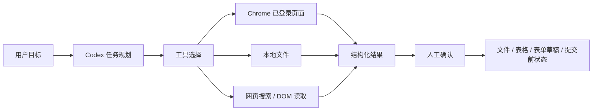
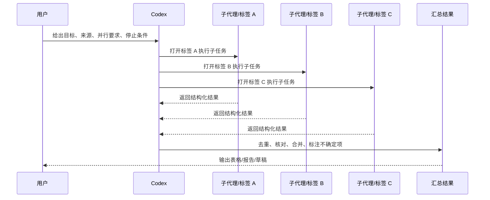

# Codex Chrome 插件：安装使用与实践案例汇总

日期：2026-05-11；官方文档核对：2026-05-28 16:53 CST

来源视频：

- [Codex Chrome 插件实测：AI 终于能自己开浏览器干活了，多标签并行太强](https://www.youtube.com/watch?v=9MCjT-eUrTs)
- [Codex操控Chrome 安装教程，浏览器被AI接管后，工作流太爽了](https://www.youtube.com/watch?v=x2EllvOb2TY)

频道：

- NiceKate AI
- 陈虾仁AI策划

发布时间：

- NiceKate AI：2026-05-08
- 陈虾仁AI策划：2026-05-09

时长：

- NiceKate AI：11:43
- 陈虾仁AI策划：7:12

本地素材：

- NiceKate 视频：`local-media/youtube/2026-05-09-nicekate-codex-chrome-plugin/Codex Chrome 插件实测：AI 终于能自己开浏览器干活了，多标签并行太强 [9MCjT-eUrTs].quicktime.mp4`
- NiceKate 字幕：`local-media/youtube/2026-05-09-nicekate-codex-chrome-plugin/Codex Chrome 插件实测：AI 终于能自己开浏览器干活了，多标签并行太强 [9MCjT-eUrTs].zh-Hans.srt`
- NiceKate 元数据：`local-media/youtube/2026-05-09-nicekate-codex-chrome-plugin/Codex Chrome 插件实测：AI 终于能自己开浏览器干活了，多标签并行太强 [9MCjT-eUrTs].quicktime.info.json`
- NiceKate 关键帧：`local-media/youtube/2026-05-09-nicekate-codex-chrome-plugin/frames/`
- NiceKate 评论摘要：`local-media/youtube/2026-05-09-nicekate-codex-chrome-plugin/comments-digest.md`
- 陈虾仁视频：`local-media/youtube/2026-05-10-chenxiaren-codex-chrome-setup/Codex操控Chrome 安装教程，浏览器被AI接管后，工作流太爽了 [x2EllvOb2TY].quicktime.mp4`
- 陈虾仁字幕：`local-media/youtube/2026-05-10-chenxiaren-codex-chrome-setup/Codex操控Chrome 安装教程，浏览器被AI接管后，工作流太爽了 [x2EllvOb2TY].quicktime.zh-Hans.srt`
- 陈虾仁元数据：`local-media/youtube/2026-05-10-chenxiaren-codex-chrome-setup/Codex操控Chrome 安装教程，浏览器被AI接管后，工作流太爽了 [x2EllvOb2TY].quicktime.info.json`
- 陈虾仁关键帧：`local-media/youtube/2026-05-10-chenxiaren-codex-chrome-setup/frames/`
- 陈虾仁评论摘要：`local-media/youtube/2026-05-10-chenxiaren-codex-chrome-setup/comments-digest.md`

字幕说明：NiceKate 这条视频使用本地 `whisper.cpp` ASR 转写，未逐句人工校对；陈虾仁这条来自 YouTube 字幕或自动字幕。`local-media/` 是本地沉淀目录，不应提交进 Git。

## 配套资源 / 代码地址

- NiceKate 视频原始链接：https://www.youtube.com/watch?v=9MCjT-eUrTs
- 陈虾仁视频原始链接：https://www.youtube.com/watch?v=x2EllvOb2TY
- OpenAI 官方演示视频：[Codex can now use Chrome directly on macOS and Windows.](https://www.youtube.com/watch?v=b6Mxcv1pyBU)
- OpenAI Codex 入口页：https://developers.openai.com/codex/
- OpenAI Codex Chrome extension 页面：https://developers.openai.com/codex/app/chrome-extension
- OpenAI Codex browser 页面：https://developers.openai.com/codex/app/browser
- 视频简介中未发现可复现的公开代码仓库。陈虾仁视频简介里有一个 `aigocode.com` 邀请链接，但不是本视频案例代码仓库。

## 评论区补充

NiceKate 评论区有几个有用信息：

- 作者回复称 Windows 可以用。
- 有用户反馈台湾暂不可用，说明区域或账号可用性可能存在差异。
- 有用户问“完全访问权限有风险吗”。这个问题很关键：它操作的是你已经登录的真实浏览器，不是玩具沙盒。
- 有用户反馈“商品无法购买或下载”，可能和账号、区域、灰度发布或 Chrome Web Store 可用性有关。

陈虾仁评论区补充：

- 安装不了插件时，作者判断大多数是网络问题。
- 有评论指出：重复性表格任务用 `Playwright + Python` 更高效；非重复任务可以叠加 AI；复杂表格仍需要人工介入。这个判断是对的，别把浏览器 Agent 当成万能自动化。

## 一句话结论

Codex Chrome 插件的价值不是“AI 会点网页”，而是把 Codex 的任务规划、代码/文件能力、真实登录态 Chrome、多标签和人工确认机制接到一起，让它能处理一类以前只能靠人跨网页搬运、核对、整理和提交的工作流。

## 先分清楚它解决的真问题

这不是为了解决“网页自动点击”这个老问题。网页自动化早有 Playwright、Selenium、RPA。

它解决的是另一件事：很多真实任务的数据分散在登录后的网页、邮件、本地文件、后台系统和搜索结果里。传统脚本拿不到登录态，API 又不一定开放，人肉操作很慢。Codex Chrome 插件让 Codex 可以在你的已登录 Chrome 里开独立标签页，读取页面、操作页面、跨页面整合信息，并把结果写回文件、表格或表单。

核心数据结构应该这么看：



好用的点在于：你给的是目标，不是一堆坐标和点击步骤。坏用的点也在这里：如果目标含糊，或者你让它直接发布、付款、改数据库，那就是把风险外包给一个会犯错的代理。

## 安装和连接流程

2026-05-28 核对 OpenAI 官方 Codex 文档后，安装路径要按官方入口改，不要只照视频里的 Chrome Web Store 搜索路径：

1. 打开 Codex App，进入 `Plugins`。
2. 选择 `Chrome`，跟随 setup flow 安装 `Codex Chrome` 扩展，并批准 Chrome 弹出的扩展权限。
3. 打开 Chrome，确认 Codex 扩展状态为 `Connected`。
4. 新开 Codex thread。需要登录态网站时，Codex 可以建议使用 Chrome；也可以在任务里直接引用 `@Chrome`。
5. Chrome 任务会在 Chrome tab group 里运行，方便把同一 thread 的页面工作归组。

官方文档还把两类浏览器能力分得很清楚：Codex in-app browser 适合本地开发服务器、file-backed preview、无需登录的公开页面；需要登录态、Chrome profile、cookies、扩展或既有标签页时，才使用 Codex Chrome extension。这个边界很重要，别把所有网页任务都扔给真实 Chrome profile。

安装失败先查这几类问题：

- Chrome Web Store 区域、账号或灰度限制。
- 网络问题，尤其是无法访问扩展下载页。
- Codex App 版本过旧，没有浏览器/Chrome 插件入口。
- 扩展没有连接上 Codex，状态仍是 `Disconnected`。
- 权限没有开，尤其涉及文件上传、下载、本地文件访问时，可能需要到扩展详情页打开对应权限。

网站访问控制也按官方口径更新：Codex 默认会在操作新网站前请求确认；用户可以对当前 chat 允许、对 host 总是允许，或拒绝。allowlist / blocklist 可以后续管理。浏览器历史是单独的敏感权限，包含内部 URL、搜索词和跨设备 Chrome 活动线索，不能和普通网页内容混为一谈。

## 使用方式

最实用的提示词结构不是“帮我点这个按钮”，而是：

```text
请用 Chrome 完成这个任务：

目标：<最终要得到什么>
数据来源：<哪些网站、后台、邮件、本地文件、搜索范围>
操作边界：<哪些动作只能做到草稿或提交前，不能直接提交>
输出格式：<Markdown / 表格 / CSV / 页面草稿 / 对比报告>
核验要求：<至少交叉检查几处来源，列出引用或截图依据>
停止条件：<遇到登录、付款、提交、删除、发帖等动作时停下来让我确认>
```

可直接复用的模板：

```text
请用 Chrome 搜索并整理 <主题> 的最近信息。
要求：
1. 至少查看 <N> 个结果或 <N> 条帖子。
2. 输出一张表：来源、链接、核心观点、证据、可信度、可行动建议。
3. 不要只摘标题，必须打开正文或详情页核对。
4. 最后列出你没有确认的信息。
```

```text
请用 Chrome 进入我已登录的 <后台系统>，根据 <本地文件/网页资料> 填写表单。
边界：
1. 只填写到提交前一步。
2. 上传文件、下载文件、提交表单前必须停下来让我确认。
3. 填完后给我一份字段映射表，说明每个字段来自哪里。
```

```text
请开启多个子代理，每个子代理使用独立 Chrome 标签页，并行完成以下任务：
1. 子代理 A：<任务 A>
2. 子代理 B：<任务 B>
3. 子代理 C：<任务 C>

所有子代理完成后，汇总成一份对比表。不要串行一个个做，除非你说明为什么不能并行。
```

```text
请用 Chrome 研究 <选题>，生成一篇 <平台> 草稿。
要求：
1. 收集 5-8 个可引用来源。
2. 生成标题、正文、标签和配图建议。
3. 如果需要图片，只生成或准备到上传前。
4. 不允许直接发布，停在发布前一步让我审。
```

## 实践案例汇总

| 案例 | 来源 | 做了什么 | 适合场景 | 风险点 |
|---|---|---|---|---|
| OpenAI 社区反馈整理 | 两条视频都引用官方案例 | 搜索 Codex 相关帖子，整理主题、关键问题、用户情绪，生成表格 | 用户调研、舆情分析、产品反馈汇总 | 搜索覆盖率和情绪判断要抽查 |
| 邮件 + 本地收据 + 报销系统 | 官方案例，经两条视频转述 | 从 Gmail 找餐饮邮件，读取本地 PDF 收据，匹配日期、金额、商户，再录入报销系统 | 财务报销、票据核对、后台录入 | 涉及邮件、文件上传、提交表单，必须人工确认 |
| 四个子代理多标签绘画游戏 | 官方案例，经两条视频转述 | 一个代理建房间，其他代理在独立标签加入，同步游戏画布并完成绘图 | 多标签并行、子代理协作、网页任务拆分 | 协调复杂，提示词要明确并行和共享上下文 |
| OpenAI 文章摘要写入 Markdown | 陈虾仁实测 | 用 Chrome 找 ChatGPT 5.5 相关文章，整理摘要，写到桌面 Markdown | 资料检索、网页摘要、本地笔记生成 | 文件写入要确认路径；版权内容不能逐字搬运 |
| 小红书/社媒选题与评论研究 | NiceKate 实测 | 浏览内容平台，查看页面和评论，提炼选题方向 | 内容运营、选题调研、竞品观察 | 平台反爬、账号风控、低质量摘要 |
| X/Twitter 热门帖采集 | NiceKate 实测 | 多关键词搜索 Codex Chrome 插件相关帖子，筛出高互动样本 | 社媒监听、热点判断、传播复盘 | 关键词覆盖不稳定，容易混入无关帖子 |
| 调用 ChatGPT Pro 生成案例分析 | NiceKate 实测 | 登录 ChatGPT 官网，选择模型，优化提示词并等待回答 | 跨 AI 产品对比、让 Codex 操作另一个网页 AI | 长任务等待时可能误判“已完成” |
| Gemini 多页面生成 | NiceKate 实测 | 打开多个 Gemini 页面，用不同提示词生成内容 | 多模型、多提示词批量测试 | 如果不明确要求子代理/并行，可能串行执行 |
| Simon Willison 文章总结 | NiceKate 实测 | 页面直接抓取受限时，从浏览器 DOM 或页面内容读取，打开正式文章补上下文 | 博客归档、知识库整理、研究综述 | 不能只读列表页，必须打开正文核对 |
| 京东/淘宝价格对比 | NiceKate 实测 | 登录电商平台，搜索商品，按销量筛店铺和价格，整理表格 | 商品调研、价格对比、选品 | 淘宝触发安全策略拦截；电商数据时效性强 |
| 小红书草稿 + 图片上传 | NiceKate 实测 | 研究 Codex Chrome 插件信息，生成图片和帖子草稿，上传到发布页前 | 内容生产流水线 | 不该自动发布；图片上传可能需要额外扩展权限 |

## 案例抽象：哪些任务值得交给它

值得交给 Codex Chrome 插件的任务有一个共同点：数据在网页里，而且需要理解、核对、整理，不只是机械重复。

适合：

- 登录后页面的信息整理。
- 多网页、多标签、多来源研究。
- 后台表单草稿填写。
- 网页内容采集后生成 Markdown、CSV、表格或报告。
- 需要人工最后确认的报销、运营、CRM、客服、内容发布流程。
- 前端页面测试和调试，尤其是需要真实浏览器状态的情况。

不适合：

- 高频、稳定、重复的结构化抓取。用 API、数据库查询或 Playwright 脚本更清楚。
- 大批量电商采集。容易被风控，数据也不稳定。
- 付款、删除、发邮件、发帖、提交审批这类不可逆动作。
- 要求 100% 准确的财务、法务、医疗结论。
- 没有明确停止条件的“你自己看着办”。

## 多标签和子代理怎么用

NiceKate 的一个重要经验是：如果你想并行，不要只说“帮我打开五个页面”。那可能会变成一个代理串行处理五次。

应该明确说：

```text
请开启 5 个子代理，每个子代理在独立 Chrome 标签页工作。
每个子代理使用不同提示词。
完成后统一汇总。
如果当前环境不支持真正并行，请先告诉我，不要假装并行。
```

多标签并行适合这几类任务：

- 同一主题，多平台搜索。
- 同一网页产品，多模型测试。
- 同一表单流程，多账号或多样本验证。
- 多个页面分别读取，最后合并成表。

流程可以这样理解：



## 权限和安全边界

这个功能强，是因为它能用真实 Chrome 登录态。风险也正好来自这里。

最小可用规则：

1. 用单独 Chrome Profile 做 Agent 操作，不要混在主浏览器里。
2. 高风险账号不要默认登录在这个 Profile 里。
3. 扩展权限能少开就少开，需要上传本地文件时再开。
4. 让它停在提交前，不要自动发帖、付款、发邮件、删数据。
5. 让它输出“字段来自哪里”，尤其是报销、CRM、订单、报价这类任务。
6. 下载文件、上传文件、提交表单、读取历史记录、访问新站点时，都应该人工确认。
7. 对电商、社媒、后台系统这种会风控的平台，失败是正常情况，不要把失败归咎成模型智力问题。

一个实用的停止条件模板：

```text
遇到以下动作必须停止并请求我确认：
- 提交表单
- 发布内容
- 发送邮件或消息
- 下载或上传文件
- 修改账号设置
- 删除或覆盖数据
- 付款、下单、退款
- 读取敏感历史记录或隐私页面
```

## 和 Claude in Chrome / Computer Use 的区别

两条视频都提到一个判断：这不是谁抄谁，而是不同入口在抢真实工作流。

可以这样理解：

- Claude in Chrome 更像浏览器里的助手，围绕当前网页直接操作。
- Codex Chrome 插件更像把浏览器接到 Coding Agent 上：Codex 本来能读写文件、理解代码、跑任务、调试系统，现在多了一个已登录 Chrome 作为工具。

这意味着 Codex 更适合“浏览器 + 文件 + 代码/脚本 + 结构化输出”的混合任务。单纯让它点网页，品味很差。能用脚本稳定完成的，就别让 Agent 在网页上晃。

## 工程提醒

第一，Chrome 插件不是 API。网页结构、登录状态、风控策略、页面改版都会影响结果。稳定生产任务应该优先找 API 或脚本接口。

第二，表格任务要拆清楚。简单重复表格用脚本；非重复网页理解可以让 Agent 做；复杂财务表格必须人工审。

第三，提示词要写输出格式和核验要求。不要只说“帮我整理一下”，那是在制造垃圾结果。

第四，允许它做草稿，不要允许它做不可逆动作。发布、支付、删除、提交审批必须人审。

第五，要求它列出未确认事项。Agent 最危险的不是不知道，而是假装知道。

## 推荐练习

按照学习路线，这两条视频适合放在“OpenAI 官方技术栈”阶段的 Agent 工具调用实践里。不要一上来做多 Agent 大系统，先把单个 Agent 如何安全使用 Chrome 做明白。

练习 1：网页资料整理

```text
请用 Chrome 搜索 OpenAI Codex Chrome extension 的官方资料和 5 条社区讨论。
输出一份 Markdown：功能点、使用限制、风险、适合场景、来源链接。
不要访问需要登录的网站。
```

练习 2：登录态后台只读分析

```text
请用 Chrome 打开我已登录的 <后台>，只读取最近 7 天的数据概览。
不要修改任何字段，不要点击提交。
输出表格：指标、数值、页面来源、你不确定的地方。
```

练习 3：发布前草稿

```text
请用 Chrome 收集 <主题> 的资料，生成一篇小红书草稿。
只做到发布前，不允许点击发布。
输出标题 5 个、正文 1 版、标签 10 个、配图建议 3 个。
```

练习 4：并行对比

```text
请开启 3 个子代理，分别在独立 Chrome 标签页搜索同一主题在 YouTube、X、Reddit 的讨论。
每个子代理输出 10 条样本。
最后合并成一张表，并标注重复观点。
```

## 参考资料

- NiceKate AI：[Codex Chrome 插件实测：AI 终于能自己开浏览器干活了，多标签并行太强](https://www.youtube.com/watch?v=9MCjT-eUrTs)
- 陈虾仁AI策划：[Codex操控Chrome 安装教程，浏览器被AI接管后，工作流太爽了](https://www.youtube.com/watch?v=x2EllvOb2TY)
- OpenAI 官方演示：[Codex can now use Chrome directly on macOS and Windows.](https://www.youtube.com/watch?v=b6Mxcv1pyBU)
- OpenAI Codex：https://developers.openai.com/codex/
- OpenAI Codex Chrome extension：https://developers.openai.com/codex/app/chrome-extension
- OpenAI Codex browser：https://developers.openai.com/codex/app/browser

## 未验证事项

- 本笔记基于视频字幕、元数据、关键帧和评论区整理，没有在本机实际安装或复现 Codex Chrome 插件。
- NiceKate 视频字幕由本地 `whisper.cpp` ASR 生成，未逐句人工校对，个别模型名、产品名、平台名可能有转写误差。
- 视频中的速度、成功率、可用区域、权限页面和 UI 入口可能会随 Codex App、Chrome 扩展和账号灰度变化。
- 视频里的电商、社媒、ChatGPT/Gemini 等案例没有复跑；结果只作为场景范式，不作为当前平台一定可用的承诺。
- OpenAI 官方页面链接已作为参考列出；具体安装入口、权限说明和可用性应以当前官方文档和 App 内提示为准。
