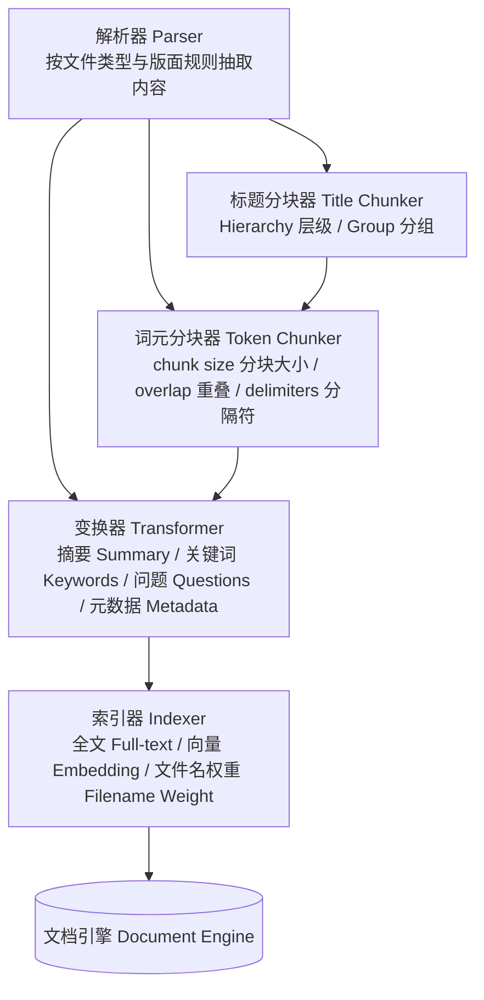
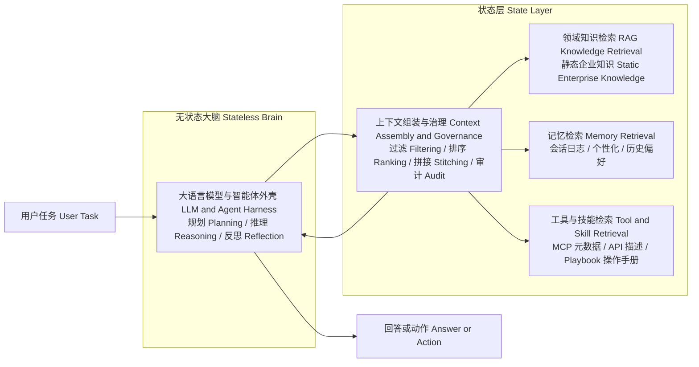

# RAGFlow 官方材料 Deep Research

下文首次出现时，统一采用 **英文术语（专业中文对应）** 的写法，例如：RAG（检索增强生成）、Agentic RAG（智能体驱动检索增强生成）、Context Engineering（上下文工程）、Ingestion Pipeline（数据摄取管线）、DeepDoc（深度文档理解解析器）、hybrid search（混合检索）、rerank（重排序）、metadata filtering（元数据过滤）、grounded citations（有据可溯引用）、memory（记忆）、tool retrieval（工具检索）、MCP（模型上下文协议）。

## 执行摘要

- **RAGFlow 团队对 RAG 的核心判断，始终不是“向量检索 + Prompt 拼接”，而是一条从解析、增强、索引到检索的完整数据工程链路。** 这种判断在 2024 年的 [《From RAG 1.0 to RAG 2.0》](https://ragflow.io/blog/future-of-rag) 中已经成形，在 2025 年末的 [《From RAG to Context》](https://ragflow.io/blog/rag-review-2025-from-rag-to-context) 中则进一步升级为 Context Engineering（上下文工程）与 Context Engine（上下文引擎）的表述。

- **RAGFlow 最重视的“第一性问题”不是聊天效果，而是文档在进入系统前有没有被正确理解。** README 把 Deep document understanding（深度文档理解）放在核心特性最前列，文档与博客持续强调复杂 PDF、扫描件、表格、版面、双栏、PPT 等处理，因为 parser（解析器）错误会系统性污染后续 chunking（分块）、retrieval（检索）与 citation（引用）。见 [README](https://github.com/infiniflow/ragflow/blob/main/README.md)、[《Is data processing like building with lego?》](https://ragflow.io/blog/is-data-processing-like-building-with-lego-here-is-a-detailed-explanation-of-the-ingestion-pipeline)、[Select PDF parser 文档](https://ragflow.io/docs/select_pdf_parser)。

- **hybrid search（混合检索）在 RAGFlow 不是加分项，而是企业场景的基线能力。** 官方在 [《The Rise and Evolution of RAG in 2024》](https://ragflow.io/blog/the-rise-and-evolution-of-rag-in-2024-a-year-in-review) 与 [《What Infrastructure Capabilities does RAG Need beyond Hybrid Search》](https://ragflow.io/blog/what-infrastructure-capabilities-does-rag-need-beyond-hybrid-search) 中反复批评 pure vector retrieval（纯向量检索）的局限；当前 [Retrieval component 文档](https://ragflow.io/docs/retrieval_component) 也把关键词与向量两路召回写成默认工作方式。

- **chunking（分块）被 RAGFlow 当作“召回—可用性”的结构设计问题，而不是单个窗口参数。** 官方从模板化 chunking、Title chunker（标题分块器）、Token chunker（切词分块器）一路扩展到 parent-child chunking（父子分块）、PageIndex、RAPTOR、GraphRAG，本质都在解决“定位精度”与“上下文完整性”的冲突。见 [README](https://github.com/infiniflow/ragflow/blob/main/README.md)、[Title chunker 文档](https://ragflow.io/docs/chunker_title_component)、[Configure child chunking strategy 文档](https://ragflow.io/docs/configure_child_chunking_strategy)、[Enable RAPTOR 文档](https://ragflow.io/docs/enable_raptor)、[Construct knowledge graph 文档](https://ragflow.io/docs/construct_knowledge_graph)。

- **grounded citations（有据可溯引用）在官方语境里不是 UI 装饰，而是“回答支持证据”的工程边界。** README 明确把 traceable citations（可追溯引用）列为核心能力；Quickstart 与 retrieval test 文档又把 chunk 可视化、人工干预与检索测试前置到标准流程里，这说明 citation 的目标是可验证与可审计，而不是“看起来更可信”。见 [README](https://github.com/infiniflow/ragflow/blob/main/README.md)、[Quickstart](https://ragflow.io/docs/)、[Run retrieval test 文档](https://ragflow.io/docs/run_retrieval_test?utm_source=chatgpt.com)。

- **RAGFlow 对 long context（长上下文）的判断不是“反对”，而是坚持 retrieval-first（检索优先）的协同路线。** 官方在 [《From RAG to Context》](https://ragflow.io/blog/rag-review-2025-from-rag-to-context) 中明确指出，单纯依赖大上下文会遇到 Lost in the Middle 与 information flooding（信息淹没）问题，因此更合理的方向是先做检索与上下文组装，再使用长上下文承载结果。

- **Agentic RAG（智能体驱动检索增强生成）在 RAGFlow 里不是“多 Agent 热闹化”，而是把 RAG 重新定位为 Agent 的 context supply layer（上下文供给层）。** 从 [《Agentic RAG》](https://ragflow.io/blog/agentic-rag-definition-and-low-code-implementation) 到 [《RAGFlow Enters Agentic Era》](https://ragflow.io/blog/ragflow-enters-agentic-era)，再到 [《From RAG to Context》](https://ragflow.io/blog/rag-review-2025-from-rag-to-context) 与 [《Data foundation in the era of agent harness》](https://ragflow.io/blog/data-foundation-in-the-era-of-agent-harness-why-ragflow-is-changing)，官方路线越来越清晰：RAG 的重心从“知识库问答”迁移到“为 Agent 动态装配 context（上下文）”。

- **memory（记忆）不是 RAG 的替代品，而是 retrieval-based state layer（检索式状态层）的延伸。** 官方在 [《RAG at the Crossroads》](https://ragflow.io/blog/rag-at-the-crossroads-mid-2025-reflections-on-ai-evolution) 与 [《From RAG to Context》](https://ragflow.io/blog/rag-review-2025-from-rag-to-context) 中都把 memory 与 RAG 视为技术同源、管理目标不同的两类系统；0.24 与 0.25 则分别通过 [《RAGFlow 0.24.0》](https://ragflow.io/blog/ragflow-0.24.0-memory-api-knowledge-base-governance-and-agent-chat-history) 与 [《RAGFlow 0.25》](https://ragflow.io/blog/ragflow-0.25-ingestion-pipeline-agent-sandbox-and-user-level-memory) 把这一判断落到 Memory API、user-level memory 等产品形态上。

- **0.21 之后的版本演进证明，RAGFlow 的主线是“先补 data foundation（数据基础设施），再谈 Agent 上层能力”。** [《RAGFlow 0.21.0》](https://ragflow.io/blog/ragflow-0.21.0-ingestion-pipeline-long-context-rag-and-admin-cli) 明确写出本次 release 的焦点从 online Agent capability 转向 strengthening the data foundation；后续 0.22、0.23、0.24、0.25 则依次补齐同步、parser、metadata filtering、memory、governance、sandbox 等能力。

- **官方材料中所有“高精度”“降低幻觉”“企业级”“agentic”之类表述，都不应直接当结果，而应降级为实验假设。** 官方真正公开且可操作的，是 parser 选择、chunking 策略、hybrid search、rerank、metadata filtering、memory API、retrieval test、execution trace、governance 等工程变量；这些才是你能在自己的企业数据上验证的东西。见 [Retrieval component 文档](https://ragflow.io/docs/retrieval_component)、[Run retrieval test 文档](https://ragflow.io/docs/run_retrieval_test?utm_source=chatgpt.com)、[Release Notes](https://ragflow.io/docs/v0.25.4/release_notes)。

## 时间线与资料清单

### 资料清单表

下表只列本报告实际依赖的**一手官方材料**。为便于核对，表中“链接”列使用可点击页面标题代替原始 URL。可信度采用简化分级：**高** = 官方文档、README、release notes；**中高** = 官方博客中的架构/路线文章；**中** = 官方博客中的产品新闻；**未使用** = 本次未纳入核心论证的社媒或视频材料。

| 标题 | 发布日期 | 链接 | 类型 | 主要主题 | 可信度 | 是否仍适用于当前版本 |
|---|---:|---|---|---|---|---|
| README | 当前主分支 | [README](https://github.com/infiniflow/ragflow/blob/main/README.md) | README | Deep document understanding、template-based chunking、traceable citations、multiple recall、fused re-ranking | 高 | 高 |
| Quickstart / Docs 首页 | 当前 DEV 文档显示稳定版 0.25.4 | [Quickstart](https://ragflow.io/docs/) | 文档 | 当前部署方式、dataset、retrieval test、human intervention、document engine | 高 | 高 |
| Release Notes | v0.25.4 于 2026-05-14 发布 | [Release Notes](https://ragflow.io/docs/v0.25.4/release_notes) | Release Notes | 版本演进、breaking changes、功能与 API 变动 | 高 | 高 |
| From RAG to Context | 2025-12-22 | [《From RAG to Context》](https://ragflow.io/blog/rag-review-2025-from-rag-to-context) | 官方博客 | Context Engineering、long context、memory、tool retrieval、Context Engine | 中高 | 高 |
| Data foundation in the era of agent harness | 2026-04-22 | [《Data foundation in the era of agent harness》](https://ragflow.io/blog/data-foundation-in-the-era-of-agent-harness-why-ragflow-is-changing) | 官方博客 | agent harness、state layer、agent data foundation、retrieval control plane | 中高 | 高 |
| RAGFlow 0.25 | 2026-04-23 | [《RAGFlow 0.25》](https://ragflow.io/blog/ragflow-0.25-ingestion-pipeline-agent-sandbox-and-user-level-memory) | 官方博客 | Ingestion Pipeline、sandbox、user-level memory、治理边界 | 中 | 高 |
| RAGFlow 0.24.0 | 2026-02-15 | [《RAGFlow 0.24.0》](https://ragflow.io/blog/ragflow-0.24.0-memory-api-knowledge-base-governance-and-agent-chat-history) | 官方博客 | Memory API、knowledge base governance、agent chat history | 中 | 高 |
| RAGFlow 0.23.0 | 2025-12-31 | [《RAGFlow 0.23.0》](https://ragflow.io/blog/ragflow-0.23.0-advanding-memory-rag-and-agent-performance) | 官方博客 | memory、parent-child chunking、image/table context、agent performance | 中 | 高 |
| RAGFlow 0.22.0 Overview | 2025-11-11 | [《RAGFlow 0.22.0 Overview》](https://ragflow.io/blog/ragflow-0.22.0-data-source-synchronization-enhanced-parser-agent-optimization-and-admin-ui) | 官方博客 | data source synchronization、enhanced parser、metadata filtering、structured output、admin UI | 中 | 高 |
| RAGFlow 0.21.0 | 2025-10-15 | [《RAGFlow 0.21.0》](https://ragflow.io/blog/ragflow-0.21.0-ingestion-pipeline-long-context-rag-and-admin-cli) | 官方博客 | data foundation、Ingestion Pipeline、long-context RAG、admin CLI | 中高 | 高 |
| Is data processing like building with lego? | 2025-10-23 | [《Is data processing like building with lego?》](https://ragflow.io/blog/is-data-processing-like-building-with-lego-here-is-a-detailed-explanation-of-the-ingestion-pipeline) | 官方博客 | Parser、Transformer、Indexer、unstructured ETL、semantic gap | 中高 | 高 |
| RAG at the Crossroads | 2025-07-02 | [《RAG at the Crossroads》](https://ragflow.io/blog/rag-at-the-crossroads-mid-2025-reflections-on-ai-evolution) | 官方博客 | Agent 热潮、memory、tool ecosystem、对 Search R1 的降温 | 中高 | 中高 |
| The Rise and Evolution of RAG in 2024 | 2024-12-24 | [《The Rise and Evolution of RAG in 2024》](https://ragflow.io/blog/the-rise-and-evolution-of-rag-in-2024-a-year-in-review) | 官方博客 | BM25、hybrid search、GraphRAG、多模态 RAG、RAGFlow 初始判断 | 中高 | 中高 |
| What Infrastructure Capabilities does RAG Need beyond Hybrid Search | 2024-11-26 | [《What Infrastructure Capabilities does RAG Need beyond Hybrid Search》](https://ragflow.io/blog/what-infrastructure-capabilities-does-rag-need-beyond-hybrid-search) | 官方博客 | beyond hybrid search、GraphRAG、range filtering、张量重排等基础设施判断 | 中高 | 中高 |
| From RAG 1.0 to RAG 2.0 | 2024-07-15 | [《From RAG 1.0 to RAG 2.0》](https://ragflow.io/blog/future-of-rag) | 官方博客 | RAG 2.0、四阶段 end-to-end search、对 LLMOps 式 RAG 的批判 | 中高 | 中高 |
| Agentic RAG | 2024-06-18 | [《Agentic RAG》](https://ragflow.io/blog/agentic-rag-definition-and-low-code-implementation) | 官方博客 | Agentic RAG 定义、query rewrite、多步检索 | 中高 | 中 |
| RAGFlow Enters Agentic Era | 2024-07-11 | [《RAGFlow Enters Agentic Era》](https://ragflow.io/blog/ragflow-enters-agentic-era) | 官方博客 | RAG 与 Agent 的互补、naive semantic search 的短板 | 中高 | 中 |
| Implementing a long-context RAG based on RAPTOR | 2024-05-24 | [《Implementing a long-context RAG based on RAPTOR》](https://ragflow.io/blog/long-context-rag-raptor?utm_source=chatgpt.com) | 官方博客 | RAPTOR、树状摘要与长文理解 | 中高 | 中 |
| GraphRAG 官方文章 | 2024-09-19 | [《How Our GraphRAG Reveals...》](https://ragflow.io/blog/ragflow-support-graphrag) | 官方博客 | GraphRAG 在 RAGFlow 中的定位 | 中高 | 中 |
| Text2SQL 官方文章 | 2024-09-24 | [《Implementing Text2SQL with RAGFlow》](https://ragflow.io/blog/implementing-text2sql-with-ragflow?utm_source=chatgpt.com) | 官方博客 | retrieval + examples + reflection 的任务模式 | 中 | 中 |
| Multi-Agent Deep Research | 2025-08-07 | [《RAGFlow 0.20.0 - Multi-Agent Deep Research》](https://ragflow.io/blog/ragflow-0.20.0-multi-agent-deep-research) | 官方博客 | deep research、maintainability、human intervention | 中 | 中 |

**补充说明：** 本报告**未将官方 YouTube、X、LinkedIn、Discord 作为核心事实源**。原因不是这些渠道不重要，而是本次关键架构判断已经能由 docs、README、release notes 与官方博客充分支撑；若未来要研究“路线口径的非正式变化”，再补社媒更有价值。

### 时间线与路线演进

**2024 年：从“RAG 1.0 不够用”出发，先立技术问题。**  
[《From RAG 1.0 to RAG 2.0》](https://ragflow.io/blog/future-of-rag) 把传统 LLMOps 式 RAG 视为不够完整的实现，把真正的 RAG 2.0 定义为 information extraction（信息抽取）、document preprocessing（文档预处理）、indexing（索引构建）、retrieval and generation（检索与生成）耦合而成的 end-to-end search system（端到端搜索系统）。这说明 RAGFlow 团队最早就不把 RAG 看成“接向量数据库的 prompt 工具”，而是一套搜索—理解—供给系统。同期的 [《Agentic RAG》](https://ragflow.io/blog/agentic-rag-definition-and-low-code-implementation) 与 [《RAGFlow Enters Agentic Era》](https://ragflow.io/blog/ragflow-enters-agentic-era) 又开始讨论 Agent 与 retrieval 的互补关系，但此时主题仍是“怎么改进 RAG”，不是“怎么炫技多 Agent”。

**2024 年末：把文档理解与 hybrid search 明确为企业 RAG 的底层判断。**  
[《The Rise and Evolution of RAG in 2024》](https://ragflow.io/blog/the-rise-and-evolution-of-rag-in-2024-a-year-in-review) 复盘 RAGFlow 自己的初始设计时，明确强调两件事：其一，必须解决复杂文档理解问题；其二，必须从一开始采用 enterprise-level search engine（企业级搜索引擎）做 hybrid search。这篇文章非常值得看，因为它不是功能介绍，而是在说明团队为什么一开始就押注 parser 与搜索基础设施，而不是先做 workflow UI。

**2025 年中：在 Agent 热潮里为 RAG 去神化，也为 Agent 去泡沫。**  
[《RAG at the Crossroads》](https://ragflow.io/blog/rag-at-the-crossroads-mid-2025-reflections-on-ai-evolution) 的重要性在于，它没有顺着“Agent 会替代 RAG”的热潮走，而是把话题拉回 memory、tool ecosystem、retrieval 这些更基础的问题。这里已经能看到后续 Context Engineering（上下文工程）的轮廓：真正麻烦的不是 Agent 会不会 planner，而是 Agent 在运行中如何获得正确、有限、可追责的 context（上下文）。

**2025 年下半年：产品主线从 Agent capability 转向 data foundation。**  
[《RAGFlow 0.21.0》](https://ragflow.io/blog/ragflow-0.21.0-ingestion-pipeline-long-context-rag-and-admin-cli) 明确写出，release 焦点从 online Agent capability 转到 strengthening the data foundation；随后 [《Is data processing like building with lego?》](https://ragflow.io/blog/is-data-processing-like-building-with-lego-here-is-a-detailed-explanation-of-the-ingestion-pipeline) 把 Ingestion Pipeline（数据摄取管线）展开成 Parser、Transformer、Indexer 等离线 ETL 结构。接下来的 0.22、0.23、0.24，则分别把同步、parser、metadata filtering、memory、governance、chat history 等基础设施能力补强。这个时间段的关键词已经不是“做 Agent Demo”，而是“修 Data Plane（数据平面）”。

**2025 年末到 2026 年：从“RAG engine / knowledge base”升级为“Context Engine / agent data foundation”。**  
[《From RAG to Context》](https://ragflow.io/blog/rag-review-2025-from-rag-to-context) 是转折点：官方明确用 Context Engineering、Context Engine 来重新定义 RAG 在 Agent 时代的角色。到了 [《Data foundation in the era of agent harness》](https://ragflow.io/blog/data-foundation-in-the-era-of-agent-harness-why-ragflow-is-changing)，这种定位更进一步，被明确写成 agent data foundation（Agent 数据基础设施）与 state layer（状态层）。这两篇文章连起来读，能非常清楚地看到 RAGFlow 如何从“知识库问答系统”转成“上下文与状态供给系统”。

**当前版本校准：不要再把 RAGFlow 理解成 2024 年的静态产品。**  
截至 2026-05-16，官方文档首页显示当前稳定文档版本为 **0.25.4**，部署示例也要求 `git checkout -f v0.25.4`；对应 release notes 标注 **2026-05-14** 发布。这意味着你在 2024 年形成的任何印象——无论是“PDF 聊天工具”、还是“RAG engine”——都需要重新放到 0.21 之后的 data foundation 路线上审视。[Quickstart](https://ragflow.io/docs/)、[Release Notes](https://ragflow.io/docs/v0.25.4/release_notes)

## RAGFlow 的 RAG 工程哲学

下面按你指定的十个主题逐项展开。每一项都显式区分：**官方事实、官方观点、研究判断**。

### RAG 与长上下文

**官方事实**  
[《From RAG to Context》](https://ragflow.io/blog/rag-review-2025-from-rag-to-context) 直接讨论了 long context（长上下文）对 RAG 的挑战，指出更大 context window（上下文窗口）降低了一些传统 chunking 与 query-rewrite 的必要性；但同文同时明确提到 Lost in the Middle 与 information flooding 问题。RAGFlow 也在 [《RAGFlow 0.21.0》](https://ragflow.io/blog/ragflow-0.21.0-ingestion-pipeline-long-context-rag-and-admin-cli) 中把 long-context RAG 作为独立版本主题，并通过 [PageIndex / Table of Contents 相关文档](https://ragflow.io/docs/enable_table_of_contents) 尝试改善长文导航与上下文补全。

**官方观点**  
官方最关键的观点是：**长上下文不会让 retrieval（检索）消失，只会让 retrieval 的职责发生变化。** 从 [《From RAG to Context》](https://ragflow.io/blog/rag-review-2025-from-rag-to-context) 的写法看，RAG 的价值不再只是缩短输入，而是承担 context selection（上下文选择）、context organization（上下文组织）、context grounding（上下文证据化）三项工作。

**研究判断**  
对企业系统而言，long context 能替代掉一部分粗糙的 fixed-window stitching（固定窗口拼接），但**替代不了 parser、metadata filtering、权限控制、citation 绑定与 context budget 管理**。因此，RAGFlow 强调的不是“RAG vs long context”二选一，而是 “retrieval-first + long-context containment（检索优先 + 长上下文承载）”。这是一个对架构非常有影响的判断：如果你接受它，就不会把“换大模型长上下文”当成绕过 RAG 工程的捷径。主要依据见 [《From RAG to Context》](https://ragflow.io/blog/rag-review-2025-from-rag-to-context)、[《RAGFlow 0.21.0》](https://ragflow.io/blog/ragflow-0.21.0-ingestion-pipeline-long-context-rag-and-admin-cli)。

### Ingestion Pipeline 与 PTI

**官方事实**  
[《Is data processing like building with lego?》](https://ragflow.io/blog/is-data-processing-like-building-with-lego-here-is-a-detailed-explanation-of-the-ingestion-pipeline) 把 Ingestion Pipeline（数据摄取管线）定义为面向 unstructured data（非结构化数据）的 visual ETL（可视化 ETL）。官方将典型流程概括为 Parser（解析器）、Transformer（变换器）、Indexer（索引器）三大阶段；当前文档则把它细化为 [Parser component](https://ragflow.io/docs/parser_component)、[Title chunker component](https://ragflow.io/docs/chunker_title_component)、[Token chunker component](https://ragflow.io/docs/chunker_token_component)、[Transformer component / quickstart](https://ragflow.io/docs/ingestion_pipeline_quickstart)、[Indexer component](https://ragflow.io/docs/indexer_component)。

**官方观点**  
官方的关键观点是：**RAG 的难点不在“把文件塞进去”，而在“如何跨越 semantic gap（语义鸿沟）”。** ingestion 不是一个上传动作，而是把原始异构文件转换成“可检索、可引用、可治理”的中间表示。这就是为什么 Transformer 被放在核心位置：它不是装饰件，而是负责自动摘要、关键词、问题生成、metadata 提取等语义增强。

**研究判断**  
如果沿用你提出的 PTI 口径，RAGFlow 实际在做的是一个 **Parser → Transformer → Indexer** 的离线数据面，Chunker（分块器）是其中最关键的结构控制器。这个架构取向说明：RAGFlow 更像“检索系统的数据工厂”，而不是“问答应用前端”。这也解释了为什么它在 0.21 之后优先上管线与治理，而不是优先上更复杂的 Agent 编排。依据见 [《RAGFlow 0.21.0》](https://ragflow.io/blog/ragflow-0.21.0-ingestion-pipeline-long-context-rag-and-admin-cli)、[《Is data processing like building with lego?》](https://ragflow.io/blog/is-data-processing-like-building-with-lego-here-is-a-detailed-explanation-of-the-ingestion-pipeline)。

### DeepDoc 与文档理解

**官方事实**  
README 把 “Deep document understanding” 明列为核心能力，并强调 complicated formats（复杂格式）支持；[Select PDF parser 文档](https://ragflow.io/docs/select_pdf_parser) 明确列出 DeepDoc、Naive、MinerU、Docling、third-party VLM parser 等多种选择，并说明自 v0.17.0 起，DeepDoc-specific extraction（DeepDoc 特定抽取）已经与 chunking method（分块方式）解耦。Quickstart 也把 “Intervene with file parsing”（人工干预解析）写入正式流程。[README](https://github.com/infiniflow/ragflow/blob/main/README.md)、[Quickstart](https://ragflow.io/docs/)

**官方观点**  
官方的核心观点是：**复杂文档理解是企业 RAG 的第一道 hard problem（硬问题）。** 这不是“提升体验”的边角功能，而是上游决定下游上限的约束。官方同时也没有把 DeepDoc 绝对化：文档明确指出，如果 PDF 基本都是 plain text（纯文本），可以优先考虑 Naive 以获得更快速度；若复杂版式强，则需要更强 parser。

**研究判断**  
这说明 RAGFlow 的 parser 路线是一种**质量—吞吐—成本三方折中**，而不是“更强视觉模型永远更好”。如果你做企业级 RAG，第一步不应该是比 embedding，而应该是给自己的 PDF/PPT/扫描件语料做 parser A/B test。DeepDoc 值得学习的地方不是某个 OCR 细节，而是它把“解析质量可被人工干预、可被策略切换”作为系统设计的一部分。依据见 [Select PDF parser 文档](https://ragflow.io/docs/select_pdf_parser)、[README](https://github.com/infiniflow/ragflow/blob/main/README.md)。

### Chunking 路线

**官方事实**  
README 提到 template-based chunking（模板化分块）；文档将 chunking 拆为 [Title chunker](https://ragflow.io/docs/chunker_title_component) 与 [Token chunker](https://ragflow.io/docs/chunker_token_component) 两类。0.23 引入了 [parent-child chunking（父子分块）](https://ragflow.io/docs/configure_child_chunking_strategy)；此外还有 [PageIndex / Extract table of contents](https://ragflow.io/docs/enable_table_of_contents)、[RAPTOR](https://ragflow.io/docs/enable_raptor)、[Construct knowledge graph](https://ragflow.io/docs/construct_knowledge_graph) 与对应博客文章，分别从目录结构、树状摘要、图结构三个方向改善长文与多跳检索。

**官方观点**  
官方持续表达的观点是：**固定窗口 chunking 只是 baseline（基线），不能覆盖所有文档与任务。** [Title chunker 文档](https://ragflow.io/docs/chunker_title_component) 明确支持按层级结构切分；[parent-child chunking 文档](https://ragflow.io/docs/configure_child_chunking_strategy) 直接用法务文本举例说明，子块适合召回，父块适合提供完整上下文；RAPTOR 与 GraphRAG 文章则表明，面对 topic-level query（主题级问题）或 multi-hop query（多跳问题），还需要更重的结构增强。

**研究判断**  
RAGFlow 对 chunking 的真正贡献，不是“提供了很多模式”，而是把它明确成一个 **recall granularity（召回粒度）× context usability（上下文可用性）** 的设计空间。父子分块解决的是“定位精度和可读上下文不能两全”的矛盾；PageIndex 解决的是“索引级结构补全”；RAPTOR 解决的是“主题层面的摘要式检索”；GraphRAG 解决的是“实体-关系多跳”。这几条路线没有谁是总冠军，它们对应的是不同信息结构问题。依据见 [Configure child chunking strategy](https://ragflow.io/docs/configure_child_chunking_strategy)、[Enable RAPTOR](https://ragflow.io/docs/enable_raptor)、[Construct knowledge graph](https://ragflow.io/docs/construct_knowledge_graph)、[《How Our GraphRAG Reveals...》](https://ragflow.io/blog/ragflow-support-graphrag)。

### Hybrid search、metadata filtering 与 rerank

**官方事实**  
README 把 “multiple recall paired with fused re-ranking” 写成核心特性之一；[Retrieval component 文档](https://ragflow.io/docs/retrieval_component) 说明检索支持关键词与向量相似度加权，也支持 rerank model（重排序模型），并明确警告启用 rerank 会显著增加响应时间。0.20.3、0.20.5、0.22.0 等版本变化在 [Release Notes](https://ragflow.io/docs/v0.25.4/release_notes) 与 0.22 博客中体现出 document-level metadata filtering、API 侧 `metadata_condition`、组件层 metadata filtering 等强化。

**官方观点**  
官方从 [《The Rise and Evolution of RAG in 2024》](https://ragflow.io/blog/the-rise-and-evolution-of-rag-in-2024-a-year-in-review) 到 [《What Infrastructure Capabilities does RAG Need beyond Hybrid Search》](https://ragflow.io/blog/what-infrastructure-capabilities-does-rag-need-beyond-hybrid-search) 的主张很一致：**企业场景不能只靠向量检索；full-text / BM25、filtering、range filtering、reranking 等都属于检索基础设施，而不是附加项。**

**研究判断**  
RAGFlow 在这里最值得学习的，是它把 retrieval（检索）理解成**一个 control plane（控制平面）**，而不是一句“向量召回”就能结束的问题。hybrid search 负责底线召回，metadata filtering 负责权限/版本/租户边界，rerank 负责候选精排，但 rerank 的价值必须与 latency/cost 一起评估。也就是说，企业级 RAG 不是“把检索接上就行”，而是“先把错召回、漏召回、越权召回、慢召回分别当成不同问题处理”。依据见 [Retrieval component 文档](https://ragflow.io/docs/retrieval_component)、[《What Infrastructure Capabilities does RAG Need beyond Hybrid Search》](https://ragflow.io/blog/what-infrastructure-capabilities-does-rag-need-beyond-hybrid-search)。

### Grounded citations

**官方事实**  
README 把 traceable citations（可追溯引用）作为核心特性；Quickstart 要求在正式使用前先检查 parsed chunks（解析块）并进行 retrieval test；[Run retrieval test 文档](https://ragflow.io/docs/run_retrieval_test?utm_source=chatgpt.com) 则把检索效果验证前置成一项明确流程。[README](https://github.com/infiniflow/ragflow/blob/main/README.md)、[Quickstart](https://ragflow.io/docs/)

**官方观点**  
官方材料虽然不常使用“责任边界”这个词，但其设计很明显地把 citation 当作 **grounding mechanism（依据绑定机制）**：回答不是孤立生成，而是在 chunk 与来源的显式支撑下交付。尤其是把 chunk 可视化与人工干预纳入流程，说明其目标是让开发者能检查“这条回答有没有源支持”。

**研究判断**  
grounded citations（有据可溯引用）在企业环境中的真实价值，是同时承担 **debug 功能** 与 **审计功能**。如果回答错而 citation 对，问题偏向 generation；如果 citation 也错，问题偏向 parsing / chunking / retrieval；如果 citation 缺失或不支持关键 claim，则说明系统没有形成最小可解释性。本次材料中未见官方给出统一的“citation support rate（引用支持率）”指标，但这正是企业应自建的黄金指标之一。依据见 [README](https://github.com/infiniflow/ragflow/blob/main/README.md)、[Run retrieval test 文档](https://ragflow.io/docs/run_retrieval_test?utm_source=chatgpt.com)。

### Agentic RAG 与 Context Engineering

**官方事实**  
[《Agentic RAG》](https://ragflow.io/blog/agentic-rag-definition-and-low-code-implementation) 将 Agentic RAG 定义为一种会 query rewrite、query decomposition、iterative retrieval、dynamic orchestration（动态编排）的 RAG 演进路径；[《RAGFlow Enters Agentic Era》](https://ragflow.io/blog/ragflow-enters-agentic-era) 进一步强调 naive semantic search 的不足。到了 [《From RAG to Context》](https://ragflow.io/blog/rag-review-2025-from-rag-to-context)，官方开始明确使用 Context Engineering 与 Context Engine。

**官方观点**  
官方最重要的升级观点是：**在 Agent 时代，RAG 不再主要是“让人问知识库”，而是“给 Agent 供应正确 context”。** [《From RAG to Context》](https://ragflow.io/blog/rag-review-2025-from-rag-to-context) 明确将 domain knowledge data（领域知识数据）、tool data（工具数据）、memory data（记忆数据）并列为 Agent 的核心 context 来源。

**研究判断**  
这意味着 RAGFlow 与大量“应用编排工具”的根本区别，不在于是否也有 workflow canvas，而在于它把自身放在 **context supply layer（上下文供给层）**：检索、过滤、拼接、追溯、治理才是核心，而不是流程节点本身。这也是为什么 RAGFlow 官方在 2025-2026 年的长文中不再满足于“RAG engine”说法，而开始用 Context Engine / agent data foundation 来重新命名。依据见 [《From RAG to Context》](https://ragflow.io/blog/rag-review-2025-from-rag-to-context)、[《Data foundation in the era of agent harness》](https://ragflow.io/blog/data-foundation-in-the-era-of-agent-harness-why-ragflow-is-changing)。

### Memory、tool retrieval、skill retrieval 与 MCP

**官方事实**  
0.24 的 [《RAGFlow 0.24.0》](https://ragflow.io/blog/ragflow-0.24.0-memory-api-knowledge-base-governance-and-agent-chat-history) 明确把 Memory API 作为 headline；0.25 的 [《RAGFlow 0.25》](https://ragflow.io/blog/ragflow-0.25-ingestion-pipeline-agent-sandbox-and-user-level-memory) 又加入 user-level memory（用户级记忆）。[Memory 分类文档](https://ragflow.io/docs/category/memory) 提供了 memory 的使用入口；[MCP 分类文档](https://ragflow.io/docs/category/mcp) 与相关页面说明，RAGFlow 提供 MCP server，并通过 retrieve 等工具把 dataset 检索能力暴露给上层 client。

**官方观点**  
[《RAG at the Crossroads》](https://ragflow.io/blog/rag-at-the-crossroads-mid-2025-reflections-on-ai-evolution) 与 [《From RAG to Context》](https://ragflow.io/blog/rag-review-2025-from-rag-to-context) 都在强调：**memory 与 RAG 的核心技术是同源的，区别在于数据源与管理目标。** 此外，tool retrieval（工具检索）与 skill retrieval（技能检索）被官方放入同一类 context 问题：企业里工具与 API 太多，不能全部塞进 prompt，必须按任务检索相关工具描述、参数、playbooks（操作手册）。

**研究判断**  
这部分最有价值的判断是：**memory / tool retrieval / skill retrieval 不是“RAG 之外的新领域”，而是 retrieval-based state layer 的三种数据形态。** 换言之，RAGFlow 的主张不是再造三套基础设施，而是让 retrieval、filtering、versioning、governance 作为统一底座服务于静态知识、动态记忆与工具语义。这对系统设计非常关键：如果你接受这一点，就会优先建设共享的 retrieval control plane，而不是为 memory 与 tool registry 各自写一套“迷你搜索”。依据见 [《From RAG to Context》](https://ragflow.io/blog/rag-review-2025-from-rag-to-context)、[《Data foundation in the era of agent harness》](https://ragflow.io/blog/data-foundation-in-the-era-of-agent-harness-why-ragflow-is-changing)、[MCP 文档](https://ragflow.io/docs/category/mcp)。

### Evaluation

**官方事实**  
[Run retrieval test 文档](https://ragflow.io/docs/run_retrieval_test?utm_source=chatgpt.com) 明确提供 retrieval test（检索测试）入口；Quickstart 也要求在进入 chat 前先检查 chunks 与 retrieval 表现。Release Notes 与 0.24/0.25 的产品文章还展示了 execution trace（执行轨迹）、chat history（聊天历史）、memory 相关接口与可视化改进，说明官方至少在增加可观测性与配置对比能力。[Quickstart](https://ragflow.io/docs/)、[Release Notes](https://ragflow.io/docs/v0.25.4/release_notes)

**官方观点**  
官方材料整体传达的是：**先让 retrieval 可测，再去谈 generation 可用。** 这也是为什么 chunk 可视化、检索测试、引用预览、metadata 管理被放在了核心操作流里，而不是藏到高级设置里。

**研究判断**  
本次覆盖到的官方材料中，**未确认** RAGFlow 是否已经公开一套成体系的 offline evaluation（离线评测）方法学，例如标准 gold dataset、Recall@k / nDCG / citation support rate / permission leakage rate（权限泄露率）等统一指标面板。也就是说，官方已经提供了“可调”“可看”“可比”的基础设施，但企业仍需自行建立黄金测试集与指标约束。这个“未确认”很重要，因为不能把“可以做 retrieval test”误解成“已经有成熟 benchmark 体系”。依据见 [Run retrieval test 文档](https://ragflow.io/docs/run_retrieval_test?utm_source=chatgpt.com)、[Release Notes](https://ragflow.io/docs/v0.25.4/release_notes)。

### Governance

**官方事实**  
0.22 的 [《RAGFlow 0.22.0 Overview》](https://ragflow.io/blog/ragflow-0.22.0-data-source-synchronization-enhanced-parser-agent-optimization-and-admin-ui) 强调 data source synchronization（数据源同步）、enhanced parser、admin UI；0.24 的 [《RAGFlow 0.24.0》](https://ragflow.io/blog/ragflow-0.24.0-memory-api-knowledge-base-governance-and-agent-chat-history) 直接将 knowledge base governance（知识库治理）、batch metadata management（批量元数据管理）、agent chat history 放到版本标题；0.25 的 [《RAGFlow 0.25》](https://ragflow.io/blog/ragflow-0.25-ingestion-pipeline-agent-sandbox-and-user-level-memory) 又把 sandbox（沙箱）、user-level memory、生态接入放到治理语境下讨论。Release Notes 则持续记录 metadata filtering、API 迁移、RESTful 调整、安全与兼容性修复。[Release Notes](https://ragflow.io/docs/v0.25.4/release_notes)

**官方观点**  
官方对治理的理解不是“最后补 ACL（访问控制）”，而是从数据进入系统开始就处理：同步、清理、版本、元数据、用户隔离、记忆边界、Agent 历史、API 约束与沙箱执行都属于治理。0.25 开篇提出的几个问题，本质上都在问“怎么治理”，而不是“怎么搭 demo”。

**研究判断**  
这说明 RAGFlow 正在把 enterprise RAG（企业级 RAG）的难点重新定义为 **可持续治理的数据与状态层**。其中一些能力已经公开明确，例如 metadata filtering、KB governance、chat history、sandbox、user-level memory；另一些你在企业里通常会追问的问题——例如删除同步、版本回溯、审计日志完整性、跨租户隔离强度——在本次覆盖材料里有一部分可见、一部分仍需源码或更细 release 逐条核验，因此应当标注为“部分确认”或“未确认”，而不能直接默认为完整成熟。依据见 [《RAGFlow 0.22.0 Overview》](https://ragflow.io/blog/ragflow-0.22.0-data-source-synchronization-enhanced-parser-agent-optimization-and-admin-ui)、[《RAGFlow 0.24.0》](https://ragflow.io/blog/ragflow-0.24.0-memory-api-knowledge-base-governance-and-agent-chat-history)、[《RAGFlow 0.25》](https://ragflow.io/blog/ragflow-0.25-ingestion-pipeline-agent-sandbox-and-user-level-memory)。

## 关键架构图

### 从数据源到有据可溯回答的整体链路

```mermaid
flowchart LR
    A[外部数据源 External Data Sources<br/>本地文件 / S3 / Google Drive / Notion / Confluence / GitHub 等]
    B[解析层 Parser Layer<br/>DeepDoc 深度文档理解解析器 / Naive 朴素解析器 / MinerU / Docling / 第三方视觉模型解析器]
    C[变换与分块层 Transformation and Chunking Layer<br/>Title Chunker 标题分块器 / Token Chunker 词元分块器 / Transformer 变换器]
    D[语义增强层 Semantic Enhancement Layer<br/>自动摘要 / 自动关键词 / 自动问题 / 自动元数据 / PageIndex 页面索引 / RAPTOR / GraphRAG]
    E[索引构建层 Indexing Layer<br/>全文索引 Full-text Index / 向量索引 Embedding Index]
    F[文档引擎 Document Engine<br/>Elasticsearch / Infinity]
    G[检索控制层 Retrieval Control Layer<br/>hybrid search 混合检索 / metadata filtering 元数据过滤 / page rank 页面排名 / rerank 重排序]
    H[上下文组装层 Context Assembly Layer<br/>父子分块 Parent-child / 图谱补全 / 长文补全 / 引用绑定]
    I[大语言模型或智能体 LLM or Agent]
    J[有据可溯回答 Grounded Answer<br/>grounded citations 有据可溯引用]

    A --> B --> C --> D --> E --> F --> G --> H --> I --> J
```

这张图是对 README、Ingestion Pipeline、Retrieval component、Quickstart 与 2025-2026 路线文章共识部分的抽象：RAGFlow 的价值主轴不在单个模型节点，而在 “data → retrieval → context → answer with evidence” 的整条链路上。[README](https://github.com/infiniflow/ragflow/blob/main/README.md)、[《Is data processing like building with lego?》](https://ragflow.io/blog/is-data-processing-like-building-with-lego-here-is-a-detailed-explanation-of-the-ingestion-pipeline)、[Retrieval component 文档](https://ragflow.io/docs/retrieval_component)

### Ingestion Pipeline 的 Parser 到 Indexer 链路

官方博客通常用 Parser / Transformer / Indexer 三段概括管线，但当前文档把 chunking 细拆成 Title / Token 两层，实际上更接近“Parser → Chunking → Transformer → Indexer”的操作面。你可以把这理解为：官方在概念上强调 PTI，在实现上把 chunking 提升成了一级公民。[《Is data processing like building with lego?》](https://ragflow.io/blog/is-data-processing-like-building-with-lego-here-is-a-detailed-explanation-of-the-ingestion-pipeline)、[Title chunker 文档](https://ragflow.io/docs/chunker_title_component)、[Token chunker 文档](https://ragflow.io/docs/chunker_token_component)

### Agent 时代的 RAGFlow 位置

这张图对应 [《From RAG to Context》](https://ragflow.io/blog/rag-review-2025-from-rag-to-context) 与 [《Data foundation in the era of agent harness》](https://ragflow.io/blog/data-foundation-in-the-era-of-agent-harness-why-ragflow-is-changing) 的核心抽象：Brain（大脑）趋于无状态，state layer（状态层）外置，而 RAGFlow 希望占据的是后者——也就是 Agent data foundation（Agent 数据基础设施）与 Context Engine（上下文引擎）的位置。

## 值得啃原文的特殊观点

下表只列**会改变架构判断**的观点，不列普通功能发布。为避免把营销表述当事实，我优先挑选能影响系统建模、实验设计或技术边界的原文。

| 观点摘要 | 为什么特殊 | 原文链接 | 原文标题与发布日期 | 建议精读位置 | 阅读重点 |
|---|---|---|---|---|---|
| RAG 的核心价值在 retrieval，不只在 generation | 这会把你的注意力从“回答像不像”转向“上下文供给是否正确” | [原文](https://ragflow.io/blog/rag-review-2025-from-rag-to-context) | 《From RAG to Context》，2025-12-22 | 开头关于“retrieval-first”的段落 | 看官方如何把 RAG 重新命名为 Context Engine |
| long context 不是 RAG 的替代，而是 RAG 的新容器 | 反常识，直接抵抗“窗口大了就不需要检索” | [原文](https://ragflow.io/blog/rag-review-2025-from-rag-to-context) | 《From RAG to Context》，2025-12-22 | long context / Lost in the Middle 相关段落 | 看它如何论证 brute-force 上下文的局限 |
| Agent 的核心 context 至少包括知识、工具、记忆三类 | 会改变你对“RAG 范围”的定义 | [原文](https://ragflow.io/blog/rag-review-2025-from-rag-to-context) | 《From RAG to Context》，2025-12-22 | 讨论 Agent context composition 的部分 | 看三类数据怎样被统一成检索问题 |
| memory 与 RAG 技术同源、目标互补 | 反对把 memory 当成另一套全新基础设施 | [原文](https://ragflow.io/blog/rag-at-the-crossroads-mid-2025-reflections-on-ai-evolution) | 《RAG at the Crossroads》，2025-07-02 | 讨论 memory 与 RAG 的段落 | 看 why retrieval infra 仍是 memory 基础 |
| Brain 应该无状态，状态层需要外置 | 极大影响系统职责拆分 | [原文](https://ragflow.io/blog/data-foundation-in-the-era-of-agent-harness-why-ragflow-is-changing) | 《Data foundation in the era of agent harness》，2026-04-22 | 开头关于 stateless Brain / state layer 的部分 | 看 RAGFlow 为什么把自己定位到 state layer |
| 不能只给传统数据库加一点向量检索就做 Agent 数据底座 | 直接挑战“现有数仓+embedding 就够用”的想法 | [原文](https://ragflow.io/blog/data-foundation-in-the-era-of-agent-harness-why-ragflow-is-changing) | 《Data foundation in the era of agent harness》，2026-04-22 | 讨论 data foundation 的核心能力时 | 看 retrieval capability 被要求具备哪些特征 |
| Ingestion Pipeline 是面向非结构化数据的 visual ETL | 说明 ingestion 是 data plane，不是上传按钮 | [原文](https://ragflow.io/blog/is-data-processing-like-building-with-lego-here-is-a-detailed-explanation-of-the-ingestion-pipeline) | 《Is data processing like building with lego?》，2025-10-23 | 对 Parser、Transformer、Indexer 的定义段 | 看 semantic gap 为什么迫使 RAG 系统像 ETL 一样设计 |
| parent-child chunking 解决的是定位精度与上下文完整性的矛盾 | 反对“切得越细越准”的简单想法 | [原文](https://ragflow.io/docs/configure_child_chunking_strategy) |《Configure child chunking strategy》，当前 DEV 文档 | 合规手册示例与两级检索解释 | 看召回块与利用块的职责分离 |
| metadata 不只是过滤条件，也参与 generation 上下文补全 | 会直接影响元数据模式设计 | [原文](https://ragflow.io/docs/auto_metadata) | 《Auto-extract metadata》，当前 DEV 文档 | 开头关于 metadata 两种用途 | 看 retrieval-stage 与 generation-stage 的双重作用 |
| pure vector database 不再足以代表企业检索栈 | 反常识但非常贴近真实业务数据 | [原文](https://ragflow.io/blog/the-rise-and-evolution-of-rag-in-2024-a-year-in-review) | 《The Rise and Evolution of RAG in 2024》，2024-12-24 | BM25 与 hybrid search 那一节 | 看官方为何把 full-text 拉回核心位置 |
| GraphRAG 只是 RAG 2.0 pipeline 的一部分 | 给 GraphRAG 明确降温 | [原文](https://ragflow.io/blog/ragflow-support-graphrag) | 《How Our GraphRAG Reveals...》，2024-09-19 | 开头对 GraphRAG 定位的部分 | 看它如何把 GraphRAG 放回 preprocessing slot |
| RAG 2.0 不是拿 LLMOps 节点再拼一次 | 对“所有问题都能用编排工具解决”形成抗辩 | [原文](https://ragflow.io/blog/future-of-rag) | 《From RAG 1.0 to RAG 2.0》，2024-07-15 | 讨论 stages are coupled 的段落 | 看为什么官方坚持 end-to-end search system |
| RAGFlow “仍 focused on RAG itself”，Agent 可以建在其上 | 这构成了它与应用编排层的边界 | [原文](https://ragflow.io/blog/a-deep-dive-into-ragflow-v0.15.0) | 《A deep dive into RAGFlow v0.15.0》，2024-12-19 | Agent Improvements 结尾 | 看官方如何主动拒绝 all-in-one 神话 |
| 0.21 的真正变化是“shift focus to data foundation” | 是版本演进中的明确转折语句 | [原文](https://ragflow.io/blog/ragflow-0.21.0-ingestion-pipeline-long-context-rag-and-admin-cli) | 《RAGFlow 0.21.0》，2025-10-15 | 开篇说明 release focus 的段落 | 看后续 0.22-0.25 是否兑现了这一口径 |
| 0.25 的出发点已经是“如何治理”而不是“如何搭起来” | 说明产品进入 production concern 阶段 | [原文](https://ragflow.io/blog/ragflow-0.25-ingestion-pipeline-agent-sandbox-and-user-level-memory) | 《RAGFlow 0.25》，2026-04-23 | 开头提出核心问题的段落 | 看 sandbox、user memory、生态对接如何统一到治理议题 |
| Deep Research 的痛点不是工作流能不能跑，而是 maintainability 与 human intervention | 对“先做多 Agent”是很好的降温材料 | [原文](https://ragflow.io/blog/ragflow-0.20.0-multi-agent-deep-research) | 《RAGFlow 0.20.0 - Multi-Agent Deep Research》，2025-08-07 | 介绍痛点与 coming soon 的位置 | 看官方自己承认的生产化差距 |

## 官方观点到可验证假设

下表把官方表述降级为实验假设，避免把“降低幻觉”“高精度”“企业级”直接当结果。

| 官方观点或功能主张 | 来源链接 | 真实工程问题 | 可验证假设 | 推荐实验 | 指标 | 可能失败原因 |
|---|---|---|---|---|---|---|
| DeepDoc / 视觉解析优于普通 PDF 文本抽取 | [Select PDF parser](https://ragflow.io/docs/select_pdf_parser)、[README](https://github.com/infiniflow/ragflow/blob/main/README.md) | 复杂 PDF、扫描件、表格、双栏文档导致 chunk 质量差 | 在复杂文档上，DeepDoc / MinerU / Docling 相比 Naive 能显著提高 citation support rate | 选 50 份复杂 PDF，分别用 Naive、DeepDoc、MinerU、Docling 建库并做同一 QA 集 | parse success、table preservation、Recall@k、citation support rate、单文档时延 | 语料过于简单；下游 rerank 抹平差异；标注集太小 |
| 模板化 chunking 优于固定窗口 | [README](https://github.com/infiniflow/ragflow/blob/main/README.md)、[Title chunker](https://ragflow.io/docs/chunker_title_component) | 固定窗口会破坏结构文档的语义边界 | 对有明显层级的合同、手册、论文，Hierarchy / Group 模式优于 fixed window | 同一语料做 fixed window、Title-Hierarchy、Title-Group 对比 | Recall@k、nDCG、答案完整性、引用片段长度 | 文档结构弱；模板选错；问题类型偏短事实 |
| hybrid search 优于纯向量检索 | [《The Rise and Evolution of RAG in 2024》](https://ragflow.io/blog/the-rise-and-evolution-of-rag-in-2024-a-year-in-review)、[Retrieval component](https://ragflow.io/docs/retrieval_component) | 精确实体词、编号、版本号、产品名容易被纯向量漏检 | 在企业 FAQ、制度、合同中，keyword + vector 的混合检索优于 pure vector | 固定分块与 embedding，比 pure vector 与 hybrid | Hit@k、MRR、Exact Match、漏召回率 | 查询较语义化；关键词分词配置不佳 |
| rerank 有质量收益，但要付出延迟代价 | [Retrieval component](https://ragflow.io/docs/retrieval_component) | 候选集合排序不稳，但精排会变慢 | 开启 rerank 能提高 nDCG 与 faithfulness，但 P95 latency 明显上升 | 对同一候选集开关 rerank | nDCG@k、faithfulness、P50/P95 latency、成本 | 基础召回已足够好；候选集太小；rerank 模型域外 |
| metadata filtering 是权限与版本治理的基础 | [Release Notes](https://ragflow.io/docs/v0.25.4/release_notes)、[Manage metadata](https://ragflow.io/docs/manage_metadata)、[Auto-extract metadata](https://ragflow.io/docs/auto_metadata) | 多版本、多租户、多部门数据容易越权或用错版本 | 正确设计 metadata filtering 能显著降低 wrong-version 与 permission leakage | 构造带版本、部门、有效期标记的知识库，比较 filter on/off | permission leakage rate、wrong-version retrieval rate、Recall@k | metadata 不完整；自动抽取质量差；过滤条件过严 |
| grounded citations 能降低“看似正确但无证据支持”的回答 | [README](https://github.com/infiniflow/ragflow/blob/main/README.md)、[Run retrieval test](https://ragflow.io/docs/run_retrieval_test?utm_source=chatgpt.com) | 回答可能正确但无法审计，也可能看似合理但证据不支撑 | 显示并约束 citations 会提高关键 claim 的证据支撑率 | 标注 100 个问答的 claim-support，比较不同 pipeline | citation support rate、unsupported claim rate、审计通过率 | 引用只是附会；chunk 太大；标注标准不一致 |
| parent-child chunking 能兼顾定位精度与上下文完整性 | [Configure child chunking strategy](https://ragflow.io/docs/configure_child_chunking_strategy) | 小块好召回但上下文不足，大块好理解但难定位 | 父子分块在法规、合同、手册类任务上优于单层分块 | 对比 single-layer 与 parent-child | Recall@k、答案完整率、拒答率、平均上下文 token | 两级检索配置不当；父块过大；额外延迟 |
| TreeRAG / RAPTOR / GraphRAG / long-context RAG 各有边界 | [Enable RAPTOR](https://ragflow.io/docs/enable_raptor)、[Construct knowledge graph](https://ragflow.io/docs/construct_knowledge_graph)、[PageIndex](https://ragflow.io/docs/enable_table_of_contents)、[GraphRAG 文章](https://ragflow.io/blog/ragflow-support-graphrag) | 多跳推理、长文导航、主题摘要与短事实检索混在一起 | GraphRAG 在实体关系多跳问题更优；RAPTOR 在主题性摘要问题更优；PageIndex 在长文导航型问题更优 | 将测试集拆成 fact、multi-hop、long-doc navigation、synthesis 四类 | 分任务成功率、构建成本、检索时延、token 开销 | 数据集分层不清；构建预算不足；搜索器不稳定 |
| Agent 检索频率上升会触发缓存、截断、成本与时延问题 | [《From RAG to Context》](https://ragflow.io/blog/rag-review-2025-from-rag-to-context)、[《RAGFlow 0.20.0 - Multi-Agent Deep Research》](https://ragflow.io/blog/ragflow-0.20.0-multi-agent-deep-research) | Agent 工作流会反复检索、反复调用工具 | 单任务检索次数从 1 增至 5 以上时，总时延与 token 成本会非线性恶化 | 模拟单 Agent 任务，在不同 retrieval 次数下跑相同任务 | total tokens、总时延、成功率、缓存命中率 | planner 不稳定；外部工具抖动；缓存设计不当 |
| memory 的价值取决于 retrieval 质量与生命周期管理 | [《RAGFlow 0.24.0》](https://ragflow.io/blog/ragflow-0.24.0-memory-api-knowledge-base-governance-and-agent-chat-history)、[《RAGFlow 0.25》](https://ragflow.io/blog/ragflow-0.25-ingestion-pipeline-agent-sandbox-and-user-level-memory) | 个性化、多轮连续性与错误记忆污染并存 | user-level memory 在 personalization 上有收益，但若 summarization / forgetting 差，会污染后续上下文 | 对比 no memory、shared memory、user-level memory | personalization accuracy、session continuity、wrong-user leakage、latency | user_id 绑定不稳；记忆摘要漂移；污染无法回收 |

## 系统边界与学习路线

### 和其他系统的边界

下表不是在做“谁更好”的营销比较，而是在问：**谁负责哪一层**。其中对 RAGFlow 的判断，主要依据 [README](https://github.com/infiniflow/ragflow/blob/main/README.md)、[《A deep dive into RAGFlow v0.15.0》](https://ragflow.io/blog/a-deep-dive-into-ragflow-v0.15.0)、[《From RAG to Context》](https://ragflow.io/blog/rag-review-2025-from-rag-to-context)、[《Data foundation in the era of agent harness》](https://ragflow.io/blog/data-foundation-in-the-era-of-agent-harness-why-ragflow-is-changing)。

| 系统类别 | 更典型负责层级 | RAGFlow 更偏向负责层级 | 边界判断 |
|---|---|---|---|
| Dify / Coze / n8n 这类应用编排层 | 应用流程、业务集成、触发器、表单、工作流节点编排 | context layer（上下文层）、retrieval control plane（检索控制平面）、data foundation（数据基础设施） | **更适合互补，而不是简单同类。** RAGFlow 官方越来越强调自己是 Context Engine / data foundation，而不是单纯业务编排器。 |
| LangChain / LlamaIndex 这类开发框架 | 开发抽象、库接口、代码编排、调用组织 | 可运行的 parser / retrieval / memory / MCP / governance 基座 | **边界更接近“framework vs runtime system”。** 官方在 2024 年就批评把 RAG 2.0 简化为 LLMOps orchestration；v0.15.0 也明确说可以在 RAGFlow 之上继续使用其他 workflow framework。 |
| Elasticsearch / Infinity / 向量数据库 这类检索存储层 | 索引、搜索、存储、底层算子 | 在其之上补 parsing、chunking、semantic enhancement、metadata governance、memory、citation | **更像上层 control plane / data plane，而不是替代 document engine。** 文档明确把 Elasticsearch 与 Infinity 看作文档引擎。 |
| Onyx / AnythingLLM / MaxKB 等知识库产品 | 更偏成品问答或知识助手 | 更偏 retrieval-centric context engine | **有交叉，但主责不同。** 若你关心的是“上传文档聊天”，它们有重叠；若你关心的是 ingestion、hybrid retrieval、memory、MCP、governance，RAGFlow 更应按基础设施来看。 |

### 建议的学习与实验路线

#### 必须精读的官方文章

如果你的目标是研究企业级 RAG / Agent 的**架构判断**，我建议按下面顺序精读：

| 优先级 | 文章 | 为什么必须读 |
|---|---|---|
| 最优先 | [《From RAG 1.0 to RAG 2.0》](https://ragflow.io/blog/future-of-rag) | 这是 RAGFlow 世界观的原点，解释它为什么不满足于“RAG = orchestration + vector DB” |
| 最优先 | [《The Rise and Evolution of RAG in 2024》](https://ragflow.io/blog/the-rise-and-evolution-of-rag-in-2024-a-year-in-review) | 直接总结 RAGFlow 团队在 hybrid search 与文档理解上的早期押注 |
| 最优先 | [《RAG at the Crossroads》](https://ragflow.io/blog/rag-at-the-crossroads-mid-2025-reflections-on-ai-evolution) | 帮你把 Agent 热潮中的噪声与基础问题分开 |
| 最优先 | [《From RAG to Context》](https://ragflow.io/blog/rag-review-2025-from-rag-to-context) | 是“RAGFlow 从 RAG engine 走向 Context Engine”的主文 |
| 最优先 | [《Data foundation in the era of agent harness》](https://ragflow.io/blog/data-foundation-in-the-era-of-agent-harness-why-ragflow-is-changing) | 是 2026 年对 state layer / agent data foundation 的最新定位 |
| 高优先 | [《RAGFlow 0.21.0》](https://ragflow.io/blog/ragflow-0.21.0-ingestion-pipeline-long-context-rag-and-admin-cli) | 版本叙事转向 data foundation 的关键证据 |
| 高优先 | [《Is data processing like building with lego?》](https://ragflow.io/blog/is-data-processing-like-building-with-lego-here-is-a-detailed-explanation-of-the-ingestion-pipeline) | 最适合用来研究 Ingestion Pipeline |
| 高优先 | [《RAGFlow 0.24.0》](https://ragflow.io/blog/ragflow-0.24.0-memory-api-knowledge-base-governance-and-agent-chat-history) 与 [《RAGFlow 0.25》](https://ragflow.io/blog/ragflow-0.25-ingestion-pipeline-agent-sandbox-and-user-level-memory) | 看 memory、governance、sandbox 与 user-level isolation 怎样落地 |

#### 源码与功能拆解优先级

本次报告**未逐文件审计源码目录路径**，因此不列出未经核验的具体相对目录，避免误导。更稳妥的方式，是按**功能模块**检索仓库与 docs 对齐拆解：

| 优先级 | 建议先拆的模块 | 对应公开材料 | 你真正要看什么 |
|---|---|---|---|
| 最优先 | Parser / PDF parser / DeepDoc / parser selection | [Select PDF parser](https://ragflow.io/docs/select_pdf_parser)、[README](https://github.com/infiniflow/ragflow/blob/main/README.md) | 文件类型分流、解析策略切换、人工干预点 |
| 最优先 | Chunker / parent-child / PageIndex | [Title chunker](https://ragflow.io/docs/chunker_title_component)、[Configure child chunking strategy](https://ragflow.io/docs/configure_child_chunking_strategy)、[PageIndex](https://ragflow.io/docs/enable_table_of_contents) | 召回块与利用块分离、目录增强 |
| 最优先 | Retrieval component / hybrid / metadata filtering / rerank | [Retrieval component](https://ragflow.io/docs/retrieval_component)、[Release Notes](https://ragflow.io/docs/v0.25.4/release_notes) | 排序逻辑、参数、过滤边界、延迟代价 |
| 高优先 | Transformer / auto metadata / knowledge graph / RAPTOR | [Auto metadata](https://ragflow.io/docs/auto_metadata)、[Construct knowledge graph](https://ragflow.io/docs/construct_knowledge_graph)、[Enable RAPTOR](https://ragflow.io/docs/enable_raptor) | 语义增强何时值得做、何时过度工程 |
| 高优先 | Memory / user-level memory / chat history | [Memory 文档](https://ragflow.io/docs/category/memory)、[《RAGFlow 0.24.0》](https://ragflow.io/blog/ragflow-0.24.0-memory-api-knowledge-base-governance-and-agent-chat-history) | 记忆 CRUD、隔离边界、生命周期 |
| 中优先 | MCP server / retrieve tool | [MCP 文档](https://ragflow.io/docs/category/mcp) | dataset 检索如何被暴露给外部 Agent |
| 中优先 | Sandbox / governance / sync | [《RAGFlow 0.25》](https://ragflow.io/blog/ragflow-0.25-ingestion-pipeline-agent-sandbox-and-user-level-memory)、[《RAGFlow 0.22.0 Overview》](https://ragflow.io/blog/ragflow-0.22.0-data-source-synchronization-enhanced-parser-agent-optimization-and-admin-ui) | 生产边界，而非 demo 能力 |

#### 最小实验清单

如果你要把这套研究路线落到自己的 labs，我建议优先做下面五个实验。它们都能直接映射到 RAGFlow 官方反复强调的工程变量。

| 实验 | 输入数据 | 评估指标 | 验收标准 |
|---|---|---|---|
| 复杂文档解析对比实验 | 20 份扫描件、双栏论文、财报表格、PPT 导出 PDF | parse success、table preservation、chunk 可读性、citation support rate | 至少一种视觉解析器相对 Naive 在 citation support rate 上显著提升 |
| chunking 路线对比实验 | 合同、制度文档、研究报告、FAQ 手册各 20 份 | Recall@k、nDCG、faithfulness、答案完整率 | 找到“按文档类型分治”的最佳策略，而不是单一全局默认值 |
| hybrid / rerank / metadata filtering 三维矩阵实验 | 同一数据集构造多版本、多部门、多权限样本 | Hit@k、wrong-version retrieval、permission leakage、P95 latency | 形成一套可解释的默认检索配置，并给出启停条件 |
| parent-child / PageIndex / RAPTOR / GraphRAG 边界实验 | 同一知识域构造 fact、multi-hop、long-doc navigation、summary 四类问题 | 分任务成功率、构建成本、总 token 成本、时延 | 明确每条路线的任务边界，避免“一次全开” |
| 单 Agent 检索预算实验 | 一个 report agent 或 customer support agent | total tokens、总时延、调用次数、成功率、缓存命中率 | 找到“单任务可承受的 retrieval 次数上限” |

#### 现阶段不要急着做的事

基于官方路线与公开材料，我建议**暂时不要**急着投入下面三类事情：

| 暂不建议优先做 | 原因 |
|---|---|
| 一上来做多 Agent Deep Research | 官方自己在 [《RAGFlow 0.20.0 - Multi-Agent Deep Research》](https://ragflow.io/blog/ragflow-0.20.0-multi-agent-deep-research) 中都承认 maintainability 与 human intervention 是问题；如果底层检索与上下文不稳，多 Agent 只会放大噪声 |
| 一开始就把 GraphRAG、RAPTOR、PageIndex、auto-metadata 全开 | 这些都属于重要但更重的增强路线，没有 baseline 就无法判断收益来源 |
| 把“企业级”理解成先接很多 connector 或先做漂亮工作流 | RAGFlow 官方 0.21 之后一直在告诉你，真正难的是 data foundation、governance、memory、filtering、citation、synchronization，而不是表面集成数 |

## 结论与完整参考资料

### 最值得学习的五个设计判断

- **先解决文档理解，再谈检索质量。** 这是 RAGFlow 对企业数据现实最诚实的应对。复杂 PDF、扫描件、表格、PPT 不先处理好，后续所有优化都在修补上游错误。[README](https://github.com/infiniflow/ragflow/blob/main/README.md)、[Select PDF parser](https://ragflow.io/docs/select_pdf_parser)

- **把 hybrid search 当作基线，而不是“高级增强”。** 关键词、全文、向量、filter、rerank 应该被视为同一检索栈的不同层，而不是可有可无的插件。[《The Rise and Evolution of RAG in 2024》](https://ragflow.io/blog/the-rise-and-evolution-of-rag-in-2024-a-year-in-review)、[Retrieval component](https://ragflow.io/docs/retrieval_component)

- **把 chunking 当作结构设计问题。** 模板化分块、父子分块、PageIndex、RAPTOR、GraphRAG 不是花样，而是在解决不同的信息结构难题。[Configure child chunking strategy](https://ragflow.io/docs/configure_child_chunking_strategy)、[Enable RAPTOR](https://ragflow.io/docs/enable_raptor)、[Construct knowledge graph](https://ragflow.io/docs/construct_knowledge_graph)

- **把 grounded citations 当作回答支持与审计边界。** 这决定了系统能否被调试、被治理、被用于敏感业务场景。[README](https://github.com/infiniflow/ragflow/blob/main/README.md)、[Run retrieval test](https://ragflow.io/docs/run_retrieval_test?utm_source=chatgpt.com)

- **把 Agent 时代的问题重新定义为 Context Engineering 与 state layer。** 这是 RAGFlow 从“RAG engine”升级为“Context Engine / agent data foundation”的关键洞察，也是它最值得研究的地方。[《From RAG to Context》](https://ragflow.io/blog/rag-review-2025-from-rag-to-context)、[《Data foundation in the era of agent harness》](https://ragflow.io/blog/data-foundation-in-the-era-of-agent-harness-why-ragflow-is-changing)

### 仍未被证明或需要警惕的五个点

- **官方大量效果性表述仍需你自己做 benchmark。** 本次覆盖材料中，未确认存在一套公开、完整、统一的官方评测协议，因而“高精度”“降低幻觉”不能直接当结果。[Run retrieval test](https://ragflow.io/docs/run_retrieval_test?utm_source=chatgpt.com)

- **高级增强路线都不是零成本。** RAPTOR、GraphRAG、PageIndex、auto-metadata、rerank、memory summarization 都会引入额外 token、构建时间、存储或时延。[Enable RAPTOR](https://ragflow.io/docs/enable_raptor)、[Construct knowledge graph](https://ragflow.io/docs/construct_knowledge_graph)、[Retrieval component](https://ragflow.io/docs/retrieval_component)

- **memory 与 state layer 的长期治理仍需企业自行验证。** 官方路线很清楚，但对于 forgetting（遗忘）、污染回收、跨租户隔离强度等问题，本次材料只能确认方向，不能确认成熟度上限。[《RAGFlow 0.24.0》](https://ragflow.io/blog/ragflow-0.24.0-memory-api-knowledge-base-governance-and-agent-chat-history)、[《RAGFlow 0.25》](https://ragflow.io/blog/ragflow-0.25-ingestion-pipeline-agent-sandbox-and-user-level-memory)

- **多 Agent / Deep Research 依然容易过度工程。** 官方自己已经提示可维护性与 human intervention 的必需性，因此不应把它当作你学习路线的起点。[《RAGFlow 0.20.0 - Multi-Agent Deep Research》](https://ragflow.io/blog/ragflow-0.20.0-multi-agent-deep-research)

- **RAGFlow 的边界是“RAG / Context Engine”，不是包打天下。** 这是一件好事，但也意味着你仍需要上层应用编排、业务流程、专用 UI 与企业治理配套，而不能期待单一系统吞掉全部需求。[《A deep dive into RAGFlow v0.15.0》](https://ragflow.io/blog/a-deep-dive-into-ragflow-v0.15.0)、[README](https://github.com/infiniflow/ragflow/blob/main/README.md)

### 第一个企业级最小实验

**如果只允许做一个最小实验，我建议你先验证：`parser + chunking + hybrid search` 三者的组合，是否能显著提升 citation support rate（引用支持率）与 wrong-version / permission leakage 控制。**

理由有三点。  
第一，这三者是 RAGFlow 2024-2026 最稳定、最不是“营销口径”的主线：parser 决定上游质量，chunking 决定召回粒度，hybrid + filtering 决定真实业务可用性。[《From RAG 1.0 to RAG 2.0》](https://ragflow.io/blog/future-of-rag)、[《The Rise and Evolution of RAG in 2024》](https://ragflow.io/blog/the-rise-and-evolution-of-rag-in-2024-a-year-in-review)、[Retrieval component](https://ragflow.io/docs/retrieval_component)

第二，这组实验最接近企业真实失败点：不是模型不会说，而是引用不支持、版本用错、权限穿透、复杂文档拆坏。官方 0.21 之后一路补的，也正是这些问题。[《RAGFlow 0.21.0》](https://ragflow.io/blog/ragflow-0.21.0-ingestion-pipeline-long-context-rag-and-admin-cli)、[《RAGFlow 0.22.0 Overview》](https://ragflow.io/blog/ragflow-0.22.0-data-source-synchronization-enhanced-parser-agent-optimization-and-admin-ui)

第三，这个实验能为以后所有更高级主题打地基。你未来要做 memory、tool retrieval、MCP、Workflow、Deep Research，最后都离不开“能否正确、可控、可解释地把上下文喂给模型”这个底层问题。[《From RAG to Context》](https://ragflow.io/blog/rag-review-2025-from-rag-to-context)、[《Data foundation in the era of agent harness》](https://ragflow.io/blog/data-foundation-in-the-era-of-agent-harness-why-ragflow-is-changing)

### 完整参考资料列表

**核心文档与仓库**
- [RAGFlow README](https://github.com/infiniflow/ragflow/blob/main/README.md)
- [RAGFlow Docs 首页 / Quickstart](https://ragflow.io/docs/)
- [RAGFlow Release Notes v0.25.4](https://ragflow.io/docs/v0.25.4/release_notes)

**Parser / Chunking / Retrieval / Metadata / Memory / MCP**
- [Select PDF parser](https://ragflow.io/docs/select_pdf_parser)
- [Parser component](https://ragflow.io/docs/parser_component)
- [Title chunker component](https://ragflow.io/docs/chunker_title_component)
- [Token chunker component](https://ragflow.io/docs/chunker_token_component)
- [Ingestion Pipeline quickstart / Transformer 相关入口](https://ragflow.io/docs/ingestion_pipeline_quickstart)
- [Indexer component](https://ragflow.io/docs/indexer_component)
- [Retrieval component](https://ragflow.io/docs/retrieval_component)
- [Configure child chunking strategy](https://ragflow.io/docs/configure_child_chunking_strategy)
- [Set context window size](https://ragflow.io/docs/set_context_window)
- [Enable table of contents / PageIndex](https://ragflow.io/docs/enable_table_of_contents)
- [Auto-extract metadata](https://ragflow.io/docs/auto_metadata)
- [Manage metadata](https://ragflow.io/docs/manage_metadata)
- [Set page rank](https://ragflow.io/docs/set_page_rank)
- [Construct knowledge graph](https://ragflow.io/docs/construct_knowledge_graph)
- [Enable RAPTOR](https://ragflow.io/docs/enable_raptor)
- [Run retrieval test](https://ragflow.io/docs/run_retrieval_test?utm_source=chatgpt.com)
- [Memory 文档分类页](https://ragflow.io/docs/category/memory)
- [MCP 文档分类页](https://ragflow.io/docs/category/mcp)

**核心观点博客**
- [《From RAG 1.0 to RAG 2.0, What Goes Around Comes Around》](https://ragflow.io/blog/future-of-rag)
- [《The Rise and Evolution of RAG in 2024: A Year in Review》](https://ragflow.io/blog/the-rise-and-evolution-of-rag-in-2024-a-year-in-review)
- [《What Infrastructure Capabilities does RAG Need beyond Hybrid Search》](https://ragflow.io/blog/what-infrastructure-capabilities-does-rag-need-beyond-hybrid-search)
- [《RAG at the Crossroads - Mid-2025 Reflections on AI’s Incremental Evolution》](https://ragflow.io/blog/rag-at-the-crossroads-mid-2025-reflections-on-ai-evolution)
- [《From RAG to Context - A 2025 year-end review of RAG》](https://ragflow.io/blog/rag-review-2025-from-rag-to-context)
- [《Data foundation in the era of agent harness - why RAGFlow is changing》](https://ragflow.io/blog/data-foundation-in-the-era-of-agent-harness-why-ragflow-is-changing)

**版本与产品演进博客**
- [《RAGFlow 0.21.0 - Ingestion Pipeline, Long-Context RAG, and Admin CLI》](https://ragflow.io/blog/ragflow-0.21.0-ingestion-pipeline-long-context-rag-and-admin-cli)
- [《Is data processing like building with lego? Here is a detailed explanation of the ingestion pipeline》](https://ragflow.io/blog/is-data-processing-like-building-with-lego-here-is-a-detailed-explanation-of-the-ingestion-pipeline)
- [《RAGFlow 0.22.0 Overview – Supported Data Sources, Enhanced Parser, Agent Optimizations, and Admin UI》](https://ragflow.io/blog/ragflow-0.22.0-data-source-synchronization-enhanced-parser-agent-optimization-and-admin-ui)
- [《RAGFlow 0.23.0 — Advancing Memory, RAG, and Agent Performance》](https://ragflow.io/blog/ragflow-0.23.0-advanding-memory-rag-and-agent-performance)
- [《RAGFlow 0.24.0 — Memory API, knowledge base governance and Agent chat history》](https://ragflow.io/blog/ragflow-0.24.0-memory-api-knowledge-base-governance-and-agent-chat-history)
- [《RAGFlow 0.25 — Ingestion pipeline, agent sandbox, and user-level memory》](https://ragflow.io/blog/ragflow-0.25-ingestion-pipeline-agent-sandbox-and-user-level-memory)
- [《A deep dive into RAGFlow v0.15.0》](https://ragflow.io/blog/a-deep-dive-into-ragflow-v0.15.0)

**专题与案例博客**
- [《Agentic RAG - Definition and Low-code Implementation》](https://ragflow.io/blog/agentic-rag-definition-and-low-code-implementation)
- [《RAGFlow Enters Agentic Era》](https://ragflow.io/blog/ragflow-enters-agentic-era)
- [《Implementing a long-context RAG based on RAPTOR》](https://ragflow.io/blog/long-context-rag-raptor?utm_source=chatgpt.com)
- [《How Our GraphRAG Reveals the Hidden Relationships of Jon Snow and the Mother of Dragons》](https://ragflow.io/blog/ragflow-support-graphrag)
- [《Implementing Text2SQL with RAGFlow》](https://ragflow.io/blog/implementing-text2sql-with-ragflow?utm_source=chatgpt.com)
- [《RAGFlow 0.20.0 - Multi-Agent Deep Research》](https://ragflow.io/blog/ragflow-0.20.0-multi-agent-deep-research)
- [《Agentic Workflow - What’s inside RAGFlow v0.20.0》](https://ragflow.io/blog/agentic-workflow-whats-inside-ragflow-v0.20.0)
- [《RAGFlow in Practice - Building an Agent for Deep-Dive Analysis of Company Research Reports》](https://ragflow.io/blog/ragflow-in-practice-building-an-agent-for-deep-dive-analysis-of-company-research-reports)

**未确认项说明**  
本报告中凡标注“未确认”的内容，表示在上述官方公开材料覆盖范围内**没有看到足够明确的直接证据**，或需要进一步做源码级核验、逐条 release 对照，故不应被当成已证事实。