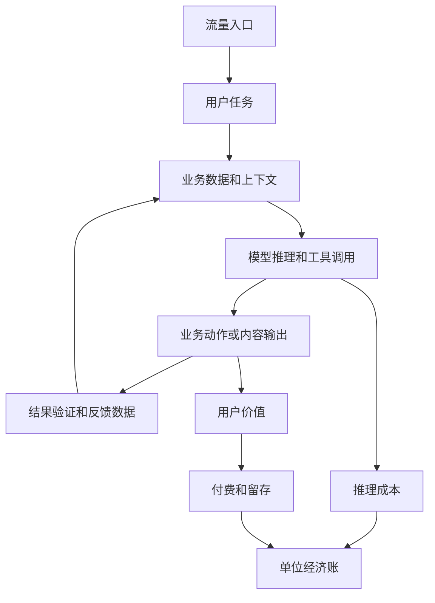

# AI 应用层泡沫、成本结构与长期机会调研主题

调研日期：2026-05-17  
主题来源：

- 视频观点：围绕“字节砍掉 30% AI 项目”传闻，讨论 AI 应用层泡沫、推理成本和传统移动互联网打法失效。
- 评论 1：AI 应用边际成本高，很多应用只是调模型接口，传统后端护城河仍在架构、数据建模和高可用经验。
- 评论 2：ToB AI 正在项目制和定制化，标准产品收益下降，未来机会可能在行业级、端侧和硬件绑定产品。

## 一句话结论

这个主题不能沉淀成“AI 应用层完蛋了”这种粗糙判断。更准确的研究命题是：

```text
AI 应用层正在从“冲 DAU 和讲故事”进入“算单位经济账、看业务闭环、看数据和流程壁垒”的阶段。
```

危险的不是所有 AI 应用，而是这类应用：

- 没有入口。
- 没有独占数据。
- 没有业务流程控制点。
- 没有可验证结果。
- 没有付费闭环。
- 没有推理成本控制。
- 只是把大模型 API 包成聊天框。

真正值得长期跟踪的不是“哪个大厂又砍项目”，而是：

```text
哪些 AI 应用能把每一次推理成本，稳定转化成用户愿意付费的业务结果？
```

## 事实层与传闻层分离

这次主题的起点是“字节砍掉 30% AI 项目”的传闻。当前不能把传闻当作事实。

| 信息 | 当前状态 | 调研处理方式 |
| --- | --- | --- |
| 某大厂砍掉 30% AI 应用项目 | 公开信息层面仍偏传闻 | 作为行业情绪样本，不作为定量结论 |
| 2025 年 AI 推理成本超 80 亿 | 需继续核验 | 不进入事实判断，只进入待验证问题 |
| 推理成本是营收 2.3 倍 | 需继续核验 | 需要找到财报、内部口径或可靠报道 |
| 原计划新增 3 个千万 DAU 产品全失败 | 需继续核验 | 需要拆具体产品、DAU、留存和商业化 |
| 字节 AI 产品线有整合和调整 | 有公开报道讨论，但细节不稳定 | 可作为后续案例研究入口 |
| 豆包大模型 token 调用量巨大 | 有公开报道提及 | 只能说明使用量，不等于亏损结论 |

研究底线：

```text
传闻可以作为问题线索，不能作为结论证据。
```

## 综合判断

【核心判断】

✅ 值得做：把“AI 应用层经济性”升级为长期调研主题。  
原因：它直接关系到未来 Agent 产品、企业 RAG、垂直工作流、硬件 AI 和开发者工具的真实商业边界。

❌ 不值得做：围绕某个传闻做情绪化判断。  
原因：传闻数字未核验，且单个大厂项目调整不能代表整个 AI 应用层。

【关键洞察】

- 数据结构：AI 应用不是 `用户输入 -> 模型输出`，而是 `入口 -> 数据 -> 上下文 -> 模型/工具 -> 业务动作 -> 反馈 -> 成本/收入`。
- 复杂度：很多 AI 应用的复杂度不是来自模型，而是来自权限、状态、流程、评估、交付和成本控制。
- 风险点：传统移动互联网的“免费冲 DAU，再慢慢变现”在 AI 应用上可能变成“用户越多亏越多”。
- 机会点：真正机会不只是视频里说的三类，还应增加“垂直工作流控制点”。

## 正确的数据结构

这类问题不能用“应用层 vs 模型层”这种二分法看。正确结构至少有五层：



核心问题不是“有没有 AI”，而是这条链路是否闭合：

```text
任务价值 > 推理成本 + 检索成本 + 工具成本 + 交付成本 + 获客成本
```

如果这个公式长期不成立，DAU 越高，问题越大。

## 三条原视频方向的修正

### 1. 模型 + 流量入口

这个方向成立，但主要是大厂游戏。

优势：

- 有分发入口。
- 有模型调用规模。
- 有账号、支付、内容、办公或云生态。
- 可以通过模型路由和基础设施摊薄成本。

风险：

- 投入巨大。
- 入口竞争激烈。
- 如果产品只是通用助手，容易被系统级入口或平台级入口吞掉。

后续调研重点：

- 搜索、浏览器、手机、办公套件、开发工具、云平台这几类入口如何嵌入 AI。
- 入口型 AI 产品是否真的提升留存和付费，而不是只提升调用量。
- 入口方如何做模型路由、缓存、端云协同和成本摊销。

### 2. 垂直数据壁垒

这是最值得跟踪的方向，但“有数据”不等于“有壁垒”。

弱数据壁垒：

- 爬来的公开网页。
- 行业 PDF 堆积。
- 普通知识库。
- 没有标签、没有反馈、没有权限边界的数据。

强数据壁垒：

- 独占或难获取的数据。
- 持续更新的数据。
- 带业务标签的数据。
- 和真实流程绑定的数据。
- 有反馈闭环的数据。
- 有合规和权限门槛的数据。

更准确的表达应该是：

```text
垂直数据 + 工作流 + 反馈闭环 + 分发渠道
```

只有数据，没有工作流，很容易变成“更聪明的搜索框”。

### 3. 硬件 + AI 绑定

这个方向成立，但不是所有 AI 应用的终局。

适合硬件绑定的场景：

- 手机、AI PC、车载系统。
- 智能眼镜、可穿戴设备。
- 机器人、工业设备。
- 医疗影像和检测设备。
- 摄像头、麦克风、传感器强相关场景。

核心价值：

- 低延迟。
- 隐私和离线能力。
- 感知真实世界。
- 与物理动作或现场决策绑定。

边界：

- 企业知识库、代码生成、法务合同、财务审计、客服工单、销售运营等场景，主要绑定的是数据和流程，不是硬件。

更准确的终局判断：

```text
端侧负责实时感知、隐私和低延迟。
云端负责强推理、大上下文和复杂工具调用。
企业私有环境负责敏感数据、权限和合规流程。
```

## 需要补上的第四个方向：垂直工作流控制点

视频里提到的三条方向还不够。长期看，还必须单独跟踪：

```text
AI + 垂直工作流控制点
```

这类产品不是回答问题，而是接管或加速具体业务动作。

例子：

| 场景 | 低价值 AI 形态 | 高价值 AI 形态 |
| --- | --- | --- |
| 客服 | 回答常见问题 | 查订单、退货、建工单、升级人工、留审计 |
| 法务 | 总结合同 | 标风险、给依据、生成修改意见、保留审查链 |
| 销售 | 生成话术 | 读 CRM、判断阶段、生成跟进动作、更新记录 |
| 研发 | 代码补全 | 理解仓库、改代码、跑检查、提交 PR |
| 财务 | 解释报表 | 对账、找异常、生成凭证建议、走审批 |
| 企业 RAG | 问答聊天 | 权限检索、引用溯源、任务触发、结果评估 |

判断标准：

```text
用户不用它，工作是否会明显变慢？
它做完的结果，是否能被验证？
它是否嵌入了原本的业务系统？
```

如果答案是否定的，大概率只是一个可有可无的 AI 工具。

## 两条评论的沉淀

### 评论 1：成本、套壳和后端护城河

评论里的正确部分：

- AI 应用确实有明显变量成本。
- 用户越多，token 消耗越多，不能套用传统 SaaS 的低边际成本假设。
- 很多 AI 应用只是模型 API 包装，缺少真正产品壁垒。
- 后端能力仍然重要，尤其是架构、数据建模、高可用和业务抽象。

需要修正的部分：

- AI 应用边际成本不是完全不可下降。模型路由、缓存、上下文裁剪、RAG 优化、小模型承接、批处理、端侧推理都能降低成本。
- ReAct 不是简单“循环调 AI”就能概括。它的工程价值取决于工具边界、状态管理、失败恢复和可观测性。
- AI 应用工程不只是调接口。真正难点在业务数据、权限、状态、评估、成本和系统集成。

长期研究启发：

```text
后端工程师的优势不会消失，但必须从“写接口”升级到“设计 AI 参与的业务系统”。
```

### 评论 2：ToB 项目制、标准化下降和行业化

评论里的正确部分：

- ToB AI 很容易变成人力密集型定制项目。
- 企业需求差异大，通用标准产品匹配度有限。
- 行业级产品比全行业通吃更现实。
- 端侧和硬件绑定会成为重要方向。

需要修正的部分：

- 标准化不是消失，而是下沉到模型、数据连接器、权限、审计、评估、部署、Agent runtime 等底层和中间层。
- 硬件绑定是重要分支，不是唯一终局。
- ToB AI 的关键不是“做不做定制”，而是每次定制后有没有沉淀成可复用产品能力。

长期研究启发：

```text
ToB AI 公司的危险信号，是从产品公司退化成项目公司。
```

## AI 应用分层地图

| 类型 | 机会 | 主要风险 | 核心验证指标 |
| --- | --- | --- | --- |
| C 端通用助手 | 入口大、频次高 | 同质化、成本高、付费弱 | 留存、付费转化、单次任务毛利 |
| C 端内容工具 | 需求明确、传播快 | 替代品多、价格下压 | 生成质量、复购、订阅率 |
| ToB 企业知识库/RAG | 需求真实、数据可绑定 | 交付重、准确率和权限难 | 命中率、引用准确率、部署成本 |
| 垂直工作流 Agent | 业务价值高 | 集成复杂、责任边界重 | 节省工时、错误率、流程完成率 |
| 开发者工具/代码 Agent | 用户付费强、结果可验证 | 工程复杂、上下文成本高 | PR 成功率、修复率、开发耗时下降 |
| 行业 AI 产品 | 数据和流程壁垒强 | 市场窄、销售周期长 | 客户 ROI、续费率、交付复用率 |
| 硬件 + AI | 端侧体验强、入口可控 | 供应链和硬件周期重 | 设备活跃、端侧任务成功率 |
| AI 基础设施 | 横向复用 | 竞争激烈、容易被平台吸收 | 开发者采用、调用量、切换成本 |

## 长期调研问题清单

### 事实核验

1. “字节砍掉 30% AI 项目”是否有可靠信源？
2. “2025 年 AI 推理成本超 80 亿”对应哪个口径？是模型训练、推理、云资源，还是整体 AI 投入？
3. “成本是营收 2.3 倍”里的营收指什么？AI 应用收入、云收入、广告收入，还是内部估算？
4. “3 个千万 DAU 产品失败”分别是哪几个产品？失败标准是 DAU、留存、收入还是战略调整？

### 商业模式

1. AI 应用的单位经济账应该如何建模？
2. 哪些 AI 应用适合免费获客，哪些一开始就必须收费？
3. DAU 对 AI 应用是否仍然是好指标？什么时候 DAU 是虚假繁荣？
4. AI 应用如何从“调用量增长”转成“毛利增长”？
5. ToB AI 产品的实施成本如何定价和回收？

### 工程系统

1. 哪些成本控制手段最有效：模型路由、缓存、裁剪上下文、RAG、端侧、小模型、批处理？
2. Agent 循环的成本如何度量？一次任务应该允许几次模型调用？
3. 如何设计 AI 工作流的状态、失败恢复和人工接管？
4. 如何把评估体系嵌进产品，而不是上线后靠用户报错？
5. 如何让每个企业客户定制变成产品资产，而不是维护债务？

### 壁垒判断

1. 什么数据是真壁垒，什么只是资料堆积？
2. 垂直 AI 产品如何建立反馈闭环？
3. 工作流控制点比数据壁垒更重要吗？
4. 硬件入口能否形成持续护城河，还是会被手机和操作系统吞掉？
5. 模型能力持续商品化后，应用层还能靠什么留下利润？

## 调研方法

第一阶段：信源核验。

- 收集原视频、报道、公司回应、公开财报和产品线变化。
- 所有数字标注来源和口径。
- 传闻只进“问题线索”，不进“事实结论”。

第二阶段：案例库。

优先选这些类型：

- 大厂通用 AI 助手和入口型产品。
- ToB 企业 RAG 和知识库产品。
- 代码 Agent 和开发者工具。
- 法务、客服、销售、财务等垂直工作流产品。
- AI 硬件和端侧产品。

每个案例至少记录：

```text
产品：
目标用户：
核心任务：
入口：
数据壁垒：
工作流深度：
模型依赖：
成本结构：
收费方式：
留存或商业化证据：
是否项目制交付：
当前判断：
```

第三阶段：单位经济模型。

先做一个简单模板，不要上来搞复杂财务模型：

```text
单次任务毛利 =
任务价格
- 模型推理成本
- 检索和存储成本
- 工具/API 调用成本
- 人工复核成本
- 交付和客服成本摊销
- 获客成本摊销
```

第四阶段：工程模式提炼。

从案例中总结可复用模式：

- 成本控制模式。
- 数据闭环模式。
- ToB 配置化模式。
- 工作流嵌入模式。
- 端云协同模式。
- 评估和审计模式。

## 判断 AI 应用是否值得做的清单

不要问：

```text
是不是 AI？
有没有 Agent？
DAU 能不能冲起来？
```

要问：

```text
1. 它解决的是高频任务，还是低频尝鲜？
2. 用户是否愿意为结果付费？
3. 单次任务价值是否覆盖推理和交付成本？
4. 输出结果能不能验证？
5. 它是否接入真实业务系统？
6. 它是否拥有难复制的数据或反馈闭环？
7. 它是否能沉淀工作流控制点？
8. 它的成本是否能随规模下降？
9. 它是否需要大量人力定制？
10. 每新增一个客户，是增加资产，还是增加维护债？
```

## 后续研究输出建议

1. 建立一份 `AI 应用单位经济账` 模板，专门记录 token 成本、模型路由、单任务收入和毛利。
2. 拆 5 个入口型 AI 产品：搜索、办公、手机、浏览器、开发者工具。
3. 拆 5 个垂直工作流产品：客服、法务、销售、财务、代码 Agent。
4. 拆 3 个 AI 硬件案例：手机/PC、眼镜、机器人或工业设备。
5. 单独研究 ToB AI 项目制风险：交付复用率、配置化边界、客户定制债务。
6. 做一个最小实验：同一任务分别用大模型直答、RAG、小模型路由、缓存策略执行，比较成本和质量。

可直接用于 ChatGPT Pro Deep Research 的完整提示词见：

- [AI 应用层经济性与物理 AI Deep Research 提示词](./2026-05-17-ai-application-layer-deep-research-prompt.md)

## 当前结论

“字节砍 30% AI 项目”即使最后被证明不准确，它仍然暴露了一个真问题：

```text
AI 应用不能再只讲增长故事，必须回答单位经济账。
```

AI 应用层不会整体消失，但会分化：

- 套壳聊天框会被淘汰。
- 只靠免费 DAU 的项目会被压缩。
- 没有复用内核的 ToB 项目会退化成外包。
- 绑定入口、数据、流程、硬件或工作流控制点的产品会继续存在。

对本仓库后续研究来说，这个主题应该长期跟踪，因为它能反过来校准 Agent 技术学习路线：

```text
不要为了多 Agent、复杂 orchestration 或漂亮 demo 学技术。
要看这些技术是否能降低成本、提高可验证结果、接入真实流程，并形成可复用产品能力。
```

## 参考来源

- 用户转述的视频核心观点和两条评论，记录于 2026-05-17。
- 新浪财经相关报道：<https://finance.sina.com.cn/stock/t/2026-05-11/doc-inhxppic1845467.shtml>
- 每经网关于豆包大模型 token 使用量报道：<https://www.nbd.com.cn/articles/2026-04-02/4321922.html>
