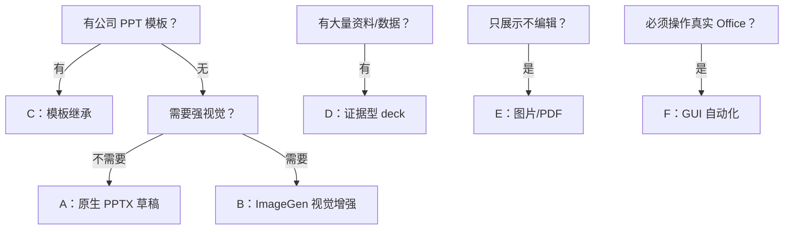

# AI 生成 PPTX 实践 SOP：按 Agent / Skill 选路线

日期：2026-05-23

目标：沉淀一套可复用的 AI 生成 PPTX 实践流程。重点不是“一句话生成漂亮 PPT”，而是稳定产出可打开、可编辑、可审查、可迭代的 `.pptx`。

## 一句话结论

好的 PPTX 生成流程不是让模型一次吐成品，而是：

```text
资料理解 -> 大纲确认 -> 风格/模板确认 -> 资产生成 -> PPTX 组装 -> 渲染验收 -> 人工交付
```

真正的 PPTX 交付物必须保留原生对象：标题、正文、页脚、表格、图表尽量可编辑；图片只负责视觉资产。把整页生成成图片再塞进 PPT，是坏结构。看起来快，后面改字就是灾难。

## 适用范围

适合：

- 内部汇报、研究复盘、方案介绍、产品说明、培训课件。
- 需要 `.pptx`，且后续还会改文字、换图片、调版式。
- 需要把流程沉淀成可重复实验。

不适合：

- 只要宣传图、海报或一次性展示图。
- 没有模板文件，却要求极高品牌保真。
- 需要零人工审阅就对外发送的高风险材料。

## 核心原则

1. 先确认内容，再做视觉。
2. 文本必须留在 PPT 原生对象里。
3. ImageGen 负责视觉资产，不负责正文排版。
4. Presentations / Slides 负责 PPTX 结构化生成、渲染和导出。
5. 未渲染验收，只能说“已生成”，不能说“可交付”。

## 先选执行主体

| 需求 | 推荐路线 |
|---|---|
| 只要大纲或文案 | 普通聊天模型 |
| 要真实可编辑 PPTX | Codex + Presentations / Slides |
| 要强视觉风格 + 可编辑 PPTX | Codex + ImageGen skill + Presentations / Slides |
| 要继承公司模板或历史 deck | Codex + Presentations 模板编辑 |
| 要从资料包生成证据型 deck | 研究 agent / Codex + Presentations |
| 只要整页图片或 PDF 展示 | ImageGen / 多模态生成工具，可选 Codex 打包 |
| 必须操作 PowerPoint / Keynote | GUI / 桌面自动化 agent |

如果标题里已经写清楚 agent / skill，后文就不要反复解释“为什么普通聊天模型不行”。那是废话。

## 方案选择表

| 方案 | 适合场景 | 产物 | 速度 | 主要风险 |
|---|---|---|---:|---|
| A. Codex + Presentations：原生 PPTX 快速草稿 | 内容清楚，视觉要求普通 | 可编辑 PPTX | 快 | 模板感重 |
| B. Codex + ImageGen + Presentations：视觉增强 PPTX | 需要更强视觉，同时保留可编辑文本 | 可编辑 PPTX + 独立素材 | 中 | 图片吞掉文字可编辑性 |
| C. Codex + Presentations 模板编辑：旧 PPT / 模板继承 | 有公司模板、历史 deck、客户模板 | 模板化 PPTX | 中 | 破坏母版或页眉页脚 |
| D. 研究 agent / Codex + Presentations：资料包证据型 deck | 有 PDF、Excel、会议纪要、调研材料 | 带来源的分析 deck | 慢 | 数字、引用、来源出错 |
| E. ImageGen：图片 / PDF 快速展示 | 只展示，不要求编辑 | 图片或 PDF，可选打包 PPTX | 快 | 被误当作可编辑 PPTX |
| F. GUI agent：Office 自动化路线 | 必须操作真实 PowerPoint / Keynote | Office 生成文件 | 慢 | GUI 脆弱、权限和覆盖风险 |



## 通用输入模板

```text
1. 主题：
2. 目标受众：
3. 页数：
4. 使用场景：
5. 必须包含：
6. 不要包含：
7. 视觉风格：
8. 交付要求：PPTX / PDF / 图片；文本是否可编辑；是否有模板。
```

缺这些字段就直接开跑，结果大概率是碰运气。

## 统一验收标准

最低验收：

- `.pptx` 能在 PowerPoint 或 Keynote 打开。
- 标题、正文、页脚是可编辑文本，不是整页截图。
- 图片、图标、背景可以单独替换。
- 中文没有明显溢出、遮挡、截断。
- 页面风格一致。
- 数字、引用、表格能追溯来源。

更高一级验收：

- 生成每页 PNG 预览或 contact sheet。
- 检查缩略图叙事节奏，不是每页同构卡片。
- 每页有明确 claim。
- 图表尽量是原生图表或可编辑表格。
- 记录失败点，用于下一轮提示词修正。

## 统一测试主题

```text
主题：AI Agent Fieldbook 路线图
受众：内部学习小组成员
页数：8 页
场景：10 分钟内部分享
核心内容：
1. 为什么要系统学习 AI Agent
2. 学习阶段：OpenAI 官方栈、Anthropic/Claude、真实应用场景、开源项目拆解、自己做小产品
3. Agent 的关键能力：工具调用、状态管理、记忆、评估、追踪、人审
4. 风险：多 Agent 过早复杂化、工具权限失控、只收藏资料不消化、没有评估
5. 下一步实验：做一个最小可运行 Agent lab
交付要求：输出原生 PPTX，中文文本可编辑，图标和图片可替换。
```

后面的测试提示词默认发给方案标题里标注的 agent / skill。发给普通聊天模型，只能得到大纲或提示词草案，不能算生成了 PPTX。

## 方案 A：Codex + Presentations 原生 PPTX 快速草稿

适合：内容比视觉重要，目标是快速得到可编辑初稿。

不适合：品牌要求高、封面/插画/营销质感要求高的 deck。

SOP：

1. 输入主题、受众、页数、交付要求。
2. 先生成每页大纲和 claim，不生成 PPTX。
3. 人工确认大纲。
4. 用 Presentations / Slides 生成原生 PPTX。
5. 渲染预览，检查中文溢出、字体、遮挡。
6. 修改最差的 2 到 3 页。
7. 导出最终 PPTX。

测试提示词：

```text
请为“AI Agent Fieldbook 路线图”生成一份 8 页中文 PPTX 初稿。

第一步只输出每页大纲和核心 claim，不要生成 PPTX，等我确认后再继续。

受众：内部学习小组成员。
场景：10 分钟内部分享。
风格：清晰、克制、技术学习型，不要营销感。

必须包含：
1. 为什么要系统学习 AI Agent
2. 学习阶段：OpenAI 官方栈、Anthropic/Claude、真实应用场景、开源项目拆解、自己做小产品
3. Agent 的关键能力：工具调用、状态管理、记忆、评估、追踪、人审
4. 风险：多 Agent 过早复杂化、工具权限失控、只收藏资料不消化、没有评估
5. 下一步实验：做一个最小可运行 Agent lab

确认大纲后，请用 Presentations / Slides 生成原生 PPTX。
要求：8 页，16:9，中文文本可编辑；不要把整页做成图片；生成后渲染预览并修正明显溢出、遮挡和字体问题。
```

验收重点：文字可编辑、每页有 claim、版式不机械重复、中文不溢出。

## 方案 B：Codex + ImageGen + Presentations 视觉增强 PPTX

适合：需要更强视觉表现，同时仍要交付可编辑 PPTX。

不适合：只要快速内部草稿。这个路线比方案 A 慢。

SOP：

1. Codex 生成大纲和每页内容，人工确认。
2. ImageGen 生成 3 套风格板，每套一张 8 页缩略图。
3. 人工选择风格。
4. Codex 输出视觉素材清单，区分 ImageGen 素材和 PPT 原生对象。
5. ImageGen 生成独立视觉素材。
6. Presentations 组装 PPTX，文本和图表保持原生对象。
7. 渲染验收并迭代最差页面。

测试提示词：

```text
请为“AI Agent Fieldbook 路线图”做一份 8 页左右 PPT。

第一步：先输出每页大纲、标题、核心 claim、主要内容和建议视觉表达，不生成 PPTX。

第二步：大纲确认后，调用 ImageGen 生成 3 套视觉风格板。每套风格板用一张图展示完整 8 页缩略图：
1. 技术白皮书风
2. 清爽产品界面风
3. 深色工程系统风

第三步：我选择风格后，先输出视觉素材清单。每个素材标注名称、页码、类型、是否需要 ImageGen、是否应改用 PPT 原生对象、建议文件名和提示词草案。

硬性边界：
- 标题、正文、页脚、图表标签必须是 PPT 原生文本。
- 流程图、箭头、卡片、表格优先用 PPT 原生形状。
- ImageGen 只负责封面图、背景、图标、插画、装饰元素。

第四步：素材清单确认后，再生成独立素材。

第五步：素材确认后，用 Presentations / Slides 组装可编辑 PPTX，渲染预览并修正中文溢出、遮挡、字体替换和元素不可编辑问题。
```

验收重点：文本没有被烘焙进图片；图片只是资产；风格和风格板一致；素材清单方便替换。

## 方案 C：Codex + Presentations 模板编辑旧 PPT / 模板继承

适合：已有公司模板、历史 deck、客户指定模板，需要沿用母版、页眉页脚、品牌色、字体和版式。

不适合：没有模板、只想快速探索内容结构。

SOP：

1. 收集模板 PPTX 或历史 deck。
2. 审计模板：页数、母版、页面类型、字体、颜色、页眉页脚。
3. 建立新 deck 页面到模板页面的映射。
4. 复制模板页，在副本上替换文本、图表和图片。
5. 保留原模板布局语法，不随意重绘。
6. 渲染预览，对比模板保真度。
7. 输出 PPTX 和偏离说明。

测试提示词：

```text
我会提供一个公司历史 PPTX 作为模板。

请基于这个模板制作一份 8 页中文 PPTX：
主题：AI Agent Fieldbook 路线图。
受众：内部学习小组成员。

执行方式：
1. 先审计模板，列出可复用页面类型、母版、字体、颜色、页眉页脚、图表样式。
2. 输出页面映射表：新 deck 每页分别复用模板里的哪一页。
3. 等我确认映射后，再复制模板页并编辑内容。
4. 不要从空白页重建，不要破坏模板母版。
5. 最终输出原生 PPTX，文本、表格、图表尽量可编辑。
6. 输出前渲染预览，并说明哪些地方偏离了模板。
```

验收重点：母版/页眉/页脚保留；页面从模板复制编辑；有页面映射和偏离说明。

## 方案 D：研究 Agent / Codex + Presentations 资料包证据型 Deck

适合：输入是一堆资料，目标是生成分析型汇报、方案评审、研究结论 deck。

不适合：缺少资料、只想要视觉漂亮。证据型 deck 的第一性问题是事实，不是配色。

SOP：

1. 建立资料清单。
2. 提取事实、数字、引用和结论。
3. 先写 claim spine：整份 deck 的主线论证。
4. 把每页绑定到证据来源。
5. 生成图表和表格，保留来源说明。
6. 再进入 PPTX 设计和排版。
7. 渲染预览，做事实核查和视觉核查。

测试提示词：

```text
请基于我提供的资料包，制作一份 8 页中文证据型 PPTX。

主题：AI Agent Fieldbook 路线图。
受众：内部学习小组成员。
目标：说明为什么要系统学习 AI Agent，并给出下一步最小实验计划。

执行顺序：
1. 先读取资料，列出资料清单。
2. 提取关键事实、判断、风险和可引用依据。
3. 输出 claim spine：每页一个 claim。
4. 给每页标注资料来源。
5. 等我确认 claim spine 后，再生成 PPTX。

交付要求：
- 输出原生 PPTX。
- 事实、数字、引用不得编造。
- 表格和图表尽量可编辑。
- 每页底部保留简短来源标注。
- 证据不足就标注“待补证据”，不要硬编。
```

验收重点：资料清单完整；每页 claim 可追溯；数字和引用准确；没有假来源。

## 方案 E：ImageGen 图片 / PDF 快速展示

适合：只需要展示，不需要改字，不需要后续维护。

不适合：任何要求“可编辑 PPTX”的正式交付。

SOP：

1. 先生成大纲。
2. 选择视觉风格。
3. 用 ImageGen 生成每页整页图片。
4. 可选：打包进 PPTX 或 PDF。
5. 明确标记限制：文字不可编辑，图表不可编辑。

测试提示词：

```text
请为“AI Agent Fieldbook 路线图”生成一套 8 页演示图片。

注意：这次只做快速展示，不要求文字可编辑。

要求：
- 每页输出为 16:9 图片。
- 风格：清爽产品界面风。
- 中文要准确、简洁，不要塞满文字。
- 可以把 8 张图片放入 PPTX 或 PDF，方便展示。

交付说明必须写明：这不是可编辑 PPTX，文字和图表后续不能直接编辑。
```

验收重点：不可编辑限制是否写清；中文是否错误；图片是否满足展示；不会被误当作正式 PPTX。

## 方案 F：GUI Agent Office 自动化路线

适合：必须使用本机 PowerPoint / Keynote 的真实功能，例如复杂模板、特定导出格式、Office 兼容性验证。

不适合：默认方案。它脆弱、慢、依赖 GUI 状态，还需要强人工验收。

SOP：

1. 明确目标软件：PowerPoint 还是 Keynote。
2. 准备模板或源文件。
3. 先规划页面和修改动作，不直接操作。
4. 人工确认后再执行桌面操作。
5. 每完成关键步骤保存副本。
6. 导出前人工预览。
7. 记录步骤，方便复现。

测试提示词：

```text
请使用本机 PowerPoint / Keynote 自动化方式，基于指定模板生成一份 8 页 PPTX。

主题：AI Agent Fieldbook 路线图。
受众：内部学习小组成员。

执行要求：
1. 先列出操作步骤，不要马上操作软件。
2. 等我确认后，再打开模板文件并复制页面。
3. 替换文本、图片和图表时保留模板样式。
4. 每完成 2 页保存一个副本。
5. 最后导出 PPTX，并提醒我人工打开检查。

限制：
- 不要删除源文件、覆盖模板、发送邮件、上传外部服务。
- 如果出现软件弹窗或权限请求，先停下来让我确认。
```

验收重点：源模板受保护；保存副本；高风险动作有人审；最终文件能在 Office 中打开。

## 推荐实验矩阵

第一轮只跑 3 个最有价值的方案：

| 实验 | 方案 | 目标 | 验收 |
|---|---|---|---|
| Lab 1 | A | 验证纯原生 PPTX 草稿质量 | 文本可编辑、无明显溢出、8 页结构稳定 |
| Lab 2 | B | 验证风格板 + 视觉素材路线 | 风格一致、素材可替换、文本仍可编辑 |
| Lab 3 | C | 验证模板继承能力 | 母版保留、页面映射清楚、偏离可控 |

暂缓：

- D 需要真实资料包，否则测不出证据链质量。
- E 不是可编辑 PPTX 主线。
- F GUI 成本高，等确实需要 Office 兼容性再做。

## 复盘模板

```text
实验日期：
方案：
输入资料：
输出文件：
生成耗时：
是否成功打开 PPTX：
文本是否可编辑：
图片是否可替换：
图表是否可编辑：
中文是否溢出：
字体是否异常：
最差的 3 页：
失败原因：
下一轮提示词怎么改：
是否值得沉淀为 skill：
```

## 最小可复用提示词：总控版

```text
我要生成一份 8 页中文 PPTX。

主题：AI Agent Fieldbook 路线图。
受众：内部学习小组成员。
场景：10 分钟内部分享。

请按以下流程执行：
1. 第一阶段只输出每页大纲、核心 claim、主要内容和建议视觉表达，不生成 PPTX。
2. 等我确认大纲后，再根据我选择的方案继续。
3. 如果走纯 PPTX 路线，用 Codex + Presentations / Slides 生成原生 PPTX。
4. 如果走视觉增强路线，用 Codex + ImageGen + Presentations：先生成 3 套风格板，再输出素材清单，确认后生成素材并组装 PPTX。
5. 如果走模板路线，用 Codex + Presentations 模板编辑：先审计模板并输出页面映射表，确认后复制模板页编辑。

硬性要求：
- 标题、正文、页脚必须是可编辑文本。
- 不要把整页作为图片塞进 PPT。
- 图片只作为视觉素材，必须可单独替换。
- 生成后渲染预览，检查中文溢出、遮挡、字体替换。
- 无法验证的地方写入未验证事项。
```

## 风险清单

| 风险 | 表现 | 处理方式 |
|---|---|---|
| 死图 PPT | 每页是一张图片，文字不能改 | 禁止整页图片；验收时尝试选择文本 |
| 文本烘焙进素材 | PNG 图里带正文文字 | 正文必须原生文本 |
| 风格漂移 | 每页像不同模板 | 先生成风格板，锁定设计 token |
| 中文溢出 | 文本超框、遮挡图表 | 必须渲染预览；必要时减字 |
| 模板破坏 | 母版、页眉页脚丢失 | 复制模板页编辑，不从空白重建 |
| 事实编造 | 数字和引用无来源 | 证据型 deck 必须有资料清单和页脚来源 |
| 过度复杂 | 上来就做万能 PPT Agent | 先跑固定 8 页最小实验 |

## 当前未验证事项

- 本文是 SOP 草案，尚未实际运行 Lab 1 / Lab 2 / Lab 3。
- Presentations / Slides 的具体生成质量需要用真实输出 PPTX 验证。
- ImageGen 风格板路线尚未用本仓库真实输出 PPTX 复验，不能预设每个元素都可编辑。
- Office 自动化路线未实测，暂时只作为备用路线。
