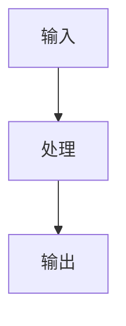

# 知识标题

## 一句话结论

这个主题最重要的判断是什么。

## 核心模型

说明核心概念、数据结构或流程。

```mermaid
flowchart TD
    A[输入] --> B[处理]
    B --> C[输出]
```

## 适用场景

- 

## 不适用场景

- 

## 常见误区

- 

## 与其他主题的关系

- 

## 来源

- 

## 未验证事项

- 
