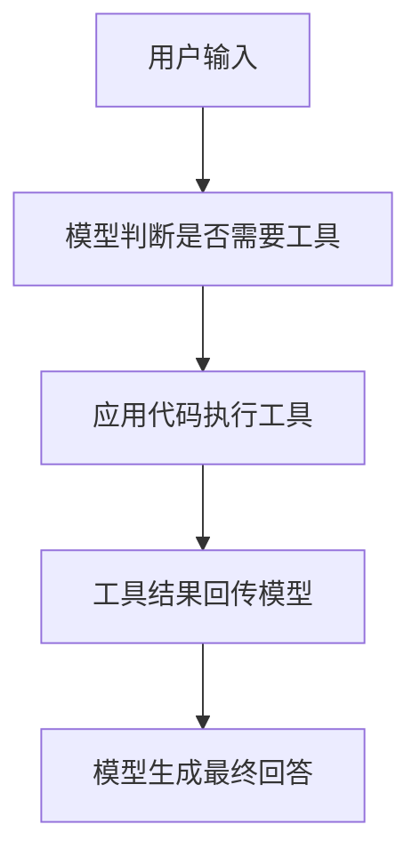

# AI 学习与实验原则

这是 AI 主题的学习和实验原则。仓库级生命周期规则见根目录 `README.md` 和 `AGENTS.md`。

## 先学数据结构，不要先迷信框架

Agent 系统的核心不是“模型很聪明”，而是这些东西的关系：

- 用户输入
- 指令
- 工具定义
- 工具调用参数
- 工具返回值
- 会话状态
- 中间步骤 trace
- 最终输出
- 评估样本

如果这些数据结构没弄清楚，多 Agent 只会把混乱放大。

## 判断一个 Agent 是否值得做

每个实验开始前先问三个问题：

1. 这是现实问题，还是为了用 Agent 而用 Agent？
2. 能不能用更简单的脚本、规则、检索或普通 API 解决？
3. 失败会破坏什么？

如果一个任务没有工具、没有状态、没有不确定性，通常不需要 Agent。

## 学习验收标准

一个模块学完，不是“看过文档”，而是满足这些条件：

- 能用一句话说明它解决什么问题。
- 能写出一个最小实验。
- 能解释它的失败模式。
- 能知道什么时候不该用它。
- 能在 trace 或日志里看到它真实发生了什么。

## 写给人看

学习笔记、复盘和实验说明要写得通俗，不要把官方术语原样堆上去。

写作要求：

- 先用一句人话说明问题，再解释 API、参数和框架名。
- 复杂流程用步骤拆开；如果步骤超过三步，优先加 Mermaid 图。
- 每个关键概念尽量配一个小例子。
- 明确写出“适合什么、不适合什么、哪里还没验证”。

复杂逻辑默认用这种结构：

## 不做的事

- 不为了炫技先做多 Agent。
- 不在没有评估样本时说系统“可靠”。
- 不把业务逻辑藏在长 prompt 里。
- 不让 Agent 直接执行高风险动作。
- 不把官方文档、框架 demo、真实生产架构混为一谈。
