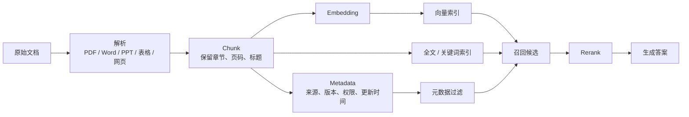
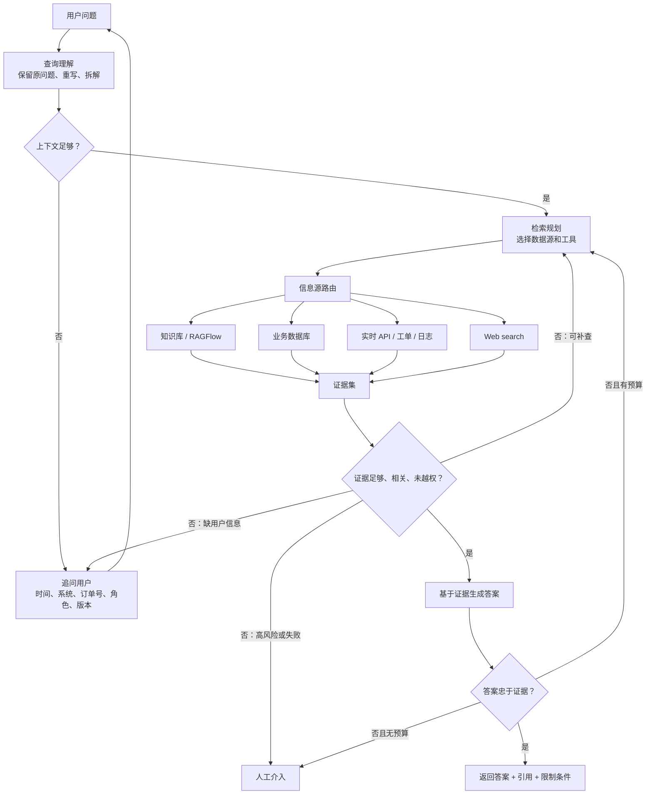
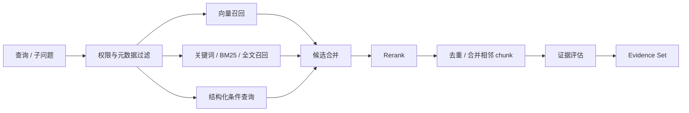
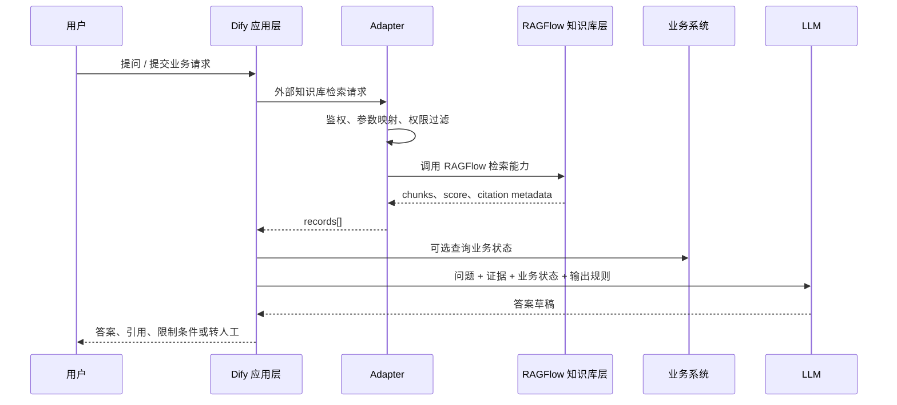

# Agentic RAG 从基础到企业级实践

> 校准日期：2026-05-16
> 定位：面向企业知识库、客服、技术支持、法务、财务、运维等真实场景的 Agentic RAG 学习与实践手册。
> 边界：本文基于本仓库已有 RAG 笔记、OpenAI 检索实验、RAGFlow/Dify 专项资料和官方文档校准整理；没有声称已经本地跑通 RAGFlow、Dify 或新的 API 实验。

## 0. 核心判断

企业级 RAG 的主线不是传统 RAG，而是 Agentic RAG。

传统 RAG 做的是：

```text
文档 -> chunk -> embedding/index -> retrieve -> rerank -> generate
```

这条链路是底座，但它只解决“把资料找出来再让模型回答”的问题。真实企业问题更脏：

- 用户问题经常含糊、省略、带指代。
- 证据分散在文档、数据库、工单、日志、API、网页和人工经验里。
- 权限、版本、密级、适用范围会直接影响能不能检索和能不能回答。
- 答案要可引用、可审计、可回归评测。
- 失败时不能胡编，必须追问、重试、拒答或转人工。

所以更准确的定义是：

> Agentic RAG 是一个带状态的检索决策系统。它把检索作为 Agent 可选择的能力之一，在查询理解、检索规划、信息源路由、证据评估、答案生成、反思重试和人工介入之间建立闭环。

如果只是把传统 RAG 包进一个 Agent 壳，然后继续让所有问题走 `retrieve -> generate`，那不是企业级架构，只是换了个时髦名字。

## 1. 传统 RAG 只是底座

传统 RAG 的价值在于把“长文档”改造成可检索的数据结构，而不是每次把整本文档塞给模型。它的基本链路如下：



这套链路里，核心数据不是“文件”，而是 `chunk + metadata + index + citation`。

| 数据 | 作用 | 企业级要求 |
| --- | --- | --- |
| `document` | 原始知识来源 | 有来源、责任人、版本、更新时间、密级 |
| `chunk` | 检索和生成的最小证据单元 | 保留标题、章节、页码、表格位置、上下文 |
| `embedding` | 语义检索索引 | 模型版本固定，切换后重建索引 |
| `keyword/full-text index` | 精确词、编号、条款、型号检索 | 和向量检索互补 |
| `metadata` | 过滤、权限、治理 | 用户身份必须能下推到检索层 |
| `citation` | 回到原文的证据链 | 能定位到文档、页码、chunk、版本 |

传统 RAG 的硬伤也很明显：

- 它默认用户问题已经适合检索。
- 它默认一个向量库就是唯一知识源。
- 它默认召回结果足够回答。
- 它不会判断证据是否冲突、过期、越权。
- 它不会在信息不足时追问用户。
- 它不会决定什么时候转人工。

因此，传统 RAG 适合做底层 retrieval capability，不适合作为完整企业系统的控制面。

## 2. Agentic RAG 的控制环

Agentic RAG 的重点不是“多几个 Agent”，而是把检索问答拆成可观察、可评估、可退出的控制流程。



这个控制环有几个关键点：

- 检索不是第一步，理解问题才是第一步。
- 向量库不是唯一工具，很多问题应该走结构化查询或实时 API。
- 证据评估在生成之前，不是生成完再找理由。
- 反思必须有重试预算，不能无限循环。
- 人工介入不是失败补丁，而是高风险场景的设计出口。

### 2.1 别把所有增强 RAG 混成一个词

Agentic RAG 是控制面，不是某一个检索技巧。很多论文、产品和教程会把不同模式混着讲，落地时要拆开：

| 模式 | 解决什么 | 和 Agentic RAG 的关系 |
| --- | --- | --- |
| Query Rewrite RAG | 原问题不适合检索 | 是 Agentic RAG 查询理解阶段的一种策略 |
| Routing RAG | 多知识库、多工具、多数据源选择 | 是 Agentic RAG 检索规划阶段的核心 |
| Corrective RAG | 检索结果差时修正查询或换检索策略 | 是证据评估后的补救路径 |
| Self-RAG | 生成前后自评是否需要检索、答案是否可信 | 可以作为反思/批判模块，但必须有退出条件 |
| Multi-hop RAG | 需要跨文档或多步证据组合 | 是复杂问题的检索执行策略 |
| GraphRAG / KG-RAG | 实体关系密集、需要图结构推理 | 是特定数据结构方案，不是默认必选项 |
| Multi-agent RAG | 多个 Agent 分工检索、分析、审查 | 只有工具权限和职责边界清楚时才值得上 |

好品味的做法是先把单 Agentic RAG 控制环跑清楚，再按失败模式补策略。不要一开始把 Self-RAG、GraphRAG、多 Agent、reranker、workflow 全塞进去。复杂性不是能力，复杂性通常只是还没想清楚。

## 3. 核心状态模型

Agentic RAG 必须显式保存状态。没有状态，系统就只能靠一堆 prompt 和 if/else 补洞。那种系统刚开始能 demo，进入生产就会乱。

一次请求可以抽象成这个状态对象：

```json
{
  "request_id": "rag_20260516_0001",
  "user": {
    "user_id": "u_123",
    "role": "support_engineer",
    "department": "after_sales",
    "permissions": ["kb:product_manual", "ticket:read"]
  },
  "original_query": "客户说又报那个 502，怎么处理？",
  "rewritten_query": "查询产品线上服务出现 HTTP 502 错误时的排查步骤和已知修复方案",
  "sub_questions": [
    "502 错误在产品手册或运维手册中的标准排查步骤是什么？",
    "最近是否存在相同错误的工单或故障记录？",
    "是否需要客户补充服务名、时间范围或请求 ID？"
  ],
  "missing_context": ["service_name", "time_range", "request_id"],
  "route_plan": [
    {
      "source": "knowledge_base",
      "purpose": "查标准处理流程",
      "top_k": 20,
      "rerank_top_n": 5
    },
    {
      "source": "ticket_system",
      "purpose": "查相似历史工单",
      "filters": {
        "error_code": "502"
      }
    }
  ],
  "selected_sources": ["knowledge_base", "ticket_system"],
  "retrieved_evidence": [
    {
      "evidence_id": "ev_001",
      "source": "knowledge_base",
      "doc_id": "ops_manual_v3",
      "title": "线上网关 502 排查手册",
      "chunk_id": "ops_manual_v3#p12#c03",
      "score": 0.87,
      "page": 12,
      "version": "v3.4",
      "updated_at": "2026-04-20",
      "permission": "internal_support",
      "text": "502 错误优先检查上游服务健康状态、网关超时配置和最近发布记录。"
    }
  ],
  "evidence_quality": {
    "relevant": true,
    "complete": false,
    "conflicting": false,
    "expired": false,
    "permission_ok": true,
    "next_action": "ask_clarifying_question"
  },
  "answer_draft": null,
  "critique_result": null,
  "retry_budget": {
    "max_attempts": 2,
    "used_attempts": 0
  },
  "handoff_reason": null,
  "audit_log": [
    "query_rewritten",
    "knowledge_base_retrieved",
    "ticket_system_queried",
    "missing_context_detected"
  ]
}
```

这里的状态不是形式主义。它决定了系统能不能回答几个生产问题：

- 用户投诉时，能不能知道系统到底查过什么？
- 回答错了，能不能定位是 query rewrite 错、召回错、rerank 错，还是生成错？
- 权限事故发生时，能不能证明某个 chunk 为什么被检索出来？
- 升级 embedding、reranker 或 prompt 后，能不能做回归对比？

## 4. 查询理解：不要直接检索原话

企业用户的问题通常不是干净的搜索 query。常见坏输入包括：

- 指代：“那个报错怎么修？”
- 省略：“客户又说打不开。”
- 混合任务：“把近三个月退货率上升原因找出来，再给个改进方案。”
- 权限相关：“我能不能看华东区这个客户合同？”
- 高风险动作：“按这个政策直接给客户退款。”

Agentic RAG 的第一步是查询理解，而不是向量检索。

| 能力 | 作用 | 例子 |
| --- | --- | --- |
| 查询重写 | 把口语化问题改成可检索问题 | “那个 502” -> “HTTP 502 错误排查步骤” |
| 查询拆解 | 把多步骤问题拆成子问题 | 先查退货率，再查原因，再查改进建议 |
| 缺失信息识别 | 判断是否需要追问 | 缺订单号、系统名、时间范围、地区 |
| 意图分类 | 决定走知识库、数据库、API 还是人工 | 制度解释走 RAG，余额查询走数据库 |
| 风险识别 | 判断是否允许自动处理 | 退款、支付、账号操作要人审 |

保留 `original_query` 很重要。不要把重写后的问题覆盖原问题。否则出了问题时，你不知道是用户问得烂，还是系统改写改歪了。

## 5. 检索规划与信息源路由

企业级 Agentic RAG 不应该默认只查向量库。向量库适合文档知识，不适合所有知识。

| 用户问题类型 | 应走数据源 | 工具形态 | 权限要求 | 失败处理 |
| --- | --- | --- | --- | --- |
| 制度、手册、FAQ、合同条款解释 | 知识库 / RAGFlow | hybrid retrieval + rerank | 文档级、chunk 级权限 | 证据不足则拒答或追问 |
| 订单状态、库存、账户余额 | 业务数据库 / API | structured query / function tool | 行级权限、租户隔离 | API 失败则明确降级 |
| 故障排查、售后支持 | 知识库 + 工单 + 日志 | 多工具路由 | 支持角色权限 | 缺服务名/时间则追问 |
| 法务合同审查 | 合同库 + 条款抽取 | 精确检索 + citation | 合同密级和项目权限 | 高风险结论转人工 |
| 财务报表问答 | PDF/表格 + 结构化计算 | RAG + 表格解析/计算工具 | 财务角色权限 | 数值不确定则不硬答 |
| 最新公开资料 | Web search | 搜索工具 | 来源可信度检查 | 标注外部来源和时间 |
| 医疗、法律、支付、账号变更 | 资料检索 + 人审 | human-in-the-loop | 强审批 | 不自动执行动作 |

路由的关键不是“查更多源”，而是选对源。把订单状态丢进向量库猜，是坏设计；把制度解释写 SQL 查，也同样别扭。

## 6. 多阶段检索：从候选到证据集

Agentic RAG 的检索不是一次 Top-K 就结束，而是一个多阶段过程。



多阶段检索要解决几个问题：

- 语义相似不等于业务正确。设备型号、合同编号、日期、金额、条款号经常需要精确匹配。
- 召回负责“别漏”，重排负责“排准”。不要为了省 rerank 直接召回 3 个，也不要拿 reranker 扫全库。
- 多跳问题需要多轮检索。第一个证据可能只告诉你应该继续查哪个制度、合同附件或历史工单。
- 最终给生成模型的不是“几个 chunk”，而是一组证据对象。

一个合格的 evidence set 至少要包含：

```json
{
  "evidence_set_id": "es_001",
  "query": "HTTP 502 错误排查步骤",
  "items": [
    {
      "source_type": "knowledge_base",
      "source_name": "RAGFlow",
      "doc_id": "ops_manual_v3",
      "title": "线上网关 502 排查手册",
      "chunk_id": "ops_manual_v3#p12#c03",
      "content": "502 错误优先检查上游服务健康状态、网关超时配置和最近发布记录。",
      "score": 0.87,
      "rank": 1,
      "page": 12,
      "version": "v3.4",
      "updated_at": "2026-04-20",
      "metadata": {
        "department": "support",
        "confidentiality": "internal",
        "product": "gateway"
      },
      "permission_checked": true
    }
  ]
}
```

证据对象里不要丢 `score`、`rank`、`metadata` 和 `citation`。丢了这些字段，表面还能回答，系统已经失去可解释性。

## 7. 证据评估是关键步骤

Agentic RAG 和普通 RAG 的分水岭，就是生成前有没有证据评估。

证据评估要问这些问题：

| 检查项 | 问题 | 失败处理 |
| --- | --- | --- |
| 相关性 | 证据真的回答了用户问题吗？ | 换 query、扩大召回、追问 |
| 完整性 | 是否缺关键条件、步骤或限制？ | 多跳补查或追问 |
| 冲突 | 不同文档是否给出不同答案？ | 展示冲突，说明版本和适用范围 |
| 时效 | 文档是否过期？ | 查最新版本，或提示资料过期 |
| 权限 | 当前用户是否能看到证据？ | 检索层过滤，不给模型 |
| 风险 | 是否涉及医疗、法律、财务、支付、账号？ | 限制回答或转人工 |
| 可引用 | 是否能定位到原文？ | 无引用则降低可信度或拒答 |

证据不足时，系统只有三条正路：

1. 继续检索，但受 retry budget 限制。
2. 追问用户，让用户补关键上下文。
3. 拒答或转人工，说明缺什么证据。

“证据不足但先编一个看起来像的答案”是生产事故，不是用户体验。

## 8. 生成与引用

生成阶段只应该使用通过证据评估的上下文。回答结构建议固定成四块：

```text
直接答案：
  给出结论或下一步操作建议。

依据：
  说明答案来自哪些证据，哪些条件必须满足。

引用：
  文档名、页码/章节、chunk、版本、更新时间。

限制条件：
  哪些信息缺失，哪些场景不适用，是否需要人工确认。
```

引用不是装饰。没有引用，用户无法判断答案到底来自资料、模型记忆还是幻觉。引用错段落也不是小问题，因为它会让错误答案看起来可信。

在高风险场景里，生成策略要更保守：

- 医疗：只能做资料检索辅助，不自动诊断、处方或治疗建议。
- 法务：可以引用合同条款和风险点，不自动给最终法律意见。
- 财务：数值、单位、期间、口径必须精确，不确定就不算。
- 支付/退款/账号：可以解释流程，不自动执行。

## 9. 反思、重试与退出条件

反思不是让模型“再想想”。反思必须绑定明确检查项：

- 答案是否直接回答了问题？
- 每个关键结论是否有证据支持？
- 是否遗漏了用户要求的时间、部门、地区、产品线？
- 是否使用了越权或过期资料？
- 是否需要补查结构化数据？
- 是否需要转人工？

重试也必须有预算：

```json
{
  "retry_budget": {
    "max_attempts": 2,
    "used_attempts": 1,
    "allowed_strategies": [
      "rewrite_query",
      "increase_top_k",
      "switch_to_keyword_search",
      "query_business_api",
      "ask_user"
    ],
    "stop_conditions": [
      "evidence_sufficient",
      "missing_user_context",
      "high_risk_action",
      "budget_exhausted"
    ]
  }
}
```

没有退出条件的 self-reflection 是成本炸弹。更糟的是，它会让系统在证据不足时反复生成不同版本的废话。

成本和延迟也要进入状态，而不是事后算账：

| 成本项 | 控制方式 |
| --- | --- |
| query rewrite | 简短模型或规则优先，复杂问题再调用强模型 |
| Top-K 召回 | 先扩大候选，但给 rerank 设置上限 |
| rerank | 只在小候选集上做，不扫全库 |
| 多源路由 | 先查最可信、最低成本源，失败再扩展 |
| 反思重试 | 固定最大次数，记录每次重试原因 |
| Web search | 只在内部资料不足或需要公开最新信息时触发 |
| 人工介入 | 高风险直接转人工，不让模型无限尝试 |

企业系统里，“更聪明”不是目标。“在成本、延迟、权限和可靠性约束下稳定回答”才是目标。

## 10. Human-in-the-loop

人工介入不是补丁，是企业级 Agentic RAG 的正常出口。

触发人工介入的典型条件：

- 查询涉及发邮件、改数据库、退款、支付、部署、账号操作。
- 医疗、法律、财务、合规、HR 等高风险领域需要最终判断。
- 证据冲突且系统无法确定适用版本。
- 用户权限不足但业务上可能需要申请授权。
- 重试预算耗尽仍无法回答。
- 用户投诉、情绪升级或 SLA 风险高。

转人工不能只说“请联系客服”。它必须带上下文：

```json
{
  "handoff_reason": "missing_context_and_high_risk",
  "summary": "用户询问 502 故障处理，但缺服务名和时间范围；可能涉及线上变更。",
  "original_query": "客户说又报那个 502，怎么处理？",
  "rewritten_query": "HTTP 502 错误排查步骤和历史工单",
  "sources_checked": ["knowledge_base", "ticket_system"],
  "evidence_ids": ["ev_001", "ev_002"],
  "missing_context": ["service_name", "time_range", "request_id"],
  "risk_level": "medium",
  "suggested_action": "请人工支持工程师补充服务名后查询日志，并按运维手册第 12 页排查。"
}
```

没有上下文的转人工，只是把成本甩回人。

## 11. 权限、安全与数据治理

企业级 RAG 的权限要进检索层，不能检索后再过滤。原因很简单：只要越权 chunk 进入模型上下文，就已经泄漏了。

最低要求：

- 用户身份、部门、角色、租户、地区进入检索请求。
- 文档、chunk、附件、图片都带权限标签。
- metadata filter 和 permission filter 尽量下推到检索引擎。
- API Key 只保存在服务端，不放浏览器。
- 删除文档时同步删除 chunk、向量、全文索引、缓存、快照。
- 外部模型调用要按数据敏感级别做脱敏、隔离或禁用。
- 所有高风险工具调用要有审批和审计日志。

“本地化部署”也不能糊弄。至少要分清：

| 层次 | 问题 |
| --- | --- |
| 服务本地 | RAGFlow/Dify 是否部署在内网？ |
| 模型本地 | LLM、embedding、reranker 是否调用外部 API？ |
| 数据本地 | 原文、chunk、向量、日志是否出内网？ |
| 权限本地 | 企业身份系统是否接入检索层？ |
| 审计本地 | trace、prompt、答案、引用是否可审计？ |

只说“Docker 跑在本机”不是企业安全方案。

## 12. 可观测性与评测闭环

没有 eval 的 RAG 调参就是玄学。没有 trace 的 Agentic RAG 故障排查就是猜。

每次运行至少记录：

- `original_query`
- `rewritten_query`
- `sub_questions`
- `route_plan`
- `tool_calls`
- `retrieved_evidence`
- `scores`
- `rerank_order`
- `evidence_quality`
- `prompt_version`
- `answer`
- `citations`
- `critique_result`
- `handoff_reason`
- `user_feedback`

评测也要拆层，不要只看最终答案：

| 层次 | 指标 |
| --- | --- |
| 查询理解 | rewrite 是否正确、拆解是否完整、是否该追问 |
| 路由 | 是否选对知识库、数据库、API、Web 或人工 |
| 召回 | Recall@k、期望证据是否进入候选 |
| 重排 | MRR、nDCG、关键证据是否排前 |
| 证据覆盖 | 多证据问题是否找全 |
| 生成 | answer fact coverage、faithfulness、numeric exactness |
| 拒答 | 不可回答问题是否拒答 |
| 人审 | 高风险动作是否转人工 |
| 成本延迟 | token、工具调用次数、重试次数、响应时间 |

统一评测样本建议：

```json
{
  "id": "case_001",
  "dataset": "enterprise-rag-cn",
  "language": "zh",
  "domain": "internal_support",
  "question_type": "multi_hop",
  "source_types": ["manual", "ticket"],
  "question": "客户升级后出现 502，应该按哪个流程排查？",
  "gold_answer": "先确认服务名和时间范围，再按网关 502 排查手册检查上游健康、网关超时和最近发布记录。",
  "answer_facts": [
    "需要确认服务名和时间范围",
    "需要检查上游服务健康状态",
    "需要检查网关超时配置",
    "需要检查最近发布记录"
  ],
  "expected_evidence": [
    {
      "doc_id": "ops_manual_v3",
      "page": 12,
      "chunk_id": "ops_manual_v3#p12#c03"
    }
  ],
  "metadata_constraints": {
    "department": "support",
    "product": "gateway"
  },
  "must_refuse": false,
  "must_handoff": false
}
```

公开数据集可以分层使用：

| 优先级 | 数据集 | 用途 |
| --- | --- | --- |
| P0 | EnterpriseRAG-Bench | 企业内部知识库全链路 RAG |
| P0 | FinanceBench | 金融 PDF、表格、数值和证据引用 |
| P0 | RAGTruth | 幻觉、忠实度、回答事实性 |
| P1 | MTRAG | 多轮 RAG、追问、上下文依赖 |
| P1 | MultiHop-RAG | 跨文档、多跳检索 |
| P1 | TechQA | 技术支持、产品文档、故障排查 |
| P1 | LegalBench-RAG / CUAD | 合同法务、精确证据定位 |

但英文公开数据集不能替代中文企业金标。至少要自建 50 到 200 条中文样本，覆盖单文档、跨文档、冲突信息、过期文档、找不到答案、metadata 约束和高风险转人工。

## 13. 框架落地：RAGFlow、Dify 与 OpenAI

框架只服务架构，不替代架构判断。

### 13.1 RAGFlow：企业 RAG / context engine

RAGFlow 更像企业 RAG 的上下文引擎，而不是 Dify/n8n/Coze 这类应用编排工具的同类替代品。

它最值得关注的能力：

- DeepDoc / 文档解析：处理 PDF、扫描件、表格、PPT、图片等复杂资料。
- 模板化 chunking：不同文档类型用不同切分策略。
- 混合检索和融合重排：向量、关键词、全文、rerank 配合。
- Grounded citations：让答案能回到原文。
- Retrieval test：在聊天前测试召回效果。
- API 集成：让外部应用调用检索能力。
- Agent/context layer 方向：把知识、memory、tool/skill retrieval 逐步纳入上下文层。

截至 2026-05-16，GitHub 最新 release 为 `v0.25.4`。本仓库不少 RAGFlow 笔记是在 `v0.25.2` 时校准的，写生产方案时不能照抄旧版本事实。`v0.25.4` release 中值得注意的是：新增通用、配置驱动的 RESTful API 数据源连接器；改进 Agent tag 管理、widget 定制和持久化；并更新 OpenAI 模型列表。

RAGFlow 适合承担：

```text
复杂文档解析 -> chunking -> 索引 -> 混合检索 -> rerank -> citation -> retrieval API
```

它不应该承担所有业务流程。退款审批、订单查询、工单流转、渠道接入、表单交互，这些更像应用编排层的职责。

### 13.2 Dify：应用编排层

Dify 更适合做：

- Chatbot / Chatflow / Workflow / Agent 应用形态。
- 用户入口、表单、对话流程、业务节点。
- 调用外部工具、业务 API、模型节点。
- 渠道接入和应用体验。

不要让 Dify 重新承担 RAGFlow 的复杂文档解析和知识库质量工作。也不要让 RAGFlow 变成所有业务流程中心。两个系统边界清楚，后续才有替换和演进空间。

### 13.3 RAGFlow + Dify 混合架构

推荐职责分离：



Dify 外部知识库接口的核心契约是：

```http
POST {your-endpoint}/retrieval
Content-Type: application/json
Authorization: Bearer {API_KEY}
```

请求体：

```json
{
  "knowledge_id": "your-knowledge-id",
  "query": "Dify 是什么？",
  "retrieval_setting": {
    "top_k": 3,
    "score_threshold": 0.5
  },
  "metadata_condition": {
    "logical_operator": "and",
    "conditions": []
  }
}
```

响应体：

```json
{
  "records": [
    {
      "content": "检索到的文本分段。",
      "score": 0.98,
      "title": "knowledge.txt",
      "metadata": {
        "doc_id": "doc_001",
        "page": 3,
        "chunk_id": "doc_001#p3#c2",
        "version": "v1.2"
      }
    }
  ]
}
```

Adapter 层要薄：

- 做 Bearer token 鉴权。
- 把 Dify 的 `knowledge_id`、`query`、`top_k`、`score_threshold`、`metadata_condition` 映射到 RAGFlow 检索参数。
- 保留 RAGFlow 返回的 citation metadata。
- 处理错误和超时，给 Dify 返回可理解的错误。
- 不做复杂业务逻辑，不在 Adapter 里偷偷改写答案。

几个硬要求：

- `content` 和 `score` 不能缺。
- `metadata` 如果返回，必须是对象，不能是 `null`。
- RAGFlow 的引用、页码、chunk ID、版本信息不要在 Dify 侧丢掉。
- API Key 不能放浏览器。
- 权限过滤应该在 Adapter/RAGFlow 检索层完成，而不是生成后靠 prompt 兜底。

### 13.4 OpenAI file search / vector stores

OpenAI `file_search` 是 Responses API 可用的托管检索工具。它通过 vector stores 管理上传文件；文件加入 vector store 后，平台会进行 chunk、embedding 和索引。官方检索能力支持 semantic search、attribute filtering、ranking options、chunking_strategy 等配置。

它适合：

- 快速做资料研究助手。
- 用托管工具减少自建 chunk/index/retrieve 代码。
- 在 OpenAI 技术栈内快速验证 file search + web search + function tools。

它不替代：

- 企业身份权限系统。
- 复杂文档治理。
- 跨业务系统路由。
- 高风险动作人审。
- 自建中文企业评测集。

本仓库的 `labs/openai/03-tools-and-rag/` 已经把这个边界讲得很清楚：工具越多越危险，先让只读检索工具工作清楚，再谈 MCP、代码执行和业务写操作。

## 14. 企业落地路线图

不要上来就选框架。第一步永远是数据结构。

| 阶段 | 目标 | 验收 |
| --- | --- | --- |
| 第 0 步：定义数据结构 | 定义 document、chunk、metadata、permission、citation、eval case | 能画出数据流和权限流 |
| 第 1 步：传统 RAG smoke test | 验证解析、chunk、召回、rerank、引用 | 20-50 条问题能复现结果 |
| 第 2 步：单 Agentic RAG 控制环 | 加 query rewrite、路由、证据评估 | 能追问、拒答、重试 |
| 第 3 步：多数据源工具 | 接知识库、数据库、工单、日志或 API | 路由正确且权限下推 |
| 第 4 步：人审和风险控制 | 加 high-risk detection 和 human handoff | 高风险动作不自动执行 |
| 第 5 步：eval/trace 闭环 | 建评测集、trace、反馈回流 | 每次改模型/参数能回归 |
| 第 6 步：框架集成 | RAGFlow/Dify/OpenAI 等按职责接入 | 引用、权限、错误降级不丢 |
| 第 7 步：考虑多 Agent | 只有职责、权限、工具边界不同才拆 | 不为炫技拆 Agent |

默认先做一个控制 Agent。多 Agent 不是企业级标志。很多系统一个 Agentic RAG controller + 明确工具边界已经够了。多 Agent 只有在专家职责、工具权限、审计边界确实不同的时候才有意义。

## 15. 坏味道清单

看到这些说法，要提高警惕：

1. 上传文件能问答，就叫企业级。
2. 只讲向量库，不讲 metadata、权限、引用、版本。
3. 只看最终回答，不看证据是否命中。
4. 把所有问题都走 RAG，不区分结构化数据和文档知识。
5. 让 reranker 扫全库。
6. 没有 retry budget 的反思循环。
7. 没有人工介入，却处理医疗、法律、财务、支付、数据库写入。
8. Dify 和 RAGFlow 职责混成一团。
9. API Key 放到浏览器或前端配置里。
10. 检索后再过滤权限。
11. 删除文档后不清理向量、全文索引、缓存、快照。
12. 没有 eval，却写“准确率提升 95%”。

## 16. 推荐学习顺序

按本仓库当前资料，建议这样学：


关键资料索引：

| 主题 | 仓库资料 |
| --- | --- |
| RAG 基础机制 | [RAG 工作机制详解](../../../notes/rag/RAG%20工作机制详解——一个高质量知识库背后的技术全流程.md) |
| Python 最小实现 | [使用Python构建RAG系统](../../../notes/rag/使用Python构建RAG系统%20——%20用代码还原%20RAG系统的每个细节.md) |
| Agentic RAG | [工业级实战：从传统RAG到Agentic RAG的进阶优化](../../../notes/rag/工业级实战：从传统RAG到Agentic%20RAG的进阶优化！.md) |
| OpenAI 检索实验 | [Lab 03: Tools and Retrieval](../../../labs/openai/03-tools-and-rag/README.md) |
| RAGFlow 总结 | [RAGFlow 与企业 RAG 专项学习笔记](../../../notes/ragflow/RAGFlow%20与企业%20RAG%20专项学习笔记.md) |
| RAGFlow 官方评测 | [RAGFlow 官方评测体系与测试数据集调研](../../../notes/ragflow/2026-05-13-ragflow-official-evaluation-research.md) |
| Dify + RAGFlow | [Dify + RAGFlow 混合架构](../../../notes/ragflow/Dify%20+%20RAGFlow：1%20+%201＞2%20的混合架构，详细教程%20+%20实施案例.md) |
| RAGFlow 外接 Dify | [RAGFlow 作为外部知识库接入 Dify](../../../notes/ragflow/RAGFlow%20作为外部知识库接入%20Dify.md) |
| 企业评测数据集 | [企业级 RAG 问答质量测试数据集调研报告](../../../research/use-cases/2026-05-15-enterprise-rag-eval-datasets.md) |
| Context Engineering | [Context Engineering：概念与技术实现深度解析](../../../notes/agent-systems/Context%20Engineering：概念与技术实现深度解析.md) |

## 17. 官方校准来源

- RAGFlow GitHub README：<https://github.com/infiniflow/ragflow>
- RAGFlow v0.25.4 release：<https://github.com/infiniflow/ragflow/releases/tag/v0.25.4>
- Dify External Knowledge API：<https://docs.dify.ai/en/use-dify/knowledge/external-knowledge-api>
- Dify Connect to External Knowledge Base：<https://docs.dify.ai/en/use-dify/knowledge/connect-external-knowledge-base>
- OpenAI File Search：<https://developers.openai.com/api/docs/guides/tools-file-search>
- OpenAI Retrieval / Vector Stores：<https://developers.openai.com/api/docs/guides/retrieval>

## 18. 未验证事项

- 本文没有本地启动 RAGFlow `v0.25.4`。
- 本文没有本地启动 Dify，也没有实测 Dify 外部知识库调用 RAGFlow。
- 本文没有运行 OpenAI `file_search` 新实验；只引用本仓库已有 `labs/openai/03-tools-and-rag/` 与官方文档。
- 本文没有运行 EnterpriseRAG-Bench、FinanceBench、RAGTruth 等公开数据集。
- 后续如果进入实验阶段，应新增独立 lab，明确版本、样本文档、评测集、运行命令和验收标准。
