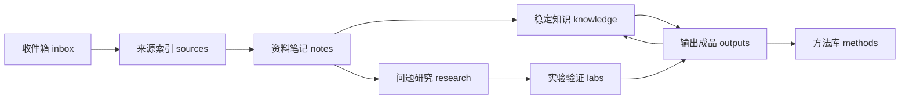

# 生命周期 MOC

真实路径使用英文，中文说明用于 Obsidian 阅读。

## 标准流转

## 入口

| 层级 | 入口 | 关键判断 |
| --- | --- | --- |
| 收件箱 | [inbox](../../inbox/README.md) | 还没处理，不要长期停留。 |
| 来源索引 | [sources](../../sources/README.md) | 只保存证据入口，不冒充知识。 |
| 资料笔记 | [notes](../../notes/README.md) | 用自己的中文理解重写来源。 |
| 稳定知识 | [knowledge](../../knowledge/README.md) | 跨来源、可复用、可维护。 |
| 问题研究 | [research](../../research/README.md) | 围绕问题，不围绕收藏。 |
| 实验验证 | [labs](../../labs/README.md) | 只验证具体判断。 |
| 方法库 | [methods](../../methods/README.md) | 可重复流程、模板和维护规则。 |
| 输出成品 | [outputs](../../outputs/README.md) | 最终产物和 manifest。 |
| 仓库治理 | [meta](../README.md) | 定位、主题地图、迁移记录。 |
| 历史归档 | [archive](../../archive/README.md) | 不再维护但仍值得保留。 |

## 判断顺序

1. 先判断材料处在生命周期哪一层。
2. 再判断主题和子目录。
3. 如果两个位置都能放，优先选择更早的生命周期层，避免把未消化材料包装成知识。
