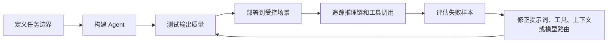
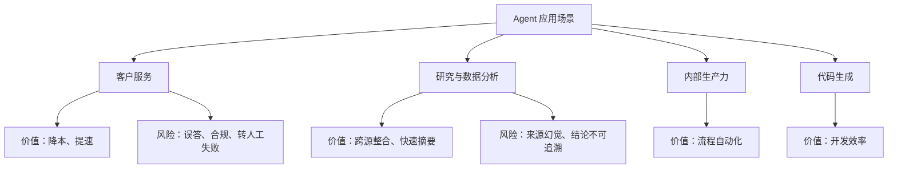
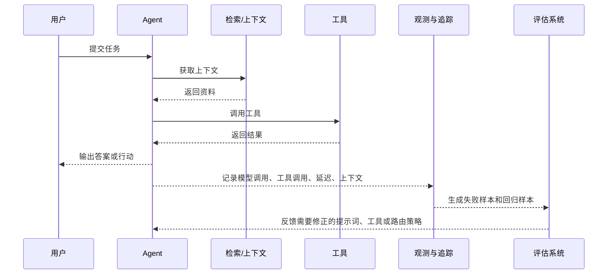

# LangChain 年度报告：Agent 现状与 2025 趋势

日期：2026-05-12

来源视频：[【人工智能】LangChain年度报告 | Agent现状 | 大厂如何落地 | 输出质量 | 延迟痛点 | 多模型 | 可观测性 | 2025趋势](https://www.youtube.com/watch?v=KcC1JCiHMk8)

频道：Best Partners TV

发布时间：2025-12-27

时长：20:44

本地素材：

- 视频：`local-media/youtube/2025-12-27-bestpartners-langchain-agent-engineering-report/【人工智能】LangChain年度报告 ｜ Agent现状 ｜ 大厂如何落地 ｜ 输出质量 ｜ 延迟痛点 ｜ 多模型 ｜ 可观测性 ｜ 2025趋势 [KcC1JCiHMk8].quicktime.mp4`
- 字幕：`local-media/youtube/2025-12-27-bestpartners-langchain-agent-engineering-report/【人工智能】LangChain年度报告 ｜ Agent现状 ｜ 大厂如何落地 ｜ 输出质量 ｜ 延迟痛点 ｜ 多模型 ｜ 可观测性 ｜ 2025趋势 [KcC1JCiHMk8].quicktime.zh-Hans.srt`
- 字幕说明：来自 YouTube zh-Hans 字幕或自动字幕，未逐句人工校对；不是本地 `whisper.cpp` ASR。
- 元数据：`local-media/youtube/2025-12-27-bestpartners-langchain-agent-engineering-report/【人工智能】LangChain年度报告 ｜ Agent现状 ｜ 大厂如何落地 ｜ 输出质量 ｜ 延迟痛点 ｜ 多模型 ｜ 可观测性 ｜ 2025趋势 [KcC1JCiHMk8].quicktime.info.json`
- 关键画面抽帧：`local-media/youtube/2025-12-27-bestpartners-langchain-agent-engineering-report/frames/`
- 评论原始数据：`local-media/youtube/2025-12-27-bestpartners-langchain-agent-engineering-report/comments.json`
- 评论摘要素材：`local-media/youtube/2025-12-27-bestpartners-langchain-agent-engineering-report/comments-digest.md`

说明：`local-media/` 是本地沉淀目录，不应提交进 Git。

## 配套资源 / 代码地址

- 视频：https://www.youtube.com/watch?v=KcC1JCiHMk8
- LangChain 官方报告：https://www.langchain.com/state-of-agent-engineering
- 代码仓库：视频简介、元数据和评论区未发现具体代码仓库地址。字幕中提到“源代码/代码仓库”的方向，但没有可追溯 URL，不能硬编。
- 其他资料：LangChain 相关的 Agent Engineering、Agent Observability 文章可作为后续验证入口，但本笔记主要基于视频与官方报告页。

## 评论区补充

- 高赞评论指出：即使有可观测性，长推理链、多 Agent 协作产生的海量文本，以及 Agent 非确定性，仍然会让调试很难。这是关键补充。报告说可观测性是门槛，不等于有了追踪就自动好调试。
- 有评论提到 Anthropic 倾向“通用 Agent + Skills”的模式，并质疑 LangChain 调查中企业到底采用了哪种 Agent 创建模式。这个问题值得后续单独对比 OpenAI Agents SDK、Claude Skills、LangGraph 的工程边界。
- 有用户问“普通日常使用 ChatGPT 算不算使用 AI Agent”，作者回复“那个不算”。这说明视频语境里的 Agent 更偏可执行任务、可调用工具、可进入业务流程的系统，而不是普通聊天。
- 有评论反馈 AI 客服体验很差，无法解决问题且阻碍转人工。这个反例正好对应视频里的“客户服务是最大场景”：它有商业价值，但也是最容易把用户体验搞砸的地方。

## Fieldbook 归档判断

- 内容类型：资料消化，带技术研究线索。
- 当前归档：`notes/`
- 是否值得升级为 lab：暂不升级。
- 判断理由：视频是对 LangChain 行业报告的解读，不是一个可直接复现的 SDK、API 或工具链教程。真正值得实验的是后续命题，例如“可观测性如何转化为评估数据集”“离线评估能否提前发现生产投诉”“多模型路由如何影响延迟和成本”，这些需要另开最小实验。
- 后续应进入：`research/use-cases/` 可沉淀 Agent 生产落地场景；若做验证，再进入 `labs/openai/` 或独立 `labs/agent-observability-evals/`。

## 一句话结论

Agent 已经从“能不能做”的概念验证阶段，进入“怎么可靠上线”的工程阶段。真正的硬问题不是把 LLM 包成一个 Agent，而是把非确定性的模型行为放进可观测、可评估、可控权限、可承受延迟的生产系统里。

## 视频时间轴

| 时间 | 主题 | 要点 |
|---|---|---|
| 00:00 | 背景和报告来源 | LangChain 调查 1340 名专业人士，覆盖工程、产品、业务和高管角色，用来观察 Agent 落地现状。 |
| 01:00 | Agent Engineering 定义 | 代理工程是把非确定性的 LLM 迭代成可靠系统的过程，核心不是一次开发，而是持续观察、测试、修正。 |
| 02:30 | 部署现状 | 57.3% 受访组织已有 Agent 进入生产，30.4% 正在积极开发并有部署计划；大企业部署比例更高。 |
| 04:00 | 应用场景 | 客服和研究/数据分析是主力场景，大企业更重视内部生产力，小企业更偏直接营收和获客。 |
| 06:30 | 主要障碍 | 输出质量仍是最大阻碍，其次是延迟、安全合规、基础设施和成本。 |
| 09:20 | 可观测性 | 89% 组织已有某种 Agent 可观测性，生产级企业采用率更高；没有追踪就很难定位错误。 |
| 11:50 | 评估与测试 | 评估落后于可观测性，离线评估更普遍，在线评估随生产使用增长；人工审核和 LLM-as-judge 并存。 |
| 14:40 | 模型和工具选择 | OpenAI GPT 使用率最高，但多模型已经成为常态；自建模型、开源模型和微调的选择取决于成本、合规和场景。 |
| 17:30 | 日常 Agent 使用 | Coding Agent 最常见，其次是研究类 Agent；基于 LangChain/LangGraph 的内部定制 Agent 正在增加。 |
| 19:20 | 样本和偏差 | 调查样本偏科技行业和 LangChain 生态用户，因此不能直接代表全行业平均水平。 |

## 1. Agent Engineering 的本质

视频里最重要的概念不是“Agent 很火”，而是“Agent Engineering”。传统软件通常能把输入、状态、分支和输出定义清楚；Agent 的麻烦在于模型输出不稳定，工具调用路径也可能变化。同样输入不一定得到同样结果，所以工程工作不能停在功能实现。

这也是为什么报告把 Agent Engineering 定义为一个迭代过程：先构建，再测试，再观察，再修正。这里没有神秘东西，就是把不可预测的行为纳入工程反馈循环。

好品味的判断：不要一上来搞复杂多 Agent。先把单个 Agent 的输入、状态、工具、权限、评估样本和失败回放做扎实。连一个 Agent 为什么错都看不见，多 Agent 只会把错误乘起来。

## 2. 部署数据说明了什么

报告显示，57.3% 的受访组织已经把 Agent 放进生产，30.4% 正在积极开发并有明确部署计划。这个数字听起来很高，但要看样本：调查来自 LangChain 生态，科技行业占 63%，小企业占 49%。这不是全行业平均值，不能拿去拍脑袋说“所有企业都已经 Agent 化”。

更有用的是结构差异：

- 10000 人以上组织：67% 已生产，24% 正在开发。
- 100 人以下组织：50% 已生产，36% 正在开发。
- 大企业更容易从试点进入生产，因为平台、安全、合规和可靠性投入更足。
- 小企业开发意愿强，但基础设施和运维能力容易成为瓶颈。

这不是“谁更懂 AI”的问题，是组织能力问题。Agent 上生产，最后拼的不是 demo 能不能跑，而是平台团队、安全机制、日志追踪、评估闭环和业务流程承接。

## 3. 主要落地场景

报告中的核心场景集中在两类：

- 客户服务：26.5%。
- 研究与数据分析：24.4%。

这两个场景加起来超过一半。它们有共同点：信息密集、重复性高、业务价值容易解释。但它们的风险不同。

客户服务适合做 Agent，是因为问题高频、流程标准化、人工成本高。但客户服务也最容易破坏用户体验：回答错、拒绝转人工、绕圈子，用户马上感受到。评论区里对 AI 客服的负面反馈就是现实提醒。客服 Agent 必须有明确的升级路径，不能把“降低成本”做成“降低服务质量”。

研究与数据分析更适合先落地，因为它天然允许人类复核。Agent 负责搜集、归纳、初步推理，人来判断结论是否可用。这个场景的权限风险和客户伤害通常比一线客服小，更适合作为组织训练 Agent 能力的入口。

## 4. 最大障碍：质量、延迟、安全

报告把输出质量列为最大阻碍，视频中给出的比例是 32.9%。这里的质量不是单纯“答案对不对”，还包括相关性、一致性、语气、品牌准则、政策约束和幻觉控制。

这点很实际。Agent 不是聊天玩具，它会进入业务流程。一个客服 Agent 给错产品信息，一个金融 Agent 给出不合规建议，一个内部审批 Agent 错用工具，都是生产事故。

第二个障碍是延迟，约 20%。Agent 越复杂，越容易多步推理、多轮检索、多次工具调用。质量想提升，步骤可能增加；步骤一多，用户等待时间就上来。这里没有免费午餐。工程上必须拆清楚哪些任务需要深推理，哪些任务只需要快速、保守、可解释的回答。

安全与合规在大企业里更突出。2000 人以上企业中，安全成为第二大顾虑，比例约 24.9%。这不是保守，这是正常。Agent 能调用工具、读数据、写系统时，权限边界就是产品的一部分。

## 5. 可观测性不是加分项，是生产门槛

视频和官方报告都强调：Agent 可观测性已经是生产必备能力。报告称 89% 的组织已经实现某种可观测性，约 62% 有详细追踪能力；在已经生产部署的组织里，94% 有可观测性，71.5% 有完整追踪。

这组数据背后的工程判断很简单：

- 没有追踪，你只能看最终答案。
- 只看最终答案，你不知道错误发生在用户意图理解、上下文检索、工具选择、工具参数、模型推理，还是后处理。
- 找不到错误位置，就只能靠猜。
- 靠猜调 Agent，是低水平工程。

评论区的补充也对：追踪不是银弹。长推理链、多 Agent 协作和海量文本会让追踪数据本身变成新问题。所以可观测性要和评估、采样、聚类、失败分类结合，不能只是把日志堆起来。

## 6. 评估体系还没跟上

可观测性采用率高，但评估和测试明显落后。报告中的几个数字值得记：

- 52.4% 组织做离线评估。
- 37.3% 组织做基于生产数据的在线评估。
- 约 29% 组织还没有任何评估。
- 已生产部署的组织中，未评估比例降到 22.8%，在线评估升到 44.8%。
- 人工审核占 59.8%，LLM-as-judge 占 53.3%，传统 ML/NLP 指标采用率低得多。

这说明 Agent 评估已经脱离传统 NLP 的“标准答案相似度”思路。很多 Agent 任务没有唯一答案，尤其是客服、研究、代码和内部流程。ROUGE、BLEU 这类指标只能解决很窄的问题。真正要看的，是任务是否完成、工具是否用对、权限是否越界、答案是否可追溯、用户是否需要升级到人类。

更合理的评估结构应该是混合的：

- 开发阶段：离线评估，防止明显回归。
- 预发布阶段：回放真实失败样本。
- 生产阶段：在线评估，监控真实用户结果。
- 高风险场景：人工审核兜底。

## 7. 多模型已经是常态，但别把路由搞成复杂玩具

报告显示 OpenAI GPT 模型使用率最高，约 67.8%；Gemini 约 37.4%，Claude 约 36.6%，开源模型约 34.2%。更关键的是，超过四分之三的组织在生产或开发中使用多个模型。

多模型策略是务实选择，不是炫技：

- 复杂推理：用能力更强的模型。
- 简单分类、抽取、格式化：用便宜或更快的模型。
- 数据驻留和合规：考虑可自部署模型。
- 高吞吐任务：用成本可控的模型。
- 供应链风险：避免完全绑定一个供应商。

但多模型路由也会引入复杂性：评估矩阵变大、失败归因变难、输出风格不一致、成本监控更麻烦。没有评估数据和追踪能力时，盲目多模型只是在增加调试面。

## 8. 微调不是主流答案

视频转述的数据是：约 55.7% 组织不做微调，30.5% 只在实验阶段微调，13.8% 在生产中大量使用微调模型。官方报告页用近似说法：多数组织不做微调，更多依赖基础模型、提示工程和 RAG。

这符合现实。微调需要高质量数据、标注流程、训练基础设施和长期维护。大多数企业的问题不是“模型还不够专有”，而是上下文没管好、工具边界不清、评估缺失、错误无法回放。先把这些工程基础补上，通常比先微调更划算。

## 9. 日常使用：Coding Agent 已经先跑出来

受访者日常使用最多的是 Coding Agent。视频提到 Claude Code、Cursor、GitHub Copilot、Amazon Q、Windsurf、Antigravity 等被频繁提及。这个趋势不意外，因为代码任务天然有几个优势：

- 输入输出结构较明确。
- 代码能运行，反馈快。
- 错误相对容易定位。
- 开发者愿意接受工具介入工作流。

第二类高频是研究和深度研究 Agent，例如 ChatGPT、Claude、Gemini、Perplexity。这类工具常和 Coding Agent 串起来：先研究文档和方案，再进入实现。

第三类是企业内部自定义 Agent，很多基于 LangChain 和 LangGraph。典型场景包括 QA 测试、内部知识库检索、SQL/text-to-SQL、需求规划、客服和工作流自动化。

## 工程提醒

1. 不要把普通聊天机器人包装成生产 Agent。能调用工具、处理状态、进入业务流程，才真的进入 Agent 工程问题。
2. 客户服务 Agent 必须有转人工机制。挡住用户找真人，是产品债，不是自动化成果。
3. 所有高风险动作都要有人审：发邮件、改数据库、付款、部署、执行 shell、写生产系统。
4. 可观测性要覆盖模型调用、工具调用、上下文、延迟、成本、用户会话和最终结果。只有请求日志不够。
5. 评估样本要来自真实失败，不要只写几个漂亮样例自欺欺人。
6. 多模型路由先从少数明确任务开始。没有评估闭环时，路由规则越复杂，故障越难查。
7. 微调排在后面。先处理上下文、工具、权限、评估和追踪；这些没做好，微调只是把混乱固化。

## 工程判断

- 适合什么场景：研究资料整理、代码辅助、内部知识库查询、低风险流程自动化、有明确人工复核的业务辅助场景。
- 不适合什么场景：没有升级路径的客服、直接执行高风险动作的自动化、缺少观测和评估的复杂多 Agent 系统、用“AI 很热”包装的流程重构。
- 风险和边界：输出质量、延迟、权限越界、合规、上下文污染、供应商锁定、调试成本、评估样本不足。
- 真正的问题：不是“要不要做 Agent”，而是“能不能在失败时知道它为什么失败，并且用数据证明修正有效”。

## 后续研究问题

- OpenAI Agents SDK、Claude Skills、LangGraph 的核心抽象差异是什么？哪些适合单 Agent，哪些适合多步骤工作流？
- Agent 可观测性应该记录到什么粒度？记录链路越细，隐私和成本问题怎么处理？
- LLM-as-judge 在客服、代码、研究三类场景下各自适合评估什么，不适合评估什么？
- 生产失败样本如何自动转成离线回归测试集？
- 多模型路由的决策依据应该是任务类型、置信度、延迟预算、成本预算，还是合规约束？
- “通用 Agent + Skills”和“框架编排式 Agent”在企业内部工具场景里谁更稳？

## 实验验证建议

- 要验证什么：可观测性是否能把 Agent 失败样本转成可重复的评估集。
- 最小实验形式：构建一个单 Agent 工具调用 demo，记录每次模型调用、工具调用、上下文和最终输出；人工制造 10 个失败样本，再把它们转成离线评估集，比较修正前后的通过率。
- 是否现在就做：否。本视频只是行业报告解读，当前先沉淀判断；实验应在 OpenAI Agents SDK 或 LangGraph 基础知识完成后再做。

## 参考资料

- 视频：https://www.youtube.com/watch?v=KcC1JCiHMk8
- LangChain 官方报告：https://www.langchain.com/state-of-agent-engineering
- 本地素材清单：`local-media/youtube/2025-12-27-bestpartners-langchain-agent-engineering-report/asset-manifest.md`
- 字幕清洗稿：`local-media/youtube/2025-12-27-bestpartners-langchain-agent-engineering-report/transcript-clean.txt`
- 评论摘要：`local-media/youtube/2025-12-27-bestpartners-langchain-agent-engineering-report/comments-digest.md`

## 未验证事项

- 本笔记基于 YouTube 字幕、视频元数据、关键画面、评论摘要和 LangChain 官方报告页面整理；没有拿到原始调查数据集。
- 字幕来自 YouTube zh-Hans 字幕或自动字幕，未逐句人工校对，个别数字或措辞仍应以官方报告原文为准。
- 没有复现 LangChain 报告中的统计分析，也没有验证图表背后的抽样方法。
- 没有运行任何 Agent 可观测性或评估实验。
- 视频简介、元数据和评论区未发现具体代码仓库地址。
