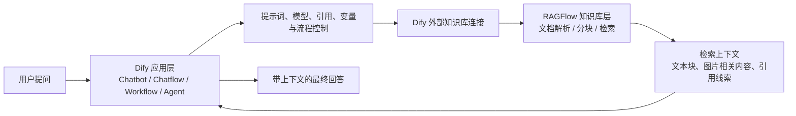
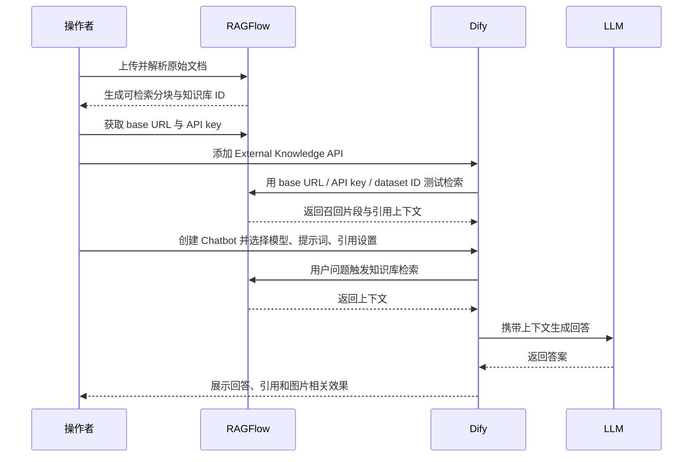
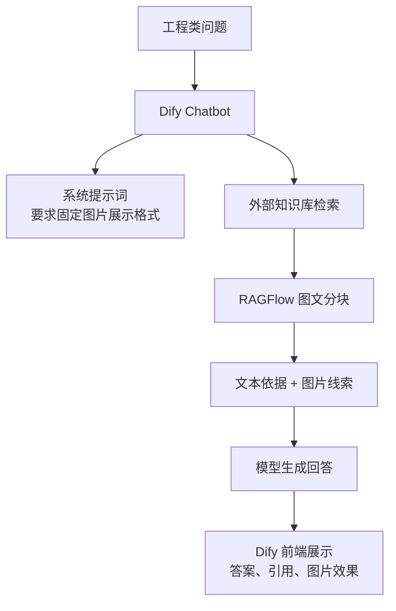

# Dify + RAGFlow：1 + 1＞2 的混合架构，详细教程 + 实施案例

日期：2026-05-12

来源视频：[Dify+RAGFlow:1+1＞2的混合架构，详细教程+实施案例](https://www.youtube.com/watch?v=r3PxNVadt3c)

频道：Will Wei

发布时间：2025-04-05

时长：00:03:11

本地素材：

- 视频：`local-media/youtube/2026-05-12-ragflow-r3pxnvadt3c/Dify+RAGFlow：1+1＞2的混合架构，详细教程+实施案例 [r3PxNVadt3c].quicktime.mp4`
- 字幕：`local-media/youtube/2026-05-12-ragflow-r3pxnvadt3c/Dify+RAGFlow：1+1＞2的混合架构，详细教程+实施案例 [r3PxNVadt3c].zh-Hans.srt`
- 字幕说明：YouTube 未暴露可直接使用的标准字幕轨道，本次字幕由本地 `whisper.cpp` ASR 生成，未逐句人工校对。ASR 把 Dify、RAGFlow、base URL、API key、Docker、Ollama 等词识别成了若干错词，本文按画面、上下文和产品术语做了必要校正。
- 元数据：`local-media/youtube/2026-05-12-ragflow-r3pxnvadt3c/Dify+RAGFlow：1+1＞2的混合架构，详细教程+实施案例 [r3PxNVadt3c].quicktime.info.json`
- 关键画面抽帧：`local-media/youtube/2026-05-12-ragflow-r3pxnvadt3c/frames/`
- 评论原始数据：`local-media/youtube/2026-05-12-ragflow-r3pxnvadt3c/comments.json`
- 评论摘要素材：`local-media/youtube/2026-05-12-ragflow-r3pxnvadt3c/comments-digest.md`

说明：`local-media/` 是本地沉淀目录，不应提交进 Git。

## 配套资源 / 代码地址

- 视频：<https://www.youtube.com/watch?v=r3PxNVadt3c>
- 代码仓库：视频简介、元数据和评论中未发现具体公开代码仓库地址。字幕提到项目源码在作者知识星球内，但没有可直接归档的 URL。
- 其他资料：视频简介只说明架构意图：用 Dify 作为主框架使用 Agent 和工作流组件，通过 API 调用 RAGFlow 知识库组件，把 Dify 的界面与工作流能力和 RAGFlow 的深度文档处理能力结合。
- 当前官方资料：RAGFlow GitHub README 与 release notes，见文末参考资料。

## 评论区补充

本次抓取到的评论数为 0，没有置顶评论、作者回复、代码链接或纠错信息可补充。

## Fieldbook 归档判断

- 内容类型：案例拆解
- 当前归档：`notes/`
- 是否值得升级为 lab：暂不直接升级
- 判断理由：视频演示的是 Dify 外部知识库接入 RAGFlow 的配置路径和问答效果，不包含完整可复现的公开源码、数据集、Docker 配置 diff 或 API 请求样例。直接升级实验会缺关键输入，容易变成猜。
- 后续应进入：可先进入 `research/use-cases/` 做“Dify 编排层 + RAGFlow 知识库层”的应用场景调研；等拿到明确 API 参数、样例文档和可运行部署后，再升级为 `labs/`。

## 一句话结论

这条视频的价值不是“Dify 和 RAGFlow 谁替代谁”，而是把职责拆干净：Dify 管应用入口、提示词、模型选择、Chatbot/Chatflow/Workflow/Agent 编排；RAGFlow 管知识库解析、分块、检索和可引用上下文。混在一个筐里就是糟糕设计，分清边界后才有 1 + 1 大于 2。

## 视频时间轴

| 时间 | 主题 | 要点 |
|---|---|---|
| 00:00 | 架构目标 | 用 Dify + RAGFlow 做知识库应用，视频重点是连通与召回演示。 |
| 00:10 | Docker 部署冲突处理 | 如果两者都用 Docker 部署，先处理 RAGFlow 端口号和 Dify 启动配置，避免服务端口互相踩。 |
| 00:25 | RAGFlow 知识库准备 | RAGFlow 端已经处理好原始文档分块，且分块里包含图片元素。 |
| 00:40 | 获取 RAGFlow 接入参数 | 在 RAGFlow 设置页找到 base URL 和 API key，用于 Dify 外部知识库连接。 |
| 00:55 | Dify 添加外部知识库 API | 在 Dify 中添加外部知识库 API，base URL 需要带 API 版本后缀。 |
| 01:10 | 绑定 RAGFlow 知识库 ID | 新建连接时输入 RAGFlow 原始知识库 ID，可从 RAGFlow 知识库页面 URL 后缀复制。 |
| 01:25 | 检索测试 | 先做检索测试，确认 Dify 能通过外部知识库接口连到 RAGFlow。 |
| 01:40 | 创建 Dify 应用 | 连接完成后可创建 Chatbot、Chatflow、Workflow、Agent 等应用形态。 |
| 01:55 | Chatbot 案例演示 | 作者演示一个工程相关 Chatbot，并在提示词里要求输出指定图片展示效果。 |
| 02:10 | 模型与功能配置 | Dify 端选择问答模型，可做多模型对比，也可勾选回答引用出处等特性。 |
| 02:35 | 图片展示补充 | 图片显示效果依赖作者上一篇文章中的图片服务容器化方案；改 RAGFlow 端口后，相关 Python 脚本里的 base URL 也要同步改。 |
| 02:55 | 后续内容 | 本视频只演示 Dify 连通 RAGFlow 知识库做问答召回，后续再结合具体业务场景讲工作流编排。 |

## 1. 职责分离：别把两套系统揉成一团

视频里的混合架构有一个清楚的边界：Dify 是应用编排层，RAGFlow 是知识库与检索上下文层。这个边界比具体按钮位置重要。

- Dify 负责：用户入口、Chatbot/Chatflow/Workflow/Agent 形态、提示词、模型选择、多模型效果对比、回答引用开关、对外应用体验。
- RAGFlow 负责：原始文档解析、文档分块、图片等复杂元素处理、知识库 ID、检索接口、被 Dify 调用的外部知识库能力。
- 二者连接点：Dify 的外部知识库 API 配置，填入 RAGFlow 的 base URL、API key 和知识库 ID。

好品味在这里很简单：不要让 Dify 重新承担 RAGFlow 的文档理解工作，也不要让 RAGFlow 去承担 Dify 的应用编排工作。一个管流程，一个管知识质量。边界清楚，系统才不会烂成一锅粥。

## 2. 混合架构流程

视频中实际流程可以拆成四步。

1. 先部署并处理端口。Dify 和 RAGFlow 如果都用 Docker，先检查端口冲突。视频建议修改 RAGFlow 端口，同时调整 Dify 的 Docker 启动命令。
2. 在 RAGFlow 内准备知识库。作者展示了已经处理好的原始文档分块，分块中包含图片元素，说明这个案例不是纯文本 FAQ，而是希望保留复杂文档里的图文信息。
3. 在 Dify 中添加 RAGFlow 外部知识库。进入外部知识库 API 配置，填 RAGFlow base URL、API key，并在新连接里填 RAGFlow 知识库 ID。知识库 ID 可从 RAGFlow 对应知识库页面 URL 后缀取得。
4. 在 Dify 应用里使用该知识库。创建或打开 Chatbot，配置提示词、知识库、问答模型和引用出处等特性，最后在 Debug & Preview 中测试召回和回答效果。

这里最容易出错的不是模型，而是配置数据：端口、base URL、API 版本后缀、API key、知识库 ID。它们是连接的真实数据结构。搞错任何一个，后面提示词写得再漂亮也没用。

## 3. 实施案例：工程问答和图片展示

作者演示的是一个工程相关 Chatbot。案例里有三个实现点值得记录。

- 提示词里明确要求输出指定图片展示效果。这说明 Dify 端不只是“问答壳”，还负责把召回内容组织成应用需要的输出形态。
- RAGFlow 知识库负责提供已经解析好的图文分块。图片元素是否能被正确引用，不应该靠 LLM 临场猜，而应该靠知识库解析和上下文引用。
- 图片显示依赖额外的图片服务容器化方案。视频提到这部分来自作者上一篇公众号文章；由于本次资产中没有该文章链接和源码，不能把它当成已复现能力。

这个案例的本质是“RAGFlow 把知识库质量做厚，Dify 把用户交互和业务流程做顺”。如果把图片显示、知识库检索、业务编排全塞进一个 Python 脚本，也能跑，但维护成本会迅速变脏。

## 4. 视频说法与当前官方事实校准

视频发布于 2025-04-05，属于操作演示。RAGFlow 版本变化快，所以必须把“视频里演示的接法”和“当前官方事实”分开。

视频说法：

- Dify 可以通过外部知识库 API 接入 RAGFlow。
- RAGFlow 知识库 ID 可从对应页面 URL 中取得。
- base URL 需要注意 API 版本后缀。
- 修改 RAGFlow 服务端口后，相关 Python 脚本里的 base URL 也要同步修改。
- Dify 端可以继续选择 Chatbot、Chatflow、Workflow、Agent 等应用形态，并配置模型、引用出处等功能。

当前官方事实，按 2026-05-12 重新核对：

- RAGFlow GitHub 最新 release 是 `v0.25.2`，发布时间为 2026-05-09 11:07 UTC，release notes 标为 Latest。
- README 当前定位：RAGFlow 是开源 RAG engine，将 RAG 与 Agent 能力融合，为 LLM 提供 context layer。
- 关键能力包括 DeepDoc 深度文档理解、模板化 chunking、grounded citations、异构数据源、自动化 RAG workflow、可配置 LLM/embedding、多路召回与融合重排、API 集成。
- 自托管最低要求：CPU 4 cores、RAM 16GB、Disk 50GB、Docker 24.0.0、Docker Compose v2.26.1。官方预构建 Docker 镜像面向 x86；ARM64 需要按官方说明自行构建。
- 从 `v0.22.0` 起，官方只发布 slim edition，不再追加 `-slim` 后缀。
- `v0.25.2` release 强调：继续把 Web API 迁移到 RESTful conventions，同时保持 legacy endpoints 向后兼容；新增 8 类数据源删除文件同步快照；修复升级后的元数据可见性、重复 chat output、Elasticsearch metadata filtering 性能等问题。

这段校准有实际意义：如果按视频截图照抄旧版本配置，可能撞上 API 路径、镜像规格或部署要求变化。真正该保留的是职责边界和连接思路，不是某个旧 UI 的按钮位置。

## 工程提醒

1. 外部知识库连接要把配置当成数据结构管理：`base_url`、`api_key`、`dataset_id`、端口、API version 后缀都应显式记录，不要散落在截图、脚本和口头说明里。
2. RAGFlow 端口一改，所有调用方都要同步改。Dify 外部知识库配置、Python 图片服务脚本、任何测试脚本都可能受影响。
3. API key 不应写进笔记、截图或仓库。视频里出现的是操作演示，真实项目要放到环境变量或密钥管理里。
4. Dify 负责应用编排，不负责替代知识库治理。知识库解析、分块、召回质量差，Dify 只是把差上下文包装得更像答案。
5. 高风险动作必须有人审：写文件、执行 shell、改数据库、调用支付、发邮件、部署服务、操作生产账号，都不能因为接了 Agent/Workflow 就自动放行。

## 工程判断

- 适合什么场景：已有复杂文档、图文混排资料、工程手册、行业项目资料，需要用 RAGFlow 做更强的文档解析与检索，同时希望 Dify 快速搭应用入口和工作流。
- 不适合什么场景：只有几十条 FAQ、纯文本短知识、没有复杂文档解析需求的项目。此时上 RAGFlow + Dify 两套系统可能就是过度设计。
- 风险和边界：部署资源要求不低；API 路径和版本会变；外部知识库连接增加故障点；图片展示依赖额外服务；ASR 字幕未校对，不能把视频里的每个参数当成精确命令。

【核心判断】
值得作为案例笔记沉淀，不值得直接照视频升级实验。

【关键洞察】

- 数据结构：这套方案的核心不是“两个工具”，而是 `Dify 应用配置 -> 外部知识库连接 -> RAGFlow dataset -> 检索上下文 -> LLM 回答` 这条链。
- 复杂度：把文档解析和应用编排拆开，反而减少复杂度；硬把两者塞进一个自写服务，才是维护灾难。
- 风险点：配置漂移。端口、base URL、API 版本、知识库 ID、图片服务 URL 只要有一个没同步，就会表现成“模型不行”这种假问题。

## 后续研究问题

- Dify 当前外部知识库 API 对 RAGFlow 的字段要求是什么？哪些是必填，哪些支持 metadata filtering？
- RAGFlow 当前 RESTful API 与 legacy endpoint 的兼容边界是什么？Dify 接入时应优先用哪条路径？
- RAGFlow 返回的引用、图片、chunk metadata 能否被 Dify 稳定传递到最终回答和前端展示？
- 多知识库接入时，Dify 的检索策略、RAGFlow 的召回策略和模型重排会不会互相打架？
- 图片服务容器化方案如何鉴权、缓存、限流？它是否会暴露原始文档里的敏感图片？

## 实验验证建议

- 要验证什么：Dify 是否能稳定调用 RAGFlow 外部知识库，并保留引用、metadata 和图文上下文。
- 最小实验形式：本地 Docker 部署 Dify + RAGFlow，用 3-5 页图文 PDF 建一个 RAGFlow dataset，在 Dify 中配置外部知识库，跑 5 个固定问题，对比 RAGFlow 原生检索结果与 Dify 最终回答。
- 是否现在就做：否。当前视频没有公开源码、完整配置 diff、测试文档和图片服务方案。先把操作链和风险点沉淀下来，后续拿到可复现输入再做 lab。

## 参考资料

- 视频：<https://www.youtube.com/watch?v=r3PxNVadt3c>
- 本地资产清单：`local-media/youtube/2026-05-12-ragflow-r3pxnvadt3c/asset-manifest.md`
- RAGFlow GitHub README：<https://github.com/infiniflow/ragflow>
- RAGFlow v0.25.2 release：<https://github.com/infiniflow/ragflow/releases/tag/v0.25.2>

## 未验证事项

- 本笔记基于本地 ASR 字幕、视频元数据、关键帧和评论摘要整理；ASR 未逐句人工校对。
- 没有运行 Dify，也没有运行 RAGFlow；没有验证外部知识库连接是否可在当前版本按视频路径复现。
- 没有验证视频中提到的图片服务容器化方案；本次资产没有公开源码或公众号文章链接。
- 没有验证 DeepSeek、Qwen、Ollama 或第三方 API 模型在该案例中的回答质量和速度。
- 没有验证 RAGFlow v0.25.2 的 RESTful API 与 Dify 外部知识库接口的字段兼容性。
