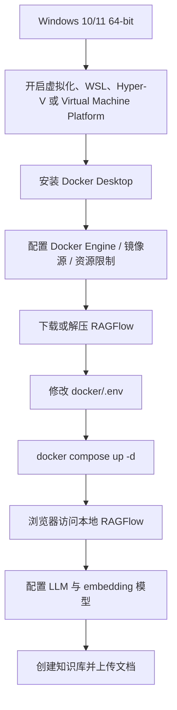
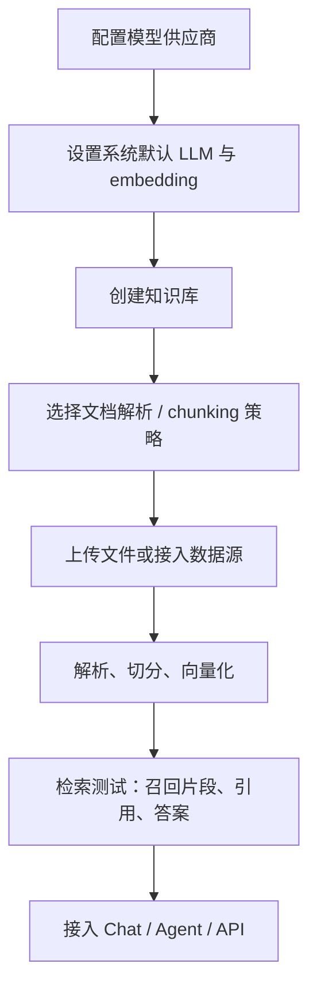
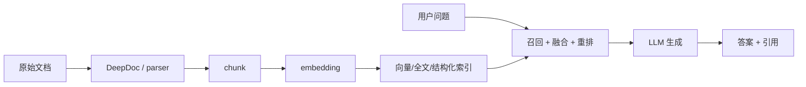

# RAGFlow 命中率最高的 RAG 知识库引擎 本地部署 小白教程

日期：2026-05-12

来源视频：[RAGFlow 命中率最高的RAG知识库引擎 本地部署 小白教程](https://www.youtube.com/watch?v=bCPHt6HxbP8)

频道：augustdoit

发布时间：2025-02-21

时长：16:52

本地素材：

- 视频：`local-media/youtube/2026-05-12-ragflow-bcpht6hxbp8/RAGFlow 命中率最高的RAG知识库引擎 本地部署 小白教程 [bCPHt6HxbP8].quicktime.mp4`
- 音频：`local-media/youtube/2026-05-12-ragflow-bcpht6hxbp8/audio-16k.wav`
- 字幕：缺失
- 字幕说明：YouTube 未暴露标准字幕轨道。尝试过 `base-q5_1` 与 `tiny` 本地 ASR，但 ASR 进程长时间未产出字幕文件，最终按已生成素材完成笔记。
- 元数据：`local-media/youtube/2026-05-12-ragflow-bcpht6hxbp8/RAGFlow 命中率最高的RAG知识库引擎 本地部署 小白教程 [bCPHt6HxbP8].quicktime.info.json`
- 素材清单：`local-media/youtube/2026-05-12-ragflow-bcpht6hxbp8/asset-manifest.md`
- 关键画面抽帧：`local-media/youtube/2026-05-12-ragflow-bcpht6hxbp8/frames/`
- 关键画面总览：`local-media/youtube/2026-05-12-ragflow-bcpht6hxbp8/frames/contact-keyframes.jpg`
- 评论原始数据：`local-media/youtube/2026-05-12-ragflow-bcpht6hxbp8/comments.json`
- 评论摘要素材：`local-media/youtube/2026-05-12-ragflow-bcpht6hxbp8/comments-digest.md`

说明：`local-media/` 是本地沉淀目录，不应提交进 Git。

## 配套资源 / 代码地址

- 视频：<https://www.youtube.com/watch?v=bCPHt6HxbP8>
- 图文教程：<https://blog.augustdoit.men/ragflow>
- 视频频道：<https://www.youtube.com/@augustdoit>
- RAGFlow GitHub：<https://github.com/infiniflow/ragflow>
- 当前校准 release：<https://github.com/infiniflow/ragflow/releases/tag/v0.25.2>
- 资源包：图文教程给出百度网盘资源包链接和提取码；本笔记未下载、未校验该资源包。
- 代码仓库：视频简介/元数据中未发现作者提供的独立代码仓库地址。

## 评论区补充

- 有观众反馈希望补充 Linux 安装教程，并讨论 Linux 是否更高效；这说明 Windows 本地部署只是入门路径，不代表最佳生产部署路径。
- 有观众遇到模型配置问题：RAGFlow 提示需要先添加 embedding 模型和 LLM，再在系统模型设置中选择。后续回复确认问题与未配置 embedding 模型有关。
- 有观众询问从 v0.16.0 升级到 v0.17.0 时知识库、邮箱和用户信息是否保留。这个问题在评论里没有形成完整升级方案，不能把视频部署步骤当成升级指南。
- 有观众遇到注册无反应、在线模型 API connection error、Ollama/DeepSeek 连接被拒绝等问题。作者建议检查防火墙、代理、`OLLAMA_HOST=0.0.0.0`、浏览器访问 `ip:11434` 是否通。
- 作者对团队共享知识库给出一个操作线索：管理员邀请成员，成员接受团队邀请后，在知识库配置的权限里选择团队。该流程来自评论，不是视频主流程验证。
- 作者对 Docker/WSL 迁移问题建议检查启动命令参数是否生效，也可从 Docker Desktop 的 Resources 设置调整。
- 作者对容器异常建议先看日志：`docker logs -f ragflow-server`。这是部署排错的最低动作，不看日志直接改配置是瞎试。

## Fieldbook 归档判断

- 内容类型：工具观察 / 资料消化
- 当前归档：`notes/`
- 是否值得升级为 lab：暂不升级
- 判断理由：视频和图文教程提供的是 Windows 本地部署演示，不是 RAG 命中率评测，也没有给出数据集、指标、baseline、重复实验或失败样本。可以作为安装路径参考，但不能作为“RAGFlow 命中率最高”的证据。
- 后续应进入：如要研究 RAGFlow 的检索质量，应另开 `labs/` 最小实验，对同一数据集比较 chunking、embedding、rerank、引用准确率和答案可追溯性；如要做工具调研，可进入 `research/open-source-projects/` 拆 RAGFlow 架构。

## 一句话结论

这是一份 RAGFlow Windows 本地部署入门演示：价值在于把 Docker Desktop、WSL、RAGFlow compose 启动、模型接入这些门槛串起来；标题里的“命中率最高”没有数据集和指标支撑，不能当技术结论，更不能把“能跑起来”误判为企业可落地。

## 视频时间轴

由于字幕和章节稿缺失，时间轴基于元数据、图文教程与关键帧重建，只用于定位素材，不等同于逐句转写。

| 时间 | 主题 | 要点 |
|---|---|---|
| 00:00 | 前置说明与 Windows 环境 | 画面展示 Windows 11、本地教程文档和资源包，重点是先确认系统、CPU、内存等基础条件。 |
| 01:41 | Docker Desktop 安装 | 进入 Docker 官方安装页面，强调 Windows 下依赖 WSL/Hyper-V/虚拟化。 |
| 03:22 | Docker 安装路径与基础命令 | 图文教程展示安装到 D 盘、WSL 数据目录迁移等命令。 |
| 05:03 | Windows 功能与 WSL/Docker 配置 | 画面出现 Windows 功能管理和 Docker 相关设置。 |
| 06:44 | Docker Engine 镜像源配置 | 图文教程展示 Docker Engine JSON 配置，主要是镜像源和重启。 |
| 08:26 | Linux 内核参数 | 终端里修改 `/etc/sysctl.conf`，关注 `vm.max_map_count`。 |
| 10:07 | RAGFlow `.env` 配置 | 画面展示 RAGFlow 配置项，包括文档引擎、镜像版本、Hugging Face endpoint 等。 |
| 11:48 | 镜像选择与模型组件 | 终端显示 RAGFlow 镜像及 embedding/model 相关组件下载说明。 |
| 13:29 | Docker Compose 启动 | 终端执行 `docker compose -f docker/docker-compose.yml up -d`，开始拉取和启动容器。 |
| 15:10 | RAGFlow Web UI | 浏览器进入 RAGFlow 知识库页面，说明本地服务至少已启动到可访问界面。 |

## 1. 这类视频真正解决的问题

它解决的是“新手怎么在 Windows 上把 RAGFlow 跑起来”。核心不是 RAG 原理，也不是检索效果评测，而是环境依赖的串联：



这个流程有实用价值，但边界也很硬：它最多证明“某个版本在某台 Windows 机器上可以启动”。它不证明命中率，不证明稳定性，不证明权限、备份、升级、数据安全和多用户协作已经解决。

## 2. 视频部署步骤消化

图文教程和关键帧显示的 Windows 部署路径大致如下。

第一步，确认硬件和系统。视频使用 Windows 11 场景，图文教程给出的最低方向是 Windows 10/11 64-bit，并建议 CPU 至少 4 核、内存至少 16GB。这个要求本质上不是 RAGFlow 独有，而是 Docker Desktop、WSL、Elasticsearch/Infinity、模型组件共同造成的。

第二步，启用 Windows 虚拟化相关能力。需要在 BIOS/UEFI 中开启虚拟化，并在 Windows 功能中启用 Hyper-V、适用于 Linux 的 Windows 子系统、Virtual Machine Platform。精简版系统容易在这一步翻车。

第三步，安装 Docker Desktop。图文教程演示了用命令行把 Docker 程序和 WSL 数据目录放到 D 盘，避免默认吃掉 C 盘空间。这个步骤对小白有价值，但它是 Windows/Docker 运维问题，不是 RAGFlow 问题。

第四步，配置 Docker Engine。教程把 registry mirror 写进 Docker Engine JSON，再 apply and restart。这个步骤能缓解国内拉镜像失败，但镜像源随时可能失效，不能写死成长期方案。

第五步，调整 `vm.max_map_count`。教程要求确认该值不小于 `262144`，这是 Elasticsearch 常见前置条件。视频里的思路是通过 `wsl -d docker-desktop -u root` 进入环境后修改 `/etc/sysctl.conf`。

第六步，下载 RAGFlow 并修改 `.env`。视频当时围绕 v0.16.0 展开，建议 16GB 内存机器把 `DOC_ENGINE` 从 Elasticsearch 换成 Infinity，并处理 `RAGFLOW_IMAGE` 与 `HF_ENDPOINT`。这里要小心：这是 2025 年 2 月的视频版本语境，不应照抄到 2026 年的新版本。

第七步，运行 compose：

```bash
docker compose -f docker/docker-compose.yml up -d
```

第八步，访问 Web UI。视频关键帧显示最终进入 RAGFlow 知识库页面。评论里出现注册无反应、模型连接错误、Ollama 地址不通等问题，说明“容器起来了”不是终点，模型服务和网络才是下一层坑。

## 3. 知识库创建流程

视频关键帧只明确显示最终进入 RAGFlow 的知识库列表页面，未产出可读字幕，不能证明完整演示了每一个知识库配置步骤。结合 RAGFlow 的产品形态和评论补充，一个最小知识库流程应按下面理解，并在真实实验里逐项验证。



这里最容易出错的是第二步。评论里已经有人遇到“请先在模型提供商中添加嵌入模型和 LLM，然后在系统模型设置中设置它们”的提示，后续确认是 embedding 模型没有配置好。RAG 的底层数据流很简单：没有 embedding，就没有可靠索引；没有合适 chunking，就没有好召回；没有可追溯引用，就很难判断回答是否可靠。



## 4. 视频说法与当前事实校准

| 主题 | 视频/图文教程语境 | 2026-05-12 当前校准事实 |
|---|---|---|
| 产品定位 | 基于深度文档理解构建的开源 RAG 引擎，面向企业和个人提供 RAG 工作流程。 | README 当前称 RAGFlow 是融合 RAG 与 Agent 能力的开源 RAG engine / context layer。 |
| “命中率最高” | 标题和描述使用了“目前知识库命中率最高”的说法。 | 没有看到该视频提供数据集、指标、baseline、评测脚本或复现实验。只能当部署演示，不能当命中率结论。 |
| 版本 | 视频围绕 v0.16.0 时代的镜像和配置展开，并提到完整镜像/精简镜像选择。 | GitHub 最新 release 是 v0.25.2，发布时间为 2026-05-09T11:07:44Z。v0.22 起官方只发布 slim 镜像。 |
| 关键能力 | 强调深度文档理解、RAG 工作流、有理有据引用。 | 当前关键特性包括 DeepDoc 深度文档理解、模板化 chunking、grounded citations、异构数据源、自动化 RAG workflow、可配置 LLM/embedding、多路召回加融合重排、API 集成。 |
| 自托管要求 | 图文教程给出 Windows 场景、CPU 4 核、RAM 16GB，并围绕 Docker Desktop/WSL 配置。 | 当前自托管最低要求为 CPU 4 cores、RAM 16GB、Disk 50GB、Docker 24、Docker Compose 2.26.1；x86 有预构建镜像。 |
| v0.25.2 变化 | 视频发布时不存在。 | v0.25.2 强调 RESTful API 迁移并保持 legacy endpoint 兼容、8 类数据源删除文件同步快照、修复元数据可见性、重复输出、Elasticsearch metadata filtering 性能问题。 |

## 5. “命中率最高”这句话的问题

这个标题最大的问题不是夸张，而是没有数据结构。一个严肃的 RAG 命中率判断至少需要：

- 固定数据集：文档类型、规模、噪声、语言、表格/图片比例。
- 固定问题集：事实查找、跨段综合、表格问答、否定样本。
- 固定指标：top-k recall、MRR、answer faithfulness、citation accuracy、latency、cost。
- 固定对照组：至少和 Dify、FastGPT、AnythingLLM、MaxKB 或自建 baseline 比较。
- 固定配置：embedding、reranker、chunk size、parser、LLM、prompt、索引类型。

视频没有这些东西，所以结论只能降级为：作者展示了 RAGFlow 的本地部署路径，并主观认为它在知识库场景里表现好。把主观体验包装成“最高”，技术上站不住。

## 工程提醒

1. 不要把 Windows 本地部署当生产部署。生产要处理数据备份、版本升级、权限、审计、模型服务可用性、索引重建和资源隔离。
2. 不要直接照抄 v0.16.0 的镜像配置到 v0.25.2。RAGFlow 的镜像策略和 API 都已经变化。
3. 先配 embedding，再谈知识库效果。没有 embedding 或 embedding 选错，RAGFlow 页面能打开也没意义。
4. Docker 拉镜像失败先看网络和镜像源；容器启动失败先看 `docker logs -f ragflow-server`，不要盲目改 `.env`。
5. Ollama 本地模型接入要确认监听地址、端口、防火墙和代理。评论区多起 connection refused 本质上都是网络可达性问题。
6. 高风险动作必须有人审：改 Docker/WSL 系统设置、写 `/etc/sysctl.conf`、执行 compose、暴露本地模型服务、上传企业文档到知识库，都不是无脑下一步。

## 工程判断

- 适合什么场景：个人学习 RAGFlow、在 Windows 上快速体验 RAGFlow UI、理解 Docker Desktop + RAGFlow + 本地模型的最小部署链路。
- 不适合什么场景：拿来证明 RAGFlow 检索质量第一、指导生产升级、设计企业知识库权限体系、处理敏感数据上线。
- 风险和边界：视频版本偏旧；无字幕导致内容细节无法逐句核对；Windows Docker/WSL 路径复杂，环境差异会放大故障；RAGFlow 当前版本已变化，旧镜像和旧 API 说明可能失效。

## 后续研究问题

- RAGFlow DeepDoc 对 PDF、扫描件、表格、图文混排的解析质量到底怎样？需要用固定样本评测。
- 模板化 chunking 相比固定窗口 chunking 在中文知识库上的收益是多少？
- 多路召回加融合重排默认配置是什么？哪些参数真正影响 top-k recall 和 citation accuracy？
- v0.25.2 的 RESTful API 迁移对旧集成有什么兼容边界？
- Infinity 与 Elasticsearch 在小机器上的资源占用、检索质量和过滤性能差异如何？
- 团队共享知识库的权限模型能否满足小团队最小隔离需求？评论里的流程需要实测。

## 实验验证建议

- 要验证什么：RAGFlow 在固定中文文档集上的召回率、引用准确率、答案忠实度，而不是“能否启动”。
- 最小实验形式：准备 20 份混合格式文档、50 个带标准答案的问题；固定 embedding 和 LLM；对比不同 parser/chunking/retriever/reranker 设置；输出 top-k recall、引用命中、人工判分表。
- 是否现在就做：否。本条视频沉淀只归档部署入门材料；真正的命中率判断需要单独 lab。

## 参考资料

- 视频：<https://www.youtube.com/watch?v=bCPHt6HxbP8>
- 图文教程：<https://blog.augustdoit.men/ragflow>
- RAGFlow GitHub：<https://github.com/infiniflow/ragflow>
- RAGFlow v0.25.2 release：<https://github.com/infiniflow/ragflow/releases/tag/v0.25.2>

## 未验证事项

- 本笔记未运行 RAGFlow，本地没有复现 Docker Desktop 安装、`.env` 修改、`docker compose up -d`、Web UI 注册、模型接入或知识库创建。
- YouTube 未提供字幕轨道；`base-q5_1` 与 `tiny` ASR 均未在合理时间内产出字幕文件，因此没有 `transcript-clean.txt` 和 `chapter-transcript.md` 可读。正文没有使用逐句字幕，只基于元数据、图文教程、关键帧和评论摘要整理。
- 评论区内容已抓取并摘要，但未逐条打开外部环境复现其中的问题。
- 图文教程中的百度网盘资源包未下载、未解压、未校验。
- “命中率最高”没有数据集、指标、对照组和可复现实验支撑，本笔记不承认它是事实判断。
- RAGFlow 当前事实按用户提供的官方校准信息和 GitHub release 链接写入；未在本地 checkout 最新源码逐项验证。
