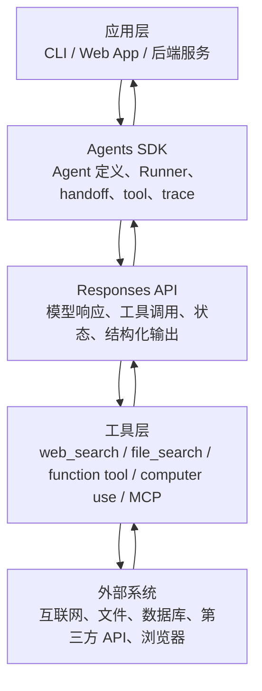
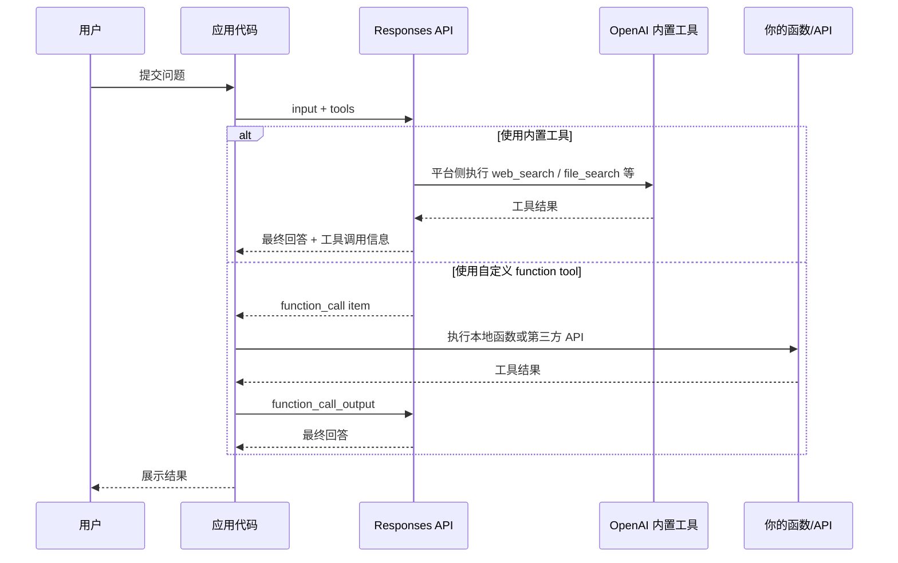
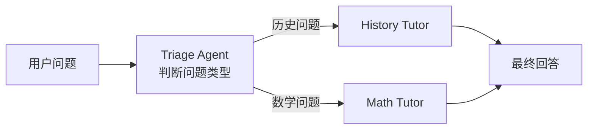
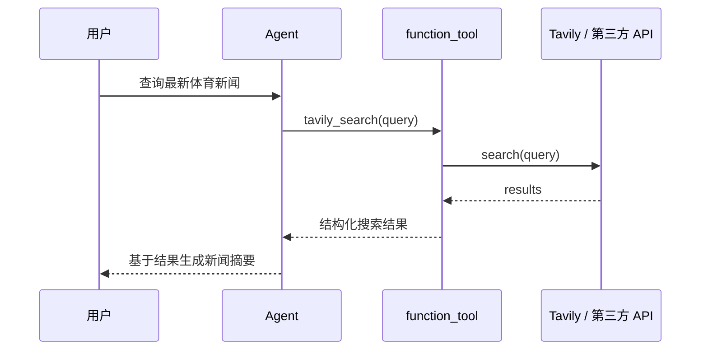
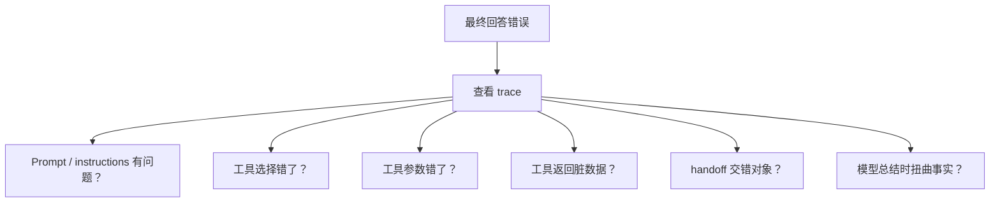

# 实战体验OpenAI全新AI应用开发套件 - Responses API与Agents SDK

日期：2026-05-09

来源视频：
[实战体验OpenAI全新AI应用开发套件 - Responses API与Agents SDK](https://www.youtube.com/watch?v=YA2fwTZz0tU)

频道：01Coder

发布时间：2025-03-12

时长：8:29

本地素材：

- 视频：`local-media/youtube/2026-05-09-01coder-openai-responses-agents-sdk/实战体验OpenAI全新AI应用开发套件 - Responses API与Agents SDK [YA2fwTZz0tU].quicktime.mp4`
- QuickTime 兼容视频：`local-media/youtube/2026-05-09-01coder-openai-responses-agents-sdk/实战体验OpenAI全新AI应用开发套件 - Responses API与Agents SDK [YA2fwTZz0tU].quicktime.mp4`
- 字幕：`local-media/youtube/2026-05-09-01coder-openai-responses-agents-sdk/实战体验OpenAI全新AI应用开发套件 - Responses API与Agents SDK [YA2fwTZz0tU].quicktime.zh.srt`
- 元数据：`local-media/youtube/2026-05-09-01coder-openai-responses-agents-sdk/实战体验OpenAI全新AI应用开发套件 - Responses API与Agents SDK [YA2fwTZz0tU].quicktime.info.json`
- 关键画面抽帧：`local-media/youtube/2026-05-09-01coder-openai-responses-agents-sdk/frames/`
- 评论原始数据：`local-media/youtube/2026-05-09-01coder-openai-responses-agents-sdk/comments.json`
- 评论摘要素材：`local-media/youtube/2026-05-09-01coder-openai-responses-agents-sdk/comments-digest.md`
- 素材清单：`local-media/youtube/2026-05-09-01coder-openai-responses-agents-sdk/asset-manifest.md`

说明：`local-media/` 是本地沉淀目录，不应提交进 Git。

## 配套资源 / 代码地址

- 视频：[YouTube 原视频](https://www.youtube.com/watch?v=YA2fwTZz0tU)
- OpenAI 发布说明：[New tools for building agents](https://openai.com/index/new-tools-for-building-agents/)
- 视频配套 Notebook：[Google Colab](https://colab.research.google.com/drive/1L8ncls4VyFZDEJgxjln9voEoQ6r2m2dN?usp=sharing)
- OpenAI Agents SDK 文档：[Quickstart](https://openai.github.io/openai-agents-python/quickstart/)
- OpenAI Responses API 参考：[Responses API](https://platform.openai.com/docs/api-reference/responses?api-mode=responses)
- 代码仓库：视频简介、评论和元数据中未发现 GitHub/Gitee/GitLab 等代码仓库地址；只发现 Colab Notebook。

## 评论区补充

本次抓取评论 20 条。评论区的有效信息不多，但有三点值得记：

1. 作者在评论里补了视频配套 Colab Notebook 链接，和视频简介里的代码链接一致。
2. 有观众问 Assistants API 是否被取代，作者回复“有这个意思”。这个判断在 2025-03-11 的发布背景下成立；按 2026-05-09 查到的 OpenAI 官方迁移文档，Assistants API 已于 2025-08-26 开始弃用，sunset 日期是 2026-08-26。
3. 有观众把 Agents SDK 类比为 `LangChain supervisor + swarm`。作者的回应更接近工程判断：LangChain 更像积木块，OpenAI Agents SDK 更像搭好的玩具。这个比喻可以帮助理解，但不要把它当架构结论。

广告、寒暄和低信息密度评论已忽略。

## 一句话结论

这个视频适合作为 OpenAI Agent 技术栈的第一眼入口：**Responses API 是更底层的模型与工具调用接口，Agents SDK 是更上层的编排框架。** 前者解决“模型怎么连工具和状态”，后者解决“Agent、工具、handoff、trace 这些运行流程怎么少写样板代码”。

别把它看成深度课。它是 8 分钟的快速体验，价值在于帮你建立边界，不在于讲透生产级 Agent。

## 视频时间轴

| 时间 | 主题 | 要点 |
|---|---|---|
| 00:00 | OpenAI 发布全新开发工具套件 | 介绍 2025-03-11 发布的 Responses API、Agents SDK 和观测工具。 |
| 00:39 | 开发工具套件简介 | Responses API 增加内置工具能力；Agents SDK 用于单 Agent / 多 Agent 编排。 |
| 01:22 | Responses API | 在 Playground 演示启用 `web_search`，用一次模型请求完成联网搜索和总结。 |
| 03:11 | Agents SDK | 演示 Python SDK、`Agent`、`Runner`、handoff 和自定义 function tool。 |
| 07:33 | 更多工具 | 简要提到 OpenAI 控制台里的观测、调试、部署和评估能力。 |

## 1. 这套工具到底分几层

视频里最容易混的地方，是把 Responses API 和 Agents SDK 都叫“Agent 工具”。这说法太粗。工程上应该拆开看：

更直接一点：

| 层次 | 你关心什么 | 视频里的例子 |
|---|---|---|
| Responses API | 请求、响应、工具、状态、输出 item | Playground 里启用 `web_search` 查体育新闻。 |
| Agents SDK | Agent 怎么定义，谁调用谁，工具怎么挂，运行过程怎么看 | 历史导师、数学导师、前置分流 Agent。 |
| 外部工具 | 真正的数据来源和副作用边界 | Tavily 搜索 API 作为自定义搜索工具。 |
| Observability | 运行时到底发生了什么 | Dashboard 里看 trace、调试、评估。 |

这里的核心不是“多 Agent 很高级”，而是边界清楚：**底层 API 负责模型和工具协议，上层 SDK 负责把常见控制流组织起来。**

## 2. Responses API：把内置工具变成一等公民

视频在 Playground 里演示了一个简单场景：选择 Responses API，启用 `web_search`，询问最新体育新闻。模型会调用搜索工具，拿到结果，再生成总结和来源链接。

这个例子说明了 Responses API 的价值：

- 不需要自己接搜索 API，也不需要手写“模型请求搜索 -> 应用执行搜索 -> 搜索结果回传模型”的循环。
- 对内置工具，OpenAI 平台可以帮你处理一部分工具执行和结果拼接。
- 对快速原型、研究助手、新闻摘要、公开网页信息查询，这能明显减少代码量。

但这里有一个硬边界：**内置 web search 好用，不等于所有搜索场景都该交给它。**

如果你需要：

- 固定搜索源，比如只查公司知识库、特定数据库、某个行业 API；
- 严格控制检索排序、过滤条件、审计日志；
- 把搜索成本、失败重试、缓存策略拿在自己手里；
- 对来源质量有强约束；

那就不要偷懒。用 function tool 接你自己的检索服务，或者用 File Search / Remote MCP / 自建 RAG。把控制权藏在黑盒工具里，后面调问题会很痛苦。

## 3. Responses API 的数据流

视频没有展开底层 item 结构，但后续自己做实验时必须搞懂这个循环。

内置工具和自定义函数工具的差别可以这样看：

真正该记住的是这句：**模型不执行你的业务函数。模型只提出工具调用请求；应用代码决定是否执行、怎么执行、执行后怎么回传。**

对高风险动作尤其如此。发邮件、退款、改数据库、跑 shell、部署、调用支付，不该让模型直接做。必须有人审，或者至少有确定性的业务规则和权限闸门。

## 4. Agents SDK：把常见 Agent 控制流收起来

视频演示了一个最小多 Agent 例子：

- `History Tutor`：回答历史问题。
- `Math Tutor`：回答数学问题。
- `Triage Agent`：根据用户问题决定 handoff 给哪个专家。
- `Runner`：运行整个流程。

这不是为了证明“多 Agent 必须用”。它说明的是 Agents SDK 把常见结构变成了稳定接口：

SDK 帮你省掉的主要是样板代码：

- 循环调用模型；
- 处理工具调用；
- 管理 handoff；
- 记录 `new_items` / run result；
- 接入 tracing；
- 管理 session 或续接状态。

SDK 没有替你解决的东西更重要：

- 工具边界怎么设计；
- 参数 schema 是否稳定；
- 工具返回值是否可被模型可靠理解；
- 哪些动作需要人工确认；
- 多 Agent 是否真的必要；
- 失败、超时、重试、审计怎么处理。

如果这些没想清楚，上 SDK 只会把坏设计包装得更好看。

## 5. Handoff：不是炫技，是所有权转移

视频里的 `Triage Agent -> History Tutor / Math Tutor` 是 handoff 的入门例子。

handoff 的关键不是“一个 Agent 调另一个 Agent”，而是：**当前这轮任务的回答权交给另一个更合适的 Agent。**

这和“agent as tool”不同：

| 模式 | 谁控制最终回答 | 适合场景 |
|---|---|---|
| Handoff | 被移交的 specialist Agent | 客服分流、不同领域专家接管对话。 |
| Agent as tool | 原 orchestrator Agent | 主 Agent 需要调用专家能力，但最终统一汇总。 |

这个区别很重要。很多多 Agent 设计烂，不是因为模型不行，而是控制权没想清楚：谁拥有任务？谁能结束任务？谁负责最终答案？谁处理失败？

## 6. 自定义 Function Tool：把第三方 API 接进来

视频后半段用 Tavily 演示了自定义搜索工具：

1. 安装 `tavily-python`。
2. 测试 Tavily client 是否能返回搜索结果。
3. 用 Agents SDK 的 `function_tool` 把 Python 函数声明成工具。
4. 把这个工具挂到 Agent 上。
5. 用户问“latest sports news”时，Agent 调用 Tavily 工具，再基于结果生成总结。

这段的价值比 Playground 演示更大，因为它揭示了生产系统里更常见的形态：

工程上，这里真正的数据结构是工具函数的输入输出：

- 输入参数要少而明确，比如 `query: str`。
- 返回结果要结构化，不要丢一坨难解析的文本。
- 错误要可区分，比如无结果、API 超时、认证失败、限流。
- 工具内部可以打印日志，但生产代码应该走结构化日志和 trace。

糟糕的工具定义会毁掉整个 Agent。模型不是垃圾桶，不该用 prompt 去弥补乱七八糟的工具返回。

## 7. Observability：没有 trace 就别谈生产

视频最后提到 OpenAI 控制台里的 observability、调试、评估能力。这个部分讲得很短，但工程价值很高。

Agent 系统不是普通一次性 API 调用，它会多轮执行：

- 模型读上下文；
- 模型选择工具；
- 工具执行；
- 结果回传；
- 模型继续推理；
- 可能 handoff；
- 可能多次调用工具；
- 最后才输出答案。

没有 trace，你只能看到“结果错了”。有 trace，你能看到“哪一步错了”：

这不是锦上添花。没有可观测性，多步骤 Agent 就是黑盒。

## 8. 官方校准：视频已经不是完整现状

视频基于 2025-03-11 发布内容，适合入门，但不能当 2026 年的完整文档。

根据 2026-05-09 查看官方资料后的校准：

- Responses API 仍然是 OpenAI 推荐的新集成基础之一，官方 API 参考明确说明它支持文本、图片、状态续接、内置工具和 function calling。
- 官方文档里，Responses API 的工具范围已经不只视频里重点展示的 `web_search`、`file_search`、`computer use`，还包括更多工具和 MCP 相关能力。具体可用性、模型限制和计费必须看最新文档。
- Agents SDK 官方文档明确区分底层 Responses API 和上层 orchestration：`Agent` + `Runner` 让 SDK 管理 turns、tools、guardrails、handoffs、sessions；如果你要自己控制循环，就直接用 Responses API。
- Agents SDK Quickstart 里也明确提到状态选择：手动传 `result.to_input_list()`、使用 `session=...`，或者用 OpenAI 服务端状态 `previous_response_id` / `conversation_id`。
- OpenAI 2025-03-11 发布说明里说 Chat Completions 仍会继续支持；Responses API 是新集成推荐方向。不要把“新 API”理解成“旧 API 明天就死”。
- Assistants API 的状态不能靠视频评论判断。OpenAI 迁移文档写明：Assistants API 已在 2025-08-26 开始弃用，计划在 2026-08-26 sunset。今天是 2026-05-09，也就是说它还没到 sunset，但新学习和新项目不该把它作为主线。

结论：视频能帮你快速知道有什么，但写代码必须看官方文档。OpenAI 这条线变化太快，二手教程过期是常态。

## 9. 和本仓库学习路线的关系

这条视频应该放在 OpenAI 技术栈第一阶段的入口位置。

推荐学习顺序：

1. 先看这条视频，建立 Responses API / Agents SDK / tools / trace 的粗边界。
2. 接着做 `labs/openai/01-responses-api/`，手写一次 function calling 闭环。
3. 再做 `labs/openai/02-agents-sdk-basic/`，观察 SDK 到底省掉了哪些循环代码。
4. 然后补 `labs/openai/03-tools-and-rag/`，理解 web/file search 和自定义检索的边界。
5. 最后再看 handoff、guardrails、evals、sandbox。多 Agent 不急，先把单 Agent 做硬。

这个视频能回答“OpenAI 给了哪些新积木”，不能回答“生产系统怎么设计权限、状态和评估”。后者要靠实验和官方文档补。

## 10. 实用判断

### 值得直接采用的部分

- 用 Responses API 做新项目的底层模型接口。
- 用内置 `web_search` 快速做公开网页信息查询原型。
- 用 Agents SDK 快速验证 function tool、handoff、trace。
- 用 `result.new_items` / trace 观察 SDK 实际执行了什么。

### 需要谨慎的部分

- 不要一上来做多 Agent。视频里的 history/math tutor 是演示，不是架构建议。
- 不要因为内置 web search 方便，就把所有检索都交出去。
- 不要把第三方 API 返回原样塞给模型，工具输出要结构化。
- 不要让模型直接执行写操作，高风险动作必须有人审。
- 不要把 SDK 当成业务边界。权限、审计、重试、幂等仍然是你的代码负责。

### 不适合的场景

- 需要强一致性交易动作，比如支付、退款、库存扣减。
- 对数据驻留、审计、来源可控有严格要求，但你又不愿意自建检索和日志。
- 工具 schema 频繁变化、返回值不稳定的系统。
- 为了“看起来高级”拆成一堆 Agent 的简单流程。

## 参考资料

- 视频：[实战体验OpenAI全新AI应用开发套件 - Responses API与Agents SDK](https://www.youtube.com/watch?v=YA2fwTZz0tU)
- OpenAI 发布说明：[New tools for building agents](https://openai.com/index/new-tools-for-building-agents/)
- OpenAI API 参考：[Responses API](https://platform.openai.com/docs/api-reference/responses?api-mode=responses)
- OpenAI 迁移文档：[Migrate to the Responses API](https://developers.openai.com/api/docs/guides/migrate-to-responses)
- OpenAI Agents SDK：[Quickstart](https://openai.github.io/openai-agents-python/quickstart/)
- OpenAI Agents SDK：[Agents](https://openai.github.io/openai-agents-python/agents/)
- 本仓库实验笔记：[OpenAI Responses API Lab 01](2026-05-08-openai-responses-api-lab01.md)
- 本仓库实验笔记：[OpenAI Agents SDK Lab 02](2026-05-08-openai-agents-sdk-lab02.md)

## 未验证事项

- 本笔记基于视频字幕、元数据、关键画面、评论摘要和官方文档整理。
- 视频配套 Colab Notebook 链接已从简介和作者评论中提取，但未下载、未运行。
- 未设置 `OPENAI_API_KEY` 运行视频中的 Notebook，也未复现 Tavily 搜索示例。
- 当前 OpenAI API、模型、工具名称和计费可能继续变化；真正写代码前必须再次核对官方文档。
- 本次为了生成 manifest，修复了 `video-study-notes` 脚本选择元数据文件的 bug：目录里同时存在 `comments.json` 和 `*.info.json` 时，应只把 `*.info.json` 当视频元数据。
