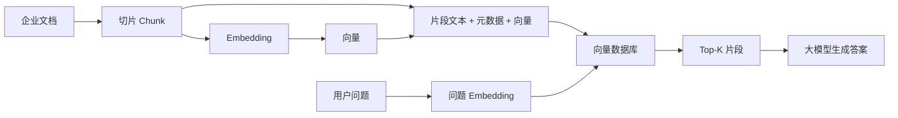
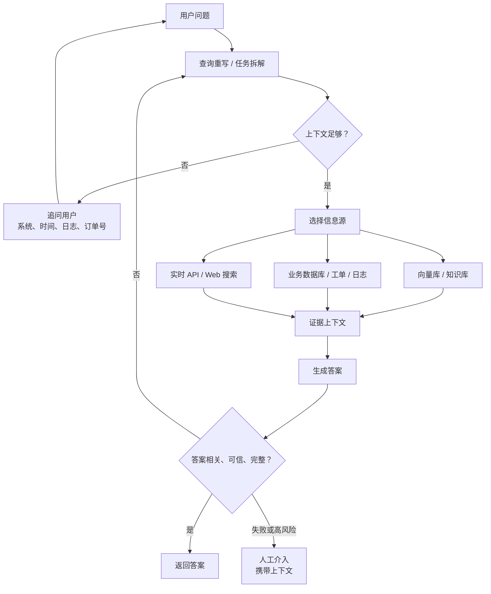
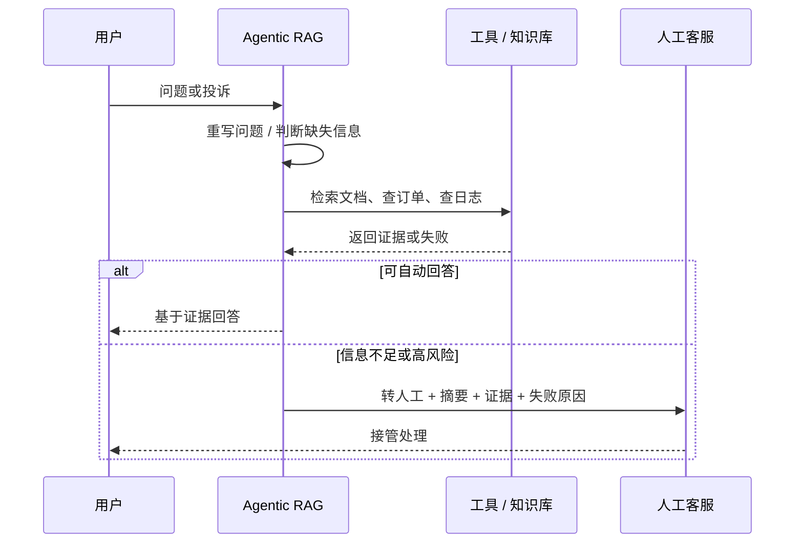
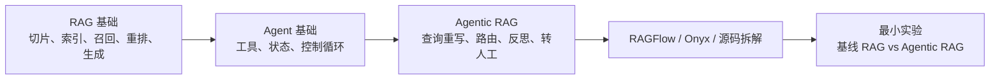

# 工业级实战：从传统RAG到Agentic RAG的进阶优化！

日期：2026-05-12

来源视频：[工业级实战：从传统RAG到Agentic RAG的进阶优化！](https://www.youtube.com/watch?v=UZs_yOKcw7A)

频道：白白说大模型

发布时间：2026-01-09

时长：18:18

本地素材：

- 视频：`local-media/youtube/2026-05-12-uzs-yokcw7a/工业级实战：从传统RAG到Agentic RAG的进阶优化！ [UZs_yOKcw7A].quicktime.mp4`
- 字幕：`local-media/youtube/2026-05-12-uzs-yokcw7a/工业级实战：从传统RAG到Agentic RAG的进阶优化！ [UZs_yOKcw7A].zh-Hans.srt`
- 字幕说明：YouTube 对 `yt-dlp` 未暴露标准字幕轨道；此字幕由本地 `whisper.cpp` ASR 生成，未逐句人工校对。ASR 中有较多术语误识别，例如把 `RAG` 识别成 `RG`、把 `Agentic RAG` 识别成近似音，本笔记已按视频画面和上下文纠正。
- 元数据：`local-media/youtube/2026-05-12-uzs-yokcw7a/工业级实战：从传统RAG到Agentic RAG的进阶优化！ [UZs_yOKcw7A].quicktime.info.json`
- 关键画面抽帧：`local-media/youtube/2026-05-12-uzs-yokcw7a/frames/`
- 关键画面总览：`local-media/youtube/2026-05-12-uzs-yokcw7a/frames/contact-keyframes.jpg`
- 评论原始数据：`local-media/youtube/2026-05-12-uzs-yokcw7a/comments.json`
- 评论摘要素材：`local-media/youtube/2026-05-12-uzs-yokcw7a/comments-digest.md`
- 素材清单：`local-media/youtube/2026-05-12-uzs-yokcw7a/asset-manifest.md`

说明：`local-media/` 是本地沉淀目录，不应提交进 Git。

## 配套资源 / 代码地址

- 视频：<https://www.youtube.com/watch?v=UZs_yOKcw7A>
- 作者评论补充资料：<https://mp.weixin.qq.com/s/9jv9yloxsIjH9LN5bQKZMQ>
- 代码仓库：视频简介、元数据和已抓取评论中未发现 GitHub / Gitee / GitLab / Bitbucket 等具体代码仓库地址。
- 其他资料：视频画面提到 `Ragas`、`TruLens` 和 `human_handoff`，但没有给出可运行示例或配置文件。

## 评论区补充

本次抓取 7 条评论，没有置顶评论。作者在评论区补了同一个微信公众号资料链接，并提示打不开可去主页自取。

评论区最有价值的不是夸赞，而是三条质疑：

- 有观众认为“说了半天，关键是怎么落地实现没有讲”。这个批评成立。视频给的是概念框架和优化方向，不是实现教程。
- 有观众追问企业本地化、硬件算力和内部资料不能外传的问题。这是企业 RAG / Agentic RAG 的真实边界，视频没有展开。
- 有观众质疑“这不是 Agentic RAG，而是 Agent + RAG”。这句话说得粗，但提醒是对的：把 RAG 外面套一个 Agent 壳，不自动等于工程上可控的 Agentic RAG。

## Fieldbook 归档判断

- 内容类型：技术研究
- 当前归档：`notes/`
- 是否值得升级为 lab：是，但不立即做
- 判断理由：视频提出了可以验证的工程判断：查询重写、动态路由、反思评估是否真的能提升 RAG 质量。但视频没有代码、没有数据集、没有指标结果，直接升级实验会变成拍脑袋。
- 后续应进入：先继续沉淀 `RAGFlow / Onyx / Agentic RAG 源码解析`，再在 `labs/openai/03-tools-and-rag/` 或新的企业知识库最小实验中验证。

## 一句话结论

这个视频的核心价值是把传统 RAG 的“检索 -> 生成”线性流程，升级成“理解问题 -> 选择信息源 -> 生成答案 -> 评估答案 -> 必要时重试或人工介入”的闭环。但它不是落地指南，尤其缺少评估数据、权限边界、成本控制和可运行代码。

## 视频时间轴

| 时间 | 主题 | 要点 |
|---|---|---|
| 00:00 | 开场问题 | 很多企业知识库客服只是关键词匹配，复杂问题容易胡编。 |
| 01:17 | 什么是传统 RAG | 文档切片、Embedding、向量库检索、把片段交给模型生成。 |
| 03:03 | 传统 RAG 的痛点 | 检索相关性差、缺乏意图理解、无法处理多步任务。 |
| 05:26 | Agentic RAG 定义 | 视频用 `Agentic RAG = RAG + Agent` 概括，引出规划、工具调用和反思。 |
| 06:36 | Agentic RAG 工作流 | 查询重写、判断是否需要补充信息、选择信息源、生成回答、反思迭代。 |
| 10:19 | 三个优化策略 | 从“聪明”走向“靠谱”：智能查询处理、动态决策与工具调用、自我反思与修正。 |
| 10:38 | 查询重写 / 拆解 | 模糊问题不能直接检索，要先重写成可检索问题，复杂问题拆成子任务。 |
| 11:37 | 路由与工具调用 | Agent 判断查向量库、业务数据库、实时 API、Web 搜索，或转人工。 |
| 12:53 | 自我反思与修正 | 检索前评估上下文是否足够，生成后评估答案是否相关、可信、完整。 |
| 13:51 | 客服例子 | 从“订单已发货请等待”升级为追问订单号、物流状态、签收异常。 |
| 15:24 | 简历与面试避坑 | 不要写没有评估支撑的准确率提升数字。 |
| 16:03 | 黄金数据集 | 用人工标注的问题-标准答案对做客观比较。 |
| 16:42 | 评估框架 | 视频画面列出 Ragas、TruLens 作为 RAG 评估工具。 |
| 16:55 | 人工介入机制 | Agent 处理失败或超出范围时触发 `human_handoff`，并携带上下文。 |
| 17:49 | 总结 | 工程目标不是炫技，而是稳定、可测、可持续运行。 |

## 1. 传统 RAG 的数据结构

视频讲传统 RAG 的部分是必要底座。传统 RAG 并不神秘，核心数据结构只有几类：

| 数据 | 作用 |
|---|---|
| 原始文档 | 企业私有知识，例如产品手册、合同、流程文档。 |
| Chunk | 把长文档切成可检索片段。 |
| Embedding 向量 | 给片段建立语义索引。 |
| 向量数据库记录 | 同时保存片段文本、向量和必要元数据。 |
| 用户问题向量 | 用来和片段向量做相似度检索。 |
| 检索上下文 | 被塞进模型的证据材料。 |



这里最容易犯的错，是把“跑通向量检索”当成“知识库可用”。不是。传统 RAG 只解决了“模型不知道企业私有资料”这个问题的一部分。它没有自动解决问题理解、检索质量、权限控制、答案评估和失败处理。

## 2. 传统 RAG 的三个硬伤

视频总结的三个痛点可以保留，但要按工程语言重新说：

| 痛点 | 视频例子 | 工程含义 |
|---|---|---|
| 检索相关性差 | 用户问服务器 502，系统召回“项目延期中的错误处理机制”。 | 召回阶段把噪声片段带进上下文，模型会基于垃圾证据生成貌似专业的废话。 |
| 缺乏意图理解 | 用户只说“那个报错怎么修”。 | 原始 query 信息不足，直接检索会污染结果；系统应该先澄清系统、模块、时间和日志。 |
| 无法处理复杂任务 | “近三个月退货率上升多少、原因是什么、怎么改进”。 | 这不是一次检索能解决的问题，需要拆解、查结构化数据、分析原因、再生成建议。 |

这三个问题的共同根源不是“模型不够聪明”，而是流程太死。所有问题都走同一条 `query -> retrieve -> generate` 路，特殊情况只能靠 prompt 和 if/else 补丁硬顶，坏味道很明显。

## 3. Agentic RAG 的关键不是名字

视频给出的定义是：

```text
Agentic RAG = RAG + Agent
```

这句话适合入门，不适合作为架构设计。更准确的工程定义应该是：

> Agentic RAG 是把检索当作 Agent 可选择的工具之一，并在查询理解、信息源选择、证据评估、答案生成、答案反思、人工介入之间建立有状态闭环。

也就是说，RAG 不再是一条固定流水线，而是 Agent 控制循环里的一个能力。



这个流程真正多出来的不是“多几个 Agent”，而是几个状态：

| 状态 | 为什么重要 |
|---|---|
| `rewritten_query` | 原问题通常不适合直接检索。 |
| `missing_context` | 系统要知道自己缺什么，而不是硬答。 |
| `selected_source` | 不同问题应该走不同信息源。 |
| `retrieved_evidence` | 后续答案必须可追溯到证据。 |
| `quality_signal` | 生成后要判断是否跑题、幻觉、证据不足。 |
| `handoff_reason` | 转人工不能只说“我不会”，要带原因和上下文。 |

没有这些状态，所谓 Agentic RAG 只是把一堆 if/else 包进“智能体”这个新名词里。

## 4. 三个优化策略

视频的三类策略可以整理成一张表：

| 策略 | 解决什么 | 不该怎么做 |
|---|---|---|
| 智能查询处理 | 把模糊问题重写成可检索问题；把复杂问题拆成子任务。 | 不要把用户原话原封不动丢进向量库。 |
| 动态决策与工具调用 | 根据问题选择向量库、业务数据库、API、Web 搜索或人工介入。 | 不要把“查更多源”当默认答案；每个工具都有权限、成本和失败模式。 |
| 自我反思与修正 | 检查检索结果是否相关，检查生成答案是否有证据、是否跑题。 | 不要无限循环；反思必须有重试上限、成本预算和失败出口。 |

更直接地说，好的 Agentic RAG 不是让模型更会聊天，而是让系统在不知道时能停下来、问清楚、换工具、重试，或者把问题交给人。

## 5. 评估：没有指标的“提升”都是废话

视频最后提醒简历不要写“准确率从 65% 提升到 95%”这种没有证据的数字，这点很关键。

工业级 RAG 至少要有一套黄金数据集：

| 评估对象 | 样例字段 |
|---|---|
| 用户问题 | 真实或仿真的业务问题。 |
| 标准答案 | 由业务专家标注的期望答案。 |
| 期望证据 | 应该命中的文档、页码、片段或数据库记录。 |
| 权限标签 | 哪些用户能看哪些证据。 |
| 失败期望 | 哪些问题应该拒答、追问或转人工。 |

如果只评最终答案，会漏掉很多问题。RAG 要分层评估：

| 层次 | 要看什么 |
|---|---|
| 查询理解 | 是否正确重写和拆解问题。 |
| 召回 | 期望证据有没有进入候选集。 |
| 重排 | 相关证据是否排在前面。 |
| 生成 | 答案是否忠于证据，是否遗漏关键条件。 |
| Agent 控制流 | 是否该追问时追问，该转人工时转人工。 |

视频画面提到的 `Ragas` 和 `TruLens` 可以作为后续评估工具候选。按官方文档，Ragas 覆盖 RAG 场景的 context precision、context recall、response relevancy、faithfulness 等指标，也覆盖部分 agent/tool use 指标；TruLens 的 RAG Triad 关注 context relevance、groundedness、answer relevance。这里只记录工具方向，本次没有跑任何评估框架。

## 6. 人工介入不是补丁，是系统设计

视频提到 `human_handoff`，这是 Agentic RAG 落地时最容易被低估的部分。

人工介入不该是“模型答不上来就甩锅给客服”。它至少要携带：

- 用户原始问题；
- 查询重写结果；
- 已经问过用户什么；
- 查过哪些信息源；
- 命中的证据和失败原因；
- 用户情绪、投诉风险或 SLA 优先级；
- 建议人工处理动作。

如果没有这些上下文，转人工只是把成本从机器转回人，还会让用户更烦。



## 工程提醒

1. 先把传统 RAG 的数据结构打牢。文档、片段、元数据、权限、引用、评估集没做好，上 Agent 只会放大混乱。
2. 查询重写要保留原问题。否则调试时不知道是用户问得烂，还是系统改写改歪了。
3. 工具路由要有白名单、超时、重试、成本上限和审计日志。让模型“自由选择工具”不是生产设计。
4. 反思循环必须有退出条件。最多重试几次、换哪些策略、失败后怎么回答，都要写清楚。
5. 企业内部资料不能默认发到外部模型。要按数据敏感级别决定本地部署、脱敏、权限过滤和审计。
6. 高风险动作必须有人审：发邮件、改数据库、退款、支付、执行 shell、部署、账号操作，都不能只靠 Agentic RAG 自动执行。
7. 简历和汇报里不要写没有评估依据的百分比。没有黄金数据集和评估脚本，数字就是装饰。

## 工程判断

- 适合什么场景：客服、技术支持、企业知识库、运维排障、售后工单分析这类“问题模糊、证据分散、需要追问和查工具”的场景。
- 不适合什么场景：简单 FAQ、固定流程查询、结构化数据库精确查询。能用普通查询或规则稳定解决的，不要为了赶时髦套 Agentic RAG。
- 风险和边界：视频给了方向，但没有实现细节。尤其没有讲权限过滤、数据治理、评估脚本、观察日志、成本预算和故障降级。
- 对视频的质量判断：值得沉淀成概念地图，但不能当生产落地指南。评论区说“落地实现不够”不是杠，是事实。

## 和学习路线的关系

这篇笔记应该接在传统 RAG 底座之后，而不是跳过底座直接上 Agentic RAG。



这里不要犯老毛病：一看到 Agentic 就开始多 Agent。先做一个单 Agent 的 RAG 控制循环，能追问、能查工具、能拒答、能记录 trace，再考虑多角色分工。

## 后续研究问题

- Agentic RAG、Self-RAG、Corrective RAG、普通 Agent + RAG 的边界分别是什么？不要混成一个筐。
- 用 LangGraph、OpenAI Agents SDK 或普通函数循环实现时，状态结构怎么设计最少又够用？
- 查询重写到底提升召回，还是引入误改写风险？需要用同一批黄金问题对比。
- 反思节点应该用同一个模型、不同模型，还是规则 + 模型混合？成本和稳定性如何比较？
- 企业知识库权限过滤应该发生在召回前、召回后，还是两层都做？
- human handoff 的上下文摘要格式应该怎么设计，才能真的减少人工重复询问？

## 实验验证建议

- 要验证什么：在同一批企业知识库问答上，传统 RAG、查询重写 RAG、带工具路由的 Agentic RAG、带反思重试的 Agentic RAG，哪一种在召回、忠实度、成本和延迟上更划算。
- 最小实验形式：准备 20-50 个问题-标准答案-期望证据样本；用同一个文档集和同一个 Embedding；记录每个方案的命中文档、最终答案、工具调用次数、token 成本和耗时。
- 是否现在就做：否。先把 RAGFlow / Onyx / Agentic RAG 源码解析看完，再决定实验框架。否则容易写出一个只能证明自己预设结论的玩具实验。

## 参考资料

- 视频：<https://www.youtube.com/watch?v=UZs_yOKcw7A>
- 原始本地素材清单：`local-media/youtube/2026-05-12-uzs-yokcw7a/asset-manifest.md`
- Ragas Metrics 官方文档：<https://docs.ragas.io/en/stable/concepts/metrics/>
- TruLens RAG Triad 官方文档：<https://www.trulens.org/getting_started/core_concepts/rag_triad/>
- Self-RAG 论文：<https://arxiv.org/abs/2310.11511>
- 已沉淀的 RAG 基础笔记：[RAG 工作机制详解——一个高质量知识库背后的技术全流程](RAG%20工作机制详解——一个高质量知识库背后的技术全流程.md)

## 未验证事项

- 本次字幕由本地 `whisper.cpp` ASR 生成，未逐句人工校对；本笔记已按关键帧和上下文纠正主要术语，但仍可能有个别细节误差。
- 视频中“80% 到 90% 的企业级场景必须用 Agentic RAG”没有给出数据来源，本笔记不把它当事实。
- 本次没有打开微信公众号配套资料正文，只记录了评论区提供的链接。
- 本次没有运行 Ragas、TruLens 或任何 RAG/Agentic RAG 示例代码。
- 本次没有验证视频中提到的企业客服成本下降、用户满意度提升等业务效果。
