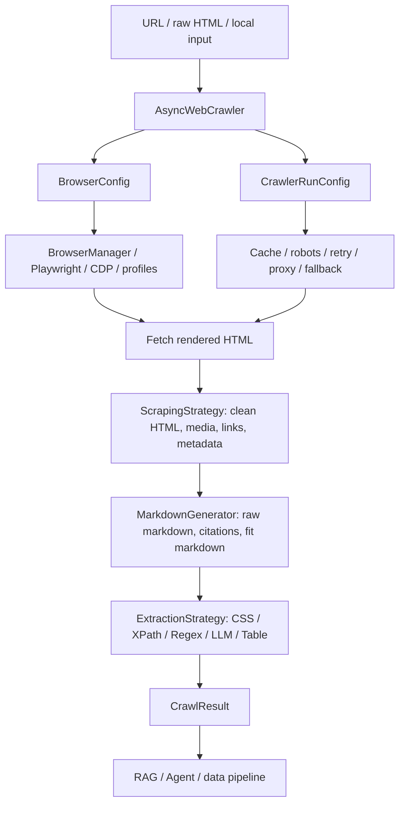
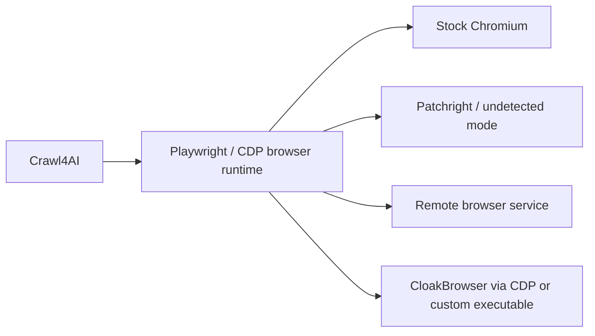

# Crawl4AI 开源项目调研

调研日期：2026-05-25  
数据时间：2026-05-25 12:09-12:30 CST  
调研对象：

- https://github.com/unclecode/crawl4ai
- https://pypi.org/project/crawl4ai/
- https://docs.crawl4ai.com/
- https://github.com/unclecode/crawl4ai/blob/main/SECURITY.md
- https://github.com/unclecode/crawl4ai/blob/main/docs/blog/release-v0.8.5.md

说明：用户写的是 `Crawl4Al`，结合 CloakBrowser README 里的集成项和项目语境，实际调研对象是 `Crawl4AI`。

调研口径：

- 一手来源：GitHub 仓库 README、源码、release、issue、workflow、security 文档、Docker 部署代码。
- 包元数据：PyPI、GitHub CLI / GitHub API。
- 本报告做的是静态源码与元数据调研，没有本地安装、跑 Playwright 浏览器、跑 Docker API、验证真实网站抓取质量，也没有复测 anti-bot 能力。没有验证就不装作验证过。

## 核心判断

`Crawl4AI` 不是传统意义上的“爬虫库”。传统爬虫的核心是“给 URL，拿 HTML”。`Crawl4AI` 的核心是“给 URL 或站点入口，产出适合 LLM/RAG/Agent 使用的 Markdown、结构化 JSON、链接图、截图、PDF、元数据和可追踪状态”。

一句话：

> Crawl4AI 是面向 LLM/RAG/Agent 数据管道的 Web extraction framework，不只是 crawler。

它确实很火：2024-05-09 创建，到 2026-05-25 已约 66.2k stars、6.7k forks。热度不是假的。但它也不是一个“小而美”的库，已经变成一个大而全的采集平台雏形：Python library、CLI、Docker API、MCP bridge、browser profiles、deep crawling、LLM extraction、Markdown generation、anti-bot fallback、cloud beta 都在里面。

【核心判断】

✅ 值得研究：它非常适合作为“Agent/RAG 如何把网页变成可消费知识”的主线项目。  
⚠️ 谨慎引入：依赖面宽、能力面宽、安全攻击面也宽。把 Docker API 暴露出去尤其危险。  
❌ 不要把它误判成普通 requests + BeautifulSoup 爬虫。它的复杂度已经是浏览器自动化、抽取管线、服务化和 Agent 工具层的组合。

## 基本信息

| 项 | 结论 |
|---|---|
| GitHub 仓库 | `unclecode/crawl4ai` |
| 创建时间 | 2024-05-09 |
| 最近 push | 2026-05-22 |
| Stars / Forks | 66,202 / 6,764 |
| Watchers | 368 |
| License | Apache-2.0 |
| 主语言 | Python |
| 最新 PyPI 版本 | `0.8.6`，上传于 2026-03-24 |
| 最新 GitHub release | `v0.8.5`，发布于 2026-03-18 |
| 当前 main 版本 | `crawl4ai/__version__.py` 为 `0.8.6` |
| Python 要求 | `>=3.10` |
| 测试文件数 | 185 个 `test_*.py` / `*_test.py` |
| 贡献者分布 | `unclecode` 976 次，`ntohidi` 225 次，`aravindkarnam` 87 次，核心贡献仍较集中 |

语言体量：

| 语言 | 字节数 |
|---|---:|
| Python | 4,186,768 |
| JavaScript | 35,549 |
| Shell | 9,301 |
| Dockerfile | 7,017 |

发布状态有一个小漂移：

- PyPI 最新是 `0.8.6`。
- GitHub release 列表最新是 `v0.8.5`。
- README 写 `v0.8.6` 是安全热修：因为 PyPI supply chain compromise，将 `litellm` 替换为 `unclecode-litellm==1.81.13`。

这说明研究或生产 pin 版本时，不能只看 GitHub release。

## 它解决什么问题

LLM/RAG/Agent 使用网页数据时，真正的问题不是“下载 HTML”。真正的问题是：

- 现代网页要浏览器渲染。
- 内容藏在 JS、Shadow DOM、iframe、lazy load、virtual scroll 里。
- 页面有 cookie banner、广告、导航、推荐、页脚、社交按钮这些噪声。
- RAG 需要 Markdown，不需要一坨 HTML。
- 结构化抽取需要 JSON schema、CSS/XPath、LLM extraction、table extraction。
- 大批量抓取需要并发、限速、缓存、失败恢复、代理、会话、监控。
- Agent 需要状态和诊断信息，不只是字符串结果。

Crawl4AI 的方向是把这些都纳入一个管线：



这个数据结构是对的。坏的爬虫框架只关心 HTML，好的 Agent 数据框架要关心“HTML 怎么变成可用知识”。

## 架构拆解

### 1. `AsyncWebCrawler`：门面和生命周期

核心文件：`crawl4ai/async_webcrawler.py`

主要入口：

- `start()`
- `close()`
- `arun()`
- `arun_many()`
- `aprocess_html()`

两种用法：

```python
async with AsyncWebCrawler() as crawler:
    result = await crawler.arun("https://example.com")
```

或长生命周期：

```python
crawler = AsyncWebCrawler()
await crawler.start()
result = await crawler.arun("https://example.com")
await crawler.close()
```

`AsyncWebCrawler` 做的事很多：

- 自动启动浏览器策略。
- 管缓存。
- 查 `robots.txt`。
- 应用代理轮换。
- 做 anti-bot 检测和 retry。
- 调用底层 crawl strategy 获取 HTML。
- 调用 `aprocess_html()` 生成 cleaned HTML、Markdown、结构化抽取结果。
- 对 deep crawl 做装饰。

好处：对用户来说入口简单。  
坏处：门面有变成“上帝对象”的趋势，逻辑已经很厚。

### 2. `BrowserConfig`：浏览器身份和连接方式

核心文件：`crawl4ai/async_configs.py`

它管的不是“浏览器类型”这么简单，而是浏览器运行时身份：

- `browser_type`: chromium / firefox / webkit
- `browser_mode`: dedicated / builtin / cdp / docker / custom
- `use_managed_browser`
- `cdp_url`
- `cache_cdp_connection`
- `create_isolated_context`
- `use_persistent_context`
- `user_data_dir`
- `proxy_config`
- `storage_state`
- `headers`
- `cookies`
- `user_agent`
- `enable_stealth`
- `memory_saving_mode`
- `max_pages_before_recycle`
- `avoid_ads`
- `avoid_css`

这说明项目作者理解一个关键事实：浏览器爬取不是 stateless HTTP 请求。浏览器 profile、CDP、cookie、proxy、UA、上下文隔离、内存回收都是同一类状态问题。

### 3. `CrawlerRunConfig`：单次任务配置

同在 `crawl4ai/async_configs.py`。

它管单次 crawl 该怎么做：

- 缓存策略。
- 等待策略。
- JS 执行。
- 截图、PDF。
- full-page scan / virtual scroll。
- scraping strategy。
- markdown generator。
- extraction strategy。
- table extraction。
- deep crawl strategy。
- proxy retry。
- fallback fetch function。
- robots.txt 检查。

这个分层比把所有参数塞进 `crawl(url, **kwargs)` 要强。`BrowserConfig` 管运行时，`CrawlerRunConfig` 管任务，边界清楚。

### 4. `BrowserManager`：Playwright / CDP / profile 控制面

核心文件：`crawl4ai/browser_manager.py`

它负责：

- 启动本地浏览器。
- 连接 CDP。
- 管 persistent profile。
- 复用或隔离 context。
- 缓存 CDP connection。
- 处理代理参数。
- 清理 browser process。
- 回收页面和上下文。

它也支持更复杂场景：

- `browser_mode="cdp"` 接第三方浏览器服务。
- `browser_mode="docker"` 接容器。
- `use_persistent_context=True` 保留登录态。
- `cache_cdp_connection=True` 复用 CDP。

这和 CloakBrowser 的关系在这里：Crawl4AI 不需要直接内置 CloakBrowser。只要 CloakBrowser 或其他浏览器服务暴露 CDP endpoint，Crawl4AI 可以通过 `BrowserConfig(cdp_url=...)` 接进去。这个边界比硬依赖某个 stealth browser 更合理。

### 5. Browser adapter：Playwright / stealth / undetected

核心文件：`crawl4ai/browser_adapter.py`

项目有 adapter 层：

- `PlaywrightAdapter`
- `StealthAdapter`
- `UndetectedAdapter`

`UndetectedAdapter` 使用 `patchright`，支持 isolated context evaluate、console capture、error capture 等。文档里也有“Undetected Browser Mode”。

好处：用 adapter 保护主流程，不把 Playwright / patchright 差异撒得到处都是。  
风险：anti-bot 相关逻辑天然会漂移。issue 里已经能看到 `playwright-stealth v2` 兼容问题和修复 PR。

### 6. Markdown generation

核心文件：`crawl4ai/markdown_generation_strategy.py`

默认策略：

- HTML -> Markdown。
- 链接转 citation。
- 可用 content filter 生成 fit markdown。
- 支持选择 `raw_html` / `cleaned_html` / `fit_html` 作为来源。

对 RAG 来说，这是项目的核心资产之一。RAG 不想要原始 HTML，也不想要被正文以外噪声污染的 Markdown。

### 7. Extraction strategies

核心文件：`crawl4ai/extraction_strategy.py`

主要策略：

- `JsonCssExtractionStrategy`
- `JsonXPathExtractionStrategy`
- `JsonLxmlExtractionStrategy`
- `RegexExtractionStrategy`
- `LLMExtractionStrategy`
- `CosineStrategy`

流程是：

1. 选择输入格式：markdown / html / cleaned_html / fit_html / fit_markdown。
2. chunk。
3. 用策略抽取。
4. 输出 JSON。

这是 Crawl4AI 和普通爬虫的关键差别：它不仅获取页面，还把抽取本身产品化。

### 8. Deep crawling

核心目录：`crawl4ai/deep_crawling/`

包括：

- BFS
- DFS
- Best-first
- URL filters
- Content filters
- Scorers
- crash recovery / resume
- prefetch mode

从 release notes 看，`v0.8.0` 重点就是 crash recovery 和 prefetch。这个方向很实用：真正的大站抓取会中断，不能从头再来。

### 9. Docker API / MCP / 服务化

核心目录：`deploy/docker/`

包含：

- FastAPI server
- Redis
- job queue
- auth
- webhook
- monitor
- MCP bridge
- playground

它已经不是单机库，而是朝数据采集服务发展。

好处：能作为独立服务给其他系统调用。  
坏处：攻击面骤增。URL 输入、JS 执行、hooks、反序列化、LLM key、Redis、webhook、MCP 工具，全都是安全边界。

## 和 CloakBrowser 的关系

你是在看 CloakBrowser 时看到 Crawl4AI，这个关系应该这样理解：



Crawl4AI 是采集和抽取框架。CloakBrowser 是浏览器 runtime 替换层。

组合方式：

- Crawl4AI 负责站点遍历、HTML 处理、Markdown、结构化抽取、缓存、deep crawl。
- CloakBrowser 负责更像真实浏览器的 Chromium runtime。
- 最干净的组合边界是 CDP：CloakBrowser 起服务，Crawl4AI 用 `BrowserConfig(cdp_url=...)` 连接。

不要把两者混成一个概念。一个是 extraction framework，一个是 stealth browser runtime。

## 好品味

### 1. `BrowserConfig` / `CrawlerRunConfig` 分层正确

这是真正的好设计。浏览器状态和单次任务配置是两种不同数据。把它们分开，后面才能维护。

### 2. 输出面向 LLM，而不是面向人眼

传统 crawler 抓 HTML，下一步每个人再写一次清洗脚本。Crawl4AI 把 Markdown、fit markdown、citation、JSON extraction 变成内建能力。这个方向对 RAG/Agent 很实用。

### 3. 多策略抽取

CSS/XPath/Regex/LLM/Cosine 都有。真实项目里，不可能全靠 LLM，也不可能全靠 CSS selector。稳定字段用 CSS/XPath，复杂表格和弱结构用 LLM，这才是实用主义。

### 4. Deep crawl 有状态意识

crash recovery、prefetch、filters、scorers 都是实际生产问题，不是论文玩具。

### 5. 安全问题有记录

项目有 `SECURITY.md`，明确列出 RCE、LFI、反序列化 RCE 等修复历史。能承认问题比假装没有问题强。

### 6. Docker 用非 root 用户

Dockerfile 创建并切换到 `appuser`。对这类会打开浏览器、跑 API 的项目来说，这是必要的基本动作。

## 坏味道和风险

### 1. 大而全，复杂度开始失控

这个项目现在什么都想管：

- browser runtime
- browser profile
- crawler
- scraper
- markdown
- extraction
- LLM table extraction
- anti-bot
- proxy
- Docker API
- MCP
- webhook
- cloud beta

每个方向都是真问题，但全部塞进一个仓库，维护成本会非常高。坏设计不是“功能多”，而是边界不够硬之后，每个 bug 都能影响别的模块。

### 2. 依赖面太宽

基础依赖已经包括：

- Playwright
- patchright
- playwright-stealth
- unclecode-litellm
- aiohttp / httpx
- pydantic
- lxml / bs4
- nltk
- numpy
- shapely / alphashape
- pyOpenSSL

可选依赖还包括 torch、transformers、sentence-transformers、selenium。  
这不是小库。生产环境必须 lock 依赖，不然升级一次可能炸在浏览器、LLM、NLP 或 SSL 任一层。

### 3. `setup.py` 有安装期副作用

`setup.py` 会创建 `~/.crawl4ai`，并在 cache 目录存在时删除 `cache_folder`。

这是坏味道。安装包不应该悄悄改用户 home 目录，更不应该在安装阶段删除缓存。也许它是历史兼容残留，但工程上不干净。

### 4. 安全历史说明攻击面真实存在

`SECURITY.md` 明确写了：

- `<0.8.0` Docker API hooks RCE。
- `<0.8.0` `file://` LFI。
- `0.8.1` 修复 `/crawl` 端点反序列化 + `eval()` RCE。

这不是要否定项目，而是说明它不能裸奔部署。

如果启用 Docker API，最低要求：

- JWT 开启。
- 强 `SECRET_KEY`。
- HTTPS / reverse proxy。
- 限制来源 IP。
- hooks 默认关闭。
- 不允许不可信用户传入任意 URL、JS、hooks、LLM config。
- 对内网地址做 SSRF 防护。

### 5. GitHub Actions 发布链不够硬

workflow 里 `actions/checkout@v6`、`setup-python@v6`、`Ilshidur/action-discord@master` 不是 commit pin。对普通项目还可以，对这种热门供应链项目不够硬。

它有 SBOM 目录，但发布流水线本身还可以更严。

### 6. 默认 secret 不应该存在

Docker auth 代码里：

```python
SECRET_KEY = os.environ.get("SECRET_KEY", "mysecret")
```

如果生产配置忘了设置环境变量，JWT 就落到默认弱密钥。这种默认值应该在 production 下 fail fast，而不是悄悄给一个 `mysecret`。

### 7. anti-bot 能力容易被误用

项目文档包含 stealth、undetected、proxy escalation、fallback fetch。技术上有用，但合规边界要明确。

合理用途：

- 自有站点测试。
- 合法授权的数据采集。
- 内部 RAG 知识库抓取公开或授权页面。
- QA / regression / accessibility。

不合理用途：

- 未授权绕过风控。
- 抓取敏感数据。
- 批量账号操作。
- 攻击登录、支付、政府、医疗等系统。

## 安全分析

已看到的安全设计：

- `SECURITY.md` 明确响应流程和支持版本。
- Docker API 支持 JWT。
- hooks 默认关闭。
- URL scheme validation 修复了 `file://` / `javascript:` / `data:` 这类问题。
- 反序列化加入 allowlist：`ALLOWED_DESERIALIZE_TYPES`。
- Docker 默认非 root。
- Redis 版本在 Dockerfile 中尝试 pin 到 CVE-patched release。
- 有 SBOM 文件。

仍需关注：

- SSRF 不只是 scheme 问题，还包括 `http://169.254.169.254`、内网域名、DNS rebinding、redirect 到内网。
- hooks 一旦打开就是任意代码边界。
- `execute_js` 能力本身很强，不能给不可信用户。
- LLM API key 进入服务端配置后，要避免通过 `/config/dump`、日志或错误暴露。
- Webhook 会访问外部 URL，也可能变成 SSRF 出口。
- MCP bridge 把能力暴露给 Agent，必须有权限控制和操作审计。

一句话：作为 library 用，风险可控；作为公共 Docker API 用，必须当成高风险服务。

## 与 Agent / RAG 的学习价值

这个项目非常值得本仓库深入拆，因为它覆盖了 Agent 数据入口的完整问题链。

可学习点：

1. Web-to-Markdown 管线。

HTML 不是给 LLM 用的好格式。Markdown 生成、链接 citation、fit markdown 是 RAG ingestion 的关键。

2. 抽取策略分层。

稳定结构用 CSS/XPath，弱结构用 LLM，噪声过滤用 BM25/pruning，复杂表格用 table extraction。不要万事都丢给 LLM。

3. 浏览器状态管理。

登录态、profile、CDP、context isolation、proxy、UA、headers 都是状态。状态设计错了，Agent 任务就不可靠。

4. Deep crawl 不是“递归点链接”。

需要 max depth、filters、scorers、domain control、crash recovery、resume、streaming。

5. Agent 工具服务化的风险。

把 crawler 暴露成 Docker API 或 MCP 工具后，安全边界完全变了。库函数 bug 和远程 RCE 是两个世界。

## 是否适合后续实验

适合，但要选对实验问题。不要一上来做“大规模爬全网”。

建议最小实验：

```text
labs/crawl4ai-web-to-rag/
├── README.md
├── crawl_one_page.py
├── crawl_docs_site.py
├── extract_schema.py
├── compare_markdown.md
└── report.md
```

实验问题：

1. 同一个网页，Crawl4AI 输出的 raw markdown、fit markdown、cleaned_html 有什么差别？
2. 对文档站做 BFS deep crawl，URL filter 和 depth 如何影响结果质量？
3. CSS/XPath extraction 与 LLM extraction 在稳定性、成本、可复现性上有什么差别？
4. 对一个 JS-heavy 页面，`wait_for`、`delay_before_return_html`、`scan_full_page` 分别解决什么问题？
5. 把 Crawl4AI 接到本地 RAG ingestion pipeline，比直接 `requests + bs4` 好在哪里，坏在哪里？

不要把实验目标设成“绕过某站反爬”。那不是本仓库当前主线。

## 采用建议

| 场景 | 建议 |
|---|---|
| 学习 Web-to-RAG | 强烈建议研究 |
| 单机脚本抓公开文档 | 可以用，注意 robots、限速和缓存 |
| 企业内部知识库采集 | 可以试点，先白名单域名和 pin 依赖 |
| Docker API 内网服务 | 可以，但必须开认证、限网、审计 |
| 公网开放 API | 不建议，除非做完整安全网关和租户隔离 |
| 未授权反爬绕过 | 不建议，也不应作为研究目标 |
| 大规模生产爬虫平台 | 可作为组件参考，不建议无审计直接当底座 |

## Linus 式拆解

第一层：数据结构

- 核心数据不是 URL，而是 crawl job。
- crawl job = browser identity + URL/input + fetch policy + render policy + clean policy + markdown policy + extraction policy + retry policy + output contract。
- 这个结构比普通爬虫重，但问题本身就重。

第二层：特殊情况

- JS 页面、Shadow DOM、iframe、lazy load、anti-bot、proxy、LLM extraction、table extraction 都是真问题。
- 但把所有特殊情况都塞进一个入口，长期会让 `AsyncWebCrawler` 变胖。
- 更好的方向是继续强化 strategy / adapter / config 边界。

第三层：复杂度

- 本质功能一句话：把网页变成 LLM 可消费的结构化内容。
- 当前实现用了很多概念：BrowserConfig、CrawlerRunConfig、Strategy、Adapter、Dispatcher、Docker API、MCP、Webhook。
- 这些概念大多有现实理由，但需要更硬的模块边界，否则会变成维护噩梦。

第四层：破坏性

- 对普通用户，API 简单，`AsyncWebCrawler().arun()` 很友好。
- 对生产用户，依赖升级和 release 漂移可能破坏稳定性。
- 对服务部署，安全配置错误可能直接变成 RCE/LFI/SSRF。

第五层：实用性

- 这个问题真实存在。RAG/Agent 没有高质量网页入口，就没有可靠知识输入。
- Crawl4AI 的复杂度高，但问题也确实复杂。
- 判断：值得学，值得小规模试点，不要裸奔上生产。

## 结论

`Crawl4AI` 是本仓库非常值得跟进的项目。它代表了一个重要趋势：爬虫正在从“抓网页”变成“为 LLM/Agent 生产可用上下文”。

但它的风险也来自同一个方向：能力越多，攻击面越大；越适合 Agent，越需要权限、审计和安全边界。

最终判断：

- 学习价值：高。
- 架构价值：高，尤其是 Web-to-Markdown、抽取策略、浏览器状态、deep crawl。
- 直接生产依赖：谨慎。
- Docker API 暴露：高风险，必须加安全网。
- 与 CloakBrowser 组合：可以研究，最好通过 CDP 边界组合，而不是硬耦合。

