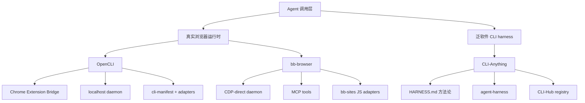

# Agent-Native CLI 与真实浏览器工具调研：CLI-Anything、OpenCLI、bb-browser

调研日期：2026-05-21；更新核对：2026-05-28 16:53 CST
调研对象：

- https://github.com/HKUDS/CLI-Anything
- https://github.com/jackwener/OpenCLI
- https://github.com/epiral/bb-browser
- https://github.com/epiral/bb-sites

调研口径：

- 一手来源：GitHub 仓库 README、package.json、源码、release、workflow、registry 文件、隐私/安全说明。
- 包元数据：npm registry、PyPI。
- 仓库状态：通过 GitHub CLI / GitHub API 抓取，原始数据时间为 2026-05-21；关键版本、manifest 计数和包状态更新核对于 2026-05-28 16:53 CST。
- 本报告是静态源码与元数据调研，没有本地安装三项目、跑完整测试套件、验证真实站点 adapter 稳定性，也没有对敏感账号做自动化测试。没有验证就不装作验证过。

## 核心判断

这三个项目不应该放进同一个简单排行榜。它们都在服务 Agent 工具化，但解决的问题不是同一个。

正确分层是：

1. 真实浏览器运行时：`OpenCLI`、`bb-browser`
2. 泛软件 agent-native CLI harness：`CLI-Anything`

如果研究主题是“Agent 如何使用真实浏览器、登录态、DOM、network 和站点 adapter”，优先拆 `OpenCLI` 和 `bb-browser`。

如果研究主题是“如何把任意软件包装成 Agent 可发现、可调用、可安装的 CLI harness”，再拆 `CLI-Anything`。

一句话结论：

> `OpenCLI` 更像工程化浏览器/网站 CLI runtime，`bb-browser` 更像 CDP 直连的真实浏览器 MCP 工具，`CLI-Anything` 更像 agent-native CLI harness 生产线和市场。

研究优先级：

| 研究问题 | 第一选择 | 第二选择 | 不建议优先 |
|---|---|---|---|
| 真实浏览器登录态如何给 Agent 使用 | `OpenCLI` | `bb-browser` | `CLI-Anything` |
| MCP 浏览器工具如何设计 | `bb-browser` | `OpenCLI` | `CLI-Anything` |
| 站点 adapter 如何工程化维护 | `OpenCLI` | `bb-browser` | `CLI-Anything` |
| 任意 GUI/专业软件如何 CLI 化 | `CLI-Anything` | `OpenCLI` 的 local tool 部分 | `bb-browser` |
| 供应链和权限边界研究 | 三个都值得看 |  |  |

最大风险也很清楚：

- `OpenCLI` 的 Chrome 扩展权限很大，包含 `debugger`、`tabs`、`cookies`、`<all_urls>` 等。
- `bb-browser` 的社区 adapter 会在真实登录浏览器页面上下文里执行 JS，能力很强，风险也很大。
- `CLI-Anything` 的 registry install command 可以触发 shell 安装路径，供应链边界必须审。

不要把“能让 Agent 跑起来”误判成“可以放心托管生产账号”。这类工具的核心资产是用户登录态，也正因为如此，它们默认不适合无审计地处理高风险动作。

## 基本信息

| 项目 | 本质 | License | 最新版本/发布 | Node/Python 包 | Stars / Forks | 最近 push | 备注 |
|---|---|---|---|---|---:|---|---|
| `HKUDS/CLI-Anything` | 泛软件 CLI harness 与 CLI-Hub | 仓库 Apache-2.0 | `v0.3.0`, 2026-04-24 | PyPI `cli-anything-hub 0.3.0` | 40,983 / 3,875 | 2026-05-23 | PyPI 元信息 license 为 MIT，和仓库不一致 |
| `jackwener/OpenCLI` | 网站/Electron/local tool 的 CLI runtime | Apache-2.0 | `v1.8.0`, 2026-05-19 | npm `@jackwener/opencli 1.8.0` | 22,857 / 2,304 | 2026-05-27 | README 写 Node >=21，package engines 是 >=20 |
| `epiral/bb-browser` | 真实 Chrome 的 CLI + MCP 控制面 | MIT | GitHub release 仍为 `bb-browser-v0.11.6`；git tag 到 `v0.13.2`；npm 到 `0.13.3` | npm `bb-browser 0.13.3` | 5,551 / 557 | 2026-05-28 | Node >=18，CDP-direct；release/tag/npm 三线漂移 |
| `epiral/bb-sites` | `bb-browser` 社区 site adapters | 未识别 license | 无 release | 无包发布 | 565 / 118 | 2026-05-25 | 当前源码统计 145 个 JS adapter 文件 |

补充数据：

- `CLI-Anything` 的 `registry.json` 当前包含 64 个 harness，`public_registry.json` 包含 16 个 public CLI。
- `OpenCLI` 的 `cli-manifest.json` 当前包含 900 条命令、155 个站点，其中 631 条标记为 browser-backed。
- `bb-browser` README 宣称 36 个平台、103 条命令；当前 `bb-sites` 仓库源码统计到 145 个 `.js` adapter 文件。这里大概率是 README 计数滞后，不是功能本身问题，但文档和实现存在漂移。
- 2026-05-28 核对时，`bb-browser` 的 GitHub latest release、git tag 和 npm latest 不一致。安装时不要照 GitHub latest release 盲 pin `0.11.6`，应以 npm registry 的 stable latest 和项目 changelog / tag 对齐复核。

## 项目分层地图



坏的分类会制造坏的结论。`OpenCLI` 和 `bb-browser` 是同类但路线不同；`CLI-Anything` 是更上游、更泛化的 harness 方法论，不是浏览器运行时的直接竞品。

## 架构硬对比：OpenCLI vs bb-browser

| 维度 | OpenCLI | bb-browser |
|---|---|---|
| 核心口号 | Make any website or Electron app your CLI | Your browser is the API |
| 浏览器连接模型 | CLI -> localhost daemon -> WebSocket -> Chrome extension -> Chrome APIs/CDP | CLI/MCP -> HTTP daemon -> Chrome DevTools Protocol |
| 默认 daemon | `127.0.0.1:19825` | `127.0.0.1:19824` |
| Chrome 依赖 | 需要 Browser Bridge Chrome extension | 直接连 CDP，可自动启动 managed Chrome |
| Auth / 防护 | `X-OpenCLI` header、Origin 检查、不给命令接口开 CORS、WebSocket verifyClient | bearer token 写入 `~/.bb-browser/daemon.json`，文件 mode `0600` |
| 远程暴露 | 源码固定监听 `127.0.0.1` | 支持 `--host 0.0.0.0`，用于 Tailscale / ZeroTier |
| Adapter 组织 | 内置 `clis/` 与 `cli-manifest.json`，支持 plugin / local adapter | 外部 `bb-sites` git repo，本地 `~/.bb-browser/sites` 可覆盖 |
| Adapter 执行 | 通过 OpenCLI adapter runtime 和扩展桥执行浏览器动作 | 读取 JS adapter，包装后在页面上下文 `eval` |
| MCP 地位 | 主要是 CLI 和 skills，浏览器能力给 Agent 使用 | MCP 是一等入口，`bb-browser --mcp` 直接注册工具 |
| CI 纪律 | 较强：typecheck、unit、extension、adapter、manifest drift、typed error lint、smoke 等 | 较薄：Ubuntu Node 20 跑 build、lint、test |
| 主要风险 | 扩展权限大，本机 daemon 信任边界，站点 adapter 脆弱 | CDP 控制面直接，社区 JS eval，远程 host 模式风险大 |

`OpenCLI` 的好处是工程边界厚，维护长期 adapter 的姿势更认真。`bb-browser` 的好处是能力路径短，MCP 接入干净，适合快速研究真实浏览器登录态。

## 项目 1：CLI-Anything

### 一句话

`CLI-Anything` 不是浏览器自动化工具。它是把各种软件变成 agent-native CLI 的 harness 方法论、插件模板和 CLI-Hub 市场。

### 它解决的问题

Agent 直接操作 GUI 软件很痛苦：界面变化、状态不可见、失败难复盘、动作不可组合。`CLI-Anything` 的思路是给每个软件生成一个面向 Agent 的 CLI harness，让 Agent 调命令而不是盲点 UI。

典型目录结构：

```text
<software>/
├── agent-harness/
│   ├── pyproject.toml / package metadata
│   ├── CLI implementation
│   └── tests / smoke scripts
└── skills/
    └── cli-anything-<software>/SKILL.md
```

核心资产：

- `cli-anything-plugin/HARNESS.md`：harness 编写规范。
- `registry.json`：CLI-Anything 自有 harness registry。
- `public_registry.json`：公共 CLI registry。
- `cli-hub/`：浏览、安装、卸载 CLI 的包管理器。
- `skills/cli-anything-*`：给 Agent 使用的工具说明。

### 数据结构

`CLI-Anything` 的关键数据结构不是代码里的某个 class，而是 registry entry。

一个 registry entry 至少描述：

- CLI 名称。
- 分类。
- 简介。
- 安装命令。
- skill 入口。
- 项目路径或来源。
- 卸载命令，部分条目存在。

这个数据结构把“Agent 应该怎么发现工具”和“用户机器应该怎么安装工具”放到同一个入口。方向是对的，但它也把供应链风险集中到了 registry。

### 好品味

1. 把 GUI 软件转换成 CLI harness，而不是让 Agent 每次重新学习 GUI。

这是真问题，不是论文问题。Agent 使用稳定命令比点按钮可靠。

2. `HARNESS.md` 给出了可复用方法论。

对本仓库来说，这比单个 harness 更有价值。我们要学的是“如何设计 Agent 工具接口”，不是收藏几十个 CLI。

3. Skill 和 harness 一起沉淀。

单有 CLI 不够，Agent 还要知道什么时候用、怎么用、失败怎么处理。`SKILL.md` 是必要配套。

### 坏味道和风险

1. registry install command 是供应链执行面。

`cli-hub` 的 installer 支持通用 `install_cmd`。当命令含管道、`&&` 等 shell operator 时，会走 `shell=True`。项目注释说 registry 是 trusted，但这不是安全边界，只是信任假设。

如果 registry 被污染，或者用户安装了未经审计的条目，后果就是本机执行任意安装命令。

2. analytics 默认开启。

`cli-hub` 有 PostHog/Umami analytics，可用：

```bash
export CLI_HUB_NO_ANALYTICS=1
```

关闭。对 Agent 工具市场来说，默认遥测要非常谨慎，尤其是它还会检测 Agent 环境和父进程。

3. license 元数据不干净。

仓库是 Apache-2.0，PyPI `cli-anything-hub` 元信息显示 MIT。可能只是包元数据疏漏，但开源生态项目连 license 都漂移，说明发布卫生还不够硬。

4. 生态质量天然不均。

`registry.json` 有 64 个 harness，但这不等于 64 个同等质量、同等测试、同等可维护的工具。CLI 市场最容易烂在“能装”和“能长期用”之间。

### 值得学习

- harness 目录结构。
- `HARNESS.md` 里对命令、输出、错误、smoke test 的约束思路。
- CLI registry 如何给 Agent 做工具发现。
- Skill 文档如何跟 CLI 绑定。

### 不值得照搬

- 不要无审计照搬 registry install command。
- 不要默认 analytics。
- 不要以 registry 数量作为质量指标。

### 可复刻的最小版本

做一个最小 harness，不要先做市场：

```text
labs/minimal-agent-cli-harness/
├── README.md
├── pyproject.toml
├── src/minimal_harness/cli.py
├── tests/test_cli.py
└── SKILL.md
```

验收标准：

- `tool list` 输出机器可读 JSON。
- `tool run <action>` 返回稳定 schema。
- 所有错误都有固定 `code`。
- `SKILL.md` 告诉 Agent 什么时候用这个 CLI。

## 项目 2：OpenCLI

### 一句话

`OpenCLI` 是目前三者里最值得优先深拆的浏览器工具项目。它在做一个工程化的“网站/Electron/local tool -> CLI”运行时，而不是只包几个站点脚本。

### 它解决的问题

很多网站没有 API，或者 API 需要复杂 cookie、CSRF、前端状态和登录态。让 Agent 直接用 HTTP client 会撞登录墙、风控和动态页面。

`OpenCLI` 的路线是：

```text
CLI
  -> localhost daemon
  -> WebSocket
  -> Chrome Browser Bridge extension
  -> 当前用户真实 Chrome profile
```

它既支持内置站点 adapter，也支持：

- `opencli browser` 原语，让 Agent 点击、输入、截图、抓状态。
- local tool registry。
- Electron app adapter。
- private plugin。
- adapter authoring skill。

### 数据结构

最重要的数据结构是 `cli-manifest.json`。

当前抽样数据：

- 900 条命令。
- 155 个站点。
- 631 条 browser-backed command。
- 所有条目 type 为 `js`。

典型 manifest entry 包含：

- `site`
- `name`
- `description`
- `access`
- `domain`
- `strategy`
- `browser`
- `args`
- `columns`
- `modulePath`
- `navigateBefore`

这个结构比“一个 JS 文件随便返回点东西”更可维护。它把权限、参数、输出列、导航前置条件放进 manifest，后续才能做 drift check、typed error lint、adapter tests。

### 安全边界

`OpenCLI` 的 daemon 监听 `127.0.0.1:19825`。源码里有明确的 defense-in-depth 设计：

- Origin 检查：拒绝非 `chrome-extension://` 的浏览器来源。
- 命令接口要求 `X-OpenCLI` header。
- 普通命令接口不返回 CORS 许可。
- WebSocket verifyClient 拦截浏览器页面伪装扩展。
- body size limit 1 MB。

这套防护主要是防网页 CSRF 和恶意网页连接本地 daemon。它不是防本机恶意进程。本机进程能发 header，也能打 localhost。这是本地 agent 工具的共同边界。

扩展权限是更大的现实风险。`extension/manifest.json` 包含：

- `debugger`
- `tabs`
- `cookies`
- `activeTab`
- `alarms`
- `storage`
- `tabGroups`
- `downloads`
- `<all_urls>`

这些权限不是装饰品。它们意味着一旦扩展或 daemon 链路被滥用，浏览器会成为强能力执行面。

### 好品味

1. manifest 是核心，不是散落脚本。

长期维护 adapter，必须有 manifest。否则数量一多，字段漂移、错误语义漂移、输出列漂移都会把生态拖死。

2. CI 对 adapter 生态有约束。

仓库有 typecheck、unit、extension、adapter、manifest drift、silent-column-drop、typed-error lint、smoke 等 workflow。不是所有都代表生产成熟，但至少说明作者知道 adapter 维护会烂在哪里。

3. 多 profile 不乱猜。

README 描述了 Chrome profile alias 和默认 profile 选择。真实用户浏览器不是一个抽象对象，profile 是状态边界。这里设计是对的。

4. README 里明确区分 humans 和 AI agents。

人类使用 CLI 和 Agent 调浏览器 primitives 是两类场景。混成一个接口，最后会变成谁都难用。

### 坏味道和风险

1. README 与 package engines 不一致。

README 写 Node.js >=21，npm/package.json 是 `>=20.0.0`。不是致命问题，但说明发布文档有漂移。

2. 扩展权限太强，必须被当作安全核心审。

这不是“有权限所以垃圾”。浏览器桥接工具确实需要强权限。但强权限就意味着要有更硬的审计、更新、隔离和用户确认策略。

3. 站点 adapter 天然脆弱。

网站 DOM、接口、登录策略、风控都会变。CI 再强也不能保证真实站点长期稳定。这里要区分“工程纪律不错”和“站点永远可用”。

4. 本机 daemon 不是安全沙箱。

`X-OpenCLI` 和 Origin 检查能挡网页，挡不了本机恶意进程。对本地可信 agent 足够，对多租户或远程服务不够。

### 值得学习

- `cli-manifest.json` 的字段设计。
- adapter 测试和 manifest drift 检查。
- Browser Bridge extension 与 daemon 的通信边界。
- profile/context 管理。
- 面向 Agent 的 browser primitives。

### 不值得照搬

- 不要在没有审计策略的情况下照搬 `<all_urls>` + `cookies` + `debugger` 权限。
- 不要把本地 daemon 当远程服务暴露。
- 不要用 adapter 数量证明质量。

### 可复刻的最小版本

做一个只读 browser-backed adapter：

```text
labs/minimal-browser-cli-runtime/
├── README.md
├── manifest.json
├── daemon.ts
├── extension/
└── adapters/github-repo-summary.ts
```

验收标准：

- daemon 只监听 `127.0.0.1`。
- 命令接口有 Origin/header 防护。
- adapter manifest 描述参数和输出 schema。
- 只做 read-only，不做写操作。
- 能返回稳定 JSON，而不是返回自由文本。

## 项目 3：bb-browser

### 一句话

`bb-browser` 是三者里浏览器控制路径最短、MCP 味最重的项目。它的核心价值是把真实 Chrome 变成 Agent 的 API。它的核心风险也是同一句话。

### 它解决的问题

普通 API 调用经常拿不到用户真实状态：

- 用户已登录，但 API token 没有。
- 网页有 CSRF、cookie、localStorage、前端 runtime。
- 站点没有公开 API。
- headless/browser automation 容易触发风控。

`bb-browser` 的路线是：

```text
CLI 或 MCP
  -> localhost:19824 daemon
  -> Chrome DevTools Protocol WebSocket
  -> 用户真实 Chrome / managed Chrome
```

README 的核心表述是：

> Your browser is the API. No keys. No bots. No scrapers.

这句话不是营销废话。它准确描述了实现方式：让 Agent 直接用真实浏览器上下文。

### 数据结构

`bb-browser` 的几个关键数据结构值得拆。

#### 1. daemon.json

daemon 启动时自动生成 bearer token，并写入：

```text
~/.bb-browser/daemon.json
```

字段包括：

- `pid`
- `host`
- `port`
- `token`

文件写入 mode 为 `0600`。client 和 MCP server 从这里读取 token，然后通过：

```http
Authorization: Bearer <token>
```

访问 daemon。

这个设计比单纯自定义 header 强，但它仍然是本机信任边界。token 文件泄露，或者 daemon 被暴露到网络接口，风险会立刻上升。

#### 2. TabState

`TabState` 为每个 tab 维护事件状态：

- network ring buffer：500 条。
- console ring buffer：200 条。
- JS errors ring buffer：100 条。
- `lastActionSeq`。
- snapshot refs。
- active frame。
- dialog handler。

全局 `seq` 单调递增，工具支持 `since: "last_action"` 做增量查询。

这是有好品味的数据结构。Agent 不该每次把全量 network/console 都塞回上下文，增量读取才是正确接口。

#### 3. site adapter

`bb-browser` 的 site adapter 是一个 JS 文件，带：

```js
/* @meta
{
  "name": "...",
  "domain": "...",
  "args": [...]
}
*/
```

执行时：

1. `site update` 从 `https://github.com/epiral/bb-sites.git` clone/pull 到 `~/.bb-browser/bb-sites`。
2. 本地私有 adapter 放在 `~/.bb-browser/sites`，优先于社区 adapter。
3. `site run` 读取 JS 文件，移除 meta。
4. 根据 domain 找已有 tab，没有就打开 `https://domain`。
5. 把 JS 包装后通过 browser `eval` 在页面上下文执行。

这条路径短，能力强，也危险。社区 JS 不是在沙箱里处理普通数据，而是在用户真实登录页面上下文里运行。

### MCP 工具面

`bb-browser --mcp` 会注册浏览器工具，主要包括：

- `browser_snapshot`：读取 accessibility tree 和 refs。
- `browser_click` / `browser_fill` / `browser_type`：基于 ref 操作页面。
- `browser_eval`：在页面上下文执行 JS。
- `browser_network`：读取请求/响应，支持 `since: "last_action"`。
- `browser_console`：读取 console。
- `browser_errors`：读取 JS error。
- `browser_screenshot`：截图。
- `browser_tab_list` / `browser_tab_new`：多 tab 管理。
- `browser_close_all`：关闭当前 MCP session 打开的 tabs。
- `site_list` / `site_search` / `site_info` / `site_run` / `site_update`：站点 adapter 系列。

这比 `OpenCLI` 更像“给 MCP 客户端直接用的浏览器控制面”。

### 好品味

1. CDP-direct，路径短。

没有扩展桥时，系统少一个组件。少一个组件就少一类失败。这是实用主义。

2. MCP 是一等公民。

不是把 CLI 勉强包装成 MCP，而是直接从 command registry 生成 MCP tools。对 Agent Fieldbook 来说，这很值得研究。

3. `TabState` 的 ring buffer 和 `since` 机制正确。

Agent 工具接口要控制上下文体积。全量 dump 是坏接口，增量查询是好接口。

4. 支持 managed Chrome。

自动启动带独立 user data dir 的 Chrome，路径为：

```text
~/.bb-browser/browser/user-data
```

这比直接污染用户主 profile 更好。虽然 README 强调真实登录态，但 managed profile 给了一个更可控的实验边界。

### 坏味道和风险

1. 社区 adapter 是高权限供应链。

`bb-sites` 当前没有 GitHub licenseInfo。adapter 文件数量不少，覆盖社媒、搜索、视频、财经、招聘、中文平台等。它们的功能价值来自真实登录态，也正因为如此，必须把它们当供应链代码审。

最糟糕的不是 adapter 失效，而是 adapter 被污染后用你的登录态做事。

2. `--host 0.0.0.0` 是高风险模式。

README 给出：

```bash
bb-browser daemon --host 0.0.0.0
```

用于 Tailscale / ZeroTier 远程访问。这个模式不能轻描淡写。它暴露的是浏览器控制面，不是普通 read-only API。即使有 bearer token，也要按高风险远程控制入口处理。

3. CORS 设置很宽。

`packages/daemon/src/http-server.ts` 默认设置：

```http
Access-Control-Allow-Origin: *
Access-Control-Allow-Headers: Content-Type, Authorization
```

它靠 bearer token 做 auth。这个选择不一定错，但和 `OpenCLI` 的“不给命令接口开 CORS”相比，攻击面更宽。尤其一旦用户把 host 改成 `0.0.0.0`，就必须更谨慎。

4. 文档存在实现漂移。

`PRIVACY.md` 仍写 Chrome extension 路径，但当前源码主路径是 CDP-direct，仓库里也没有看到 extension 目录。安全/隐私文档和实现不一致，是坏味道。

5. 部分宣传能力源码里看起来未完整实现。

`network route/unroute` 在 daemon dispatch 中当前返回 `routeCount: 0`，不像完整请求拦截/mock。对 README 或 skill 里提到的 mock/route 能力，要按源码实际实现判断。

### 值得学习

- CDP-direct daemon 设计。
- MCP tools 从 command registry 生成。
- `TabState`、ring buffer、`since: "last_action"`。
- 真实浏览器登录态如何变成 fetch/DOM/network 工具。
- community adapter 与 private adapter 的优先级模型。

### 不值得照搬

- 不要默认信任社区 adapter。
- 不要把 `--host 0.0.0.0` 当普通远程访问开关。
- 不要在安全文档滞后时相信 README 宣传。
- 不要让 Agent 在真实登录态下执行写操作，除非有人工确认和审计。

### 可复刻的最小版本

做一个只读 MCP browser tool：

```text
labs/minimal-cdp-mcp-browser/
├── README.md
├── package.json
├── src/daemon.ts
├── src/mcp.ts
└── src/tab-state.ts
```

验收标准：

- 只监听 `127.0.0.1`。
- token 存本地 `0600` 文件。
- 提供 `snapshot`、`network requests`、`console` 三个 read-only tools。
- 不支持 `eval` 或默认关闭 `eval`。
- 所有输出有 limit。

## 三者安全边界对照

| 风险点 | CLI-Anything | OpenCLI | bb-browser |
|---|---|---|---|
| 本机命令执行 | registry install command 可执行安装命令 | local tool / plugin / postinstall 路径需审 | `site update` 调 git，daemon 控浏览器 |
| 浏览器登录态 | 非核心 | 核心能力，走扩展桥 | 核心能力，走 CDP |
| 第三方代码进入执行面 | registry harness / install cmd | plugin / adapter | `bb-sites` JS adapter eval |
| 权限边界 | OS shell / package manager | Chrome extension + localhost daemon | CDP + localhost daemon |
| 远程暴露风险 | 取决于用户安装命令 | 默认 localhost | 支持 `--host 0.0.0.0` |
| 遥测 | `cli-hub` 默认 analytics，可关闭 | 未作为本次主要风险点 | README/PRIVACY 称无 telemetry |
| 文档漂移 | license 元数据漂移 | Node 版本文档漂移 | privacy extension 路径漂移 |

最重要的原则：

> 真实登录态是高价值凭据。任何能用真实登录态发请求、读 DOM、点按钮的工具，都不能按普通爬虫工具对待。

## Agent 工具接口设计启发

### 1. 先定状态边界，再定命令

`OpenCLI` 的 profile/context，`bb-browser` 的 tab state，`CLI-Anything` 的 harness workspace，本质上都在回答同一个问题：

> 这个工具当前操作的是谁的状态？

状态边界不清楚，后面所有权限、错误、审计都会烂。

### 2. 输出必须机器可读

Agent 不需要漂亮表格，它需要稳定 schema。`OpenCLI` manifest 的 `columns`、`args`、`access` 比 README 示例更重要。

### 3. 增量观察比全量 dump 好

`bb-browser` 的 `since: "last_action"` 是好设计。Agent 工具如果每次都返回全页面、全 network、全 console，就是上下文污染。

### 4. Adapter 生态需要测试，不是靠热情维护

站点 adapter 会坏。接口变、DOM 变、登录策略变、风控变。没有 manifest drift、typed error、smoke test，adapter 数量越多，维护债越大。

### 5. Tool install 是供应链入口

`CLI-Anything` 的 registry install、`OpenCLI` 的 plugin install、`bb-browser` 的 site update，本质都是“拉第三方代码到本机执行面”。这类能力必须有审计、pin 版本、来源校验和最小权限。

## 推荐研究路线

### 阶段 1：先拆 OpenCLI

目标：理解工程化 browser-backed CLI adapter。

重点文件/对象：

- `cli-manifest.json`
- `src/daemon.ts`
- `extension/manifest.json`
- `extension/src/background.ts`
- adapter tests 和 CI workflows
- docs/guide/extending-opencli.md

要回答的问题：

- manifest 如何约束 adapter？
- daemon 如何防普通网页打本地接口？
- profile/context 如何处理多 Chrome profile？
- adapter 失败如何表达？
- 哪些检查防止输出字段静默漂移？

### 阶段 2：再拆 bb-browser

目标：理解 CDP-direct + MCP browser tool。

重点文件/对象：

- `packages/shared/src/constants.ts`
- `packages/shared/src/protocol.ts`
- `packages/daemon/src/index.ts`
- `packages/daemon/src/http-server.ts`
- `packages/daemon/src/tab-state.ts`
- `packages/daemon/src/command-dispatch.ts`
- `packages/mcp/src/index.ts`
- `packages/cli/src/commands/site.ts`
- `epiral/bb-sites` adapter 文件

要回答的问题：

- daemon token 如何生成和分发？
- CDP discovery 和 managed Chrome 如何工作？
- snapshot refs 如何产生？
- network/console/error 如何增量读取？
- site adapter 如何进入页面上下文执行？
- `eval` 能否被限制或替换为更窄接口？

### 阶段 3：最后拆 CLI-Anything

目标：理解泛软件 CLI harness 方法论。

重点文件/对象：

- `cli-anything-plugin/HARNESS.md`
- `registry.json`
- `public_registry.json`
- `cli-hub/cli_hub/registry.py`
- `cli-hub/cli_hub/installer.py`
- `cli-hub/cli_hub/analytics.py`
- 任意 2 到 3 个质量较高的 `agent-harness`

要回答的问题：

- 一个好 harness 的命令边界是什么？
- 安装、卸载、版本、skill 如何绑定？
- 错误是否有稳定 code？
- 是否有 smoke test？
- registry 如何避免供应链污染？

## 最小实验建议

### 实验 A：OpenCLI read-only adapter

目的：验证工程化 adapter 的最小闭环。

建议任务：

```bash
npm install -g @jackwener/opencli
opencli doctor
opencli list
opencli hackernews top --limit 5
opencli browser state
```

进一步实验：

- 选一个 read-only 站点 adapter。
- 看 manifest、args、columns、error handling。
- 修改一个字段，观察 manifest drift 或 adapter test 如何失败。

不要做：

- 不要直接拿私人账号做写操作。
- 不要让 Agent 自动发帖、下单、删数据。

### 实验 B：bb-browser MCP read-only 工具

目的：验证 CDP-direct + MCP 工具面。

建议任务：

```bash
npm install -g bb-browser
bb-browser site update
bb-browser site list
bb-browser tab list
bb-browser open https://github.com
bb-browser snapshot
bb-browser network requests --with-body
```

MCP 配置：

```json
{
  "mcpServers": {
    "bb-browser": {
      "command": "npx",
      "args": ["-y", "bb-browser", "--mcp"]
    }
  }
}
```

进一步实验：

- 只使用 `snapshot`、`network`、`console`。
- 暂不使用 `eval`。
- 查看 `site_run` 时 adapter 实际执行的 JS。

不要做：

- 不要开 `--host 0.0.0.0`。
- 不要在真实重要账号上跑社区 adapter。

### 实验 C：CLI-Anything 最小 harness

目的：验证一个 agent-native CLI harness 的最小形态。

建议任务：

```bash
pip install cli-anything-hub
cli-hub list
cli-hub info <name>
```

进一步实验：

- 不执行安装，先审 registry entry 的 `install_cmd`。
- 选一个简单 harness，看它的 command schema、错误处理和 skill。
- 自己写一个只读 toy harness。

不要做：

- 不要盲目安装 registry 里不熟悉的命令。
- 不要把 analytics 默认开启作为团队环境基线。

## 最终结论

`OpenCLI`、`bb-browser` 和 `CLI-Anything` 都值得进入 AI Agent Fieldbook，但它们应该承担不同研究角色。

`OpenCLI` 是主样本，用来研究工程化浏览器 adapter runtime。它的 manifest、daemon、extension、CI 和 adapter 生态更接近长期可维护工具。

`bb-browser` 是对照样本，用来研究更直接的 CDP + MCP 浏览器能力。它更轻、更快、更贴近“真实浏览器就是 API”，也更容易踩安全边界。

`CLI-Anything` 是方法论样本，用来研究如何把非浏览器软件变成 Agent 可调用 CLI。它的价值在 harness 规范和 registry 生态，不在浏览器控制。

如果要给后续研究排队：

1. 先拆 `OpenCLI`，学习工程化 adapter 设计。
2. 再拆 `bb-browser`，学习 MCP/CDP 真实浏览器工具面。
3. 最后拆 `CLI-Anything`，抽象泛软件 CLI harness 方法论。

真正要学的不是“哪个项目星多”，而是三个问题：

1. Agent 工具的状态边界怎么定义？
2. 工具输出如何稳定、可验证、可恢复？
3. 当工具拿到用户真实登录态时，怎么不把权限边界搞成灾难？

## 来源

- `HKUDS/CLI-Anything` GitHub：<https://github.com/HKUDS/CLI-Anything>
- `cli-anything-hub` PyPI：<https://pypi.org/project/cli-anything-hub/>
- `jackwener/OpenCLI` GitHub：<https://github.com/jackwener/OpenCLI>
- `@jackwener/opencli` npm：<https://www.npmjs.com/package/@jackwener/opencli>
- `epiral/bb-browser` GitHub：<https://github.com/epiral/bb-browser>
- `bb-browser` npm：<https://www.npmjs.com/package/bb-browser>
- `epiral/bb-sites` GitHub：<https://github.com/epiral/bb-sites>
