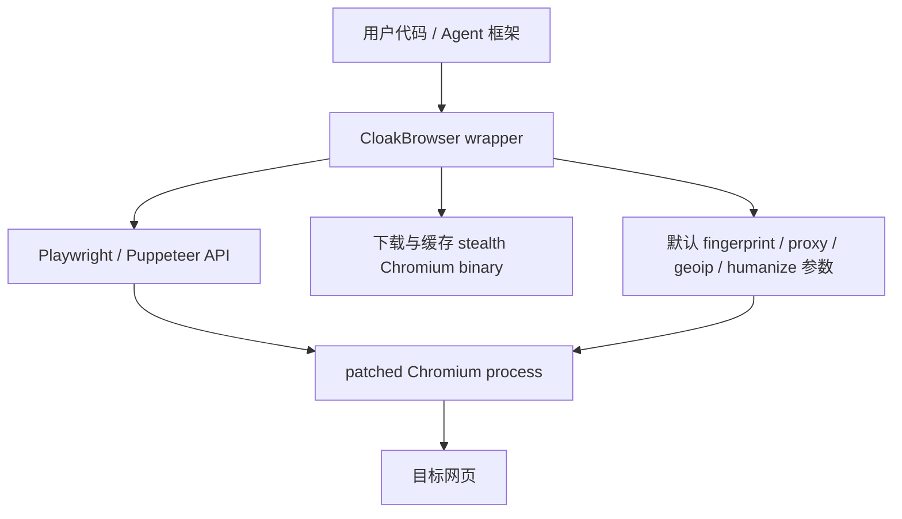
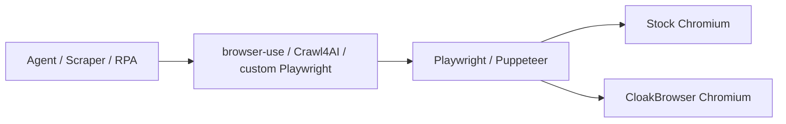

# CloakBrowser 开源项目调研

调研日期：2026-05-25  
数据时间：2026-05-25 12:09 CST；更新核对：2026-05-28 16:53 CST
调研对象：

- https://github.com/CloakHQ/CloakBrowser
- https://github.com/CloakHQ/CloakBrowser/releases
- https://pypi.org/project/cloakbrowser/
- https://www.npmjs.com/package/cloakbrowser
- https://github.com/CloakHQ/CloakBrowser/blob/main/BINARY-LICENSE.md

调研口径：

- 一手来源：GitHub 仓库 README、源码、release、issue、workflow、license 文件。
- 包元数据：PyPI、npm registry、GitHub CLI / GitHub API。
- 本报告做的是静态源码与元数据调研，没有下载运行预编译 Chromium，没有访问真实反爬站点，没有复测项目宣称的 reCAPTCHA、Cloudflare、FingerprintJS 结果。没有验证就不装作验证过。

## 核心判断

`CloakBrowser` 确实是近期爆火项目，但别被“开源很火”四个字带偏。它不是一个完整开源的 Chromium stealth fork。真正的核心资产是预编译 Chromium 二进制和未公开的 C++ patch 集；仓库里开源的是 Python / TypeScript wrapper、下载器、启动参数、humanize 行为层、Docker 和示例。

一句话：

> CloakBrowser 是“开源 wrapper + 受限二进制”的 stealth Chromium 分发项目，不是“完整源码可审计、可再构建、可自由再分发”的开源浏览器。

它值得研究，但不要直接当作生产基础设施塞进高风险流程。原因很简单：

- 热度是真的：2026-02-22 创建，2026-05-28 已约 21.9k stars、1.7k forks。
- 工程方向也是真的：把 Playwright / Puppeteer 的 API 保持住，只替换浏览器二进制和启动参数，这个数据结构选得对。
- 风险也是真的：核心二进制不可从仓库源码复现，二进制 license 限制再分发，自动下载和自动更新扩大供应链边界，项目定位天然贴近绕过 bot detection 的灰区。

【核心判断】

✅ 值得研究：它抓住了 Agent 浏览器自动化里的真实痛点，尤其是“浏览器指纹、行为轨迹、真实站点反自动化”这一层。  
❌ 不建议无脑引入：它的核心不是完全开源，合规、供应链、稳定性、可审计性都不能按普通 MIT 库处理。

## 基本信息

| 项 | 结论 |
|---|---|
| GitHub 仓库 | `CloakHQ/CloakBrowser` |
| 创建时间 | 2026-02-22 |
| 最近 push | 2026-05-26 |
| Stars / Forks | 21,900 / 1,748 |
| Open issues | 94 |
| License | wrapper 源码 MIT；Chromium 二进制单独 `BINARY-LICENSE.md` |
| 主语言 | Python、TypeScript |
| 最新 wrapper | PyPI / npm 均为 `0.3.31` |
| 最新二进制 release | `chromium-v146.0.7680.177.5`，2026-05-21 |
| 支持平台 | Linux x64/arm64、macOS arm64/x64、Windows x64，但版本不完全一致 |
| 贡献者分布 | `Cloak-HQ` 贡献 142 次，第二贡献者 12 次，bus factor 偏集中 |

更新判断：`0.3.31` 是 wrapper / Docker 层更新，不是新的 Chromium binary release。官方 changelog 显示它修复 HTTP proxy credentials 传递、humanize iframe 坐标、timeout 预算、Xvfb lock 清理等问题；二进制 release 仍停在 `chromium-v146.0.7680.177.5`。所以二进制不可复现、license、供应链边界这些核心风险没有变。

语言体量：

| 语言 | 字节数 |
|---|---:|
| Python | 575,173 |
| TypeScript | 472,663 |
| JavaScript | 30,204 |
| Nix | 6,657 |
| Dockerfile | 1,784 |
| Shell | 734 |

这个体量说明仓库主要是 wrapper、测试和集成层，不是 Chromium 源码树。完整 Chromium 源码不可能只有 12 MB clone 体量。

## 它到底解决什么问题

Playwright、Puppeteer、Selenium 在真实网站上经常不是输在“不会点按钮”，而是输在“太像自动化”：

- `navigator.webdriver`
- headless 特征
- CDP / automation signals
- canvas / WebGL / audio / fonts 指纹
- GPU、screen、timezone、locale 不一致
- WebRTC IP 泄漏
- 鼠标、键盘、滚动行为太机械
- proxy IP、时区、语言、硬件画像不匹配

CloakBrowser 的路线是：不要在网页里打一堆 JS 补丁，而是换一颗修改过的 Chromium 内核，再让 Playwright / Puppeteer 继续照常控制。

这比“让 Agent 写更多 if/else 兜底”更有品味。正确的数据结构是：



好处是用户侧代码改动很小。坏处是所有关键判断都压到了二进制可信度和项目维护者身上。

## 架构拆解

### 1. Python wrapper

核心文件：

- `cloakbrowser/browser.py`
- `cloakbrowser/download.py`
- `cloakbrowser/config.py`
- `cloakbrowser/human/*`

主要能力：

- `launch()`
- `launch_async()`
- `launch_context()`
- `launch_persistent_context()`
- `ensure_binary()`
- `binary_info()`
- `clear_cache()`

它的本质是：

1. 找到或下载 CloakBrowser Chromium。
2. 生成默认 stealth 参数。
3. 调用 Playwright 的 `chromium.launch()` 或 `launch_persistent_context()`。
4. 可选 patch Playwright 对象，让点击、输入、滚动更像人。

好品味：

- 复用 Playwright，不重造浏览器控制协议。
- 把二进制路径、缓存、平台检测封装在一层里。
- `launch_context()` 和 `launch_persistent_context()` 保持了 Playwright 的状态边界。

坏味道：

- `ensure_binary()` 默认会下载外部二进制并触发更新检查。对开发者友好，对供应链审计不友好。
- Python 依赖没有 lock 文件。库本身发布到 PyPI 可以接受，但企业复现构建需要额外 pin。
- 默认参数会改变平台画像，例如 Linux wrapper 默认伪装 Windows。这对反检测有用，但对调试、合规和可解释性是隐性行为。

### 2. TypeScript / npm wrapper

核心文件：

- `js/src/playwright.ts`
- `js/src/puppeteer.ts`
- `js/src/download.ts`
- `js/src/config.ts`
- `js/src/human/*`

主要能力：

- Playwright 入口：`import { launch } from 'cloakbrowser'`
- Puppeteer 入口：`import { launch } from 'cloakbrowser/puppeteer'`
- binary 管理：`ensureBinary()`、`checkForUpdate()`、`binaryInfo()`
- TS 类型定义

约束：

- Node `>=20`
- `playwright-core`、`puppeteer-core` 是 optional peer dependency
- 包自身只带 wrapper，不带二进制

这个设计比把整个 Chromium 塞进 npm 包要干净。npm 包变小，二进制走 GitHub Releases / cloakbrowser.dev。但代价是运行时下载和供应链边界更宽。

### 3. 预编译 Chromium binary

README 宣称有 58 个 source-level C++ patches，覆盖 canvas、WebGL、audio、fonts、GPU、screen、WebRTC、network timing、automation signals、CDP input behavior 等。

关键点：

- 仓库中没有 Chromium patch 源码。
- 仓库中没有完整 Chromium 构建脚本或可复现构建说明。
- release 提供二进制资产和 `SHA256SUMS`。
- workflow 提供 release binary 的 GitHub build provenance attestation，但下载器当前没有自动验证 attestation。

这不是小问题。对普通库来说，源码 MIT 基本够了；对浏览器二进制来说，不可复现构建就是核心风险。

### 4. `cloakserve`

`bin/cloakserve` 是一个 CDP multiplexer：单端口入口，根据 fingerprint seed 启动不同 Chrome process。它适合容器和远程 CDP 接入场景。

好处：

- 能把多个 identity 挂在同一个服务入口后面。
- 支持基于 query 参数生成不同 fingerprint 配置。
- 有 WebSocket Origin 检查，默认逻辑偏向本地/内部使用。

风险：

- CDP 本身就是浏览器远控能力。暴露到非可信网络就是大洞。
- 项目 issue 里已经出现“CDP server 无认证、外部暴露、proxy 凭证进进程参数、自动更新”等安全讨论。
- 任何 browser-as-a-service 形态还会碰到二进制 license 的 OEM/SaaS 限制。

### 5. Docker

Dockerfile 基于 `python:3.12-slim`，安装 Chromium 运行依赖、Node.js、fonts、Xvfb，构建 Python 和 JS wrapper，并在 build 阶段预下载二进制。

好处：

- 对“Linux server 上缺字体、缺 X server、缺依赖”的问题给了一个可运行基线。
- 自带 Xvfb，方便 headed mode。

风险：

- 当前 Dockerfile 没有显式创建非 root 用户。
- Chrome 默认参数含 `--no-sandbox`，这是容器便利性和安全边界之间的交换。
- 官方二进制 license 对再分发、嵌入 SaaS、第三方产品打包有明确限制，不能随手把镜像改一改当商业 browser service 分发。

## 开源边界：最容易误判的地方

仓库 `LICENSE` 是 MIT，这只覆盖 wrapper 源码。

`BINARY-LICENSE.md` 单独写明：

- 二进制可以免费用于个人或商业用途。
- 不允许重新分发、转售、再授权、重新打包或嵌入分发给第三方。
- 内部基础设施、内部容器、内部 artifact registry 可以使用。
- 如果是 OEM、SaaS、browser-as-a-service，必须另拿 license。
- 二进制基于 Chromium 和 ungoogled-chromium，但 CloakHQ 的 build config、patches 和 combined binary 被声明为 proprietary property。

所以它不是传统意义上的“完整 MIT 开源浏览器”。更准确的叫法是：

> MIT wrapper + proprietary/restricted-use patched Chromium binary。

这是整个项目最大的信息不对称点。

## 热度为什么起来

不是因为它发明了浏览器自动化。Playwright 早就够好了。

它火的原因是它切到了一个真实痛点：现在很多 Agent / scraper / RPA 项目在 demo 里能跑，一碰真实站点就死在 bot detection 上。CloakBrowser 把问题压缩成一句“换 import，换 binary”，传播成本很低。

另外它的 README 非常会卖：

- 明确对比 Playwright、playwright-stealth、undetected-chromedriver、Camoufox。
- 宣称 reCAPTCHA v3 0.9、Cloudflare Turnstile pass、FingerprintJS pass。
- 给 Python、JS、Docker、Selenium、Crawl4AI、browser-use、Stagehand、LangChain 等集成入口。
- release 频率高，issue 回复快。

这里要冷静：README 里的测试结果是项目方自测声明，不等于我们复测通过。反爬是对抗环境，今天过不代表下周过。

## 和现有浏览器自动化工具的关系

| 项目 | 本质 | CloakBrowser 的关系 |
|---|---|---|
| Playwright | 浏览器自动化底座 | CloakBrowser 复用它的 API 和控制层 |
| Puppeteer | Chromium 自动化库 | CloakBrowser 提供 Puppeteer wrapper |
| Selenium | WebDriver 自动化 | 可以通过 binary path 集成，但不是主入口 |
| playwright-stealth | JS 注入/配置补丁 | CloakBrowser 宣称比它更底层 |
| undetected-chromedriver | ChromeDriver stealth | CloakBrowser 走 Chromium + Playwright 生态 |
| Camoufox | Firefox C++ patch 路线 | CloakBrowser 的 Chromium 对标项 |
| browser-use / Crawl4AI / Scrapling | Agent / scraping 框架 | 可以把 CloakBrowser 当底层浏览器 binary |

正确定位：



CloakBrowser 是浏览器运行时替换层，不是 Agent 框架。

## 好品味

1. 保持 Playwright / Puppeteer API。

用户心智成本低，生态复用好。这是正确选择。最差的方案是自己发明一套半吊子的 browser API。

2. 把“指纹一致性”放在浏览器层，而不是页面注入层。

如果目标是减少检测面，JS 注入天然会留下痕迹。把能力下沉到浏览器层，方向合理。

3. 有 persistent context。

真实浏览器身份不是单次请求，而是 profile、cookie、localStorage、cache、history、fonts、screen、timezone 的组合。把 persistent profile 暴露成一等入口是对的。

4. 有 checksum、path traversal 防护、CI、pinned GitHub Actions。

下载器里有 SHA-256 校验，tar/zip 解压做了路径穿越防护。workflow 里 action pin 到 commit，这比很多爆火项目认真。

5. issue 响应快。

近期开 issue 多，但维护者回复也快。对新项目来说，这是活跃信号。

## 坏味道和风险

### 1. “开源”叙事有误导空间

README 写 free and open source，但真正的 fingerprint patches 和 Chromium build config 没在仓库里。二进制 license 又明确限制再分发。

这不是不能接受，但必须说清。否则工程决策会错。

### 2. 二进制供应链是硬风险

运行时自动下载 200MB 到 400MB 级别的浏览器二进制。checksum 有，但 checksum 和 binary 同源获取时，防的是传输损坏，不是源头被攻破。项目有 GitHub attestation，但下载器没自动验。

企业内使用至少要做：

- 固定 wrapper 版本。
- 固定 Chromium release tag。
- 内部镜像缓存。
- 独立保存 checksum。
- 禁用自动更新。
- 审核 license 是否允许当前分发方式。

### 3. 合规边界天然敏感

项目关键词包括 anti-detect、captcha-bypass、cloudflare-bypass、web-scraping。README 也明确围绕 bot detection 展示结果。

合理用途包括：

- 自家站点的 anti-bot 测试。
- 合法授权的安全/兼容性测试。
- 内部 RPA、QA、可访问性测试。
- 合规的数据采集，且遵守目标站点规则和法律。

不合理用途包括：

- 未授权绕过认证、验证码或风控。
- 批量注册、撞库、欺诈、爬取敏感数据。
- 把它包装成第三方 browser-as-a-service 绕过检测。

这不是道德说教，这是风险边界。踩错了，技术再漂亮也没用。

### 4. 反检测不是稳定接口

`navigator.webdriver` 这种静态信号好修，真实风控看的是组合：

- IP reputation
- 行为历史
- account age
- TLS / HTTP2 / QUIC 指纹
- headless/headed 差异
- profile 年龄
- session consistency
- 页面行为
- 风控侧模型更新

issue 里已经能看到 headless、FingerprintJS、Google captcha、Cloudflare、DataDome、Windows SOCKS5、Docker 渲染等问题。说明它不是“装上就永远无敌”。

### 5. 默认行为复杂

默认 seed 随机、Linux 默认 Windows fingerprint、geoip 会通过代理做外部查询、auto-update 默认开启。每个行为都有理由，但组合后调试难度上升。

好代码应该让特殊情况消失，不是让用户猜哪个隐式默认在影响结果。

### 6. bus factor 偏集中

贡献者列表显示主账号贡献压倒性领先。爆火项目早期很常见，但对生产依赖不是好信号。

## 安全观察

已看到的安全相关设计：

- 下载后 SHA-256 校验。
- tar / zip 解压防路径穿越。
- GitHub Actions action pin 到 commit hash。
- PyPI 使用 OIDC trusted publishing。
- npm publish 使用 provenance。
- Docker build 带 provenance、SBOM、cosign signing。
- `cloakserve` 对 WebSocket Origin 做检查。
- AWS Lambda 示例有 SSRF URL 校验测试。

仍然需要警惕：

- binary attestation 没有在 wrapper 下载时自动验证。
- 自动更新默认开启，不适合可审计生产环境。
- CDP 端口一旦暴露就是高风险控制面。
- Docker root + `--no-sandbox` 是现实便利性选择，不是安全强化。
- `CLOAKBROWSER_SKIP_CHECKSUM=true` 这种逃生开关不能出现在生产配置。
- 代理凭证可能进入进程参数或日志路径，实际部署要单独审。

## 对 AI Agent 研究的价值

本仓库最值得学的不是“如何绕过某个网站”，而是下面几件事：

1. 浏览器工具的分层。

Agent 不应该直接关心所有底层指纹细节。底层 runtime、控制 API、Agent 规划层应该分开。

2. 浏览器状态不是 cookie 文件这么简单。

真实身份包含 profile、指纹、IP、timezone、locale、字体、历史、行为。Agent 产品如果要做长期网页任务，必须把状态当一等数据结构。

3. “真实网页自动化”不能只靠 Playwright demo。

能打开 example.com 没意义。真实站点的失败面包括检测、登录态、风控、弹窗、区域化、cookie banner、A/B test、网络质量。

4. 合规和权限边界要进架构。

Agent 浏览器能力越强，越需要人审、高风险动作拦截、日志、回放、域名白名单和账号隔离。

## 是否建议深入拆

建议拆，但拆法要对。

优先研究：

- wrapper 如何保持 Playwright API 兼容。
- binary 下载、缓存、版本选择、checksum、auto-update 机制。
- persistent context 的状态边界。
- humanize 如何 patch Playwright / Puppeteer 对象。
- `cloakserve` 的 CDP multiplexing 思路。
- license 与分发边界。

不要优先研究：

- 怎么对某个真实站点绕过检测。
- 怎么批量注册账号。
- 怎么把它做成第三方绕过服务。
- 盲目复刻它的 fingerprint flags。

如果要做实验，建议只做授权环境里的最小对照：

```text
labs/browser-runtime-comparison/
├── README.md
├── stock-playwright/
├── cloakbrowser/
└── report.md
```

实验只回答一个问题：

> 同一段 Playwright 流程，在本地自建检测页面和公开 demo 检测页面上，stock Chromium 与 CloakBrowser 暴露的浏览器信号差异是什么？

不要上来就碰高风险生产站点。那不是研究，是给自己找麻烦。

## 采用建议

| 场景 | 建议 |
|---|---|
| 学习研究 | 可以研究，重点看架构和供应链边界 |
| 内部 QA / 自家 anti-bot 测试 | 可以小范围试用，但要固定版本、留审计记录 |
| 合规数据采集 | 谨慎，只在明确授权和法律允许范围内使用 |
| 生产 Agent 浏览器基础设施 | 不建议直接依赖默认下载和自动更新，需要内部镜像和安全审计 |
| 第三方 SaaS / browser-as-a-service | 不要默认使用，先解决 license |
| 绕过第三方认证/风控 | 不建议，也不应作为研究目标 |

## Linus 式拆解

第一层：数据结构

- 核心数据不是“浏览器窗口”，而是 browser identity。
- identity = binary version + fingerprint seed + platform profile + proxy/IP + timezone/locale + persistent profile + behavior model。
- 如果只把它当 `browser.launch()`，你迟早会被状态一致性搞死。

第二层：特殊情况

- 反检测工具最大的问题是特殊情况爆炸。
- 每个站点、每个风控版本、每个 OS、每个 proxy 都可能变成一个 if。
- CloakBrowser 的好处是把一部分 if 下沉到二进制层；坏处是剩余 if 更难观察。

第三层：复杂度

- 本质功能一句话：用修改过的 Chromium 承接 Playwright / Puppeteer 控制。
- 这个核心很简单，周边复杂度来自下载、更新、profile、proxy、geoip、CDP、humanize、Docker。
- 真要用，先把这些开关减少到最小，不要一上来全打开。

第四层：破坏性

- 对已有 Playwright 用户，API 兼容是优势。
- 对生产环境，自动更新和二进制替换可能破坏可复现性。
- 对商业分发，binary license 可能直接破坏产品形态。

第五层：实用性

- 真问题：Agent / scraper / RPA 在真实站点被自动化检测挡住。
- 解决方案复杂度：高，但问题也真实。
- 判断：值得研究，不值得迷信；适合做 runtime 层案例，不适合当万能钥匙。

## 结论

`CloakBrowser` 是一个很值得放进 AI Agent Fieldbook 的项目，因为它暴露了浏览器 Agent 真正麻烦的那一层：不是“怎么点按钮”，而是“怎么让浏览器状态、身份、行为和网络环境看起来一致，并且可控、可审计”。

但它最关键的部分并不在 MIT 源码仓库里，而在受限 license 的预编译 Chromium binary 里。这个事实决定了它的研究价值大于直接依赖价值。

最终判断：

- 学：值得。
- 试：可以，必须在授权环境。
- 上生产：先审计、pin 版本、关自动更新、内部分发、确认 license。
- 当“开源绕过神器”：这是错误理解。
