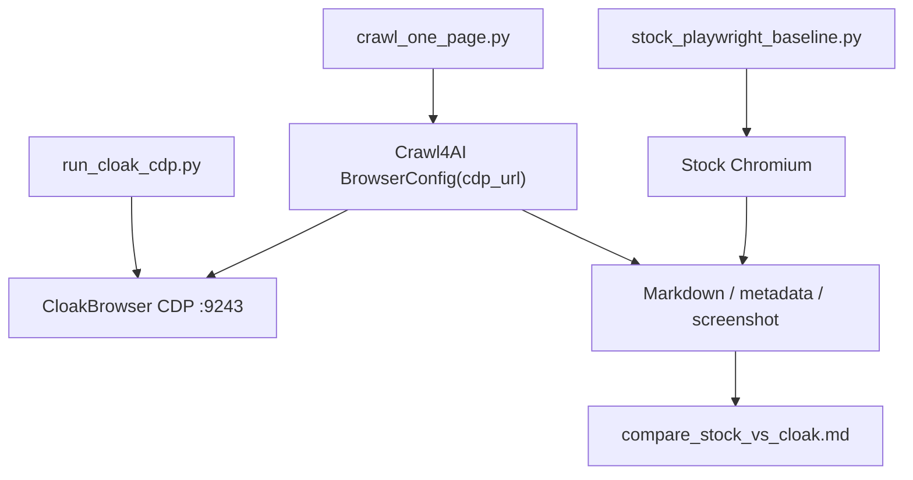

# CloakBrowser 深入落地使用手册

调研日期：2026-05-26  
数据时间：2026-05-26 00:40 CST；更新核对：2026-05-28 16:53 CST
前置报告：[CloakBrowser 开源项目调研](./2026-05-25-cloakbrowser-research.md)、[Crawl4AI 开源项目调研](./2026-05-25-crawl4ai-research.md)

调研对象：

- https://github.com/CloakHQ/CloakBrowser
- https://github.com/CloakHQ/CloakBrowser/releases
- https://github.com/CloakHQ/CloakBrowser-Manager
- https://pypi.org/project/cloakbrowser/
- https://www.npmjs.com/package/cloakbrowser
- https://github.com/CloakHQ/CloakBrowser/blob/main/BINARY-LICENSE.md

说明：

- 本文做的是落地方法调研，不是绕过第三方风控的操作指南。
- 推荐实验范围：自有站点、内部 QA、授权测试环境、公开检测 demo、文档采集管线。
- 不推荐目标：批量注册、撞库、绕过认证、绕过金融/医疗/政府系统、未授权数据采集。
- 本次没有下载运行 CloakBrowser 二进制，没有复测项目宣称的 Cloudflare、reCAPTCHA、FingerprintJS 结果。

## 核心判断

CloakBrowser 的正确落地姿势不是“把所有爬虫都换成它”，而是把它当作一个可替换的浏览器 runtime。

最小有用边界：

```text
业务任务 / Agent / crawler
  -> Playwright / browser-use / Crawl4AI / agent-browser
  -> CloakBrowser wrapper 或 CDP endpoint
  -> patched Chromium binary
  -> 授权网页
```

【核心判断】

✅ 值得继续落地研究：它与 Playwright/CDP 的边界清楚，能作为浏览器 Agent runtime 层案例。  
❌ 不值得无脑生产引入：二进制不可源码复现，自动下载/更新扩大供应链边界，license 对再分发和 SaaS 有明确限制。

【关键洞察】

- 数据结构：核心不是 `browser`，而是 `browser identity`。
- 复杂度：真正要管的是版本、profile、fingerprint seed、proxy、timezone、locale、viewport、行为模型和输出契约。
- 风险点：CDP 暴露、二进制 license、自动更新、未授权使用、profile 污染。

## 当前可用版本

截至 2026-05-28 16:53 CST，本次核对到的信息：

| 项 | 结果 |
|---|---|
| GitHub 仓库 | `CloakHQ/CloakBrowser` |
| Stars / Forks | 21,900 / 1,748 |
| 最近更新 | 2026-05-26 21:13 UTC |
| 最新 release | `chromium-v146.0.7680.177.5`，2026-05-21 |
| PyPI 最新版本 | `0.3.31`，要求 Python `>=3.9` |
| npm 最新版本 | `0.3.31`，要求 Node `>=20.0.0` |
| npm peer deps | `playwright-core >=1.53.0`、`puppeteer-core >=21.0.0` 等 |
| 当前最新二进制资产 | Linux x64、Windows x64、`SHA256SUMS` |
| Python wrapper 支持 | `launch()`、`launch_async()`、`launch_context()`、`launch_persistent_context()` |
| JS wrapper 支持 | Playwright、Puppeteer、`launchContext()`、`launchPersistentContext()` |
| Manager | `CloakHQ/CloakBrowser-Manager`，早期 alpha，Docker 自托管 profile 管理器 |

注意一个实际问题：README 的平台表显示 Linux arm64、macOS arm64/x64、Windows x64 都有对应版本，但最新 release assets 当前只列出 Linux x64、Windows x64 和 `SHA256SUMS`。不要只看 README，要以目标平台实际 release asset 和 wrapper 版本映射为准。

`0.3.31` 是 wrapper / Docker 层更新，不是新的 Chromium binary release。官方 changelog 显示它主要修 HTTP proxy credentials、humanize iframe 坐标、timeout 预算、Xvfb lock 清理和 Dependabot 元数据；最新 Chromium binary 仍是 `chromium-v146.0.7680.177.5`。

## 数据结构先行

落地时不要把配置散落在脚本里。正确的数据结构应该长这样：

```yaml
browser_identity:
  wrapper_version: "0.3.31"
  chromium_version: "146.0.7680.177.5"
  runtime_mode: "local-wrapper | cdp-service | manager-profile"
  fingerprint_seed: "fixed-for-returning-session-or-empty-for-ephemeral"
  profile_dir: "./profiles/vendor-docs-collector"
  proxy:
    server: ""
    geoip: false
  locale: "en-US"
  timezone: "America/New_York"
  viewport:
    width: 1920
    height: 947
  headless: true
  humanize: false
  extensions: []
  update_policy:
    auto_update: false
    binary_source: "official | internal-mirror | local-binary"
```

这不是形式主义。没有这个结构，后面排查“为什么昨天能跑今天不能跑”时只剩猜。

## 三种运行形态

### 1. 直接 wrapper 模式

适合：单脚本、最小实验、迁移 Playwright 脚本。

Python：

```bash
pip install cloakbrowser==0.3.31
python -m cloakbrowser install
python -m cloakbrowser info
```

```python
from cloakbrowser import launch_context

context = launch_context(
    headless=True,
    locale="en-US",
    timezone="America/New_York",
)
page = context.new_page()
page.goto("https://example.com")
print(page.title())
context.close()
```

JavaScript：

```bash
npm install cloakbrowser@0.3.31 playwright-core
```

```javascript
import { launchContext } from "cloakbrowser";

const context = await launchContext({
  headless: true,
  locale: "en-US",
  timezone: "America/New_York",
});
const page = await context.newPage();
await page.goto("https://example.com");
console.log(await page.title());
await context.close();
```

优点：最少概念，最像 Playwright。  
缺点：每个任务自己启动浏览器，难做统一调度和观测。

### 2. CDP 服务模式

适合：Crawl4AI、browser-use、Scrapling、远程 runner、容器部署。

Docker 启动：

```bash
docker run -d --name cloak \
  -p 127.0.0.1:9222:9222 \
  cloakhq/cloakbrowser cloakserve
```

Playwright 连接：

```python
from playwright.sync_api import sync_playwright

with sync_playwright() as pw:
    browser = pw.chromium.connect_over_cdp("http://127.0.0.1:9222")
    page = browser.new_page()
    page.goto("https://example.com")
    print(page.title())
    browser.close()
```

带固定 identity：

```python
browser = pw.chromium.connect_over_cdp(
    "http://127.0.0.1:9222"
    "?fingerprint=11111"
    "&timezone=America/New_York"
    "&locale=en-US"
)
```

支持的 query params 包括 `fingerprint`、`timezone`、`locale`、`platform`、`platform-version`、`brand`、`brand-version`、`gpu-vendor`、`gpu-renderer`、`hardware-concurrency`、`device-memory`、`screen-width`、`screen-height`、`proxy`、`geoip`。

优点：边界清楚，框架只接 CDP，不硬依赖 CloakBrowser。  
缺点：CDP 是高危控制面，不能裸露公网。

### 3. Profile Manager 模式

适合：人工可视化管理 profile、需要 noVNC 看浏览器、多个持久身份并行。

```bash
docker run -p 8080:8080 \
  -v cloakprofiles:/data \
  cloakhq/cloakbrowser-manager
```

打开 `http://localhost:8080`，创建 profile 后点击 Launch。运行中的 profile 暴露 CDP endpoint：

```python
from playwright.async_api import async_playwright

async with async_playwright() as pw:
    browser = await pw.chromium.connect_over_cdp(
        "http://localhost:8080/api/profiles/<profile-id>/cdp"
    )
    page = browser.contexts[0].pages[0]
    await page.goto("https://example.com")
```

如果放到网络环境里，必须设置 `AUTH_TOKEN`，并放到 HTTPS 反向代理后面：

```bash
docker run -p 8080:8080 \
  -v cloakprofiles:/data \
  -e AUTH_TOKEN=your-secret-token \
  cloakhq/cloakbrowser-manager
```

优点：profile 管理直观，适合人机协同排查。  
缺点：项目 README 自称 early alpha，不适合直接当生产控制台。

## 与本机工具链的结合

本机已经可用的浏览器自动化工具有 `agent-browser`、`browser-use`、Playwright、`bb-browser`、Browser/Chrome DevTools MCP。CloakBrowser 不应该替代这些工具，它只应该替代底层浏览器 runtime。

### Crawl4AI

推荐边界：CloakBrowser 起 CDP，Crawl4AI 负责抓取、Markdown、结构化抽取。

```python
import asyncio

from crawl4ai import AsyncWebCrawler, BrowserConfig, CrawlerRunConfig
from cloakbrowser import launch_async


async def main():
    cb_browser = await launch_async(
        headless=True,
        args=[
            "--remote-debugging-port=9243",
            "--remote-debugging-address=127.0.0.1",
        ],
    )

    browser_config = BrowserConfig(
        browser_mode="cdp",
        cdp_url="http://127.0.0.1:9243",
    )
    run_config = CrawlerRunConfig()

    async with AsyncWebCrawler(config=browser_config) as crawler:
        result = await crawler.arun("https://example.com", config=run_config)
        print(result.markdown[:500])

    await cb_browser.close()


asyncio.run(main())
```

这个结构有品味：Crawl4AI 不需要知道 CloakBrowser 的内部实现。

### browser-use

推荐边界：browser-use 做 Agent 行为，CloakBrowser 做 CDP browser。

```python
import asyncio

from browser_use import Agent, BrowserSession, ChatOpenAI
from cloakbrowser import launch_async


async def main():
    cb_browser = await launch_async(
        headless=True,
        args=[
            "--remote-debugging-port=9242",
            "--remote-debugging-address=127.0.0.1",
        ],
    )

    session = BrowserSession(cdp_url="http://127.0.0.1:9242")
    agent = Agent(
        task="Open https://example.com and summarize the visible page title.",
        llm=ChatOpenAI(model="gpt-4o-mini"),
        browser_session=session,
    )
    print(await agent.run())

    await cb_browser.close()


asyncio.run(main())
```

注意：这需要 LLM API key。不要把它当无权限的本地脚本。

### agent-browser

`agent-browser` 不能直接接已有 CDP 时，可以用二进制路径和启动参数接入：

```bash
BINARY_PATH=$(python3 -c "from cloakbrowser.download import ensure_binary; print(ensure_binary())")
STEALTH_ARGS=$(python3 -c "from cloakbrowser.config import get_default_stealth_args; print(','.join(get_default_stealth_args()))")

export AGENT_BROWSER_EXECUTABLE_PATH="$BINARY_PATH"
export AGENT_BROWSER_ARGS="$STEALTH_ARGS"

agent-browser --session cloak-sanity open "https://example.com"
agent-browser --session cloak-sanity eval "document.title"
```

这条路径适合把 CloakBrowser 接到现有 CLI 自动化工具里，但可观测性和配置治理要自己补。

### Playwright MCP / Chrome DevTools MCP

本机的 `mcp__playwright__` 和 `mcp__chrome_devtools__` 更适合调试本地 Web App。若要用 CloakBrowser，则应先起 CDP 服务，再让脚本或框架连接，不建议把 Codex 的 Browser 插件强行替换掉。插件的价值是本地验证和 DevTools 观测，CloakBrowser 的价值是 runtime identity。

## 持久 profile 怎么用

一次性任务用 `launch_context()`。需要登录态、cookie、localStorage、IndexedDB、Service Worker、缓存时，用 `launch_persistent_context()`。

```python
from cloakbrowser import launch_persistent_context

PROFILE_DIR = "./profiles/docs-collector"

ctx = launch_persistent_context(
    PROFILE_DIR,
    headless=False,
    locale="en-US",
    timezone="America/New_York",
)
page = ctx.new_page()
page.goto("https://example.com")
ctx.close()
```

原则：

1. 一个业务身份一个 profile dir。
2. profile dir 不能混用目标站点。
3. profile dir 要纳入密钥/隐私数据管理，不要提交到 Git。
4. 返回用户场景使用固定 `fingerprint` seed；一次性任务可以用随机 seed。
5. profile 损坏时重建，不要靠一堆 if 修。

## 供应链与版本治理

这是落地最容易被忽略的部分。

### 必须 pin 版本

```bash
pip install cloakbrowser==0.3.31
npm install cloakbrowser@0.3.31
docker pull cloakhq/cloakbrowser:0.3.31
```

CloakBrowser wrapper 会按版本映射下载二进制。官方说明每个 wrapper 版本绑定对应 binary。生产实验必须记录 wrapper version、binary version、SHA256SUMS 和运行平台。

### 关闭自动更新

源码显示 `ensure_binary()` 会触发后台更新检查。要可复现，设置：

```bash
export CLOAKBROWSER_AUTO_UPDATE=false
```

如果企业内部有镜像源：

```bash
export CLOAKBROWSER_DOWNLOAD_URL=https://internal.example.com/cloakbrowser
```

如果安全团队已经审过某个本地 binary：

```bash
export CLOAKBROWSER_BINARY_PATH=/opt/cloakbrowser/chrome
```

默认会校验 SHA-256。不要设置 `CLOAKBROWSER_SKIP_CHECKSUM=true`，除非你知道自己在破坏什么。

## 安全边界

### CDP 端口

CDP 等于浏览器远程控制权。它能执行 JS、读页面、拿 cookie、操作文件下载。规则很简单：

```text
只绑定 127.0.0.1。
需要远程访问时用 SSH tunnel。
不能直接暴露公网。
不能放在无认证内网。
```

Docker compose 应该至少这样：

```yaml
services:
  cloakbrowser:
    image: cloakhq/cloakbrowser:0.3.31
    command: cloakserve
    ports:
      - "127.0.0.1:9222:9222"
    restart: unless-stopped
```

### Manager

CloakBrowser-Manager 默认适合本机用。要放到网络环境：

- 必须设置 `AUTH_TOKEN`。
- 必须加 HTTPS 反向代理。
- profile volume 要加备份和权限控制。
- 不要把它当多租户 SaaS；binary license 也不支持你默认这么干。

### License

wrapper 是 MIT，但二进制不是。`BINARY-LICENSE.md` 明确：

- 可个人和商业内部使用。
- 可在内部基础设施、CI、VM、容器、artifact repository 中运行未修改 binary。
- 不得重新分发、转售、再打包、反编译、修改 binary。
- 如果把 binary 嵌进第三方产品、托管服务或 browser-as-a-service，需要单独 OEM/SaaS license。

所以内部研究可以做；拿它做对外浏览器云服务，不行。

## 落地 SOP

### Phase 0：合规边界

先回答四个问题：

1. 目标站点是否自有或获得授权？
2. 是否涉及登录、支付、个人数据、敏感行业？
3. 是否允许自动化访问？
4. 失败时是否会触发账号、IP、业务流程风险？

答不清就停。不要用技术掩盖授权问题。

### Phase 1：本地 sanity check

目标：确认 wrapper、binary、平台依赖可用。

```bash
python3 -m venv .venv
source .venv/bin/activate
pip install cloakbrowser==0.3.31
CLOAKBROWSER_AUTO_UPDATE=false python -m cloakbrowser install
CLOAKBROWSER_AUTO_UPDATE=false python -m cloakbrowser info
```

写一个只访问 `https://example.com` 的脚本，验证：

- 浏览器能启动。
- 页面能打开。
- title 能读取。
- close 能正常释放进程。
- 日志里记录 wrapper/binary/platform。

### Phase 2：本地检测页对照

建一个自有 HTML 页面采集这些信号：

- `navigator.webdriver`
- `navigator.userAgent`
- `navigator.platform`
- plugins length
- screen / viewport
- timezone / locale
- canvas hash
- WebGL vendor / renderer
- WebRTC candidate

同一段脚本分别跑 stock Playwright 与 CloakBrowser，只比较差异，不做外站绕过。

### Phase 3：接入 Crawl4AI

目标：验证“网页到 LLM 上下文”的真实收益。

最小实验：

```text
labs/cloakbrowser-crawl4ai-cdp/
├── README.md
├── run_cloak_cdp.py
├── crawl_one_page.py
├── compare_stock_vs_cloak.md
└── report.md
```

验收：

- Crawl4AI 可通过 CDP 连接。
- 输出 markdown 与 metadata。
- 记录运行耗时、错误、重试、输出长度。
- 能切回 stock Playwright，不和 CloakBrowser 硬耦合。

### Phase 4：profile 试点

目标：验证持久 profile 是否解决“每次都是新用户”的状态问题。

做法：

- 每个目标一个 profile dir。
- 禁止 profile dir 入 Git。
- 明确 profile 生命周期：创建、使用、归档、销毁。
- 记录 fingerprint seed 与 profile dir 的映射。

### Phase 5：服务化

只有当 Phase 1-4 都稳定，才考虑服务化。

最小服务边界：

- `cloakserve` 只监听 `127.0.0.1`。
- 上层 worker 通过本机 CDP 访问。
- job 输入白名单 URL。
- 限制并发和最大运行时间。
- 保存操作日志、版本、profile id、输出 hash。
- 不向外部用户暴露原始 CDP。

## 配置决策表

| 问题 | 选择 |
|---|---|
| 只是跑一次公开页面 | `launch_context()` |
| 需要保留登录态 | `launch_persistent_context(profile_dir)` |
| 要接 Crawl4AI/browser-use | `launch_async(... --remote-debugging-port=...)` 或 Docker `cloakserve` |
| 要可视化管理多个 profile | CloakBrowser-Manager |
| 要本地前端测试 | 继续用 Playwright/Chrome DevTools MCP，不需要 CloakBrowser |
| 要可复现 | pin wrapper，关 auto-update，记录 binary SHA |
| 要部署到服务器 | Docker + 127.0.0.1 CDP + SSH tunnel |
| 要对外提供浏览器服务 | 先解决 OEM/SaaS license 和安全隔离 |

## 常见坑

1. 只换 browser，不管 identity。

这会制造随机成功。版本、profile、proxy、locale、timezone 不一致，结果没有解释能力。

2. 把 CDP 暴露到网络。

这是安全事故，不是配置问题。

3. 自动更新不关。

今天过、明天挂，然后没有人知道变了什么。

4. 用 `launch()` 做需要状态的任务。

默认 ephemeral/incognito 风格上下文不适合返回用户场景。需要状态就用 persistent context。

5. 让 Crawl4AI 直接依赖 CloakBrowser。

坏边界。用 CDP 接入，让 crawler 和 browser runtime 解耦。

6. 忽略字体。

官方 changelog 和 README 都提到 Docker/云环境缺字体会影响 canvas/emoji 渲染。自定义镜像要补标准字体包。

7. 把 Manager 当生产多租户平台。

它是 early alpha。先当本地/内网工具，不要上来就当 SaaS。

## Linus 式方案

如果要继续做落地实验，别写一个“大一统 stealth crawler”。那会很快变成垃圾。

正确路线：

1. 第一步简化数据结构：定义 `browser_identity` 和 `crawl_job`。
2. 第二步消除特殊情况：所有框架统一走 CDP，不在每个集成里写一套启动逻辑。
3. 第三步用最笨但清晰的方式实现：先一个本地检测页，一个 example.com，一个 Crawl4AI demo。
4. 第四步确保零破坏性：CloakBrowser 必须能一键切回 stock Playwright。

最小实验设计：



验收标准：

- 能启动和关闭 CDP 服务。
- Crawl4AI 能连接并抽取 `example.com`。
- 同一输入可切换 stock 与 CloakBrowser。
- 输出记录版本、运行参数、耗时和错误。
- 不访问未授权目标，不保存真实账号 cookie。

## 下一步建议

优先建 `labs/cloakbrowser-crawl4ai-cdp/`。原因很简单：它能验证 CloakBrowser 在本仓库主线里的价值，而不是停留在 README 宣称。

实验只回答一句话：

> CloakBrowser 作为 CDP runtime 接入 Crawl4AI 后，是否能稳定产出可追踪、可复现、可切回 stock browser 的 Web-to-RAG 输入？

如果这个最小实验跑不稳，别谈更复杂的 Agent 浏览器基础设施。
