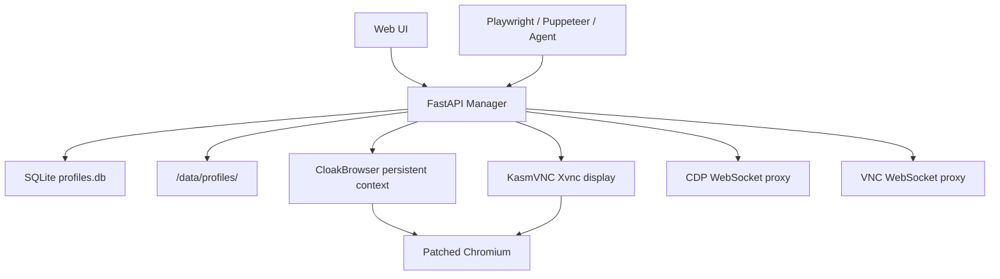
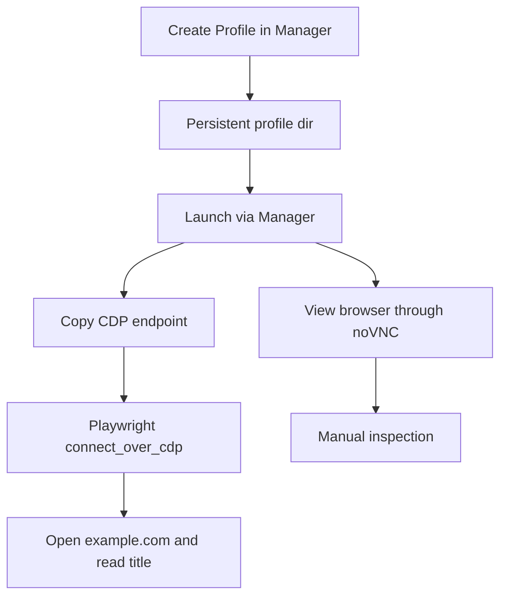

# CloakBrowser-Manager 开源项目调研

调研日期：2026-05-28
数据时间：2026-05-28 15:16 CST
调研对象：

- https://github.com/CloakHQ/CloakBrowser-Manager
- https://github.com/CloakHQ/CloakBrowser-Manager/blob/main/README.md
- https://github.com/CloakHQ/CloakBrowser-Manager/blob/main/LICENSE
- https://github.com/CloakHQ/CloakBrowser-Manager/blob/main/BINARY-LICENSE.md
- https://hub.docker.com/r/cloakhq/cloakbrowser-manager
- https://github.com/CloakHQ/CloakBrowser

源码快照：

- 仓库：`CloakHQ/CloakBrowser-Manager`
- 分支：`main`
- commit：`a85b213286c8a25475a6f3243c47f99375ffa772`
- tag：`v0.0.10`
- commit 时间：2026-05-26 20:34:24 +0200

调研口径：

- 本报告基于 GitHub API、Docker Hub API、README、license、源码静态阅读。
- 没有运行 Docker 镜像，没有启动 KasmVNC，没有下载或运行 CloakBrowser 二进制。
- 没有复测 Cloudflare、reCAPTCHA、FingerprintJS、BrowserScan 等检测结果。
- 本报告不是绕过第三方风控的操作指南。推荐范围是本地研究、自有站点、授权测试、浏览器 Agent runtime 学习。

## 核心判断

`CloakBrowser-Manager` 之前确实没有单独调研过。它只在 CloakBrowser 落地手册里被当作一种运行形态提到过，但没有拆源码、数据结构、API、安全边界和成熟度。

一句话：

> CloakBrowser-Manager 是 CloakBrowser 的本地 profile 控制台，不是成熟的多租户 browser platform。

【核心判断】

✅ 值得研究：它把浏览器身份、持久 profile、VNC 可视化、CDP 自动化入口放进一个很小的控制面，对理解 browser agent runtime 很有价值。
❌ 不适合直接生产：项目自称 early alpha，默认无认证，Docker README 示例容易暴露到非本机网卡，profile 和 proxy 凭证明文落盘，VNC/clipboard/CDP 还有明显的工程毛边。

【关键洞察】

- 数据结构：核心对象不是浏览器窗口，而是 `profile`。它绑定 fingerprint seed、proxy、timezone、locale、screen、GPU、user data dir、运行状态和 CDP/VNC 控制入口。
- 复杂度：真正麻烦的是三套协议同时存在：HTTP API 管 profile，WebSocket 代理 VNC，WebSocket 代理 CDP。
- 风险点：一旦 Manager 暴露到不可信网络，攻击面不只是 Web UI，而是可读写 cookie 的远程浏览器控制面。

## 基本信息

截至 2026-05-28 15:16 CST，本次核对到的信息：

| 项 | 结论 |
|---|---|
| GitHub 仓库 | `CloakHQ/CloakBrowser-Manager` |
| 创建时间 | 2026-03-11 04:24:38 UTC |
| 最近 push | 2026-05-26 18:34:38 UTC |
| Stars / Forks | 546 / 114 |
| Open issues | 25 |
| GitHub release | 无 release，使用 git tag 和 Docker Hub tag |
| 最新 tag | `v0.0.10` |
| 最新 Docker tag | `latest` / `v0.0.10`，更新时间 2026-05-26 |
| Docker 镜像大小 | Docker Hub API 返回约 523 MB |
| Docker 架构 | `linux/amd64`、`linux/arm64`，另有两个 unknown manifest |
| 主语言 | Python |
| 前端 | React 19、Vite 6、Tailwind CSS、noVNC |
| 后端 | FastAPI、SQLite、KasmVNC、CloakBrowser Python wrapper |
| 浏览器依赖 | `cloakbrowser[geoip]>=0.3.31` |
| 贡献者 | GitHub contributors API 当前只返回 `Cloak-HQ`，19 commits |
| 源码 license | GUI 源码 MIT |
| 二进制 license | CloakBrowser Chromium binary 单独 license，禁止再分发、转售、反编译、修改；对第三方托管服务需要 OEM/SaaS license |

语言体量：

| 语言 | 字节数 |
|---|---:|
| Python | 141,899 |
| TypeScript | 66,149 |
| Dockerfile | 2,557 |
| CSS | 1,608 |
| Shell | 914 |
| HTML | 429 |
| JavaScript | 81 |

这个体量说明它是一个薄控制台，不是复杂平台。

## 它到底解决什么问题

CloakBrowser 原项目解决的是浏览器 runtime identity：让 Playwright / Puppeteer 启动 patched Chromium。

CloakBrowser-Manager 解决的是另一个问题：人工和自动化如何复用同一组持久浏览器身份。



这条边界是有价值的：人可以通过 VNC 看同一个 profile，程序可以通过 CDP 自动化同一个 profile。它不是采集框架，不负责 Crawl4AI 那类内容抽取，也不该替代 Playwright 或 browser-use。

## 数据结构分析

核心数据结构是 `ProfileCreate` / `ProfileResponse`，字段集中在 `backend/models.py`：

```text
profile:
  id
  name
  fingerprint_seed
  proxy
  timezone
  locale
  platform
  user_agent
  screen_width / screen_height
  gpu_vendor / gpu_renderer
  hardware_concurrency
  humanize / human_preset
  headless
  geoip
  clipboard_sync
  auto_launch
  color_scheme
  launch_args
  notes
  tags
  user_data_dir
  status
  vnc_ws_port
  cdp_url
```

持久化在 SQLite：

- 数据库：`/data/profiles.db`
- profile 表：保存 fingerprint、proxy、locale、timezone、屏幕、GPU、行为、启动参数等。
- tag 表：`profile_tags`
- user data dir：`/data/profiles/<profile-id>`

运行态对象是 `RunningProfile`：

```text
running_profile:
  profile_id
  Playwright BrowserContext
  X display number
  VNC websocket port
  CDP port
```

这个数据结构方向是对的。profile 是长期身份，running profile 是短期进程。持久身份和运行状态没有混在一起，这是好品味。

## 架构拆解

### 1. 后端 FastAPI

核心文件：

- `backend/main.py`
- `backend/browser_manager.py`
- `backend/vnc_manager.py`
- `backend/database.py`
- `backend/models.py`

主要职责：

- profile CRUD
- 浏览器启动和停止
- KasmVNC display 分配
- VNC WebSocket 代理
- CDP WebSocket 代理
- clipboard relay
- 单 token 认证
- 静态前端托管

API 面：

| 类型 | 路径 | 作用 |
|---|---|---|
| Auth | `/api/auth/status` | 查询是否启用认证 |
| Auth | `/api/auth/login` | 用 `AUTH_TOKEN` 登录 |
| Auth | `/api/auth/logout` | 删除 cookie |
| Profile | `/api/profiles` | list / create |
| Profile | `/api/profiles/{id}` | get / update / delete |
| Runtime | `/api/profiles/{id}/launch` | 启动 profile |
| Runtime | `/api/profiles/{id}/stop` | 停止 profile |
| Runtime | `/api/profiles/{id}/status` | 查询运行状态 |
| Clipboard | `/api/profiles/{id}/clipboard` | host 与 VNC 剪贴板同步 |
| VNC | `/api/profiles/{id}/vnc` | noVNC WebSocket 代理 |
| CDP | `/api/profiles/{id}/cdp` | CDP WebSocket 代理 |
| CDP | `/api/profiles/{id}/cdp/json/version` | CDP discovery 代理 |
| CDP | `/api/profiles/{id}/cdp/json/list` | CDP targets 代理 |
| System | `/api/status` | running count、binary version、profile count |

### 2. 浏览器启动流程

`BrowserManager.launch()` 的核心路径：

1. 检查 profile 是否已经 running 或 launching。
2. 通过 `VNCManager.allocate()` 分配 display 和 VNC WebSocket port。
3. 分配 CDP port，范围是 `5100-5199`。
4. 清理 Chrome stale lock 文件。
5. 初始化默认书签和 DuckDuckGo 搜索。
6. 启动 KasmVNC。
7. 根据 profile 构造 fingerprint args。
8. 追加用户自定义 `launch_args`。
9. 规范化和校验 proxy。
10. 调用 `launch_persistent_context_async()` 启动 CloakBrowser。
11. 注入 clipboard 捕获脚本。
12. 记录到 `running` 字典。

这个流程很直接。没有过度抽象，符合当前项目体量。

坏味道也明显：`launch_args` 是任意 Chromium flag 列表。对本地工具没问题，对网络服务就是危险能力。它可以影响扩展加载、调试、网络、特性开关。Manager 一旦暴露，profile API 就不只是配置 API，而是浏览器进程启动参数控制面。

### 3. VNC 层

`VNCManager` 用 KasmVNC 的 `Xvnc`：

- display 从 `:100` 开始。
- WebSocket port 从 `6100` 开始。
- `-rfbport -1` 禁用 raw VNC TCP 端口。
- `-interface 127.0.0.1` 只监听容器内部 localhost。
- FastAPI 对外代理 `/api/profiles/{id}/vnc`。

这比直接暴露 VNC 端口好。raw VNC 没有必要暴露出去，Web UI 只通过 FastAPI 代理访问。

复杂性在 RFB 兼容层。`backend/main.py` 里写了较多 noVNC 和 KasmVNC 消息过滤、PointerEvent 重写、BinaryClipboard 转 ServerCutText。说明 VNC 这层不是稳定“拿来即用”，而是已经遇到协议兼容问题，用代码补了不少边界情况。

### 4. CDP 层

每个 profile 启动一个 Chrome CDP port，FastAPI 再把 discovery 和 WebSocket 代理出去：

```text
external client
  -> /api/profiles/<id>/cdp
  -> FastAPI websocket proxy
  -> 127.0.0.1:<cdp_port>
  -> Chromium CDP
```

好处：外部工具只看到统一的 Manager API，不需要知道容器内部端口。

风险：CDP 是高危控制面。它能执行 JS、读页面、取 cookie、操作下载、驱动页面。如果 Manager 没有认证或被弱 token 保护，后果比普通 Web 后台严重。

### 5. 前端 React

核心文件：

- `frontend/src/App.tsx`
- `frontend/src/lib/api.ts`
- `frontend/src/components/ProfileForm.tsx`
- `frontend/src/components/ProfileViewer.tsx`
- `frontend/src/components/ProfileList.tsx`

前端功能：

- profile 列表
- 新建和编辑 profile
- 设置 platform、fingerprint seed、proxy、timezone、locale、screen、GPU、humanize、clipboard sync、auto launch、color scheme、user agent、tags、launch args、notes
- 启动和停止 profile
- noVNC 浏览器查看器
- 复制 CDP endpoint
- host 与 VNC clipboard 同步

前端整体简单。真正的复杂度集中在 `ProfileViewer` 的 clipboard 逻辑和 noVNC 连接逻辑。

坏味道：`ProfileViewer.tsx` 里还有大量 `console.log("[clipboard] ...")`，并且会打印剪贴板内容前 50 个字符。这对本地调试能理解，但 profile 里可能是密码、token、客户数据。生产或半生产环境不该这么打日志。

## 部署和依赖

官方 README 主推 Docker：

```bash
docker run -p 8080:8080 -v cloakprofiles:/data cloakhq/cloakbrowser-manager
```

源码里的 `docker-compose.yml` 更安全：

```yaml
ports:
  - "127.0.0.1:8080:8080"
volumes:
  - ~/.cloakbrowser-manager:/data
environment:
  - AUTH_TOKEN=${AUTH_TOKEN:-}
```

注意这里有一个实际坑：

- README 的 `docker run -p 8080:8080` 默认绑定宿主机所有网卡。
- README 后面又说 container binds to localhost only。
- 真正安全的本机命令应该绑定 `127.0.0.1`：

```bash
docker run -p 127.0.0.1:8080:8080 \
  -v cloakprofiles:/data \
  cloakhq/cloakbrowser-manager
```

如果需要远程访问，用 SSH tunnel，不要把 8080 直接暴露到公网：

```bash
ssh -L 8080:localhost:8080 your-server
```

非 Docker 本地开发在 README 中给了路径，但当前源码硬编码：

```python
DATA_DIR = Path("/data")
DB_PATH = DATA_DIR / "profiles.db"
```

这意味着普通本机开发可能卡在 `/data` 权限和 KasmVNC/Xvnc 依赖上。当前 open PR #27 正是在修“documented local backend startup work”，说明 README 的本地后端启动路径目前并不可靠。

## 安全边界

### 1. 认证

认证模型很简单：

- 默认不启用认证。
- 设置 `AUTH_TOKEN` 后，`/api/*` 需要 Bearer token 或 `auth_token` cookie。
- `/api/auth/status`、`/api/auth/login`、`/api/status` 例外。
- cookie 里的值就是原始 token。
- 如果没有 HTTPS，README 明确提醒 token 以明文 HTTP 传输。

这适合本机工具，不适合公网服务。

### 2. WebSocket Origin 检查

`_check_websocket_origin()` 会检查浏览器 WebSocket 的 Origin 和 Host 是否一致。没有 Origin 的非浏览器客户端会放行，方便 Playwright / Puppeteer。

这是合理的，但它不是认证。它只挡一类跨站 WebSocket 劫持，不挡拿到 token 的客户端，也不挡本来就能访问 API 的调用者。

### 3. VNC

KasmVNC 自己是无认证：

```text
-SecurityTypes None
-DisableBasicAuth
-interface 127.0.0.1
```

这只有在“VNC 端口永远只在容器内部 localhost，外部必须走 FastAPI auth”这个前提下才合理。

### 4. CDP

CDP port 绑定在容器内部 `127.0.0.1`，外部通过 FastAPI 代理访问。边界比裸露 CDP port 好。

但只要 Manager 暴露，CDP 就等于暴露。它不是普通 API。

### 5. 数据落盘

profile 数据里有敏感内容：

- cookies
- localStorage
- IndexedDB
- cache
- proxy 凭证
- notes
- launch args
- 可能还有账号状态

这些都在 `/data` volume 里，proxy 字段在 SQLite 明文保存。这个项目没有加密、密钥管理、审计、访问分级。

## 当前问题和成熟度

GitHub 当前 open issues 里，比较有代表性的：

| 编号 | 类型 | 标题 | 反映的问题 |
|---|---|---|---|
| #30 | issue | Failed to load extensions with launch args | extension / launch args 仍有兼容问题 |
| #29 | issue | Failed to connect to the bus / Missing X server | ARM/Linux/显示环境问题 |
| #28 | issue | Copy failure issue in VNC mode | VNC clipboard 仍不稳 |
| #25 / #24 | issue | leak incognito, browser tampering | fingerprint 检测仍有争议 |
| #23 | issue | FingerprintJS playground failed | 反检测效果未必稳定 |
| #18 | issue | IPHey detection | 检测站点兼容问题 |
| #12 | issue | CDP port already in use | 端口生命周期问题，源码已用 rotating port 缓解 |
| #9 / #2 | issue | Mac clipboard / VNC replication | host/VNC 剪贴板问题 |
| #4 | issue | VNC freezes during video playback | noVNC/KasmVNC 高动态内容不稳 |

Open PR：

| 编号 | 标题 | 说明 |
|---|---|---|
| #27 | Make documented local backend startup work | 说明本地非 Docker 开发路径仍有硬伤 |
| #26 | add field for search engine selection | profile 配置仍在补功能 |
| #22 | auto-restart browser on crash | 崩溃恢复尚未合入 |
| #21 | profile reset endpoint | profile 生命周期管理尚未合入 |
| #20 | CI pipeline | CI 尚未合入 |

这不是坏事，但说明项目还早。把它当研究对象可以，把它当稳定平台就过头了。

## 测试覆盖

源码里有测试：

后端测试文件和用例数：

| 文件 | 用例数 |
|---|---:|
| `backend/tests/test_database.py` | 26 |
| `backend/tests/test_auth.py` | 14 |
| `backend/tests/test_browser_manager.py` | 33 |
| `backend/tests/test_models.py` | 22 |
| `backend/tests/test_api.py` | 43 |
| `backend/tests/test_rfb.py` | 31 |
| `backend/tests/test_vnc_manager.py` | 11 |

前端测试：

| 文件 | 用例数 |
|---|---:|
| `frontend/src/hooks/useProfiles.test.ts` | 6 |
| `frontend/src/lib/api.test.ts` | 10 |

本次没有运行这些测试。这里只说明源码中存在测试，不声称通过。

测试重点集中在纯函数、模型、API、RFB filter、认证和 database。缺口在真实 Docker、真实 KasmVNC、真实 CloakBrowser binary、真实 noVNC 交互、真实 CDP 自动化链路。

## 代码品味评分

【品味评分】

🟡 凑合。

不是垃圾。数据结构基本对，功能边界也不乱。但它还是早期项目，几个地方能看出“先跑起来”的痕迹。

【好品味】

- profile 和 running state 分离。
- 持久身份用 `launch_persistent_context_async()`，没有自己瞎造 cookie/session 层。
- CDP 和 VNC 都绑定内部 `127.0.0.1`，对外走 FastAPI 代理。
- raw VNC TCP 端口禁用。
- SQLite 足够简单，适合单机 profile manager。
- 用 CDP endpoint 给外部自动化工具接入，没有把 Playwright 逻辑硬塞进前端。

【致命问题】

- README 默认 `docker run -p 8080:8080` 容易把 Manager 暴露到所有网卡。对这种项目，这不是小疏忽。
- 默认无认证。对本地可以，对内网也不该想当然。
- `/data` 硬编码，让非 Docker 本机开发路径脆。
- proxy 凭证、profile 状态、cookie 数据都明文落盘，没有加密和访问分级。
- `launch_args` 任意透传，一旦 API 暴露，就等于允许远程控制 Chromium 启动能力。
- 前端 clipboard 调试日志会打印内容片段，可能泄漏敏感数据。
- README 里还有 stale 信息，比如 “32 source-level C++ patches”，而 CloakBrowser 主项目当前 README 写的是 58 patches。

【改进方向】

1. 把 README 所有本机启动命令改成 `127.0.0.1:8080:8080`。
2. 默认生成本地 token，或者首次启动强制设置 `AUTH_TOKEN`，不要默认裸奔。
3. 把 `DATA_DIR` 做成环境变量，默认 `/data`，本地开发 fallback 到 `backend/.data`。
4. 删除或降级 clipboard 内容日志，不能打印剪贴板文本。
5. 对 `launch_args` 做 allowlist 或至少加危险 flag 提示。
6. 把 proxy 凭证加密或移出主 DB，至少文档明确它是明文。
7. 把 profile reset、auto restart、CI 合入后再考虑更复杂使用。
8. 给 Docker image、CloakBrowser binary、wrapper version 形成明确版本矩阵。

## 与 CloakBrowser 的关系

不要混淆这两个项目：

| 项目 | 本质 | 应该怎么用 |
|---|---|---|
| `CloakBrowser` | patched Chromium runtime + Python/JS wrapper | 替换 Playwright/Puppeteer 底层浏览器 |
| `CloakBrowser-Manager` | profile 管理和可视化控制台 | 管多个持久 profile，并暴露 VNC/CDP |

Manager 是控制面，CloakBrowser 是运行时。控制面不该被当成业务 API 平台直接开放给外部用户。

## 本机应用建议

如果只是本机学习和实验：

```bash
docker run -p 127.0.0.1:8080:8080 \
  -v cloakprofiles:/data \
  cloakhq/cloakbrowser-manager:v0.0.10
```

如果要带认证：

```bash
docker run -p 127.0.0.1:8080:8080 \
  -v cloakprofiles:/data \
  -e AUTH_TOKEN="$(openssl rand -hex 32)" \
  cloakhq/cloakbrowser-manager:v0.0.10
```

然后只在本机打开：

```text
http://localhost:8080
```

如果在服务器上跑：

```bash
ssh -L 8080:localhost:8080 your-server
```

不要把 8080 直接映射到公网。这个工具后面接的是 CDP 和 VNC，不是普通网页。

## 最小实验价值

它最适合回答这个问题：

> 一个持久 browser identity，能不能同时支持人类通过 VNC 调试，Agent 通过 CDP 自动化？

最小实验：



验收只看：

- profile 能创建。
- 浏览器能启动。
- noVNC 能看到页面。
- CDP endpoint 能被 Playwright 连接。
- 重启后 cookie/localStorage 是否保留。
- 停止 profile 后进程是否释放。

不要一上来拿它跑真实反爬站点。那会把问题搅浑。

## 结论

CloakBrowser-Manager 值得放进 AI Agent Fieldbook，但位置要摆正。

它不是“开箱即用的生产级指纹浏览器平台”。它是一个很小、很直观的 browser identity control plane 原型。优点是边界清楚，能把 profile、VNC、CDP 串起来；缺点是安全、运维、数据保护、运行稳定性都还是 early alpha 水平。

【Linus 式方案】

如果要继续落地：

1. 第一步永远是简化数据结构：只定义 `profile`、`running_profile`、`cdp_endpoint` 三个对象。
2. 消除特殊情况：所有自动化统一从 CDP 进入，不让上层脚本到处知道 VNC、display、内部端口。
3. 用最笨但清晰的方式验证：一个 profile，一个 `example.com`，一个 Playwright `connect_over_cdp()`。
4. 确保零破坏性：Manager 必须只监听 `127.0.0.1`，profile volume 不进 Git，不保存真实账号数据做实验。

如果这个最小链路不稳定，就不要继续堆多 profile、代理池、批量任务、账号矩阵。那不是工程，是制造不可解释的失败。
