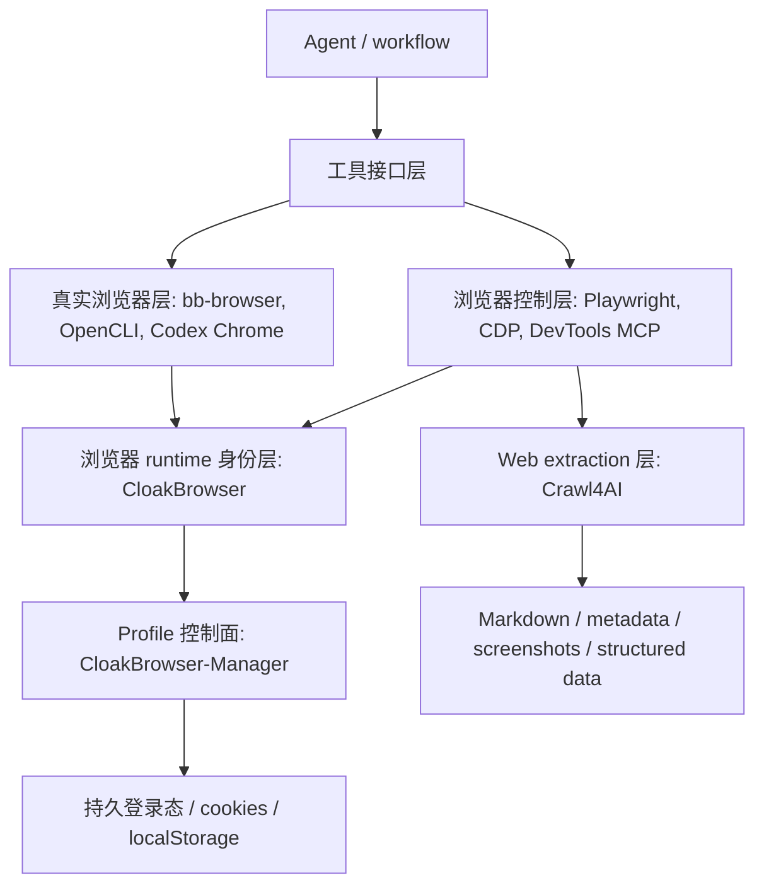

# Browser Automation Research

浏览器自动化专题研究入口。这里集中放直接涉及浏览器 runtime、CDP、真实浏览器控制、指纹浏览器、Web extraction browser pipeline 和 profile manager 的材料。

## 专题边界

收录：

- Playwright / CDP / Chrome DevTools / MCP browser tools。
- 真实浏览器登录态、DOM、network、console、site adapter。
- CloakBrowser、CloakBrowser-Manager、浏览器指纹和 profile 管理。
- Crawl4AI 这类以浏览器渲染为基础的 Web-to-RAG / Web extraction 框架。
- Codex Chrome 插件这类浏览器被 Agent 接管的实践案例。

不收录：

- 泛 MCP 基础教程。
- 泛 CLI 方法论。
- RAGFlow 的 MCP、Deep Research 或 Agentic workflow 案例。
- 非浏览器项目，例如 Lark CLI、HTML Anything。

## 分层地图

核心判断：不要把这些工具混成一个概念。Playwright/CDP 是控制协议和自动化底座；CloakBrowser 是 runtime identity；Crawl4AI 是 extraction pipeline；Manager 是 profile 控制台；Codex Chrome / bb-browser / OpenCLI 是让 Agent 使用真实浏览器上下文的工具面。

## 阅读顺序

1. [浏览器自动化工具深度调研](./2026-05-14-browser-automation-tools-research.md)
   先建立分层地图，理解 Playwright、Playwright MCP、Chrome DevTools MCP、agent-browser、bb-browser、browser-use 的边界。

2. [Agent-Native CLI 与真实浏览器工具调研](./2026-05-21-agent-native-cli-browser-runtime-research.md)
   重点看 OpenCLI、bb-browser、CLI-Anything，理解真实浏览器登录态如何变成 Agent 工具。

3. [Crawl4AI 开源项目调研](./2026-05-25-crawl4ai-research.md)
   研究 Web-to-Markdown、Web-to-RAG、browser profile、CDP、Docker API、MCP bridge 的组合。

4. [CloakBrowser 开源项目调研](./2026-05-25-cloakbrowser-research.md)
   先看 wrapper、二进制、license、供应链和 anti-bot 风险，不要先被项目热度带跑。

5. [CloakBrowser 深入落地使用手册](./2026-05-26-cloakbrowser-implementation-guide.md)
   关注本机 wrapper、CDP 服务、profile、Crawl4AI/browser-use 接入和安全 SOP。

6. [CloakBrowser-Manager 开源项目调研](./2026-05-28-cloakbrowser-manager-research.md)
   看 profile 控制台、VNC、CDP proxy、SQLite、认证和 early alpha 风险。

7. [Codex Chrome 插件：安装使用与实践案例汇总](<./Codex Chrome 插件：安装使用与实践案例汇总.md>)
   作为真实 Chrome 被 Agent 接管的实践材料，重点看权限、标签页、子代理和安全边界。

## 工具选型表

| 场景 | 优先看 | 判断 |
|---|---|---|
| 本地 Web App 测试 | Playwright / Chrome DevTools MCP | 优先用标准浏览器自动化，不需要指纹 runtime。 |
| 真实登录态页面操作 | bb-browser / OpenCLI / Codex Chrome 插件 | 真实浏览器上下文是凭据，不能按普通爬虫工具处理。 |
| Web-to-RAG / 网页抽取 | Crawl4AI | 它不是普通 crawler，重点是输出可给 LLM/RAG 使用的结构化上下文。 |
| 需要替换底层浏览器 runtime | CloakBrowser | 只替换 runtime，不要让上层业务硬依赖它。 |
| 多 profile 可视化管理 | CloakBrowser-Manager | 适合本机/内网实验，不适合直接当生产多租户平台。 |
| Agent 浏览器工具接口设计 | bb-browser / Playwright MCP / Chrome DevTools MCP | 重点看 snapshot、incremental network、console、tab state 和结构化输出。 |

## 风险清单

- CDP 暴露：CDP 是浏览器远程控制面，不能裸露公网。
- 真实登录态：cookie、localStorage、IndexedDB 和 profile 目录都要当敏感数据处理。
- Chrome 插件权限：`debugger`、`tabs`、`cookies`、`<all_urls>` 是强权限，不是普通网页能力。
- VNC/noVNC：可视化控制台不是安全边界，必须放在认证和本机/隧道之后。
- proxy/profile 明文：很多工具会把 proxy 凭证和 profile 配置明文落盘。
- 二进制 license：CloakBrowser wrapper 与 Chromium binary 许可不同，不能按纯 MIT 项目处理。
- 未授权目标：反检测和真实浏览器能力只能用于自有、授权或明确允许的目标。

## 后续实验入口

优先做小实验，不要一上来写“大一统浏览器 Agent 平台”。

1. `labs/minimal-cdp-mcp-browser/`
   验证一个只读 CDP/MCP browser tool：snapshot、title、URL、network since last action。

2. `labs/cloakbrowser-crawl4ai-cdp/`
   验证 CloakBrowser 作为 CDP runtime 接入 Crawl4AI，输出 markdown、metadata 和版本信息。

3. 自有 fingerprint 检测页
   只在本地页面对比 stock Playwright、CloakBrowser、真实 Chrome 的 navigator、screen、WebGL、canvas、timezone、locale 差异。

验收标准很简单：同一输入可复现、输出可追踪、浏览器 runtime 可替换、CDP 不暴露公网、不保存真实账号数据。
