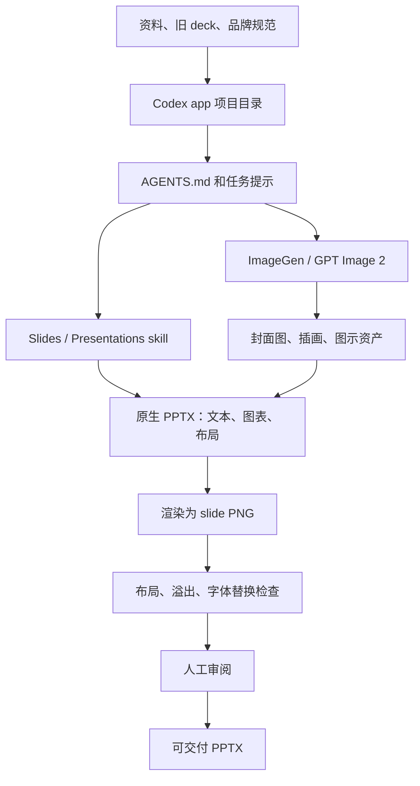

# AI 做 PPT：Codex app + ImageGen + Slides/Presentations 抖音调研报告

调研日期：2026-05-20
更新日期：2026-05-21
调研目标：保留抖音侧的调研入口，跟踪中文短视频里关于“Codex app 桌面端 + image2/GPT Image 2 + presentations/slides”做 PPT 的真实实践信号。
调研口径：抖音公开搜索结果、可访问的 `jingxuan.douyin.com` 视频链接、视频标题/描述/发布时间/时长，以及 OpenAI 官方 Codex / Skills / Image generation 文档。

## 一句话结论

抖音是这类中文实践内容的更好前哨。

当前信号很明确：

```text
中文短视频已经开始密集实践 AI 做 PPT。
主线集中在三类：Codex + Presentations、Images 2/GPT Image 2 做 PPT 视觉资产、Codex 办公自动化。
真正缺口不是“有没有人讲”，而是“有没有可复现、可验证、能稳定生成原生 PPTX 的工程化 SOP”。
```

不要把一次 demo 当成方法论。能演示不等于能交付。

## 抖音调研入口

后续继续调研时，直接从这些入口查，不再绕 YouTube 做主样本。

### 关键词入口

```text
Codex 做 PPT
Codex Presentations PPT
Codex Skills PPT
Codex 办公 PPT
Codex 自动生成 PPT
Codex 桌面端 PPT
Images 2 做 PPT
GPT Image 2 做 PPT
image2 PPT
AI 做 PPT Codex
AI PPT Presentations
open-slide PPT
Agent Skills PPT
原生 PPTX AI
可编辑 PPT AI
```

### 搜索 URL 模板

```text
https://www.douyin.com/search/Codex%20PPT?type=video
https://www.douyin.com/search/Codex%20Presentations%20PPT?type=video
https://www.douyin.com/search/Codex%20Skills%20PPT?type=video
https://www.douyin.com/search/Images%202%20PPT?type=video
https://www.douyin.com/search/GPT%20Image%202%20PPT?type=video
https://www.douyin.com/search/AI%E5%81%9APPT%20Codex?type=video
```

### 外部搜索入口

```text
site:jingxuan.douyin.com/m/video Codex PPT Presentations
site:jingxuan.douyin.com/m/video "Images 2" "PPT"
site:jingxuan.douyin.com/m/video "GPT Image 2" "PPT"
site:jingxuan.douyin.com/m/video "Codex" "Skills" "PPT"
site:jingxuan.douyin.com/m/video "原生 PPTX" "AI"
site:jingxuan.douyin.com/m/video "open-slide" "PPT"
```

## 抖音结果清单

| 优先级 | 抖音结果 | 发布日期 | 时长 | 相关方向 | 当前判断 |
| --- | --- | --- | --- | --- | --- |
| S | [每天一个AI小技巧：用AI生成可编辑PPT，地表最强方法](https://www.douyin.com/video/7641918938359614726) | 2026-05-20 | 06:09 | Codex + Skills + 可编辑 PPT | 用户实看推荐样本。作者为“欧ge陪你学AI”，标题和标签明确包含 `#codex`、`#ppt`、`#AI工具`、`#skills`；已补看并沉淀 SOP：[用 AI 生成可编辑 PPT：Codex + ImageGen + Presentations 最佳实践拆解](../../notes/openai/2026-05-20-douyin-codex-imagegen-presentations-ppt-sop.md)。 |
| S | [ai快速做ppt：image 2.0 + codex 做 PPT](https://www.douyin.com/note/7639780588463961083) | 2026-05-15 | 图文 | Images 2 + Codex + 可编辑 PPT | 用户实看推荐样本。作者为“去看看”，描述里给出实践心得：长 PPT 用 GPT 效果不稳，换 Codex 更好；想生成可编辑 PPT，先生成图片，再用提示词转成 PPT。元数据抓取时显示 9,779 个赞、10,532 个收藏、2,526 次分享、193 条评论。 |
| S | [用AI做PPT，首选Codex](https://jingxuan.douyin.com/m/video/7640458725416881450) | 2026-05-16 | 03:46 | Codex + Presentations + PPT | 精准命中本次主题。描述明确提到“插件 Presentations 的效果完全 OK”，并强调结合 Codex 搜索和项目文档管理。 |
| A | [用好这6大技巧，用Images 2做出精美的PPT](https://jingxuan.douyin.com/m/video/7636959309649300772) | 2026-05-07 | 05:13 | Images 2 / GPT Image 2 + PPT 视觉资产 | 适合补 image2 在 PPT 中的边界：封面、图标、配图、排版美化。注意它更偏视觉，不等于原生 PPTX 工作流。 |
| A | [爆肝三天，我总结了 GPT Image 2 全网最实用的玩法 PPT、vibe coding、短剧、广告...](https://jingxuan.douyin.com/m/video/7632628149167148339) | 2026-04-25 | 04:08 | GPT Image 2 多场景玩法，包含 PPT | 适合作为 image2 能力观察。不是完整 PPT 交付教程。 |
| A- | [Codex 零基础终极教程：功能、办公、编程、自动化一次讲透](https://jingxuan.douyin.com/m/video/7634145036032085298) | 2026-04-29 | 52:59 | Codex 安装、Skills、插件、办公文档、PPT、Excel、网站、部署 | 长视频，覆盖面广。适合理解 Codex 办公化，但需要重点复核 PPT 部分是否足够细。 |
| B+ | [GPT-5.5+Codex 全自动操控电脑和浏览器](https://jingxuan.douyin.com/m/video/7632213204373900595) | 2026-04-24 | 13:01 | Codex computer use、Keynote 自动生成 10 页 PPT、Numbers 表格 | 更偏电脑操控和 Office 自动化，不是 presentations skill 主线，但说明“AI 操作桌面办公软件”也在被实测。 |
| B | [如何成为AI博主？工作流解析](https://jingxuan.douyin.com/m/video/7638191120354800777) | 2026-05-11 | 02:25 | 关联结果包含“用 image2 可以 5 分钟 ppt？”、“AI 制作 PPT 完整版教程分享” | 当前命中页不是 PPT 主视频本身，先作为账号线索。 |
| B | [一句话生成短视频！Codex+HyperFrames 实战](https://jingxuan.douyin.com/m/video/7637468863793335603) | 2026-05-08 | 04:00 | 关联结果包含 open-slide：Agent 写 React，渲染 1920×1080 幻灯片 | 不是 Codex + Presentations，而是 open-slide / HTML canvas 幻灯片路线。适合后续单独研究。 |

## 筛选标准

后续不要按“标题刺激不刺激”筛视频，按交付价值筛。

| 标准 | 高价值信号 | 低价值信号 |
| --- | --- | --- |
| 组合匹配 | 明确出现 Codex、Presentations/Slides、Skills、PPTX、ImageGen/Images 2 | 只说“一键生成 PPT”，没有工具链细节 |
| 可复现性 | 有步骤、提示词、项目目录、skill 配置、脚本或资源链接 | 只有成品展示，没有过程 |
| 交付物 | 输出 `.pptx`，文本和图表可编辑 | 输出整页图片、PDF、网页截图 |
| 验证 | 提到渲染预览、溢出检查、字体检查、人工审阅 | 只说“效果炸裂”“效率提升十倍” |
| 工程价值 | 能沉淀成 AGENTS.md、skill、脚本、lab | 只能当灵感，不能复用 |

## 正确工作流

好结构应该是：

```text
资料 / 旧 deck / 品牌规范
  -> Codex app 项目目录
  -> AGENTS.md / skill 指令
  -> slides 或 presentations skill 生成 PPTX
  -> imagegen / GPT Image 2 生成视觉资产
  -> 渲染预览 / overflow / 字体检查
  -> 人工审阅后交付
```



坏结构是：

```text
一句话 -> AI 生成整页图片 -> 假装这是 PPT
```

这东西看起来快，维护时就是垃圾。文字不能改、图表不能改、品牌规范不能迭代，最后还是人工重做。

## 三条实践路线

| 路线 | 价值 | 风险 | 当前处理方式 |
| --- | --- | --- | --- |
| Codex + Presentations/Slides | 最接近可交付的原生 PPTX 路线 | 需要 skill、脚本和验证，不是简单提示词 | 主线跟踪 |
| GPT Image 2 / Images 2 + PPT | 封面、插画、图标、视觉风格很强 | 容易把整页烧成死图 | 作为视觉资产能力跟踪 |
| Codex computer use + Keynote/PPT | 能操作真实办公软件 | 稳定性、权限、人工验收成本高 | 作为办公自动化旁支 |

## 实践路线建议

第一版实验只验证一个问题：

```text
Codex + slides/imagegen 能不能稳定生成一份可编辑、可审查、可迭代的中文 PPTX？
```

不要一上来做“万能 PPT Agent”。那是烂设计，特殊情况会爆炸。

最小实验：

1. 准备一个 8 到 10 页固定主题，例如“AI Agent Fieldbook 路线图”。
2. 输入只放三类东西：Markdown 大纲、品牌色说明、少量图片资产。
3. 用 Codex app 在项目目录里调用 slides/imagegen 或 presentations 相关 skill。
4. 要求输出原生 `.pptx`，文字必须可编辑，简单图表尽量用原生对象。
5. 生成每页 PNG 预览，检查中文换行、溢出、字体替换、图片遮挡。
6. 记录失败点，再决定是否沉淀成自己的 presentation skill。

验收标准：

- `.pptx` 能在 PowerPoint 或 Keynote 打开。
- 标题、正文、页脚文字可编辑。
- 至少 80% 的页面没有文字溢出和明显遮挡。
- 中文字体不会大面积替换成奇怪字体。
- 图片资产可以单独替换，不是整页烧成一张图。
- 同一份输入资料重复生成时，结构稳定，不会每次完全变形。

## 风险和坑

| 风险 | 说明 | 处理方式 |
| --- | --- | --- |
| “Presentations”命名不稳定 | 视频里可能叫 Presentations，官方 use case 更明确是 `$slides` | 以功能和产物为准：能否生成/编辑原生 PPTX |
| 图片生成破坏可编辑性 | 把整页生成成图片，后期等于死图 | 只让 imagegen 做封面、插画、概念图，不做正文排版 |
| GPT Image 2 不适合精确排版文字 | 图像模型仍可能在文本、构图、精确放置上出错 | 文本必须留在 PPT 原生对象里 |
| 中文字体和换行 | 中文 PPT 常见失败点是溢出、字体替换、行高不稳 | 必须渲染预览并检查 overflow / font substitution |
| 短视频 demo 过度包装 | 一次成功演示不代表稳定交付 | 优先找提供 skill、脚本、资源包和失败处理的视频 |
| 成本和延迟 | 高质量图片生成会带来成本和等待 | 草稿少图，最终版再提升图像质量 |

## 未验证事项

- 本次只保留抖音公开搜索结果、视频链接、标题/描述和官方文档交叉判断，没有完整下载视频、字幕和逐帧验收。
- 没有本地实测 Codex app + slides/imagegen 生成 PPTX。
- 抖音播放量、点赞数、标题和描述会变化；本报告记录的是 2026-05-20 抓取时状态。
- 本地 bb-browser 直接打开抖音搜索页时未能启动 Chrome，因此抖音补搜主要依赖公开搜索结果页和可访问的 `jingxuan.douyin.com` 视频链接。
- “Presentations”在不同视频中可能指插件、skill 或泛称，本报告按“能生成/编辑 PPTX 的 presentation/slides 能力”处理。

## 信息来源

OpenAI 官方：

- [Generate slide decks | Codex use cases](https://developers.openai.com/codex/use-cases/generate-slide-decks)
- [Agent Skills | Codex](https://developers.openai.com/codex/skills)
- [Features | Codex app](https://developers.openai.com/codex/app/features)
- [Image generation | OpenAI API](https://developers.openai.com/api/docs/guides/image-generation)

重点抖音结果：

- [每天一个AI小技巧：用AI生成可编辑PPT，地表最强方法](https://www.douyin.com/video/7641918938359614726)
- [ai快速做ppt：image 2.0 + codex 做 PPT](https://www.douyin.com/note/7639780588463961083)
- [用AI做PPT，首选Codex](https://jingxuan.douyin.com/m/video/7640458725416881450)
- [用好这6大技巧，用Images 2做出精美的PPT](https://jingxuan.douyin.com/m/video/7636959309649300772)
- [爆肝三天，我总结了 GPT Image 2 全网最实用的玩法 PPT、vibe coding、短剧、广告...](https://jingxuan.douyin.com/m/video/7632628149167148339)
- [Codex 零基础终极教程：功能、办公、编程、自动化一次讲透](https://jingxuan.douyin.com/m/video/7634145036032085298)
- [GPT-5.5+Codex 全自动操控电脑和浏览器](https://jingxuan.douyin.com/m/video/7632213204373900595)
