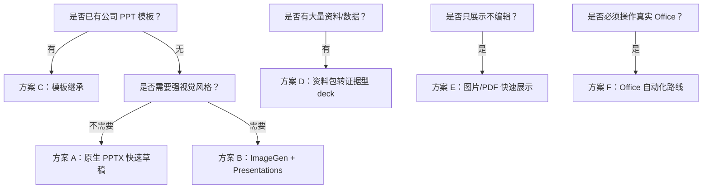

# AI 生成 PPTX 实践文档：多方案 SOP 与可复用测试提示词

日期：2026-05-23

目标：沉淀 AI 生成 PPTX 的内部可复用实践流程。这里不追求“一句话生成神级 PPT”的演示效果，而是关注能否稳定产出可打开、可编辑、可审查、可迭代的 `.pptx`。

## 一句话结论

AI 生成 PPTX 的好流程不是“模型一次性吐成品”，而是把任务拆成：

```text
资料理解 -> 大纲确认 -> 风格/模板确认 -> 资产生成 -> PPTX 组装 -> 渲染验收 -> 人工交付
```

真正的 PPTX 交付物必须保留原生对象：标题、正文、页脚、表格、图表尽量是可编辑对象；图片只负责视觉资产。把整页生成成图片再塞进 PPT，是坏结构。它看起来快，改起来就是垃圾。

## 适用范围

适合：

- 内部汇报、研究复盘、方案介绍、产品说明、培训课件。
- 需要生成 `.pptx`，且后续还会改文字、换图片、调版式的场景。
- 需要把 SOP 沉淀成可重复实验的场景。

不适合：

- 只要一张宣传图或海报，不需要 PPTX。
- 对品牌模板、字体、页眉页脚、页码、母版要求极高但没有模板文件。
- 需要零人工审阅直接对外发送的高风险材料。

## 核心原则

1. 先确认内容，再做视觉。内容错了，设计越好返工越大。
2. 先用低成本风格板选方向，再生成全量素材。
3. 文本必须留在 PPT 原生对象里。不要把正文烘焙进图片。
4. 图像模型负责视觉资产，不负责精确排版。
5. Presentations / Slides 类能力负责 PPTX 结构化生成、渲染和导出。
6. 每套流程都要有验收标准，不验证就只能说“已生成”，不能说“可交付”。

## 执行主体和工具边界

不是所有方案都必须使用 Codex。关键看任务是否需要读写本地文件、调用 skill、生成真实 `.pptx`、渲染预览、管理素材和模板。

| 方案 | 是否必须用 Codex 类 agent | 推荐执行主体 | 需要的能力 / skill | 不适合只用普通聊天模型的原因 |
|---|---|---|---|---|
| A. 原生 PPTX 快速草稿 | 推荐，但不是理论上必须 | Codex + Presentations / Slides | 生成 PPTX、渲染预览、检查布局 | 普通聊天模型只能给大纲，不能可靠写文件和验收 PPTX |
| B. ImageGen 风格板 + Presentations | 是 | Codex + ImageGen + Presentations / Slides | 图片生成、素材管理、PPTX 组装、渲染验收 | 需要跨工具编排和文件管理 |
| C. 旧 PPT / 模板继承 | 是 | Codex + Presentations 模板编辑能力 | 读取模板、复制模板页、编辑 PPTX、保留母版 | 普通模型无法安全操作模板文件 |
| D. 资料包转证据型 deck | 生成 PPTX 阶段需要 | 研究 agent / Codex + Presentations | 资料读取、证据抽取、PPTX 生成、来源标注 | 纯聊天容易编造来源，也不能验证文件 |
| E. 图片/PDF 快速展示 | 不必须 | ImageGen / 普通多模态生成工具 / Codex | 整页图片生成、可选打包为 PDF/PPTX | 如果只要图片，不需要 Codex；如果要打包文件，Codex 更方便 |
| F. Office 自动化路线 | 需要 GUI/桌面 agent | Codex computer use / 浏览器或桌面自动化 agent | 操作 PowerPoint/Keynote、保存副本、导出 | 普通模型不能操作真实 Office |

简单判断：

```text
只要大纲：普通聊天模型就够。
要真实 PPTX 文件：用 Codex 类可写文件 agent。
要 ImageGen + PPTX：用 Codex + ImageGen + Presentations。
要继承模板：用 Codex + Presentations 模板编辑。
要操作 PowerPoint / Keynote：用具备 GUI 自动化能力的 agent。
```

## 方案选择表

| 方案 | 适合场景 | 推荐执行主体 | 产物质量 | 速度 | 主要风险 |
|---|---|---|---:|---:|---|
| A. 原生 PPTX 快速草稿 | 已有清晰大纲，偏知识讲解/内部汇报 | Codex + Presentations / Slides | 中 | 快 | 视觉普通，容易模板感重 |
| B. ImageGen 风格板 + Presentations | 需要更强视觉风格，同时要可编辑 PPTX | Codex + ImageGen + Presentations / Slides | 高 | 中慢 | 图片素材可能吞掉文字可编辑性 |
| C. 旧 PPT / 模板继承 | 有公司模板或历史 deck，要保持品牌一致 | Codex + Presentations 模板编辑 | 高 | 中 | 模板映射错会破坏母版和版式 |
| D. 资料包转证据型 deck | 有报告、表格、调研材料，要做分析型汇报 | 研究 agent / Codex + Presentations | 高 | 慢 | 引用、数字、图表容易出错 |
| E. 图片/PDF 快速展示 | 只展示，不需要编辑 | ImageGen / 普通多模态工具 / Codex | 视觉可高 | 快 | 不是可编辑 PPTX |
| F. Office 自动化路线 | 必须操作 PowerPoint/Keynote 真实软件 | GUI/桌面自动化 agent | 中 | 慢 | 稳定性、权限、人工验收成本高 |

推荐默认顺序：



## 通用输入模板

每次开始前，把输入收敛成这 8 个字段：

```text
1. 主题：
2. 目标受众：
3. 页数：
4. 使用场景：
5. 必须包含的内容：
6. 不要包含的内容：
7. 视觉风格：
8. 交付要求：PPTX / PDF / 图片；是否要求文本可编辑；是否有模板。
```

缺这些字段就直接开跑，结果大概率是碰运气。

## 统一验收标准

最低验收：

- `.pptx` 能在 PowerPoint 或 Keynote 打开。
- 标题、正文、页脚是可编辑文本，不是整页截图。
- 图片、图标、背景可以单独替换。
- 8 到 10 页中文内容没有明显溢出、遮挡、截断。
- 字体没有大面积替换成奇怪字体。
- 页面风格一致，不是一页一个模板。
- 如果有数字、引用、表格，必须能追溯来源。

更高一级验收：

- 生成每页 PNG 预览或 contact sheet。
- 检查缩略图层面的叙事节奏：不是 8 页同构卡片。
- 检查每页是否有明确 claim，不只是堆 bullet。
- 检查图表是否为原生图表或可编辑表格，而不是截图。
- 记录失败点，用于下一轮提示词修正。

## 统一测试主题

为了比较不同方案，统一使用一个测试题：

```text
主题：AI Agent Fieldbook 路线图
受众：内部学习小组成员
页数：8 页
场景：10 分钟内部分享
核心内容：
1. 为什么要系统学习 AI Agent
2. 学习阶段：OpenAI 官方栈、Anthropic/Claude、真实应用场景、开源项目拆解、自己做小产品
3. Agent 的关键能力：工具调用、状态管理、记忆、评估、追踪、人审
4. 风险：多 Agent 过早复杂化、工具权限失控、只收藏资料不消化、没有评估
5. 下一步实验：做一个最小可运行 Agent lab
交付要求：输出原生 PPTX，中文文本可编辑，图标和图片可替换。
```

后面每个方案都基于这个测试题给提示词。

说明：后续测试提示词默认发给对应方案标注的推荐执行主体。如果只发给普通聊天模型，只能得到计划、大纲或提示词草案，不能视为已生成 PPTX。

## 方案 A：原生 PPTX 快速草稿

执行主体 / 工具边界：

- 推荐：Codex + Presentations / Slides。
- 可替代：任何能写 `.pptx`、渲染预览并保存文件的 agent。
- 普通聊天模型只适合做大纲和文案，不适合声称已生成 PPTX。

### 适用场景

内容比视觉重要，目标是快速得到一份可编辑、可审阅的初稿。适合内部学习、技术分享、周报复盘、普通方案说明。

### 不适用

不适合品牌要求高、视觉冲击强、对封面/插画/营销质感要求高的 deck。

### SOP

1. 输入主题、受众、页数、交付要求。
2. 让 AI 先生成每页大纲，不生成 PPTX。
3. 人工确认大纲和每页 claim。
4. 调用 Presentations / Slides 生成原生 PPTX。
5. 渲染预览，检查中文溢出、字体、遮挡。
6. 修改最差的 2 到 3 页。
7. 导出最终 PPTX。

### 测试提示词

```text
请为“AI Agent Fieldbook 路线图”生成一份 8 页中文 PPTX 初稿。

先不要直接生成 PPTX。第一步只输出每一页的大纲和每页要表达的核心 claim，等我确认后再继续。

受众：内部学习小组成员。
使用场景：10 分钟内部分享。
风格：清晰、克制、技术学习型，不要营销感，不要大段空话。

必须包含：
1. 为什么要系统学习 AI Agent
2. 学习阶段：OpenAI 官方栈、Anthropic/Claude、真实应用场景、开源项目拆解、自己做小产品
3. Agent 的关键能力：工具调用、状态管理、记忆、评估、追踪、人审
4. 风险：多 Agent 过早复杂化、工具权限失控、只收藏资料不消化、没有评估
5. 下一步实验：做一个最小可运行 Agent lab

交付要求：
- 最终输出原生 PPTX。
- 标题、正文、页脚必须是可编辑文本。
- 图标、形状、流程图尽量使用 PPT 原生对象。
- 不要把整页导出成图片塞进 PPT。
```

确认大纲后的继续提示词：

```text
大纲可以。现在请用 Presentations / Slides 生成原生 PPTX。

要求：
- 8 页，16:9。
- 中文文本可编辑。
- 每页最多一个主 claim。
- 页面结构要有变化：封面、路线图、能力地图、风险页、实验计划、总结。
- 生成后渲染每页 PNG 预览，检查文字溢出、遮挡和字体替换。
- 如果发现问题，先修正再给我最终 PPTX 路径。
```

### 验收重点

- 文字可编辑性。
- 每页是否有 claim。
- 版式是否重复。
- 中文是否溢出。

## 方案 B：ImageGen 风格板 + Presentations

执行主体 / 工具边界：

- 必须：Codex 类可写文件 agent。
- 必须接入：ImageGen / image generation skill，用于风格板和独立视觉素材。
- 必须接入：Presentations / Slides，用于组装原生 PPTX、渲染预览和导出。
- 不建议只用普通聊天模型。这个方案的价值在于跨工具编排和素材文件管理，不是聊天生成一段提示词。

### 适用场景

需要更强视觉表现，同时仍然要交付可编辑 PPTX。关键边界是：视觉素材可以是 PNG，正文文字必须保留为原生文本。

### 不适用

不适合只需要快速内部草稿的场景。这个流程要生成风格板、素材和 PPTX，通常比方案 A 慢。

### SOP

1. Codex 先做大纲和每页内容，人工确认。
2. ImageGen 生成 3 套风格板：每套风格用一张图展示 8 页缩略图。
3. 人工选择一个风格。
4. Codex 先输出视觉素材清单，确认哪些东西需要 ImageGen 生成，哪些应该用 PPT 原生对象。
5. ImageGen 生成独立视觉素材：封面图、背景、图标、插画、装饰元素。
6. Presentations 组装 PPTX：文本、图表、页脚保持原生对象。
7. 渲染预览并检查可编辑性。
8. 迭代最差页面。

### 测试提示词

第一步：大纲。

```text
请按照下面主题做一个 8 页左右的 PPT。

主题：AI Agent Fieldbook 路线图。
受众：内部学习小组成员。
目标：让大家理解为什么要系统学习 AI Agent，以及下一步怎么做最小实验。

请先生成每一页的大纲、标题、核心 claim、主要内容和建议视觉表达。
先不要生成 PPTX，先给我预览。
预览完成之后，等我提示下一步再继续。
```

第二步：风格板。

```text
大纲确认通过。

现在请调用 image generation / ImageGen，生成 3 套视觉风格板。
每套风格板用一张图展示完整 8 页 PPT 的缩略图布局。

要求：
- 一张风格板代表一套完整视觉方向。
- 每张风格板都要包含 8 页缩略图。
- 三套风格要明显不同：
  1. 技术白皮书风
  2. 清爽产品界面风
  3. 深色工程系统风
- 风格板只用于选方向，不要生成最终 PPTX。
```

第三步：独立视觉素材清单。

```text
选择第 2 套“清爽产品界面风”。

请先不要生成最终 PPTX。请基于已确认的大纲和选定风格，输出一份“视觉素材清单”。

清单中每个素材都要包含：
1. 素材名称
2. 用在哪一页
3. 素材类型：封面图 / 背景 / 图标 / 插画 / 装饰元素 / 数据图示辅助元素
4. 是否需要 ImageGen 生成
5. 是否应改用 PPT 原生对象
6. 建议文件名
7. 生成提示词草案

硬性边界：
- 标题、正文、页脚、图表标签不要作为 PNG 生成。
- 正文文字必须保留为 PPT 原生文本。
- 流程图、箭头、卡片、表格优先使用 PPT 原生形状。
- ImageGen 只负责视觉资产，不负责正文排版。

输出清单后等我确认，再生成独立素材。
```

第四步：ImageGen 生成独立视觉素材。

```text
视觉素材清单确认通过。

请调用 ImageGen 逐项生成独立视觉素材。

要求：
- 按清单中的建议文件名保存素材。
- 每个素材只包含必要的视觉元素，不要包含正文段落。
- 图标、插画、装饰元素尽量使用透明背景 PNG；如果不能直接透明，使用纯色可抠除背景并在后处理后保存。
- 背景图不要包含具体正文文字。
- 生成完成后输出素材清单：文件名、用途、对应页码、是否可替换。
- 不要开始组装 PPTX，等我确认素材后再继续。
```

第五步：生成可编辑 PPTX。

```text
素材确认通过。

请按这个风格生成最终 PPTX。

关键要求：
- 使用刚才生成的独立视觉素材。
- 标题、正文、页脚、图表标签必须使用 PPT 原生文本对象。
- 不要把正文文字烘焙进整页图片。
- 不要把整页作为一张图片塞进 PPT。
- 请调用 Presentations / Slides 组装成真正的可编辑 PPTX。
- 生成后渲染预览，检查中文溢出、遮挡、字体替换和元素可编辑性。
```

### 验收重点

- 是否真的保留原生文本。
- 图片是否只是资产，不是整页截图。
- 风格是否和选中的风格板一致。
- 是否有生成素材清单，方便替换。

## 方案 C：旧 PPT / 模板继承

执行主体 / 工具边界：

- 必须：Codex 类可读写文件 agent。
- 必须接入：Presentations 模板编辑能力或等价 PPTX 编辑能力。
- 关键动作：读取模板、审计模板、复制模板页、替换元素、渲染对比。
- 不要用普通聊天模型“描述怎么改”后声称完成。

### 适用场景

已有公司模板、历史 deck、客户指定模板，要求沿用母版、页眉页脚、品牌色、字体和版式。这个场景不要从空白 PPT 重建，应该复制模板页并编辑。

### 不适用

不适合没有模板、只想快速探索内容结构的场景。

### SOP

1. 收集模板 PPTX 或历史 deck。
2. 先审计模板：页数、母版、常用页面类型、字体、颜色、页眉页脚。
3. 建立输出页面到模板页面的映射。
4. 复制模板页，在副本上替换文本、图表和图片。
5. 保留原模板的布局语法，不随意重绘。
6. 渲染预览，对比模板保真度。
7. 输出 PPTX 和偏离说明。

### 测试提示词

```text
我会提供一个公司历史 PPTX 作为模板。

请基于这个模板制作一份 8 页中文 PPTX：
主题：AI Agent Fieldbook 路线图。
受众：内部学习小组成员。

执行方式：
1. 先审计模板：列出可复用的页面类型、母版、字体、颜色、页眉页脚、图表样式。
2. 先输出“页面映射表”：新 deck 的每一页分别复用模板里的哪一页。
3. 等我确认映射后，再复制模板页并编辑内容。
4. 不要从空白页重建，不要破坏模板母版。
5. 最终输出原生 PPTX，文本、表格、图表尽量保持可编辑。
6. 输出前渲染预览，并说明哪些地方偏离了模板。
```

确认映射后的继续提示词：

```text
页面映射表确认通过。

请复制对应模板页并替换为“AI Agent Fieldbook 路线图”的内容。

要求：
- 保留模板字体、页码、页眉页脚、品牌色和间距。
- 只替换必要文本、图表和图片。
- 不要把模板页截图后再覆盖。
- 如果某页没有合适模板页，先说明原因，再新建一页并尽量继承模板视觉系统。
```

### 验收重点

- 模板保真度。
- 是否保留母版/页眉/页脚。
- 是否从模板页复制编辑，而不是空白重建。
- 是否有页面映射和偏离说明。

## 方案 D：资料包转证据型 Deck

执行主体 / 工具边界：

- 资料分析阶段：可由研究 agent、通用 LLM 或 Codex 完成。
- PPTX 生成阶段：需要 Codex + Presentations / Slides。
- 如果包含 Excel、PDF、Word、截图等资料，优先使用能读取本地文件并保留来源路径的 agent。
- 不要让普通聊天模型凭记忆补数字。证据型 deck 的底线是来源可追溯。

### 适用场景

输入不是简单主题，而是一堆资料：Markdown、PDF、Excel、调研报告、会议纪要、截图、竞品资料。目标是生成分析型汇报、方案评审、研究结论 deck。

### 不适用

不适合缺少资料、只想要视觉漂亮的场景。证据型 deck 的第一性问题是事实，不是配色。

### SOP

1. 收集资料，建立资料清单。
2. 提取事实、数字、引用和结论。
3. 先写 claim spine：整份 deck 的主线论证。
4. 把每页绑定到证据来源。
5. 生成图表和表格，保留来源说明。
6. 再进入 PPTX 设计和排版。
7. 渲染预览，做事实核查和视觉核查。

### 测试提示词

```text
请基于我提供的资料包，制作一份 8 页中文证据型 PPTX。

主题：AI Agent Fieldbook 路线图。
受众：内部学习小组成员。
目标：说明为什么要系统学习 AI Agent，并给出下一步最小实验计划。

执行顺序：
1. 先读取资料，列出资料清单。
2. 提取关键事实、判断、风险和可引用依据。
3. 先输出 claim spine：整份 deck 的主线论证，每页一个 claim。
4. 给每页标注使用了哪些资料来源。
5. 等我确认 claim spine 后，再生成 PPTX。

交付要求：
- 输出原生 PPTX。
- 事实、数字、引用不得编造。
- 表格和图表尽量可编辑。
- 每页底部保留简短来源标注。
- 生成后渲染预览并检查文字溢出。
```

确认 claim spine 后：

```text
claim spine 确认通过。

请生成 PPTX。每页必须包含：
- 一个明确 claim
- 一个支撑证据对象：表格、流程图、引用、对比图或路线图
- 页脚来源说明

不要添加没有资料支持的数字或结论。
如果某页证据不足，请标注“待补证据”，不要硬编。
```

### 验收重点

- 是否有资料清单。
- 每页 claim 是否能追溯证据。
- 数字和引用是否准确。
- 是否避免了“看起来像研究，实际无来源”的假专业。

## 方案 E：图片/PDF 快速展示

执行主体 / 工具边界：

- 不必须使用 Codex。
- 可用：ImageGen、普通多模态生成工具、设计工具、或 Codex + ImageGen。
- 如果需要把图片批量打包成 PDF/PPTX，Codex 更方便。
- 必须明确标注：这是图片/PDF 展示路线，不是可编辑 PPTX 路线。

### 适用场景

只需要展示，不需要改字，不需要 PPTX 后续维护。例如短视频配图、一次性分享、概念预览、风格探索。

### 不适用

不适合任何要求“可编辑 PPTX”的正式交付。这个方案必须明确标记为图片/PDF 路线，不要假装是 PPT 自动化。

### SOP

1. 先生成大纲。
2. 选择视觉风格。
3. 让 ImageGen 直接生成每页整页图片。
4. 可选：把图片打包进 PPTX 或 PDF。
5. 标记限制：文字不可编辑，图表不可编辑。

### 测试提示词

```text
请为“AI Agent Fieldbook 路线图”生成一套 8 页演示图片。

注意：这次只做快速展示，不要求文字可编辑。

要求：
- 每页输出为 16:9 图片。
- 风格：清爽产品界面风。
- 中文要尽量准确、简洁，不要塞满文字。
- 最终可以把 8 张图片放入一个 PPTX 或 PDF，方便展示。

限制说明：
- 请在交付说明里明确：这不是可编辑 PPTX，文字和图表后续不能直接编辑。
```

### 验收重点

- 是否明确标注不可编辑。
- 中文文字是否错误。
- 图片是否满足展示需求。
- 是否避免被误当作正式 PPTX 交付。

## 方案 F：Office 自动化路线

执行主体 / 工具边界：

- 必须：具备 GUI/桌面自动化能力的 agent。
- 可用：Codex computer use、浏览器/桌面自动化 agent，或人工配合执行。
- 目标软件：PowerPoint 或 Keynote。
- 高风险动作必须停下来确认：覆盖源文件、删除文件、发送邮件、上传外部系统、执行宏。

### 适用场景

必须使用本机 PowerPoint / Keynote 的真实功能，例如打开现有文件、操作复杂模板、导出特定格式、借助 Office 自身兼容性。

### 不适用

不适合作为默认方案。它脆弱、慢、依赖 GUI 状态，还需要更强人工验收。

### SOP

1. 明确目标软件：PowerPoint 还是 Keynote。
2. 准备模板或源文件。
3. 让 AI 先规划页面和修改动作，不直接操作。
4. 人工确认后再执行桌面操作。
5. 每完成关键步骤保存副本。
6. 导出前人工预览。
7. 记录手工或自动化步骤，方便复现。

### 测试提示词

```text
请使用本机 PowerPoint / Keynote 自动化方式，基于指定模板生成一份 8 页 PPTX。

主题：AI Agent Fieldbook 路线图。
受众：内部学习小组成员。

执行要求：
1. 先列出你将执行的操作步骤，不要马上操作软件。
2. 等我确认后，再打开模板文件并复制页面。
3. 替换文本、图片和图表时保留模板样式。
4. 每完成 2 页保存一个副本。
5. 最后导出 PPTX，并提醒我人工打开检查。

限制：
- 不要执行删除源文件、覆盖模板、发送邮件、上传外部服务等高风险动作。
- 如果软件弹窗或权限请求出现，先停下来让我确认。
```

### 验收重点

- 是否保护源模板。
- 是否有保存副本。
- 是否需要人工确认高风险动作。
- 最终文件是否能在 Office 中正常打开。

## 推荐的内部实验矩阵

第一轮不要做 20 个主题。就用统一测试主题跑 3 个最有价值的方案：

| 实验 | 方案 | 目标 | 验收 |
|---|---|---|---|
| Lab 1 | 方案 A | 验证纯原生 PPTX 草稿质量 | 文本可编辑、无明显溢出、8 页结构稳定 |
| Lab 2 | 方案 B | 验证风格板 + 视觉素材路线 | 风格一致、素材可替换、文本仍可编辑 |
| Lab 3 | 方案 C | 验证模板继承能力 | 母版保留、页面映射清楚、偏离可控 |

暂缓：

- 方案 D 需要真实资料包，否则测不出证据链质量。
- 方案 E 不是可编辑 PPTX 主线。
- 方案 F GUI 成本高，等确实需要 Office 兼容性再做。

## 通用复盘模板

每次实验后记录：

```text
实验日期：
方案：
输入资料：
输出文件：
生成耗时：
是否成功打开 PPTX：
文本是否可编辑：
图片是否可替换：
图表是否可编辑：
中文是否溢出：
字体是否异常：
最差的 3 页：
失败原因：
下一轮提示词怎么改：
是否值得沉淀为 skill：
```

## 最小可复用提示词：总控版

如果只想复制一段开始，可以用这一版：

```text
我要生成一份 8 页中文 PPTX。

主题：AI Agent Fieldbook 路线图。
受众：内部学习小组成员。
场景：10 分钟内部分享。

请按以下流程执行：
1. 第一阶段只输出每页大纲、核心 claim、主要内容和建议视觉表达，不生成 PPTX。
2. 等我确认大纲后，再根据我选择的方案继续。
3. 如果走纯 PPTX 路线，请用 Presentations / Slides 生成原生 PPTX。
4. 如果走视觉增强路线，请先用 ImageGen 生成 3 套 8 页缩略图风格板，等我选择风格后，先输出独立视觉素材清单，确认后再生成素材并组装 PPTX。
5. 如果走模板路线，请先审计模板并输出页面映射表，等我确认后再复制模板页编辑。

硬性要求：
- 最终 PPTX 中标题、正文、页脚必须是可编辑文本。
- 不要把整页作为图片塞进 PPT。
- 图片只作为视觉素材，必须可单独替换。
- 生成后渲染预览，检查中文溢出、遮挡、字体替换。
- 如果有无法验证的地方，明确写入未验证事项。
```

## 风险清单

| 风险 | 表现 | 处理方式 |
|---|---|---|
| 死图 PPT | 每页是一张图片，文字不能改 | 提示词中明确禁止整页图片；验收时打开选择文本 |
| 文本烘焙进素材 | PNG 图里带正文文字 | 只允许封面图、插画、图标带少量装饰文字；正文必须原生文本 |
| 风格漂移 | 每页像不同模板 | 先生成风格板，锁定设计 token |
| 中文溢出 | 文本超框、遮挡图表 | 必须渲染预览；必要时减少字数 |
| 模板破坏 | 母版、页眉页脚丢失 | 模板路线必须复制编辑，不从空白重建 |
| 事实编造 | 数字和引用无来源 | 证据型 deck 必须有资料清单和页脚来源 |
| 过度复杂 | 上来就做万能 PPT Agent | 先跑 8 页固定主题最小实验 |

## 当前未验证事项

- 本文是 SOP 实践文档，尚未实际运行 Lab 1 / Lab 2 / Lab 3。
- Presentations / Slides 的具体生成质量需要用真实输出 PPTX 验证。
- ImageGen 风格板路线尚未用本仓库的真实输出 PPTX 复验，不能预设其每个元素都真实可编辑。
- Office 自动化路线未实测，暂时只作为备用路线。
