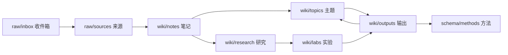

# Wiki 生命周期 MOC

真实路径使用 `raw/`、`wiki/`、`schema/` 三层结构，中文说明用于 Obsidian 阅读。

## 标准流转

## 入口

| 层级 | 入口 | 关键判断 |
| --- | --- | --- |
| 收件箱 | [raw/inbox](../../raw/inbox/README.md) | 还没处理，不要长期停留。 |
| 来源索引 | [raw/sources](../../raw/sources/README.md) | 保存原始采集文档和本地图片资产，不冒充知识。 |
| 资料笔记 | [wiki/notes](../../wiki/notes/README.md) | 用自己的中文理解重写来源。 |
| 稳定主题 | [wiki/topics](../../wiki/topics/README.md) | 跨来源、可复用、可维护。 |
| 问题研究 | [wiki/research](../../wiki/research/README.md) | 围绕问题，不围绕收藏。 |
| 实验验证 | [wiki/labs](../../wiki/labs/README.md) | 只验证具体判断。 |
| 方法库 | [schema/methods](../methods/README.md) | 可重复流程、模板和维护规则。 |
| Skill 配置 | [schema/skills](../skills/README.md) | Obsidian 可见入口，真实路径是 `.codex/skills/`。 |
| 输出成品 | [wiki/outputs](../../wiki/outputs/README.md) | 最终产物和 manifest。 |
| 仓库治理 | [schema/meta](../meta/README.md) | 定位、主题地图、迁移记录。 |
| 历史归档 | [wiki/archive](../../wiki/archive/README.md) | 不再维护但仍值得保留。 |

## 判断顺序

1. 先判断材料属于 `raw/`、`wiki/` 还是 `schema/`。
2. 再判断主题和子目录。
3. 如果两个位置都能放，优先选择更早的生命周期层，避免把未消化材料包装成知识。
