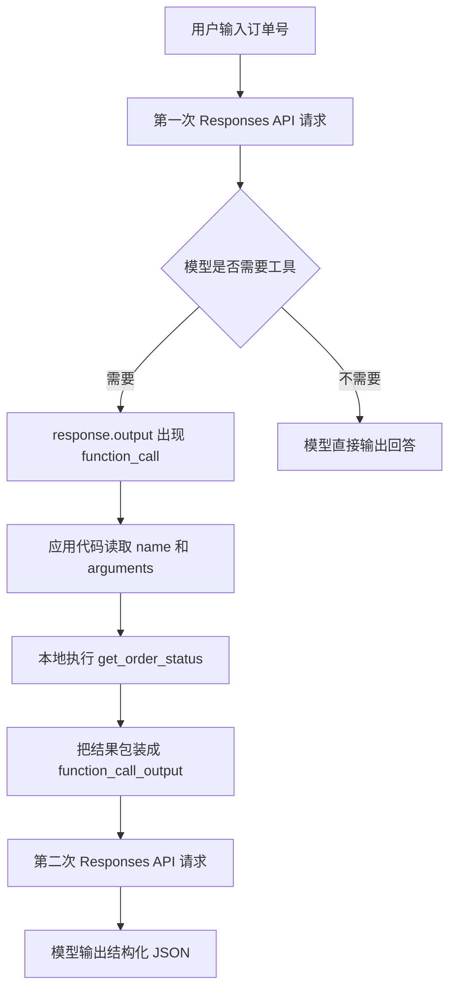

# Lab 01: Responses API

## 目标

理解 OpenAI Agent 技术栈的底层原语。

## 要学的东西

- Responses API 基本调用
- 输入与输出结构
- function tool
- structured output
- conversation state
- streaming

## 最小实验

做一个 CLI：

```text
用户输入订单号
  ↓
模型判断是否需要查订单
  ↓
调用本地 get_order_status(order_id)
  ↓
输出结构化结果
```

实现文件：

- `order_status_cli.py`

核心数据流：

```text
client.responses.create(tools=[get_order_status])
  ↓
response.output 里出现 function_call
  ↓
本地 Python 函数执行 get_order_status(order_id)
  ↓
client.responses.create(previous_response_id=..., input=[function_call_output])
  ↓
模型输出结构化 JSON
```

同一件事画成图：



这里的重点是：模型不会替你执行函数。模型只返回“我要调用哪个工具、参数是什么”。真正执行工具的是你的应用代码。

最容易混淆的是这两层：

| 层次 | 谁负责 | 在代码里看哪里 |
| --- | --- | --- |
| 工具调用参数 | 模型负责生成，但受工具 JSON schema 约束 | `function_call.arguments` |
| 工具真实执行 | 应用代码负责，模型不能直接碰数据库或本地函数 | `get_order_status(order_id)` |
| 工具结果回传 | 应用代码负责，必须带上 `call_id` | `function_call_output` |
| 最终 JSON 回答 | 模型负责生成，但受 `text.format` 约束 | `final_answer` |

## 依赖

本仓库使用 `uv`：

```bash
uv sync
```

需要设置 OpenAI API key：

```bash
export OPENAI_API_KEY="你的 key"
```

默认模型使用 `gpt-5.5`，也可以覆盖：

```bash
export OPENAI_MODEL="gpt-5.5"
```

## 运行

先验证本地工具，不调用 API：

```bash
uv run python wiki/labs/openai/01-responses-api/order_status_cli.py ORDER-1001 --local-tool-only
```

运行完整 Responses API 实验：

```bash
uv run python wiki/labs/openai/01-responses-api/order_status_cli.py ORDER-1001 --show-raw
```

可用的演示订单：

```text
ORDER-1001
ORDER-1002
ORDER-1003
```

也可以试一个不存在的订单：

```bash
uv run python wiki/labs/openai/01-responses-api/order_status_cli.py ORDER-9999 --show-raw
```

## 验收标准

- 能运行最小 Responses API 调用。
- 能看到一次工具调用。
- 输出是结构化 JSON。
- 能解释 response 中哪些字段表示模型输出，哪些字段表示工具调用。

验收时重点看输出里的这些字段：

- `first_response_output_item_types`: 应该包含 `function_call`。
- `tool_results`: 本地 `get_order_status` 的真实返回值。
- `final_response_output_item_types`: 应该包含 `message`。
- `final_answer`: 按 JSON schema 约束后的最终回答。

如果使用 `--show-raw`，再观察：

- `raw_first_response_output[].type == "function_call"`：模型请求调用工具。
- `raw_first_response_output[].name == "get_order_status"`：模型选择的工具名。
- `raw_first_response_output[].arguments`：模型生成的 JSON 参数。
- `raw_first_response_output[].call_id`：回传 `function_call_output` 时必须带上的调用 ID。
