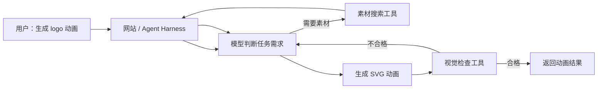
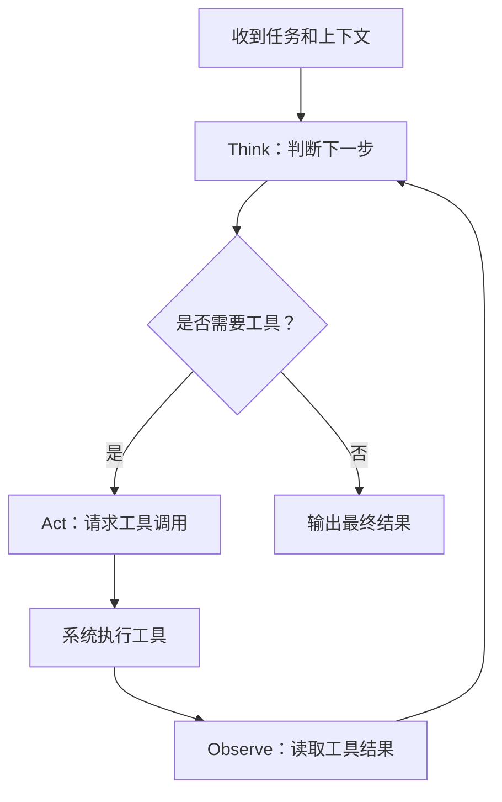
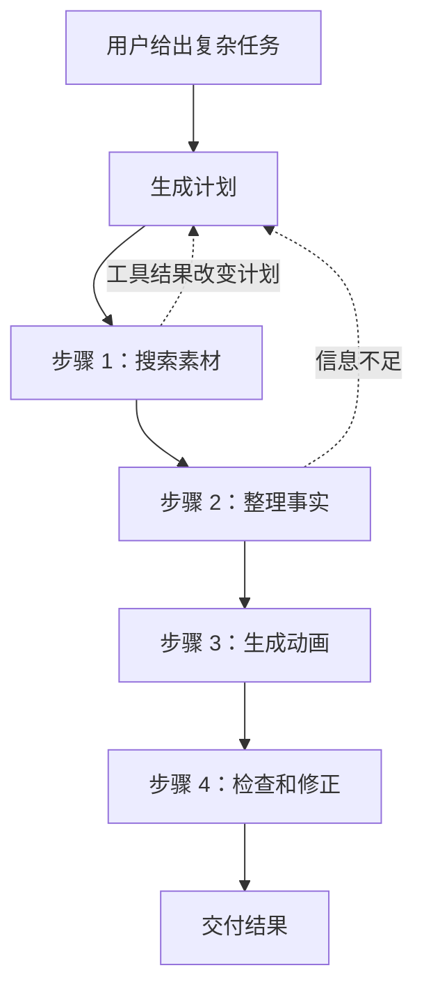
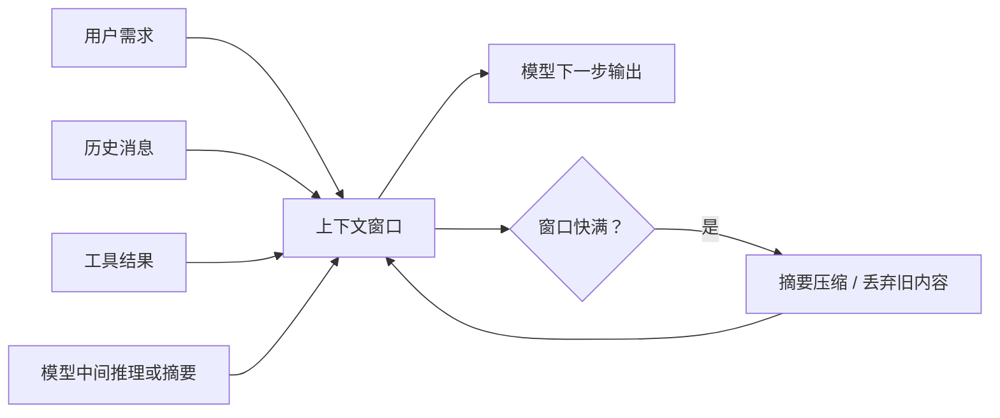
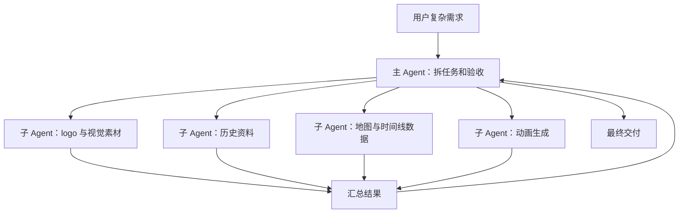
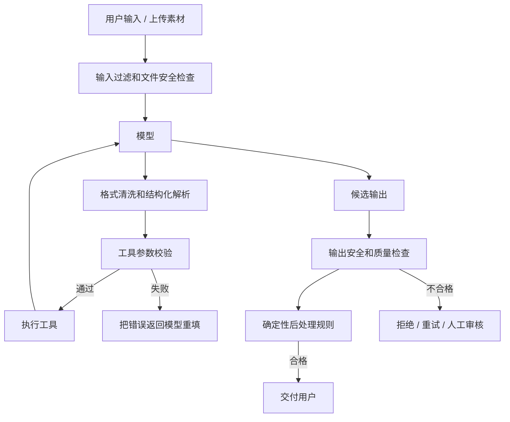

# AI Agent 工作原理与 Harness 工程

日期：2026-05-26

来源视频：[AI Agent工作原理是什么，Harness又是什么，一个动画彻底搞懂！](https://www.youtube.com/watch?v=B91bZL8wcAI)

频道：轩辕的编程宇宙

发布时间：2026-05-18

时长：10:59

本地素材：

- 视频：`local-media/youtube/2026-05-18-xuanyuan-ai-agent-harness/AI Agent工作原理是什么，Harness又是什么，一个动画彻底搞懂！ [B91bZL8wcAI].quicktime.mp4`
- 字幕：`local-media/youtube/2026-05-18-xuanyuan-ai-agent-harness/AI Agent工作原理是什么，Harness又是什么，一个动画彻底搞懂！ [B91bZL8wcAI].zh-Hans.srt`
- 字幕说明：YouTube 未暴露可直接使用的标准字幕轨道，本字幕由本地 `whisper.cpp` ASR 生成，未逐句人工校对；术语如 ReAct、Plan-and-Execute、Harness 在原始转写中存在明显识别错误。
- 元数据：`local-media/youtube/2026-05-18-xuanyuan-ai-agent-harness/AI Agent工作原理是什么，Harness又是什么，一个动画彻底搞懂！ [B91bZL8wcAI].quicktime.info.json`
- 关键画面抽帧：`local-media/youtube/2026-05-18-xuanyuan-ai-agent-harness/frames/`
- 评论原始数据：`local-media/youtube/2026-05-18-xuanyuan-ai-agent-harness/comments.json`
- 评论摘要素材：`local-media/youtube/2026-05-18-xuanyuan-ai-agent-harness/comments-digest.md`

说明：`local-media/` 是本地沉淀目录，不应提交进 Git。

## 配套资源 / 代码地址

- 视频：https://www.youtube.com/watch?v=B91bZL8wcAI
- 往期推荐：Agent Skills 视频：https://www.youtube.com/watch?v=zhlp2y2XAq0&t=9s
- 往期推荐：MCP 视频：https://www.youtube.com/watch?v=IjISe8ThHvY&t=6s
- 代码仓库：视频简介、元数据和评论区未发现具体代码仓库地址。
- 其他资料：评论区作者提到 `svganimate.ai`，但未给出完整链接；只作为线索，不当作已核验资源。

## 评论区补充

- 作者置顶评论给出 X 账号：https://x.com/xuanyuanzhifeng
- 有观众追问视频中的动画工具，作者回复“svganimate.ai，可以看我主页最新一期视频哈，有详细讲解动画制作方法”。这说明视频里的 logo 动画例子可能来自作者自己的动画工具链，但评论区未提供可复现代码。
- 高赞评论主要反馈“言简意赅”“讲得清晰”，没有出现对技术细节的纠错。
- 有评论提到 API token 成本和网页版/编程软件之间反复搬运的问题。这个点没有被视频展开，但它提醒我们：Agent Harness 的工程边界不只是安全和格式，也包括成本、额度、账号和工具入口的约束。

## Fieldbook 归档判断

- 内容类型：资料消化，带 Agent 工程概念整理。
- 当前归档：`wiki/notes/agent-systems/`
- 是否值得升级为 lab：暂不升级。
- 判断理由：视频用动画解释 Agent、ReAct、上下文、多 Agent 和 Harness 的概念，本身不是具体 SDK、API 或源码教程。真正值得做实验的是“把 SVG 动画生成 Agent 外围的 Harness 做成最小可运行样例”，但那需要另开明确目标，不该在这次笔记里顺手乱加。
- 后续应进入：暂不升级；若要验证，可进入 `wiki/labs/` 做一个最小 Harness 实验，验证 JSON schema 校验、工具参数校验、输出清洗、SVG 安全扫描和视觉检查闭环。

## 一句话结论

Agent 解决的是“模型如何通过思考、行动、观察来干活”；Harness 解决的是“模型干活时如何不把系统搞崩”。没有 Harness 的 Agent 只是会调用工具的聊天模型，能 demo，不等于能进生产。

## 视频时间轴

| 时间 | 主题 | 要点 |
|---|---|---|
| 00:00 | logo 动画例子 | 直接让模型画 SVG logo 容易失败；人工找 SVG 素材后，效果明显变好。 |
| 00:38 | 工具调用雏形 | 把“找素材”封装成后台工具，模型判断需要素材时请求调用。 |
| 01:46 | 视觉检查工具 | 增加渲染和视觉检查工具，让模型生成后自检，失败则重画。 |
| 02:12 | ReAct 循环 | 把过程拆成思考、行动、观察，并重复直到结果可用。 |
| 03:33 | Plan-and-Execute | 除了走一步看一步，还可以先规划任务清单再执行；真实 Agent 往往混用两种模式。 |
| 03:58 | 记忆和上下文 | 大模型本身不记得历史，每轮需要带上对话和工具结果；上下文窗口会成为硬限制。 |
| 05:21 | 上下文压缩 | 对话过长时用摘要替代旧内容，但压缩会丢信息。 |
| 06:01 | 多 Agent 协作 | 复杂任务可以拆给多个子 Agent，每个子任务有独立上下文，主 Agent 只收最终结果。 |
| 06:48 | Agent 核心知识 | 工具调用、ReAct 循环、记忆与上下文管理、多 Agent 协作构成基础框架。 |
| 07:01 | 格式错误 | 模型可能不按 JSON 等格式输出，需要清洗、解析和重试。 |
| 07:55 | 参数校验 | 工具参数可能填错类型或范围，调用前必须校验，不通过就让模型重填。 |
| 08:24 | 输入和提示注入 | 用户输入和上传素材可能包含恶意指令或恶意代码，需要输入过滤和文件安全检查。 |
| 09:08 | 输出过滤 | 输出内容可能违规或不符合产品要求，不能直接交给用户。 |
| 09:12 | 代码兜底 | 反复出现的确定性错误，不该靠提示词祈祷，应该用代码规则直接修正。 |
| 09:48 | Harness 定义 | 输入过滤、格式清洗、参数校验、工具调用、输出过滤、错误重试等外围工程构成 Harness。 |
| 10:24 | 总结 | Agent 和 Harness 组合起来，才接近可进入真实世界工作的 AI 应用。 |

## 1. 从聊天模型到 Agent

视频的例子很朴素：用户想生成一个苹果 logo 动画，直接把需求丢给模型，模型可能画得很糟；如果先找一个真实 SVG logo，再让模型参考，结果会好很多。

关键变化不是“提示词更聪明”，而是系统给模型提供了外部工具：

- 素材搜索工具：模型需要 logo 时，可以请求后台搜索 SVG 素材。
- 视觉检查工具：模型生成动画后，可以把 SVG 渲染成图片，再检查结果是否合格。
- 生成工具链：把用户需求、素材、检查结果和最终输出连接起来。

这就是 Agent 的雏形。模型不再只是回答文本，而是在任务状态里选择下一步动作。



这里的好品味是：不要把“找素材”写成一堆自然语言建议，让模型自己幻想；把它变成一个有输入、有输出、有错误边界的工具。

## 2. ReAct：思考、行动、观察

视频把 Agent 的基本循环拆成三步：

- 思考：模型理解任务，判断需要什么信息、素材或动作。
- 行动：模型请求调用某个工具，并给出参数。
- 观察：系统执行工具，把结果返回给模型，模型再决定下一步。

这就是 ReAct 的核心形状：Reasoning and Acting。它不是玄学，就是一个循环。



ReAct 适合任务路径不确定、需要边做边看的场景，比如搜索、排错、代码修改、资料整理。它的代价也明显：循环次数越多，延迟、成本、上下文占用和失败面都会上升。

## 3. Plan-and-Execute：先规划再执行

视频还提到另一种模式：Plan-and-Execute。它先生成一个任务清单，再逐步执行。

这和 ReAct 不是二选一。真实 Agent 经常混用：

- 大方向先规划，避免模型像无头苍蝇一样乱跑。
- 每一步执行时再用 ReAct，根据工具结果调整下一步。



工程上别迷信模式名。真正的问题是：任务是否需要全局计划？执行中是否需要根据观察结果改路线？答案决定编排方式。

## 4. 上下文不是记忆，只是工作台

视频用病例本类比上下文：模型本身不会永久记住前面的对话，每轮请求都要把相关历史、用户需求、工具结果、系统规则一起放进上下文。

这带来两个现实问题：

- 上下文会越来越长，直到超过窗口限制。
- 压缩或丢弃旧上下文会损失细节，模型可能忘掉前面已经定下的约束。



这里的坏味道是把上下文当无限垃圾桶。好设计应该尽早把状态结构化：哪些事实必须保留，哪些工具结果可以摘要，哪些中间过程根本不该继续塞回模型。

## 5. 多 Agent 不是炫技，是上下文隔离手段

视频用“复杂苹果公司发展历程动画”解释多 Agent：一个模型既要找 logo，又要查历史资料，又要找地图数据，还要做时间线和动画，全部塞给一个上下文，迟早爆炸。

更合理的结构是：

- 主 Agent 理解需求、拆分任务、收敛结果。
- 子 Agent 分别执行资料搜索、素材整理、地图数据、动画生成等任务。
- 每个子 Agent 有独立上下文，主 Agent 只需要最终产物和关键依据。



但别把多 Agent 当默认答案。视频里这个点容易被初学者误读。大多数项目先把单 Agent 的工具、状态、评估和权限做好。否则多 Agent 只是把一个混乱系统拆成多个混乱系统。

## 6. Harness：把模型关进工程边界

视频后半段的重点是 Harness。模型会犯的错不是一种，而是一串：

- 输出格式不合法：要求 JSON，它前面加一句“好的，我来帮你”。
- 工具参数不合法：需要城市名和年份，它填了“苹果第一家旗舰店”和“1980年代”。
- 用户提示注入：要求忽略前面指令，输出系统提示词。
- 上传素材带恶意内容：SVG 里可能嵌入脚本或危险引用。
- 输出内容不合规：生成了不该直接发给用户的内容。
- 反复犯同一个设计错误：比如总用纯白背景。

这些问题不能靠“请你务必严格遵守”解决。该用代码挡住的，就用代码挡住。



Harness 的本质是模型外面的工程系统。它负责把非确定性的模型行为放进可解析、可校验、可回放、可拒绝、可审计的边界里。

## 7. 数据结构视角

这个视频的核心数据结构可以抽象成：

```text
AgentRun = {
  user_request,
  messages,
  state,
  tools,
  tool_calls,
  observations,
  context_budget,
  guardrails,
  final_output
}

Harness = {
  input_filter,
  file_scanner,
  output_parser,
  schema_validator,
  tool_executor,
  retry_policy,
  output_filter,
  deterministic_fixes,
  human_review_policy,
  trace_log
}
```

如果这两个结构没想清楚，只是在提示词里堆“你要认真、严谨、安全、不要出错”，那就是糟糕设计。提示词不是权限系统，不是类型系统，也不是安全沙箱。

## 工程提醒

1. 工具调用前必须做参数校验。模型给出的参数只是候选值，不是可信输入。
2. 文件上传必须走安全检查，尤其是 SVG、HTML、Office、压缩包和脚本类文件。
3. 输出格式要用结构化解析和 schema 校验，不要靠自然语言承诺。
4. 高频确定性错误要用代码修，不要反复加提示词补丁。
5. 高风险动作必须有人审：执行 shell、写文件、改数据库、发邮件、支付、部署、账号操作都不能让模型裸奔。
6. 上下文压缩会丢信息，关键约束要结构化存储，不能只留在聊天历史里。
7. 多 Agent 的价值在任务隔离和上下文隔离，不是为了显得系统复杂。

## 工程判断

- 适合什么场景：这个视频适合建立 Agent 入门心智，尤其适合理解“工具调用不是 Agent 的全部，外围 Harness 才决定能不能稳定运行”。
- 不适合什么场景：不适合作为某个框架或 SDK 的实现教程；视频没有给出代码、接口、完整架构或可运行项目。
- 风险和边界：视频为了通俗会简化很多细节，例如视觉检查如何判定、工具调用如何定义 schema、SVG 如何安全沙箱化、上下文压缩如何保留关键事实，这些都需要工程实现补足。
- 好品味判断：先把输入、状态、工具、输出和错误处理建模清楚，再考虑多 Agent。数据结构错了，后面全是补丁。

## 后续研究问题

- ReAct、Plan-and-Execute、Workflow、Agent 在工程边界上如何区分？哪些场景应该用确定性 workflow 而不是 Agent？
- Harness 应该包含哪些最小模块，才能支持一个可上线的工具调用 Agent？
- SVG/HTML 这类可执行或半可执行素材，应如何做安全扫描、沙箱渲染和内容隔离？
- 视觉检查工具到底应该用多模态模型、规则检测，还是两者结合？
- 上下文压缩怎样避免丢失关键约束？哪些状态应该结构化存储在系统外部？
- 多 Agent 协作什么时候真的改善结果，什么时候只是增加延迟、成本和调试难度？

## 实验验证建议

- 要验证什么：一个 logo 动画 Agent 加上 Harness 后，是否比裸模型调用更稳定。
- 最小实验形式：构建一个小型 CLI 或 Web demo，包含 mock 素材搜索、SVG 生成、JSON schema 校验、SVG 安全扫描、渲染截图、视觉检查和失败重试。
- 是否现在就做：否。当前任务是视频资料消化；实验应该单独开 `wiki/labs/agent-harness-svg-demo/`，并明确验收标准。

## 参考资料

- 视频：AI Agent工作原理是什么，Harness又是什么，一个动画彻底搞懂！ https://www.youtube.com/watch?v=B91bZL8wcAI
- ReAct 论文：ReAct: Synergizing Reasoning and Acting in Language Models https://arxiv.org/abs/2210.03629
- OpenAI Agents SDK 文档：https://openai.github.io/openai-agents-python/

## 未验证事项

- 本笔记基于本地 ASR 字幕、元数据、评论摘要和关键帧 contact sheet 整理；字幕未逐句人工校对。
- 没有运行视频中提到的动画生成工具，也没有复现 SVG 生成、视觉检查或 Harness 流程。
- 视频提到的产品例子，如 Claude Code、Codex、OpenCode 等，仅按视频语境记录；本笔记未逐项核对这些产品的当前实现细节。
- 评论区提到的 `svganimate.ai` 未核验完整站点和功能。
- 参考资料中的 OpenAI Agents SDK 仅作为后续研究入口；本笔记没有使用其 API 行为来证明视频观点。
