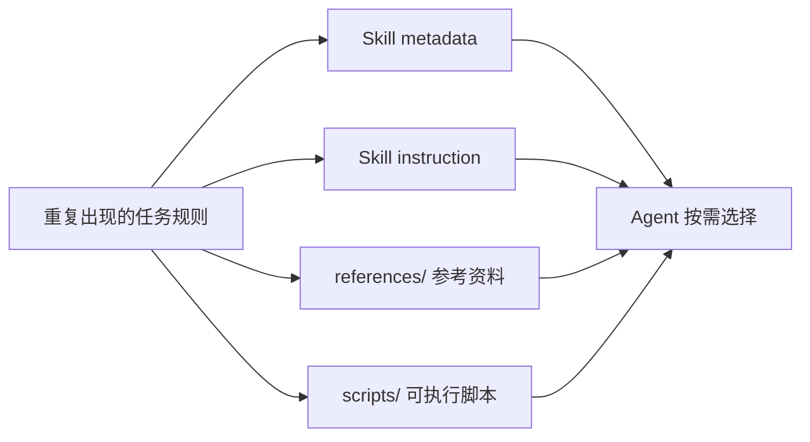
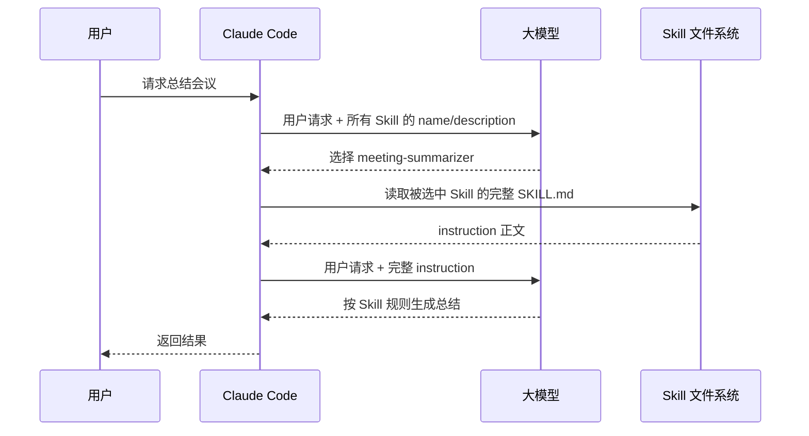
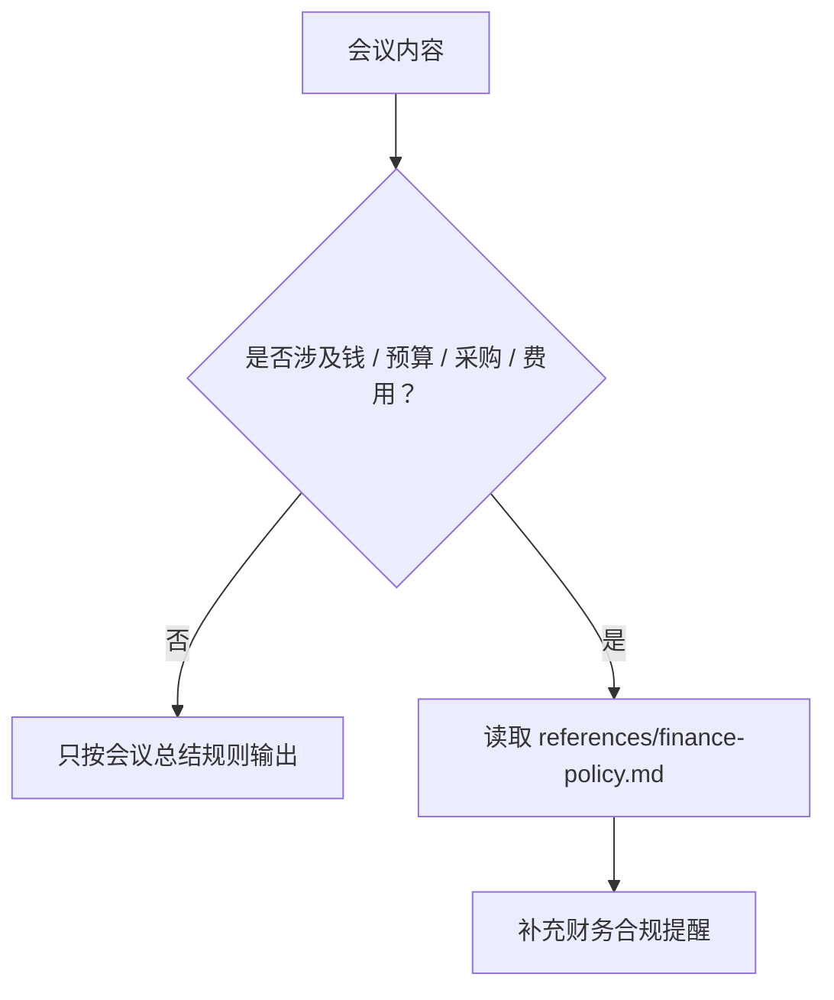
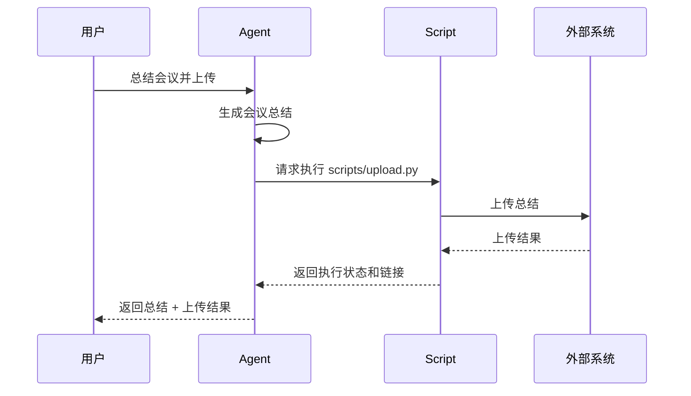
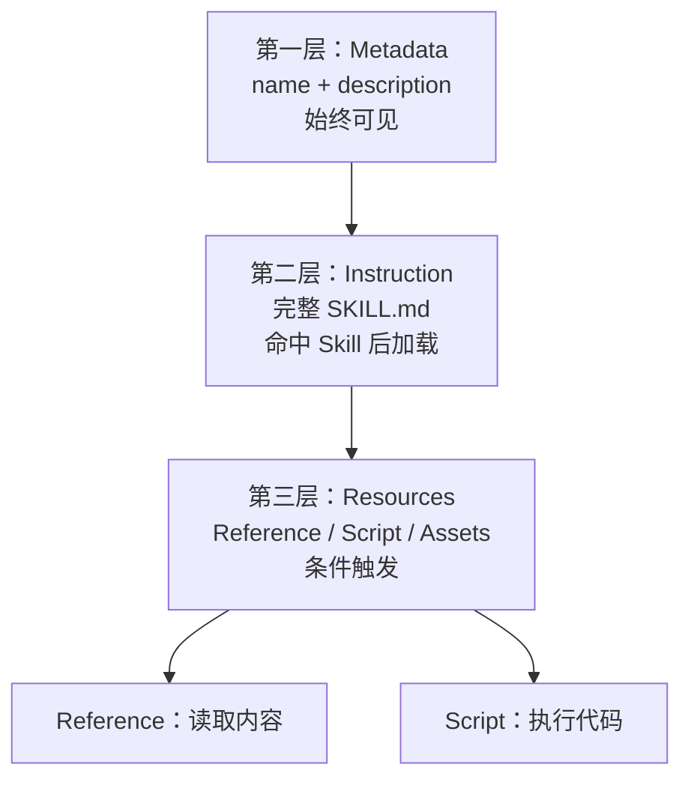
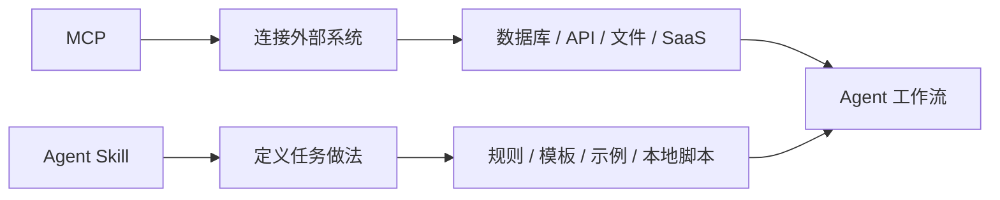

# Agent Skill 从使用到原理，一次讲清

日期：2026-05-12

来源视频：[Agent Skill 从使用到原理，一次讲清](https://www.youtube.com/watch?v=yDc0_8emz7M)

频道：马克的技术工作坊

发布时间：2025-12-31

时长：17:42

本地素材：

- 视频：`local-media/youtube/2025-12-31-mark-agent-skill-usage-principles/Agent Skill 从使用到原理，一次讲清 [yDc0_8emz7M].quicktime.mp4`
- 字幕：`local-media/youtube/2025-12-31-mark-agent-skill-usage-principles/Agent Skill 从使用到原理，一次讲清 [yDc0_8emz7M].quicktime.zh-Hans.srt`
- 字幕说明：字幕来源为 YouTube 字幕或自动字幕，不是本地 ASR；本笔记未逐句人工校对字幕。
- 元数据：`local-media/youtube/2025-12-31-mark-agent-skill-usage-principles/Agent Skill 从使用到原理，一次讲清 [yDc0_8emz7M].quicktime.info.json`
- 缩略图：`local-media/youtube/2025-12-31-mark-agent-skill-usage-principles/Agent Skill 从使用到原理，一次讲清 [yDc0_8emz7M].quicktime.webp`
- 关键画面抽帧：`local-media/youtube/2025-12-31-mark-agent-skill-usage-principles/frames/`
- 关键画面总览：`local-media/youtube/2025-12-31-mark-agent-skill-usage-principles/frames/contact-keyframes.jpg`
- 评论原始数据：`local-media/youtube/2025-12-31-mark-agent-skill-usage-principles/comments.json`
- 评论摘要素材：`local-media/youtube/2025-12-31-mark-agent-skill-usage-principles/comments-digest.md`

说明：`local-media/` 是本地沉淀目录，不应提交进 Git。

## 配套资源 / 代码地址

- 视频：<https://www.youtube.com/watch?v=yDc0_8emz7M>
- Agent Skills 标准站点：<https://agentskills.io/home>
- Anthropic Skills 说明：<https://claude.com/blog/skills-explained>
- Claude Code Skills 文档：<https://code.claude.com/docs/en/skills>
- OpenAI Codex Skills 文档：<https://developers.openai.com/codex/skills/>
- Cursor Skills 文档：<https://cursor.com/cn/docs/context/skills>
- VS Code Copilot Agent Skills 文档：<https://code.visualstudio.com/docs/copilot/customization/agent-skills>
- 相关视频：
  - <https://www.youtube.com/watch?v=GE0pFiFJTKo>
  - <https://www.youtube.com/watch?v=25DEMZ7wsSM&t=16s>
  - <https://www.youtube.com/watch?v=geEDnyFY_dw>
- 相关本地笔记：
  - [从 LLM 到 Agent Skill，一期视频带你打通底层逻辑！](从%20LLM%20到%20Agent%20Skill，一期视频带你打通底层逻辑！.md)
  - [为什么越来越多的人抛弃 MCP，转向 CLI？](../mcp-cli-browser/为什么越来越多的人抛弃%20MCP，转向%20CLI？.md)

## 评论区补充

- 已抓取 200 条评论。
- 置顶评论纠正了视频为了演示做的简化：中文 Skill 名在 Claude Code 中实测可用，但更通用的命名应使用小写英文加短横线，例如 `meeting-summarizer`。
- 置顶评论还补充了目录规范：视频把资源文件放在 Skill 根目录，官方更推荐把 Reference 放到 `references/`，把 Script 放到 `scripts/`，目录边界更清楚。
- 高赞评论里有人把 Skill 理解成“把臃肿 context 模块化，再让模型判断 when/where/if”。这个说法抓住了一半：Skill 的确在做上下文模块化，但判断权交给模型会提高对模型能力和审批机制的要求。
- 有评论认为简单 Skill 可以用 System Prompt 替代。这个判断成立，但只适用于规则很短、不会复用、不需要附带文件和脚本的场景。
- 有评论认为 Skill 和 MCP 在能力上重叠，Reference 像 MCP Resources/Prompts，Script 像 MCP Tools。这个对比有启发，但不能忽略部署形态差异：MCP 是独立服务协议，Skill 是文件化的任务说明和本地资源包。
- 有评论提出每次询问是否使用 Skill 会把用户绑在流程里，应引入 role-based security policy。这个是严肃的工程问题：默认审批适合个人工具，不等于企业自动化策略。

## Fieldbook 归档判断

- 内容类型：技术研究
- 当前归档：`wiki/notes/`
- 是否值得升级为 lab：是，但本次不直接升级。
- 判断理由：视频不仅讲概念，还给了可复现的 Skill 目录、`SKILL.md`、Reference 文件和 Script 文件的组合方式，适合后续做一个最小 Skill 实验，验证渐进式披露、资源加载和脚本执行边界。当前任务只是沉淀视频笔记，先不引入额外实验。
- 后续应进入：`wiki/labs/` 可以做一个 `agent-skills-minimal` 实验；如果形成跨来源稳定判断，再补到 `wiki/topics/ai/`。

## 一句话结论

Agent Skill 的本质不是把 Prompt 写长，而是把可复用的工作规则、参考资料和可执行脚本打包成一个按需加载的能力单元：模型先看轻量目录，命中任务后再读指令，必要时再读 Reference 或执行 Script。

## 视频时间轴

| 时间 | 主题 | 要点 |
|---|---|---|
| 00:00 | 视频内容简介 | Agent Skill 从 Claude 单点能力扩展成跨产品通用设计模式；视频要解释痛点、用法和与 MCP 的关系。 |
| 01:25 | Agent Skill 是什么 | 最朴素理解：给模型随时翻阅的说明文档；更完整理解：可复用任务能力包。 |
| 02:22 | 基本用法 | 在 Claude Code 中创建会议总结 Skill，用 `skill.md` 写 metadata 和 instruction。 |
| 05:30 | 按需加载 | 模型先只看到所有 Skill 的名称和描述，选中后才加载完整 `skill.md`。 |
| 07:21 | Reference | 把长财务手册等资料拆到独立文件，只在任务触发财务规则时读取。 |
| 11:21 | Script | 把上传等动作写成脚本，让 Agent 执行脚本而不是把脚本全文塞进上下文。 |
| 13:49 | 渐进式披露 | 三层结构：metadata 始终可见，instruction 按需加载，resource 按需中的按需加载。 |
| 15:42 | Agent Skill vs MCP | MCP 连接数据，Skill 教模型如何处理数据；两者有重叠，但适合边界不同。 |

## 1. Agent Skill 解决的真问题

视频把 Agent Skill 解释成“说明文档”，这个类比够好，但还不完整。

真正的问题是：很多任务不是一次性 Prompt，而是一套会反复使用的工作规矩。例如会议总结要固定输出参会人、议题、决定；客服投诉要先安抚情绪，不能乱承诺；报销会议要检查财务制度。

如果每次都把这些规则粘进对话，就是低级重复。更糟的是规则会越写越长，最后污染上下文。

Agent Skill 把这些规则沉淀成一个文件化能力：



这不是装饰性的 Prompt 管理。好 Skill 的关键在于把“什么时候用、怎么做、需要什么资料、能执行什么动作”写清楚。

## 2. 基本结构：metadata 和 instruction

视频用“会议总结助手”演示基本用法。一个 Skill 至少有一个 `SKILL.md` 或视频中演示的 `skill.md` 文件。文件分两层：

| 层级 | 作用 | 是否始终进入上下文 |
|---|---|---|
| Metadata | `name` 和 `description`，让模型知道这个 Skill 适合什么任务。 | 是，作为轻量目录暴露给模型。 |
| Instruction | 详细规则、输出格式、示例、边界。 | 否，只有模型选择这个 Skill 后才加载。 |

视频里的会议总结 Skill 规则很简单：总结参会人员、议题和决定，并给出输入输出示例。

一个更稳的命名和目录习惯是：

```text
meeting-summarizer/
  SKILL.md
  references/
  scripts/
```

置顶评论已经把坑指出来了：中文目录名在 Claude Code 演示中能跑，但跨工具兼容性更差。用小写英文和短横线，少制造问题。

## 3. 基本调用流程：先看目录，再读正文

视频讲的第一个核心机制是按需加载。



这个设计的好处很实际：你可以装很多 Skill，但模型每次不用吞下所有 Skill 的全文。metadata 是目录，instruction 是正文，正文只有命中时才读。

坏设计则正好相反：把所有规则全塞进系统提示词。那不是“智能”，那是把垃圾搬进上下文窗口。

## 4. Reference：长资料不要塞进 SKILL.md

视频的第二个机制是 Reference。场景是会议总结里如果提到钱、预算、采购、费用，就需要参考集团财务手册，判断金额是否超标。

如果把整本财务手册写进 `SKILL.md`，每次开普通早会也要加载财务制度，纯属浪费。正确做法是把财务手册拆成独立 Reference 文件，只在规则触发时读取。



Reference 的性质：

- 它是可读资料，会进入模型上下文。
- 它适合放规范、模板、制度、示例、术语表。
- 它应该被条件触发，而不是默认加载。
- 它会消耗 Token，所以必须控制粒度。

这里的好品味很简单：别让无关资料污染每次任务。需要时再读，不需要就躺在硬盘上。

## 5. Script：让代码跑起来，而不是让模型读代码

视频的第三个机制是 Script。例子是 `upload.py`：会议总结生成后，如果用户要求上传到服务器，Claude Code 会请求执行脚本完成上传。

这和 Reference 不同。Reference 是读，Script 是跑。

| 类型 | Agent 做什么 | 是否消耗上下文 | 适合内容 |
|---|---|---|---|
| Reference | 读取文件内容 | 会 | 规则、制度、模板、示例、术语解释 |
| Script | 执行脚本并读取结果 | 通常不会读源码；结果会进入上下文 | 上传、转换、计算、校验、批处理 |



这条边界很关键：复杂业务逻辑应该尽量放在脚本里，不要让模型读一万行代码再猜怎么执行。模型只需要知道脚本何时运行、怎么传参、输出代表什么。

但别犯傻。Script 能执行代码，就意味着权限风险。上传、写文件、调用 shell、改数据库、发邮件、部署这些动作必须有人审，或者有明确的策略和沙箱。

## 6. 渐进式披露：三层上下文预算

视频里最值得沉淀的是“渐进式披露”。



这个结构解决的是上下文预算问题，不是文件夹美观问题。

| 层级 | 加载策略 | 成本模型 |
|---|---|---|
| Metadata | 总是加载 | 必须短，否则装多个 Skill 就爆。 |
| Instruction | 选中 Skill 后加载 | 可以写清楚任务流程，但不能当资料仓库。 |
| Reference | 条件读取 | 会进入上下文，适合分块和命名清楚。 |
| Script | 条件执行 | 源码通常不进上下文，但执行结果会进；风险在权限。 |

写 Skill 的核心手艺，就是把信息放到正确层级。放错层级，就会变成两种烂东西：要么上下文肥胖，要么模型根本不知道该干什么。

## 7. Agent Skill 和 MCP 的区别

视频引用 Anthropic 的说法：MCP 连接 Claude 到数据，Skills 教 Claude 如何处理这些数据。这个区分很有用。



更工程化一点：

| 维度 | MCP | Agent Skill |
|---|---|---|
| 本质 | 独立运行的服务协议 | 文件化的工作说明和资源包 |
| 主要职责 | 暴露外部数据和工具 | 教模型如何完成某类任务 |
| 适合场景 | 稳定 API、权限边界、远程服务、多客户端复用 | 任务流程、模板、局部知识、轻量脚本 |
| 风险 | Server 质量、权限设计、提示注入、部署维护 | 规则写烂、脚本权限过大、跨工具兼容性 |
| 最佳组合 | MCP 提供连接能力 | Skill 定义处理规则 |

视频里说 Skill 也能写代码连接数据，所以和 MCP 有能力重叠。这话没错，但不能因为能做就乱做。轻量脚本放 Skill 里可以；长期运行、权限复杂、多人共享、远程数据访问，还是用 MCP 或正式 API 更像样。

## 8. 写 Skill 的工程准则

1. `description` 要写触发条件，不要写空话。模型靠它判断是否使用 Skill。
2. `SKILL.md` 写流程和边界，不要堆大段资料。
3. 长资料放 `references/`，并在 instruction 里说明什么时候读。
4. 脚本放 `scripts/`，明确命令、输入、输出、失败时怎么处理。
5. Skill 名和目录名用小写英文加短横线，别为了演示方便牺牲兼容性。
6. 高风险脚本必须有人审，尤其是 shell、文件写入、数据库、邮件、支付、部署和账号操作。
7. 不要把 Skill 当作万能抽象。简单规则用系统提示词就够，稳定外部能力用 MCP 或 API。

## 工程判断

- 适合什么场景：重复任务模板、团队写作规范、会议总结、报告生成、领域术语解释、轻量文件转换、低风险本地脚本。
- 不适合什么场景：权限复杂的企业集成、长期运行服务、强审计要求的数据访问、需要多租户隔离的 SaaS、会修改真实生产状态的自动化。
- 风险和边界：Skill 把工作流门槛降下来了，也把“谁都能写一个能执行脚本的能力包”的风险带进来了。降低门槛不是免除治理。

## 后续研究问题

- OpenAI Codex、Claude Code、VS Code、Cursor 对 Skill 文件名、目录结构、资源加载的兼容差异是什么？
- `description` 应该怎么写，才能减少误触发和漏触发？
- Script 执行审批能否用 policy 自动化，而不是每次都打断用户？
- Skill 与 MCP 组合时，边界应如何分层：MCP 取数，Skill 写处理规则，还是反过来？
- 团队共享 Skill 时如何做版本管理、审查、回滚和安全扫描？

## 实验验证建议

- 要验证什么：同一个会议总结任务，在“纯 Prompt”“单 SKILL.md”“SKILL.md + Reference”“SKILL.md + Script”四种形态下，Token 消耗、触发准确率和输出稳定性有什么差异。
- 最小实验形式：做一个 `meeting-summarizer` Skill，包含 `SKILL.md`、`references/finance-policy.md`、`scripts/upload.py`，用 5 段会议文本测试是否按需读取和执行。
- 是否现在就做：否。本次任务是视频沉淀，没有创建或运行新的 Skill 实验。
- 可放置位置：`wiki/labs/agent-skills-minimal/` 或后续放入 OpenAI/Codex 主线实验目录。

## 参考资料

- 视频：<https://www.youtube.com/watch?v=yDc0_8emz7M>
- Agent Skills 标准站点：<https://agentskills.io/home>
- Anthropic Skills 说明：<https://claude.com/blog/skills-explained>
- Claude Code Skills 文档：<https://code.claude.com/docs/en/skills>
- OpenAI Codex Skills 文档：<https://developers.openai.com/codex/skills/>
- Cursor Skills 文档：<https://cursor.com/cn/docs/context/skills>
- VS Code Copilot Agent Skills 文档：<https://code.visualstudio.com/docs/copilot/customization/agent-skills>
- 本地相关笔记：[从 LLM 到 Agent Skill，一期视频带你打通底层逻辑！](从%20LLM%20到%20Agent%20Skill，一期视频带你打通底层逻辑！.md)
- 本地相关笔记：[为什么越来越多的人抛弃 MCP，转向 CLI？](../mcp-cli-browser/%E4%B8%BA%E4%BB%80%E4%B9%88%E8%B6%8A%E6%9D%A5%E8%B6%8A%E5%A4%9A%E7%9A%84%E4%BA%BA%E6%8A%9B%E5%BC%83%20MCP%EF%BC%8C%E8%BD%AC%E5%90%91%20CLI%EF%BC%9F.md)

## 未验证事项

- 本笔记基于 YouTube 字幕/自动字幕、元数据、关键画面、评论区和官方页面快速核对整理，未逐句人工校对字幕。
- 没有在 Claude Code、Codex、Cursor 或 VS Code 中实测同一个 Skill 的跨工具兼容性。
- 没有创建 `meeting-summarizer` 示例 Skill，也没有运行视频里的 `upload.py` 脚本。
- 没有验证视频中提到的具体日期在所有官方发布渠道中的完整背景，只按视频说法和已打开的官方入口做了笔记边界处理。
- 没有测试 Reference 是否在不同客户端中都严格按需读取；不同产品实现可能不同。
- 没有测试 Script 在不同客户端中的审批、沙箱、权限和日志行为。
